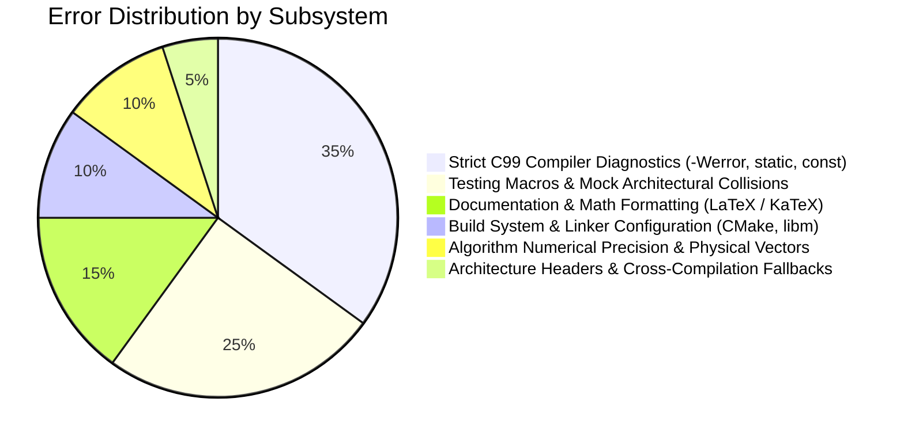

# Project Error & Incident Ledger

This directory maintains an immutable, chronological record of all bugs, compiler errors, linker faults, math calibration issues, and documentation formatting errors encountered during the engineering lifecycle of the **Tea Plantation Rain Prediction System**.

---

## Chronological Index of Errors

| ID | Date & Time | Commit | Component / Subsystem | Error Title & Summary | Report File |
| :---: | :---: | :---: | :--- | :--- | :--- |
| **`ERR-001`** | 2026-09-09 11:42:53 | [`ad6662b`](https://github.com/Thejus26/rain-predict/commit/ad6662ba4389ca362379a7839a908a684206e2c7) | Documentation (Algorithms) | **KaTeX Table Rendering Error**: LaTeX `\text{}` commands and math pipes broke GFM table parsing. | [ERR-001 Report](file:///C:/Users/ENERGY%20SAVER/Documents/Learning/Job%20Projects/rain-predict/context/errors/ERR-001-2026-09-09-katex-table-rendering-error.md) |
| **`ERR-002`** | 2026-09-09 14:19:49 | [`cc89f54`](https://github.com/Thejus26/rain-predict/commit/cc89f54f7aa8783a39b70ed822c7af9b464bddc9) | Documentation (Specs) | **LaTeX Escape Formatting across Sprint 4 Specs**: Unescaped hex addresses and polynomial operators. | [ERR-002 Report](file:///C:/Users/ENERGY%20SAVER/Documents/Learning/Job%20Projects/rain-predict/context/errors/ERR-002-2026-09-09-latex-escape-formatting-in-sprint-4-specs.md) |
| **`ERR-003`** | 2026-09-09 20:59:06 | [`914e979`](https://github.com/Thejus26/rain-predict/commit/914e979d96ce059e7cf3b92a253584826bac006c) | Documentation (Specs) | **KaTeX Unit Formatting in S7-T2.1 Spec**: KaTeX parse failure on microampere-hour unit strings. | [ERR-003 Report](file:///C:/Users/ENERGY%20SAVER/Documents/Learning/Job%20Projects/rain-predict/context/errors/ERR-003-2026-09-09-katex-formatting-in-s7-t2-1-spec.md) |
| **`ERR-004`** | 2026-09-11 11:51:26 | [`30ef630`](https://github.com/Thejus26/rain-predict/commit/30ef630988e7fa0b30b8594d723dd02c98e49494) | Build System (CMake) | **CMake Generator Expression List Expansion**: Semicolon-delimited compiler flags passed as single invalid string. | [ERR-004 Report](file:///C:/Users/ENERGY%20SAVER/Documents/Learning/Job%20Projects/rain-predict/context/errors/ERR-004-2026-09-11-cmake-generator-expression-list-expansion.md) |
| **`ERR-005`** | 2026-09-11 11:53:22 | [`46f2e54`](https://github.com/Thejus26/rain-predict/commit/46f2e540b4a9ea9ac63e81b3f2d7ae006f918849) | Testing (Unity) | **Unity Compiler Diagnostics & Missing stdio.h**: Unchecked `snprintf`, unused color strings, missing `<stdio.h>`. | [ERR-005 Report](file:///C:/Users/ENERGY%20SAVER/Documents/Learning/Job%20Projects/rain-predict/context/errors/ERR-005-2026-09-11-unity-unused-const-warning-and-missing-stdio.md) |
| **`ERR-006`** | 2026-09-11 14:30:33 | [`c5296ab`](https://github.com/Thejus26/rain-predict/commit/c5296abba28d13fd8abd77641f7ded7d6e78b937) | Tests (Mock I2C) | **Missing static Qualifiers in test_mock_i2c**: Missing prototypes under `-Wmissing-prototypes -Werror`. | [ERR-006 Report](file:///C:/Users/ENERGY%20SAVER/Documents/Learning/Job%20Projects/rain-predict/context/errors/ERR-006-2026-09-11-missing-static-qualifiers-in-test-mock-i2c.md) |
| **`ERR-007`** | 2026-09-11 14:33:02 | [`0a33eec`](https://github.com/Thejus26/rain-predict/commit/0a33eec3e8d20e597f9edaea71168d97d04b0a31) | Mock Drivers (Mock I2C) | **Mock I2C Unintended State Mutation**: Reading unconfigured addresses created phantom virtual devices. | [ERR-007 Report](file:///C:/Users/ENERGY%20SAVER/Documents/Learning/Job%20Projects/rain-predict/context/errors/ERR-007-2026-09-11-mock-i2c-device-search-state-mutation.md) |
| **`ERR-008`** | 2026-09-11 15:46:40 | [`cf79673`](https://github.com/Thejus26/rain-predict/commit/cf7967343d9cfc2451a7548a5017376ba83e9613) | Tests (Sanity) | **Missing Prototypes Warning in test_sanity**: Global unit test declarations without `static`. | [ERR-008 Report](file:///C:/Users/ENERGY%20SAVER/Documents/Learning/Job%20Projects/rain-predict/context/errors/ERR-008-2026-09-11-missing-prototypes-warning-in-test-sanity.md) |
| **`ERR-009`** | 2026-09-11 15:48:48 | [`41a0e93`](https://github.com/Thejus26/rain-predict/commit/41a0e932debe68e4b08ca76eaa416e25367e0f80) | Build System (CMake) | **Unresolved Math Library on Unix/GCC**: Linker failure for `expf`, `logf`, `powf` due to missing `-lm`. | [ERR-009 Report](file:///C:/Users/ENERGY%20SAVER/Documents/Learning/Job%20Projects/rain-predict/context/errors/ERR-009-2026-09-11-unresolved-math-library-linking-on-unix-gcc.md) |
| **`ERR-010`** | 2026-09-12 09:06:19 | [`1360240`](https://github.com/Thejus26/rain-predict/commit/13602402966521f32b1328e5f97e393430eeb5bd) | Tests (Ring Buffer) | **Discarded const Qualifier in test_ring_buffer**: Pointer to `const uint8_t` passed to buffer pop output argument. | [ERR-010 Report](file:///C:/Users/ENERGY%20SAVER/Documents/Learning/Job%20Projects/rain-predict/context/errors/ERR-010-2026-09-12-discarded-const-qualifier-warning-in-ring-buffer.md) |
| **`ERR-011`** | 2026-09-12 09:58:45 | [`5bc7ee6`](https://github.com/Thejus26/rain-predict/commit/5bc7ee64ab796250bf70b0bf80370eb8bba07185) | Algorithms & Tests | **Magnus-Tetens Formula Constant Discrepancy**: Test vectors expected Goff-Gratch values rather than Magnus constants. | [ERR-011 Report](file:///C:/Users/ENERGY%20SAVER/Documents/Learning/Job%20Projects/rain-predict/context/errors/ERR-011-2026-09-12-dew-point-unit-test-vector-formula-discrepancy.md) |
| **`ERR-012`** | 2026-09-12 11:28:18 | [`6b8cdde`](https://github.com/Thejus26/rain-predict/commit/6b8cdde2e46c85eb9d241e6e37496899c4cefc18) | Tests (Barometric Math) | **Unrealistic Hypsometric Test Vectors**: Sea-level pressure fed as mountain station pressure, causing out-of-range clamp. | [ERR-012 Report](file:///C:/Users/ENERGY%20SAVER/Documents/Learning/Job%20Projects/rain-predict/context/errors/ERR-012-2026-09-12-unrealistic-hypsometric-test-vectors-out-of-range.md) |
| **`ERR-013`** | 2026-09-12 14:13:50 | [`63ba9fe`](https://github.com/Thejus26/rain-predict/commit/63ba9fe0c4035c9febde84a71b12b4196b00f918) | Tests (Rain Algo) | **Missing static and Unused Variable in test_rain_algo**: Unused `float cpi;` and non-static test functions. | [ERR-013 Report](file:///C:/Users/ENERGY%20SAVER/Documents/Learning/Job%20Projects/rain-predict/context/errors/ERR-013-2026-09-12-missing-static-and-unused-variable-in-test-rain-algo.md) |
| **`ERR-014`** | 2026-09-12 14:20:44 | [`f5850a7`](https://github.com/Thejus26/rain-predict/commit/f5850a7fe607fa2a595e647b82aaf1020ecc53d9) | Algorithms & Tests | **Forecast State Type Mismatch & Synthetic Squall RH Curve**: Enum type divergence and test RH curve calibration. | [ERR-014 Report](file:///C:/Users/ENERGY%20SAVER/Documents/Learning/Job%20Projects/rain-predict/context/errors/ERR-014-2026-09-12-type-mismatch-and-squall-rh-curve-in-rain-algo.md) |
| **`ERR-015`** | 2026-09-13 11:59:10 | [`07bea0e`](https://github.com/Thejus26/rain-predict/commit/07bea0ee361c966bfeeb6865e7e234c12ed92f5a) | Core BSP (Headers) | **Missing Header Guard for stm32wlxx_hal.h**: Host build broke when attempting unconditional include of hardware HAL. | [ERR-015 Report](file:///C:/Users/ENERGY%20SAVER/Documents/Learning/Job%20Projects/rain-predict/context/errors/ERR-015-2026-09-13-missing-stm32wlxx-hal-header-guard-in-board-config.md) |
| **`ERR-016`** | 2026-09-13 12:43:05 | [`232155a`](https://github.com/Thejus26/rain-predict/commit/232155a108e3e7b7efce8f636ca85f074d3cc0dd) | Tests (HAL Conf) | **Undefined TEST_PASS Macro in test_hal_conf**: Non-existent Unity macro called instead of `TEST_ASSERT_TRUE`. | [ERR-016 Report](file:///C:/Users/ENERGY%20SAVER/Documents/Learning/Job%20Projects/rain-predict/context/errors/ERR-016-2026-09-13-undefined-test-pass-macro-in-test-hal-conf.md) |
| **`ERR-017`** | 2026-09-13 12:57:32 | [`0a1c245`](https://github.com/Thejus26/rain-predict/commit/0a1c2453a644b5d10cf3a364497e9dc16e23ab44) | Drivers & Core | **Duplicate GPIO Type & Enum Redefinition**: Sprint 1 placeholder enums collided with Sprint 3 canonical `board_config.h`. | [ERR-017 Report](file:///C:/Users/ENERGY%20SAVER/Documents/Learning/Job%20Projects/rain-predict/context/errors/ERR-017-2026-09-13-duplicate-gpio-enum-and-type-conflicts.md) |
| **`ERR-018`** | 2026-09-13 13:01:21 | [`291debb`](https://github.com/Thejus26/rain-predict/commit/291debbfe36ca6c90130d1cbd9ac3230d465a4f1) | Tests (I2C Bus) | **Non-Existent Unity Assertion Macro in test_i2c_bus**: Used invalid `TEST_ASSERT_INT_WITHIN` for integer range check. | [ERR-018 Report](file:///C:/Users/ENERGY%20SAVER/Documents/Learning/Job%20Projects/rain-predict/context/errors/ERR-018-2026-09-13-invalid-unity-assertion-macro-in-test-i2c-bus.md) |
| **`ERR-019`** | 2026-09-13 13:05:44 | [`03aa895`](https://github.com/Thejus26/rain-predict/commit/03aa89542832ced59948914a0741462d724a8a39) | Architecture (Drivers) | **Duplicate I2C Driver Symbol Collision**: Multiple definition linker collision between `test_mocks` and `firmware_drivers`. | [ERR-019 Report](file:///C:/Users/ENERGY%20SAVER/Documents/Learning/Job%20Projects/rain-predict/context/errors/ERR-019-2026-09-13-duplicate-i2c-driver-symbol-collision.md) |
| **`ERR-020`** | 2026-09-13 16:11:39 | [`c3bc892`](https://github.com/Thejus26/rain-predict/commit/c3bc8920751509c2ec090ea013ee8a9348372875) | Core Architecture | **Missing STATUS_ERR_INVALID_STATE & Delay Prototype**: Omitted status enum value and test prototype in header. | [ERR-020 Report](file:///C:/Users/ENERGY%20SAVER/Documents/Learning/Job%20Projects/rain-predict/context/errors/ERR-020-2026-09-13-missing-status-err-invalid-state-and-delay-prototype.md) |

---

## Error Classification by Category

