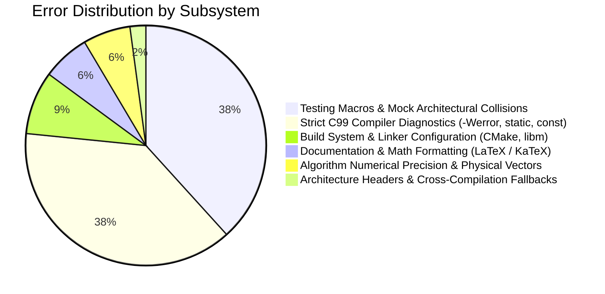

# Project Error & Incident Ledger

This directory maintains an immutable, chronological record of all bugs, compiler errors, linker faults, math calibration issues, and documentation formatting errors encountered during the engineering lifecycle of the **Tea Plantation Rain Prediction System**.

---

## Chronological Index of Errors

| ID | Date & Time | Commit | Component / Subsystem | Error Title & Summary | Report File |
| :---: | :---: | :---: | :--- | :--- | :--- |
| **`ERR-001`** | 2026-09-09 11:42:53 | [`ad6662b`](https://github.com/Thejus26/rain-predict/commit/ad6662ba4389ca362379a7839a908a684206e2c7) | Documentation (Algorithms) | **KaTeX Table Rendering Error**: LaTeX `\text{}` commands and math pipes broke GFM table parsing. | [ERR-001 Report](file:///C:/Users/ENERGY%20SAVER/Documents/Learning/Job%20Projects/rain-predict/context/errors/ERR-001-2026-09-09-katex-table-rendering-error.md) |
| **`ERR-002`** | 2026-09-09 14:19:49 | [`cc89f54`](https://github.com/Thejus26/rain-predict/commit/cc89f54f7aa8783a39b70ed822c7af9b464bddc9) | Documentation (Specs) | **LaTeX Escape Formatting across Sprint 4 Specs**: Unescaped hex addresses and polynomial operators. | [ERR-002 Report](file:///C:/Users/ENERGY%20SAVER/Documents/Learning/Job%20Projects/rain-predict/context/errors/ERR-002-2026-09-09-latex-escape-formatting-in-sprint-4-specs.md) |
| **`ERR-003`** | 2026-09-09 20:59:06 | [`914e979`](https://github.com/Thejus26/rain-predict/commit/914e979d96ce059e7cf3b92a253584826bac006c) | Documentation (Specs) | **KaTeX Unit Formatting in S7-T2.1 Spec**: KaTeX parse failure on microampere-hour unit strings. | [ERR-003 Report](file:///C:/Users/ENERGY%20SAVER/Documents/Learning/Job%20Projects/rain-predict/context/errors/ERR-003-2026-09-09-katex-formatting-in-sprint-7-specs.md) |
| **`ERR-004`** | 2026-09-11 11:51:26 | [`30ef630`](https://github.com/Thejus26/rain-predict/commit/30ef630988e7fa0b30b8594d723dd02c98e49494) | Build System (CMake) | **CMake Generator Expression List Expansion**: Semicolon-delimited compiler flags passed as single invalid string. | [ERR-004 Report](file:///C:/Users/ENERGY%20SAVER/Documents/Learning/Job%20Projects/rain-predict/context/errors/ERR-004-2026-09-11-cmake-generator-expression-list-expansion.md) |
| **`ERR-005`** | 2026-09-11 11:53:22 | [`46f2e54`](https://github.com/Thejus26/rain-predict/commit/46f2e540b4a9ea9ac63e81b3f2d7ae006f918849) | Testing (Unity) | **Unity Compiler Diagnostics & Missing stdio.h**: Unchecked `snprintf`, unused color strings, missing `<stdio.h>`. | [ERR-005 Report](file:///C:/Users/ENERGY%20SAVER/Documents/Learning/Job%20Projects/rain-predict/context/errors/ERR-005-2026-09-11-unity-unused-const-warning-and-missing-stdio.md) |
| **`ERR-006`** | 2026-09-11 14:30:33 | [`c5296ab`](https://github.com/Thejus26/rain-predict/commit/c5296abba28d13fd8abd77641f7ded7d6e78b937) | Tests (Mock I2C) | **Missing static Qualifiers in test_mock_i2c**: Missing prototypes under `-Wmissing-prototypes -Werror`. | [ERR-006 Report](file:///C:/Users/ENERGY%20SAVER/Documents/Learning/Job%20Projects/rain-predict/context/errors/ERR-006-2026-09-11-missing-static-qualifiers-in-test-mock-i2c.md) |
| **`ERR-007`** | 2026-09-11 14:33:02 | [`0a33eec`](https://github.com/Thejus26/rain-predict/commit/0a33eec3e8d20e597f9edaea71168d97d04b0a31) | Mock Drivers (Mock I2C) | **Mock I2C Unintended State Mutation**: Reading unconfigured addresses created phantom virtual devices. | [ERR-007 Report](file:///C:/Users/ENERGY%20SAVER/Documents/Learning/Job%20Projects/rain-predict/context/errors/ERR-007-2026-09-11-mock-i2c-device-search-state-mutation.md) |
| **`ERR-008`** | 2026-09-11 15:46:40 | [`cf79673`](https://github.com/Thejus26/rain-predict/commit/cf7967343d9cfc2451a7548a5017376ba83e9613) | Tests (Sanity) | **Missing Prototypes Warning in test_sanity**: Global unit test declarations without `static`. | [ERR-008 Report](file:///C:/Users/ENERGY%20SAVER/Documents/Learning/Job%20Projects/rain-predict/context/errors/ERR-008-2026-09-11-missing-prototypes-warning-in-test-sanity.md) |
| **`ERR-009`** | 2026-09-11 15:48:48 | [`41a0e93`](https://github.com/Thejus26/rain-predict/commit/41a0e932debe68e4b08ca76eaa416e25367e0f80) | Build System (CMake) | **Unresolved Math Library on Unix/GCC**: Linker failure for `expf`, `logf`, `powf` due to missing `-lm`. | [ERR-009 Report](file:///C:/Users/ENERGY%20SAVER/Documents/Learning/Job%20Projects/rain-predict/context/errors/ERR-009-2026-09-11-unresolved-math-library-linking-on-unix-gcc.md) |
| **`ERR-010`** | 2026-09-12 09:06:19 | [`1360240`](https://github.com/Thejus26/rain-predict/commit/13602402966521f32b1328e5f97e393430eeb5bd) | Tests (Ring Buffer) | **Discarded const Qualifier in test_ring_buffer**: Pointer to `const uint8_t` passed to buffer pop output argument. | [ERR-010 Report](file:///C:/Users/ENERGY%20SAVER/Documents/Learning/Job%20Projects/rain-predict/context/errors/ERR-010-2026-09-12-discarded-const-qualifier-warning-in-ring-buffer.md) |
| **`ERR-011`** | 2026-09-12 09:58:45 | [`5bc7ee6`](https://github.com/Thejus26/rain-predict/commit/5bc7ee64ab796250bf70b0bf80370eb8bba07185) | Algorithms & Tests | **Magnus-Tetens Formula Constant Discrepancy**: Test vectors expected Goff-Gratch values rather than Magnus constants. | [ERR-011 Report](file:///C:/Users/ENERGY%20SAVER/Documents/Learning/Job%20Projects/rain-predict/context/errors/ERR-011-2026-09-12-dew-point-unit-test-vector-formula-discrepancy.md) |
| **`ERR-012`** | 2026-09-12 11:28:18 | [`6b8cdde`](https://github.com/Thejus26/rain-predict/commit/6b8cdde2e46c85eb9d241e6e37496899c4cefc18) | Tests (Barometric Math) | **Unrealistic Hypsometric Test Vectors**: Sea-level pressure fed as mountain station pressure, causing out-of-range clamp. | [ERR-012 Report](file:///C:/Users/ENERGY%20SAVER/Documents/Learning/Job%20Projects/rain-predict/context/errors/ERR-012-2026-09-12-unrealistic-hypsometric-test-vectors-out-of-range.md) |
| **`ERR-013`** | 2026-09-12 14:13:50 | [`63ba9fe`](https://github.com/Thejus26/rain-predict/commit/63ba9fe0c4035c9febde84a71b12b4196b00f918) | Tests (Rain Algo) | **Missing static and Unused Variable in test_rain_algo**: Unused `float cpi;` and non-static test functions. | [ERR-013 Report](file:///C:/Users/ENERGY%20SAVER/Documents/Learning/Job%20Projects/rain-predict/context/errors/ERR-013-2026-09-12-missing-static-and-unused-variable-in-test-rain-algo.md) |
| **`ERR-014`** | 2026-09-12 14:20:44 | [`f5850a7`](https://github.com/Thejus26/rain-predict/commit/f5850a7fe607fa2a595e647b82aaf1020ecc53d9) | Algorithms & Tests | **Forecast State Type Mismatch & Synthetic Squall RH Curve**: Enum type divergence and test RH curve calibration. | [ERR-014 Report](file:///C:/Users/ENERGY%20SAVER/Documents/Learning/Job%20Projects/rain-predict/context/errors/ERR-014-2026-09-12-type-mismatch-and-squall-rh-curve-in-rain-algo.md) |
| **`ERR-015`** | 2026-09-13 11:59:10 | [`07bea0e`](https://github.com/Thejus26/rain-predict/commit/07bea0ee361c966bfeeb6865e7e234c12ed92f5a) | Core BSP (Headers) | **Missing Header Guard for stm32wlxx_hal.h**: Host build broke when attempting unconditional include of hardware HAL. | [ERR-015 Report](file:///C:/Users/ENERGY%20SAVER/Documents/Learning/Job%20Projects/rain-predict/context/errors/ERR-015-2026-09-13-missing-stm32wlxx-hal-header-guard-in-board-config.md) |
| **`ERR-016`** | 2026-09-13 12:43:05 | [`232155a`](https://github.com/Thejus26/rain-predict/commit/232155a108e3e7b7efce8f636ca85f074d3cc0dd) | Tests (HAL Conf) | **Undefined TEST_PASS Macro in test_hal_conf**: Non-existent Unity macro called instead of `TEST_ASSERT_TRUE`. | [ERR-016 Report](file:///C:/Users/ENERGY%20SAVER/Documents/Learning/Job%20Projects/rain-predict/context/errors/ERR-016-2026-09-13-undefined-test-pass-macro-in-test-hal-conf.md) |
| **`ERR-017`** | 2026-09-13 12:57:32 | [`0a1c245`](https://github.com/Thejus26/rain-predict/commit/0a1c2453a644b5d10cf3a364497e9dc16e23ab44) | Drivers & Core | **Duplicate GPIO Type & Enum Redefinition**: Sprint 1 placeholder enums collided with Sprint 3 canonical `board_config.h`. | [ERR-017 Report](file:///C:/Users/ENERGY%20SAVER/Documents/Learning/Job%20Projects/rain-predict/context/errors/ERR-017-2026-09-13-duplicate-gpio-enum-and-type-conflicts.md) |
| **`ERR-018`** | 2026-09-13 13:01:21 | [`291debb`](https://github.com/Thejus26/rain-predict/commit/291debbfe36ca6c90130d1cbd9ac3230d465a4f1) | Tests (I2C Bus) | **Non-Existent Unity Assertion Macro in test_i2c_bus**: Used invalid `TEST_ASSERT_INT_WITHIN` for integer range check. | [ERR-018 Report](file:///C:/Users/ENERGY%20SAVER/Documents/Learning/Job%20Projects/rain-predict/context/errors/ERR-018-2026-09-13-invalid-unity-assertion-macro-in-test-i2c-bus.md) |
| **`ERR-019`** | 2026-09-13 13:05:44 | [`03aa895`](https://github.com/Thejus26/rain-predict/commit/03aa89542832ced59948914a0741462d724a8a39) | Architecture (Drivers) | **Duplicate I2C Driver Symbol Collision**: Multiple definition linker collision between `test_mocks` and `firmware_drivers`. | [ERR-019 Report](file:///C:/Users/ENERGY%20SAVER/Documents/Learning/Job%20Projects/rain-predict/context/errors/ERR-019-2026-09-13-duplicate-i2c-driver-symbol-collision.md) |
| **`ERR-020`** | 2026-09-13 16:11:39 | [`c3bc892`](https://github.com/Thejus26/rain-predict/commit/c3bc8920751509c2ec090ea013ee8a9348372875) | Core Architecture | **Missing STATUS_ERR_INVALID_STATE & Delay Prototype**: Omitted status enum value and test prototype in header. | [ERR-020 Report](file:///C:/Users/ENERGY%20SAVER/Documents/Learning/Job%20Projects/rain-predict/context/errors/ERR-020-2026-09-13-missing-status-err-invalid-state-and-delay-prototype.md) |
| **`ERR-021`** | 2026-09-13 17:21:10 | [`51562da`](https://github.com/Thejus26/rain-predict/commit/51562da19c61f0d1f11ee890a5e7608cec424d03) | Middleware (Power) | **Unclosed Function Brace in power_mgr.c**: Missing return/closing brace before `#endif` caused nested function compiler errors. | [ERR-021 Report](file:///C:/Users/ENERGY%20SAVER/Documents/Learning/Job%20Projects/rain-predict/context/errors/ERR-021-2026-09-13-unclosed-function-brace-nested-functions-error-in-power-mgr.md) |
| **`ERR-022`** | 2026-09-13 17:26:21 | [`108811a`](https://github.com/Thejus26/rain-predict/commit/108811ab36ef4a6e8b647e4103775a9cb7c3673c) | Testing (Unity) | **Non-Existent TEST_ASSERT_UINT16_WITHIN in test_bsp_adc**: Undefined macro called for integer tolerance checks. | [ERR-022 Report](file:///C:/Users/ENERGY%20SAVER/Documents/Learning/Job%20Projects/rain-predict/context/errors/ERR-022-2026-09-13-invalid-unity-assertion-macro-in-test-bsp-adc.md) |
| **`ERR-023`** | 2026-09-13 17:32:10 | [`dc4c3df`](https://github.com/Thejus26/rain-predict/commit/dc4c3dfd19ce44f7f2f1869bae9884eab024a512) | Testing & Middleware | **Stale LOW_BAT_SLEEP_SEC Assertion Mismatch**: Unit test asserted obsolete 1800s interval instead of 900s multi-tier value. | [ERR-023 Report](file:///C:/Users/ENERGY%20SAVER/Documents/Learning/Job%20Projects/rain-predict/context/errors/ERR-023-2026-09-13-stale-low-bat-sleep-sec-assertion-in-test-power-mgr.md) |
| **`ERR-024`** | 2026-09-14 08:24:23 | [`c8c8279`](https://github.com/Thejus26/rain-predict/commit/c8c8279c7d5e5b0b5e7f261ce0d551e1cdc9459c) | Testing (Unity / BME280) | **Non-Existent Integer Tolerance Macros in test_bme280**: Undefined `TEST_ASSERT_INT16_WITHIN` / `UINT32_WITHIN` / `UINT16_WITHIN`. | [ERR-024 Report](file:///C:/Users/ENERGY%20SAVER/Documents/Learning/Job%20Projects/rain-predict/context/errors/ERR-024-2026-09-14-invalid-unity-assertion-macros-in-test-bme280.md) |
| **`ERR-025`** | 2026-09-14 08:29:37 | [`5a2a635`](https://github.com/Thejus26/rain-predict/commit/5a2a6353ea0ad47fd2fe3cf79cade0295cb6bd43) | Testing & Driver Math (BME280) | **BME280 Humidity Test Vector Constant Discrepancy**: Expected 54.32% instead of analytically computed 29.81%. | [ERR-025 Report](file:///C:/Users/ENERGY%20SAVER/Documents/Learning/Job%20Projects/rain-predict/context/errors/ERR-025-2026-09-14-bme280-humidity-test-vector-constant-discrepancy.md) |
| **`ERR-026`** | 2026-09-14 10:09:00 | [`82bc551`](https://github.com/Thejus26/rain-predict/commit/82bc55173ec00d8806d6acec27bbaac17b50bbcc) | Testing & Driver Simulation (OPT3001) | **OPT3001 Config Word Discrepancy & Mock CRF Timeout**: Single-shot config test expected 0xCA10 vs 0xC210, and mock write cleared CRF causing timeout. | [ERR-026 Report](file:///C:/Users/ENERGY%20SAVER/Documents/Learning/Job%20Projects/rain-predict/context/errors/ERR-026-2026-09-14-opt3001-config-word-discrepancy-and-mock-crf-timeout.md) |
| **`ERR-027`** | 2026-09-14 10:16:00 | [`e92b8d0`](https://github.com/Thejus26/rain-predict/commit/e92b8d0c2d7b126edc107fefb67bea65dd5a6dcc) | Testing & Driver Simulation (I2C Bus) | **Mock I2C Over-Aggressive CRF Bit Mutation in test_i2c_bus**: Bus simulation mutated test word 0x1234 to 0x12B4. | [ERR-027 Report](file:///C:/Users/ENERGY%20SAVER/Documents/Learning/Job%20Projects/rain-predict/context/errors/ERR-027-2026-09-14-mock-i2c-crf-mutation-in-test-i2c-bus.md) |
| **`ERR-028`** | 2026-09-14 11:48:21 | [`080e1e0`](https://github.com/Thejus26/rain-predict/commit/080e1e0e4687c3039a2a841c6675df5c2c5ef89a) | Drivers & Metrics (Rain Gauge) | **Rain Gauge Peak Rate State Mutation on Read Queries**: Getters mutated peak rate state upon query, causing peak retention failures after reset. | [ERR-028 Report](file:///C:/Users/ENERGY%20SAVER/Documents/Learning/Job%20Projects/rain-predict/context/errors/ERR-028-2026-09-14-rain-gauge-peak-rate-mutation-on-read.md) |
| **`ERR-029`** | 2026-09-14 13:43:00 | [`246541c`](https://github.com/Thejus26/rain-predict/commit/246541c8c8fa73f26da077a5cce6e1073542e563) | Testing & Driver Validation (Modbus RTU) | **Modbus Response Byte Count Test Truncated Buffer CRC Status Discrepancy**: Truncated buffer length failed CRC verification before frame length check. | [ERR-029 Report](file:///C:/Users/ENERGY%20SAVER/Documents/Learning/Job%20Projects/rain-predict/context/errors/ERR-029-2026-09-14-modbus-response-byte-count-test-crc-mismatch.md) |
| **`ERR-030`** | 2026-09-14 13:47:33 | [`4f4e624`](https://github.com/Thejus26/rain-predict/commit/4f4e62470276aab6f1420dacd530d5c422c431c8) | Strict C99 Compiler Diagnostics (-Werror, unused-variable) | **Unused Variable 'resp' in test_modbus_rtu.c**: Unused local stack array declaration triggered -Werror=unused-variable. | [ERR-030 Report](file:///C:/Users/ENERGY%20SAVER/Documents/Learning/Job%20Projects/rain-predict/context/errors/ERR-030-2026-09-14-unused-variable-resp-in-test-modbus-rtu.md) |
| **`ERR-031`** | 2026-09-14 14:08:00 | [`762a63f`](https://github.com/Thejus26/rain-predict/commit/762a63ff4ca56b7e73643ac50a4740a361a3dbcb) | Strict C99 & Embedded Toolchain Diagnostics | **Modbus Driver CI Build Failures**: Unused variable in host unit tests and missing HAL identifiers in embedded build. | [ERR-031 Report](file:///C:/Users/ENERGY%20SAVER/Documents/Learning/Job%20Projects/rain-predict/context/errors/ERR-031-2026-09-14-unused-variable-and-embedded-hal-compilation-failures.md) |
| **`ERR-032`** | 2026-09-14 14:18:00 | [`0f75905`](https://github.com/Thejus26/rain-predict/commit/0f75905cb291e67a2afd358fcfc58b3a3664ab1d) | Testing & Driver Simulation (Modbus RTU) | **Modbus Query Slave Host Simulation RX Flush Timeout**: Pre-transmission RX buffer flush purged injected test responses causing timeouts. | [ERR-032 Report](file:///C:/Users/ENERGY%20SAVER/Documents/Learning/Job%20Projects/rain-predict/context/errors/ERR-032-2026-09-14-modbus-query-host-simulation-rx-flush-timeout.md) |
| **`ERR-033`** | 2026-09-14 14:34:00 | [`ddd88ac`](https://github.com/Thejus26/rain-predict/commit/ddd88aca134cb4c92a51bbc517228807c0e828ed) | Testing & Driver Communication (Modbus RTU / UART) | **Modbus Query Slave RX Buffer Over-Read in Retry Recovery**: Requesting full buffer capacity drained queued subsequent responses causing retry timeouts. | [ERR-033 Report](file:///C:/Users/ENERGY%20SAVER/Documents/Learning/Job%20Projects/rain-predict/context/errors/ERR-033-2026-09-14-modbus-query-rx-buffer-over-read-retry-timeout.md) |
| **`ERR-034`** | 2026-09-14 14:58:02 | [`23e4ee5`](https://github.com/Thejus26/rain-predict/commit/23e4ee5c66e9b672ff216d3d909ef8a3ce7b276c) | Strict C99 Compiler Diagnostics (-Wmissing-prototypes, -Werror) | **Missing static Function Prototypes in test_sdi12.c**: Test functions lacked static qualifier triggering -Wmissing-prototypes. | [ERR-034 Report](file:///C:/Users/ENERGY%20SAVER/Documents/Learning/Job%20Projects/rain-predict/context/errors/ERR-034-2026-09-14-missing-static-prototypes-in-test-sdi12.md) |
| **`ERR-035`** | 2026-09-14 15:04:55 | [`2a66eb9`](https://github.com/Thejus26/rain-predict/commit/2a66eb9ffab908c8e844467fb9790ddace138431) | Testing & Driver Simulation (SDI-12 / GPIO) | **SDI-12 Wake and Transmit Direction State Leak**: Early return on invalid command left direction in TX mode. | [ERR-035 Report](file:///C:/Users/ENERGY%20SAVER/Documents/Learning/Job%20Projects/rain-predict/context/errors/ERR-035-2026-09-14-sdi12-wake-transmit-error-direction-leak.md) |
| **`ERR-036`** | 2026-09-14 15:21:08 | [`4ad93b1`](https://github.com/Thejus26/rain-predict/commit/4ad93b14ae571f69bdf991bae211617e1d38623c) | Testing & Driver Communication (SDI-12 / UART) | **SDI-12 Response RX Buffer Over-Read in Soil Probe Queries**: Bulk buffer drain consumed multi-stage response frames causing query timeout. | [ERR-036 Report](file:///C:/Users/ENERGY%20SAVER/Documents/Learning/Job%20Projects/rain-predict/context/errors/ERR-036-2026-09-14-sdi12-response-rx-buffer-over-read-query-timeout.md) |
| **`ERR-037`** | 2026-09-14 17:33:00 | [`41a32b2`](https://github.com/Thejus26/rain-predict/commit/41a32b2941f78347b2e2c02f70249505b187e19c) | Strict C99 Compiler Diagnostics (-Wmissing-prototypes, -Werror) | **Missing static Function Prototypes in test_telemetry_codec.c**: All 13 unit test functions lacked static qualifiers, triggering -Werror=missing-prototypes during host CI build. | [ERR-037 Report](file:///C:/Users/ENERGY%20SAVER/Documents/Learning/Job%20Projects/rain-predict/context/errors/ERR-037-2026-09-14-missing-static-prototypes-in-test-telemetry-codec.md) |
| **`ERR-038`** | 2026-09-16 22:23:00 | [`c7a4e3b`](https://github.com/Thejus26/rain-predict/commit/c7a4e3b1c933c2fb2f95041113931688db123fdb) | Strict C99 & Embedded Toolchain Diagnostics | **Flash Storage CI Build Failures**: Missing static qualifiers and Hex64 macro in unit tests, and missing HAL header in target build. | [ERR-038 Report](file:///C:/Users/ENERGY%20SAVER/Documents/Learning/Job%20Projects/rain-predict/context/errors/ERR-038-2026-09-16-flash-storage-test-diagnostics-and-embedded-hal-include-error.md) |
| **`ERR-039`** | 2026-09-19 15:47:00 | [`a752ee2`](https://github.com/Thejus26/rain-predict/commit/a752ee20be2f934f0c82d7078bc5d7d78b1e4328) | Strict C99 & Embedded Toolchain Diagnostics | **LoRaWAN Service Target Cross-Compilation Failures**: Implicit declarations for `HAL_GetUIDw0`/`w1` and `HAL_GPIO_WritePin` under target toolchain. | [ERR-039 Report](file:///C:/Users/ENERGY%20SAVER/Documents/Learning/Job%20Projects/rain-predict/context/errors/ERR-039-2026-09-19-lorawan-service-implicit-hal-declaration-errors.md) |
| **`ERR-040`** | 2026-09-19 16:45:00 | [`a1e1447`](https://github.com/Thejus26/rain-predict/commit/a1e144787ab78af7911ad30f3a700f071c4b2dc0) | Strict C99 Compiler Diagnostics (-Wmissing-prototypes, -Werror) | **Missing static Function Prototypes in test_lorawan_tx_queue.c**: All 12 unit test functions lacked static qualifiers, triggering -Werror=missing-prototypes during host CI build. | [ERR-040 Report](file:///C:/Users/ENERGY%20SAVER/Documents/Learning/Job%20Projects/rain-predict/context/errors/ERR-040-2026-09-19-missing-static-prototypes-in-test-lorawan-tx-queue.md) |
| **`ERR-041`** | 2026-09-19 22:06:00 | [`982698c`](https://github.com/Thejus26/rain-predict/commit/982698c22b24fd5ad8245218c74d63ac9f1e1e2e) | Strict C99 Compiler Diagnostics (-Wmissing-prototypes, -Werror) | **Missing static Function Prototypes in test_alert_manager.c**: Unit test functions lacked static qualifiers, triggering -Werror=missing-prototypes during host CI build. | [ERR-041 Report](file:///C:/Users/ENERGY%20SAVER/Documents/Learning/Job%20Projects/rain-predict/context/errors/ERR-041-2026-09-19-missing-static-prototypes-in-test-alert-manager.md) |
| **`ERR-042`** | 2026-09-20 11:20:00 | [`63eb0e7`](https://github.com/Thejus26/rain-predict/commit/63eb0e7473c40cec1df4bebe7138108391abf4cf) | Application & Middleware (Alert Manager) | **Battery Conservation Tier 2 LED Pattern Overridden by Storm Strobe**: Weather alert pattern priority superseded battery preservation micro-pulse in `test_alert_battery_conservation_tier2`. | [ERR-042 Report](file:///C:/Users/ENERGY%20SAVER/Documents/Learning/Job%20Projects/rain-predict/context/errors/ERR-042-2026-09-20-battery-conservation-tier2-led-strobe-override.md) |
| **`ERR-043`** | 2026-09-20 12:10:00 | [`c314546`](https://github.com/Thejus26/rain-predict/commit/c31454635f37237d9ac30b5f454ca71fb4b7ff47) | Strict C99 Compiler Diagnostics (-Werror, enumerator redeclaration) | **Enumerator Redeclaration in Telemetry Codec**: Global C99 enum namespace collision on `RAIN_ALERT_UNLIKELY` between `rain_algo.h` and `telemetry_codec.h`. | [ERR-043 Report](file:///C:/Users/ENERGY%20SAVER/Documents/Learning/Job%20Projects/rain-predict/context/errors/ERR-043-2026-09-20-redeclaration-of-enumerator-rain-alert-unlikely-in-telemetry-codec.md) |
| **`ERR-044`** | 2026-09-20 12:26:00 | [`99828d8`](https://github.com/Thejus26/rain-predict/commit/99828d8134b27fded94425ea4963edfed43c79a0) | Build System & Linker Configuration (CMake, nano.specs) | **Duplicate nano.specs Linker Flags**: GCC fatal error due to duplicate `--specs=nano.specs` in toolchain and target link options. | [ERR-044 Report](file:///C:/Users/ENERGY%20SAVER/Documents/Learning/Job%20Projects/rain-predict/context/errors/ERR-044-2026-09-20-duplicate-nano-specs-linker-spec-rename-collision.md) |
| **`ERR-045`** | 2026-09-20 12:36:00 | [`a36943b`](https://github.com/Thejus26/rain-predict/commit/a36943bb16b6561e3880a1dc9fd82605fa82bed2) | Build System & Linker Configuration (Linker Script / Memory Layout) | **Missing Linker Script STM32WLE5XX_FLASH.ld**: Target executable link failed because target memory map script file was missing from repository. | [ERR-045 Report](file:///C:/Users/ENERGY%20SAVER/Documents/Learning/Job%20Projects/rain-predict/context/errors/ERR-045-2026-09-20-missing-linker-script-stm32wle5xx-flash-ld.md) |
| **`ERR-046`** | 2026-09-20 13:42:00 | [`de11b39`](https://github.com/Thejus26/rain-predict/commit/de11b395c3abb351f222b47cd9d8c76085add16c) | Application State Machine (Watchdog Anti-Masking) | **Watchdog Hang Recovery Stall Check Bypassed in STATE_WAKE**: Checkpoint stall guard unconditionally bypassed for `STATE_WAKE`, causing failure in `test_wdg_10_simulated_hang_recovery`. | [ERR-046 Report](file:///C:/Users/ENERGY%20SAVER/Documents/Learning/Job%20Projects/rain-predict/context/errors/ERR-046-2026-09-20-watchdog-hang-recovery-stall-bypassed-in-state-wake.md) |
| **`ERR-047`** | 2026-09-20 17:47:51 | [`7ec1947`](https://github.com/Thejus26/rain-predict/commit/7ec194791e679433e60c0da107944aacb3525b1e) | Strict C99 Compiler Diagnostics (-Werror, unknown type name) | **Unknown Type Name 'bme280_t' in test_state_machine.c**: Mock BME280 stubs used non-existent `bme280_t` instead of `bme280_dev_t`, triggering compiler failure under `-Werror`. | [ERR-047 Report](file:///C:/Users/ENERGY%20SAVER/Documents/Learning/Job%20Projects/rain-predict/context/errors/ERR-047-2026-09-20-unknown-type-name-bme280-t-in-test-state-machine.md) |

---

## Error Classification by Category

