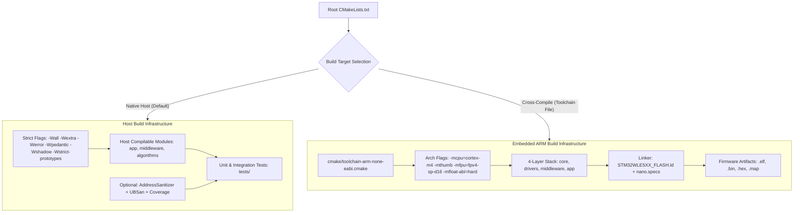

# Task Specification: S1-T1.1 - Root CMake Build System Configuration

## 1. Task Metadata & Overview

| Attribute | Specification Details |
| :--- | :--- |
| **Sprint** | **Sprint 1: Test Harness, Desktop Simulation & Mock Infrastructure** |
| **Task ID** | `S1-T1.1` |
| **Parent Task** | `S1-T1: Configure Root Build System & Toolchain Definitions` |
| **Task Title** | Configure Root CMake Build System (`CMakeLists.txt`) & ARM Toolchain |
| **Status** | **Ready for Implementation** |
| **Target Files** | [`CMakeLists.txt`](file:///C:/Users/ENERGY%20SAVER/Documents/Learning/Job%20Projects/rain-predict/CMakeLists.txt)<br>[`cmake/toolchain-arm-none-eabi.cmake`](file:///C:/Users/ENERGY%20SAVER/Documents/Learning/Job%20Projects/rain-predict/cmake/toolchain-arm-none-eabi.cmake)<br>[`cmake/CompilerFlags.cmake`](file:///C:/Users/ENERGY%20SAVER/Documents/Learning/Job%20Projects/rain-predict/cmake/CompilerFlags.cmake) |
| **Related Documents** | [`context/specs/spec-roadmap.md`](file:///C:/Users/ENERGY%20SAVER/Documents/Learning/Job%20Projects/rain-predict/context/specs/spec-roadmap.md)<br>[`context/coding-standards.md`](file:///C:/Users/ENERGY%20SAVER/Documents/Learning/Job%20Projects/rain-predict/context/coding-standards.md)<br>[`context/project-structure.md`](file:///C:/Users/ENERGY%20SAVER/Documents/Learning/Job%20Projects/rain-predict/context/project-structure.md)<br>[`docs/architecture/firmware-architecture.md`](file:///C:/Users/ENERGY%20SAVER/Documents/Learning/Job%20Projects/rain-predict/docs/architecture/firmware-architecture.md) |
| **Dependencies** | None (Foundational root build infrastructure) |
| **Downstream Tasks** | `S1-T1.2` (Makefile wrapper), `S1-T2.1` (Unity host test harness), `S2-T1` through `S7-T3` (all firmware modules) |

---

## 2. Executive Summary & Architectural Scope

The primary objective of **`S1-T1.1`** is to establish the top-level CMake build system ([`CMakeLists.txt`](file:///C:/Users/ENERGY%20SAVER/Documents/Learning/Job%20Projects/rain-predict/CMakeLists.txt)) and cross-compilation toolchain configuration for the **Tea Plantation Rain Prediction System**.

The build system must support a **Dual-Target Execution Paradigm**:
1. **Native Host Compilation (Host Mode)**:
   - Target Platforms: x86_64 / ARM64 (Linux, macOS, Windows MinGW/Clang/MSVC).
   - Used for running pure C host unit tests (Unity framework), mock sensor HAL injection, moving-average filter simulations, and Zambretti mathematical verification.
   - Enforces C99 standards, strict diagnostic warning flags, AddressSanitizer (ASan), UndefinedBehaviorSanitizer (UBSan), and `gcov`/`lcov` code coverage reporting.
2. **Embedded Target Cross-Compilation (Firmware Mode)**:
   - Target Hardware: **STMicroelectronics STM32WLE5CC** SoC (ARM Cortex-M4 @ 48 MHz, Single-Precision FPU, Sub-GHz LoRa radio, 256 KB Flash, 64 KB SRAM).
   - Toolchain: `arm-none-eabi-gcc` / `arm-none-eabi-g++` / `arm-none-eabi-objcopy` / `arm-none-eabi-size`.
   - Generates production artifacts: `.elf`, `.bin`, `.hex`, `.map` with section garbage collection (`--gc-sections`), hardware FPU acceleration (`-mfloat-abi=hard -mfpu=fpv4-sp-d16`), and static memory safety.



---

## 3. Technical Requirements & Standards Compliance

### 3.1 Language Standards
- **C Standard**: `C99` strictly enforced without GNU extensions (`set(CMAKE_C_STANDARD 99)`, `set(CMAKE_C_STANDARD_REQUIRED ON)`, `set(CMAKE_C_EXTENSIONS OFF)`).
- **C++ Standard (Testing / Tooling if needed)**: `C++14` or `C++17` for host test suites if C++ test frameworks are ever integrated.

### 3.2 Strict Compiler Diagnostic Flags
In accordance with [`context/coding-standards.md`](file:///C:/Users/ENERGY%20SAVER/Documents/Learning/Job%20Projects/rain-predict/context/coding-standards.md), the root build system must enforce the following flags for all C source targets:

| Flag | Purpose | Impact on Firmware Quality |
| :--- | :--- | :--- |
| `-Wall` | Enables standard baseline compiler warnings. | Catches common programming errors. |
| `-Wextra` | Enables additional diagnostic checks. | Enforces sign comparisons, unused parameters, etc. |
| `-Wpedantic` | Enforces strict ISO C99 compliance. | Rejects non-standard GNU C extensions. |
| `-Wshadow` | Warns whenever a local variable shadows another variable. | Prevents subtle variable scoping bugs. |
| `-Wstrict-prototypes` | Requires explicit `void` parameter declarations in empty functions. | Guarantees proper C function signatures. |
| `-Wpointer-arith` | Forbids pointer arithmetic on `void*` or function pointers. | Prevents undefined pointer offset calculations. |
| `-Wundef` | Warns if an undefined identifier is evaluated in an `#if` directive. | Prevents silent preprocessor defaulting to 0. |
| `-Wmissing-prototypes` | Requires global functions to be declared in headers prior to definition. | Enforces header/source consistency. |
| `-Werror` | Treats all warnings as fatal compilation errors. | Guarantees zero warning tolerance across all builds. |

### 3.3 Build Configuration Types
The build system must support the following standard build configurations:
- **`Debug`**: `-O0 -g3 -DDEBUG` (symbols preserved, zero optimization, ideal for GDB / OpenOCD / Ozone / host testing).
- **`Release`**: `-O2 -DNDEBUG` (size/speed optimization, runtime debug asserts disabled).
- **`RelWithDebInfo`**: `-O2 -g3` (optimized production build with debug symbols for crash traceback).
- **`Coverage`**: `-O0 -g3 --coverage` (host builds only, generates `.gcno`/`.gcda` coverage profiles).

---

## 4. Architectural Layering & Target Decomposition

The root `CMakeLists.txt` must structure targets according to the 4-layer unidirectional architecture defined in [`context/project-structure.md`](file:///C:/Users/ENERGY%20SAVER/Documents/Learning/Job%20Projects/rain-predict/context/project-structure.md):

```
Layer 4: Application Layer (firmware/app)
   └── Depends on: Middleware, Drivers, Core
Layer 3: Middleware Layer (firmware/middleware)
   └── Depends on: Drivers, Core
Layer 2: Driver / BSP Layer (firmware/drivers)
   └── Depends on: Core
Layer 1: Core / HAL Layer (firmware/core)
   └── Depends on: CMSIS, STM32CubeWL HAL
```

### 4.1 Target Library Definitions

| Target Name | Type | Source Directories | Public Include Directories | Direct Dependencies |
| :--- | :--- | :--- | :--- | :--- |
| `firmware_core` | `STATIC` / `OBJECT` | `firmware/core/src/` | `firmware/core/inc/`<br>`firmware/lib/cmsis/`<br>`firmware/lib/stm32wlxx_hal/inc/` | None (CMSIS/HAL) |
| `firmware_drivers` | `STATIC` / `OBJECT` | `firmware/drivers/src/` | `firmware/drivers/inc/` | `firmware_core` |
| `firmware_middleware` | `STATIC` / `OBJECT` | `firmware/middleware/src/` | `firmware/middleware/inc/` | `firmware_drivers`<br>`firmware_core` |
| `firmware_app` | `STATIC` / `OBJECT` | `firmware/app/src/` | `firmware/app/inc/` | `firmware_middleware`<br>`firmware_drivers`<br>`firmware_core` |
| `rain_predict.elf` | `EXECUTABLE` | Top-level target firmware | All firmware inc | All firmware layers + Linker Script |

### 4.2 Host Test Build Targets
When building in **Host Mode** (`BUILD_TESTING=ON` and `CMAKE_CROSSCOMPILING=FALSE`):
- Hardware-dependent modules (`firmware/core`, low-level I2C/UART register drivers) are replaced with mock abstractions under `tests/mocks/`.
- Hardware-agnostic algorithmic modules ([`dew_point.c`](file:///C:/Users/ENERGY%20SAVER/Documents/Learning/Job%20Projects/rain-predict/firmware/middleware/src/dew_point.c), [`zambretti.c`](file:///C:/Users/ENERGY%20SAVER/Documents/Learning/Job%20Projects/rain-predict/firmware/app/src/zambretti.c), [`trend_detector.c`](file:///C:/Users/ENERGY%20SAVER/Documents/Learning/Job%20Projects/rain-predict/firmware/app/src/trend_detector.c), [`rain_algo.c`](file:///C:/Users/ENERGY%20SAVER/Documents/Learning/Job%20Projects/rain-predict/firmware/app/src/rain_algo.c), [`ring_buffer.c`](file:///C:/Users/ENERGY%20SAVER/Documents/Learning/Job%20Projects/rain-predict/firmware/middleware/src/ring_buffer.c), [`moving_avg_filter.c`](file:///C:/Users/ENERGY%20SAVER/Documents/Learning/Job%20Projects/rain-predict/firmware/middleware/src/moving_avg_filter.c), [`telemetry_codec.c`](file:///C:/Users/ENERGY%20SAVER/Documents/Learning/Job%20Projects/rain-predict/firmware/middleware/src/telemetry_codec.c)) are compiled directly as host static libraries.
- The `tests/` subdirectory is automatically registered via `add_subdirectory(tests)`.

---

## 5. Toolchain Configuration Specification (`cmake/toolchain-arm-none-eabi.cmake`)

When cross-compiling for target hardware, CMake is invoked with `-DCMAKE_TOOLCHAIN_FILE=cmake/toolchain-arm-none-eabi.cmake`.

### 5.1 Required Toolchain Settings
- **System Name**: `Generic` (`set(CMAKE_SYSTEM_NAME Generic)`)
- **Processor**: `arm` (`set(CMAKE_SYSTEM_PROCESSOR arm)`)
- **Compilers**:
  - `arm-none-eabi-gcc`
  - `arm-none-eabi-g++`
  - `arm-none-eabi-objcopy`
  - `arm-none-eabi-size`
  - `arm-none-eabi-gdb`
- **Cortex-M4 Hardware Architecture Flags**:
  ```cmake
  set(ARM_ARCH_FLAGS "-mcpu=cortex-m4 -mthumb -mfpu=fpv4-sp-d16 -mfloat-abi=hard")
  ```
- **Section Garbage Collection & Optimization**:
  ```cmake
  set(ARM_LINK_FLAGS "-Wl,--gc-sections --specs=nano.specs --specs=nosys.specs")
  ```
- **Prevent Compiler Test Failure in Bare-Metal**:
  ```cmake
  set(CMAKE_TRY_COMPILE_TARGET_TYPE STATIC_LIBRARY)
  ```

---

## 6. CMake Options & Custom Targets

### 6.1 Configurable CMake Options

```cmake
option(BUILD_TESTING             "Build host unit test runner and integration tests" ON)
option(ENABLE_WARNINGS_AS_ERRORS "Treat compiler warnings as errors (-Werror)"       ON)
option(ENABLE_ASAN               "Enable AddressSanitizer and UB Sanitizer on host"  OFF)
option(ENABLE_COVERAGE           "Enable code coverage instrumentation (gcov)"      OFF)
option(BUILD_TARGET_FIRMWARE     "Build STM32WLE5 embedded target firmware"          OFF)
```

### 6.2 Custom Target Commands
1. **Size Reporting Target (`size`)**:
   Runs `arm-none-eabi-size` on `rain_predict.elf` to output Flash (text + data) and SRAM (data + bss) utilization.
2. **Binary Generation Targets (`hex`, `bin`)**:
   Uses `arm-none-eabi-objcopy` to generate `.hex` and `.bin` from `.elf`.
3. **Disassembly Target (`disasm`)**:
   Runs `arm-none-eabi-objdump -d -S` to assist assembly optimization and debugging.

---

## 7. Concrete File Implementation Blueprint

### 7.1 `CMakeLists.txt` Reference Blueprint

```cmake
cmake_minimum_required(VERSION 3.16)

# -----------------------------------------------------------------------------
# Project Definition & Metadata
# -----------------------------------------------------------------------------
project(rain_predict
    VERSION 1.0.0
    DESCRIPTION "Tea Plantation Rain Prediction System Firmware"
    LANGUAGES C ASM
)

# Enforce C99 Standard
set(CMAKE_C_STANDARD 99)
set(CMAKE_C_STANDARD_REQUIRED ON)
set(CMAKE_C_EXTENSIONS OFF)

# Export compile_commands.json for clangd/IDE integration
set(CMAKE_EXPORT_COMPILE_COMMANDS ON)

# -----------------------------------------------------------------------------
# Build Options
# -----------------------------------------------------------------------------
option(BUILD_TESTING             "Build host unit tests and test suites" ON)
option(ENABLE_WARNINGS_AS_ERRORS "Treat compiler warnings as fatal errors" ON)
option(ENABLE_ASAN               "Enable AddressSanitizer & UBSan (Host Only)" OFF)
option(ENABLE_COVERAGE           "Enable code coverage profiling (Host Only)" OFF)

# Detect if cross-compiling
if(CMAKE_CROSSCOMPILING)
    set(BUILD_TARGET_FIRMWARE ON)
    set(BUILD_TESTING OFF)
    message(STATUS "Configuring for Target: STM32WLE5 (ARM Cortex-M4)")
else()
    set(BUILD_TARGET_FIRMWARE OFF)
    message(STATUS "Configuring for Host: ${CMAKE_SYSTEM_NAME} (${CMAKE_SYSTEM_PROCESSOR})")
endif()

# -----------------------------------------------------------------------------
# Compiler Diagnostics & Strict Flags
# -----------------------------------------------------------------------------
include(cmake/CompilerFlags.cmake)

# -----------------------------------------------------------------------------
# Target Firmware Build (STM32WLE5)
# -----------------------------------------------------------------------------
if(BUILD_TARGET_FIRMWARE)
    # Target MCU definitions
    add_compile_definitions(
        STM32WLE5xx
        USE_HAL_DRIVER
    )

    # Core hardware layer
    add_subdirectory(firmware/core)
    
    # Driver & BSP layer
    add_subdirectory(firmware/drivers)
    
    # Middleware & Services layer
    add_subdirectory(firmware/middleware)
    
    # Application layer
    add_subdirectory(firmware/app)

    # Main Firmware Executable
    set(LINKER_SCRIPT ${CMAKE_CURRENT_SOURCE_DIR}/firmware/core/src/STM32WLE5XX_FLASH.ld)
    
    add_executable(${PROJECT_NAME}.elf
        firmware/core/src/main.c
    )

    target_link_libraries(${PROJECT_NAME}.elf PRIVATE
        firmware_app
        firmware_middleware
        firmware_drivers
        firmware_core
    )

    target_link_options(${PROJECT_NAME}.elf PRIVATE
        -T${LINKER_SCRIPT}
        -Wl,-Map=${PROJECT_BINARY_DIR}/${PROJECT_NAME}.map
        -Wl,--gc-sections
        --specs=nano.specs
        --specs=nosys.specs
    )

    # Generate .bin, .hex, and print size
    add_custom_command(TARGET ${PROJECT_NAME}.elf POST_BUILD
        COMMAND ${CMAKE_OBJCOPY} -O ihex $<TARGET_FILE:${PROJECT_NAME}.elf> ${PROJECT_BINARY_DIR}/${PROJECT_NAME}.hex
        COMMAND ${CMAKE_OBJCOPY} -O binary $<TARGET_FILE:${PROJECT_NAME}.elf> ${PROJECT_BINARY_DIR}/${PROJECT_NAME}.bin
        COMMAND ${CMAKE_SIZE} $<TARGET_FILE:${PROJECT_NAME}.elf>
        COMMENT "Building HEX/BIN and printing target memory footprint"
    )
endif()

# -----------------------------------------------------------------------------
# Host Testing Build
# -----------------------------------------------------------------------------
if(BUILD_TESTING AND NOT CMAKE_CROSSCOMPILING)
    enable_testing()
    
    # Host compilable static modules (pure math & middleware)
    add_subdirectory(firmware/middleware)
    add_subdirectory(firmware/app)
    
    # Test Suite Subdirectory
    add_subdirectory(tests)
endif()
```

### 7.2 `cmake/CompilerFlags.cmake` Reference Blueprint

```cmake
# -----------------------------------------------------------------------------
# CompilerFlags.cmake - Strict Warning and Diagnostic Flags
# -----------------------------------------------------------------------------

set(STRICT_C_FLAGS
    -Wall
    -Wextra
    -Wpedantic
    -Wshadow
    -Wstrict-prototypes
    -Wpointer-arith
    -Wundef
    -Wmissing-prototypes
    -Wredundant-decls
    -Wformat=2
    -Wwrite-strings
)

if(ENABLE_WARNINGS_AS_ERRORS)
    list(APPEND STRICT_C_FLAGS -Werror)
endif()

# Apply to all C targets
add_compile_options(
    $<$<COMPILE_LANGUAGE:C>:${STRICT_C_FLAGS}>
)

# Host Sanitizers
if(ENABLE_ASAN AND NOT CMAKE_CROSSCOMPILING)
    message(STATUS "Enabling AddressSanitizer and UndefinedBehaviorSanitizer")
    add_compile_options(-fsanitize=address,undefined -fno-omit-frame-pointer)
    add_link_options(-fsanitize=address,undefined)
endif()

# Code Coverage
if(ENABLE_COVERAGE AND NOT CMAKE_CROSSCOMPILING)
    message(STATUS "Enabling Code Coverage Instrumentation (--coverage)")
    add_compile_options(--coverage -O0 -g3)
    add_link_options(--coverage)
endif()
```

### 7.3 `cmake/toolchain-arm-none-eabi.cmake` Reference Blueprint

```cmake
# -----------------------------------------------------------------------------
# toolchain-arm-none-eabi.cmake - Bare-Metal ARM GCC Cross-Toolchain
# -----------------------------------------------------------------------------

set(CMAKE_SYSTEM_NAME Generic)
set(CMAKE_SYSTEM_PROCESSOR arm)

# Toolchain prefix
set(TOOLCHAIN_PREFIX arm-none-eabi-)

# Find compilers
find_program(CMAKE_C_COMPILER ${TOOLCHAIN_PREFIX}gcc REQUIRED)
find_program(CMAKE_CXX_COMPILER ${TOOLCHAIN_PREFIX}g++ REQUIRED)
find_program(CMAKE_ASM_COMPILER ${TOOLCHAIN_PREFIX}gcc REQUIRED)
find_program(CMAKE_OBJCOPY ${TOOLCHAIN_PREFIX}objcopy REQUIRED)
find_program(CMAKE_OBJDUMP ${TOOLCHAIN_PREFIX}objdump REQUIRED)
find_program(CMAKE_SIZE ${TOOLCHAIN_PREFIX}size REQUIRED)

# Prevent test compilation failures with bare-metal linker
set(CMAKE_TRY_COMPILE_TARGET_TYPE STATIC_LIBRARY)

# Cortex-M4 Architecture & Hardware Floating-Point Flags
set(ARM_ARCH_FLAGS "-mcpu=cortex-m4 -mthumb -mfpu=fpv4-sp-d16 -mfloat-abi=hard")

set(CMAKE_C_FLAGS_INIT "${ARM_ARCH_FLAGS} -ffunction-sections -fdata-sections")
set(CMAKE_ASM_FLAGS_INIT "${ARM_ARCH_FLAGS} -x assembler-with-cpp")
set(CMAKE_EXE_LINKER_FLAGS_INIT "${ARM_ARCH_FLAGS} -Wl,--gc-sections --specs=nano.specs --specs=nosys.specs")

set(CMAKE_FIND_ROOT_PATH_MODE_PROGRAM NEVER)
set(CMAKE_FIND_ROOT_PATH_MODE_LIBRARY ONLY)
set(CMAKE_FIND_ROOT_PATH_MODE_INCLUDE ONLY)
set(CMAKE_FIND_ROOT_PATH_MODE_PACKAGE ONLY)
```

---

## 8. Verification & Acceptance Test Plan

To verify the successful completion of **`S1-T1.1`**, the following verification procedures must be executed and confirmed:

### 8.1 Verification Test Cases

| Test Case ID | Verification Action | Expected Outcome | Pass/Fail Criteria |
| :--- | :--- | :--- | :--- |
| **TC-S1-T1.1-01** | `cmake -B build -S .` (Host Configuration) | CMake generates build tree without errors, detects host compiler, sets `BUILD_TESTING=ON`. | Zero syntax or path errors. |
| **TC-S1-T1.1-02** | `cmake --build build` (Host Build) | Compiles all targets with `-Wall -Wextra -Wpedantic -Wshadow -Wstrict-prototypes -Wpointer-arith -Werror`. | 100% build success, zero warnings. |
| **TC-S1-T1.1-03** | `cmake -B build_asan -S . -DENABLE_ASAN=ON` | Host build configures with ASan/UBSan compiler and linker flags. | Sanitizer flags present in compile commands. |
| **TC-S1-T1.1-04** | `cmake -B build_cov -S . -DENABLE_COVERAGE=ON` | Host build compiles with `--coverage` flags. | Coverage flags present in compile commands. |
| **TC-S1-T1.1-05** | `cmake -B build_target -S . -DCMAKE_TOOLCHAIN_FILE=cmake/toolchain-arm-none-eabi.cmake` | CMake detects `arm-none-eabi-gcc`, sets `BUILD_TARGET_FIRMWARE=ON`, applies Cortex-M4 FPU flags. | Cross-compilation environment verified. |
| **TC-S1-T1.1-06** | Out-of-source build safety | Ensure source directory remains clean without build artifacts generated in root. | No `.o`, `.a`, `.elf` in root source directory. |

---

## 9. Definition of Done (DoD) Checklist

- [ ] [`CMakeLists.txt`](file:///C:/Users/ENERGY%20SAVER/Documents/Learning/Job%20Projects/rain-predict/CMakeLists.txt) created at repository root adhering to C99 standards and strict compiler diagnostics.
- [ ] [`cmake/CompilerFlags.cmake`](file:///C:/Users/ENERGY%20SAVER/Documents/Learning/Job%20Projects/rain-predict/cmake/CompilerFlags.cmake) created with mandatory `-Wall -Wextra -Wpedantic -Wshadow -Wstrict-prototypes -Wpointer-arith -Werror` flags.
- [ ] [`cmake/toolchain-arm-none-eabi.cmake`](file:///C:/Users/ENERGY%20SAVER/Documents/Learning/Job%20Projects/rain-predict/cmake/toolchain-arm-none-eabi.cmake) created supporting Cortex-M4 hardware floating-point and bare-metal targets.
- [ ] Host configuration (`cmake -B build -S .`) executes cleanly.
- [ ] All clickable links and file references resolve properly.
- [ ] Spec document committed and registered under [`context/specs/spec-roadmap.md`](file:///C:/Users/ENERGY%20SAVER/Documents/Learning/Job%20Projects/rain-predict/context/specs/spec-roadmap.md).
