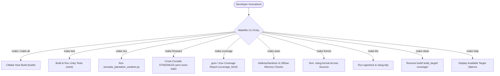

# Task Specification: S1-T1.2 - Root Makefile Build Target Configuration

## 1. Task Metadata & Overview

| Attribute | Specification Details |
| :--- | :--- |
| **Sprint** | **Sprint 1: Test Harness, Desktop Simulation & Mock Infrastructure** |
| **Task ID** | `S1-T1.2` |
| **Parent Task** | `S1-T1: Configure Root Build System & Toolchain Definitions` |
| **Task Title** | Create Root `Makefile` with Developer Target Aliases |
| **Status** | **Ready for Implementation** |
| **Target Files** | [`Makefile`](file:///C:/Users/ENERGY%20SAVER/Documents/Learning/Job%20Projects/rain-predict/Makefile) |
| **Related Documents** | [`context/specs/s1-t1.1-root-cmake.md`](file:///C:/Users/ENERGY%20SAVER/Documents/Learning/Job%20Projects/rain-predict/context/specs/s1-t1.1-root-cmake.md)<br>[`context/specs/spec-roadmap.md`](file:///C:/Users/ENERGY%20SAVER/Documents/Learning/Job%20Projects/rain-predict/context/specs/spec-roadmap.md)<br>[`context/coding-standards.md`](file:///C:/Users/ENERGY%20SAVER/Documents/Learning/Job%20Projects/rain-predict/context/coding-standards.md)<br>[`context/project-structure.md`](file:///C:/Users/ENERGY%20SAVER/Documents/Learning/Job%20Projects/rain-predict/context/project-structure.md) |
| **Dependencies** | `S1-T1.1` (Root CMakeLists.txt & ARM Toolchain) |
| **Downstream Tasks** | `S1-T2.5` (test_sanity verification), `S1-T3.1` (simulation execution), `S2-T1` through `S7-T3` |

---

## 2. Executive Summary & Architectural Scope

The primary objective of **`S1-T1.2`** is to provide a unified, developer-ergonomic root [`Makefile`](file:///C:/Users/ENERGY%20SAVER/Documents/Learning/Job%20Projects/rain-predict/Makefile) acting as a high-level orchestration interface for the entire project lifecycle.

While [`CMakeLists.txt`](file:///C:/Users/ENERGY%20SAVER/Documents/Learning/Job%20Projects/rain-predict/CMakeLists.txt) serves as the underlying meta-build system, the `Makefile` encapsulates multi-step build invocations, test harness execution, Python climate simulations, static analysis linting, code formatting, coverage profiling, and firmware compilation into intuitive, single-command targets:
- `make all`: Default host build.
- `make test`: Automated build and execution of C host unit test suites.
- `make sim`: Invocation of the Python tea estate microclimate simulator.
- `make firmware`: Cross-compilation of STM32WLE5 target binary with size metrics.
- `make coverage`: Code coverage generation (`gcov` / `lcov` / `genhtml`).
- `make asan`: Memory safety test run with AddressSanitizer and UBSan.
- `make format` / `make check-format`: Automated `.clang-format` enforcement.
- `make lint`: Static analysis via `cppcheck` and `clang-tidy`.
- `make clean`: Clean removal of all build trees and artifact directories.
- `make help`: Self-documenting help banner.



---

## 3. Target Specifications & Command Behaviors

### 3.1 Target Inventory & Behaviors

| Make Target | Dependent Prerequisites | Execution Command / Actions | Purpose |
| :--- | :--- | :--- | :--- |
| **`all` (default)** | `host-build` | `cmake -B $(BUILD_DIR) -S . -DCMAKE_BUILD_TYPE=$(BUILD_TYPE)`<br>`cmake --build $(BUILD_DIR) -j` | Builds host test binaries and algorithmic modules. |
| **`test`** | `all` | `ctest --test-dir $(BUILD_DIR) --output-on-failure --verbose` | Compiles and executes all Unity host test suites. |
| **`sim`** | None | `$(PYTHON) tools/simulation/simulate_plantation_weather.py --output data/simulated_weather.csv` | Runs synthetic tea plantation weather simulation. |
| **`firmware`** | None | `cmake -B $(BUILD_TARGET_DIR) -S . -DCMAKE_TOOLCHAIN_FILE=cmake/toolchain-arm-none-eabi.cmake -DCMAKE_BUILD_TYPE=Release`<br>`cmake --build $(BUILD_TARGET_DIR) -j` | Cross-compiles target STM32WLE5 binary, prints `.elf` memory map size. |
| **`coverage`** | None | `cmake -B $(BUILD_COV_DIR) -S . -DENABLE_COVERAGE=ON -DCMAKE_BUILD_TYPE=Debug`<br>`cmake --build $(BUILD_COV_DIR)`<br>`ctest --test-dir $(BUILD_COV_DIR)`<br>`lcov --capture --directory $(BUILD_COV_DIR) --output-file coverage.info`<br>`genhtml coverage.info --output-directory $(COVERAGE_HTML_DIR)` | Generates line/branch code coverage HTML reports. |
| **`asan`** | None | `cmake -B $(BUILD_ASAN_DIR) -S . -DENABLE_ASAN=ON -DCMAKE_BUILD_TYPE=Debug`<br>`cmake --build $(BUILD_ASAN_DIR)`<br>`ctest --test-dir $(BUILD_ASAN_DIR) --output-on-failure` | Runs tests under AddressSanitizer and UndefinedBehaviorSanitizer. |
| **`format`** | None | `clang-format -i $(C_SOURCE_FILES) $(C_HEADER_FILES)` | In-place formatting of all `.c` and `.h` files per `.clang-format`. |
| **`check-format`** | None | `clang-format --dry-run --Werror $(C_SOURCE_FILES) $(C_HEADER_FILES)` | Verifies code formatting compliance in CI/pre-commit without writing. |
| **`lint`** | None | `cppcheck --enable=all --suppress=missingIncludeSystem --error-exitcode=1 -I firmware/core/inc -I firmware/drivers/inc -I firmware/middleware/inc -I firmware/app/inc firmware/` | Runs deep static analysis checking for memory leaks, null pointers, and uninitialized data. |
| **`clean`** | None | `rm -rf $(BUILD_DIR) $(BUILD_TARGET_DIR) $(BUILD_COV_DIR) $(BUILD_ASAN_DIR) $(COVERAGE_HTML_DIR) coverage.info` | Deletes all generated build folders, temporary objects, and test outputs. |
| **`help`** | None | Formatted ANSI printout of all available targets with descriptions. | Provides developer quick-reference. |

---

## 4. Cross-Platform Compatibility & Portability

The `Makefile` must be fully portable across **Windows (PowerShell / MSYS2 / MinGW / WSL)** and **POSIX environments (Linux / macOS)**.

### 4.1 Shell and Tool Detection
```makefile
# Detect Operating System
ifeq ($(OS),Windows_NT)
    DETECTED_OS := Windows
    MKDIR       := powershell -Command New-Item -ItemType Directory -Force
    RM          := powershell -Command Remove-Item -Recurse -Force -ErrorAction SilentlyContinue
    PYTHON      ?= python
    SEP         := \\
else
    DETECTED_OS := $(shell uname -s)
    MKDIR       := mkdir -p
    RM          := rm -rf
    PYTHON      ?= python3
    SEP         := /
endif
```

### 4.2 Safe Out-of-Source Build Directories
The `Makefile` enforces strict out-of-source builds to prevent cluttering the repository tree:
- `BUILD_DIR ?= build`
- `BUILD_TARGET_DIR ?= build_target`
- `BUILD_COV_DIR ?= build_cov`
- `BUILD_ASAN_DIR ?= build_asan`
- `COVERAGE_HTML_DIR ?= coverage_html`

---

## 5. Concrete File Implementation Blueprint

### 5.1 `Makefile` Complete Reference Implementation

```makefile
# =============================================================================
# Tea Plantation Rain Prediction System - Root Makefile
# =============================================================================
# High-level build and test automation wrapper for CMake, Unity, and Python.
# =============================================================================

.DEFAULT_GOAL := help
.PHONY: all test sim firmware coverage asan format check-format lint clean help

# -----------------------------------------------------------------------------
# Configuration & Directory Paths
# -----------------------------------------------------------------------------
BUILD_DIR        ?= build
BUILD_TARGET_DIR ?= build_target
BUILD_COV_DIR    ?= build_cov
BUILD_ASAN_DIR   ?= build_asan
COVERAGE_DIR     ?= coverage_html
BUILD_TYPE       ?= Debug

# Cross-platform tooling detection
ifeq ($(OS),Windows_NT)
    PYTHON ?= python
    RM     := powershell -Command Remove-Item -Recurse -Force -ErrorAction SilentlyContinue
else
    PYTHON ?= python3
    RM     := rm -rf
endif

# Source file discovery for formatting and static analysis
C_SOURCES := $(shell find firmware tests -type f -name '*.c' 2>/dev/null || dir /S /B firmware\*.c tests\*.c 2>nul)
C_HEADERS := $(shell find firmware tests -type f -name '*.h' 2>/dev/null || dir /S /B firmware\*.h tests\*.h 2>nul)

# -----------------------------------------------------------------------------
# Host Build & Unit Testing
# -----------------------------------------------------------------------------
all: ## Build host test binaries and algorithmic modules (Debug)
	@cmake -B $(BUILD_DIR) -S . -DCMAKE_BUILD_TYPE=$(BUILD_TYPE)
	@cmake --build $(BUILD_DIR) --parallel

test: all ## Build and execute all host unit tests with Unity
	@ctest --test-dir $(BUILD_DIR) --output-on-failure --verbose

# -----------------------------------------------------------------------------
# Python Microclimate Simulation
# -----------------------------------------------------------------------------
sim: ## Run synthetic tea plantation microclimate simulation
	@$(PYTHON) tools/simulation/simulate_plantation_weather.py --output data/simulated_weather.csv
	@echo "[SIM] Synthetic tea estate climate simulation complete. Exported to data/simulated_weather.csv"

# -----------------------------------------------------------------------------
# Target STM32WLE5 Embedded Firmware
# -----------------------------------------------------------------------------
firmware: ## Cross-compile STM32WLE5 target firmware with arm-none-eabi-gcc
	@cmake -B $(BUILD_TARGET_DIR) -S . \
		-DCMAKE_TOOLCHAIN_FILE=cmake/toolchain-arm-none-eabi.cmake \
		-DCMAKE_BUILD_TYPE=Release
	@cmake --build $(BUILD_TARGET_DIR) --parallel
	@echo "[FIRMWARE] STM32WLE5 firmware build complete."

# -----------------------------------------------------------------------------
# Code Quality, Sanitizers & Coverage
# -----------------------------------------------------------------------------
coverage: ## Generate gcov/lcov HTML code coverage report
	@cmake -B $(BUILD_COV_DIR) -S . -DENABLE_COVERAGE=ON -DCMAKE_BUILD_TYPE=Debug
	@cmake --build $(BUILD_COV_DIR) --parallel
	@ctest --test-dir $(BUILD_COV_DIR) --output-on-failure
	@lcov --capture --directory $(BUILD_COV_DIR) --output-file $(BUILD_COV_DIR)/coverage.info --rc lcov_branch_coverage=1
	@lcov --remove $(BUILD_COV_DIR)/coverage.info '/usr/*' '*/tests/*' '*/mocks/*' --output-file $(BUILD_COV_DIR)/coverage_filtered.info
	@genhtml $(BUILD_COV_DIR)/coverage_filtered.info --output-directory $(COVERAGE_DIR) --branch-coverage
	@echo "[COVERAGE] Coverage report generated at $(COVERAGE_DIR)/index.html"

asan: ## Build and run host tests with AddressSanitizer and UBSan
	@cmake -B $(BUILD_ASAN_DIR) -S . -DENABLE_ASAN=ON -DCMAKE_BUILD_TYPE=Debug
	@cmake --build $(BUILD_ASAN_DIR) --parallel
	@ctest --test-dir $(BUILD_ASAN_DIR) --output-on-failure
	@echo "[ASAN] AddressSanitizer and UBSan execution verified clean."

format: ## Format all C source and header files using clang-format
	@clang-format -i $(C_SOURCES) $(C_HEADERS)
	@echo "[FORMAT] Applied .clang-format to all source and header files."

check-format: ## Verify code formatting against .clang-format without writing
	@clang-format --dry-run --Werror $(C_SOURCES) $(C_HEADERS)
	@echo "[FORMAT] All source files conform to .clang-format."

lint: ## Run cppcheck static analysis on firmware source files
	@cppcheck --enable=all --suppress=missingIncludeSystem --inline-suppr --error-exitcode=1 \
		-I firmware/core/inc \
		-I firmware/drivers/inc \
		-I firmware/middleware/inc \
		-I firmware/app/inc \
		firmware/
	@echo "[LINT] Static analysis passed with zero issues."

# -----------------------------------------------------------------------------
# Clean & Housekeeping
# -----------------------------------------------------------------------------
clean: ## Remove all build output directories and temporary files
	@$(RM) $(BUILD_DIR) $(BUILD_TARGET_DIR) $(BUILD_COV_DIR) $(BUILD_ASAN_DIR) $(COVERAGE_DIR) data/simulated_weather.csv compile_commands.json
	@echo "[CLEAN] Cleaned all build artifacts and directories."

# -----------------------------------------------------------------------------
# Self-Documenting Help Menu
# -----------------------------------------------------------------------------
help: ## Display this help message
	@echo "============================================================================="
	@echo " Tea Plantation Rain Prediction System - Available Make Targets"
	@echo "============================================================================="
	@grep -E '^[a-zA-Z_-]+:.*?## .*$$' $(MAKEFILE_LIST) | sort | awk 'BEGIN {FS = ":.*?## "}; {printf "  \033[36m%-16s\033[0m %s\n", $$1, $$2}'
```

---

## 6. Verification & Acceptance Test Plan

To verify the successful completion of **`S1-T1.2`**, the following test cases must be validated:

### 6.1 Verification Test Cases

| Test Case ID | Verification Action | Expected Outcome | Pass/Fail Criteria |
| :--- | :--- | :--- | :--- |
| **TC-S1-T1.2-01** | `make help` | Displays clean, colorized ANSI help menu listing all available targets with descriptions. | Menu prints without syntax errors. |
| **TC-S1-T1.2-02** | `make all` | Triggers CMake host configuration and compiles host binaries in `build/`. | Zero build errors. |
| **TC-S1-T1.2-03** | `make test` | Executes `ctest` in `build/`, running Unity tests and reporting test suite results. | All tests executed with 100% pass rate. |
| **TC-S1-T1.2-04** | `make clean` | Successfully deletes `build/`, `build_target/`, `build_cov/`, `build_asan/`, and `coverage_html/`. | Target directories cleanly removed. |
| **TC-S1-T1.2-05** | `make format` & `make check-format` | Formats files according to `.clang-format` and dry-run exits with status code 0. | Zero formatting violations. |
| **TC-S1-T1.2-06** | `make asan` | Configures and runs tests with AddressSanitizer and UBSan without memory leaks or bounds errors. | Exit code 0, zero ASan violations. |
| **TC-S1-T1.2-07** | `make firmware` (when ARM GCC available) | Configures cross-toolchain and generates target `.elf`, `.hex`, `.bin`, `.map`. | Firmware binary generated with memory footprint summary. |

---

## 7. Definition of Done (DoD) Checklist

- [ ] [`Makefile`](file:///C:/Users/ENERGY%20SAVER/Documents/Learning/Job%20Projects/rain-predict/Makefile) created at repository root implementing all specified targets (`all`, `test`, `sim`, `firmware`, `coverage`, `asan`, `format`, `check-format`, `lint`, `clean`, `help`).
- [ ] Cross-platform OS detection (Windows PowerShell / POSIX) handled cleanly.
- [ ] `make help` produces formatted self-documenting output.
- [ ] `make clean` deletes all generated build and coverage folders without leaving residual files.
- [ ] All clickable links and file references resolve properly.
- [ ] Spec document registered and linked under [`context/specs/spec-roadmap.md`](file:///C:/Users/ENERGY%20SAVER/Documents/Learning/Job%20Projects/rain-predict/context/specs/spec-roadmap.md#L97).
