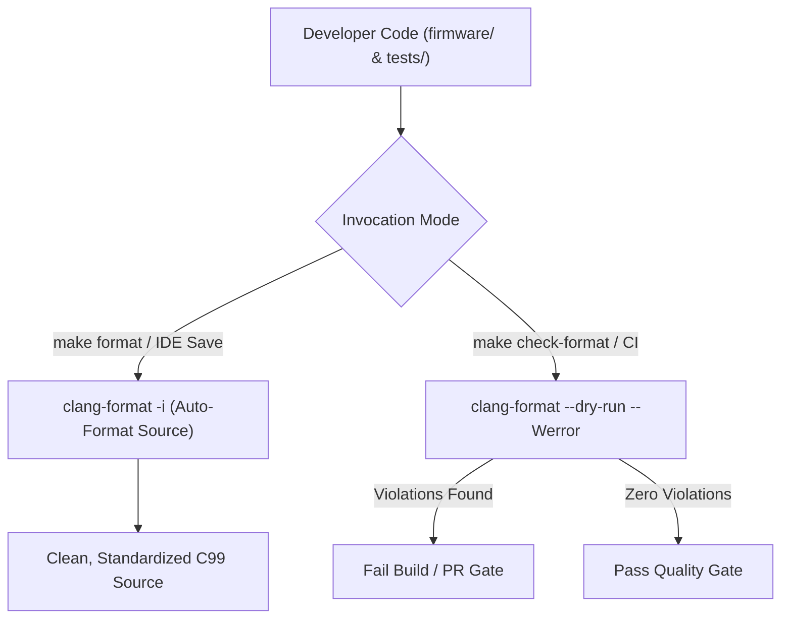

# Task Specification: S1-T1.3 - Automated Code Formatting Configuration (.clang-format)

## 1. Task Metadata & Overview

| Attribute | Specification Details |
| :--- | :--- |
| **Sprint** | **Sprint 1: Test Harness, Desktop Simulation & Mock Infrastructure** |
| **Task ID** | `S1-T1.3` |
| **Parent Task** | `S1-T1: Configure Root Build System & Toolchain Definitions` |
| **Task Title** | Configure Root `.clang-format` Code Style Rules |
| **Status** | **Ready for Implementation** |
| **Target Files** | [`.clang-format`](file:///C:/Users/ENERGY%20SAVER/Documents/Learning/Job%20Projects/rain-predict/.clang-format) |
| **Related Documents** | [`context/coding-standards.md`](file:///C:/Users/ENERGY%20SAVER/Documents/Learning/Job%20Projects/rain-predict/context/coding-standards.md)<br>[`context/project-structure.md`](file:///C:/Users/ENERGY%20SAVER/Documents/Learning/Job%20Projects/rain-predict/context/project-structure.md)<br>[`context/specs/s1-t1.1-root-cmake.md`](file:///C:/Users/ENERGY%20SAVER/Documents/Learning/Job%20Projects/rain-predict/context/specs/s1-t1.1-root-cmake.md)<br>[`context/specs/s1-t1.2-root-makefile.md`](file:///C:/Users/ENERGY%20SAVER/Documents/Learning/Job%20Projects/rain-predict/context/specs/s1-t1.2-root-makefile.md) |
| **Dependencies** | None (Can be implemented alongside `S1-T1.1` and `S1-T1.2`) |
| **Downstream Tasks** | All source code implementation tasks across Sprints 2 through 7 |

---

## 2. Executive Summary & Formatting Objectives

The primary objective of **`S1-T1.3`** is to establish an automated, deterministic code formatting configuration file ([`.clang-format`](file:///C:/Users/ENERGY%20SAVER/Documents/Learning/Job%20Projects/rain-predict/.clang-format)) at the repository root.

Code style consistency is critical for safety-critical embedded firmware and meteorological algorithms. Manual formatting leads to stylistic drift, noisy git diffs, and formatting disputes during reviews. By codifying the rules defined in [`context/coding-standards.md`](file:///C:/Users/ENERGY%20SAVER/Documents/Learning/Job%20Projects/rain-predict/context/coding-standards.md) into a machine-enforceable `.clang-format` configuration, developers and CI workflows can format entire trees in a single command (`make format`) or verify compliance on pull requests (`make check-format`).



---

## 3. Formatting Rules & Standards Mapping

In accordance with [`context/coding-standards.md`](file:///C:/Users/ENERGY%20SAVER/Documents/Learning/Job%20Projects/rain-predict/context/coding-standards.md) (Section 9), the `.clang-format` configuration must strictly enforce the following rules:

### 3.1 Core Style Parameters

| Rule Category | Requirement | Clang-Format Key & Value | Rationale |
| :--- | :--- | :--- | :--- |
| **Base Language** | C99 / C11 | `Language: Cpp`<br>`Standard: c++03` / `c++11` | Ensures formatting engine correctly parses standard C syntax. |
| **Indentation** | Exactly 4 spaces | `IndentWidth: 4`<br>`UseTab: Never`<br>`TabWidth: 4` | Prevents tab/space mixing across different IDEs and editors. |
| **Column Limit** | Maximum 100 characters | `ColumnLimit: 100` | Maintains readability on split-screen IDE layouts. |
| **Brace Style** | 1TBS / K&R Variant | `BreakBeforeBraces: Custom`<br>`BraceWrapping:`<br>`  AfterFunction: true`<br>`  AfterControlStatement: false`<br>`  AfterStruct: false`<br>`  AfterEnum: false` | Opening brace on new line for function definitions; same line for `if`, `while`, `for`, `switch`, and `struct`. |
| **Pointer Alignment** | Right-aligned to identifier | `PointerAlignment: Right` | Formats as `uint8_t *p_data` rather than `uint8_t* p_data`. |
| **Space Before Parens** | Control statements only | `SpaceBeforeParens: ControlStatements` | `if (condition)` vs `function(arg1, arg2)`. |
| **Struct & Array Alignment** | Align consecutive assignments | `AlignConsecutiveAssignments: false`<br>`AlignConsecutiveDeclarations: false` | Prevents large diff noise when adding new struct members. |
| **Comment Alignment** | Align trailing comments | `AlignTrailingComments: true` | Aligns register and bitmask inline comments neatly. |
| **Include Sorting** | Categorized priority sorting | `SortIncludes: CaseSensitive`<br>`IncludeCategories:` (Detailed in §4) | Ensures standard libraries precede project headers. |

---

## 4. Header Include Ordering & Categorization

To maintain predictable compilation units and prevent hidden header dependencies, `.clang-format` will categorize and group `#include` directives into priority tiers:

```
Category 1: Core C Standard Library Headers (<stdint.h>, <stdbool.h>, <math.h>, <string.h>)
Category 2: Third-Party & Vendor Headers (CMSIS, STM32CubeWL HAL/LL, Unity)
Category 3: Core & Board Support Headers ("main.h", "board_config.h")
Category 4: Driver Layer Headers ("bme280_driver.h", "i2c_bus.h")
Category 5: Middleware & Services Headers ("dew_point.h", "telemetry_codec.h")
Category 6: Application Layer Headers ("rain_algo.h", "app_state_machine.h")
```

### 4.1 Include Category Configuration
```yaml
IncludeCategories:
  - Regex:           '^<stdint\.h>|^<stdbool\.h>|^<stddef\.h>|^<math\.h>|^<string\.h>|^<stdlib\.h>|^<stdio\.h>'
    Priority:        1
  - Regex:           '^<.*>'
    Priority:        2
  - Regex:           '^"stm32wlxx.*"|^"core_cm4.*"|^"unity.*"'
    Priority:        3
  - Regex:           '^"main\.h"|^"board_config\.h"'
    Priority:        4
  - Regex:           '^".*_driver\.h"|^".*_bus\.h"|^"bsp_.*\.h"'
    Priority:        5
  - Regex:           '^"dew_point\.h"|^"moving_avg_filter\.h"|^"ring_buffer\.h"|^"telemetry_codec\.h"|^"power_mgr\.h"|^"flash_storage\.h"|^"lorawan_service\.h"'
    Priority:        6
  - Regex:           '^"rain_algo\.h"|^"zambretti\.h"|^"trend_detector\.h"|^"alert_manager\.h"|^"app_state_machine\.h"|^"measurement_scheduler\.h"'
    Priority:        7
  - Regex:           '.*'
    Priority:        8
```

---

## 5. Concrete File Implementation Blueprint

### 5.1 `.clang-format` Complete Reference Configuration

```yaml
# =============================================================================
# Tea Plantation Rain Prediction System - Clang-Format Configuration
# =============================================================================
# Enforces embedded C99 coding standards defined in context/coding-standards.md
# =============================================================================

BasedOnStyle: LLVM
Language: Cpp

# -----------------------------------------------------------------------------
# Language Standards & Indentation
# -----------------------------------------------------------------------------
Standard: Latest
IndentWidth: 4
TabWidth: 4
UseTab: Never
ColumnLimit: 100

# -----------------------------------------------------------------------------
# Brace Wrapping (1TBS / K&R Variant)
# -----------------------------------------------------------------------------
BreakBeforeBraces: Custom
BraceWrapping:
  AfterCaseLabel: false
  AfterClass: false
  AfterControlStatement: false
  AfterEnum: false
  AfterFunction: true
  AfterNamespace: false
  AfterStruct: false
  AfterUnion: false
  AfterExternBlock: false
  BeforeCatch: false
  BeforeElse: false
  IndentBraces: false
  SplitEmptyFunction: true
  SplitEmptyRecord: true
  SplitEmptyNamespace: true

# -----------------------------------------------------------------------------
# Spacing & Alignment
# -----------------------------------------------------------------------------
PointerAlignment: Right
ReferenceAlignment: Right
DerivePointerAlignment: false

SpaceAfterCStyleCast: false
SpaceAfterLogicalNot: false
SpaceBeforeAssignmentOperators: true
SpaceBeforeCaseColon: false
SpaceBeforeParens: ControlStatements
SpaceAroundPointerQualifiers: Default
SpacesInContainerLiterals: true
SpacesInCStyleCastParentheses: false
SpacesInParentheses: false
SpacesInSquareBrackets: false

# -----------------------------------------------------------------------------
# Alignment of Operands, Parameters & Comments
# -----------------------------------------------------------------------------
AlignAfterOpenBracket: Align
AlignConsecutiveMacros: true
AlignConsecutiveAssignments: false
AlignConsecutiveBitFields: true
AlignConsecutiveDeclarations: false
AlignEscapedNewlines: Right
AlignOperands: Align
AlignTrailingComments: true

# -----------------------------------------------------------------------------
# Line Wrapping & Breaking
# -----------------------------------------------------------------------------
AllowShortBlocksOnASingleLine: Never
AllowShortCaseLabelsOnASingleLine: false
AllowShortEnumsOnASingleLine: false
AllowShortFunctionsOnASingleLine: None
AllowShortIfStatementsOnASingleLine: Never
AllowShortLoopsOnASingleLine: false

AlwaysBreakAfterReturnType: None
AlwaysBreakBeforeMultilineStrings: false
BinPackArguments: true
BinPackParameters: true
BreakBeforeBinaryOperators: None
BreakBeforeTernaryOperators: true
BreakStringLiterals: true

# -----------------------------------------------------------------------------
# Include Directives & Header Sorting
# -----------------------------------------------------------------------------
SortIncludes: CaseSensitive
IncludeBlocks: Regroup

IncludeCategories:
  # 1. Standard C Library Headers
  - Regex:           '^<(stdint|stdbool|stddef|math|string|stdlib|stdio|limits|float)\.h>'
    Priority:        1
    SortPriority:    1
  # 2. Other System Headers
  - Regex:           '^<.*>'
    Priority:        2
    SortPriority:    2
  # 3. Vendor / CMSIS / HAL / Unity Headers
  - Regex:           '^"(stm32wlxx|core_cm4|cmsis|unity).*\.h"'
    Priority:        3
    SortPriority:    3
  # 4. Core Hardware & Board Configuration Headers
  - Regex:           '^"(main|board_config|stm32wlxx_hal_conf)\.h"'
    Priority:        4
    SortPriority:    4
  # 5. Driver / BSP Layer Headers
  - Regex:           '^"(bme280_driver|opt3001_driver|rain_gauge_driver|modbus_rtu|sdi12_driver|i2c_bus|uart_bus|bsp_power_rails|bsp_indicators)\.h"'
    Priority:        5
    SortPriority:    5
  # 6. Middleware Layer Headers
  - Regex:           '^"(dew_point|moving_avg_filter|ring_buffer|telemetry_codec|power_mgr|flash_storage|lorawan_service)\.h"'
    Priority:        6
    SortPriority:    6
  # 7. Application Layer Headers
  - Regex:           '^"(rain_algo|zambretti|trend_detector|alert_manager|app_state_machine|measurement_scheduler)\.h"'
    Priority:        7
    SortPriority:    7
  # 8. All other local headers
  - Regex:           '.*'
    Priority:        8
    SortPriority:    8

# -----------------------------------------------------------------------------
# Comments & Formatting Control
# -----------------------------------------------------------------------------
CommentPragmas: '^ IWYU pragma:'
PenaltyBreakAssignment: 100
PenaltyBreakBeforeFirstCallParameter: 50
PenaltyBreakComment: 300
PenaltyBreakFirstLessLess: 120
PenaltyBreakString: 1000
PenaltyExcessCharacter: 1000000
PenaltyReturnTypeOnItsOwnLine: 60
```

---

## 6. IDE & Toolchain Integration Guide

### 6.1 VS Code (`.vscode/settings.json`)
```json
{
    "C_Cpp.clang_format_path": "clang-format",
    "C_Cpp.clang_format_style": "file",
    "editor.formatOnSave": true,
    "[c]": {
        "editor.defaultFormatter": "ms-vscode.cpptools"
    }
}
```

### 6.2 Git Pre-Commit Hook Integration (`.git/hooks/pre-commit`)
```bash
#!/bin/sh
# Check formatting of all staged C source and header files
STAGED_FILES=$(git diff --cached --name-only --diff-filter=ACM | grep -E '\.(c|h)$')

if [ -n "$STAGED_FILES" ]; then
    clang-format --dry-run --Werror $STAGED_FILES
    if [ $? -ne 0 ]; then
        echo "\033[31m[ERROR] Clang-format violations detected in staged files.\033[0m"
        echo "Run 'make format' or 'clang-format -i <file>' and re-stage."
        exit 1
    fi
fi
exit 0
```

---

## 7. Verification & Acceptance Test Plan

To verify the successful completion of **`S1-T1.3`**, the following verification procedures must be executed:

### 7.1 Verification Test Cases

| Test Case ID | Verification Action | Expected Outcome | Pass/Fail Criteria |
| :--- | :--- | :--- | :--- |
| **TC-S1-T1.3-01** | `clang-format --dump-config` at repo root | Confirms `.clang-format` is discovered, parsed without YAML syntax errors, and reflects 4-space indent and 100-char column limit. | Clean parse, valid configuration dump. |
| **TC-S1-T1.3-02** | Function Brace Formatting Test | Formats test function: verifies function opening brace wraps to newline, while `if`/`for`/`while` opening braces stay on same line. | 1TBS / K&R brace formatting verified. |
| **TC-S1-T1.3-03** | Pointer Alignment Test | Formats `uint8_t* ptr;` -> verifies output is `uint8_t *ptr;`. | Pointer right-alignment verified. |
| **TC-S1-T1.3-04** | Header Include Sorting Test | Formats mixed `#include` list -> verifies standard headers (`<stdint.h>`) precede project headers (`"rain_algo.h"`). | Include priority categorization verified. |
| **TC-S1-T1.3-05** | Dry-Run Enforcement (`make check-format`) | Runs `clang-format --dry-run --Werror` against formatted test files. | Exit code 0, zero warnings. |

---

## 8. Definition of Done (DoD) Checklist

- [x] [`.clang-format`](file:///C:/Users/ENERGY%20SAVER/Documents/Learning/Job%20Projects/rain-predict/.clang-format) created at repository root conforming to [`context/coding-standards.md`](file:///C:/Users/ENERGY%20SAVER/Documents/Learning/Job%20Projects/rain-predict/context/coding-standards.md).
- [x] 4-space indentation, no tabs, 100-character line limit configured.
- [x] 1TBS / K&R brace wrapping configured (function on new line, control statements on same line).
- [x] 8-tier include sorting priority rules established.
- [x] All clickable links and file references resolve properly.
- [x] Spec document registered and linked under [`context/specs/spec-roadmap.md`](file:///C:/Users/ENERGY%20SAVER/Documents/Learning/Job%20Projects/rain-predict/context/specs/spec-roadmap.md#L98).
