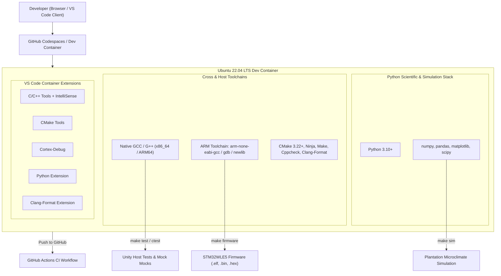
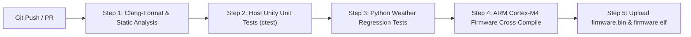

# Task Specification: S1-T1.4 - Cloud-Native Dev Container & GitHub Codespaces Configuration

## 1. Task Metadata & Overview

| Attribute | Specification Details |
| :--- | :--- |
| **Sprint** | **Sprint 1: Test Harness, Desktop Simulation & Mock Infrastructure** |
| **Task ID** | `S1-T1.4` |
| **Parent Task** | `S1-T1: Configure Root Build System & Toolchain Definitions` |
| **Task Title** | Configure GitHub Codespaces & VS Code Dev Container Environment |
| **Status** | **Ready for Implementation** |
| **Target Files** | [`.devcontainer/Dockerfile`](file:///C:/Users/ENERGY%20SAVER/Documents/Learning/Job%20Projects/rain-predict/.devcontainer/Dockerfile)<br>[`.devcontainer/devcontainer.json`](file:///C:/Users/ENERGY%20SAVER/Documents/Learning/Job%20Projects/rain-predict/.devcontainer/devcontainer.json)<br>[`.devcontainer/post-create.sh`](file:///C:/Users/ENERGY%20SAVER/Documents/Learning/Job%20Projects/rain-predict/.devcontainer/post-create.sh)<br>[`.github/workflows/ci.yml`](file:///C:/Users/ENERGY%20SAVER/Documents/Learning/Job%20Projects/rain-predict/.github/workflows/ci.yml) |
| **Related Documents** | [`context/code-build.md`](file:///C:/Users/ENERGY%20SAVER/Documents/Learning/Job%20Projects/rain-predict/context/code-build.md)<br>[`.clang-format`](file:///C:/Users/ENERGY%20SAVER/Documents/Learning/Job%20Projects/rain-predict/.clang-format)<br>[`context/specs/s1-t1.1-root-cmake.md`](file:///C:/Users/ENERGY%20SAVER/Documents/Learning/Job%20Projects/rain-predict/context/specs/s1-t1.1-root-cmake.md)<br>[`context/specs/s1-t1.2-root-makefile.md`](file:///C:/Users/ENERGY%20SAVER/Documents/Learning/Job%20Projects/rain-predict/context/specs/s1-t1.2-root-makefile.md)<br>[`context/specs/s1-t1.3-clang-format.md`](file:///C:/Users/ENERGY%20SAVER/Documents/Learning/Job%20Projects/rain-predict/context/specs/s1-t1.3-clang-format.md) |
| **Dependencies** | [`S1-T1.1`](file:///C:/Users/ENERGY%20SAVER/Documents/Learning/Job%20Projects/rain-predict/context/specs/s1-t1.1-root-cmake.md), [`S1-T1.2`](file:///C:/Users/ENERGY%20SAVER/Documents/Learning/Job%20Projects/rain-predict/context/specs/s1-t1.2-root-makefile.md), [`S1-T1.3`](file:///C:/Users/ENERGY%20SAVER/Documents/Learning/Job%20Projects/rain-predict/context/specs/s1-t1.3-clang-format.md) |
| **Downstream Tasks** | All host test, firmware compilation, and simulation tasks across Sprints 1 through 7 |

---

## 2. Executive Summary & Architectural Scope

The primary objective of **`S1-T1.4`** is to establish a zero-install, cloud-native development environment using **GitHub Codespaces** and **VS Code Dev Containers** for the **Tea Plantation Rain Prediction System**.

Embedded systems development traditionally requires complex local toolchains (`arm-none-eabi-gcc`, GDB, OpenOCD, CMake, Ninja, Python data science packages), which can be difficult to set up consistently across developer machines and operating systems. By codifying the development environment into container definitions (`.devcontainer/Dockerfile` and `.devcontainer/devcontainer.json`), developers can launch a fully configured, browser-accessible IDE in seconds.



---

## 3. Technical Requirements & Toolchain Package Matrix

The container image defined in `.devcontainer/Dockerfile` must provide all required compilers, build systems, static analyzers, and Python scientific libraries.

### 3.1 Package Matrix

| Category | Package / Tool | Version / Source | Purpose |
| :--- | :--- | :--- | :--- |
| **Base Image** | `mcr.microsoft.com/devcontainers/base:ubuntu-22.04` | Official MS Dev Container Base | Clean, non-root user (`vscode`) baseline with pre-configured permissions. |
| **Host Compilers** | `build-essential` (`gcc`, `g++`, `make`) | Ubuntu APT (GCC 11+) | Compiles host unit test harnesses and mock sensor HAL drivers. |
| **Cross Compiler** | `gcc-arm-none-eabi`<br>`libnewlib-arm-none-eabi`<br>`gdb-multiarch` | Ubuntu APT / GNU Arm Embedded | Cross-compiles ARM Cortex-M4 firmware targeting STM32WLE5 SoC. |
| **Build Tools** | `cmake` ($\ge 3.22$)<br>`ninja-build` | Ubuntu APT | Generates and executes high-speed parallel build targets. |
| **Code Hygiene** | `clang-format`<br>`cppcheck` | Ubuntu APT | Enforces `.clang-format` styling and MISRA/static security rules. |
| **Python Stack** | `python3`<br>`python3-pip`<br>`python3-venv` | Ubuntu APT | Executes synthetic plantation microclimate models and validation tools. |
| **Python Packages** | `numpy`, `pandas`, `matplotlib`, `scipy` | PyPI (`pip3`) | Vectorized diurnal curve generation, storm models, and contingency matrices. |

---

## 4. Dev Container File Specifications

### 4.1 `.devcontainer/Dockerfile` Specification

The Dockerfile must adhere to standard OCI container best practices:
1. Multi-stage package installation with `apt-get clean` and `rm -rf /var/lib/apt/lists/*` to minimize image footprint.
2. Non-interactive frontend flags (`DEBIAN_FRONTEND=noninteractive`) to prevent build hangs.
3. Install Python dependencies globally or in a shared environment accessible to the default `vscode` user.

```dockerfile
FROM mcr.microsoft.com/devcontainers/base:ubuntu-22.04

# Prevent interactive dialogs during apt installs
ENV DEBIAN_FRONTEND=noninteractive

# Install native compilation tools, ARM cross-compiler, and utility packages
RUN apt-get update && apt-get install -y --no-install-recommends \
    build-essential \
    cmake \
    ninja-build \
    make \
    gcc-arm-none-eabi \
    libnewlib-arm-none-eabi \
    gdb-multiarch \
    clang-format \
    cppcheck \
    python3 \
    python3-pip \
    python3-venv \
    git \
    curl \
    && apt-get clean \
    && rm -rf /var/lib/apt/lists/*

# Install Python scientific packages for weather simulation and telemetry decoders
RUN pip3 install --no-cache-dir \
    numpy \
    pandas \
    matplotlib \
    scipy

ENV DEBIAN_FRONTEND=dialog
```

---

### 4.2 `.devcontainer/devcontainer.json` Specification

The `devcontainer.json` configuration configures the remote VS Code instance:
1. **Container Customizations**:
   - `ms-vscode.cpptools` (C/C++ language support & debugging)
   - `ms-vscode.cmake-tools` (CMake visual integration)
   - `marus25.cortex-debug` (Embedded ARM Cortex GDB debugging support)
   - `ms-python.python` (Python script execution & linting)
   - `xaver.clang-format` (Auto-format on save adhering to `.clang-format`)
2. **VS Code Settings**:
   - `editor.formatOnSave: true`
   - `C_Cpp.clang_format_path: "clang-format"`
   - `cmake.configureOnOpen: true`
3. **Lifecycle Hooks**:
   - `postCreateCommand`: Execute `chmod +x .devcontainer/post-create.sh && .devcontainer/post-create.sh` to initialize build directories and verify toolchains.

```json
{
  "name": "STM32WLE5 Rain Predict Dev Environment",
  "build": {
    "dockerfile": "Dockerfile"
  },
  "customizations": {
    "vscode": {
      "settings": {
        "editor.formatOnSave": true,
        "editor.tabSize": 4,
        "editor.insertSpaces": true,
        "C_Cpp.clang_format_style": "file",
        "C_Cpp.default.cStandard": "c99",
        "cmake.configureOnOpen": true,
        "python.defaultInterpreterPath": "/usr/bin/python3"
      },
      "extensions": [
        "ms-vscode.cpptools",
        "ms-vscode.cmake-tools",
        "marus25.cortex-debug",
        "ms-python.python",
        "xaver.clang-format"
      ]
    }
  },
  "remoteUser": "vscode",
  "postCreateCommand": "bash .devcontainer/post-create.sh"
}
```

---

### 4.3 `.devcontainer/post-create.sh` Specification

The post-creation script executes automatically when a Codespace or Dev Container is created:
1. Print toolchain versions (`gcc --version`, `arm-none-eabi-gcc --version`, `cmake --version`, `python3 --version`).
2. Run initial CMake configuration check.
3. Validate `.clang-format` installation.

```bash
#!/usr/bin/env bash
set -e

echo "=== Initializing Rain-Predict Cloud Environment ==="
echo "Host GCC:           $(gcc --version | head -n 1)"
echo "ARM GCC:            $(arm-none-eabi-gcc --version | head -n 1)"
echo "CMake:              $(cmake --version | head -n 1)"
echo "Python:             $(python3 --version)"
echo "Clang-Format:       $(clang-format --version)"
echo "==================================================="
echo "Environment ready for build and test."
```

---

## 5. Automated CI/CD Workflow (`.github/workflows/ci.yml`)

To ensure build and test integrity in continuous integration, a GitHub Actions workflow must mirror the Codespace environment:



### Pipeline Steps:
1. **Linting & Code Quality**: Run `clang-format --dry-run --Werror` and `cppcheck --enable=all --error-exitcode=1`.
2. **Host Unit Tests**: Configure CMake for `HOST` platform, build with `ninja` or `make`, execute `ctest --output-on-failure`.
3. **Simulation Suite**: Run `python3 tools/simulation/simulate_plantation_weather.py --test` and `test_forecast_accuracy.py`.
4. **Target Cross-Compilation**: Cross-compile with `cmake -B build-arm -S . -DCMAKE_TOOLCHAIN_FILE=cmake/toolchain-arm-none-eabi.cmake` and generate `.bin`/`.elf` binaries.
5. **Artifact Publishing**: Upload compiled `.bin` and `.elf` files to GitHub Actions Run artifacts.

---

## 6. Verification & Test Plan

| Verification Step | Command | Expected Result | Pass Criteria |
| :--- | :--- | :--- | :--- |
| **Container Build** | `docker build -f .devcontainer/Dockerfile .` | Docker image builds without warnings or package resolution errors. | Zero build exit code. |
| **Toolchain Detection** | `arm-none-eabi-gcc -v` | Outputs ARM GCC target `arm-none-eabi`. | Binary present in `$PATH`. |
| **Host Unit Test Build** | `cmake -B build -S . && cmake --build build` | Builds test executables with host GCC. | Compilation with zero warnings (`-Werror`). |
| **CTest Execution** | `ctest --test-dir build --output-on-failure` | Executes test runner and outputs pass/fail status. | 100% test assertions pass. |
| **Python Simulation** | `python3 -c "import numpy, pandas, matplotlib, scipy; print('OK')"` | Scientific libraries import cleanly. | Outputs `OK`. |
| **Codespace Launch** | GitHub Web UI -> `Create codespace on main` | Workspace loads in browser with extensions initialized. | Browser IDE ready in $<90\text{s}$. |

---

## 7. Definition of Done

1. [ ] `.devcontainer/Dockerfile` created with host GCC, ARM GCC, CMake, Cppcheck, Clang-Format, and Python libraries.
2. [ ] `.devcontainer/devcontainer.json` created with VS Code settings and pre-configured extensions.
3. [ ] `.devcontainer/post-create.sh` created with executable permissions and verification diagnostics.
4. [ ] `.github/workflows/ci.yml` created to automate linting, host testing, simulation, and firmware cross-compilation on push.
5. [ ] Task specification referenced in [`context/specs/spec-roadmap.md`](file:///C:/Users/ENERGY%20SAVER/Documents/Learning/Job%20Projects/rain-predict/context/specs/spec-roadmap.md) and [`context/current-feature.md`](file:///C:/Users/ENERGY%20SAVER/Documents/Learning/Job%20Projects/rain-predict/context/current-feature.md).
