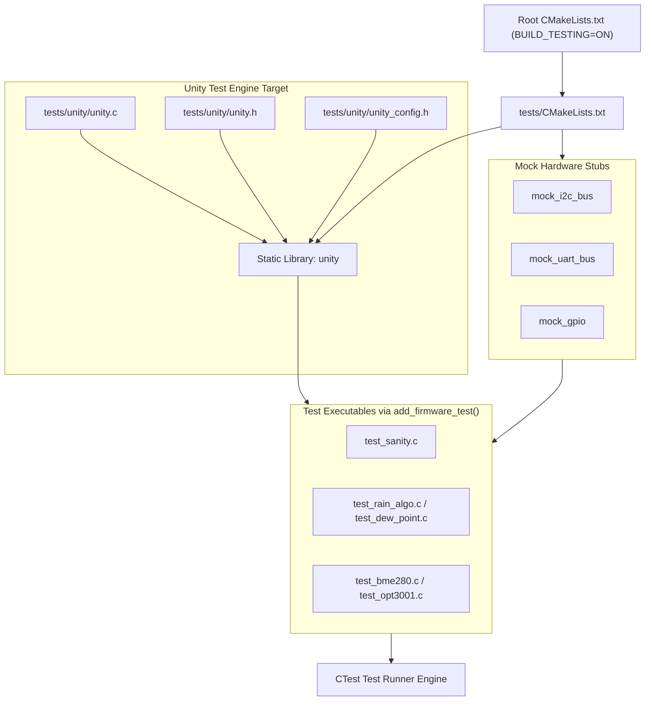

# Task Specification: S1-T2.1 - Unity Test Framework Integration & Test Build Configuration

## 1. Task Metadata & Overview

| Attribute | Specification Details |
| :--- | :--- |
| **Sprint** | **Sprint 1: Test Harness, Desktop Simulation & Mock Infrastructure** |
| **Task ID** | `S1-T2.1` |
| **Parent Task** | `S1-T2: Setup Unity Unit Testing Framework & Mock Hardware Layer` |
| **Task Title** | Integrate Unity Test Framework & Configure `tests/CMakeLists.txt` |
| **Status** | **Ready for Implementation** |
| **Target Files** | [`tests/CMakeLists.txt`](file:///C:/Users/ENERGY%20SAVER/Documents/Learning/Job%20Projects/rain-predict/tests/CMakeLists.txt)<br>[`tests/unity/unity.h`](file:///C:/Users/ENERGY%20SAVER/Documents/Learning/Job%20Projects/rain-predict/tests/unity/unity.h)<br>[`tests/unity/unity.c`](file:///C:/Users/ENERGY%20SAVER/Documents/Learning/Job%20Projects/rain-predict/tests/unity/unity.c)<br>[`tests/unity/unity_internals.h`](file:///C:/Users/ENERGY%20SAVER/Documents/Learning/Job%20Projects/rain-predict/tests/unity/unity_internals.h)<br>[`tests/unity/unity_config.h`](file:///C:/Users/ENERGY%20SAVER/Documents/Learning/Job%20Projects/rain-predict/tests/unity/unity_config.h) |
| **Related Documents** | [`context/specs/s1-t1.1-root-cmake.md`](file:///C:/Users/ENERGY%20SAVER/Documents/Learning/Job%20Projects/rain-predict/context/specs/s1-t1.1-root-cmake.md)<br>[`context/specs/s1-t1.2-root-makefile.md`](file:///C:/Users/ENERGY%20SAVER/Documents/Learning/Job%20Projects/rain-predict/context/specs/s1-t1.2-root-makefile.md)<br>[`context/coding-standards.md`](file:///C:/Users/ENERGY%20SAVER/Documents/Learning/Job%20Projects/rain-predict/context/coding-standards.md)<br>[`context/project-structure.md`](file:///C:/Users/ENERGY%20SAVER/Documents/Learning/Job%20Projects/rain-predict/context/project-structure.md) |
| **Dependencies** | `S1-T1.1` (Root CMakeLists.txt & Build Configuration) |
| **Downstream Tasks** | `S1-T2.2` to `S1-T2.4` (Mock Drivers), `S1-T2.5` (`test_sanity.c`), and all Sprint 2–7 unit/integration test suites |

---

## 2. Executive Summary & Architectural Scope

The primary objective of **`S1-T2.1`** is to embed the **Unity C Unit Testing Framework** (by ThrowTheSwitch) into [`tests/unity/`](file:///C:/Users/ENERGY%20SAVER/Documents/Learning/Job%20Projects/rain-predict/tests/unity) and establish the subordinate test build script [`tests/CMakeLists.txt`](file:///C:/Users/ENERGY%20SAVER/Documents/Learning/Job%20Projects/rain-predict/tests/CMakeLists.txt).

Adhering to Test-Driven Development (TDD) for embedded firmware, Unity provides a lightweight, pure-C99 testing harness capable of compiling and executing natively on host platforms (x86_64 / PC) without hardware-in-the-loop (HIL) overhead. This enables rapid verification of meteorological algorithms, moving-average filters, dew-point psychrometric formulas, and bit-packed telemetry serializers prior to deployment on STM32WLE5 silicon.



---

## 3. Technical Requirements & Unity Configuration

### 3.1 Framework Selection & Isolation
- **Framework**: Unity v2.5.x (C99 compliant, zero external dependencies).
- **Placement**: Contained entirely under [`tests/unity/`](file:///C:/Users/ENERGY%20SAVER/Documents/Learning/Job%20Projects/rain-predict/tests/unity) (vendored in-tree, avoiding system package discrepancies).
- **Zero Dynamic Memory**: Unity runs entirely with static buffers and macro assertions, matching our zero-dynamic-memory engineering standard.

### 3.2 Custom Unity Configuration (`tests/unity/unity_config.h`)
To support embedded data types and high-precision meteorological floating-point checks, Unity must be customized with compile-time definitions:

| Configuration Macro | Setting / Definition | Purpose |
| :--- | :--- | :--- |
| `UNITY_INCLUDE_CONFIG_H` | Defined | Instructs Unity to include `unity_config.h`. |
| `UNITY_INT_WIDTH` | `32` | Standardizes integer assertions for Cortex-M4 32-bit registers. |
| `UNITY_FLOAT_VERBOSE` | Defined | Outputs exact float/double discrepancies on assertion failure. |
| `UNITY_INCLUDE_FLOAT` | Defined | Enables `TEST_ASSERT_EQUAL_FLOAT` and `TEST_ASSERT_FLOAT_WITHIN` for psychrometric formulas. |
| `UNITY_INCLUDE_DOUBLE` | Defined | Enables double precision assertions for reference data verification. |
| `UNITY_OUTPUT_COLOR` | Defined | Colorizes console test output (green for pass, red for fail). |

---

## 4. `tests/CMakeLists.txt` Architecture & Helper Macros

To eliminate boilerplate when adding new tests, `tests/CMakeLists.txt` will define a standardized CMake function: `add_firmware_test()`.

### 4.1 Function Specification: `add_firmware_test(TEST_NAME SOURCES... LIBS...)`
- **Creates**: Executable target `test_${TEST_NAME}`.
- **Includes**:
  - `tests/unity`
  - `tests/mocks`
  - `firmware/core/inc`
  - `firmware/drivers/inc`
  - `firmware/middleware/inc`
  - `firmware/app/inc`
- **Links**: `unity`, mock libraries, and firmware subsystem libraries.
- **Registers**: Automatically calls `add_test(NAME ${TEST_NAME} COMMAND test_${TEST_NAME})` for CTest integration.

---

## 5. Concrete File Implementation Blueprint

### 5.1 `tests/unity/unity_config.h` Blueprint

```c
/**
 * @file    unity_config.h
 * @brief   Custom configuration for Unity unit testing framework.
 * @details Optimizes Unity for embedded C99 meteorological and sensor testing.
 */

#ifndef UNITY_CONFIG_H
#define UNITY_CONFIG_H

#ifdef __cplusplus
extern "C" {
#endif

/* Standard 32-bit embedded integer width */
#define UNITY_INT_WIDTH         32
#define UNITY_LONG_WIDTH        32
#define UNITY_POINTER_WIDTH     sizeof(void*)

/* Enable floating-point assertions for meteorological calculations */
#define UNITY_INCLUDE_FLOAT
#define UNITY_INCLUDE_DOUBLE
#define UNITY_FLOAT_VERBOSE

/* Enable colorized terminal reporting */
#define UNITY_OUTPUT_COLOR

/* Standard output macro redirection */
#include <stdio.h>
#define UNITY_OUTPUT_CHAR(c)    putchar(c)
#define UNITY_OUTPUT_FLUSH()    fflush(stdout)

#ifdef __cplusplus
}
#endif

#endif /* UNITY_CONFIG_H */
```

### 5.2 `tests/CMakeLists.txt` Blueprint

```cmake
# =============================================================================
# Tea Plantation Rain Prediction System - Host Unit Testing Build
# =============================================================================

cmake_minimum_required(VERSION 3.16)

# Enforce include path visibility
set(UNITY_DIR ${CMAKE_CURRENT_SOURCE_DIR}/unity)
set(MOCKS_DIR ${CMAKE_CURRENT_SOURCE_DIR}/mocks)

# -----------------------------------------------------------------------------
# 1. Unity Framework Static Library Target
# -----------------------------------------------------------------------------
add_library(unity STATIC
    ${UNITY_DIR}/unity.c
)

target_include_directories(unity PUBLIC
    ${UNITY_DIR}
)

target_compile_definitions(unity PUBLIC
    UNITY_INCLUDE_CONFIG_H
)

# Apply strict warning flags except for third-party macro pedantics
target_compile_options(unity PRIVATE
    -Wall
    -Wextra
)

# -----------------------------------------------------------------------------
# 2. Mock Hardware Layer Static Library Target
# -----------------------------------------------------------------------------
add_library(test_mocks STATIC
    ${MOCKS_DIR}/mock_i2c_bus.c
    ${MOCKS_DIR}/mock_uart_bus.c
    ${MOCKS_DIR}/mock_gpio.c
)

target_include_directories(test_mocks PUBLIC
    ${MOCKS_DIR}
    ${CMAKE_SOURCE_DIR}/firmware/core/inc
    ${CMAKE_SOURCE_DIR}/firmware/drivers/inc
    ${CMAKE_SOURCE_DIR}/firmware/middleware/inc
    ${CMAKE_SOURCE_DIR}/firmware/app/inc
)

target_link_libraries(test_mocks PUBLIC
    unity
)

# -----------------------------------------------------------------------------
# 3. Standard Helper Function: add_firmware_test
# -----------------------------------------------------------------------------
function(add_firmware_test TEST_NAME)
    set(options "")
    set(oneValueArgs "")
    set(multiValueArgs SOURCES LIBRARIES INCLUDES)
    cmake_parse_arguments(TEST "${options}" "${oneValueArgs}" "${multiValueArgs}" ${ARGN})

    set(EXEC_NAME test_${TEST_NAME})

    add_executable(${EXEC_NAME}
        ${TEST_SOURCES}
    )

    target_include_directories(${EXEC_NAME} PRIVATE
        ${UNITY_DIR}
        ${MOCKS_DIR}
        ${CMAKE_SOURCE_DIR}/firmware/core/inc
        ${CMAKE_SOURCE_DIR}/firmware/drivers/inc
        ${CMAKE_SOURCE_DIR}/firmware/middleware/inc
        ${CMAKE_SOURCE_DIR}/firmware/app/inc
        ${TEST_INCLUDES}
    )

    target_link_libraries(${EXEC_NAME} PRIVATE
        unity
        test_mocks
        ${TEST_LIBRARIES}
    )

    # Register test with CTest test runner
    add_test(NAME ${TEST_NAME} COMMAND ${EXEC_NAME})

    # Set custom test properties
    set_tests_properties(${TEST_NAME} PROPERTIES
        TIMEOUT 10
        FAIL_REGULAR_EXPRESSION "FAIL"
    )
endfunction()

# -----------------------------------------------------------------------------
# 4. Initial Sanity Test Registration
# -----------------------------------------------------------------------------
add_firmware_test(sanity
    SOURCES unit/test_sanity.c
)

# -----------------------------------------------------------------------------
# 5. Domain Unit Tests (Sprint 2 - 5 Registration Placeholders)
# -----------------------------------------------------------------------------
# add_firmware_test(ring_buffer SOURCES unit/test_ring_buffer.c LIBRARIES firmware_middleware)
# add_firmware_test(dew_point   SOURCES unit/test_dew_point.c   LIBRARIES firmware_middleware)
# add_firmware_test(zambretti   SOURCES unit/test_zambretti.c   LIBRARIES firmware_app)
# add_firmware_test(rain_algo   SOURCES unit/test_rain_algo.c   LIBRARIES firmware_app)
```

---

## 6. Verification & Acceptance Test Plan

To verify the successful completion of **`S1-T2.1`**, the following test cases must be validated:

### 6.1 Verification Test Cases

| Test Case ID | Verification Action | Expected Outcome | Pass/Fail Criteria |
| :--- | :--- | :--- | :--- |
| **TC-S1-T2.1-01** | Unity Header Availability | [`tests/unity/unity.h`](file:///C:/Users/ENERGY%20SAVER/Documents/Learning/Job%20Projects/rain-predict/tests/unity/unity.h), `unity.c`, `unity_internals.h`, and `unity_config.h` are present and valid C99. | Files compile without warnings. |
| **TC-S1-T2.1-02** | CMake Subdirectory Configuration | Running `cmake -B build -S .` in host mode successfully discovers and generates `tests/CMakeLists.txt`. | Zero CMake syntax errors. |
| **TC-S1-T2.1-03** | Unity Static Library Build | `cmake --build build --target unity` builds `libunity.a` (or `unity.lib`). | Static library created cleanly. |
| **TC-S1-T2.1-04** | `add_firmware_test()` Macro Verification | A test executable registered via `add_firmware_test()` links against `unity` and includes all firmware headers. | Executable compiles and links. |
| **TC-S1-T2.1-05** | CTest Discovery Check | `ctest --test-dir build -N` lists registered test targets. | All registered tests enumerated. |

---

## 7. Definition of Done (DoD) Checklist

- [ ] [`tests/CMakeLists.txt`](file:///C:/Users/ENERGY%20SAVER/Documents/Learning/Job%20Projects/rain-predict/tests/CMakeLists.txt) created with `unity` library target and `add_firmware_test()` helper function.
- [ ] [`tests/unity/unity_config.h`](file:///C:/Users/ENERGY%20SAVER/Documents/Learning/Job%20Projects/rain-predict/tests/unity/unity_config.h) created configuring 32-bit ints, float assertions, and color output.
- [ ] Unity core source files (`unity.h`, `unity.c`, `unity_internals.h`) integrated under `tests/unity/`.
- [ ] All clickable links and file references resolve properly.
- [ ] Spec document registered and linked under [`context/specs/spec-roadmap.md`](file:///C:/Users/ENERGY%20SAVER/Documents/Learning/Job%20Projects/rain-predict/context/specs/spec-roadmap.md#L104).
