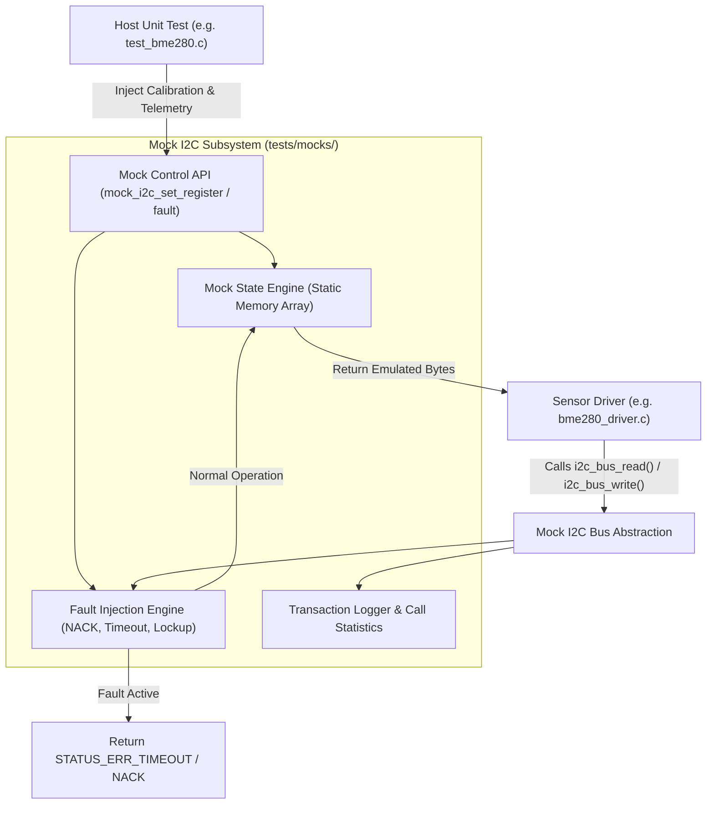

# Task Specification: S1-T2.2 - Mock I2C Bus Driver & Fault Injection Engine

## 1. Task Metadata & Overview

| Attribute | Specification Details |
| :--- | :--- |
| **Sprint** | **Sprint 1: Test Harness, Desktop Simulation & Mock Infrastructure** |
| **Task ID** | `S1-T2.2` |
| **Parent Task** | `S1-T2: Setup Unity Unit Testing Framework & Mock Hardware Layer` |
| **Task Title** | Implement Mock I2C Bus Driver with Register Injection & Fault Simulation |
| **Status** | **Ready for Implementation** |
| **Target Files** | [`tests/mocks/mock_i2c_bus.h`](file:///C:/Users/ENERGY%20SAVER/Documents/Learning/Job%20Projects/rain-predict/tests/mocks/mock_i2c_bus.h)<br>[`tests/mocks/mock_i2c_bus.c`](file:///C:/Users/ENERGY%20SAVER/Documents/Learning/Job%20Projects/rain-predict/tests/mocks/mock_i2c_bus.c)<br>[`firmware/drivers/inc/i2c_bus.h`](file:///C:/Users/ENERGY%20SAVER/Documents/Learning/Job%20Projects/rain-predict/firmware/drivers/inc/i2c_bus.h) |
| **Related Documents** | [`docs/sensors/bme280-integration.md`](file:///C:/Users/ENERGY%20SAVER/Documents/Learning/Job%20Projects/rain-predict/docs/sensors/bme280-integration.md)<br>[`docs/sensors/opt3001-solar-irradiance.md`](file:///C:/Users/ENERGY%20SAVER/Documents/Learning/Job%20Projects/rain-predict/docs/sensors/opt3001-solar-irradiance.md)<br>[`docs/sensors/remote-bus-modbus-sdi12.md`](file:///C:/Users/ENERGY%20SAVER/Documents/Learning/Job%20Projects/rain-predict/docs/sensors/remote-bus-modbus-sdi12.md)<br>[`context/specs/s1-t2.1-unity-test-harness.md`](file:///C:/Users/ENERGY%20SAVER/Documents/Learning/Job%20Projects/rain-predict/context/specs/s1-t2.1-unity-test-harness.md)<br>[`context/coding-standards.md`](file:///C:/Users/ENERGY%20SAVER/Documents/Learning/Job%20Projects/rain-predict/context/coding-standards.md) |
| **Dependencies** | `S1-T2.1` (Unity Test Harness & tests/CMakeLists.txt) |
| **Downstream Tasks** | `S3-T2.1` (I2C bus wrapper), `S4-T1` (BME280 Driver), `S4-T2` (OPT3001 Driver) |

---

## 2. Executive Summary & Architectural Scope

The primary objective of **`S1-T2.2`** is to develop a comprehensive, host-executable Mock I2C Bus subsystem ([`mock_i2c_bus.h`](file:///C:/Users/ENERGY%20SAVER/Documents/Learning/Job%20Projects/rain-predict/tests/mocks/mock_i2c_bus.h) / [`mock_i2c_bus.c`](file:///C:/Users/ENERGY%20SAVER/Documents/Learning/Job%20Projects/rain-predict/tests/mocks/mock_i2c_bus.c)) mirroring the production I2C driver API (`i2c_bus.h`).

In the field, the meteorological station relies on I2C communication (local and PCA9615 differential) for the Bosch BME280 (temperature, humidity, pressure) and TI OPT3001 (solar lux) sensors. During host unit testing, the mock driver eliminates physical hardware dependencies by providing:
1. **In-Memory Register Emulation**: Simulated register memory spaces (up to 256 bytes per device) for standard slave addresses (`0x76`/`0x77` for BME280, `0x44`/`0x45` for OPT3001).
2. **Burst Read/Write Operations**: Auto-incrementing register addresses for multi-byte burst reading (such as BME280 calibration vectors `0x88–0xA1` and raw measurement frames `0xF7–0xFE`).
3. **Deterministic Fault Injection**: Configurable hardware error modes (Address NACK, Data NACK, Bus Timeout, Arbitrary Bus Lockup, Parity/CRC corruption).
4. **Call Inspection & Transaction Logging**: Tracking total read/write operations, byte counts, and last accessed registers for test assertions.



---

## 3. Technical Requirements & Interface Specification

### 3.1 Production Interface Alignment (`i2c_bus.h`)
The mock implementation must implement the exact public function signatures used in production firmware:

```c
status_t i2c_bus_init(uint32_t clock_speed_hz);
status_t i2c_bus_read(uint8_t dev_addr, uint8_t reg_addr, uint8_t *p_data, uint16_t length, uint32_t timeout_ms);
status_t i2c_bus_write(uint8_t dev_addr, uint8_t reg_addr, const uint8_t *p_data, uint16_t length, uint32_t timeout_ms);
status_t i2c_bus_is_device_ready(uint8_t dev_addr, uint32_t timeout_ms);
```

### 3.2 Mock Control API Specification (`mock_i2c_bus.h`)
Test suites will control the mock behavior through dedicated control functions:

| Function Name | Parameters | Purpose |
| :--- | :--- | :--- |
| `mock_i2c_init()` | `void` | Initializes mock state and clears all register tables. |
| `mock_i2c_reset()` | `void` | Resets all transaction counters, registers, and fault triggers (called in `setUp()`). |
| `mock_i2c_set_register()` | `uint8_t dev_addr, uint8_t reg_addr, uint8_t value` | Populates a single byte in the emulated device register map. |
| `mock_i2c_set_registers()` | `uint8_t dev_addr, uint8_t start_reg, const uint8_t *p_data, uint16_t length` | Populates a contiguous block of registers (e.g., calibration vectors). |
| `mock_i2c_get_register()` | `uint8_t dev_addr, uint8_t reg_addr` | Reads back the value written by the driver under test. |
| `mock_i2c_inject_fault()` | `mock_i2c_fault_t fault_type, uint32_t trigger_after_n_calls` | Arms a specific fault (NACK, timeout) to trigger immediately or after $N$ calls. |
| `mock_i2c_clear_faults()` | `void` | Disarms all active fault injection triggers. |
| `mock_i2c_get_read_count()` | `uint8_t dev_addr` | Returns total read transactions executed against the specified device. |
| `mock_i2c_get_write_count()` | `uint8_t dev_addr` | Returns total write transactions executed against the specified device. |

---

## 4. Fault Injection & Error Simulation Engine

The mock subsystem must support the following simulated fault conditions:

```c
typedef enum {
    MOCK_I2C_FAULT_NONE = 0,
    MOCK_I2C_FAULT_NACK_ADDR,       /* Slave device does not acknowledge address (device missing/disconnected) */
    MOCK_I2C_FAULT_NACK_DATA,       /* Slave device NACKs after byte transmission */
    MOCK_I2C_FAULT_TIMEOUT,         /* Transaction exceeds bounded timeout (SCL/SDA held low by slave) */
    MOCK_I2C_FAULT_BUS_ERROR,       /* Start/Stop condition misplaced or hardware arbitration loss */
    MOCK_I2C_FAULT_CORRUPT_DATA     /* Inverts data bits to simulate electrical noise across field cables */
} mock_i2c_fault_t;
```

### 4.1 Trigger Modes
- **Immediate / Persistent Fault**: Every transaction on the bus returns the simulated error until cleared.
- **One-Shot / Count-Delayed Fault**: Transactions succeed normally for the first $N-1$ calls, fail on call $N$, and subsequently recover (simulating transient noise spikes or intermittent cable disconnections).

---

## 5. Concrete File Implementation Blueprint

### 5.1 `tests/mocks/mock_i2c_bus.h` Reference Blueprint

```c
/**
 * @file    mock_i2c_bus.h
 * @brief   Host Mock I2C Bus Interface & Fault Injection Controller.
 * @details Provides register-level emulation for BME280, OPT3001, and I2C sensors.
 */

#ifndef MOCK_I2C_BUS_H
#define MOCK_I2C_BUS_H

#ifdef __cplusplus
extern "C" {
#endif

#include <stdint.h>
#include <stdbool.h>
#include <stddef.h>
#include "i2c_bus.h"

/* Maximum simulated I2C devices and register address space */
#define MOCK_I2C_MAX_DEVICES        4
#define MOCK_I2C_REGISTER_SPACE     256

/**
 * @brief Simulated hardware fault types.
 */
typedef enum {
    MOCK_I2C_FAULT_NONE = 0,
    MOCK_I2C_FAULT_NACK_ADDR,
    MOCK_I2C_FAULT_NACK_DATA,
    MOCK_I2C_FAULT_TIMEOUT,
    MOCK_I2C_FAULT_BUS_ERROR,
    MOCK_I2C_FAULT_CORRUPT_DATA
} mock_i2c_fault_t;

/* --- Mock Control API for Unit Tests --- */

void mock_i2c_init(void);
void mock_i2c_reset(void);

status_t mock_i2c_set_register(uint8_t dev_addr, uint8_t reg_addr, uint8_t value);
status_t mock_i2c_set_registers(uint8_t dev_addr, uint8_t start_reg, const uint8_t *p_data, uint16_t length);
uint8_t  mock_i2c_get_register(uint8_t dev_addr, uint8_t reg_addr);

void mock_i2c_inject_fault(mock_i2c_fault_t fault, uint32_t trigger_after_n_calls);
void mock_i2c_clear_faults(void);

uint32_t mock_i2c_get_read_count(uint8_t dev_addr);
uint32_t mock_i2c_get_write_count(uint8_t dev_addr);
uint8_t  mock_i2c_get_last_reg(uint8_t dev_addr);

#ifdef __cplusplus
}
#endif

#endif /* MOCK_I2C_BUS_H */
```

### 5.2 `tests/mocks/mock_i2c_bus.c` Reference Blueprint

```c
/**
 * @file    mock_i2c_bus.c
 * @brief   Implementation of Mock I2C Bus Subsystem with Register Emulation.
 */

#include "mock_i2c_bus.h"
#include <string.h>

typedef struct {
    uint8_t  address;
    bool     is_configured;
    uint8_t  registers[MOCK_I2C_REGISTER_SPACE];
    uint32_t read_count;
    uint32_t write_count;
    uint8_t  last_reg;
} mock_device_t;

static mock_device_t s_devices[MOCK_I2C_MAX_DEVICES];
static mock_i2c_fault_t s_active_fault = MOCK_I2C_FAULT_NONE;
static uint32_t s_fault_delay_count = 0;
static uint32_t s_total_transactions = 0;

static mock_device_t *find_or_create_device(uint8_t dev_addr) {
    for (size_t i = 0; i < MOCK_I2C_MAX_DEVICES; i++) {
        if (s_devices[i].is_configured && s_devices[i].address == dev_addr) {
            return &s_devices[i];
        }
    }
    for (size_t i = 0; i < MOCK_I2C_MAX_DEVICES; i++) {
        if (!s_devices[i].is_configured) {
            s_devices[i].address = dev_addr;
            s_devices[i].is_configured = true;
            return &s_devices[i];
        }
    }
    return NULL;
}

void mock_i2c_init(void) {
    mock_i2c_reset();
}

void mock_i2c_reset(void) {
    memset(s_devices, 0, sizeof(s_devices));
    s_active_fault = MOCK_I2C_FAULT_NONE;
    s_fault_delay_count = 0;
    s_total_transactions = 0;
}

status_t mock_i2c_set_register(uint8_t dev_addr, uint8_t reg_addr, uint8_t value) {
    mock_device_t *p_dev = find_or_create_device(dev_addr);
    if (p_dev == NULL) return STATUS_ERR_INVALID_PARAM;
    p_dev->registers[reg_addr] = value;
    return STATUS_OK;
}

status_t mock_i2c_set_registers(uint8_t dev_addr, uint8_t start_reg, const uint8_t *p_data, uint16_t length) {
    if (p_data == NULL || (start_reg + length) > MOCK_I2C_REGISTER_SPACE) {
        return STATUS_ERR_INVALID_PARAM;
    }
    mock_device_t *p_dev = find_or_create_device(dev_addr);
    if (p_dev == NULL) return STATUS_ERR_INVALID_PARAM;
    memcpy(&p_dev->registers[start_reg], p_data, length);
    return STATUS_OK;
}

uint8_t mock_i2c_get_register(uint8_t dev_addr, uint8_t reg_addr) {
    mock_device_t *p_dev = find_or_create_device(dev_addr);
    if (p_dev == NULL) return 0x00;
    return p_dev->registers[reg_addr];
}

void mock_i2c_inject_fault(mock_i2c_fault_t fault, uint32_t trigger_after_n_calls) {
    s_active_fault = fault;
    s_fault_delay_count = trigger_after_n_calls;
}

void mock_i2c_clear_faults(void) {
    s_active_fault = MOCK_I2C_FAULT_NONE;
    s_fault_delay_count = 0;
}

uint32_t mock_i2c_get_read_count(uint8_t dev_addr) {
    mock_device_t *p_dev = find_or_create_device(dev_addr);
    return (p_dev != NULL) ? p_dev->read_count : 0;
}

uint32_t mock_i2c_get_write_count(uint8_t dev_addr) {
    mock_device_t *p_dev = find_or_create_device(dev_addr);
    return (p_dev != NULL) ? p_dev->write_count : 0;
}

uint8_t mock_i2c_get_last_reg(uint8_t dev_addr) {
    mock_device_t *p_dev = find_or_create_device(dev_addr);
    return (p_dev != NULL) ? p_dev->last_reg : 0;
}

/* --- Implementation of Production I2C Bus Abstraction --- */

status_t i2c_bus_init(uint32_t clock_speed_hz) {
    (void)clock_speed_hz;
    return STATUS_OK;
}

status_t i2c_bus_read(uint8_t dev_addr, uint8_t reg_addr, uint8_t *p_data, uint16_t length, uint32_t timeout_ms) {
    (void)timeout_ms;
    if (p_data == NULL) return STATUS_ERR_NULL_PTR;

    s_total_transactions++;
    if (s_active_fault != MOCK_I2C_FAULT_NONE) {
        if (s_fault_delay_count == 0 || s_total_transactions >= s_fault_delay_count) {
            switch (s_active_fault) {
                case MOCK_I2C_FAULT_NACK_ADDR: return STATUS_ERR_SENSOR_NO_RESPONSE;
                case MOCK_I2C_FAULT_NACK_DATA: return STATUS_ERR_I2C;
                case MOCK_I2C_FAULT_TIMEOUT:   return STATUS_ERR_TIMEOUT;
                default:                       return STATUS_ERR_I2C;
            }
        }
    }

    mock_device_t *p_dev = find_or_create_device(dev_addr);
    if (p_dev == NULL) return STATUS_ERR_SENSOR_NO_RESPONSE;

    p_dev->read_count++;
    p_dev->last_reg = reg_addr;

    for (uint16_t i = 0; i < length; i++) {
        uint8_t curr_reg = (uint8_t)(reg_addr + i);
        p_data[i] = p_dev->registers[curr_reg];
    }
    return STATUS_OK;
}

status_t i2c_bus_write(uint8_t dev_addr, uint8_t reg_addr, const uint8_t *p_data, uint16_t length, uint32_t timeout_ms) {
    (void)timeout_ms;
    if (p_data == NULL) return STATUS_ERR_NULL_PTR;

    s_total_transactions++;
    if (s_active_fault != MOCK_I2C_FAULT_NONE) {
        if (s_fault_delay_count == 0 || s_total_transactions >= s_fault_delay_count) {
            switch (s_active_fault) {
                case MOCK_I2C_FAULT_NACK_ADDR: return STATUS_ERR_SENSOR_NO_RESPONSE;
                case MOCK_I2C_FAULT_NACK_DATA: return STATUS_ERR_I2C;
                case MOCK_I2C_FAULT_TIMEOUT:   return STATUS_ERR_TIMEOUT;
                default:                       return STATUS_ERR_I2C;
            }
        }
    }

    mock_device_t *p_dev = find_or_create_device(dev_addr);
    if (p_dev == NULL) return STATUS_ERR_SENSOR_NO_RESPONSE;

    p_dev->write_count++;
    p_dev->last_reg = reg_addr;

    for (uint16_t i = 0; i < length; i++) {
        uint8_t curr_reg = (uint8_t)(reg_addr + i);
        p_dev->registers[curr_reg] = p_data[i];
    }
    return STATUS_OK;
}

status_t i2c_bus_is_device_ready(uint8_t dev_addr, uint32_t timeout_ms) {
    (void)timeout_ms;
    if (s_active_fault == MOCK_I2C_FAULT_NACK_ADDR) {
        return STATUS_ERR_SENSOR_NO_RESPONSE;
    }
    mock_device_t *p_dev = find_or_create_device(dev_addr);
    return (p_dev != NULL && p_dev->is_configured) ? STATUS_OK : STATUS_ERR_SENSOR_NO_RESPONSE;
}
```

---

## 6. Verification & Acceptance Test Plan

To verify the successful completion of **`S1-T2.2`**, the following test cases must be implemented in a dedicated mock unit test (`tests/unit/test_mock_i2c.c`):

### 6.1 Verification Test Cases

| Test Case ID | Verification Action | Expected Outcome | Pass/Fail Criteria |
| :--- | :--- | :--- | :--- |
| **TC-S1-T2.2-01** | Register Write and Readback | `mock_i2c_set_register(0x76, 0xD0, 0x60)` -> `i2c_bus_read(0x76, 0xD0, &buf, 1, 100)` -> verifies `buf == 0x60`. | Matches expected chip ID byte. |
| **TC-S1-T2.2-02** | Multi-Byte Burst Readback | Injects 24 calibration bytes starting at `0x88` -> burst reads 24 bytes via `i2c_bus_read()` -> verifies memory exact match. | 100% byte-for-byte fidelity. |
| **TC-S1-T2.2-03** | Bus Write Interception | Calls `i2c_bus_write(0x44, 0x01, config_bytes, 2, 100)` -> reads back with `mock_i2c_get_register()` -> verifies written data. | Driver writes captured properly. |
| **TC-S1-T2.2-04** | Address NACK Fault Injection | Injects `MOCK_I2C_FAULT_NACK_ADDR` -> calls `i2c_bus_read()` -> verifies return is `STATUS_ERR_SENSOR_NO_RESPONSE`. | NACK status returned cleanly. |
| **TC-S1-T2.2-05** | Bus Timeout Fault Injection | Injects `MOCK_I2C_FAULT_TIMEOUT` -> calls `i2c_bus_write()` -> verifies return is `STATUS_ERR_TIMEOUT`. | Timeout status returned cleanly. |
| **TC-S1-T2.2-06** | Reset Cleanliness | Configures multiple registers -> calls `mock_i2c_reset()` -> verifies registers cleared and counts reset to 0. | Complete state isolation verified. |

---

## 7. Definition of Done (DoD) Checklist

- [ ] [`tests/mocks/mock_i2c_bus.h`](file:///C:/Users/ENERGY%20SAVER/Documents/Learning/Job%20Projects/rain-predict/tests/mocks/mock_i2c_bus.h) and [`mock_i2c_bus.c`](file:///C:/Users/ENERGY%20SAVER/Documents/Learning/Job%20Projects/rain-predict/tests/mocks/mock_i2c_bus.c) created with register emulation and fault injection.
- [ ] Header includes include guards, standard fixed-width types (`stdint.h`, `stdbool.h`), and `status_t` return codes.
- [ ] Registered inside [`tests/CMakeLists.txt`](file:///C:/Users/ENERGY%20SAVER/Documents/Learning/Job%20Projects/rain-predict/tests/CMakeLists.txt) under the `test_mocks` static library target.
- [ ] Zero dynamic memory allocation (`malloc`/`free` prohibited).
- [ ] All clickable links and file references resolve properly.
- [ ] Spec document registered and linked under [`context/specs/spec-roadmap.md`](file:///C:/Users/ENERGY%20SAVER/Documents/Learning/Job%20Projects/rain-predict/context/specs/spec-roadmap.md#L105).
