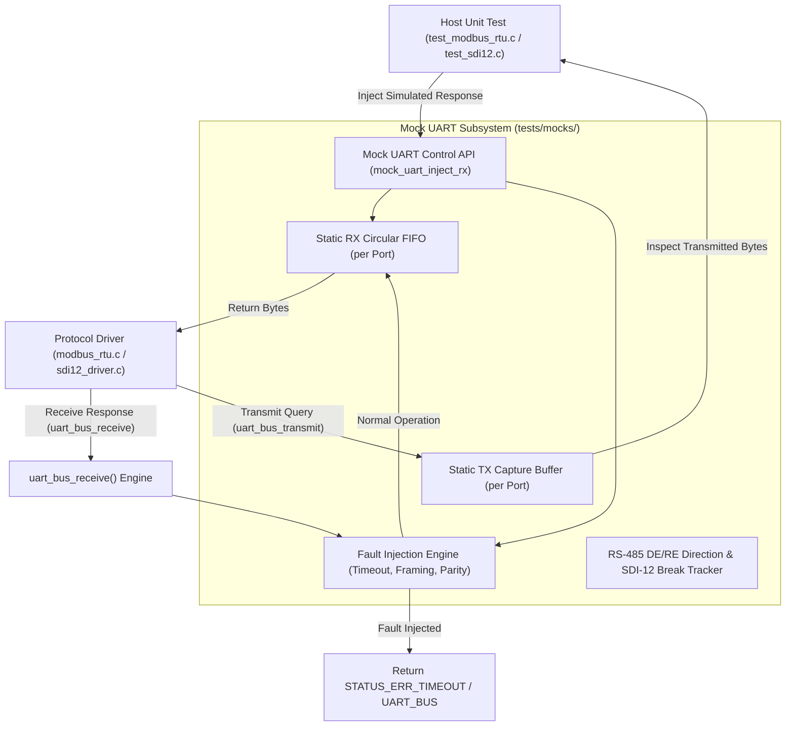

# Task Specification: S1-T2.3 - Mock UART Bus Driver & Serial Protocol Injection Engine

## 1. Task Metadata & Overview

| Attribute | Specification Details |
| :--- | :--- |
| **Sprint** | **Sprint 1: Test Harness, Desktop Simulation & Mock Infrastructure** |
| **Task ID** | `S1-T2.3` |
| **Parent Task** | `S1-T2: Setup Unity Unit Testing Framework & Mock Hardware Layer` |
| **Task Title** | Implement Mock UART Bus Driver with Modbus RTU & SDI-12 Frame Injection |
| **Status** | **Ready for Implementation** |
| **Target Files** | [`tests/mocks/mock_uart_bus.h`](file:///C:/Users/ENERGY%20SAVER/Documents/Learning/Job%20Projects/rain-predict/tests/mocks/mock_uart_bus.h)<br>[`tests/mocks/mock_uart_bus.c`](file:///C:/Users/ENERGY%20SAVER/Documents/Learning/Job%20Projects/rain-predict/tests/mocks/mock_uart_bus.c)<br>[`firmware/drivers/inc/uart_bus.h`](file:///C:/Users/ENERGY%20SAVER/Documents/Learning/Job%20Projects/rain-predict/firmware/drivers/inc/uart_bus.h) |
| **Related Documents** | [`docs/sensors/remote-bus-modbus-sdi12.md`](file:///C:/Users/ENERGY%20SAVER/Documents/Learning/Job%20Projects/rain-predict/docs/sensors/remote-bus-modbus-sdi12.md)<br>[`docs/hardware/schematics-and-pinout.md`](file:///C:/Users/ENERGY%20SAVER/Documents/Learning/Job%20Projects/rain-predict/docs/hardware/schematics-and-pinout.md)<br>[`context/specs/s1-t2.1-unity-test-harness.md`](file:///C:/Users/ENERGY%20SAVER/Documents/Learning/Job%20Projects/rain-predict/context/specs/s1-t2.1-unity-test-harness.md)<br>[`context/coding-standards.md`](file:///C:/Users/ENERGY%20SAVER/Documents/Learning/Job%20Projects/rain-predict/context/coding-standards.md) |
| **Dependencies** | `S1-T2.1` (Unity Test Harness & tests/CMakeLists.txt) |
| **Downstream Tasks** | `S3-T2.2` (UART bus wrapper), `S4-T4` (Modbus RTU Driver), `S4-T5` (SDI-12 Driver) |

---

## 2. Executive Summary & Architectural Scope

The primary objective of **`S1-T2.3`** is to develop a host-executable Mock UART Bus subsystem ([`mock_uart_bus.h`](file:///C:/Users/ENERGY%20SAVER/Documents/Learning/Job%20Projects/rain-predict/tests/mocks/mock_uart_bus.h) / [`mock_uart_bus.c`](file:///C:/Users/ENERGY%20SAVER/Documents/Learning/Job%20Projects/rain-predict/tests/mocks/mock_uart_bus.c)) implementing the production serial bus abstraction (`uart_bus.h`).

The system uses two dedicated serial channels:
1. **USART1 (RS-485 Modbus RTU)**: High-speed differential bus (9600–115200 baud, 8N1) for remote mast sensor probes up to 100 meters, requiring Driver Enable / Receiver Enable (`DE/RE`) transceiver direction switching.
2. **LPUART1 (SDI-12 Bus)**: Low-power agricultural bus (1200 baud, 7E1, half-duplex single-wire) with break/mark sequence signaling for SDI-12 soil and canopy probes.

During host testing, the mock driver eliminates the need for physical transceivers or serial loopback adapters by providing:
- **Bi-Directional FIFO Buffering**: Injects simulated sensor response frames into RX queues and captures outgoing query frames from TX buffers.
- **Protocol Frame Injection**: Injects Modbus RTU binary frames (holding registers with CRC-16) and SDI-12 ASCII responses (`0001\r\n`, `0+24.5+88.2\r\n`).
- **Transceiver Direction Tracking**: Monitors RS-485 `DE/RE` GPIO pin assertions to verify the firmware never attempts reception while still asserting drive mode.
- **Fault Simulation**: Simulates cable disconnects (timeouts), CRC/parity bit errors, framing errors, buffer overruns, and garbled noise.



---

## 3. Technical Requirements & Interface Specification

### 3.1 Production Interface Alignment (`uart_bus.h`)
The mock must implement the production UART driver interface:

```c
typedef enum {
    UART_PORT_RS485 = 0,   /* USART1: RS-485 Modbus RTU Master */
    UART_PORT_SDI12 = 1,   /* LPUART1: SDI-12 1200-baud Single-Wire Bus */
    UART_PORT_MAX
} uart_port_t;

typedef enum {
    UART_DIR_RX = 0,       /* RS-485 Receiver Enabled (DE low, /RE low) */
    UART_DIR_TX = 1        /* RS-485 Transmitter Enabled (DE high, /RE high) */
} uart_dir_t;

status_t uart_bus_init(uart_port_t port, uint32_t baud_rate, uint8_t data_bits, uint8_t parity, uint8_t stop_bits);
status_t uart_bus_set_direction(uart_port_t port, uart_dir_t dir);
status_t uart_bus_transmit(uart_port_t port, const uint8_t *p_data, uint16_t length, uint32_t timeout_ms);
status_t uart_bus_receive(uart_port_t port, uint8_t *p_data, uint16_t length, uint16_t *p_bytes_received, uint32_t timeout_ms);
status_t uart_bus_flush(uart_port_t port);
```

### 3.2 Mock Control API Specification (`mock_uart_bus.h`)
Test suites will control the mock behavior through dedicated control functions:

| Function Name | Parameters | Purpose |
| :--- | :--- | :--- |
| `mock_uart_init()` | `void` | Initializes all port FIFOs and resets fault injection state. |
| `mock_uart_reset()` | `void` | Clears RX/TX buffers, counters, and active faults (called in `setUp()`). |
| `mock_uart_inject_rx()` | `uart_port_t port, const uint8_t *p_data, uint16_t length` | Pushes simulated sensor response frame into the port's RX FIFO. |
| `mock_uart_inject_rx_byte()` | `uart_port_t port, uint8_t byte` | Pushes a single byte into the RX FIFO. |
| `mock_uart_get_tx_bytes()` | `uart_port_t port, uint8_t *p_out, uint16_t max_len` | Copies bytes transmitted by the driver into a test assertion buffer. |
| `mock_uart_get_tx_count()` | `uart_port_t port` | Returns total bytes transmitted on the port. |
| `mock_uart_get_direction()` | `uart_port_t port` | Returns current RS-485 DE/RE direction (`UART_DIR_RX` or `UART_DIR_TX`). |
| `mock_uart_inject_fault()` | `uart_port_t port, mock_uart_fault_t fault` | Arms a specific serial fault (timeout, framing error, parity error). |
| `mock_uart_clear_faults()` | `uart_port_t port` | Disarms all active faults on the port. |

---

## 4. Modbus RTU & SDI-12 Emulation Architecture

### 4.1 Modbus RTU Framing Support
- Modbus RTU packets are binary frames ending in a 16-bit CRC (CRC-16 Modbus polynomial `0xA001`, initial value `0xFFFF`).
- The mock allows injecting standard Function Code `0x03` (Read Holding Registers) responses:
  - Byte 0: Slave Address (`0x01`–`0xF7`)
  - Byte 1: Function Code (`0x03`)
  - Byte 2: Byte Count ($2 \times N$)
  - Bytes $3 \dots (2+2N)$: Register values (Big-Endian)
  - Last 2 Bytes: CRC-16 (Little-Endian: LSB first, MSB second)

### 4.2 SDI-12 1200-Baud Half-Duplex Support
- The mock supports ASCII string response injection:
  - Address queries (`?!` -> `0\r\n`)
  - Measurement triggers (`0M!` -> `00013\r\n` meaning address 0, ready in 1s, 3 values)
  - Data retrieval (`0D0!` -> `0+24.50+88.20+1013.25\r\n`)

---

## 5. Fault Simulation Engine

The mock subsystem supports the following serial bus fault conditions:

```c
typedef enum {
    MOCK_UART_FAULT_NONE = 0,
    MOCK_UART_FAULT_TIMEOUT,         /* RX exceeds bounded timeout (detached sensor cable) */
    MOCK_UART_FAULT_FRAMING_ERROR,   /* Stop bit invalid or baud rate mismatch */
    MOCK_UART_FAULT_PARITY_ERROR,    /* Parity bit mismatch (SDI-12 7E1) */
    MOCK_UART_FAULT_BUFFER_OVERFLOW, /* RX FIFO capacity exceeded */
    MOCK_UART_FAULT_TX_COLLISION     /* RS-485 collision or transmission while in RX mode */
} mock_uart_fault_t;
```

---

## 6. Concrete File Implementation Blueprint

### 6.1 `tests/mocks/mock_uart_bus.h` Reference Blueprint

```c
/**
 * @file    mock_uart_bus.h
 * @brief   Host Mock UART Bus & Serial Protocol Injection Controller.
 * @details Simulates RS-485 Modbus RTU and SDI-12 serial buses with fault injection.
 */

#ifndef MOCK_UART_BUS_H
#define MOCK_UART_BUS_H

#ifdef __cplusplus
extern "C" {
#endif

#include <stdint.h>
#include <stdbool.h>
#include <stddef.h>
#include "uart_bus.h"

#define MOCK_UART_BUFFER_SIZE   512

typedef enum {
    MOCK_UART_FAULT_NONE = 0,
    MOCK_UART_FAULT_TIMEOUT,
    MOCK_UART_FAULT_FRAMING_ERROR,
    MOCK_UART_FAULT_PARITY_ERROR,
    MOCK_UART_FAULT_BUFFER_OVERFLOW,
    MOCK_UART_FAULT_TX_COLLISION
} mock_uart_fault_t;

/* --- Mock Control API for Unit Tests --- */

void mock_uart_init(void);
void mock_uart_reset(void);

status_t mock_uart_inject_rx(uart_port_t port, const uint8_t *p_data, uint16_t length);
status_t mock_uart_inject_rx_byte(uart_port_t port, uint8_t byte);

uint16_t mock_uart_get_tx_bytes(uart_port_t port, uint8_t *p_out, uint16_t max_len);
uint16_t mock_uart_get_tx_count(uart_port_t port);
uart_dir_t mock_uart_get_direction(uart_port_t port);

void mock_uart_inject_fault(uart_port_t port, mock_uart_fault_t fault);
void mock_uart_clear_faults(uart_port_t port);

#ifdef __cplusplus
}
#endif

#endif /* MOCK_UART_BUS_H */
```

### 6.2 `tests/mocks/mock_uart_bus.c` Reference Blueprint

```c
/**
 * @file    mock_uart_bus.c
 * @brief   Implementation of Mock UART Bus Subsystem with FIFO Buffering.
 */

#include "mock_uart_bus.h"
#include <string.h>

typedef struct {
    uint8_t rx_fifo[MOCK_UART_BUFFER_SIZE];
    uint16_t rx_head;
    uint16_t rx_tail;
    uint16_t rx_count;

    uint8_t tx_buffer[MOCK_UART_BUFFER_SIZE];
    uint16_t tx_count;

    uart_dir_t direction;
    mock_uart_fault_t active_fault;
    bool is_initialized;
} mock_uart_port_t;

static mock_uart_port_t s_ports[UART_PORT_MAX];

void mock_uart_init(void) {
    mock_uart_reset();
}

void mock_uart_reset(void) {
    memset(s_ports, 0, sizeof(s_ports));
    for (size_t i = 0; i < UART_PORT_MAX; i++) {
        s_ports[i].direction = UART_DIR_RX;
        s_ports[i].active_fault = MOCK_UART_FAULT_NONE;
        s_ports[i].is_initialized = true;
    }
}

status_t mock_uart_inject_rx_byte(uart_port_t port, uint8_t byte) {
    if (port >= UART_PORT_MAX) return STATUS_ERR_INVALID_PARAM;
    mock_uart_port_t *p_port = &s_ports[port];

    if (p_port->rx_count >= MOCK_UART_BUFFER_SIZE) {
        return STATUS_ERR_BUSY;
    }

    p_port->rx_fifo[p_port->rx_head] = byte;
    p_port->rx_head = (p_port->rx_head + 1) % MOCK_UART_BUFFER_SIZE;
    p_port->rx_count++;
    return STATUS_OK;
}

status_t mock_uart_inject_rx(uart_port_t port, const uint8_t *p_data, uint16_t length) {
    if (port >= UART_PORT_MAX || p_data == NULL) return STATUS_ERR_INVALID_PARAM;
    for (uint16_t i = 0; i < length; i++) {
        status_t status = mock_uart_inject_rx_byte(port, p_data[i]);
        if (status != STATUS_OK) return status;
    }
    return STATUS_OK;
}

uint16_t mock_uart_get_tx_bytes(uart_port_t port, uint8_t *p_out, uint16_t max_len) {
    if (port >= UART_PORT_MAX || p_out == NULL) return 0;
    mock_uart_port_t *p_port = &s_ports[port];
    uint16_t copy_len = (p_port->tx_count < max_len) ? p_port->tx_count : max_len;
    memcpy(p_out, p_port->tx_buffer, copy_len);
    return copy_len;
}

uint16_t mock_uart_get_tx_count(uart_port_t port) {
    if (port >= UART_PORT_MAX) return 0;
    return s_ports[port].tx_count;
}

uart_dir_t mock_uart_get_direction(uart_port_t port) {
    if (port >= UART_PORT_MAX) return UART_DIR_RX;
    return s_ports[port].direction;
}

void mock_uart_inject_fault(uart_port_t port, mock_uart_fault_t fault) {
    if (port < UART_PORT_MAX) {
        s_ports[port].active_fault = fault;
    }
}

void mock_uart_clear_faults(uart_port_t port) {
    if (port < UART_PORT_MAX) {
        s_ports[port].active_fault = MOCK_UART_FAULT_NONE;
    }
}

/* --- Implementation of Production UART Bus Abstraction --- */

status_t uart_bus_init(uart_port_t port, uint32_t baud_rate, uint8_t data_bits, uint8_t parity, uint8_t stop_bits) {
    (void)baud_rate;
    (void)data_bits;
    (void)parity;
    (void)stop_bits;
    if (port >= UART_PORT_MAX) return STATUS_ERR_INVALID_PARAM;
    s_ports[port].is_initialized = true;
    return STATUS_OK;
}

status_t uart_bus_set_direction(uart_port_t port, uart_dir_t dir) {
    if (port >= UART_PORT_MAX) return STATUS_ERR_INVALID_PARAM;
    s_ports[port].direction = dir;
    return STATUS_OK;
}

status_t uart_bus_transmit(uart_port_t port, const uint8_t *p_data, uint16_t length, uint32_t timeout_ms) {
    (void)timeout_ms;
    if (port >= UART_PORT_MAX || p_data == NULL) return STATUS_ERR_NULL_PTR;
    mock_uart_port_t *p_port = &s_ports[port];

    if (p_port->active_fault == MOCK_UART_FAULT_TIMEOUT) {
        return STATUS_ERR_TIMEOUT;
    }

    /* Verify RS-485 transceiver direction */
    if (port == UART_PORT_RS485 && p_port->direction != UART_DIR_TX) {
        return STATUS_ERR_UART_BUS; /* Attempted transmit while DE pin was low */
    }

    uint16_t available_space = MOCK_UART_BUFFER_SIZE - p_port->tx_count;
    uint16_t write_len = (length < available_space) ? length : available_space;

    memcpy(&p_port->tx_buffer[p_port->tx_count], p_data, write_len);
    p_port->tx_count += write_len;

    return (write_len == length) ? STATUS_OK : STATUS_ERR_BUSY;
}

status_t uart_bus_receive(uart_port_t port, uint8_t *p_data, uint16_t length, uint16_t *p_bytes_received, uint32_t timeout_ms) {
    (void)timeout_ms;
    if (port >= UART_PORT_MAX || p_data == NULL || p_bytes_received == NULL) {
        return STATUS_ERR_NULL_PTR;
    }
    mock_uart_port_t *p_port = &s_ports[port];

    *p_bytes_received = 0;

    if (p_port->active_fault == MOCK_UART_FAULT_TIMEOUT || p_port->rx_count == 0) {
        return STATUS_ERR_TIMEOUT;
    }
    if (p_port->active_fault == MOCK_UART_FAULT_FRAMING_ERROR || p_port->active_fault == MOCK_UART_FAULT_PARITY_ERROR) {
        return STATUS_ERR_UART_BUS;
    }

    uint16_t bytes_to_read = (length < p_port->rx_count) ? length : p_port->rx_count;
    for (uint16_t i = 0; i < bytes_to_read; i++) {
        p_data[i] = p_port->rx_fifo[p_port->rx_tail];
        p_port->rx_tail = (p_port->rx_tail + 1) % MOCK_UART_BUFFER_SIZE;
        p_port->rx_count--;
    }

    *p_bytes_received = bytes_to_read;
    return STATUS_OK;
}

status_t uart_bus_flush(uart_port_t port) {
    if (port >= UART_PORT_MAX) return STATUS_ERR_INVALID_PARAM;
    mock_uart_port_t *p_port = &s_ports[port];
    p_port->rx_head = 0;
    p_port->rx_tail = 0;
    p_port->rx_count = 0;
    p_port->tx_count = 0;
    return STATUS_OK;
}
```

---

## 7. Verification & Acceptance Test Plan

To verify the successful completion of **`S1-T2.3`**, the following test cases must be validated in `tests/unit/test_mock_uart.c`:

### 7.1 Verification Test Cases

| Test Case ID | Verification Action | Expected Outcome | Pass/Fail Criteria |
| :--- | :--- | :--- | :--- |
| **TC-S1-T2.3-01** | RX Injection & Retrieval | Injects Modbus response vector into `UART_PORT_RS485` -> reads with `uart_bus_receive()` -> verifies exact bytes. | 100% byte fidelity. |
| **TC-S1-T2.3-02** | TX Capture Inspection | Calls `uart_bus_transmit(UART_PORT_RS485, query, 8)` with DE high -> retrieves with `mock_uart_get_tx_bytes()` -> verifies transmitted query frame. | Command captured accurately. |
| **TC-S1-T2.3-03** | RS-485 DE/RE Pin Guard | Calls `uart_bus_transmit(UART_PORT_RS485, ...)` while direction is `UART_DIR_RX` -> verifies function rejects transmission with `STATUS_ERR_UART_BUS`. | Direction guard enforced. |
| **TC-S1-T2.3-04** | SDI-12 ASCII Framing | Injects `0+25.0+90.0\r\n` into `UART_PORT_SDI12` -> receives string and verifies line termination `\r\n`. | SDI-12 ASCII parsing verified. |
| **TC-S1-T2.3-05** | Timeout Fault Simulation | Injects `MOCK_UART_FAULT_TIMEOUT` -> calls `uart_bus_receive()` -> verifies return is `STATUS_ERR_TIMEOUT`. | Non-blocking timeout returned. |
| **TC-S1-T2.3-06** | Reset Cleanliness | Populates FIFOs on all ports -> calls `mock_uart_reset()` -> verifies counts are 0 and direction defaults to RX. | Complete test isolation verified. |

---

## 8. Definition of Done (DoD) Checklist

- [ ] [`tests/mocks/mock_uart_bus.h`](file:///C:/Users/ENERGY%20SAVER/Documents/Learning/Job%20Projects/rain-predict/tests/mocks/mock_uart_bus.h) and [`mock_uart_bus.c`](file:///C:/Users/ENERGY%20SAVER/Documents/Learning/Job%20Projects/rain-predict/tests/mocks/mock_uart_bus.c) created with FIFO buffering and fault injection.
- [ ] Supports both `UART_PORT_RS485` (with DE/RE pin direction guards) and `UART_PORT_SDI12`.
- [ ] Registered under the `test_mocks` target in [`tests/CMakeLists.txt`](file:///C:/Users/ENERGY%20SAVER/Documents/Learning/Job%20Projects/rain-predict/tests/CMakeLists.txt).
- [ ] Zero dynamic memory allocation (`malloc`/`free` prohibited).
- [ ] All clickable links and file references resolve properly.
- [ ] Spec document registered and linked under [`context/specs/spec-roadmap.md`](file:///C:/Users/ENERGY%20SAVER/Documents/Learning/Job%20Projects/rain-predict/context/specs/spec-roadmap.md#L106).
