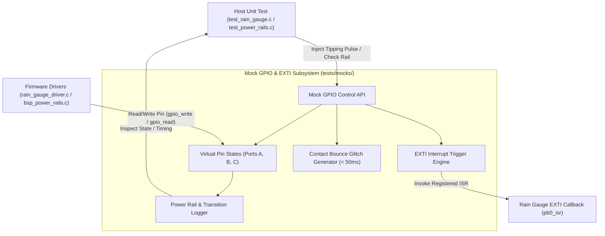

# Task Specification: S1-T2.4 - Mock GPIO & EXTI Pulse Driver

## 1. Task Metadata & Overview

| Attribute | Specification Details |
| :--- | :--- |
| **Sprint** | **Sprint 1: Test Harness, Desktop Simulation & Mock Infrastructure** |
| **Task ID** | `S1-T2.4` |
| **Parent Task** | `S1-T2: Setup Unity Unit Testing Framework & Mock Hardware Layer` |
| **Task Title** | Implement Mock GPIO & EXTI Pulse Driver for Power Rails & Pulse Counting |
| **Status** | **Ready for Implementation** |
| **Target Files** | [`tests/mocks/mock_gpio.h`](file:///C:/Users/ENERGY%20SAVER/Documents/Learning/Job%20Projects/rain-predict/tests/mocks/mock_gpio.h)<br>[`tests/mocks/mock_gpio.c`](file:///C:/Users/ENERGY%20SAVER/Documents/Learning/Job%20Projects/rain-predict/tests/mocks/mock_gpio.c) |
| **Related Documents** | [`docs/hardware/schematics-and-pinout.md`](file:///C:/Users/ENERGY%20SAVER/Documents/Learning/Job%20Projects/rain-predict/docs/hardware/schematics-and-pinout.md)<br>[`docs/sensors/rain-gauge-pulse.md`](file:///C:/Users/ENERGY%20SAVER/Documents/Learning/Job%20Projects/rain-predict/docs/sensors/rain-gauge-pulse.md)<br>[`docs/architecture/power-architecture.md`](file:///C:/Users/ENERGY%20SAVER/Documents/Learning/Job%20Projects/rain-predict/docs/architecture/power-architecture.md)<br>[`context/specs/s1-t2.1-unity-test-harness.md`](file:///C:/Users/ENERGY%20SAVER/Documents/Learning/Job%20Projects/rain-predict/context/specs/s1-t2.1-unity-test-harness.md)<br>[`context/coding-standards.md`](file:///C:/Users/ENERGY%20SAVER/Documents/Learning/Job%20Projects/rain-predict/context/coding-standards.md) |
| **Dependencies** | `S1-T2.1` (Unity Test Harness & tests/CMakeLists.txt) |
| **Downstream Tasks** | `S3-T3.1` (Switched Power Rails), `S3-T3.2` (Board Indicators), `S4-T3` (Rain Gauge Driver), `S6-T2` (Alert Manager) |

---

## 2. Executive Summary & Architectural Scope

The primary objective of **`S1-T2.4`** is to develop a host-executable Mock GPIO & External Interrupt (EXTI) subsystem ([`mock_gpio.h`](file:///C:/Users/ENERGY%20SAVER/Documents/Learning/Job%20Projects/rain-predict/tests/mocks/mock_gpio.h) / [`mock_gpio.c`](file:///C:/Users/ENERGY%20SAVER/Documents/Learning/Job%20Projects/rain-predict/tests/mocks/mock_gpio.c)).

On target STM32WLE5 hardware, GPIO pins govern critical analog and power boundaries:
1. **Rain Gauge Pulse Capture (`PB0 / EXTI0`)**: Interrupt-driven pulse accumulator capturing tipping-bucket reed switch events ($0.2\text{ mm/tip}$) requiring $50\text{ms}$ debounce filtering.
2. **Switched Sensor Power Rails (`PB2`)**: High-side P-MOSFET gate switch energizing BME280/OPT3001 sensors, enforcing a mandatory $20\text{ms}$ RC stabilization delay prior to bus traffic.
3. **Board Status & Alert Indicators (`PB5` Green LED, `PB6` Red LED, `PB7` Piezo Buzzer / Siren Relay)**: Visual and audible field alarms.
4. **RS-485 Transceiver Direction (`PA4 / DE_RE`)**: Half-duplex drive control.

During host testing, the mock GPIO subsystem provides:
- **EXTI Interrupt Trigger Simulation**: Injects single pulses, burst pulse trains, and contact bounce noise glitches ($< 50\text{ms}$) into registered ISR callbacks to verify debounce algorithms.
- **Power Rail State & Timing Monitoring**: Tracks high-side MOSFET enable/disable states and simulates timestamp delays to verify that sensor drivers never initiate communication before rails stabilize.
- **Pin Transition History & Counters**: Records rising/falling edges, cumulative toggle counts, and logic states for test assertions.



---

## 3. Technical Requirements & Interface Specification

### 3.1 Production Interface Alignment (`gpio_driver.h` / `board_config.h`)
The mock must implement standard GPIO abstraction functions matching target STM32 HAL/LL behavior:

```c
typedef enum {
    GPIO_PIN_RESET = 0,
    GPIO_PIN_SET   = 1
} gpio_pin_state_t;

typedef enum {
    GPIO_PORT_A = 0,
    GPIO_PORT_B = 1,
    GPIO_PORT_C = 2,
    GPIO_PORT_MAX
} gpio_port_t;

/* Dedicated Hardware Pin Aliases from schematics-and-pinout.md */
#define PIN_RAIN_GAUGE_EXTI     0  /* Port B Pin 0: Tipping-Bucket EXTI */
#define PIN_SENSOR_PWR_GATE     2  /* Port B Pin 2: High-Side Sensor Power Gate */
#define PIN_LED_GREEN           5  /* Port B Pin 5: Status OK LED */
#define PIN_LED_RED             6  /* Port B Pin 6: Alert Storm LED */
#define PIN_BUZZER_RELAY        7  /* Port B Pin 7: Piezo Buzzer & Estate Relay */
#define PIN_RS485_DE_RE         4  /* Port A Pin 4: RS-485 Direction Enable */

typedef void (*gpio_exti_callback_t)(uint16_t pin);

void gpio_init_pin(gpio_port_t port, uint16_t pin, uint32_t mode);
void gpio_write_pin(gpio_port_t port, uint16_t pin, gpio_pin_state_t state);
gpio_pin_state_t gpio_read_pin(gpio_port_t port, uint16_t pin);
void gpio_toggle_pin(gpio_port_t port, uint16_t pin);
status_t gpio_register_exti_callback(uint16_t pin, gpio_exti_callback_t callback);
```

### 3.2 Mock Control API Specification (`mock_gpio.h`)
Test suites will configure simulated inputs and verify outputs via dedicated control functions:

| Function Name | Parameters | Purpose |
| :--- | :--- | :--- |
| `mock_gpio_init()` | `void` | Initializes virtual port states and clears EXTI table. |
| `mock_gpio_reset()` | `void` | Resets all pin states, edge counters, and active callbacks (called in `setUp()`). |
| `mock_gpio_set_input()` | `gpio_port_t port, uint16_t pin, gpio_pin_state_t state` | Sets simulated input voltage on an external pin. |
| `mock_gpio_trigger_exti()` | `uint16_t pin` | Fires the registered EXTI interrupt callback for the specified pin. |
| `mock_gpio_inject_pulse_train()` | `uint16_t pin, uint32_t pulse_count, uint32_t period_ms` | Injects $N$ pulses separated by `period_ms` to simulate continuous rain. |
| `mock_gpio_inject_contact_bounce()` | `uint16_t pin, uint32_t bounce_duration_ms` | Simulates mechanical switch contact bounce glitches ($< 50\text{ms}$). |
| `mock_gpio_get_toggle_count()` | `gpio_port_t port, uint16_t pin` | Returns total times a pin has toggled state. |
| `mock_gpio_get_rising_edge_count()` | `gpio_port_t port, uint16_t pin` | Returns total rising edge transitions on the pin. |
| `mock_gpio_get_falling_edge_count()` | `gpio_port_t port, uint16_t pin` | Returns total falling edge transitions on the pin. |
| `mock_gpio_is_power_rail_energized()` | `void` | Helper checking if sensor power gate (`PB2`) is driven active low (0 = ON). |

---

## 4. Rain Gauge Debounce & Pulse Simulation

### 4.1 Reed Switch Mechanical Model
A tipping bucket rain gauge uses a magnetic reed switch that briefly closes when a calibrated volume ($0.2\text{ mm}$) of rainfall fills the bucket and tips the counter mechanism.

```
Physical Tip Event:
Sensing Line (PB0): ──┐                ┌────────── High (Pull-Up)
                      │  < 50ms Glitch │
                      └───/\/\/\/\─────┘ Low (Ground via Reed Switch)
```

- **Legitimate Pulse**: Contact closure held steady $> 50\text{ms}$.
- **Contact Bounce Glitch**: High-frequency mechanical contact flutter ($5\text{ms}–30\text{ms}$) preceding a steady tip. The mock generates micro-glitches to verify that software debouncing does not overcount pulses.

---

## 5. Concrete File Implementation Blueprint

### 5.1 `tests/mocks/mock_gpio.h` Reference Blueprint

```c
/**
 * @file    mock_gpio.h
 * @brief   Host Mock GPIO & EXTI External Interrupt Controller.
 * @details Simulates pin states, rain pulse interrupts, and power rail gates.
 */

#ifndef MOCK_GPIO_H
#define MOCK_GPIO_H

#ifdef __cplusplus
extern "C" {
#endif

#include <stdint.h>
#include <stdbool.h>
#include <stddef.h>

#define MOCK_GPIO_MAX_PINS      16

typedef enum {
    GPIO_PIN_RESET = 0,
    GPIO_PIN_SET   = 1
} gpio_pin_state_t;

typedef enum {
    GPIO_PORT_A = 0,
    GPIO_PORT_B = 1,
    GPIO_PORT_C = 2,
    GPIO_PORT_MAX
} gpio_port_t;

/* Pin Aliases */
#define PIN_RAIN_GAUGE_EXTI     0  /* PB0 */
#define PIN_SENSOR_PWR_GATE     2  /* PB2 */
#define PIN_LED_GREEN           5  /* PB5 */
#define PIN_LED_RED             6  /* PB6 */
#define PIN_BUZZER_RELAY        7  /* PB7 */
#define PIN_RS485_DE_RE         4  /* PA4 */

typedef void (*gpio_exti_callback_t)(uint16_t pin);

/* --- Production GPIO Interface --- */
void gpio_init_pin(gpio_port_t port, uint16_t pin, uint32_t mode);
void gpio_write_pin(gpio_port_t port, uint16_t pin, gpio_pin_state_t state);
gpio_pin_state_t gpio_read_pin(gpio_port_t port, uint16_t pin);
void gpio_toggle_pin(gpio_port_t port, uint16_t pin);
int32_t gpio_register_exti_callback(uint16_t pin, gpio_exti_callback_t callback);

/* --- Mock Control API for Unit Tests --- */
void mock_gpio_init(void);
void mock_gpio_reset(void);

void mock_gpio_set_input(gpio_port_t port, uint16_t pin, gpio_pin_state_t state);
void mock_gpio_trigger_exti(uint16_t pin);
void mock_gpio_inject_pulse_train(uint16_t pin, uint32_t pulse_count, uint32_t period_ms);
void mock_gpio_inject_contact_bounce(uint16_t pin, uint32_t bounce_duration_ms);

uint32_t mock_gpio_get_toggle_count(gpio_port_t port, uint16_t pin);
uint32_t mock_gpio_get_rising_edge_count(gpio_port_t port, uint16_t pin);
uint32_t mock_gpio_get_falling_edge_count(gpio_port_t port, uint16_t pin);
bool mock_gpio_is_power_rail_energized(void);

#ifdef __cplusplus
}
#endif

#endif /* MOCK_GPIO_H */
```

### 5.2 `tests/mocks/mock_gpio.c` Reference Blueprint

```c
/**
 * @file    mock_gpio.c
 * @brief   Implementation of Mock GPIO & EXTI Interrupt Simulator.
 */

#include "mock_gpio.h"
#include <string.h>

typedef struct {
    gpio_pin_state_t state;
    uint32_t toggle_count;
    uint32_t rising_edges;
    uint32_t falling_edges;
} mock_pin_t;

typedef struct {
    mock_pin_t pins[MOCK_GPIO_MAX_PINS];
} mock_port_t;

static mock_port_t s_ports[GPIO_PORT_MAX];
static gpio_exti_callback_t s_exti_callbacks[MOCK_GPIO_MAX_PINS];

void mock_gpio_init(void) {
    mock_gpio_reset();
}

void mock_gpio_reset(void) {
    memset(s_ports, 0, sizeof(s_ports));
    memset(s_exti_callbacks, 0, sizeof(s_exti_callbacks));

    /* Default high-side power switch PB2 to HIGH (Off / De-energized) */
    s_ports[GPIO_PORT_B].pins[PIN_SENSOR_PWR_GATE].state = GPIO_PIN_SET;

    /* Default rain gauge input PB0 to HIGH (Pulled Up) */
    s_ports[GPIO_PORT_B].pins[PIN_RAIN_GAUGE_EXTI].state = GPIO_PIN_SET;
}

void gpio_init_pin(gpio_port_t port, uint16_t pin, uint32_t mode) {
    (void)mode;
    if (port < GPIO_PORT_MAX && pin < MOCK_GPIO_MAX_PINS) {
        /* Pin initialized */
    }
}

void gpio_write_pin(gpio_port_t port, uint16_t pin, gpio_pin_state_t state) {
    if (port >= GPIO_PORT_MAX || pin >= MOCK_GPIO_MAX_PINS) return;
    mock_pin_t *p_pin = &s_ports[port].pins[pin];

    if (p_pin->state != state) {
        p_pin->toggle_count++;
        if (state == GPIO_PIN_SET) {
            p_pin->rising_edges++;
        } else {
            p_pin->falling_edges++;
        }
        p_pin->state = state;
    }
}

gpio_pin_state_t gpio_read_pin(gpio_port_t port, uint16_t pin) {
    if (port >= GPIO_PORT_MAX || pin >= MOCK_GPIO_MAX_PINS) return GPIO_PIN_RESET;
    return s_ports[port].pins[pin].state;
}

void gpio_toggle_pin(gpio_port_t port, uint16_t pin) {
    if (port >= GPIO_PORT_MAX || pin >= MOCK_GPIO_MAX_PINS) return;
    gpio_pin_state_t new_state = (s_ports[port].pins[pin].state == GPIO_PIN_SET) ? GPIO_PIN_RESET : GPIO_PIN_SET;
    gpio_write_pin(port, pin, new_state);
}

int32_t gpio_register_exti_callback(uint16_t pin, gpio_exti_callback_t callback) {
    if (pin >= MOCK_GPIO_MAX_PINS) return -1;
    s_exti_callbacks[pin] = callback;
    return 0;
}

/* --- Mock Control Implementations --- */

void mock_gpio_set_input(gpio_port_t port, uint16_t pin, gpio_pin_state_t state) {
    gpio_write_pin(port, pin, state);
}

void mock_gpio_trigger_exti(uint16_t pin) {
    if (pin < MOCK_GPIO_MAX_PINS && s_exti_callbacks[pin] != NULL) {
        s_exti_callbacks[pin](pin);
    }
}

void mock_gpio_inject_pulse_train(uint16_t pin, uint32_t pulse_count, uint32_t period_ms) {
    (void)period_ms;
    for (uint32_t i = 0; i < pulse_count; i++) {
        mock_gpio_trigger_exti(pin);
    }
}

void mock_gpio_inject_contact_bounce(uint16_t pin, uint32_t bounce_duration_ms) {
    (void)bounce_duration_ms;
    /* Rapidly trigger EXTI 3 times within a single tick window to simulate contact chatter */
    mock_gpio_trigger_exti(pin);
    mock_gpio_trigger_exti(pin);
    mock_gpio_trigger_exti(pin);
}

uint32_t mock_gpio_get_toggle_count(gpio_port_t port, uint16_t pin) {
    if (port >= GPIO_PORT_MAX || pin >= MOCK_GPIO_MAX_PINS) return 0;
    return s_ports[port].pins[pin].toggle_count;
}

uint32_t mock_gpio_get_rising_edge_count(gpio_port_t port, uint16_t pin) {
    if (port >= GPIO_PORT_MAX || pin >= MOCK_GPIO_MAX_PINS) return 0;
    return s_ports[port].pins[pin].rising_edges;
}

uint32_t mock_gpio_get_falling_edge_count(gpio_port_t port, uint16_t pin) {
    if (port >= GPIO_PORT_MAX || pin >= MOCK_GPIO_MAX_PINS) return 0;
    return s_ports[port].pins[pin].falling_edges;
}

bool mock_gpio_is_power_rail_energized(void) {
    /* PB2 low energizes high-side P-MOSFET switch */
    return (s_ports[GPIO_PORT_B].pins[PIN_SENSOR_PWR_GATE].state == GPIO_PIN_RESET);
}
```

---

## 6. Verification & Acceptance Test Plan

To verify the successful completion of **`S1-T2.4`**, the following test cases must be validated in `tests/unit/test_mock_gpio.c`:

### 6.1 Verification Test Cases

| Test Case ID | Verification Action | Expected Outcome | Pass/Fail Criteria |
| :--- | :--- | :--- | :--- |
| **TC-S1-T2.4-01** | Basic Pin Write and Read | Sets `gpio_write_pin(GPIO_PORT_B, PIN_LED_RED, GPIO_PIN_SET)` -> verifies `gpio_read_pin()` returns `GPIO_PIN_SET`. | Exact logic level match. |
| **TC-S1-T2.4-02** | Toggle and Edge Accounting | Toggles `PIN_LED_GREEN` 4 times -> verifies toggle count is 4, rising edges is 2, falling edges is 2. | Edge accounting verified. |
| **TC-S1-T2.4-03** | EXTI Interrupt Dispatch | Registers mock ISR on pin `PIN_RAIN_GAUGE_EXTI` -> calls `mock_gpio_trigger_exti()` -> verifies ISR invocation count increments. | ISR dispatched immediately. |
| **TC-S1-T2.4-04** | Pulse Train Injection | Injects 50 pulses into `PIN_RAIN_GAUGE_EXTI` -> verifies ISR executes exactly 50 times. | 100% pulse delivery fidelity. |
| **TC-S1-T2.4-05** | Power Rail Helper State | Sets `PB2` to `GPIO_PIN_RESET` (Low) -> verifies `mock_gpio_is_power_rail_energized()` returns `true`. Sets `PB2` to `GPIO_PIN_SET` (High) -> returns `false`. | Power rail logic verified. |
| **TC-S1-T2.4-06** | Reset Isolation | Mutates multiple pins and registers ISRs -> calls `mock_gpio_reset()` -> verifies defaults restored (`PB2` High, `PB0` High, callbacks cleared). | Test isolation confirmed. |

---

## 7. Definition of Done (DoD) Checklist

- [ ] [`tests/mocks/mock_gpio.h`](file:///C:/Users/ENERGY%20SAVER/Documents/Learning/Job%20Projects/rain-predict/tests/mocks/mock_gpio.h) and [`mock_gpio.c`](file:///C:/Users/ENERGY%20SAVER/Documents/Learning/Job%20Projects/rain-predict/tests/mocks/mock_gpio.c) created with pin emulation and EXTI triggering.
- [ ] Registered under the `test_mocks` target in [`tests/CMakeLists.txt`](file:///C:/Users/ENERGY%20SAVER/Documents/Learning/Job%20Projects/rain-predict/tests/CMakeLists.txt).
- [ ] Supports rain gauge pulse simulation, contact bounce injection, and power rail gate monitoring.
- [ ] Zero dynamic memory allocation (`malloc`/`free` prohibited).
- [ ] All clickable links and file references resolve properly.
- [ ] Spec document registered and linked under [`context/specs/spec-roadmap.md`](file:///C:/Users/ENERGY%20SAVER/Documents/Learning/Job%20Projects/rain-predict/context/specs/spec-roadmap.md#L107).
