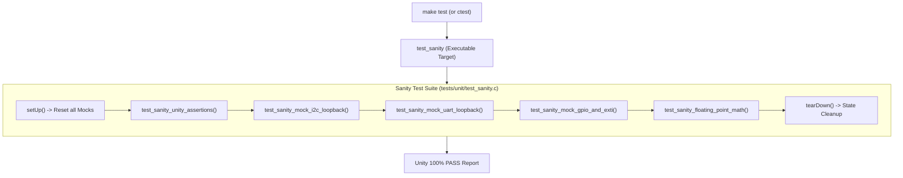

# Task Specification: S1-T2.5 - Initial Host Sanity Test Suite

## 1. Task Metadata & Overview

| Attribute | Specification Details |
| :--- | :--- |
| **Sprint** | **Sprint 1: Test Harness, Desktop Simulation & Mock Infrastructure** |
| **Task ID** | `S1-T2.5` |
| **Parent Task** | `S1-T2: Setup Unity Unit Testing Framework & Mock Hardware Layer` |
| **Task Title** | Create Initial Host Sanity Test Suite (`tests/unit/test_sanity.c`) |
| **Status** | **Ready for Implementation** |
| **Target Files** | [`tests/unit/test_sanity.c`](file:///C:/Users/ENERGY%20SAVER/Documents/Learning/Job%20Projects/rain-predict/tests/unit/test_sanity.c) |
| **Related Documents** | [`context/specs/s1-t2.1-unity-test-harness.md`](file:///C:/Users/ENERGY%20SAVER/Documents/Learning/Job%20Projects/rain-predict/context/specs/s1-t2.1-unity-test-harness.md)<br>[`context/specs/s1-t2.2-mock-i2c-bus.md`](file:///C:/Users/ENERGY%20SAVER/Documents/Learning/Job%20Projects/rain-predict/context/specs/s1-t2.2-mock-i2c-bus.md)<br>[`context/specs/s1-t2.3-mock-uart-bus.md`](file:///C:/Users/ENERGY%20SAVER/Documents/Learning/Job%20Projects/rain-predict/context/specs/s1-t2.3-mock-uart-bus.md)<br>[`context/specs/s1-t2.4-mock-gpio.md`](file:///C:/Users/ENERGY%20SAVER/Documents/Learning/Job%20Projects/rain-predict/context/specs/s1-t2.4-mock-gpio.md)<br>[`context/specs/s1-t1.2-root-makefile.md`](file:///C:/Users/ENERGY%20SAVER/Documents/Learning/Job%20Projects/rain-predict/context/specs/s1-t1.2-root-makefile.md)<br>[`context/coding-standards.md`](file:///C:/Users/ENERGY%20SAVER/Documents/Learning/Job%20Projects/rain-predict/context/coding-standards.md) |
| **Dependencies** | `S1-T1.1`, `S1-T2.1`, `S1-T2.2`, `S1-T2.3`, `S1-T2.4` |
| **Downstream Tasks** | All domain-specific algorithm and driver test suites in Sprints 2 through 7 |

---

## 2. Executive Summary & Architectural Scope

The primary objective of **`S1-T2.5`** is to develop [`tests/unit/test_sanity.c`](file:///C:/Users/ENERGY%20SAVER/Documents/Learning/Job%20Projects/rain-predict/tests/unit/test_sanity.c), the inaugural host-executable verification test suite.

This sanity test validates the integrity of the entire Sprint 1 test harness toolchain. It confirms that:
1. The **Unity Assertion Engine** operates accurately on the host (integer bounds, floating-point tolerances, bitwise masks).
2. The **Mock Hardware Abstraction Layer** (`mock_i2c_bus`, `mock_uart_bus`, `mock_gpio`) compiles, links, resets cleanly in `setUp()` / `tearDown()`, and simulates hardware transactions with zero memory leaks.
3. The **Host Math Runtime** evaluates IEEE 754 single-precision float operations consistently with the target Cortex-M4 FPU.
4. The automated **CMake / CTest / Makefile runner pipeline** (`make test`) discovers, executes, and reports test outcomes with a 100% pass rate.



---

## 3. Test Suite Vectors & Assertion Coverage

The `test_sanity.c` test suite must implement 5 distinct verification categories:

### 3.1 Verification Categories

| Test Function | Target Subsystem | Assertions & Behaviors Checked |
| :--- | :--- | :--- |
| `test_sanity_unity_assertions` | Unity Engine | Tests `TEST_ASSERT_TRUE`, `TEST_ASSERT_EQUAL_HEX8`, `TEST_ASSERT_EQUAL_UINT32`, `TEST_ASSERT_FLOAT_WITHIN`, and array comparisons. |
| `test_sanity_mock_i2c_loopback` | `mock_i2c_bus` | Injects mock BME280 register (`0xD0` -> `0x60`) and OPT3001 registers -> reads via `i2c_bus_read()` -> verifies data match and read counter increment. |
| `test_sanity_mock_uart_loopback` | `mock_uart_bus` | Injects Modbus RTU frame into `UART_PORT_RS485` RX queue -> receives via `uart_bus_receive()` -> verifies byte sequence -> transmits query with DE pin enabled. |
| `test_sanity_mock_gpio_and_exti` | `mock_gpio` | Writes status LED outputs -> verifies pin states -> registers EXTI interrupt handler on `PB0` -> triggers pulse -> verifies ISR callback execution count. |
| `test_sanity_floating_point_math` | Host Math Runtime | Computes base psychrometric formulas ($e_s$, $\ln$, $\exp$, $\sqrt{}$) -> verifies single-precision float accuracy within $\pm 0.0001$. |

---

## 4. Test Execution Flow & State Isolation

In accordance with [`context/coding-standards.md`](file:///C:/Users/ENERGY%20SAVER/Documents/Learning/Job%20Projects/rain-predict/context/coding-standards.md):
- **`setUp(void)`**: Must explicitly invoke `mock_i2c_reset()`, `mock_uart_reset()`, and `mock_gpio_reset()` to guarantee that each test begins from a known, pristine state.
- **`tearDown(void)`**: Clears active faults or callbacks.
- **Zero Heap Allocation**: All test buffers and counters must use static or stack-allocated structures.

---

## 5. Concrete File Implementation Blueprint

### 5.1 `tests/unit/test_sanity.c` Reference Blueprint

```c
/**
 * @file    test_sanity.c
 * @brief   Sanity verification suite for Unity test framework and mock HAL layer.
 * @details Verifies test runner pipeline, assertions, mock drivers, and math runtime.
 */

#include "unity.h"
#include <stdint.h>
#include <stdbool.h>
#include <math.h>
#include <string.h>

/* Mock hardware interfaces */
#include "mock_i2c_bus.h"
#include "mock_uart_bus.h"
#include "mock_gpio.h"

static volatile uint32_t s_exti_pulse_counter = 0;

static void sanity_exti_isr_callback(uint16_t pin) {
    if (pin == PIN_RAIN_GAUGE_EXTI) {
        s_exti_pulse_counter++;
    }
}

void setUp(void) {
    mock_i2c_reset();
    mock_uart_reset();
    mock_gpio_reset();
    s_exti_pulse_counter = 0;
}

void tearDown(void) {
    mock_i2c_clear_faults();
    mock_uart_clear_faults(UART_PORT_RS485);
    mock_uart_clear_faults(UART_PORT_SDI12);
}

/**
 * @brief Test basic Unity framework assertion macros.
 */
void test_sanity_unity_assertions(void) {
    TEST_ASSERT_TRUE(true);
    TEST_ASSERT_FALSE(false);
    TEST_ASSERT_EQUAL_INT(42, 42);
    TEST_ASSERT_EQUAL_HEX8(0xA5, 0xA5);
    TEST_ASSERT_EQUAL_UINT32(0xDEADBEEF, 0xDEADBEEF);
    TEST_ASSERT_FLOAT_WITHIN(0.001f, 3.14159f, 3.14150f);
}

/**
 * @brief Test Mock I2C bus register injection and retrieval.
 */
void test_sanity_mock_i2c_loopback(void) {
    const uint8_t bme280_addr = 0x76;
    const uint8_t chip_id_reg = 0xD0;
    const uint8_t expected_id = 0x60;

    /* 1. Inject simulated chip ID into mock register table */
    status_t status = mock_i2c_set_register(bme280_addr, chip_id_reg, expected_id);
    TEST_ASSERT_EQUAL(STATUS_OK, status);

    /* 2. Read via production I2C bus interface */
    uint8_t read_id = 0x00;
    status = i2c_bus_read(bme280_addr, chip_id_reg, &read_id, 1, 100);
    TEST_ASSERT_EQUAL(STATUS_OK, status);
    TEST_ASSERT_EQUAL_HEX8(expected_id, read_id);

    /* 3. Verify transaction counting */
    TEST_ASSERT_EQUAL_UINT32(1, mock_i2c_get_read_count(bme280_addr));
}

/**
 * @brief Test Mock UART bus FIFO injection and transceiver direction guards.
 */
void test_sanity_mock_uart_loopback(void) {
    const uint8_t test_frame[] = { 0x01, 0x03, 0x04, 0x01, 0xF4, 0x00, 0x64, 0x8A, 0x12 };
    uint8_t rx_buffer[16] = { 0 };
    uint16_t bytes_read = 0;

    /* 1. Inject simulated Modbus RTU response frame into RS-485 RX queue */
    status_t status = mock_uart_inject_rx(UART_PORT_RS485, test_frame, sizeof(test_frame));
    TEST_ASSERT_EQUAL(STATUS_OK, status);

    /* 2. Receive via production UART bus interface */
    status = uart_bus_receive(UART_PORT_RS485, rx_buffer, sizeof(test_frame), &bytes_read, 100);
    TEST_ASSERT_EQUAL(STATUS_OK, status);
    TEST_ASSERT_EQUAL_UINT16(sizeof(test_frame), bytes_read);
    TEST_ASSERT_EQUAL_HEX8_ARRAY(test_frame, rx_buffer, sizeof(test_frame));

    /* 3. Test RS-485 Direction Enable before transmission */
    const uint8_t query_frame[] = { 0x01, 0x03, 0x00, 0x00, 0x00, 0x02, 0xC4, 0x0B };
    
    /* Transmission without setting TX direction must fail */
    status = uart_bus_transmit(UART_PORT_RS485, query_frame, sizeof(query_frame), 100);
    TEST_ASSERT_EQUAL(STATUS_ERR_UART_BUS, status);

    /* Enable TX direction and retry */
    uart_bus_set_direction(UART_PORT_RS485, UART_DIR_TX);
    status = uart_bus_transmit(UART_PORT_RS485, query_frame, sizeof(query_frame), 100);
    TEST_ASSERT_EQUAL(STATUS_OK, status);
}

/**
 * @brief Test Mock GPIO outputs, power gate tracking, and EXTI pulse interrupt dispatch.
 */
void test_sanity_mock_gpio_and_exti(void) {
    /* 1. Test LED Output Write & Read */
    gpio_write_pin(GPIO_PORT_B, PIN_LED_GREEN, GPIO_PIN_SET);
    TEST_ASSERT_EQUAL(GPIO_PIN_SET, gpio_read_pin(GPIO_PORT_B, PIN_LED_GREEN));

    gpio_write_pin(GPIO_PORT_B, PIN_LED_GREEN, GPIO_PIN_RESET);
    TEST_ASSERT_EQUAL(GPIO_PIN_RESET, gpio_read_pin(GPIO_PORT_B, PIN_LED_GREEN));
    TEST_ASSERT_EQUAL_UINT32(2, mock_gpio_get_toggle_count(GPIO_PORT_B, PIN_LED_GREEN));

    /* 2. Test Switched Sensor Power Rail Gate PB2 (Active Low) */
    TEST_ASSERT_FALSE(mock_gpio_is_power_rail_energized());
    gpio_write_pin(GPIO_PORT_B, PIN_SENSOR_PWR_GATE, GPIO_PIN_RESET); /* Drive LOW = ON */
    TEST_ASSERT_TRUE(mock_gpio_is_power_rail_energized());

    /* 3. Test EXTI Rain Gauge Interrupt Callback Dispatch */
    int32_t reg_status = gpio_register_exti_callback(PIN_RAIN_GAUGE_EXTI, sanity_exti_isr_callback);
    TEST_ASSERT_EQUAL_INT32(0, reg_status);

    /* Trigger 5 simulated bucket tips */
    mock_gpio_inject_pulse_train(PIN_RAIN_GAUGE_EXTI, 5, 10);
    TEST_ASSERT_EQUAL_UINT32(5, s_exti_pulse_counter);
}

/**
 * @brief Test single-precision floating point mathematical operations (psychrometric foundation).
 */
void test_sanity_floating_point_math(void) {
    /* Test standard Magnus formula exponential saturation vapor pressure at 25.0 C */
    float temp_c = 25.0f;
    float es = 6.112f * expf((17.67f * temp_c) / (temp_c + 243.5f));
    
    /* Expected es(25 C) is ~31.67 hPa */
    TEST_ASSERT_FLOAT_WITHIN(0.05f, 31.67f, es);

    /* Test natural logarithm */
    float val = logf(es / 6.112f);
    TEST_ASSERT_FLOAT_WITHIN(0.001f, 1.645f, val);
}

int main(void) {
    UNITY_BEGIN();
    RUN_TEST(test_sanity_unity_assertions);
    RUN_TEST(test_sanity_mock_i2c_loopback);
    RUN_TEST(test_sanity_mock_uart_loopback);
    RUN_TEST(test_sanity_mock_gpio_and_exti);
    RUN_TEST(test_sanity_floating_point_math);
    return UNITY_END();
}
```

---

## 6. Verification & Acceptance Test Plan

To verify the successful completion of **`S1-T2.5`**, the following verification procedures must be executed:

### 6.1 Verification Test Cases

| Test Case ID | Verification Action | Expected Outcome | Pass/Fail Criteria |
| :--- | :--- | :--- | :--- |
| **TC-S1-T2.5-01** | Compilation Verification | Build target executable `test_sanity` using `cmake --build build --target test_sanity`. | 100% clean compilation with `-Wall -Wextra -Wpedantic -Werror`. |
| **TC-S1-T2.5-02** | Direct Binary Execution | Run `./build/tests/test_sanity` (or `.\build\tests\Debug\test_sanity.exe`). | 5 tests executed, 0 failures, 0 ignored. |
| **TC-S1-T2.5-03** | CTest Discovery & Runner | Run `ctest --test-dir build --verbose`. | Test `sanity` passed with execution time $< 0.1\text{s}$. |
| **TC-S1-T2.5-04** | Makefile Alias Verification | Run `make test` from root. | Automatically triggers host build and executes `test_sanity` with 100% pass rate. |
| **TC-S1-T2.5-05** | ASan Cleanliness | Run `make asan`. | Zero memory leaks, buffer overflows, or undefined behavior warnings reported. |

---

## 7. Definition of Done (DoD) Checklist

- [ ] [`tests/unit/test_sanity.c`](file:///C:/Users/ENERGY%20SAVER/Documents/Learning/Job%20Projects/rain-predict/tests/unit/test_sanity.c) created implementing all 5 verification test functions.
- [ ] Registered inside [`tests/CMakeLists.txt`](file:///C:/Users/ENERGY%20SAVER/Documents/Learning/Job%20Projects/rain-predict/tests/CMakeLists.txt) using `add_firmware_test(sanity SOURCES unit/test_sanity.c)`.
- [ ] Executes via `ctest` and `make test` with 100% pass rate.
- [ ] All clickable links and file references resolve properly.
- [ ] Spec document registered and linked under [`context/specs/spec-roadmap.md`](file:///C:/Users/ENERGY%20SAVER/Documents/Learning/Job%20Projects/rain-predict/context/specs/spec-roadmap.md#L108).
