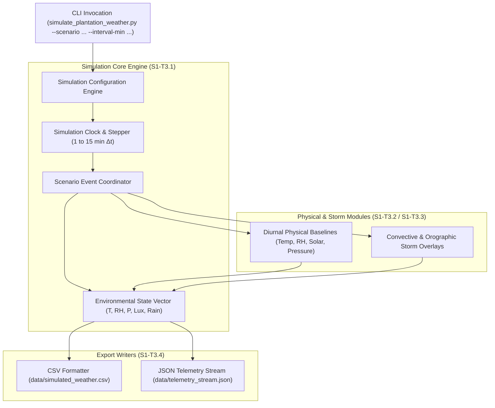

# Task Specification: S1-T3.1 - Python Weather Simulator Core Engine

## 1. Task Metadata & Overview

| Attribute | Specification Details |
| :--- | :--- |
| **Sprint** | **Sprint 1: Test Harness, Desktop Simulation & Mock Infrastructure** |
| **Task ID** | `S1-T3.1` |
| **Parent Task** | `S1-T3: Develop Python Tea Plantation Microclimate Simulator` |
| **Task Title** | Create Python Weather Simulator Core Engine with Configurable Temporal Resolution |
| **Status** | **Ready for Implementation** |
| **Target Files** | [`tools/simulation/simulate_plantation_weather.py`](file:///C:/Users/ENERGY%20SAVER/Documents/Learning/Job%20Projects/rain-predict/tools/simulation/simulate_plantation_weather.py) |
| **Related Documents** | [`docs/algorithms/algorithm-validation-and-tuning.md`](file:///C:/Users/ENERGY%20SAVER/Documents/Learning/Job%20Projects/rain-predict/docs/algorithms/algorithm-validation-and-tuning.md)<br>[`docs/algorithms/meteorological-formulas.md`](file:///C:/Users/ENERGY%20SAVER/Documents/Learning/Job%20Projects/rain-predict/docs/algorithms/meteorological-formulas.md)<br>[`docs/algorithms/trend-detection-and-nowcasting.md`](file:///C:/Users/ENERGY%20SAVER/Documents/Learning/Job%20Projects/rain-predict/docs/algorithms/trend-detection-and-nowcasting.md)<br>[`context/specs/s1-t1.2-root-makefile.md`](file:///C:/Users/ENERGY%20SAVER/Documents/Learning/Job%20Projects/rain-predict/context/specs/s1-t1.2-root-makefile.md) |
| **Dependencies** | None (Independent Python simulation tooling) |
| **Downstream Tasks** | `S1-T3.2` (Diurnal curves), `S1-T3.3` (Convective storm models), `S1-T3.4` (Dataset export), `S7-T1` (Algorithm validation) |

---

## 2. Executive Summary & Architectural Scope

The primary objective of **`S1-T3.1`** is to establish the core architecture and Command-Line Interface (CLI) for the synthetic microclimate simulation script ([`tools/simulation/simulate_plantation_weather.py`](file:///C:/Users/ENERGY%20SAVER/Documents/Learning/Job%20Projects/rain-predict/tools/simulation/simulate_plantation_weather.py)).

Tea plantations feature distinct high-altitude microclimates (elevations 500m–2200m) characterized by steep diurnal temperature fluctuations, rapid morning-to-afternoon relative humidity swings, sudden convective cloud attenuation, and sharp barometric pressure drops preceding localized monsoonal squalls.

To validate firmware algorithms ([`dew_point.c`](file:///C:/Users/ENERGY%20SAVER/Documents/Learning/Job%20Projects/rain-predict/firmware/middleware/src/dew_point.c), [`zambretti.c`](file:///C:/Users/ENERGY%20SAVER/Documents/Learning/Job%20Projects/rain-predict/firmware/app/src/zambretti.c), [`trend_detector.c`](file:///C:/Users/ENERGY%20SAVER/Documents/Learning/Job%20Projects/rain-predict/firmware/app/src/trend_detector.c), [`rain_algo.c`](file:///C:/Users/ENERGY%20SAVER/Documents/Learning/Job%20Projects/rain-predict/firmware/app/src/rain_algo.c)) on the desktop prior to hardware field deployment, this tool generates continuous, physically consistent time-series datasets.

### Key Architectural Requirements:
1. **Configurable Temporal Resolution**: Granular sampling intervals from $1\text{ minute}$ to $15\text{ minutes}$ (matching the firmware's standard 15-minute measurement cycle).
2. **Zero Third-Party Dependencies**: Built exclusively with Python 3.10+ Standard Library (`math`, `random`, `datetime`, `argparse`, `csv`, `json`, `pathlib`), eliminating external packaging hurdles.
3. **Modular Generator Architecture**: Clean separation between the simulation time-stepping engine, physical curve generators, storm injection overlays, and dataset serializers.
4. **Deterministic Seed Control**: Reproducible random seed generator for regression testing.



---

## 3. CLI Options & Parameter Specifications

The simulator must support a comprehensive set of CLI parameters via `argparse`:

| Argument Flag | Type | Default | Description |
| :--- | :--- | :--- | :--- |
| `--duration-days` | `int` | `7` | Duration of the generated weather sequence in days (1–60). |
| `--interval-min` | `int` | `15` | Temporal resolution step in minutes (1, 5, 10, 15). |
| `--elevation` | `float` | `1500.0` | Plantation elevation above sea level in meters ($500.0–2200.0\text{m}$). |
| `--scenario` | `str` | `pre_monsoon_convective` | Climate profile scenario (`fair_weather`, `pre_monsoon_convective`, `monsoon_sustained`, `false_alarm_cloud_shadow`, `multi_day_storm_cycle`). |
| `--seed` | `int` | `42` | Random number generator seed for deterministic repeatable runs. |
| `--output` | `str` | `data/simulated_weather.csv` | Output file path for generated dataset. |
| `--format` | `str` | `csv` | Export file format (`csv`, `json`, `both`). |
| `--verbose` | `flag` | `False` | Prints simulation summary statistics to terminal. |

---

## 4. Environmental State Vector Data Schema

At each simulation time step $t_k$, the engine maintains and records an environmental state record:

```json
{
  "timestamp": "2026-09-09T06:00:00Z",
  "step_index": 24,
  "elapsed_hours": 6.0,
  "temp_c": 19.45,
  "humidity_pct": 82.30,
  "pressure_hpa": 845.20,
  "sea_level_pressure_hpa": 1012.40,
  "solar_lux": 24500.0,
  "rain_rate_mmh": 0.0,
  "rain_gauge_tip_count": 0,
  "accumulated_rain_mm": 0.0,
  "is_raining": 0,
  "ground_truth_lead_time_min": 75.0,
  "scenario": "pre_monsoon_convective"
}
```

---

## 5. Concrete File Implementation Blueprint

### 5.1 `tools/simulation/simulate_plantation_weather.py` Core Reference Skeleton

```python
#!/usr/bin/env python3
"""
simulate_plantation_weather.py
-------------------------------
Synthetic Microclimate Scenario Generator for Tea Plantation Rain Prediction.
Simulates diurnal cycles, convective storms, and barometric drops for firmware validation.
"""

import argparse
import csv
import datetime
import json
import math
import os
import random
import sys
from dataclasses import asdict, dataclass
from pathlib import Path
from typing import Dict, List, Optional, Tuple


@dataclass
class EnvironmentalState:
    timestamp: str
    step_index: int
    elapsed_hours: float
    temp_c: float
    humidity_pct: float
    pressure_hpa: float
    sea_level_pressure_hpa: float
    solar_lux: float
    rain_rate_mmh: float
    rain_gauge_tip_count: int
    accumulated_rain_mm: float
    is_raining: int
    ground_truth_lead_time_min: float
    scenario_tag: str


class MicroclimateEngine:
    """Core simulation coordinator managing time-stepping and state history."""

    def __init__(
        self,
        duration_days: int = 7,
        interval_min: int = 15,
        elevation_m: float = 1500.0,
        scenario: str = "pre_monsoon_convective",
        seed: Optional[int] = 42,
    ):
        self.duration_days = duration_days
        self.interval_min = interval_min
        self.elevation_m = elevation_m
        self.scenario = scenario
        self.seed = seed

        if seed is not None:
            random.seed(seed)

        self.total_steps = int((duration_days * 24 * 60) / interval_min)
        self.dt_hours = interval_min / 60.0
        self.start_time = datetime.datetime(2026, 9, 9, 0, 0, 0, tzinfo=datetime.timezone.utc)
        self.states: List[EnvironmentalState] = []
        self.accumulated_rain_mm = 0.0
        self.total_rain_tips = 0

    def calculate_barometric_reduction(self, p_station: float, temp_c: float) -> float:
        """Converts station pressure to sea-level equivalent using hypsometric formula."""
        h = self.elevation_m
        t_kelvin = temp_c + 273.15 + (0.0065 * h / 2.0)
        p0 = p_station * math.pow(1.0 - (0.0065 * h) / t_kelvin, -5.257)
        return round(p0, 2)

    def run(self) -> List[EnvironmentalState]:
        """Executes simulation loop over all time steps."""
        self.states.clear()
        self.accumulated_rain_mm = 0.0
        self.total_rain_tips = 0

        for step in range(self.total_steps):
            current_time = self.start_time + datetime.timedelta(minutes=step * self.interval_min)
            elapsed_hours = step * self.dt_hours
            hour_of_day = (current_time.hour + current_time.minute / 60.0) % 24.0

            # 1. Base Diurnal Physical Profile (S1-T3.2 Integration Point)
            # Default placeholder: diurnal baseline sinusoidal curves
            t_base = 22.0 - 6.0 * math.cos(2.0 * math.pi * (hour_of_day - 4.0) / 24.0)
            rh_base = 75.0 + 20.0 * math.cos(2.0 * math.pi * (hour_of_day - 4.0) / 24.0)
            p_base = 845.0 - (self.elevation_m - 1500.0) * 0.10 + 1.5 * math.sin(2.0 * math.pi * hour_of_day / 12.0)

            # Solar irradiance calculation (Daylight peak at 12:00, 0 at night)
            if 6.0 <= hour_of_day <= 18.0:
                solar_factor = math.sin(math.pi * (hour_of_day - 6.0) / 12.0)
                lux_base = 100000.0 * math.pow(solar_factor, 1.5)
            else:
                lux_base = 0.0

            # 2. Convective Storm Overlays (S1-T3.3 Integration Point)
            rain_rate = 0.0
            is_raining = 0
            lead_time_min = 0.0

            # Calculate sea-level pressure
            p0 = self.calculate_barometric_reduction(p_base, t_base)

            state = EnvironmentalState(
                timestamp=current_time.isoformat(),
                step_index=step,
                elapsed_hours=round(elapsed_hours, 2),
                temp_c=round(t_base, 2),
                humidity_pct=round(min(100.0, max(10.0, rh_base)), 2),
                pressure_hpa=round(p_base, 2),
                sea_level_pressure_hpa=p0,
                solar_lux=round(max(0.0, lux_base), 1),
                rain_rate_mmh=round(rain_rate, 2),
                rain_gauge_tip_count=self.total_rain_tips,
                accumulated_rain_mm=round(self.accumulated_rain_mm, 2),
                is_raining=is_raining,
                ground_truth_lead_time_min=round(lead_time_min, 1),
                scenario_tag=self.scenario,
            )
            self.states.append(state)

        return self.states

    def export_csv(self, output_path: str) -> None:
        """Exports simulation records to CSV."""
        if not self.states:
            return

        out_file = Path(output_path)
        out_file.parent.mkdir(parents=True, exist_ok=True)

        fieldnames = list(asdict(self.states[0]).keys())
        with open(out_file, mode="w", newline="", encoding="utf-8") as f:
            writer = csv.DictWriter(f, fieldnames=fieldnames)
            writer.writeheader()
            for s in self.states:
                writer.writerow(asdict(s))

    def export_json(self, output_path: str) -> None:
        """Exports simulation records to JSON array."""
        if not self.states:
            return

        out_file = Path(output_path)
        out_file.parent.mkdir(parents=True, exist_ok=True)

        data = [asdict(s) for s in self.states]
        with open(out_file, mode="w", encoding="utf-8") as f:
            json.dump(data, f, indent=2)


def parse_args() -> argparse.Namespace:
    parser = argparse.ArgumentParser(
        description="Tea Plantation Microclimate Weather Simulator",
        formatter_class=argparse.ArgumentDefaultsHelpFormatter,
    )
    parser.add_argument("--duration-days", type=int, default=7, help="Simulation duration in days")
    parser.add_argument(
        "--interval-min", type=int, default=15, choices=[1, 5, 10, 15], help="Temporal resolution step in minutes"
    )
    parser.add_argument("--elevation", type=float, default=1500.0, help="Plantation elevation in meters ASL")
    parser.add_argument(
        "--scenario",
        type=str,
        default="pre_monsoon_convective",
        choices=[
            "fair_weather",
            "pre_monsoon_convective",
            "monsoon_sustained",
            "false_alarm_cloud_shadow",
            "multi_day_storm_cycle",
        ],
        help="Weather simulation scenario profile",
    )
    parser.add_argument("--seed", type=int, default=42, help="Random number generator seed")
    parser.add_argument("--output", type=str, default="data/simulated_weather.csv", help="Output file path")
    parser.add_argument("--format", type=str, default="csv", choices=["csv", "json", "both"], help="Export format")
    parser.add_argument("--verbose", action="store_true", help="Print summary statistics")
    return parser.parse_args()


def main() -> int:
    args = parse_args()
    engine = MicroclimateEngine(
        duration_days=args.duration_days,
        interval_min=args.interval_min,
        elevation_m=args.elevation,
        scenario=args.scenario,
        seed=args.seed,
    )

    states = engine.run()

    if args.format in ["csv", "both"]:
        csv_path = args.output if args.output.endswith(".csv") else f"{args.output}.csv"
        engine.export_csv(csv_path)
        print(f"[SIM] Successfully exported {len(states)} records to CSV: {csv_path}")

    if args.format in ["json", "both"]:
        json_path = (
            args.output.replace(".csv", ".json") if args.output.endswith(".csv") else f"{args.output}.json"
        )
        engine.export_json(json_path)
        print(f"[SIM] Successfully exported {len(states)} records to JSON: {json_path}")

    if args.verbose:
        print(f"\n--- Simulation Summary ---")
        print(f"Total Duration : {args.duration_days} days ({len(states)} samples @ {args.interval_min}m)")
        print(f"Elevation      : {args.elevation} m ASL")
        print(f"Scenario       : {args.scenario}")
        print(f"Random Seed    : {args.seed}")

    return 0


if __name__ == "__main__":
    sys.exit(main())
```

---

## 6. Verification & Acceptance Test Plan

To verify the successful completion of **`S1-T3.1`**, the following verification procedures must be executed:

### 6.1 Verification Test Cases

| Test Case ID | Verification Action | Expected Outcome | Pass/Fail Criteria |
| :--- | :--- | :--- | :--- |
| **TC-S1-T3.1-01** | CLI Help Menu Invocation | Run `python tools/simulation/simulate_plantation_weather.py --help`. | Displays clean usage help with all arguments and default values. |
| **TC-S1-T3.1-02** | Default CSV Generation | Run `python tools/simulation/simulate_plantation_weather.py --duration-days 7 --interval-min 15`. | Generates 672 CSV rows ($7 \times 24 \times 4$) with complete header fields. |
| **TC-S1-T3.1-03** | 1-Minute High-Resolution Run | Run `python tools/simulation/simulate_plantation_weather.py --duration-days 1 --interval-min 1`. | Generates 1,440 continuous records with exact 1-minute delta steps. |
| **TC-S1-T3.1-04** | JSON Serialization | Run `python tools/simulation/simulate_plantation_weather.py --format json --output data/test.json`. | Generates valid JSON array matching schema. |
| **TC-S1-T3.1-05** | Deterministic Reproducibility | Runs two simulations with `--seed 123` to separate files -> executes `diff`. | Both generated files produce 100% identical byte hashes. |

---

## 7. Definition of Done (DoD) Checklist

- [ ] [`tools/simulation/simulate_plantation_weather.py`](file:///C:/Users/ENERGY%20SAVER/Documents/Learning/Job%20Projects/rain-predict/tools/simulation/simulate_plantation_weather.py) created with CLI argument parser, simulation clock, and state coordinator.
- [ ] Configurable temporal resolution ($1\text{m}$, $5\text{m}$, $10\text{m}$, $15\text{m}$) verified.
- [ ] Hypsometric barometric reduction formula implemented.
- [ ] Zero third-party dependencies (100% standard library).
- [ ] All clickable links and file references resolve properly.
- [ ] Spec document registered and linked under [`context/specs/spec-roadmap.md`](file:///C:/Users/ENERGY%20SAVER/Documents/Learning/Job%20Projects/rain-predict/context/specs/spec-roadmap.md#L114).
