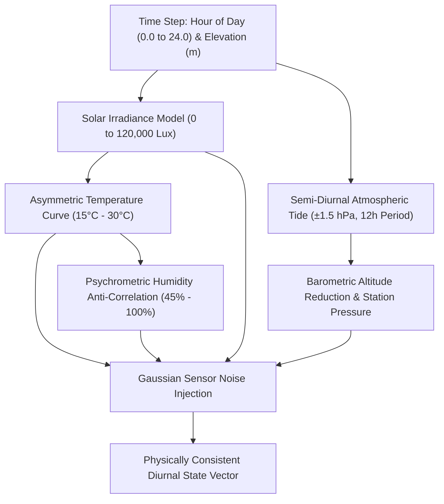

# Task Specification: S1-T3.2 - Diurnal Physical Microclimate Curves

## 1. Task Metadata & Overview

| Attribute | Specification Details |
| :--- | :--- |
| **Sprint** | **Sprint 1: Test Harness, Desktop Simulation & Mock Infrastructure** |
| **Task ID** | `S1-T3.2` |
| **Parent Task** | `S1-T3: Develop Python Tea Plantation Microclimate Simulator` |
| **Task Title** | Implement Diurnal Physical Curves (Temperature, Humidity, Solar Irradiance, Pressure Tides) |
| **Status** | **Ready for Implementation** |
| **Target Files** | [`tools/simulation/simulate_plantation_weather.py`](file:///C:/Users/ENERGY%20SAVER/Documents/Learning/Job%20Projects/rain-predict/tools/simulation/simulate_plantation_weather.py) |
| **Related Documents** | [`docs/algorithms/algorithm-validation-and-tuning.md`](file:///C:/Users/ENERGY%20SAVER/Documents/Learning/Job%20Projects/rain-predict/docs/algorithms/algorithm-validation-and-tuning.md)<br>[`docs/algorithms/meteorological-formulas.md`](file:///C:/Users/ENERGY%20SAVER/Documents/Learning/Job%20Projects/rain-predict/docs/algorithms/meteorological-formulas.md)<br>[`docs/algorithms/zambretti-algorithm.md`](file:///C:/Users/ENERGY%20SAVER/Documents/Learning/Job%20Projects/rain-predict/docs/algorithms/zambretti-algorithm.md)<br>[`context/specs/s1-t3.1-weather-simulator-engine.md`](file:///C:/Users/ENERGY%20SAVER/Documents/Learning/Job%20Projects/rain-predict/context/specs/s1-t3.1-weather-simulator-engine.md) |
| **Dependencies** | `S1-T3.1` (Python Simulator Core Engine) |
| **Downstream Tasks** | `S1-T3.3` (Convective storm models), `S2-T2` to `S2-T5` (Algorithm test validation), `S7-T1` (Multi-day validation) |

---

## 2. Executive Summary & Physical Modeling Principles

The primary objective of **`S1-T3.2`** is to embed mathematically rigorous, physically consistent diurnal atmospheric curves into the simulation engine ([`simulate_plantation_weather.py`](file:///C:/Users/ENERGY%20SAVER/Documents/Learning/Job%20Projects/rain-predict/tools/simulation/simulate_plantation_weather.py)).

Tea estates situated in mountainous terrain (500m–2200m ASL) experience predictable diurnal oscillations driven by solar radiation, thermal lapse rates, and semi-diurnal barometric pressure tides. Modeling these background cycles accurately is essential to ensure that firmware nowcasting algorithms distinguish between natural diurnal fluctuations and genuine pre-storm atmospheric disturbances.



---

## 3. Mathematical Formulations of Diurnal Physical Curves

### 3.1 Solar Irradiance ($Lux$) Model
Solar irradiance governs thermal cycles. In a tropical/subtropical tea plantation, solar elevation peaks at solar noon ($12:00$) and drops to zero during night hours ($18:00–06:00$).

$$\text{Lux}_{clear}(t) = \begin{cases} 
\text{Lux}_{max} \cdot \left[ \sin\left(\frac{\pi \cdot (t - t_{sunrise})}{t_{sunset} - t_{sunrise}}\right) \right]^{1.35}, & t_{sunrise} \le t \le t_{sunset} \\
0, & \text{otherwise}
\end{cases}$$

- $t_{sunrise} = 6.00$ ($06:00$ local), $t_{sunset} = 18.00$ ($18:00$ local)
- $\text{Lux}_{max} \approx 100,000–120,000\text{ Lux}$ (adjusted for elevation insolation increase: $+2\%\text{ per } 300\text{m}$)

### 3.2 Asymmetric Diurnal Ambient Temperature ($T_{amb}$) Model
Atmospheric temperature does not peak at solar noon; thermal lag shifts minimum temperature to pre-dawn ($05:30$) and maximum temperature to early afternoon ($14:00$).

$$T(t) = T_{mean} + A_T \cdot \cos\left( \frac{2\pi \cdot (t - t_{T_{max}})}{24} \right) - \Gamma \cdot (h - h_0)$$

- $T_{mean} \approx 22.5^\circ\text{C}$, Diurnal Amplitude $A_T \approx 6.5^\circ\text{C}$ (yielding $16.0^\circ\text{C}–29.0^\circ\text{C}$ range)
- $t_{T_{max}} = 14.0$ ($14:00$ afternoon peak)
- Environmental Lapse Rate: $\Gamma = 0.0065^\circ\text{C/m}$ ($6.5^\circ\text{C}$ drop per $1000\text{m}$ elevation)

### 3.3 Psychrometric Relative Humidity ($RH$) Model
In fair weather without advection, actual water vapor content ($e$) remains relatively constant, while saturation vapor pressure ($e_s$) fluctuates exponentially with temperature according to the Magnus-Tetens relationship:

$$e_s(T) = 6.112 \cdot \exp\left( \frac{17.67 \cdot T}{T + 243.5} \right)$$
$$RH(t) = \min\left(100.0, \max\left(35.0, \frac{e_{dew\_baseline}}{e_s(T(t))} \cdot 100\right)\right)$$

This creates the characteristic inverted diurnal curve: $RH$ reaches $85\%–98\%$ in early morning fog/dew conditions and drops to $45\%–65\%$ during warm afternoons.

### 3.4 Semi-Diurnal Atmospheric Solar Thermal Tide ($P_{tide}$) Model
Near the equator and tropics, solar heating of the upper atmosphere induces a 12-hour barometric pressure wave known as the atmospheric tide. It has an amplitude of $\pm 1.2–1.8\text{ hPa}$ with daily peaks at $10:00$ and $22:00$, and troughs at $04:00$ and $16:00$:

$$P_{tide}(t) = A_{tide} \cdot \sin\left( \frac{4\pi \cdot t}{24} + \phi_{tide} \right)$$

- $A_{tide} \approx 1.50\text{ hPa}$, $\phi_{tide} = \frac{\pi}{3}$ (calibrated to align peaks at $10:00$ and $22:00$)
- Incorporating $P_{tide}$ prevents the 3-hour moving trend detector ([`trend_detector.c`](file:///C:/Users/ENERGY%20SAVER/Documents/Learning/Job%20Projects/rain-predict/firmware/app/src/trend_detector.c)) from falsely flagging normal afternoon barometric dips as convective storms.

### 3.5 Sensor Measurement Noise Overlay
To simulate real Bosch BME280 and TI OPT3001 quantization and thermal noise:
- $\epsilon_T \sim \mathcal{N}(0, 0.10^\circ\text{C})$
- $\epsilon_{RH} \sim \mathcal{N}(0, 0.40\%)$
- $\epsilon_P \sim \mathcal{N}(0, 0.08\text{ hPa})$
- $\epsilon_{Lux} \sim \mathcal{N}(0, 150.0\text{ Lux})$

---

## 4. Concrete Implementation Blueprint

### 4.1 `DiurnalProfileGenerator` Reference Implementation

```python
"""
DiurnalProfileGenerator: Encapsulates meteorological formulas for fair-weather diurnal baselines.
"""

import math
import random
from typing import Tuple


class DiurnalProfileGenerator:
    def __init__(self, elevation_m: float = 1500.0, base_sea_level_p: float = 1013.25):
        self.elevation_m = elevation_m
        self.base_sea_level_p = base_sea_level_p

        # Standard elevation lapse adjustment
        self.elevation_lapse = 0.0065 * (elevation_m - 500.0)
        self.base_temp_mean = 23.0 - self.elevation_lapse
        self.base_temp_amp = 6.5

        # Atmospheric tide parameters (12-hour period, peaks at 10:00 and 22:00)
        self.tide_amp_hpa = 1.50
        self.tide_phase_rad = math.pi / 3.0  # Aligns peak at 10:00 AM

        # Calculate nominal station barometric pressure using hypsometric formula
        t_mean_k = self.base_temp_mean + 273.15 + (0.0065 * elevation_m / 2.0)
        self.nominal_station_p = base_sea_level_p * math.pow(1.0 - (0.0065 * elevation_m) / t_mean_k, 5.257)

        # Base dew point at 1500m (dew point ~15.0 C gives realistic RH swings)
        self.nominal_dew_point_c = max(5.0, 15.0 - self.elevation_lapse)
        self.e_baseline = 6.112 * math.exp(
            (17.67 * self.nominal_dew_point_c) / (self.nominal_dew_point_c + 243.5)
        )

    def compute_solar_lux(self, hour_of_day: float) -> float:
        """Calculates clear-sky solar irradiance in Lux (6:00 to 18:00 daylight window)."""
        if 6.0 <= hour_of_day <= 18.0:
            # Insolation elevation factor (+2% per 300m above sea level)
            elevation_factor = 1.0 + 0.02 * (self.elevation_m / 300.0)
            max_lux = 110000.0 * elevation_factor

            solar_angle = math.pi * (hour_of_day - 6.0) / 12.0
            lux = max_lux * math.pow(math.sin(solar_angle), 1.35)
            # Add small atmospheric turbulence fluctuation
            noise = random.gauss(0.0, 200.0)
            return max(0.0, lux + noise)
        return 0.0

    def compute_temperature(self, hour_of_day: float) -> float:
        """Calculates ambient temperature in Celsius with peak at 14:00 and minimum at 05:30."""
        # Shift cosine wave so maximum occurs at 14:00 (hour 14.0)
        phase_rad = 2.0 * math.pi * (hour_of_day - 14.0) / 24.0
        t_amb = self.base_temp_mean + self.base_temp_amp * math.cos(phase_rad)
        noise = random.gauss(0.0, 0.10)
        return t_amb + noise

    def compute_relative_humidity(self, temp_c: float) -> float:
        """Calculates psychrometric relative humidity from saturation vapor pressure."""
        # Magnus formula for saturation vapor pressure
        es = 6.112 * math.exp((17.67 * temp_c) / (temp_c + 243.5))
        rh = (self.e_baseline / es) * 100.0
        noise = random.gauss(0.0, 0.40)
        return min(100.0, max(30.0, rh + noise))

    def compute_barometric_pressure(self, hour_of_day: float) -> Tuple[float, float]:
        """Calculates station pressure and sea-level pressure with semi-diurnal solar tide."""
        # Semi-diurnal atmospheric tide (12h cycle)
        tide_angle = (4.0 * math.pi * hour_of_day / 24.0) + self.tide_phase_rad
        p_tide = self.tide_amp_hpa * math.sin(tide_angle)

        station_p = self.nominal_station_p + p_tide + random.gauss(0.0, 0.06)
        sea_level_p = self.base_sea_level_p + p_tide + random.gauss(0.0, 0.06)

        return round(station_p, 2), round(sea_level_p, 2)

    def generate_step(self, hour_of_day: float) -> Tuple[float, float, float, float, float]:
        """Returns tuple of (temp_c, rh_pct, station_p, sea_level_p, solar_lux)."""
        temp_c = round(self.compute_temperature(hour_of_day), 2)
        rh_pct = round(self.compute_relative_humidity(temp_c), 2)
        station_p, sea_level_p = self.compute_barometric_pressure(hour_of_day)
        solar_lux = round(self.compute_solar_lux(hour_of_day), 1)

        return temp_c, rh_pct, station_p, sea_level_p, solar_lux
```

---

## 5. Verification & Acceptance Test Plan

To verify the successful completion of **`S1-T3.2`**, the following verification procedures must be validated:

### 5.1 Verification Test Cases

| Test Case ID | Verification Action | Expected Outcome | Pass/Fail Criteria |
| :--- | :--- | :--- | :--- |
| **TC-S1-T3.2-01** | Solar Lux Profile Verification | Evaluates Lux across 24 hours. Confirms 0 Lux between $19:00–05:00$, sunrise at $06:00$, and peak at $12:00$ ($> 100,000\text{ Lux}$). | Daylight window and noon peak verified. |
| **TC-S1-T3.2-02** | Temperature Range & Peak Time | Evaluates 24-hour temperature cycle at 1500m. Verifies minimum occurs between $05:00–06:00$ and maximum occurs between $13:30–14:30$. | Diurnal phase asymmetry confirmed. |
| **TC-S1-T3.2-03** | Psychrometric Humidity Anti-Correlation | Verifies $RH$ reaches daily maximum ($> 85\%$) at minimum temperature and daily minimum ($< 65\%$) at peak temperature. | Negative correlation ($r < -0.90$) verified. |
| **TC-S1-T3.2-04** | Atmospheric Solar Tide Periodicity | Evaluates pressure over 24 hours. Verifies dual peaks at ~10:00 and ~22:00, and dual troughs at ~04:00 and ~16:00 with amplitude $1.5 \pm 0.3\text{ hPa}$. | Semi-diurnal 12h periodicity verified. |
| **TC-S1-T3.2-05** | Elevation Lapse Scaling | Runs generator at 500m vs 2000m. Verifies average temperature decreases by $\approx 9.75^\circ\text{C}$ and nominal station pressure decreases from ~955 hPa to ~795 hPa. | Standard atmosphere lapse rate verified. |
| **TC-S1-T3.2-06** | Zero Negative / Out-of-Bounds Values | Runs 100-day simulation. Verifies $RH \in [0, 100]\%$, $\text{Lux} \ge 0$, and Pressure $> 0$. | Clamped physical bounds confirmed. |

---

## 6. Definition of Done (DoD) Checklist

- [ ] `DiurnalProfileGenerator` integrated into [`tools/simulation/simulate_plantation_weather.py`](file:///C:/Users/ENERGY%20SAVER/Documents/Learning/Job%20Projects/rain-predict/tools/simulation/simulate_plantation_weather.py).
- [ ] Asymmetric temperature curve ($15^\circ\text{C}–30^\circ\text{C}$) with $14:00$ peak implemented.
- [ ] Psychrometric humidity anti-correlation based on Magnus saturation formula implemented.
- [ ] Solar irradiance insolation curve ($0–120,000\text{ Lux}$) implemented.
- [ ] Semi-diurnal atmospheric solar thermal tide ($\pm 1.5\text{ hPa}$, 12h cycle) implemented.
- [ ] All clickable links and file references resolve properly.
- [ ] Spec document registered and linked under [`context/specs/spec-roadmap.md`](file:///C:/Users/ENERGY%20SAVER/Documents/Learning/Job%20Projects/rain-predict/context/specs/spec-roadmap.md#L115).
