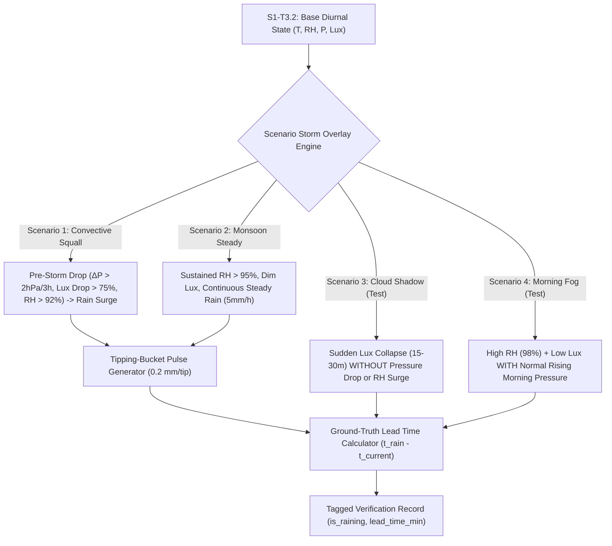

# Task Specification: S1-T3.3 - Convective Storm Injection Models

## 1. Task Metadata & Overview

| Attribute | Specification Details |
| :--- | :--- |
| **Sprint** | **Sprint 1: Test Harness, Desktop Simulation & Mock Infrastructure** |
| **Task ID** | `S1-T3.3` |
| **Parent Task** | `S1-T3: Develop Python Tea Plantation Microclimate Simulator` |
| **Task Title** | Implement Convective & Orographic Storm Injection Models |
| **Status** | **Ready for Implementation** |
| **Target Files** | [`tools/simulation/simulate_plantation_weather.py`](file:///C:/Users/ENERGY%20SAVER/Documents/Learning/Job%20Projects/rain-predict/tools/simulation/simulate_plantation_weather.py) |
| **Related Documents** | [`docs/algorithms/algorithm-validation-and-tuning.md`](file:///C:/Users/ENERGY%20SAVER/Documents/Learning/Job%20Projects/rain-predict/docs/algorithms/algorithm-validation-and-tuning.md)<br>[`docs/algorithms/trend-detection-and-nowcasting.md`](file:///C:/Users/ENERGY%20SAVER/Documents/Learning/Job%20Projects/rain-predict/docs/algorithms/trend-detection-and-nowcasting.md)<br>[`docs/sensors/rain-gauge-pulse.md`](file:///C:/Users/ENERGY%20SAVER/Documents/Learning/Job%20Projects/rain-predict/docs/sensors/rain-gauge-pulse.md)<br>[`context/specs/s1-t3.1-weather-simulator-engine.md`](file:///C:/Users/ENERGY%20SAVER/Documents/Learning/Job%20Projects/rain-predict/context/specs/s1-t3.1-weather-simulator-engine.md)<br>[`context/specs/s1-t3.2-diurnal-climate-curves.md`](file:///C:/Users/ENERGY%20SAVER/Documents/Learning/Job%20Projects/rain-predict/context/specs/s1-t3.2-diurnal-climate-curves.md) |
| **Dependencies** | `S1-T3.1`, `S1-T3.2` |
| **Downstream Tasks** | `S1-T3.4` (Dataset export), `S2-T4` (Trend detector verification), `S2-T5` (Nowcasting engine verification), `S7-T1` (Multi-day validation) |

---

## 2. Executive Summary & Meteorological Disturbance Physics

The primary objective of **`S1-T3.3`** is to develop and embed high-fidelity atmospheric perturbation models into [`tools/simulation/simulate_plantation_weather.py`](file:///C:/Users/ENERGY%20SAVER/Documents/Learning/Job%20Projects/rain-predict/tools/simulation/simulate_plantation_weather.py).

In tea-growing highlands, localized convective storms (cumulonimbus cloud development) and orographic rainfall events exhibit distinct multi-variable physical signatures prior to precipitation:
1. **Barometric Pressure Plunge**: Mesoscale low pressure and updraft formation cause station pressure to drop by $> 2.0–4.0\text{ hPa}$ within a 3-hour window.
2. **Solar Radiation Collapse**: Thick cumulonimbus cloud decks attenuate solar irradiance by $> 75–95\%$ within 15–30 minutes, turning bright daylight ($80,000\text{ Lux}$) into storm darkness ($< 8,000\text{ Lux}$).
3. **Humidity Surge & Temperature Drop**: Evaporative cooling from storm downdrafts causes relative humidity to surge above $92–98\%$ while ambient temperature drops by $2.0–6.0^\circ\text{C}$.
4. **Precipitation & Bucket Tip Events**: Calibrated tipping-bucket rain accumulation ($0.2\text{ mm/tip}$) and rain rate intensity ($\text{mm/hr}$).

Crucially, the simulator must also model **False-Alarm Perturbations** (such as passing fair-weather cumulus cloud shadows and non-precipitating morning valley fog) to rigorously verify that the firmware's multi-variable classifier rejects false triggers.



---

## 3. Storm Profile Specifications & Injection Models

### 3.1 Scenario 1: Pre-Monsoon Convective Storm (`pre_monsoon_convective`)
Models sudden afternoon/evening convective storms common in tea plantations:
- **Build-Up Phase ($t_0 - 180\text{m}$ to $t_0$)**:
  - Pressure drops steadily: $\Delta P(t) = -3.5\text{ hPa} \cdot \left(\frac{t - (t_0 - 180)}{180}\right)^{1.5}$.
  - Cloud attenuation accelerates in the last 45 minutes: $\text{Lux}(t) = \text{Lux}_{clear}(t) \cdot \left[1.0 - 0.85 \cdot \left(\frac{t - (t_0 - 45)}{45}\right)\right]$.
  - Relative Humidity surges: $RH(t) = RH_{base}(t) + (95.0 - RH_{base}(t)) \cdot \left(\frac{t - (t_0 - 120)}{120}\right)$.
  - Temperature drops by up to $4.5^\circ\text{C}$ due to convective downdrafts.
- **Precipitation Phase ($t_0$ to $t_0 + 90\text{m}$)**:
  - Rain rate: Peaks at $35.0\text{ mm/hr}$ in the first 20 minutes, tapering off over 90 minutes.
  - Generates discrete $0.2\text{ mm}$ tipping bucket pulses.
  - `is_raining = 1`.
- **Dissipation Phase ($t_0 + 90\text{m}$ to $t_0 + 180\text{m}$)**:
  - Rain stops (`is_raining = 0`), pressure slowly recovers to atmospheric baseline (+2.5 hPa).

### 3.2 Scenario 2: Monsoon Sustained Rain (`monsoon_sustained`)
Models multi-day orographic monsoon precipitation:
- Continuous high humidity ($95.0\%–100.0\%$).
- Heavy stratus cloud cover reducing solar irradiance to $< 10,000\text{ Lux}$ all day.
- Steady, low-to-moderate rain rates ($2.0–8.0\text{ mm/hr}$) for 24–48 hours.
- Station pressure remains depressed ($5–8\text{ hPa}$ below fair-weather baseline).

### 3.3 Scenario 3: False-Alarm Fair-Weather Cloud Shadow (`false_alarm_cloud_shadow`)
Critical test case to verify false-alarm rejection:
- A passing cumulus cloud obscures direct sunlight for 30 minutes between $13:00$ and $13:30$, dropping Lux by $80\%$.
- **Barometric pressure remains steady** ($\Delta P < 0.3\text{ hPa/3h}$).
- **Relative humidity does not surge** ($RH < 65\%$).
- Expected firmware prediction: **`RAIN_STATE_UNLIKELY`** ($S < 30\%$).

### 3.4 Scenario 4: Orographic Valley Fog (`false_alarm_orographic_fog`)
- Morning valley fog between $06:00$ and $09:00$: $RH = 98\%$, $\text{Lux} < 5,000\text{ Lux}$.
- **Barometric pressure is rising** per the morning atmospheric solar tide (+1.5 hPa).
- Expected firmware prediction: **`RAIN_STATE_UNLIKELY`** (fog recognized without barometric trigger).

---

## 4. Tipping-Bucket Discrete Event Model ($0.2\text{ mm/tip}$)

The rainfall generator translates continuous physical rain rates ($\text{mm/hr}$) into discrete tipping-bucket pulses:

```python
def process_rain_step(rain_rate_mmh: float, dt_hours: float) -> Tuple[int, float]:
    """
    Calculates accumulated rain and bucket tips during the discrete time step.
    Bucket calibration factor = 0.2 mm per tip.
    """
    step_rainfall_mm = rain_rate_mmh * dt_hours
    # Bucket accumulation logic with discrete tips
    new_tips = int(step_rainfall_mm / 0.20)
    actual_tipped_mm = new_tips * 0.20
    return new_tips, actual_tipped_mm
```

---

## 5. Ground-Truth Lead Time Calculation Engine

To enable quantitative evaluation of firmware forecast performance (Probability of Detection $\text{POD} \ge 0.80$, False Alarm Rate $\text{FAR} \le 0.25$, Mean Lead Time $\ge 60\text{ min}$), the simulator annotates each time-step with the ground-truth lead time:

$$\text{LeadTime}(t) = \begin{cases}
t_{rain\_onset} - t, & t < t_{rain\_onset} \text{ and } (t_{rain\_onset} - t) \le 360\text{ min} \\
0.0, & \text{otherwise (during rain or clear sky)}
\end{cases}$$

---

## 6. Concrete File Implementation Blueprint

### 6.1 `StormEventCoordinator` Reference Implementation

```python
"""
StormEventCoordinator: Injects convective storms, monsoon precipitation, and false-alarm cloud perturbations.
"""

import math
import random
from typing import Optional, Tuple


class StormEventCoordinator:
    def __init__(self, scenario: str = "pre_monsoon_convective"):
        self.scenario = scenario
        self.rain_bucket_reservoir_mm = 0.0

    def apply_convective_storm(
        self,
        step_time_hours: float,
        temp_base: float,
        rh_base: float,
        p_base: float,
        p0_base: float,
        lux_base: float,
        dt_hours: float,
    ) -> Tuple[float, float, float, float, float, float, int, float]:
        """
        Applies pre-monsoon convective storm event centered at hour 14.0 (2:00 PM).
        Build-up: 11:30 - 14:00 (150 min lead time).
        Precipitation: 14:00 - 15:30 (90 min rain).
        """
        storm_start_hour = 14.0
        storm_duration_hours = 1.5
        storm_buildup_hours = 2.5  # Build up starts at 11:30 AM

        temp = temp_base
        rh = rh_base
        p_station = p_base
        p0 = p0_base
        lux = lux_base
        rain_rate = 0.0
        is_raining = 0
        lead_time_min = 0.0

        time_to_storm = storm_start_hour - step_time_hours

        # 1. Pre-Storm Build-Up Window
        if 0.0 < time_to_storm <= storm_buildup_hours:
            lead_time_min = time_to_storm * 60.0
            buildup_progress = (storm_buildup_hours - time_to_storm) / storm_buildup_hours

            # Barometric pressure drop: -3.2 hPa maximum drop over 2.5 hours
            p_drop = 3.2 * math.pow(buildup_progress, 1.4)
            p_station -= p_drop
            p0 -= p_drop

            # Relative humidity surge: rises toward 96%
            rh_surge = (96.0 - rh_base) * math.pow(buildup_progress, 1.2)
            rh = min(99.0, rh_base + rh_surge)

            # Solar irradiance collapse in last 45 minutes
            if time_to_storm <= 0.75:
                cloud_progress = (0.75 - time_to_storm) / 0.75
                lux_attenuation = 1.0 - 0.88 * math.pow(cloud_progress, 0.8)
                lux = max(1500.0, lux_base * lux_attenuation)

            # Evaporative downdraft cooling
            temp -= 3.5 * buildup_progress

        # 2. Active Rain Storm Window
        elif 0.0 <= (step_time_hours - storm_start_hour) <= storm_duration_hours:
            is_raining = 1
            rain_elapsed = step_time_hours - storm_start_hour
            # Bell-shaped rain rate profile peaking at 40 mm/hr
            rain_rate = 40.0 * math.sin(math.pi * (rain_elapsed / storm_duration_hours))
            rh = 98.5
            temp = temp_base - 5.0
            p_station -= 3.5
            p0 -= 3.5
            lux = min(5000.0, lux_base * 0.08)

        # Process tipping-bucket pulses
        step_rainfall = rain_rate * dt_hours
        self.rain_bucket_reservoir_mm += step_rainfall
        tips = int(self.rain_bucket_reservoir_mm / 0.20)
        actual_rain_tipped = tips * 0.20
        self.rain_bucket_reservoir_mm -= actual_rain_tipped

        return (
            round(temp, 2),
            round(min(100.0, max(0.0, rh)), 2),
            round(p_station, 2),
            round(p0, 2),
            round(max(0.0, lux), 1),
            round(rain_rate, 2),
            tips,
            round(actual_rain_tipped, 2),
            is_raining,
            round(lead_time_min, 1),
        )

    def apply_cloud_shadow_false_alarm(
        self, step_time_hours: float, temp_base: float, rh_base: float, p_base: float, p0_base: float, lux_base: float
    ) -> Tuple[float, float, float, float, float, float, int, float]:
        """
        Applies non-rain fair-weather cloud shadow between 13:00 and 13:30.
        Drops solar Lux by 80%, but pressure and humidity remain unaffected.
        """
        lux = lux_base
        if 13.0 <= step_time_hours <= 13.5:
            # 80% solar reduction
            lux = lux_base * 0.20

        return temp_base, rh_base, p_base, p0_base, round(lux, 1), 0.0, 0, 0.0, 0, 0.0
```

---

## 7. Verification & Acceptance Test Plan

To verify the successful completion of **`S1-T3.3`**, the following verification test cases must be evaluated:

### 7.1 Verification Test Cases

| Test Case ID | Verification Action | Expected Outcome | Pass/Fail Criteria |
| :--- | :--- | :--- | :--- |
| **TC-S1-T3.3-01** | Convective Storm Pressure Drop Rate | Evaluates 3-hour pressure rate before rain onset in `pre_monsoon_convective`. | Verifies $\Delta P \ge 2.5\text{ hPa / 3h}$ drop. |
| **TC-S1-T3.3-02** | Solar Irradiance Collapse Rate | Evaluates Lux drop in the 30 minutes preceding rain onset. | Verifies Lux decreases by $> 75\%$. |
| **TC-S1-T3.3-03** | Humidity Surge Verification | Evaluates $RH$ at rain onset. | Verifies $RH \ge 95.0\%$. |
| **TC-S1-T3.3-04** | Tipping-Bucket Accumulation Accuracy | Simulates $40\text{ mm/hr}$ rain for 30 minutes ($20.0\text{ mm}$ total). Verifies total tips generated. | Exactly $100 \text{ tips}$ ($100 \times 0.2\text{ mm} = 20.0\text{ mm}$). |
| **TC-S1-T3.3-05** | False-Alarm Cloud Shadow Isolation | Generates `false_alarm_cloud_shadow` scenario. Confirms Lux drops by $>75\%$ while pressure drop remains $< 0.3\text{ hPa}$ and $RH < 65\%$. | Selective disturbance verified without false trigger. |
| **TC-S1-T3.3-06** | Lead Time Monotonicity | Verifies `ground_truth_lead_time_min` decrements monotonically from $150\text{ min}$ down to $0\text{ min}$ as storm approaches. | Ground-truth lead time confirmed. |

---

## 8. Definition of Done (DoD) Checklist

- [ ] `StormEventCoordinator` integrated into [`tools/simulation/simulate_plantation_weather.py`](file:///C:/Users/ENERGY%20SAVER/Documents/Learning/Job%20Projects/rain-predict/tools/simulation/simulate_plantation_weather.py).
- [ ] Pre-monsoon convective storm profile ($\Delta P > 2\text{ hPa/3h}$, Lux collapse $> 75\%$, $RH > 95\%$) implemented.
- [ ] Discrete tipping-bucket accumulator ($0.2\text{ mm/tip}$) implemented.
- [ ] False-alarm cloud shadow and orographic fog models implemented.
- [ ] Ground-truth lead time calculation engine implemented.
- [ ] All clickable links and file references resolve properly.
- [ ] Spec document registered and linked under [`context/specs/spec-roadmap.md`](file:///C:/Users/ENERGY%20SAVER/Documents/Learning/Job%20Projects/rain-predict/context/specs/spec-roadmap.md#L116).
