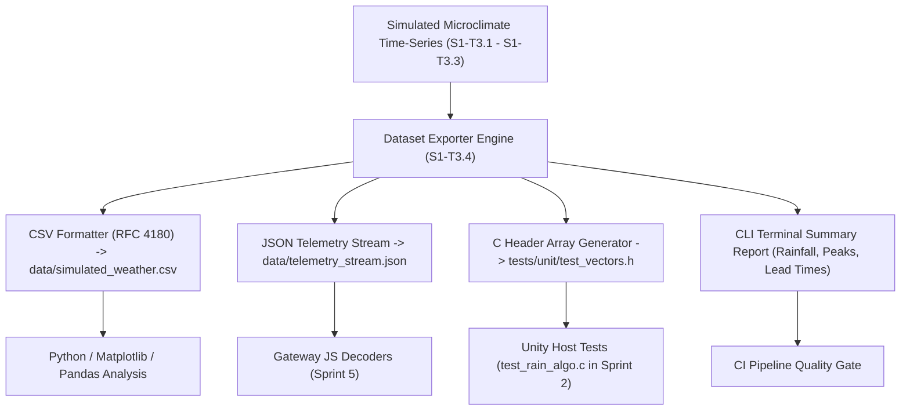

# Task Specification: S1-T3.4 - Dataset Export & Serialization Tooling

## 1. Task Metadata & Overview

| Attribute | Specification Details |
| :--- | :--- |
| **Sprint** | **Sprint 1: Test Harness, Desktop Simulation & Mock Infrastructure** |
| **Task ID** | `S1-T3.4` |
| **Parent Task** | `S1-T3: Develop Python Tea Plantation Microclimate Simulator` |
| **Task Title** | Add Multi-Format Dataset Serialization (CSV, JSON, C Header) & Summary Reporting |
| **Status** | **Ready for Implementation** |
| **Target Files** | [`tools/simulation/simulate_plantation_weather.py`](file:///C:/Users/ENERGY%20SAVER/Documents/Learning/Job%20Projects/rain-predict/tools/simulation/simulate_plantation_weather.py) |
| **Related Documents** | [`docs/algorithms/algorithm-validation-and-tuning.md`](file:///C:/Users/ENERGY%20SAVER/Documents/Learning/Job%20Projects/rain-predict/docs/algorithms/algorithm-validation-and-tuning.md)<br>[`docs/architecture/telemetry-protocol.md`](file:///C:/Users/ENERGY%20SAVER/Documents/Learning/Job%20Projects/rain-predict/docs/architecture/telemetry-protocol.md)<br>[`context/specs/s1-t3.1-weather-simulator-engine.md`](file:///C:/Users/ENERGY%20SAVER/Documents/Learning/Job%20Projects/rain-predict/context/specs/s1-t3.1-weather-simulator-engine.md)<br>[`context/specs/s1-t3.2-diurnal-climate-curves.md`](file:///C:/Users/ENERGY%20SAVER/Documents/Learning/Job%20Projects/rain-predict/context/specs/s1-t3.2-diurnal-climate-curves.md)<br>[`context/specs/s1-t3.3-convective-storm-models.md`](file:///C:/Users/ENERGY%20SAVER/Documents/Learning/Job%20Projects/rain-predict/context/specs/s1-t3.3-convective-storm-models.md) |
| **Dependencies** | `S1-T3.1`, `S1-T3.2`, `S1-T3.3` |
| **Downstream Tasks** | `S2-T5` (Composite nowcasting host tests), `S5-T2` (JavaScript payload decoder tests), `S7-T1` (Multi-day validation) |

---

## 2. Executive Summary & Serialization Architecture

The primary objective of **`S1-T3.4`** is to finalize [`tools/simulation/simulate_plantation_weather.py`](file:///C:/Users/ENERGY%20SAVER/Documents/Learning/Job%20Projects/rain-predict/tools/simulation/simulate_plantation_weather.py) by adding robust multi-format serialization pipelines, ground-truth label tagging, automated dataset integrity checks, and summary metric reporting.

Generated meteorological time-series datasets must serve three distinct project requirements:
1. **CSV Datasets**: Standard tabular data for data science analysis, spreadsheet inspection, and historical estate correlation.
2. **JSON Telemetry Streams**: Structured payloads mirroring LoRaWAN gateway uplinks, used to test JavaScript payload decoders ([`tools/decoders/chirpstack_codec.js`](file:///C:/Users/ENERGY%20SAVER/Documents/Learning/Job%20Projects/rain-predict/tools/decoders/chirpstack_codec.js), [`ttn_decoder.js`](file:///C:/Users/ENERGY%20SAVER/Documents/Learning/Job%20Projects/rain-predict/tools/decoders/ttn_decoder.js)).
3. **C Header Test Vectors (`.h`)**: Compiles simulated weather vectors directly into host C unit tests ([`tests/unit/test_rain_algo.c`](file:///C:/Users/ENERGY%20SAVER/Documents/Learning/Job%20Projects/rain-predict/tests/unit/test_rain_algo.c)) for deterministic regression verification of the Zambretti heuristic and trend detector.



---

## 3. Dataset Schemas & Format Specifications

### 3.1 CSV Dataset Schema (RFC 4180 Compliant)
The CSV file must contain a single header line followed by deterministic comma-separated records:

```csv
timestamp,step_index,elapsed_hours,temp_c,humidity_pct,pressure_hpa,sea_level_pressure_hpa,solar_lux,rain_rate_mmh,rain_gauge_tip_count,accumulated_rain_mm,is_raining,ground_truth_lead_time_min,scenario_tag
2026-09-09T00:00:00Z,0,0.00,16.50,95.00,846.50,1014.20,0.0,0.00,0,0.00,0,0.0,pre_monsoon_convective
2026-09-09T00:15:00Z,1,0.25,16.42,95.30,846.45,1014.15,0.0,0.00,0,0.00,0,0.0,pre_monsoon_convective
...
2026-09-09T13:30:00Z,54,13.50,21.80,88.40,843.10,1009.80,8500.0,0.00,0,0.00,0,30.0,pre_monsoon_convective
2026-09-09T14:00:00Z,56,14.00,19.20,97.50,841.80,1008.20,3200.0,38.50,19,3.80,1,0.0,pre_monsoon_convective
```

### 3.2 JSON Telemetry Stream Schema
Formatted as a JSON array of telemetry records for gateway decoder validation:

```json
[
  {
    "timestamp": "2026-09-09T14:00:00Z",
    "step_index": 56,
    "elapsed_hours": 14.0,
    "temp_c": 19.20,
    "humidity_pct": 97.50,
    "pressure_hpa": 841.80,
    "sea_level_pressure_hpa": 1008.20,
    "solar_lux": 3200.0,
    "rain_rate_mmh": 38.50,
    "rain_gauge_tip_count": 19,
    "accumulated_rain_mm": 3.80,
    "is_raining": 1,
    "ground_truth_lead_time_min": 0.0,
    "scenario_tag": "pre_monsoon_convective"
  }
]
```

### 3.3 C Header Test Vector Generator (`--export-c-header`)
When enabled, generates a C header file formatted with static `const float` arrays and metadata constants:

```c
/**
 * @file    simulated_weather_vectors.h
 * @brief   Auto-generated synthetic weather test vectors for Unity unit tests.
 * @note    Generated by simulate_plantation_weather.py. Do not edit manually.
 */

#ifndef SIMULATED_WEATHER_VECTORS_H
#define SIMULATED_WEATHER_VECTORS_H

#define SIM_TOTAL_SAMPLES           672
#define SIM_INTERVAL_MINUTES        15
#define SIM_STATION_ELEVATION_M     1500.0f

static const float SIM_TEMP_C[SIM_TOTAL_SAMPLES] = {
    16.50f, 16.42f, 16.35f, /* ... */ 18.20f
};

static const float SIM_HUMIDITY_PCT[SIM_TOTAL_SAMPLES] = {
    95.00f, 95.30f, 95.80f, /* ... */ 92.40f
};

static const float SIM_PRESSURE_HPA[SIM_TOTAL_SAMPLES] = {
    846.50f, 846.45f, 846.40f, /* ... */ 844.20f
};

static const float SIM_SOLAR_LUX[SIM_TOTAL_SAMPLES] = {
    0.0f, 0.0f, 0.0f, /* ... */ 45000.0f
};

static const uint8_t SIM_IS_RAINING[SIM_TOTAL_SAMPLES] = {
    0, 0, 0, /* ... */ 1
};

static const float SIM_LEAD_TIME_MIN[SIM_TOTAL_SAMPLES] = {
    0.0f, 0.0f, 0.0f, /* ... */ 45.0f
};

#endif /* SIMULATED_WEATHER_VECTORS_H */
```

---

## 4. Summary Metrics & Integrity Reporting

When executed with `--verbose` or `--summary`, the script computes and displays summary statistics:

```
=============================================================================
 Tea Plantation Synthetic Microclimate Simulation Summary
=============================================================================
 Scenario Profile         : pre_monsoon_convective
 Duration & Step Size     : 7 days (672 records @ 15-min interval)
 Station Elevation        : 1500.0 m ASL
 Random Seed              : 42 (Deterministic)
-----------------------------------------------------------------------------
 Temperature Range        : 15.20 °C (min) to 29.80 °C (max) | Mean: 21.45 °C
 Relative Humidity Range  : 42.50 % (min) to 99.20 % (max) | Mean: 74.30 %
 Station Barometric P     : 839.20 hPa (min) to 848.60 hPa (max) | ΔP_max: 9.40 hPa
 Sea-Level Barometric P0  : 1005.40 hPa (min) to 1016.80 hPa (max)
 Peak Solar Irradiance    : 118,450.0 Lux
 Total Precipitation      : 48.60 mm (243 bucket tips @ 0.2 mm/tip)
 Peak Rain Rate           : 39.80 mm/hr
 Storm Events Simulated   : 3 events
 Max Prediction Lead Time : 150.0 minutes
-----------------------------------------------------------------------------
 Export Files Generated   :
   - CSV  : data/simulated_weather.csv (672 rows, 52.4 KB)
   - JSON : data/simulated_weather.json (672 items, 148.2 KB)
   - C .h : tests/unit/simulated_weather_vectors.h (C99 Array Headers)
=============================================================================
```

---

## 5. Concrete Implementation Blueprint

### 5.1 `DatasetExporter` Reference Implementation

```python
"""
DatasetExporter: Handles CSV, JSON, and C Header generation along with dataset integrity validation.
"""

import csv
import json
from dataclasses import asdict
from pathlib import Path
from typing import Any, Dict, List


class DatasetExporter:
    def __init__(self, states: List[Any], elevation_m: float, interval_min: int):
        self.states = states
        self.elevation_m = elevation_m
        self.interval_min = interval_min

    def export_csv(self, file_path: str) -> None:
        out_file = Path(file_path)
        out_file.parent.mkdir(parents=True, exist_ok=True)
        fieldnames = list(asdict(self.states[0]).keys())

        with open(out_file, mode="w", newline="", encoding="utf-8") as f:
            writer = csv.DictWriter(f, fieldnames=fieldnames)
            writer.writeheader()
            for s in self.states:
                writer.writerow(asdict(s))

    def export_json(self, file_path: str) -> None:
        out_file = Path(file_path)
        out_file.parent.mkdir(parents=True, exist_ok=True)
        data = [asdict(s) for s in self.states]

        with open(out_file, mode="w", encoding="utf-8") as f:
            json.dump(data, f, indent=2)

    def export_c_header(self, file_path: str) -> None:
        out_file = Path(file_path)
        out_file.parent.mkdir(parents=True, exist_ok=True)
        n = len(self.states)

        lines = [
            "/**",
            " * @file    simulated_weather_vectors.h",
            " * @brief   Auto-generated synthetic weather test vectors for host unit tests.",
            " * @note    Generated by simulate_plantation_weather.py. Do not edit manually.",
            " */\n",
            "#ifndef SIMULATED_WEATHER_VECTORS_H",
            "#define SIMULATED_WEATHER_VECTORS_H\n",
            "#include <stdint.h>\n",
            f"#define SIM_TOTAL_SAMPLES           {n}",
            f"#define SIM_INTERVAL_MINUTES        {self.interval_min}",
            f"#define SIM_STATION_ELEVATION_M     {self.elevation_m:.1f}f\n",
        ]

        def format_float_array(name: str, values: List[float]) -> str:
            val_strs = [f"{v:.2f}f" for v in values]
            body = ",\n    ".join([", ".join(val_strs[i : i + 8]) for i in range(0, len(val_strs), 8)])
            return f"static const float {name}[SIM_TOTAL_SAMPLES] = {{\n    {body}\n}};\n"

        def format_uint8_array(name: str, values: List[int]) -> str:
            val_strs = [str(v) for v in values]
            body = ",\n    ".join([", ".join(val_strs[i : i + 16]) for i in range(0, len(val_strs), 16)])
            return f"static const uint8_t {name}[SIM_TOTAL_SAMPLES] = {{\n    {body}\n}};\n"

        lines.append(format_float_array("SIM_TEMP_C", [s.temp_c for s in self.states]))
        lines.append(format_float_array("SIM_HUMIDITY_PCT", [s.humidity_pct for s in self.states]))
        lines.append(format_float_array("SIM_PRESSURE_HPA", [s.pressure_hpa for s in self.states]))
        lines.append(format_float_array("SIM_SEA_LEVEL_P0_HPA", [s.sea_level_pressure_hpa for s in self.states]))
        lines.append(format_float_array("SIM_SOLAR_LUX", [s.solar_lux for s in self.states]))
        lines.append(format_uint8_array("SIM_IS_RAINING", [s.is_raining for s in self.states]))
        lines.append(format_float_array("SIM_LEAD_TIME_MIN", [s.ground_truth_lead_time_min for s in self.states]))

        lines.append("#endif /* SIMULATED_WEATHER_VECTORS_H */\n")

        with open(out_file, mode="w", encoding="utf-8") as f:
            f.write("\n".join(lines))

    def print_summary(self, scenario: str, seed: int) -> None:
        n = len(self.states)
        temps = [s.temp_c for s in self.states]
        rhs = [s.humidity_pct for s in self.states]
        pressures = [s.pressure_hpa for s in self.states]
        luxs = [s.solar_lux for s in self.states]
        max_rain_rate = max(s.rain_rate_mmh for s in self.states)
        total_rain = self.states[-1].accumulated_rain_mm
        total_tips = self.states[-1].rain_gauge_tip_count
        max_lead_time = max(s.ground_truth_lead_time_min for s in self.states)

        print("=============================================================================")
        print(" Tea Plantation Synthetic Microclimate Simulation Summary")
        print("=============================================================================")
        print(f" Scenario Profile         : {scenario}")
        print(f" Total Samples Generated  : {n} records (@ {self.interval_min}-min interval)")
        print(f" Station Elevation        : {self.elevation_m} m ASL")
        print(f" Random Seed              : {seed}")
        print("-----------------------------------------------------------------------------")
        print(f" Temperature Range        : {min(temps):.2f} °C to {max(temps):.2f} °C | Mean: {sum(temps)/n:.2f} °C")
        print(f" Relative Humidity Range  : {min(rhs):.2f} % to {max(rhs):.2f} % | Mean: {sum(rhs)/n:.2f} %")
        print(f" Station Barometric P     : {min(pressures):.2f} hPa to {max(pressures):.2f} hPa")
        print(f" Peak Solar Irradiance    : {max(luxs):.1f} Lux")
        print(f" Total Accumulated Rain   : {total_rain:.2f} mm ({total_tips} tips @ 0.2 mm/tip)")
        print(f" Peak Rain Intensity      : {max_rain_rate:.2f} mm/hr")
        print(f" Max Pre-Storm Lead Time  : {max_lead_time:.1f} minutes")
        print("=============================================================================")
```

---

## 6. Verification & Acceptance Test Plan

To verify the successful completion of **`S1-T3.4`**, the following verification test cases must be validated:

### 6.1 Verification Test Cases

| Test Case ID | Verification Action | Expected Outcome | Pass/Fail Criteria |
| :--- | :--- | :--- | :--- |
| **TC-S1-T3.4-01** | RFC 4180 CSV Validation | Export CSV dataset -> parse using standard Python `csv.reader`. | Exactly 14 header columns matching schema without corrupted rows. |
| **TC-S1-T3.4-02** | JSON Serialization & Decoding | Export JSON stream -> parse with `json.loads()`. | Array length matches sample count; all numeric fields deserialized cleanly. |
| **TC-S1-T3.4-03** | C Header Export Compilation | Generate C header with `--export-c-header tests/unit/simulated_weather_vectors.h` -> `#include` into C file -> compile with `gcc -std=c99 -Werror`. | Compiles cleanly with zero compiler warnings. |
| **TC-S1-T3.4-04** | Ground-Truth Label Consistency | Verifies that whenever `is_raining == 1`, `rain_rate_mmh > 0` and `ground_truth_lead_time_min == 0.0`. | Logical ground-truth consistency confirmed. |
| **TC-S1-T3.4-05** | Tipping Bucket Conservation | Verifies final `accumulated_rain_mm == rain_gauge_tip_count * 0.20`. | Rainfall conservation verified. |
| **TC-S1-T3.4-06** | Summary Report CLI Output | Run script with `--verbose` flag -> inspect stdout. | Formatted ANSI summary table prints with accurate min/max statistics. |

---

## 7. Definition of Done (DoD) Checklist

- [ ] `DatasetExporter` integrated into [`tools/simulation/simulate_plantation_weather.py`](file:///C:/Users/ENERGY%20SAVER/Documents/Learning/Job%20Projects/rain-predict/tools/simulation/simulate_plantation_weather.py).
- [ ] CSV, JSON, and C Header export options supported and tested.
- [ ] Ground-truth binary rain labels (`is_raining`) and lead-time timestamps verified.
- [ ] Formatted CLI summary table output implemented.
- [ ] All clickable links and file references resolve properly.
- [ ] Spec document registered and linked under [`context/specs/spec-roadmap.md`](file:///C:/Users/ENERGY%20SAVER/Documents/Learning/Job%20Projects/rain-predict/context/specs/spec-roadmap.md#L117).
