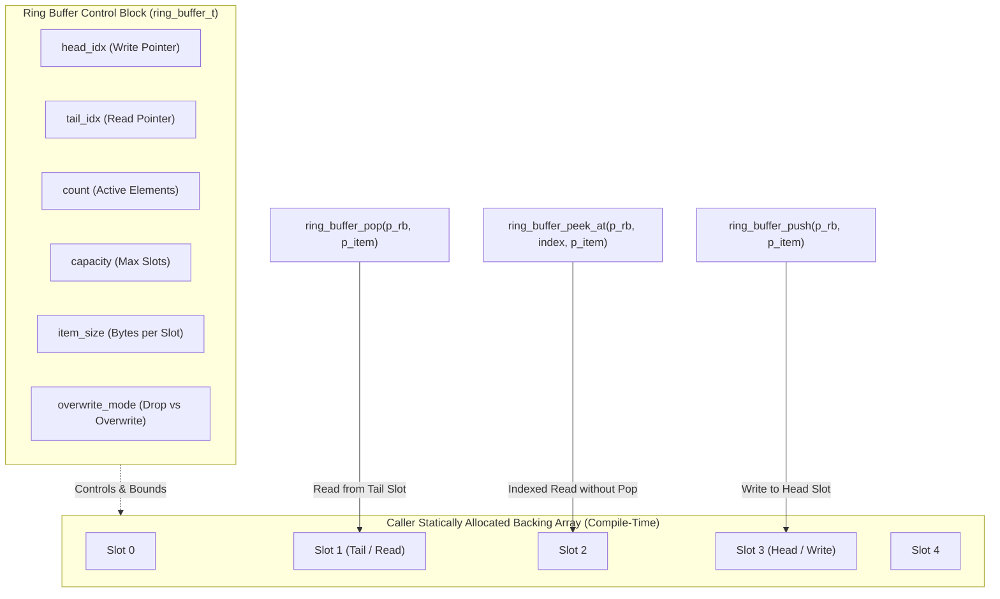

# Task Specification: S2-T1.1 - Generic Static Circular Ring Buffer

## 1. Task Metadata & Overview

| Attribute | Specification Details |
| :--- | :--- |
| **Sprint** | **Sprint 2: Meteorological Algorithms & Nowcasting Engine** |
| **Task ID** | `S2-T1.1` |
| **Parent Task** | `S2-T1: Implement Core Static Data Structures & Moving-Average Filters` |
| **Task Title** | Implement Generic Static Circular Ring Buffer (`ring_buffer.h` / `ring_buffer.c`) |
| **Status** | **Ready for Implementation** |
| **Target Files** | [`firmware/middleware/inc/ring_buffer.h`](file:///C:/Users/ENERGY%20SAVER/Documents/Learning/Job%20Projects/rain-predict/firmware/middleware/inc/ring_buffer.h)<br>[`firmware/middleware/src/ring_buffer.c`](file:///C:/Users/ENERGY%20SAVER/Documents/Learning/Job%20Projects/rain-predict/firmware/middleware/src/ring_buffer.c) |
| **Related Documents** | [`docs/architecture/firmware-architecture.md`](file:///C:/Users/ENERGY%20SAVER/Documents/Learning/Job%20Projects/rain-predict/docs/architecture/firmware-architecture.md)<br>[`docs/architecture/telemetry-protocol.md`](file:///C:/Users/ENERGY%20SAVER/Documents/Learning/Job%20Projects/rain-predict/docs/architecture/telemetry-protocol.md)<br>[`context/coding-standards.md`](file:///C:/Users/ENERGY%20SAVER/Documents/Learning/Job%20Projects/rain-predict/context/coding-standards.md)<br>[`context/project-structure.md`](file:///C:/Users/ENERGY%20SAVER/Documents/Learning/Job%20Projects/rain-predict/context/project-structure.md) |
| **Dependencies** | `S1-T1.1` (Root CMake Build System) |
| **Downstream Tasks** | `S2-T1.2` (Moving average filter), `S2-T1.3` (Ring buffer unit tests), `S2-T4` (Trend detector), `S5-T3` (Flash storage ring buffer) |

---

## 2. Executive Summary & Architectural Scope

The primary objective of **`S2-T1.1`** is to develop a robust, generic, static circular FIFO ring buffer in Layer 3 Middleware ([`firmware/middleware/inc/ring_buffer.h`](file:///C:/Users/ENERGY%20SAVER/Documents/Learning/Job%20Projects/rain-predict/firmware/middleware/inc/ring_buffer.h) / [`ring_buffer.c`](file:///C:/Users/ENERGY%20SAVER/Documents/Learning/Job%20Projects/rain-predict/firmware/middleware/src/ring_buffer.c)).

In low-power embedded IoT firmware, circular buffers serve as the foundational data structures for:
1. **Environmental History Windows**: Holding rolling 3-hour and 24-hour meteorological sample histories (temperature, humidity, barometric pressure, solar lux) for moving gradient calculations.
2. **UART & Bus Receive FIFOs**: Buffering raw Modbus RTU / SDI-12 byte streams between DMA transfers and protocol parsing.
3. **Telemetry Packet Queues**: Holding offline LoRaWAN uplink packets during radio duty-cycle backoff or RF retries.

### Core Architectural Principles:
- **Zero Dynamic Memory Allocation**: No `malloc()`, `calloc()`, or `free()`. The underlying memory array is statically allocated by the caller at compile time and passed to `ring_buffer_init()`.
- **Generic Element Storage**: Supports elements of any fixed byte size (`item_size`), from single bytes (`uint8_t`) up to complex multi-byte structures (`sensor_record_t`, `lora_packet_t`).
- **Flexible Overwrite Governance**: Configurable behavior when pushing to a full buffer: either reject with `STATUS_ERR_BUSY` (`RING_BUFFER_DROP_NEW`) or evict the oldest element (`RING_BUFFER_OVERWRITE_OLD`).
- **Direct Index Inspection (Peeking)**: Provides `ring_buffer_peek_at(index)` to allow filter algorithms to traverse historical samples without popping or mutating FIFO pointers.



---

## 3. Technical Requirements & Memory Safety Governance

In accordance with [`context/coding-standards.md`](file:///C:/Users/ENERGY%20SAVER/Documents/Learning/Job%20Projects/rain-predict/context/coding-standards.md):

### 3.1 Memory Safety Rules
1. **Pointer Defensive Checking**: All public API functions must verify that pointers (`p_rb`, `p_buffer`, `p_item`) are non-NULL before dereferencing, returning `STATUS_ERR_NULL_PTR`.
2. **Buffer Boundary Enforcement**: Pushes, pops, and peeks calculate physical byte offsets using `index * item_size`, strictly bounded by `capacity * item_size`.
3. **Integer Overflow Protection**: Read and write pointers wrap deterministically using modulo arithmetic (`idx = (idx + 1) % capacity`).

### 3.2 Overwrite Policy Modes
```c
typedef enum {
    RING_BUFFER_DROP_NEW = 0,       /* Rejects new element when full (returns STATUS_ERR_BUSY) */
    RING_BUFFER_OVERWRITE_OLD = 1   /* Discards oldest element and advances tail when full */
} ring_buffer_mode_t;
```

---

## 4. Public API Specification (`ring_buffer.h`)

| Function Prototype | Description |
| :--- | :--- |
| `status_t ring_buffer_init(ring_buffer_t *p_rb, void *p_buffer, uint16_t capacity, uint16_t item_size, ring_buffer_mode_t mode)` | Initializes control block with caller-supplied static backing array. |
| `status_t ring_buffer_push(ring_buffer_t *p_rb, const void *p_item)` | Pushes a new item onto the head of the buffer. |
| `status_t ring_buffer_pop(ring_buffer_t *p_rb, void *p_item)` | Removes and copies the oldest item from the tail of the buffer. |
| `status_t ring_buffer_peek(const ring_buffer_t *p_rb, void *p_item)` | Copies the oldest item without removing it. |
| `status_t ring_buffer_peek_at(const ring_buffer_t *p_rb, uint16_t index, void *p_item)` | Reads the item at logical offset `index` ($0 = \text{oldest}, \text{count}-1 = \text{newest}$). |
| `bool ring_buffer_is_empty(const ring_buffer_t *p_rb)` | Returns `true` if `count == 0`. |
| `bool ring_buffer_is_full(const ring_buffer_t *p_rb)` | Returns `true` if `count == capacity`. |
| `uint16_t ring_buffer_get_count(const ring_buffer_t *p_rb)` | Returns the number of active items currently stored. |
| `uint16_t ring_buffer_get_capacity(const ring_buffer_t *p_rb)` | Returns total item capacity. |
| `void ring_buffer_clear(ring_buffer_t *p_rb)` | Flushes all items, resetting head, tail, and count to 0. |

---

## 5. Concrete File Implementation Blueprint

### 5.1 `firmware/middleware/inc/ring_buffer.h` Reference Blueprint

```c
/**
 * @file    ring_buffer.h
 * @brief   Generic static circular FIFO ring buffer.
 * @details Zero dynamic memory allocation; supports arbitrary fixed-size items.
 */

#ifndef RING_BUFFER_H
#define RING_BUFFER_H

#ifdef __cplusplus
extern "C" {
#endif

#include <stdint.h>
#include <stdbool.h>
#include <stddef.h>

/**
 * @brief Standard status codes (matching coding-standards.md).
 */
typedef enum {
    STATUS_OK = 0,
    STATUS_ERR_BUSY,
    STATUS_ERR_TIMEOUT,
    STATUS_ERR_INVALID_PARAM,
    STATUS_ERR_NULL_PTR
} status_t;

/**
 * @brief Full-buffer insertion policy.
 */
typedef enum {
    RING_BUFFER_DROP_NEW = 0,       /**< Reject push when buffer is full */
    RING_BUFFER_OVERWRITE_OLD = 1   /**< Evict oldest item when buffer is full */
} ring_buffer_mode_t;

/**
 * @brief Ring buffer control structure.
 */
typedef struct {
    uint8_t            *p_storage;       /**< Pointer to caller-allocated static byte array */
    uint16_t            capacity;        /**< Maximum number of items */
    uint16_t            item_size;       /**< Size of each item in bytes */
    uint16_t            head;            /**< Write index */
    uint16_t            tail;            /**< Read index */
    uint16_t            count;           /**< Current number of stored items */
    ring_buffer_mode_t  mode;            /**< Overwrite mode */
} ring_buffer_t;

/**
 * @brief  Initializes a circular ring buffer with static storage.
 * @param[out] p_rb      Pointer to ring buffer control block.
 * @param[in]  p_buffer  Pointer to pre-allocated static byte array.
 * @param[in]  capacity  Maximum number of items buffer can hold.
 * @param[in]  item_size Size in bytes of each item.
 * @param[in]  mode      Full buffer policy (DROP_NEW or OVERWRITE_OLD).
 * @return status_t      STATUS_OK on success, error code otherwise.
 */
status_t ring_buffer_init(ring_buffer_t *p_rb, void *p_buffer, uint16_t capacity, uint16_t item_size, ring_buffer_mode_t mode);

/**
 * @brief  Pushes an item into the ring buffer.
 * @param[in,out] p_rb   Pointer to ring buffer control block.
 * @param[in]     p_item Pointer to item data to copy into buffer.
 * @return status_t      STATUS_OK on success, STATUS_ERR_BUSY if full and DROP_NEW mode.
 */
status_t ring_buffer_push(ring_buffer_t *p_rb, const void *p_item);

/**
 * @brief  Pops the oldest item from the ring buffer.
 * @param[in,out] p_rb   Pointer to ring buffer control block.
 * @param[out]    p_item Pointer to memory buffer where popped item will be copied.
 * @return status_t      STATUS_OK on success, STATUS_ERR_BUSY if buffer is empty.
 */
status_t ring_buffer_pop(ring_buffer_t *p_rb, void *p_item);

/**
 * @brief  Peeks at the oldest item without removing it.
 * @param[in]  p_rb      Pointer to ring buffer control block.
 * @param[out] p_item    Pointer to buffer where peeked item will be copied.
 * @return status_t      STATUS_OK on success, STATUS_ERR_BUSY if buffer is empty.
 */
status_t ring_buffer_peek(const ring_buffer_t *p_rb, void *p_item);

/**
 * @brief  Peeks at an item at a logical offset from oldest (0 = oldest, count-1 = newest).
 * @param[in]  p_rb      Pointer to ring buffer control block.
 * @param[in]  index     Logical index (0 to count - 1).
 * @param[out] p_item    Pointer to buffer where peeked item will be copied.
 * @return status_t      STATUS_OK on success, STATUS_ERR_INVALID_PARAM if index >= count.
 */
status_t ring_buffer_peek_at(const ring_buffer_t *p_rb, uint16_t index, void *p_item);

/**
 * @brief  Checks if ring buffer is empty.
 */
bool ring_buffer_is_empty(const ring_buffer_t *p_rb);

/**
 * @brief  Checks if ring buffer is full.
 */
bool ring_buffer_is_full(const ring_buffer_t *p_rb);

/**
 * @brief  Returns number of elements currently stored.
 */
uint16_t ring_buffer_get_count(const ring_buffer_t *p_rb);

/**
 * @brief  Returns maximum item capacity.
 */
uint16_t ring_buffer_get_capacity(const ring_buffer_t *p_rb);

/**
 * @brief  Flushes all items from the ring buffer.
 */
void ring_buffer_clear(ring_buffer_t *p_rb);

#ifdef __cplusplus
}
#endif

#endif /* RING_BUFFER_H */
```

### 5.2 `firmware/middleware/src/ring_buffer.c` Reference Blueprint

```c
/**
 * @file    ring_buffer.c
 * @brief   Generic static circular FIFO ring buffer implementation.
 */

#include "ring_buffer.h"
#include <string.h>

status_t ring_buffer_init(ring_buffer_t *p_rb, void *p_buffer, uint16_t capacity, uint16_t item_size, ring_buffer_mode_t mode) {
    if (p_rb == NULL || p_buffer == NULL) {
        return STATUS_ERR_NULL_PTR;
    }
    if (capacity == 0 || item_size == 0) {
        return STATUS_ERR_INVALID_PARAM;
    }

    p_rb->p_storage = (uint8_t *)p_buffer;
    p_rb->capacity  = capacity;
    p_rb->item_size = item_size;
    p_rb->head      = 0;
    p_rb->tail      = 0;
    p_rb->count     = 0;
    p_rb->mode      = mode;

    return STATUS_OK;
}

status_t ring_buffer_push(ring_buffer_t *p_rb, const void *p_item) {
    if (p_rb == NULL || p_item == NULL) {
        return STATUS_ERR_NULL_PTR;
    }

    if (p_rb->count >= p_rb->capacity) {
        if (p_rb->mode == RING_BUFFER_DROP_NEW) {
            return STATUS_ERR_BUSY;
        }
        /* Overwrite oldest element: advance tail pointer */
        p_rb->tail = (p_rb->tail + 1) % p_rb->capacity;
    } else {
        p_rb->count++;
    }

    /* Copy item data to head slot */
    uint8_t *p_dest = &p_rb->p_storage[p_rb->head * p_rb->item_size];
    memcpy(p_dest, p_item, p_rb->item_size);

    /* Advance head pointer */
    p_rb->head = (p_rb->head + 1) % p_rb->capacity;

    return STATUS_OK;
}

status_t ring_buffer_pop(ring_buffer_t *p_rb, void *p_item) {
    if (p_rb == NULL || p_item == NULL) {
        return STATUS_ERR_NULL_PTR;
    }
    if (p_rb->count == 0) {
        return STATUS_ERR_BUSY;
    }

    /* Copy item data from tail slot */
    const uint8_t *p_src = &p_rb->p_storage[p_rb->tail * p_rb->item_size];
    memcpy(p_item, p_src, p_rb->item_size);

    /* Advance tail pointer and decrement count */
    p_rb->tail = (p_rb->tail + 1) % p_rb->capacity;
    p_rb->count--;

    return STATUS_OK;
}

status_t ring_buffer_peek(const ring_buffer_t *p_rb, void *p_item) {
    return ring_buffer_peek_at(p_rb, 0, p_item);
}

status_t ring_buffer_peek_at(const ring_buffer_t *p_rb, uint16_t index, void *p_item) {
    if (p_rb == NULL || p_item == NULL) {
        return STATUS_ERR_NULL_PTR;
    }
    if (index >= p_rb->count) {
        return STATUS_ERR_INVALID_PARAM;
    }

    /* Calculate physical slot index from logical offset */
    uint16_t physical_slot = (p_rb->tail + index) % p_rb->capacity;
    const uint8_t *p_src = &p_rb->p_storage[physical_slot * p_rb->item_size];
    memcpy(p_item, p_src, p_rb->item_size);

    return STATUS_OK;
}

bool ring_buffer_is_empty(const ring_buffer_t *p_rb) {
    return (p_rb != NULL) ? (p_rb->count == 0) : true;
}

bool ring_buffer_is_full(const ring_buffer_t *p_rb) {
    return (p_rb != NULL) ? (p_rb->count >= p_rb->capacity) : false;
}

uint16_t ring_buffer_get_count(const ring_buffer_t *p_rb) {
    return (p_rb != NULL) ? p_rb->count : 0;
}

uint16_t ring_buffer_get_capacity(const ring_buffer_t *p_rb) {
    return (p_rb != NULL) ? p_rb->capacity : 0;
}

void ring_buffer_clear(ring_buffer_t *p_rb) {
    if (p_rb != NULL) {
        p_rb->head  = 0;
        p_rb->tail  = 0;
        p_rb->count = 0;
    }
}
```

---

## 6. Verification & Acceptance Test Plan

To verify the successful completion of **`S2-T1.1`**, test suite `tests/unit/test_ring_buffer.c` (defined in `S2-T1.3`) will execute the following validation vectors:

### 6.1 Verification Test Cases

| Test Case ID | Verification Action | Expected Outcome | Pass/Fail Criteria |
| :--- | :--- | :--- | :--- |
| **TC-S2-T1.1-01** | FIFO Sequential Order | Push 5 unique integers -> pop 5 integers. | Popped elements match push sequence exactly. |
| **TC-S2-T1.1-02** | Full Buffer `DROP_NEW` Mode | Initialize with capacity 4 -> push 4 items -> push 5th item. | 5th push returns `STATUS_ERR_BUSY`; buffer contents unchanged. |
| **TC-S2-T1.1-03** | Full Buffer `OVERWRITE_OLD` Mode | Initialize with capacity 3 (`[A, B, C]`) -> push `D`. | Push returns `STATUS_OK`; buffer now contains `[B, C, D]`. |
| **TC-S2-T1.1-04** | Wrap-Around Boundary Test | Push 10 items, pop 5, push 5 into capacity-8 buffer to force head/tail wrap. | Pointers wrap seamlessly without memory corruption. |
| **TC-S2-T1.1-05** | Structured Data Sizing | Initialize with multi-byte struct (`sizeof(sensor_record_t) = 16`). | Stores and retrieves multi-field structures with exact alignment. |
| **TC-S2-T1.1-06** | Indexed Peek Traversal | Populate buffer with `[10, 20, 30]` -> call `peek_at(0)`, `peek_at(1)`, `peek_at(2)`. | Returns 10, 20, 30; count remains 3. |

---

## 7. Definition of Done (DoD) Checklist

- [ ] [`firmware/middleware/inc/ring_buffer.h`](file:///C:/Users/ENERGY%20SAVER/Documents/Learning/Job%20Projects/rain-predict/firmware/middleware/inc/ring_buffer.h) and [`ring_buffer.c`](file:///C:/Users/ENERGY%20SAVER/Documents/Learning/Job%20Projects/rain-predict/firmware/middleware/src/ring_buffer.c) created adhering to C99 standards.
- [ ] Generic item size support with caller-provided static memory allocation.
- [ ] Both `DROP_NEW` and `OVERWRITE_OLD` full-buffer modes implemented.
- [ ] Indexed peeking (`ring_buffer_peek_at`) implemented for filtering algorithms.
- [ ] Zero dynamic memory allocation (`malloc`/`free` prohibited).
- [ ] All clickable links and file references resolve properly.
- [ ] Spec document registered and linked under [`context/specs/spec-roadmap.md`](file:///C:/Users/ENERGY%20SAVER/Documents/Learning/Job%20Projects/rain-predict/context/specs/spec-roadmap.md#L136).
