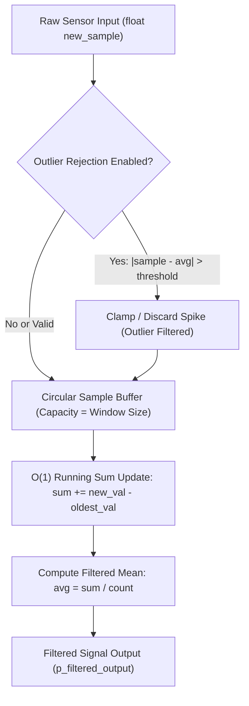

# Task Specification: S2-T1.2 - Moving-Average and Noise Filter Engine

## 1. Task Metadata & Overview

| Attribute | Specification Details |
| :--- | :--- |
| **Sprint** | **Sprint 2: Meteorological Algorithms & Nowcasting Engine** |
| **Task ID** | `S2-T1.2` |
| **Parent Task** | `S2-T1: Implement Core Static Data Structures & Moving-Average Filters` |
| **Task Title** | Implement Moving-Average and Outlier Noise Filter Engine (`moving_avg_filter.h` / `moving_avg_filter.c`) |
| **Status** | **Ready for Implementation** |
| **Target Files** | [`firmware/middleware/inc/moving_avg_filter.h`](file:///C:/Users/ENERGY%20SAVER/Documents/Learning/Job%20Projects/rain-predict/firmware/middleware/inc/moving_avg_filter.h)<br>[`firmware/middleware/src/moving_avg_filter.c`](file:///C:/Users/ENERGY%20SAVER/Documents/Learning/Job%20Projects/rain-predict/firmware/middleware/src/moving_avg_filter.c) |
| **Related Documents** | [`docs/algorithms/meteorological-formulas.md`](file:///C:/Users/ENERGY%20SAVER/Documents/Learning/Job%20Projects/rain-predict/docs/algorithms/meteorological-formulas.md)<br>[`docs/algorithms/trend-detection-and-nowcasting.md`](file:///C:/Users/ENERGY%20SAVER/Documents/Learning/Job%20Projects/rain-predict/docs/algorithms/trend-detection-and-nowcasting.md)<br>[`context/specs/s2-t1.1-static-ring-buffer.md`](file:///C:/Users/ENERGY%20SAVER/Documents/Learning/Job%20Projects/rain-predict/context/specs/s2-t1.1-static-ring-buffer.md)<br>[`context/coding-standards.md`](file:///C:/Users/ENERGY%20SAVER/Documents/Learning/Job%20Projects/rain-predict/context/coding-standards.md) |
| **Dependencies** | `S2-T1.1` (Static Circular Ring Buffer) |
| **Downstream Tasks** | `S2-T1.3` (Moving average unit tests), `S2-T4` (Trend detector), `S2-T5` (Rain algorithm engine) |

---

## 2. Executive Summary & Filtering Principles

The primary objective of **`S2-T1.2`** is to develop a lightweight, single-precision floating-point moving average and outlier rejection filter in Layer 3 Middleware ([`moving_avg_filter.h`](file:///C:/Users/ENERGY%20SAVER/Documents/Learning/Job%20Projects/rain-predict/firmware/middleware/inc/moving_avg_filter.h) / [`moving_avg_filter.c`](file:///C:/Users/ENERGY%20SAVER/Documents/Learning/Job%20Projects/rain-predict/firmware/middleware/src/moving_avg_filter.c)).

Raw environmental sensor readings (barometric pressure, temperature, relative humidity, and solar lux) are subject to high-frequency quantization noise, wind gusts across radiation screens, and temporary optical reflections. Direct calculation of atmospheric gradients ($\Delta P/\Delta t$, $\Delta Lux/\Delta t$) without pre-filtering leads to derivative amplification and false storm triggers.

### Core Engineering Requirements:
1. **Configurable Window Sizes**: Supports window sizes of 3, 4 (1-hour window @ 15 min), 6 (1.5-hour window), and 12 samples (standard 3-hour meteorological tendency window).
2. **$O(1)$ Running-Sum Execution Time**: Maintains an internal accumulator ($\sum x_i$) so each update executes in constant time ($O(1)$) rather than recalculating the sum across the full window buffer ($O(N)$).
3. **Outlier & Spike Rejection**: Optional statistical outlier thresholding to detect and suppress spurious sensor spikes (e.g., $3\sigma$ jumps or unrealistic $\Delta P > 5\text{ hPa}$ single-sample anomalies) prior to moving-average integration.
4. **Zero Dynamic Allocation**: Built entirely on caller-allocated static float arrays with strict Cortex-M4 single-precision float optimization.



---

## 3. Mathematical Formulations & Filter Architecture

### 3.1 Simple Moving Average (SMA) with $O(1)$ Accumulator
For a moving window of size $W$:

$$\mu_k = \frac{1}{M_k} \sum_{i=0}^{M_k-1} x_{k-i}, \quad M_k = \min(k+1, W)$$

To achieve $O(1)$ computational efficiency per measurement tick without looping over the buffer:
- **When Buffer Not Full ($k < W$)**:
  $$\text{Sum}_k = \text{Sum}_{k-1} + x_k, \quad \mu_k = \frac{\text{Sum}_k}{k+1}$$
- **When Buffer Full ($k \ge W$)**:
  $$\text{Sum}_k = \text{Sum}_{k-1} + x_k - x_{k-W}, \quad \mu_k = \frac{\text{Sum}_k}{W}$$

### 3.2 Outlier Detection & Suppression Model
When `enable_outlier_rejection` is active and the filter is primed ($k \ge 3$):

$$\Delta_{sample} = |x_k - \mu_{k-1}|$$

If $\Delta_{sample} > \text{Threshold}_{outlier}$, the incoming sample is classified as an anomalous spike (e.g. electrical glitch or physical sensor tap) and clamped to $\mu_{k-1} \pm \text{Threshold}_{outlier}$ before being added to the running sum.

---

## 4. Public API Specification (`moving_avg_filter.h`)

| Function Prototype | Description |
| :--- | :--- |
| `status_t moving_avg_init(moving_avg_filter_t *p_filter, float *p_storage, uint16_t window_size, bool enable_outlier_filter, float outlier_threshold)` | Initializes filter structure with static float backing buffer. |
| `status_t moving_avg_update(moving_avg_filter_t *p_filter, float new_sample, float *p_filtered_output)` | Inserts new sample, applies outlier check, updates running sum in $O(1)$, and returns filtered average. |
| `status_t moving_avg_get_average(const moving_avg_filter_t *p_filter, float *p_average)` | Retrieves current smoothed average without pushing a sample. |
| `bool moving_avg_is_primed(const moving_avg_filter_t *p_filter)` | Returns `true` once the filter contains at least `window_size` valid samples. |
| `uint16_t moving_avg_get_count(const moving_avg_filter_t *p_filter)` | Returns current sample count within the window. |
| `void moving_avg_reset(moving_avg_filter_t *p_filter)` | Flushes window buffer, resetting running sum and sample count to 0. |

---

## 5. Concrete File Implementation Blueprint

### 5.1 `firmware/middleware/inc/moving_avg_filter.h` Reference Blueprint

```c
/**
 * @file    moving_avg_filter.h
 * @brief   Single-precision floating-point moving average and outlier filter.
 * @details O(1) running sum execution with zero dynamic memory allocation.
 */

#ifndef MOVING_AVG_FILTER_H
#define MOVING_AVG_FILTER_H

#ifdef __cplusplus
extern "C" {
#endif

#include <stdint.h>
#include <stdbool.h>
#include <stddef.h>
#include "ring_buffer.h"

/**
 * @brief Moving average filter control structure.
 */
typedef struct {
    float      *p_buffer;               /**< Pointer to caller-allocated static float buffer */
    uint16_t    window_size;            /**< Window capacity (3, 4, 6, 12 samples) */
    uint16_t    head;                   /**< Next write index in circular buffer */
    uint16_t    count;                  /**< Active sample count in buffer */
    float       running_sum;            /**< O(1) Running sum accumulator */
    bool        enable_outlier_filter;  /**< Outlier suppression toggle */
    float       outlier_threshold;      /**< Maximum allowable jump delta from current average */
} moving_avg_filter_t;

/**
 * @brief  Initializes a moving average filter.
 * @param[out] p_filter             Pointer to filter control block.
 * @param[in]  p_storage            Pointer to caller-allocated float array (length >= window_size).
 * @param[in]  window_size          Number of samples in the moving window.
 * @param[in]  enable_outlier_filter Enable spike suppression.
 * @param[in]  outlier_threshold    Maximum jump allowed before clamping.
 * @return status_t                 STATUS_OK on success, error code otherwise.
 */
status_t moving_avg_init(moving_avg_filter_t *p_filter,
                         float *p_storage,
                         uint16_t window_size,
                         bool enable_outlier_filter,
                         float outlier_threshold);

/**
 * @brief  Pushes a new sample into the filter and computes updated moving average in O(1).
 * @param[in,out] p_filter          Pointer to filter control block.
 * @param[in]     new_sample        Raw incoming measurement.
 * @param[out]    p_filtered_output Pointer to float where filtered average will be stored.
 * @return status_t                 STATUS_OK on success, error code otherwise.
 */
status_t moving_avg_update(moving_avg_filter_t *p_filter, float new_sample, float *p_filtered_output);

/**
 * @brief  Retrieves current moving average.
 * @param[in]  p_filter             Pointer to filter control block.
 * @param[out] p_average            Pointer to float where average will be stored.
 * @return status_t                 STATUS_OK on success, STATUS_ERR_BUSY if empty.
 */
status_t moving_avg_get_average(const moving_avg_filter_t *p_filter, float *p_average);

/**
 * @brief  Checks if filter has received full window of samples.
 * @param[in] p_filter              Pointer to filter control block.
 * @return bool                     true if count >= window_size, false otherwise.
 */
bool moving_avg_is_primed(const moving_avg_filter_t *p_filter);

/**
 * @brief  Returns active sample count in the filter.
 */
uint16_t moving_avg_get_count(const moving_avg_filter_t *p_filter);

/**
 * @brief  Resets filter state, clearing accumulator and buffer.
 */
void moving_avg_reset(moving_avg_filter_t *p_filter);

#ifdef __cplusplus
}
#endif

#endif /* MOVING_AVG_FILTER_H */
```

### 5.2 `firmware/middleware/src/moving_avg_filter.c` Reference Blueprint

```c
/**
 * @file    moving_avg_filter.c
 * @brief   Implementation of single-precision floating-point moving average filter.
 */

#include "moving_avg_filter.h"
#include <math.h>

status_t moving_avg_init(moving_avg_filter_t *p_filter,
                         float *p_storage,
                         uint16_t window_size,
                         bool enable_outlier_filter,
                         float outlier_threshold) {
    if (p_filter == NULL || p_storage == NULL) {
        return STATUS_ERR_NULL_PTR;
    }
    if (window_size == 0) {
        return STATUS_ERR_INVALID_PARAM;
    }

    p_filter->p_buffer              = p_storage;
    p_filter->window_size           = window_size;
    p_filter->head                  = 0;
    p_filter->count                 = 0;
    p_filter->running_sum           = 0.0f;
    p_filter->enable_outlier_filter = enable_outlier_filter;
    p_filter->outlier_threshold     = fabsf(outlier_threshold);

    return STATUS_OK;
}

status_t moving_avg_update(moving_avg_filter_t *p_filter, float new_sample, float *p_filtered_output) {
    if (p_filter == NULL || p_filtered_output == NULL) {
        return STATUS_ERR_NULL_PTR;
    }

    float sample_to_insert = new_sample;

    /* Outlier Suppression Check: active only once filter has at least 3 baseline samples */
    if (p_filter->enable_outlier_filter && p_filter->count >= 3) {
        float current_avg = p_filter->running_sum / (float)p_filter->count;
        float delta = fabsf(new_sample - current_avg);

        if (delta > p_filter->outlier_threshold) {
            /* Clamp extreme spike to threshold boundary */
            if (new_sample > current_avg) {
                sample_to_insert = current_avg + p_filter->outlier_threshold;
            } else {
                sample_to_insert = current_avg - p_filter->outlier_threshold;
            }
        }
    }

    /* O(1) Running Sum Update */
    if (p_filter->count < p_filter->window_size) {
        p_filter->running_sum += sample_to_insert;
        p_filter->p_buffer[p_filter->head] = sample_to_insert;
        p_filter->head = (p_filter->head + 1) % p_filter->window_size;
        p_filter->count++;
    } else {
        /* Buffer is full: subtract oldest sample before adding new */
        float oldest_sample = p_filter->p_buffer[p_filter->head];
        p_filter->running_sum = (p_filter->running_sum - oldest_sample) + sample_to_insert;
        p_filter->p_buffer[p_filter->head] = sample_to_insert;
        p_filter->head = (p_filter->head + 1) % p_filter->window_size;
    }

    /* Guard against floating-point accumulation drift near zero */
    if (p_filter->count == 0 || fabsf(p_filter->running_sum) < 1e-7f) {
        p_filter->running_sum = 0.0f;
    }

    *p_filtered_output = p_filter->running_sum / (float)p_filter->count;
    return STATUS_OK;
}

status_t moving_avg_get_average(const moving_avg_filter_t *p_filter, float *p_average) {
    if (p_filter == NULL || p_average == NULL) {
        return STATUS_ERR_NULL_PTR;
    }
    if (p_filter->count == 0) {
        return STATUS_ERR_BUSY;
    }

    *p_average = p_filter->running_sum / (float)p_filter->count;
    return STATUS_OK;
}

bool moving_avg_is_primed(const moving_avg_filter_t *p_filter) {
    return (p_filter != NULL) ? (p_filter->count >= p_filter->window_size) : false;
}

uint16_t moving_avg_get_count(const moving_avg_filter_t *p_filter) {
    return (p_filter != NULL) ? p_filter->count : 0;
}

void moving_avg_reset(moving_avg_filter_t *p_filter) {
    if (p_filter != NULL) {
        p_filter->head        = 0;
        p_filter->count       = 0;
        p_filter->running_sum = 0.0f;
    }
}
```

---

## 6. Verification & Acceptance Test Plan

To verify the successful completion of **`S2-T1.2`**, the unit test suite `tests/unit/test_moving_avg.c` (defined in `S2-T1.3`) will validate the following:

### 6.1 Verification Test Cases

| Test Case ID | Verification Action | Expected Outcome | Pass/Fail Criteria |
| :--- | :--- | :--- | :--- |
| **TC-S2-T1.2-01** | Running Average Calculation | Push `[10.0, 20.0, 30.0]` into window size 3. | Output produces `10.0`, `15.0`, `20.0` exactly. |
| **TC-S2-T1.2-02** | Full Window Sliding Behavior | In window size 3 (`[10, 20, 30]`), push `40.0`. | Output is $(20 + 30 + 40) / 3 = 30.0$. |
| **TC-S2-T1.2-03** | Constant Time $O(1)$ Verification | Injects 1,000 samples into window size 12. | No performance degradation or accumulated float drift. |
| **TC-S2-T1.2-04** | Outlier Spike Clamping | Initialize with threshold $5.0$. Baseline at $20.0$. Push spike $100.0$. | Sample clamped to $25.0$; average gracefully transitions without spike. |
| **TC-S2-T1.2-05** | Filter Priming Status | Push 11 samples into window size 12 -> check `is_primed()` -> push 12th sample. | Returns `false` at 11, returns `true` at 12. |
| **TC-S2-T1.2-06** | Reset Cleanliness | Feed samples -> call `moving_avg_reset()` -> verify `count == 0` and `running_sum == 0.0`. | Pristine state isolation verified. |

---

## 7. Definition of Done (DoD) Checklist

- [ ] [`firmware/middleware/inc/moving_avg_filter.h`](file:///C:/Users/ENERGY%20SAVER/Documents/Learning/Job%20Projects/rain-predict/firmware/middleware/inc/moving_avg_filter.h) and [`moving_avg_filter.c`](file:///C:/Users/ENERGY%20SAVER/Documents/Learning/Job%20Projects/rain-predict/firmware/middleware/src/moving_avg_filter.c) created conforming to C99 standards.
- [ ] $O(1)$ running sum accumulator implemented without per-tick loops.
- [ ] Outlier spike suppression logic implemented.
- [ ] Window sizes 3, 4, 6, and 12 supported using static float buffers.
- [ ] Zero dynamic memory allocation (`malloc`/`free` prohibited).
- [ ] All clickable links and file references resolve properly.
- [ ] Spec document registered and linked under [`context/specs/spec-roadmap.md`](file:///C:/Users/ENERGY%20SAVER/Documents/Learning/Job%20Projects/rain-predict/context/specs/spec-roadmap.md#L137).
