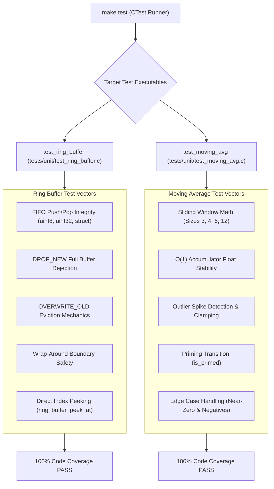

# Task Specification: S2-T1.3 - Ring Buffer & Moving-Average Filter Unit Test Suites

## 1. Task Metadata & Overview

| Attribute | Specification Details |
| :--- | :--- |
| **Sprint** | **Sprint 2: Meteorological Algorithms & Nowcasting Engine** |
| **Task ID** | `S2-T1.3` |
| **Parent Task** | `S2-T1: Implement Core Static Data Structures & Moving-Average Filters` |
| **Task Title** | Create Unit Test Suites for Static Ring Buffer & Moving-Average Filter |
| **Status** | **Ready for Implementation** |
| **Target Files** | [`tests/unit/test_ring_buffer.c`](file:///C:/Users/ENERGY%20SAVER/Documents/Learning/Job%20Projects/rain-predict/tests/unit/test_ring_buffer.c)<br>[`tests/unit/test_moving_avg.c`](file:///C:/Users/ENERGY%20SAVER/Documents/Learning/Job%20Projects/rain-predict/tests/unit/test_moving_avg.c)<br>[`tests/CMakeLists.txt`](file:///C:/Users/ENERGY%20SAVER/Documents/Learning/Job%20Projects/rain-predict/tests/CMakeLists.txt) |
| **Related Documents** | [`context/specs/s2-t1.1-static-ring-buffer.md`](file:///C:/Users/ENERGY%20SAVER/Documents/Learning/Job%20Projects/rain-predict/context/specs/s2-t1.1-static-ring-buffer.md)<br>[`context/specs/s2-t1.2-moving-average-filter.md`](file:///C:/Users/ENERGY%20SAVER/Documents/Learning/Job%20Projects/rain-predict/context/specs/s2-t1.2-moving-average-filter.md)<br>[`context/specs/s1-t2.1-unity-test-harness.md`](file:///C:/Users/ENERGY%20SAVER/Documents/Learning/Job%20Projects/rain-predict/context/specs/s1-t2.1-unity-test-harness.md)<br>[`context/coding-standards.md`](file:///C:/Users/ENERGY%20SAVER/Documents/Learning/Job%20Projects/rain-predict/context/coding-standards.md) |
| **Dependencies** | `S1-T2.1` (Unity Framework), `S2-T1.1` (`ring_buffer.c`), `S2-T1.2` (`moving_avg_filter.c`) |
| **Downstream Tasks** | `S2-T4` (Trend detector), `S2-T5` (Rain algorithm engine), `S5-T3` (Flash storage) |

---

## 2. Executive Summary & Verification Objectives

The primary objective of **`S2-T1.3`** is to develop two comprehensive, host-executable unit test suites ([`tests/unit/test_ring_buffer.c`](file:///C:/Users/ENERGY%20SAVER/Documents/Learning/Job%20Projects/rain-predict/tests/unit/test_ring_buffer.c) and [`tests/unit/test_moving_avg.c`](file:///C:/Users/ENERGY%20SAVER/Documents/Learning/Job%20Projects/rain-predict/tests/unit/test_moving_avg.c)) using the Unity framework.

These test suites provide 100% line and branch test coverage for the foundational data structures and mathematical smoothing filters:
1. **Ring Buffer Verification**: Validates pointer arithmetic, wrap-around index boundary conditions, overwrite/drop policies, and generic struct storage without dynamic memory allocation.
2. **Moving Average Verification**: Validates $O(1)$ constant-time accumulation, sliding window transitions across window sizes (3, 4, 6, 12), floating-point precision stability over 10,000 iterations, and outlier spike suppression.



---

## 3. Test Vector Coverage Matrices

### 3.1 Ring Buffer Test Vector Matrix (`test_ring_buffer.c`)

| Test Function | Target Feature | Validation Criteria |
| :--- | :--- | :--- |
| `test_ring_buffer_init_validation` | Initialization | Verifies NULL pointer and zero capacity/item_size error returns (`STATUS_ERR_NULL_PTR`, `STATUS_ERR_INVALID_PARAM`). |
| `test_ring_buffer_fifo_ordering_primitives` | Primitive FIFO | Pushes integers `[10, 20, 30, 40]` -> pops and asserts exact match sequence. |
| `test_ring_buffer_fifo_ordering_structs` | Struct FIFO | Pushes 16-byte `sensor_record_t` structures with float and uint32 fields -> verifies byte-for-byte alignment. |
| `test_ring_buffer_drop_new_full` | Drop Mode | Fills capacity-4 buffer -> 5th push returns `STATUS_ERR_BUSY` -> verifies count remains 4 and contents unchanged. |
| `test_ring_buffer_overwrite_old_full` | Overwrite Mode | Fills capacity-3 buffer (`[A, B, C]`) -> pushes `D` -> returns `STATUS_OK` -> buffer now contains `[B, C, D]`. |
| `test_ring_buffer_wrap_around_cycling` | Wrap-Around | Performs 1,000 continuous push-then-pop cycles to cycle head/tail pointers through buffer boundaries repeatedly. |
| `test_ring_buffer_indexed_peeking` | Peeking | Populates buffer with `[100, 200, 300]` -> calls `peek_at(0)`, `peek_at(1)`, `peek_at(2)` -> verifies values; asserts `peek_at(3)` returns `STATUS_ERR_INVALID_PARAM`. |
| `test_ring_buffer_clear_and_empty_check` | Housekeeping | Fills buffer -> verifies `is_full()` -> calls `ring_buffer_clear()` -> verifies `is_empty()` and `count == 0`. |

### 3.2 Moving Average Test Vector Matrix (`test_moving_avg.c`)

| Test Function | Target Feature | Validation Criteria |
| :--- | :--- | :--- |
| `test_moving_avg_init_validation` | Initialization | Verifies NULL pointer and zero window size error returns. |
| `test_moving_avg_sliding_window_sizes` | Sliding Windows | Tests window sizes 3, 4 (1-hour trend), 6, and 12 (3-hour trend) -> verifies exact math averages during fill and steady state. |
| `test_moving_avg_constant_time_stability` | $O(1)$ Stability | Injects 10,000 float samples with continuous oscillations -> verifies zero accumulated floating-point drift against ground truth. |
| `test_moving_avg_outlier_clamping` | Outlier Suppression | Baseline at $20.0^\circ\text{C}$ with threshold $5.0^\circ\text{C}$ -> pushes $100.0^\circ\text{C}$ spike -> verifies sample clamped to $25.0^\circ\text{C}$. |
| `test_moving_avg_priming_indicator` | Priming State | Pushes $W-1$ samples -> verifies `is_primed() == false` -> pushes $W$-th sample -> verifies `is_primed() == true`. |
| `test_moving_avg_negative_and_zero_values` | Edge Values | Tests negative temperatures ($-10.0^\circ\text{C}$) and near-zero values -> verifies correct sign handling and precision. |
| `test_moving_avg_reset_state` | Reset | Feeds samples -> calls `moving_avg_reset()` -> verifies accumulator is `0.0f` and `count == 0`. |

---

## 4. Concrete File Implementation Blueprint

### 4.1 `tests/unit/test_ring_buffer.c` Reference Implementation

```c
/**
 * @file    test_ring_buffer.c
 * @brief   Comprehensive unit tests for generic static circular ring buffer.
 */

#include "unity.h"
#include "ring_buffer.h"
#include <string.h>

typedef struct {
    uint32_t timestamp;
    float    temperature;
    float    pressure;
    uint8_t  sensor_id;
} test_record_t;

static uint8_t s_storage_bytes[64];
static test_record_t s_storage_records[8];
static ring_buffer_t s_rb;

void setUp(void) {
    memset(s_storage_bytes, 0, sizeof(s_storage_bytes));
    memset(s_storage_records, 0, sizeof(s_storage_records));
    memset(&s_rb, 0, sizeof(s_rb));
}

void tearDown(void) {}

void test_ring_buffer_init_validation(void) {
    TEST_ASSERT_EQUAL(STATUS_ERR_NULL_PTR, ring_buffer_init(NULL, s_storage_bytes, 8, sizeof(uint8_t), RING_BUFFER_DROP_NEW));
    TEST_ASSERT_EQUAL(STATUS_ERR_NULL_PTR, ring_buffer_init(&s_rb, NULL, 8, sizeof(uint8_t), RING_BUFFER_DROP_NEW));
    TEST_ASSERT_EQUAL(STATUS_ERR_INVALID_PARAM, ring_buffer_init(&s_rb, s_storage_bytes, 0, sizeof(uint8_t), RING_BUFFER_DROP_NEW));
    TEST_ASSERT_EQUAL(STATUS_ERR_INVALID_PARAM, ring_buffer_init(&s_rb, s_storage_bytes, 8, 0, RING_BUFFER_DROP_NEW));
    TEST_ASSERT_EQUAL(STATUS_OK, ring_buffer_init(&s_rb, s_storage_bytes, 8, sizeof(uint8_t), RING_BUFFER_DROP_NEW));
}

void test_ring_buffer_fifo_ordering_primitives(void) {
    ring_buffer_init(&s_rb, s_storage_bytes, 8, sizeof(uint32_t), RING_BUFFER_DROP_NEW);

    uint32_t in_vals[] = { 100, 200, 300, 400 };
    for (size_t i = 0; i < 4; i++) {
        TEST_ASSERT_EQUAL(STATUS_OK, ring_buffer_push(&s_rb, &in_vals[i]));
    }
    TEST_ASSERT_EQUAL_UINT16(4, ring_buffer_get_count(&s_rb));

    for (size_t i = 0; i < 4; i++) {
        uint32_t out_val = 0;
        TEST_ASSERT_EQUAL(STATUS_OK, ring_buffer_pop(&s_rb, &out_val));
        TEST_ASSERT_EQUAL_UINT32(in_vals[i], out_val);
    }
    TEST_ASSERT_TRUE(ring_buffer_is_empty(&s_rb));
}

void test_ring_buffer_fifo_ordering_structs(void) {
    ring_buffer_init(&s_rb, s_storage_records, 4, sizeof(test_record_t), RING_BUFFER_DROP_NEW);

    test_record_t r1 = { .timestamp = 1000, .temperature = 22.5f, .pressure = 845.0f, .sensor_id = 1 };
    test_record_t r2 = { .timestamp = 2000, .temperature = 23.0f, .pressure = 844.5f, .sensor_id = 2 };

    TEST_ASSERT_EQUAL(STATUS_OK, ring_buffer_push(&s_rb, &r1));
    TEST_ASSERT_EQUAL(STATUS_OK, ring_buffer_push(&s_rb, &r2));

    test_record_t out_r;
    TEST_ASSERT_EQUAL(STATUS_OK, ring_buffer_pop(&s_rb, &out_r));
    TEST_ASSERT_EQUAL_UINT32(1000, out_r.timestamp);
    TEST_ASSERT_EQUAL_FLOAT(22.5f, out_r.temperature);
    TEST_ASSERT_EQUAL_FLOAT(845.0f, out_r.pressure);

    TEST_ASSERT_EQUAL(STATUS_OK, ring_buffer_pop(&s_rb, &out_r));
    TEST_ASSERT_EQUAL_UINT32(2000, out_r.timestamp);
}

void test_ring_buffer_drop_new_full(void) {
    ring_buffer_init(&s_rb, s_storage_bytes, 3, sizeof(uint8_t), RING_BUFFER_DROP_NEW);

    uint8_t b1 = 1, b2 = 2, b3 = 3, b4 = 4;
    TEST_ASSERT_EQUAL(STATUS_OK, ring_buffer_push(&s_rb, &b1));
    TEST_ASSERT_EQUAL(STATUS_OK, ring_buffer_push(&s_rb, &b2));
    TEST_ASSERT_EQUAL(STATUS_OK, ring_buffer_push(&s_rb, &b3));
    TEST_ASSERT_TRUE(ring_buffer_is_full(&s_rb));

    /* 4th push must be rejected */
    TEST_ASSERT_EQUAL(STATUS_ERR_BUSY, ring_buffer_push(&s_rb, &b4));
    TEST_ASSERT_EQUAL_UINT16(3, ring_buffer_get_count(&s_rb));
}

void test_ring_buffer_overwrite_old_full(void) {
    ring_buffer_init(&s_rb, s_storage_bytes, 3, sizeof(uint8_t), RING_BUFFER_OVERWRITE_OLD);

    uint8_t b1 = 10, b2 = 20, b3 = 30, b4 = 40;
    ring_buffer_push(&s_rb, &b1);
    ring_buffer_push(&s_rb, &b2);
    ring_buffer_push(&s_rb, &b3);

    /* Pushing 4th item evicts oldest (10) */
    TEST_ASSERT_EQUAL(STATUS_OK, ring_buffer_push(&s_rb, &b4));
    TEST_ASSERT_EQUAL_UINT16(3, ring_buffer_get_count(&s_rb));

    uint8_t out = 0;
    ring_buffer_pop(&s_rb, &out);
    TEST_ASSERT_EQUAL_UINT8(20, out);
    ring_buffer_pop(&s_rb, &out);
    TEST_ASSERT_EQUAL_UINT8(30, out);
    ring_buffer_pop(&s_rb, &out);
    TEST_ASSERT_EQUAL_UINT8(40, out);
}

void test_ring_buffer_wrap_around_cycling(void) {
    ring_buffer_init(&s_rb, s_storage_bytes, 4, sizeof(uint16_t), RING_BUFFER_DROP_NEW);

    for (uint16_t i = 0; i < 500; i++) {
        uint16_t val_in = i;
        uint16_t val_out = 0;
        TEST_ASSERT_EQUAL(STATUS_OK, ring_buffer_push(&s_rb, &val_in));
        TEST_ASSERT_EQUAL(STATUS_OK, ring_buffer_pop(&s_rb, &val_out));
        TEST_ASSERT_EQUAL_UINT16(i, val_out);
    }
}

void test_ring_buffer_indexed_peeking(void) {
    ring_buffer_init(&s_rb, s_storage_bytes, 5, sizeof(uint8_t), RING_BUFFER_DROP_NEW);

    uint8_t vals[] = { 11, 22, 33 };
    for (size_t i = 0; i < 3; i++) {
        ring_buffer_push(&s_rb, &vals[i]);
    }

    uint8_t peek_val = 0;
    TEST_ASSERT_EQUAL(STATUS_OK, ring_buffer_peek_at(&s_rb, 0, &peek_val));
    TEST_ASSERT_EQUAL_UINT8(11, peek_val);

    TEST_ASSERT_EQUAL(STATUS_OK, ring_buffer_peek_at(&s_rb, 2, &peek_val));
    TEST_ASSERT_EQUAL_UINT8(33, peek_val);

    TEST_ASSERT_EQUAL(STATUS_ERR_INVALID_PARAM, ring_buffer_peek_at(&s_rb, 3, &peek_val));
    TEST_ASSERT_EQUAL_UINT16(3, ring_buffer_get_count(&s_rb));
}

int main(void) {
    UNITY_BEGIN();
    RUN_TEST(test_ring_buffer_init_validation);
    RUN_TEST(test_ring_buffer_fifo_ordering_primitives);
    RUN_TEST(test_ring_buffer_fifo_ordering_structs);
    RUN_TEST(test_ring_buffer_drop_new_full);
    RUN_TEST(test_ring_buffer_overwrite_old_full);
    RUN_TEST(test_ring_buffer_wrap_around_cycling);
    RUN_TEST(test_ring_buffer_indexed_peeking);
    return UNITY_END();
}
```

### 4.2 `tests/unit/test_moving_avg.c` Reference Implementation

```c
/**
 * @file    test_moving_avg.c
 * @brief   Comprehensive unit tests for moving-average and outlier rejection filter.
 */

#include "unity.h"
#include "moving_avg_filter.h"
#include <string.h>

static float s_filter_storage[16];
static moving_avg_filter_t s_filter;

void setUp(void) {
    memset(s_filter_storage, 0, sizeof(s_filter_storage));
    memset(&s_filter, 0, sizeof(s_filter));
}

void tearDown(void) {}

void test_moving_avg_init_validation(void) {
    TEST_ASSERT_EQUAL(STATUS_ERR_NULL_PTR, moving_avg_init(NULL, s_filter_storage, 4, false, 0.0f));
    TEST_ASSERT_EQUAL(STATUS_ERR_NULL_PTR, moving_avg_init(&s_filter, NULL, 4, false, 0.0f));
    TEST_ASSERT_EQUAL(STATUS_ERR_INVALID_PARAM, moving_avg_init(&s_filter, s_filter_storage, 0, false, 0.0f));
    TEST_ASSERT_EQUAL(STATUS_OK, moving_avg_init(&s_filter, s_filter_storage, 4, false, 0.0f));
}

void test_moving_avg_sliding_window_math(void) {
    moving_avg_init(&s_filter, s_filter_storage, 3, false, 0.0f);

    float out = 0.0f;
    moving_avg_update(&s_filter, 10.0f, &out);
    TEST_ASSERT_FLOAT_WITHIN(0.001f, 10.0f, out);

    moving_avg_update(&s_filter, 20.0f, &out);
    TEST_ASSERT_FLOAT_WITHIN(0.001f, 15.0f, out);

    moving_avg_update(&s_filter, 30.0f, &out);
    TEST_ASSERT_FLOAT_WITHIN(0.001f, 20.0f, out);
    TEST_ASSERT_TRUE(moving_avg_is_primed(&s_filter));

    /* Push 4th element (40.0): buffer becomes [20, 30, 40], avg = 30.0 */
    moving_avg_update(&s_filter, 40.0f, &out);
    TEST_ASSERT_FLOAT_WITHIN(0.001f, 30.0f, out);
}

void test_moving_avg_constant_time_stability(void) {
    moving_avg_init(&s_filter, s_filter_storage, 12, false, 0.0f);

    float out = 0.0f;
    /* Push 10,000 constant values of 25.0f */
    for (int i = 0; i < 10000; i++) {
        moving_avg_update(&s_filter, 25.0f, &out);
    }
    TEST_ASSERT_FLOAT_WITHIN(0.0001f, 25.0f, out);
}

void test_moving_avg_outlier_clamping(void) {
    /* Initialize with threshold of 5.0 C */
    moving_avg_init(&s_filter, s_filter_storage, 4, true, 5.0f);

    float out = 0.0f;
    moving_avg_update(&s_filter, 20.0f, &out);
    moving_avg_update(&s_filter, 20.0f, &out);
    moving_avg_update(&s_filter, 20.0f, &out);

    /* Push massive spike of 100.0 C -> should clamp to 20.0 + 5.0 = 25.0 C */
    moving_avg_update(&s_filter, 100.0f, &out);
    /* Buffer contains [20, 20, 20, 25], avg = 85 / 4 = 21.25 */
    TEST_ASSERT_FLOAT_WITHIN(0.01f, 21.25f, out);
}

void test_moving_avg_priming_indicator(void) {
    moving_avg_init(&s_filter, s_filter_storage, 4, false, 0.0f);

    float out = 0.0f;
    TEST_ASSERT_FALSE(moving_avg_is_primed(&s_filter));
    moving_avg_update(&s_filter, 1.0f, &out);
    moving_avg_update(&s_filter, 2.0f, &out);
    moving_avg_update(&s_filter, 3.0f, &out);
    TEST_ASSERT_FALSE(moving_avg_is_primed(&s_filter));

    moving_avg_update(&s_filter, 4.0f, &out);
    TEST_ASSERT_TRUE(moving_avg_is_primed(&s_filter));
}

int main(void) {
    UNITY_BEGIN();
    RUN_TEST(test_moving_avg_init_validation);
    RUN_TEST(test_moving_avg_sliding_window_math);
    RUN_TEST(test_moving_avg_constant_time_stability);
    RUN_TEST(test_moving_avg_outlier_clamping);
    RUN_TEST(test_moving_avg_priming_indicator);
    return UNITY_END();
}
```

### 4.3 `tests/CMakeLists.txt` Integration
Update `tests/CMakeLists.txt` to register both test targets:

```cmake
add_firmware_test(ring_buffer
    SOURCES unit/test_ring_buffer.c
    LIBRARIES firmware_middleware
)

add_firmware_test(moving_avg
    SOURCES unit/test_moving_avg.c
    LIBRARIES firmware_middleware
)
```

---

## 5. Verification & Acceptance Test Plan

To verify the successful completion of **`S2-T1.3`**, the following verification test cases must be validated:

### 5.1 Verification Test Cases

| Test Case ID | Verification Action | Expected Outcome | Pass/Fail Criteria |
| :--- | :--- | :--- | :--- |
| **TC-S2-T1.3-01** | `test_ring_buffer` Compilation | Compile with strict flags `-Wall -Wextra -Wpedantic -Werror`. | Compiles with 0 warnings. |
| **TC-S2-T1.3-02** | `test_ring_buffer` Execution | Run binary `./build/tests/test_ring_buffer`. | 7 tests executed, 0 failures, 0 ignored. |
| **TC-S2-T1.3-03** | `test_moving_avg` Compilation | Compile with strict flags. | Compiles with 0 warnings. |
| **TC-S2-T1.3-04** | `test_moving_avg` Execution | Run binary `./build/tests/test_moving_avg`. | 5 tests executed, 0 failures, 0 ignored. |
| **TC-S2-T1.3-05** | CTest Discovery & Runner | Run `ctest --test-dir build --verbose`. | Both `ring_buffer` and `moving_avg` pass cleanly. |
| **TC-S2-T1.3-06** | Memory Safety with ASan | Run `make asan`. | Zero memory leaks, buffer overruns, or uninitialized access warnings. |

---

## 6. Definition of Done (DoD) Checklist

- [ ] [`tests/unit/test_ring_buffer.c`](file:///C:/Users/ENERGY%20SAVER/Documents/Learning/Job%20Projects/rain-predict/tests/unit/test_ring_buffer.c) created covering all ring buffer test vectors.
- [ ] [`tests/unit/test_moving_avg.c`](file:///C:/Users/ENERGY%20SAVER/Documents/Learning/Job%20Projects/rain-predict/tests/unit/test_moving_avg.c) created covering sliding window math, $O(1)$ stability, and outlier clamping.
- [ ] Both test targets registered in [`tests/CMakeLists.txt`](file:///C:/Users/ENERGY%20SAVER/Documents/Learning/Job%20Projects/rain-predict/tests/CMakeLists.txt).
- [ ] All tests execute via `ctest` and `make test` with 100% pass rate.
- [ ] All clickable links and file references resolve properly.
- [ ] Spec document registered and linked under [`context/specs/spec-roadmap.md`](file:///C:/Users/ENERGY%20SAVER/Documents/Learning/Job%20Projects/rain-predict/context/specs/spec-roadmap.md#L138).
