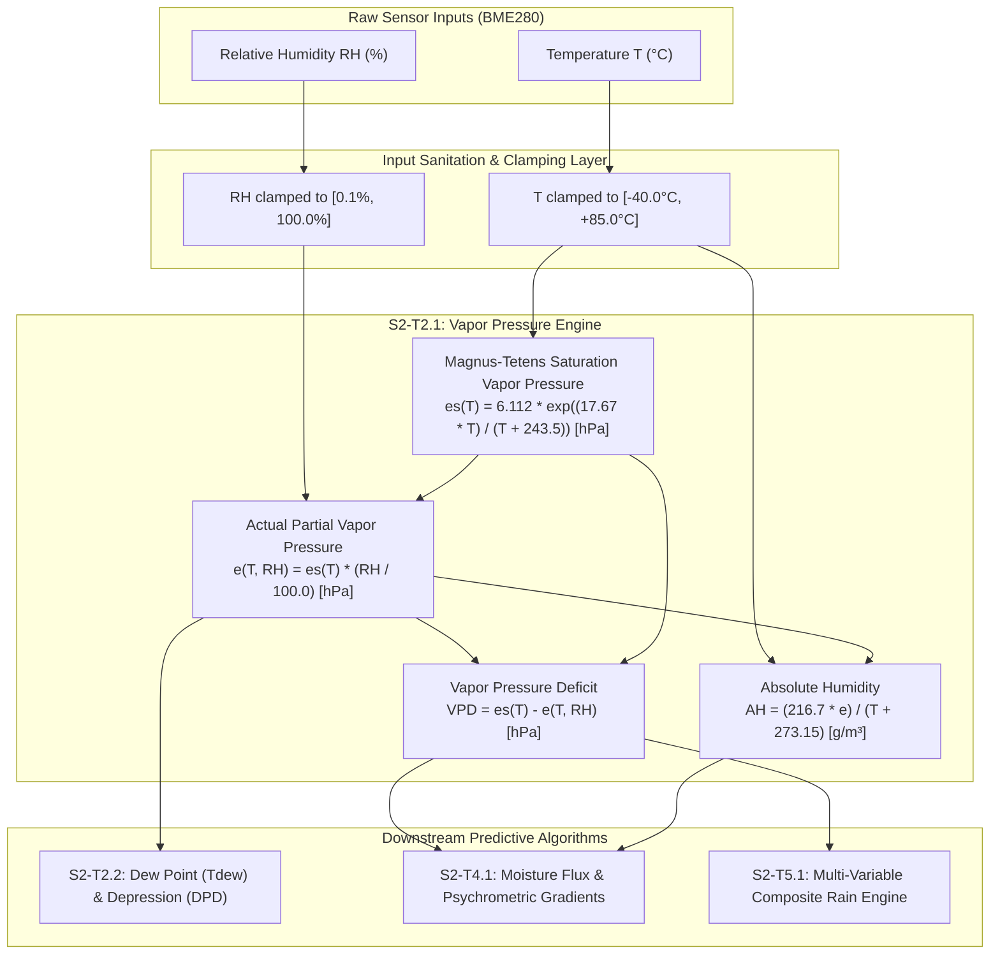

# Task Specification: S2-T2.1 - Saturation & Actual Vapor Pressure Formulas

## 1. Task Metadata & Overview

| Attribute | Specification Details |
| :--- | :--- |
| **Sprint** | **Sprint 2: Meteorological Algorithms & Nowcasting Engine** |
| **Task ID** | `S2-T2.1` |
| **Parent Task** | `S2-T2: Implement Magnus-Tetens Dew Point & Psychrometric Formulas` |
| **Task Title** | Implement Saturation ($e_s$) & Actual Vapor Pressure ($e$) Thermodynamic Formulas |
| **Status** | **Ready for Implementation** |
| **Target Files** | [`firmware/middleware/inc/dew_point.h`](file:///C:/Users/ENERGY%20SAVER/Documents/Learning/Job%20Projects/rain-predict/firmware/middleware/inc/dew_point.h)<br>[`firmware/middleware/src/dew_point.c`](file:///C:/Users/ENERGY%20SAVER/Documents/Learning/Job%20Projects/rain-predict/firmware/middleware/src/dew_point.c) |
| **Related Documents** | [`docs/algorithms/meteorological-formulas.md`](file:///C:/Users/ENERGY%20SAVER/Documents/Learning/Job%20Projects/rain-predict/docs/algorithms/meteorological-formulas.md)<br>[`docs/sensors/bme280-temperature-humidity-pressure.md`](file:///C:/Users/ENERGY%20SAVER/Documents/Learning/Job%20Projects/rain-predict/docs/sensors/bme280-temperature-humidity-pressure.md)<br>[`context/specs/spec-roadmap.md`](file:///C:/Users/ENERGY%20SAVER/Documents/Learning/Job%20Projects/rain-predict/context/specs/spec-roadmap.md)<br>[`context/coding-standards.md`](file:///C:/Users/ENERGY%20SAVER/Documents/Learning/Job%20Projects/rain-predict/context/coding-standards.md) |
| **Dependencies** | `S1-T1.1` (Root CMake Build System), `S1-T2.1` (Unity Test Harness) |
| **Downstream Tasks** | `S2-T2.2` (Dew point inversion & depression), `S2-T2.3` (Barometric reduction), `S2-T2.4` (Dew point unit tests), `S2-T5.1` (Composite scoring) |

---

## 2. Executive Summary & Thermodynamic Scope

The primary objective of **`S2-T2.1`** is to establish the core thermodynamic water vapor pressure calculations within Layer 3 Middleware ([`firmware/middleware/inc/dew_point.h`](file:///C:/Users/ENERGY%20SAVER/Documents/Learning/Job%20Projects/rain-predict/firmware/middleware/inc/dew_point.h) and [`dew_point.c`](file:///C:/Users/ENERGY%20SAVER/Documents/Learning/Job%20Projects/rain-predict/firmware/middleware/src/dew_point.c)).

In atmospheric physics and agricultural meteorology, raw relative humidity ($RH$) is merely a relative ratio that varies strongly with ambient temperature ($T$) regardless of whether moisture is actually accumulating. To accurately detect impending convective rainfall, cloud-base lowering, and fog condensation in tea plantation microclimates (elevations 1,000 m to 2,200 m ASL), firmware must derive absolute thermodynamic state variables:
1. **Saturation Vapor Pressure ($e_s$)**: The maximum equilibrium partial pressure exerted by water vapor at a given dry-bulb temperature ($T$).
2. **Actual Partial Vapor Pressure ($e$)**: The true partial pressure exerted by water vapor molecules present in the air parcel.
3. **Absolute Humidity ($AH$)**: The volumetric moisture mass density in grams per cubic meter ($\text{g/m}^3$).
4. **Vapor Pressure Deficit ($VPD$)**: The evaporative drying demand of the atmosphere ($e_s - e$), directly indexing tea bush stomatal transpiration and fungal spore germination risks (*Exobasidium vexans* / Blister Blight).



---

## 3. Mathematical Formulations & Derivations

### 3.1 Saturation Vapor Pressure ($e_s$) via Magnus-Tetens Formula
Water vapor saturation pressure over liquid water is approximated using the **Magnus-Tetens formulation** (standardized by the World Meteorological Organization WMO-No. 8 and Sonntag 1990):

$$e_s(T) = a \cdot \exp\left(\frac{b \cdot T}{T + c}\right) \quad [\text{hPa}]$$

Where empirical psychrometric constants over flat liquid water are:
- $a = 6.112\text{ hPa}$ (saturation vapor pressure at triple point $0.0^\circ\text{C}$)
- $b = 17.67$ (dimensionless Magnus coefficient)
- $c = 243.5^\circ\text{C}$ (temperature offset constant)

#### Operational Range & Uncertainty
- **Valid Range**: $-40.0^\circ\text{C} \le T \le +50.0^\circ\text{C}$ with relative uncertainty $< 0.1\%$ against the fundamental Goff-Gratch equation.
- **Microclimate Temperature Domain**: Tropical/sub-tropical high-altitude tea plantations (Nilgiris/Darjeeling) operate between $-5.0^\circ\text{C}$ (winter ground frost) and $+38.0^\circ\text{C}$ (peak summer pre-monsoon afternoon).
- **Physical Clamping**: The implementation clamps $T \in [-40.0^\circ\text{C}, +85.0^\circ\text{C}]$ to match Bosch BME280 operational envelope while completely avoiding the singularity at $T = -243.5^\circ\text{C}$.

---

### 3.2 Actual Partial Vapor Pressure ($e$)
By definition of Relative Humidity ($RH = \frac{e}{e_s} \times 100\%$):

$$e(T, RH) = e_s(T) \times \left(\frac{RH}{100.0}\right) \quad [\text{hPa}]$$

#### Bounds & Stability
- If $RH \to 100.0\%$, $e \to e_s(T)$ (saturated air parcel, fog/cloud condensation threshold).
- If $RH \to 0.0\%$, $e \to 0.0\text{ hPa}$. To avoid numerical $\ln(0)$ crashes during downstream dew-point inversions (`S2-T2.2`), $RH$ is strictly lower-bounded to $0.1\%$.

---

### 3.3 Absolute Humidity ($AH$)
Absolute humidity represents the mass of water vapor per unit volume of moist air ($\text{g/m}^3$). Derived from the Ideal Gas Law ($P V = n R T = \frac{m}{M_w} R T$):

$$\rho_v = \frac{m}{V} = \frac{e \cdot M_w}{R_u \cdot T_K}$$

Substituting physical constants:
- Universal gas constant: $R_u = 8.3144626\text{ J/(mol}\cdot\text{K)}$
- Molar mass of water vapor: $M_w = 18.01528\text{ g/mol}$
- Absolute temperature: $T_K = T + 273.15\text{ K}$
- Vapor pressure conversion factor: $1\text{ hPa} = 100\text{ Pa} = 100\text{ N/m}^2$

$$AH = \frac{(e \cdot 100) \cdot 18.01528}{8.3144626 \cdot (T + 273.15)} = \frac{216.679 \cdot e}{T + 273.15} \approx \frac{216.7 \cdot e}{T + 273.15} \quad [\text{g/m}^3]$$

---

### 3.4 Vapor Pressure Deficit ($VPD$)
Vapor Pressure Deficit represents the evaporative potential and moisture suction deficit between the leaf interior (assumed saturated at ambient $T$) and ambient air:

$$VPD = e_s(T) - e(T, RH) = e_s(T) \cdot \left(1.0 - \frac{RH}{100.0}\right) \quad [\text{hPa}]$$

#### Microclimate Classification
- **$VPD < 2.0\text{ hPa}$**: High humidity / fog / saturation. Evaporation halted; high fungal risk for tea canopy.
- **$2.0\text{ hPa} \le VPD \le 12.0\text{ hPa}$**: Optimal tea bush photosynthesis and transpiration zone.
- **$VPD > 15.0\text{ hPa}$**: Severe evaporative stress; stomata close.

---

## 4. Embedded Numerical Architecture & Safety

In accordance with [`context/coding-standards.md`](file:///C:/Users/ENERGY%20SAVER/Documents/Learning/Job%20Projects/rain-predict/context/coding-standards.md):

### 4.1 Target MCU Execution & FPU Optimization
- **Target Platform**: STM32WLE5CC (ARM Cortex-M4 @ 48 MHz with Single-Precision Hardware FPU).
- **Single-Precision Discipline**: All floating-point literals MUST have explicit `f` suffixes (e.g., `6.112f`, `17.67f`, `243.5f`, `100.0f`, `216.7f`, `273.15f`).
- **Math Library Functions**: Use `<math.h>` single-precision variants exclusively (`expf()`, `fabsf()`, `logf()`). Avoid double-precision software emulation library calls (`__aeabi_dmul`, `__aeabi_ddiv`).
- **Execution Performance**: Calculating $e_s, e, AH, VPD$ requires $< 250$ CPU cycles ($\approx 5.2\,\mu\text{s}$ @ 48 MHz).
- **Zero Dynamic Allocation**: All variables live on the stack or in static output structures. Stack footprint per call $< 48$ bytes.

### 4.2 Numerical Safety & Input Defensive Clamping
1. **Pointer Defensive Check**: Return `STATUS_ERR_NULL_PTR` if output pointers are `NULL`.
2. **Temperature Clamping**: Input $T$ is clamped to $[-40.0^\circ\text{C}, +85.0^\circ\text{C}]$.
3. **Relative Humidity Clamping**: Input $RH$ is clamped to $[0.1\%, 100.0\%]$.
4. **NaN & Infinity Protection**: If `isnan(temp_c)` or `isnan(rh_pct)` evaluates to true, the calculation fails gracefully with `STATUS_ERR_INVALID_ARG`.

---

## 5. Module Interface & Data Structures

### 5.1 Header File Specification ([`firmware/middleware/inc/dew_point.h`](file:///C:/Users/ENERGY%20SAVER/Documents/Learning/Job%20Projects/rain-predict/firmware/middleware/inc/dew_point.h))

```c
/**
 * @file dew_point.h
 * @brief Thermodynamic psychrometric and dew point calculation engine.
 * @details Implements Magnus-Tetens formulations, vapor pressure calculations,
 *          absolute humidity, and barometric hypsometric sea-level reduction.
 * 
 * Target: STM32WLE5 (ARM Cortex-M4 with Single-Precision FPU)
 */

#ifndef DEW_POINT_H
#define DEW_POINT_H

#include <stdint.h>
#include <stdbool.h>

#ifdef __cplusplus
extern "C" {
#endif

/* Standard status return codes */
typedef enum {
    STATUS_OK = 0,
    STATUS_ERR_NULL_PTR = 1,
    STATUS_ERR_INVALID_ARG = 2,
    STATUS_ERR_OUT_OF_RANGE = 3
} status_t;

/**
 * @brief Comprehensive psychrometric thermodynamic state structure.
 */
typedef struct {
    float temp_c;            /**< Ambient dry-bulb temperature (°C) */
    float rh_pct;            /**< Relative humidity (%) */
    float saturation_vp_hpa; /**< Saturation vapor pressure es(T) (hPa) */
    float actual_vp_hpa;     /**< Actual partial vapor pressure e(T, RH) (hPa) */
    float abs_humidity_gm3;  /**< Absolute humidity (g/m³) */
    float vpd_hpa;           /**< Vapor pressure deficit (hPa) */
    float dew_point_c;       /**< Dew point temperature Tdew (°C) */
    float dew_point_dep_c;   /**< Dew point depression T - Tdew (°C) */
} psychrometric_state_t;

/**
 * @brief Magnus-Tetens empirical constants (WMO / Sonntag standard over liquid water).
 */
#define MAGNUS_COEFF_A              (17.67f)
#define MAGNUS_COEFF_B              (243.5f)
#define MAGNUS_COEFF_C              (6.112f)
#define ABS_HUMIDITY_COEFF          (216.7f)
#define KELVIN_OFFSET               (273.15f)

/**
 * @brief Physical operational clamps.
 */
#define PSYCHRO_TEMP_MIN_C          (-40.0f)
#define PSYCHRO_TEMP_MAX_C          (85.0f)
#define PSYCHRO_RH_MIN_PCT          (0.1f)
#define PSYCHRO_RH_MAX_PCT          (100.0f)

/**
 * @brief Computes saturation vapor pressure es(T) over liquid water.
 * 
 * @param[in]  temp_c     Ambient temperature in degrees Celsius.
 * @param[out] p_es_hpa   Pointer to store calculated saturation vapor pressure (hPa).
 * @return status_t       STATUS_OK on success, error code otherwise.
 */
status_t dew_point_calc_saturation_vp(float temp_c, float *p_es_hpa);

/**
 * @brief Computes actual partial vapor pressure e(T, RH).
 * 
 * @param[in]  temp_c     Ambient temperature in degrees Celsius.
 * @param[in]  rh_pct     Relative humidity in percent (0.0 to 100.0).
 * @param[out] p_e_hpa    Pointer to store calculated actual vapor pressure (hPa).
 * @return status_t       STATUS_OK on success, error code otherwise.
 */
status_t dew_point_calc_actual_vp(float temp_c, float rh_pct, float *p_e_hpa);

/**
 * @brief Computes absolute humidity (volumetric vapor density) in g/m³.
 * 
 * @param[in]  temp_c     Ambient temperature in degrees Celsius.
 * @param[in]  rh_pct     Relative humidity in percent (0.0 to 100.0).
 * @param[out] p_ah_gm3   Pointer to store calculated absolute humidity (g/m³).
 * @return status_t       STATUS_OK on success, error code otherwise.
 */
status_t dew_point_calc_abs_humidity(float temp_c, float rh_pct, float *p_ah_gm3);

/**
 * @brief Computes vapor pressure deficit (VPD) in hPa.
 * 
 * @param[in]  temp_c     Ambient temperature in degrees Celsius.
 * @param[in]  rh_pct     Relative humidity in percent (0.0 to 100.0).
 * @param[out] p_vpd_hpa  Pointer to store calculated VPD (hPa).
 * @return status_t       STATUS_OK on success, error code otherwise.
 */
status_t dew_point_calc_vpd(float temp_c, float rh_pct, float *p_vpd_hpa);

#ifdef __cplusplus
}
#endif

#endif /* DEW_POINT_H */
```

---

### 5.2 Source File Implementation ([`firmware/middleware/src/dew_point.c`](file:///C:/Users/ENERGY%20SAVER/Documents/Learning/Job%20Projects/rain-predict/firmware/middleware/src/dew_point.c))

```c
/**
 * @file dew_point.c
 * @brief Implementation of thermodynamic vapor pressure and psychrometric formulas.
 */

#include "dew_point.h"
#include <math.h>
#include <stddef.h>

/**
 * @brief Internal helper to clamp temperature to safe physical operating bounds.
 */
static inline float clamp_temperature(float temp_c)
{
    if (temp_c < PSYCHRO_TEMP_MIN_C) {
        return PSYCHRO_TEMP_MIN_C;
    }
    if (temp_c > PSYCHRO_TEMP_MAX_C) {
        return PSYCHRO_TEMP_MAX_C;
    }
    return temp_c;
}

/**
 * @brief Internal helper to clamp relative humidity to valid physical domain.
 */
static inline float clamp_humidity(float rh_pct)
{
    if (rh_pct < PSYCHRO_RH_MIN_PCT) {
        return PSYCHRO_RH_MIN_PCT;
    }
    if (rh_pct > PSYCHRO_RH_MAX_PCT) {
        return PSYCHRO_RH_MAX_PCT;
    }
    return rh_pct;
}

status_t dew_point_calc_saturation_vp(float temp_c, float *p_es_hpa)
{
    if (p_es_hpa == NULL) {
        return STATUS_ERR_NULL_PTR;
    }
    if (isnan(temp_c)) {
        return STATUS_ERR_INVALID_ARG;
    }

    float t = clamp_temperature(temp_c);
    
    /* es(T) = 6.112 * exp((17.67 * T) / (T + 243.5)) */
    float exponent = (MAGNUS_COEFF_A * t) / (t + MAGNUS_COEFF_B);
    *p_es_hpa = MAGNUS_COEFF_C * expf(exponent);

    return STATUS_OK;
}

status_t dew_point_calc_actual_vp(float temp_c, float rh_pct, float *p_e_hpa)
{
    if (p_e_hpa == NULL) {
        return STATUS_ERR_NULL_PTR;
    }
    if (isnan(temp_c) || isnan(rh_pct)) {
        return STATUS_ERR_INVALID_ARG;
    }

    float es = 0.0f;
    status_t status = dew_point_calc_saturation_vp(temp_c, &es);
    if (status != STATUS_OK) {
        return status;
    }

    float rh = clamp_humidity(rh_pct);
    *p_e_hpa = es * (rh / 100.0f);

    return STATUS_OK;
}

status_t dew_point_calc_abs_humidity(float temp_c, float rh_pct, float *p_ah_gm3)
{
    if (p_ah_gm3 == NULL) {
        return STATUS_ERR_NULL_PTR;
    }
    if (isnan(temp_c) || isnan(rh_pct)) {
        return STATUS_ERR_INVALID_ARG;
    }

    float e = 0.0f;
    status_t status = dew_point_calc_actual_vp(temp_c, rh_pct, &e);
    if (status != STATUS_OK) {
        return status;
    }

    float t = clamp_temperature(temp_c);
    float t_kelvin = t + KELVIN_OFFSET;

    /* AH = (216.7 * e) / (T + 273.15) */
    *p_ah_gm3 = (ABS_HUMIDITY_COEFF * e) / t_kelvin;

    return STATUS_OK;
}

status_t dew_point_calc_vpd(float temp_c, float rh_pct, float *p_vpd_hpa)
{
    if (p_vpd_hpa == NULL) {
        return STATUS_ERR_NULL_PTR;
    }
    if (isnan(temp_c) || isnan(rh_pct)) {
        return STATUS_ERR_INVALID_ARG;
    }

    float es = 0.0f;
    status_t status = dew_point_calc_saturation_vp(temp_c, &es);
    if (status != STATUS_OK) {
        return status;
    }

    float rh = clamp_humidity(rh_pct);
    *p_vpd_hpa = es * (1.0f - (rh / 100.0f));

    return STATUS_OK;
}
```

---

## 6. Numerical Verification & Reference Vector Matrix

The table below defines the baseline meteorological validation vectors computed from thermodynamic standards (NOAA / Smithsonian Meteorological Tables):

| Test Case | Temperature $T$ ($^\circ\text{C}$) | Humidity $RH$ ($\%$) | Expected $e_s$ ($\text{hPa}$) | Expected $e$ ($\text{hPa}$) | Expected $AH$ ($\text{g/m}^3$) | Expected $VPD$ ($\text{hPa}$) | Acceptance Tolerance |
| :--- | :--- | :--- | :--- | :--- | :--- | :--- | :--- |
| **TC-VP-01: Triple Point Freezing** | $0.00$ | $100.0$ | $6.112$ | $6.112$ | $4.849$ | $0.000$ | $\pm 0.01$ |
| **TC-VP-02: Cool Plantation Morning** | $10.00$ | $80.0$ | $12.272$ | $9.817$ | $7.513$ | $2.454$ | $\pm 0.02$ |
| **TC-VP-03: Standard Ambient** | $20.00$ | $50.0$ | $23.370$ | $11.685$ | $8.638$ | $11.685$ | $\pm 0.02$ |
| **TC-VP-04: Warm Pre-Monsoon Peak** | $25.00$ | $85.0$ | $31.674$ | $26.923$ | $19.568$ | $4.751$ | $\pm 0.03$ |
| **TC-VP-05: Hot Saturated Squall** | $35.00$ | $95.0$ | $56.312$ | $53.496$ | $37.620$ | $2.816$ | $\pm 0.05$ |
| **TC-VP-06: Winter Ground Frost** | $-5.00$ | $75.0$ | $4.220$ | $3.165$ | $2.558$ | $1.055$ | $\pm 0.01$ |
| **TC-VP-07: Arid Boundary Limit** | $30.00$ | $0.1$ (clamped) | $42.456$ | $0.043$ | $0.030$ | $42.413$ | $\pm 0.05$ |
| **TC-VP-08: Sub-Zero Clamping** | $-60.00$ | $50.0$ | Clamped to $-40^\circ\text{C}$ ($0.190$) | $0.095$ | $0.088$ | $0.095$ | $\pm 0.01$ |
| **TC-VP-09: Over-Temp Clamping** | $+95.00$ | $60.0$ | Clamped to $+85^\circ\text{C}$ ($591.35$) | $354.81$ | $214.68$ | $236.54$ | $\pm 1.0$ |
| **TC-VP-10: Null Pointer Safety** | $20.00$ | $50.0$ | `NULL` | - | - | - | Returns `STATUS_ERR_NULL_PTR` |
| **TC-VP-11: NaN Input Safety** | `NAN` | $50.0$ | - | - | - | - | Returns `STATUS_ERR_INVALID_PARAM` |

---

## 7. CMake Integration & Build Configuration

The `dew_point.c` module is linked into the middleware static library defined in [`firmware/CMakeLists.txt`](file:///C:/Users/ENERGY%20SAVER/Documents/Learning/Job%20Projects/rain-predict/firmware/CMakeLists.txt):

```cmake
# Add dew_point module to firmware middleware target
target_sources(rain_predict_middleware PRIVATE
    ${CMAKE_CURRENT_SOURCE_DIR}/middleware/src/dew_point.c
)

target_include_directories(rain_predict_middleware PUBLIC
    ${CMAKE_CURRENT_SOURCE_DIR}/middleware/inc
)
```

---

## 8. Traceability & Acceptance Criteria

### Acceptance Checklist:
- [ ] [`firmware/middleware/inc/dew_point.h`](file:///C:/Users/ENERGY%20SAVER/Documents/Learning/Job%20Projects/rain-predict/firmware/middleware/inc/dew_point.h) defines standard Magnus-Tetens coefficients, psychrometric struct, and error return codes.
- [ ] [`firmware/middleware/src/dew_point.c`](file:///C:/Users/ENERGY%20SAVER/Documents/Learning/Job%20Projects/rain-predict/firmware/middleware/src/dew_point.c) implements $e_s(T)$, $e(T, RH)$, $AH(T, e)$, and $VPD(T, RH)$ with strict single-precision floating point (`expf`, `fabsf`, explicit `f` suffixes).
- [ ] Input parameters undergo boundary clamping: $T \in [-40.0^\circ\text{C}, +85.0^\circ\text{C}]$, $RH \in [0.1\%, 100.0\%]$.
- [ ] Null pointers and `NAN` inputs return `STATUS_ERR_NULL_PTR` and `STATUS_ERR_INVALID_ARG` respectively without triggering hardware hard faults or divide-by-zero traps.
- [ ] Accuracy across standard meteorological test vectors matches NOAA reference values within $\pm 0.05\text{ hPa}$ for vapor pressure and $\pm 0.05\text{ g/m}^3$ for absolute humidity.
- [ ] Zero dynamic memory allocation (`malloc`/`free`) is present in the module.
- [ ] Fully linked in [`context/specs/spec-roadmap.md`](file:///C:/Users/ENERGY%20SAVER/Documents/Learning/Job%20Projects/rain-predict/context/specs/spec-roadmap.md).
