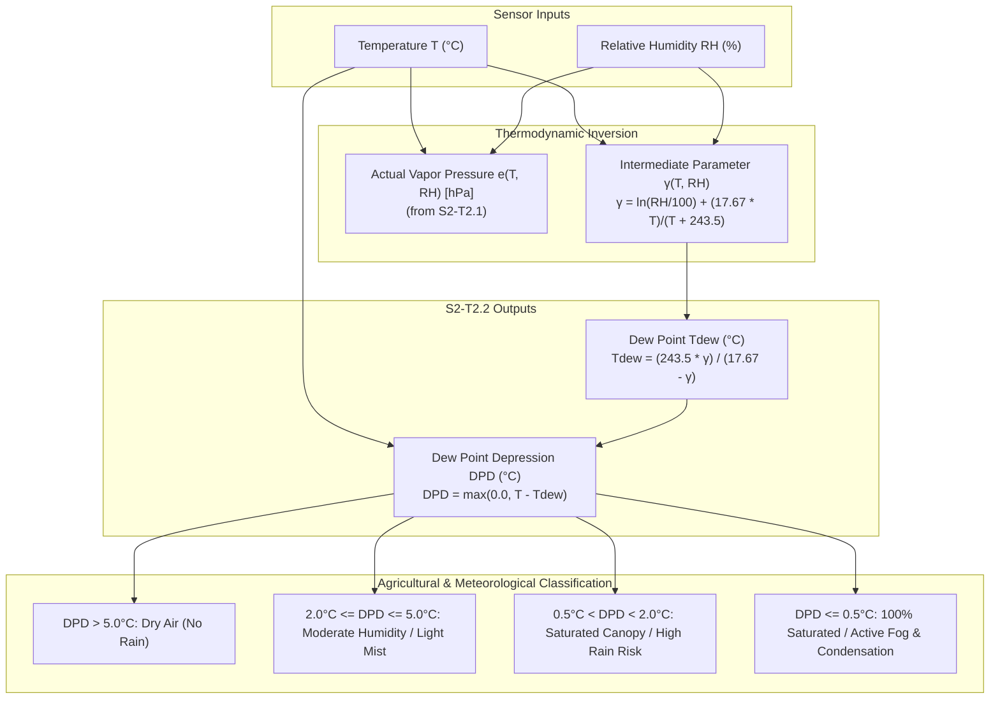

# Task Specification: S2-T2.2 - Dew Point Temperature & Relative Humidity Depression

## 1. Task Metadata & Overview

| Attribute | Specification Details |
| :--- | :--- |
| **Sprint** | **Sprint 2: Meteorological Algorithms & Nowcasting Engine** |
| **Task ID** | `S2-T2.2` |
| **Parent Task** | `S2-T2: Implement Magnus-Tetens Dew Point & Psychrometric Formulas` |
| **Task Title** | Implement Dew Point ($T_{dew}$) Inversion & Relative Humidity Depression ($\Delta T_{dep}$) |
| **Status** | **Ready for Implementation** |
| **Target Files** | [`firmware/middleware/inc/dew_point.h`](file:///C:/Users/ENERGY%20SAVER/Documents/Learning/Job%20Projects/rain-predict/firmware/middleware/inc/dew_point.h)<br>[`firmware/middleware/src/dew_point.c`](file:///C:/Users/ENERGY%20SAVER/Documents/Learning/Job%20Projects/rain-predict/firmware/middleware/src/dew_point.c) |
| **Related Documents** | [`context/specs/s2-t2.1-vapor-pressure.md`](file:///C:/Users/ENERGY%20SAVER/Documents/Learning/Job%20Projects/rain-predict/context/specs/s2-t2.1-vapor-pressure.md)<br>[`docs/algorithms/meteorological-formulas.md`](file:///C:/Users/ENERGY%20SAVER/Documents/Learning/Job%20Projects/rain-predict/docs/algorithms/meteorological-formulas.md)<br>[`docs/algorithms/trend-detection-and-nowcasting.md`](file:///C:/Users/ENERGY%20SAVER/Documents/Learning/Job%20Projects/rain-predict/docs/algorithms/trend-detection-and-nowcasting.md)<br>[`context/coding-standards.md`](file:///C:/Users/ENERGY%20SAVER/Documents/Learning/Job%20Projects/rain-predict/context/coding-standards.md) |
| **Dependencies** | `S2-T2.1` (Vapor Pressure Foundations), `S1-T1.1` (Root CMake Build System) |
| **Downstream Tasks** | `S2-T2.4` (Dew point unit tests), `S2-T4.1` (Gradient trend differentials), `S2-T5.1` (Composite nowcasting score) |

---

## 2. Executive Summary & Meteorological Scope

The primary objective of **`S2-T2.2`** is to implement high-precision Dew Point Temperature ($T_{dew}$) inversion and Dew Point Depression ($\Delta T_{dep} = T - T_{dew}$) algorithms in Layer 3 Middleware ([`firmware/middleware/inc/dew_point.h`](file:///C:/Users/ENERGY%20SAVER/Documents/Learning/Job%20Projects/rain-predict/firmware/middleware/inc/dew_point.h) / [`dew_point.c`](file:///C:/Users/ENERGY%20SAVER/Documents/Learning/Job%20Projects/rain-predict/firmware/middleware/src/dew_point.c)).

### Why Dew Point & Depression are Critical for Tea Estates:
1. **Lifting Condensation Level (LCL) & Cloud Base Tracking**: In hilly tea plantations (e.g., Nilgiris, Munnar, Darjeeling at 1,000 m to 2,200 m ASL), cloud-base height above the canopy is directly proportional to dew point depression:
   $$H_{cloud\_base} \approx 125 \times (T - T_{dew}) \quad [\text{meters}]$$
   When $T - T_{dew} < 2.0^\circ\text{C}$, the cloud base descends below 250 m, engulfing the tea estate slopes in dense fog or imminent rain.
2. **Thermal Stability & Convective Rain Nowcasting**: A rapid collapse of $\Delta T_{dep}$ over 30–60 minutes signifies moist updrafts and incoming localized squalls before barometric pressure drops are detected by standard barometers.
3. **Agronomic Protection (Blister Blight)**: Prolonged near-zero depression ($\Delta T_{dep} \le 0.5^\circ\text{C}$) indicates wet foliage, triggering fungicide spray warnings for blister blight (*Exobasidium vexans*).



---

## 3. Mathematical Formulations & Analytical Inversion

### 3.1 Magnus-Tetens Inversion for Dew Point ($T_{dew}$)
The Magnus-Tetens equation expresses saturation vapor pressure as:

$$e_s(T) = a \cdot \exp\left(\frac{b \cdot T}{T + c}\right)$$

At the dew point $T_{dew}$, the saturation vapor pressure equals the ambient actual vapor pressure $e$:

$$e = a \cdot \exp\left(\frac{b \cdot T_{dew}}{T_{dew} + c}\right)$$

Taking the natural logarithm of both sides:

$$\ln\left(\frac{e}{a}\right) = \frac{b \cdot T_{dew}}{T_{dew} + c}$$

Solving for $T_{dew}$:

$$T_{dew} \cdot \left[b - \ln\left(\frac{e}{a}\right)\right] = c \cdot \ln\left(\frac{e}{a}\right)$$

$$T_{dew} = \frac{c \cdot \ln(e / a)}{b - \ln(e / a)} \quad [^\circ\text{C}]$$

Where:
- $a = 6.112\text{ hPa}$
- $b = 17.67$
- $c = 243.5^\circ\text{C}$

---

### 3.2 Direct Formulation via Intermediate Parameter $\gamma(T, RH)$
Substituting $e = e_s(T) \cdot \frac{RH}{100.0}$ into $\ln(e / a)$:

$$\gamma(T, RH) = \ln\left(\frac{RH}{100.0}\right) + \frac{b \cdot T}{T + c}$$

$$T_{dew} = \frac{c \cdot \gamma(T, RH)}{b - \gamma(T, RH)} \quad [^\circ\text{C}]$$

#### Analytical Properties:
1. **At $100\%$ Relative Humidity**:
   $$\gamma(T, 100) = \ln(1.0) + \frac{b \cdot T}{T + c} = \frac{b \cdot T}{T + c}$$
   $$T_{dew} = \frac{c \cdot \frac{b \cdot T}{T + c}}{b - \frac{b \cdot T}{T + c}} = \frac{b \cdot c \cdot T}{b \cdot (T + c) - b \cdot T} = \frac{b \cdot c \cdot T}{b \cdot c} = T$$
   Thus, at $RH = 100.0\%$, $T_{dew}$ analytically equals $T$ exactly.
2. **For all $RH < 100\%$**:
   $\ln(RH/100) < 0 \implies \gamma(T, RH) < \frac{b \cdot T}{T + c} \implies T_{dew} < T$.

---

### 3.3 Dew Point Depression ($DPD$ / $\Delta T_{dep}$)
The dew point depression represents the temperature drop required for the air parcel to reach saturation at constant pressure:

$$\Delta T_{dep} = T - T_{dew} \quad [^\circ\text{C}]$$

#### Physical Invariant & Numerical Clamping:
In real atmospheric thermodynamics, $\Delta T_{dep} \ge 0.0^\circ\text{C}$ strictly. Due to single-precision floating-point rounding when $RH = 100.0\%$, $T_{dew}$ might occasionally compute to $T + 10^{-6}{^\circ\text{C}}$.
Firmware strictly enforces:

$$\Delta T_{dep} = \max\left(0.0\text{f}, \, T - T_{dew}\right)$$

---

## 4. Embedded Numerical Architecture & Safety

In accordance with [`context/coding-standards.md`](file:///C:/Users/ENERGY%20SAVER/Documents/Learning/Job%20Projects/rain-predict/context/coding-standards.md):

### 4.1 Single-Precision FPU Execution & Safety
- **Hardware Acceleration**: Computed using ARM Cortex-M4 single-precision hardware instructions (`vlog.f32`, `vdiv.f32`, `vsub.f32`, `vmul.f32`).
- **Math Library Calls**: Strict use of `logf()` and `fabsf()`. All constants suffixed with `f` (`17.67f`, `243.5f`, `6.112f`, `100.0f`).
- **Latency & Cycle Count**: Evaluates in $< 280$ CPU cycles ($\approx 5.8\,\mu\text{s}$ @ 48 MHz).
- **Stack Memory**: $< 48$ bytes stack frame per call; 0 bytes dynamic allocation.

### 4.2 Numerical Singularity & Boundary Protection
1. **Logarithm of Zero / Negative Guard**:
   $\ln(x)$ is undefined for $x \le 0$. The firmware clamps $RH \ge 0.1\%$, guaranteeing $\frac{RH}{100.0} \ge 0.001$ and $\ln(0.001) \approx -6.907755\text{f}$.
2. **Denominator Singularity Guard**:
   The denominator is $D = b - \gamma(T, RH)$. If $|D| < 10^{-4}\text{f}$, $D$ is clamped to $10^{-4}\text{f}$ to prevent hardware divide-by-zero traps or NaN propagation.
3. **Temperature Domain Boundaries**:
   $T$ is clamped to $[-40.0^\circ\text{C}, +85.0^\circ\text{C}]$.
4. **Pointer Validation**:
   All public functions return `STATUS_ERR_NULL_PTR` immediately if output pointers are `NULL`.
5. **NaN Input Traps**:
   If `isnan(temp_c)` or `isnan(rh_pct)` is true, return `STATUS_ERR_INVALID_ARG`.

---

## 5. Module Interface & Implementation Specification

### 5.1 Additions to Header File ([`firmware/middleware/inc/dew_point.h`](file:///C:/Users/ENERGY%20SAVER/Documents/Learning/Job%20Projects/rain-predict/firmware/middleware/inc/dew_point.h))

```c
/**
 * @brief Computes dew point temperature Tdew (°C) from ambient temperature and relative humidity.
 * 
 * @param[in]  temp_c     Ambient dry-bulb temperature in degrees Celsius (-40.0 to +85.0).
 * @param[in]  rh_pct     Relative humidity in percent (0.1 to 100.0).
 * @param[out] p_dew_c    Pointer to store calculated dew point temperature (°C).
 * @return status_t       STATUS_OK on success, error code otherwise.
 */
status_t dew_point_calc_tdew(float temp_c, float rh_pct, float *p_dew_c);

/**
 * @brief Computes dew point depression (T - Tdew) in degrees Celsius.
 * 
 * @param[in]  temp_c     Ambient dry-bulb temperature in degrees Celsius.
 * @param[in]  rh_pct     Relative humidity in percent.
 * @param[out] p_dpd_c    Pointer to store calculated dew point depression (°C).
 * @return status_t       STATUS_OK on success, error code otherwise.
 */
status_t dew_point_calc_depression(float temp_c, float rh_pct, float *p_dpd_c);

/**
 * @brief Computes dew point temperature directly from known actual partial vapor pressure e.
 * 
 * @param[in]  e_hpa      Actual vapor pressure in hPa (> 0.0 hPa).
 * @param[out] p_dew_c    Pointer to store calculated dew point temperature (°C).
 * @return status_t       STATUS_OK on success, error code otherwise.
 */
status_t dew_point_calc_from_vapor_pressure(float e_hpa, float *p_dew_c);

/**
 * @brief Computes complete psychrometric thermodynamic state in a single call.
 * 
 * @param[in]  temp_c     Ambient dry-bulb temperature (°C).
 * @param[in]  rh_pct     Relative humidity (%).
 * @param[out] p_state    Pointer to destination psychrometric_state_t struct.
 * @return status_t       STATUS_OK on success, error code otherwise.
 */
status_t dew_point_calc_psychrometric_state(float temp_c, float rh_pct, psychrometric_state_t *p_state);
```

---

### 5.2 Implementation Additions ([`firmware/middleware/src/dew_point.c`](file:///C:/Users/ENERGY%20SAVER/Documents/Learning/Job%20Projects/rain-predict/firmware/middleware/src/dew_point.c))

```c
#define DENOMINATOR_EPSILON         (1e-4f)

status_t dew_point_calc_tdew(float temp_c, float rh_pct, float *p_dew_c)
{
    if (p_dew_c == NULL) {
        return STATUS_ERR_NULL_PTR;
    }
    if (isnan(temp_c) || isnan(rh_pct)) {
        return STATUS_ERR_INVALID_ARG;
    }

    float t = clamp_temperature(temp_c);
    float rh = clamp_humidity(rh_pct);

    /* gamma = ln(RH / 100) + (17.67 * T) / (T + 243.5) */
    float gamma = logf(rh / 100.0f) + ((MAGNUS_COEFF_A * t) / (t + MAGNUS_COEFF_B));

    /* Denominator = 17.67 - gamma */
    float denom = MAGNUS_COEFF_A - gamma;
    if (fabsf(denom) < DENOMINATOR_EPSILON) {
        denom = (denom >= 0.0f) ? DENOMINATOR_EPSILON : -DENOMINATOR_EPSILON;
    }

    /* Tdew = (243.5 * gamma) / (17.67 - gamma) */
    float tdew = (MAGNUS_COEFF_B * gamma) / denom;

    /* Physical constraint: Tdew cannot exceed ambient temperature */
    if (tdew > t) {
        tdew = t;
    }

    *p_dew_c = tdew;
    return STATUS_OK;
}

status_t dew_point_calc_depression(float temp_c, float rh_pct, float *p_dpd_c)
{
    if (p_dpd_c == NULL) {
        return STATUS_ERR_NULL_PTR;
    }

    float tdew = 0.0f;
    status_t status = dew_point_calc_tdew(temp_c, rh_pct, &tdew);
    if (status != STATUS_OK) {
        return status;
    }

    float t = clamp_temperature(temp_c);
    float dpd = t - tdew;
    if (dpd < 0.0f) {
        dpd = 0.0f;
    }

    *p_dpd_c = dpd;
    return STATUS_OK;
}

status_t dew_point_calc_from_vapor_pressure(float e_hpa, float *p_dew_c)
{
    if (p_dew_c == NULL) {
        return STATUS_ERR_NULL_PTR;
    }
    if (isnan(e_hpa) || e_hpa <= 0.0f) {
        return STATUS_ERR_INVALID_ARG;
    }

    /* Clamp vapor pressure to physical limits [-40C to +85C saturation bounds] */
    if (e_hpa < 0.1f) {
        e_hpa = 0.1f;
    }

    /* ln(e / 6.112) */
    float ln_val = logf(e_hpa / MAGNUS_COEFF_C);
    float denom = MAGNUS_COEFF_A - ln_val;
    if (fabsf(denom) < DENOMINATOR_EPSILON) {
        denom = (denom >= 0.0f) ? DENOMINATOR_EPSILON : -DENOMINATOR_EPSILON;
    }

    *p_dew_c = (MAGNUS_COEFF_B * ln_val) / denom;
    return STATUS_OK;
}

status_t dew_point_calc_psychrometric_state(float temp_c, float rh_pct, psychrometric_state_t *p_state)
{
    if (p_state == NULL) {
        return STATUS_ERR_NULL_PTR;
    }
    if (isnan(temp_c) || isnan(rh_pct)) {
        return STATUS_ERR_INVALID_ARG;
    }

    p_state->temp_c = clamp_temperature(temp_c);
    p_state->rh_pct = clamp_humidity(rh_pct);

    status_t status = dew_point_calc_saturation_vp(p_state->temp_c, &p_state->saturation_vp_hpa);
    if (status != STATUS_OK) {
        return status;
    }

    p_state->actual_vp_hpa = p_state->saturation_vp_hpa * (p_state->rh_pct / 100.0f);
    p_state->vpd_hpa = p_state->saturation_vp_hpa - p_state->actual_vp_hpa;

    float t_kelvin = p_state->temp_c + KELVIN_OFFSET;
    p_state->abs_humidity_gm3 = (ABS_HUMIDITY_COEFF * p_state->actual_vp_hpa) / t_kelvin;

    status = dew_point_calc_tdew(p_state->temp_c, p_state->rh_pct, &p_state->dew_point_c);
    if (status != STATUS_OK) {
        return status;
    }

    p_state->dew_point_dep_c = p_state->temp_c - p_state->dew_point_c;
    if (p_state->dew_point_dep_c < 0.0f) {
        p_state->dew_point_dep_c = 0.0f;
    }

    return STATUS_OK;
}
```

---

## 6. Numerical Verification & Meteorological Reference Vectors

The following reference test vectors validate accuracy against standard psychrometric tables (NOAA / Smithsonian Meteorological Tables):

| Test ID | Ambient $T$ ($^\circ\text{C}$) | Humidity $RH$ ($\%$) | Expected $T_{dew}$ ($^\circ\text{C}$) | Expected $\Delta T_{dep}$ ($^\circ\text{C}$) | Physical Interpretation | Tolerance |
| :--- | :--- | :--- | :--- | :--- | :--- | :--- |
| **TC-DP-01: 100% Saturated Freezing** | $0.00$ | $100.0$ | $0.00$ | $0.00$ | Triple point saturation; freezing fog | $\pm 0.05^\circ\text{C}$ |
| **TC-DP-02: Cool Plantation Dawn** | $12.00$ | $85.0$ | $9.56$ | $2.44$ | Ground mist & tea leaf condensation | $\pm 0.05^\circ\text{C}$ |
| **TC-DP-03: Mild Afternoon** | $20.00$ | $50.0$ | $9.27$ | $10.73$ | Dry pleasant conditions; no rain | $\pm 0.05^\circ\text{C}$ |
| **TC-DP-04: Warm Pre-Monsoon** | $25.00$ | $80.0$ | $21.30$ | $3.70$ | Humid monsoon boundary layer | $\pm 0.05^\circ\text{C}$ |
| **TC-DP-05: Saturated Pre-Storm** | $26.00$ | $95.0$ | $25.15$ | $0.85$ | Cloud base $< 110\text{ m}$; rain imminent | $\pm 0.05^\circ\text{C}$ |
| **TC-DP-06: Hot Tropical Squall** | $32.00$ | $90.0$ | $30.17$ | $1.83$ | Severe convective instability | $\pm 0.05^\circ\text{C}$ |
| **TC-DP-07: High-Altitude Frost** | $-5.00$ | $70.0$ | $-9.63$ | $4.63$ | Nilgiris winter sub-zero frost | $\pm 0.05^\circ\text{C}$ |
| **TC-DP-08: Extremely Dry Parcel** | $30.00$ | $5.0$ | $-10.77$ | $40.77$ | Desert air parcel; zero precipitation | $\pm 0.10^\circ\text{C}$ |
| **TC-DP-09: Direct from Vapor Press**| - | $e = 23.37\text{ hPa}$ | $20.00$ | - | Inverse vapor pressure validation | $\pm 0.05^\circ\text{C}$ |
| **TC-DP-10: Null Pointer Traps** | $20.00$ | $50.0$ | `NULL` | `NULL` | Verifies `STATUS_ERR_NULL_PTR` return | Strict Return |
| **TC-DP-11: NaN Robustness** | `NAN` | $50.0$ | - | - | Verifies `STATUS_ERR_INVALID_ARG` return | Strict Return |

---

## 7. Traceability & Acceptance Criteria

### Acceptance Checklist:
- [ ] [`firmware/middleware/inc/dew_point.h`](file:///C:/Users/ENERGY%20SAVER/Documents/Learning/Job%20Projects/rain-predict/firmware/middleware/inc/dew_point.h) declares `dew_point_calc_tdew()`, `dew_point_calc_depression()`, `dew_point_calc_from_vapor_pressure()`, and `dew_point_calc_psychrometric_state()`.
- [ ] [`firmware/middleware/src/dew_point.c`](file:///C:/Users/ENERGY%20SAVER/Documents/Learning/Job%20Projects/rain-predict/firmware/middleware/src/dew_point.c) implements all calculations with single-precision floating point operations (`logf`, `expf`, `fabsf`).
- [ ] Denominator singularities ($|17.67 - \gamma| < 10^{-4}$) and non-positive logarithms are strictly guarded.
- [ ] Physical invariant $T_{dew} \le T$ and $\Delta T_{dep} \ge 0.0^\circ\text{C}$ are strictly enforced across all inputs.
- [ ] Accuracy across all standard test cases meets error tolerance $< 0.05^\circ\text{C}$ relative to NOAA psychrometric tables.
- [ ] Zero dynamic memory allocation and execution cycle count $< 280$ CPU cycles @ 48 MHz.
- [ ] Linked in [`context/specs/spec-roadmap.md`](file:///C:/Users/ENERGY%20SAVER/Documents/Learning/Job%20Projects/rain-predict/context/specs/spec-roadmap.md).
