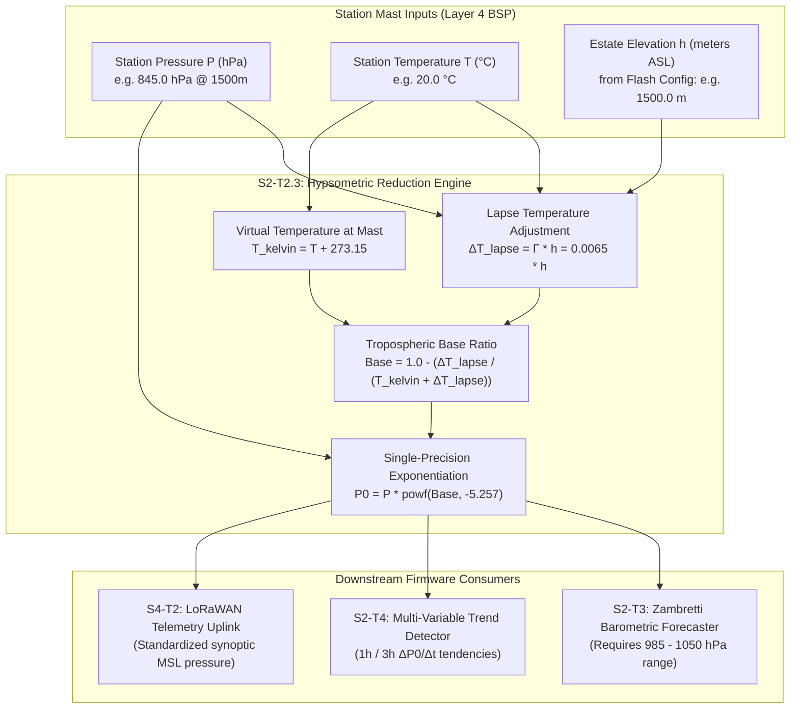

# Task Specification: S2-T2.3 - Hypsometric Barometric Sea-Level Reduction

## 1. Task Metadata & Overview

| Attribute | Specification Details |
| :--- | :--- |
| **Sprint** | **Sprint 2: Meteorological Algorithms & Nowcasting Engine** |
| **Task ID** | `S2-T2.3` |
| **Parent Task** | `S2-T2: Implement Magnus-Tetens Dew Point & Psychrometric Formulas` |
| **Task Title** | Implement Hypsometric Barometric Altitude Sea-Level Reduction ($P_0$) |
| **Status** | **Ready for Implementation** |
| **Target Files** | [`firmware/middleware/inc/dew_point.h`](file:///C:/Users/ENERGY%20SAVER/Documents/Learning/Job%20Projects/rain-predict/firmware/middleware/inc/dew_point.h)<br>[`firmware/middleware/src/dew_point.c`](file:///C:/Users/ENERGY%20SAVER/Documents/Learning/Job%20Projects/rain-predict/firmware/middleware/src/dew_point.c) |
| **Related Documents** | [`context/specs/s2-t2.1-vapor-pressure.md`](file:///C:/Users/ENERGY%20SAVER/Documents/Learning/Job%20Projects/rain-predict/context/specs/s2-t2.1-vapor-pressure.md)<br>[`context/specs/s2-t2.2-dew-point-depression.md`](file:///C:/Users/ENERGY%20SAVER/Documents/Learning/Job%20Projects/rain-predict/context/specs/s2-t2.2-dew-point-depression.md)<br>[`docs/algorithms/meteorological-formulas.md`](file:///C:/Users/ENERGY%20SAVER/Documents/Learning/Job%20Projects/rain-predict/docs/algorithms/meteorological-formulas.md)<br>[`docs/algorithms/zambretti-algorithm.md`](file:///C:/Users/ENERGY%20SAVER/Documents/Learning/Job%20Projects/rain-predict/docs/algorithms/zambretti-algorithm.md)<br>[`context/coding-standards.md`](file:///C:/Users/ENERGY%20SAVER/Documents/Learning/Job%20Projects/rain-predict/context/coding-standards.md) |
| **Dependencies** | `S2-T2.1` (Thermodynamic Foundations), `S1-T1.1` (Root CMake Build System) |
| **Downstream Tasks** | `S2-T2.4` (Dew point test suite), `S2-T3` (Zambretti forecaster), `S2-T4` (Trend detector), `S2-T5` (Composite nowcaster) |

---

## 2. Executive Summary & Meteorological Scope

The primary objective of **`S2-T2.3`** is to implement the **Hypsometric Barometric Sea-Level Reduction Formula ($P_0$)** in Layer 3 Middleware ([`firmware/middleware/inc/dew_point.h`](file:///C:/Users/ENERGY%20SAVER/Documents/Learning/Job%20Projects/rain-predict/firmware/middleware/inc/dew_point.h) / [`dew_point.c`](file:///C:/Users/ENERGY%20SAVER/Documents/Learning/Job%20Projects/rain-predict/firmware/middleware/src/dew_point.c)).

### Why Sea-Level Pressure Reduction is Indispensable:
1. **Altitude Compensation across Tea Estates**: Tea plantations span complex mountainous terrain across elevations of $1,000\text{ m}$ to $2,200\text{ m}$ Above Sea Level (ASL) (e.g., Nilgiris, Valparai, Munnar, Darjeeling). At $1,800\text{ m}$, the raw ambient station pressure ($P$) is approximately $815\text{ hPa}$ compared to the standard sea-level $1013.25\text{ hPa}$.
2. **Standardization for Heuristic Algorithms**: The **Zambretti Heuristic Forecasting Engine** (`S2-T3`) and synoptic weather charts require pressure normalized to Mean Sea Level (MSL) within the canonical range of $985\text{ hPa}$ to $1050\text{ hPa}$. Feeding raw $815\text{ hPa}$ pressure directly into heuristic tables would cause catastrophic misclassification.
3. **Multi-Node Gradient Comparison**: In a distributed estate mesh network, nodes deployed on valley floors ($1,000\text{ m}$) and ridge tops ($2,000\text{ m}$) must normalize their barometric readings to $P_0$ to isolate true meteorological barometric pressure tendencies ($\Delta P/\Delta t$) from static elevation offsets.



---

## 3. Mathematical Formulations & Derivations

### 3.1 The Hypsometric Atmospheric Equation
In accordance with the **ICAO Standard Atmosphere** and the **World Meteorological Organization (WMO No. 8, Guide to Meteorological Instruments and Methods of Observation)**, barometric pressure decreases exponentially with height according to the hydrostatic equation combined with the ideal gas law:

$$\frac{dP}{dz} = -\rho g = -\frac{P \cdot M}{R_u \cdot T(z)} g$$

Assuming a constant standard tropospheric temperature lapse rate $\Gamma = -\frac{dT}{dz} = 0.0065\text{ K/m}$ ($6.5\text{ K/km}$):

$$T(z) = T_0 - \Gamma \cdot z$$

Where $T_0$ is the sea-level equivalent temperature and $z = h$ is the estate elevation above MSL.
Integrating between sea level ($z=0, P=P_0$) and station altitude ($z=h, P=P$):

$$\int_{P_0}^{P} \frac{dP}{P} = -\frac{g M}{R_u} \int_{0}^{h} \frac{dz}{T_0 - \Gamma z} = \frac{g M}{R_u \Gamma} \ln\left(\frac{T_0 - \Gamma h}{T_0}\right)$$

$$\frac{P}{P_0} = \left(1 - \frac{\Gamma \cdot h}{T_0}\right)^{\frac{g M}{R_u \Gamma}}$$

Expressing in terms of station temperature $T$ ($^\circ\text{C}$), where $T_0 = T + \Gamma \cdot h + 273.15\text{ K}$:

$$P_0 = P \times \left(1 - \frac{0.0065 \cdot h}{T + 0.0065 \cdot h + 273.15}\right)^{-\kappa} \quad [\text{hPa}]$$

### 3.2 Atmospheric Physical Constants
- Standard gravitational acceleration: $g = 9.80665\text{ m/s}^2$
- Molar mass of dry air: $M = 0.0289644\text{ kg/mol}$
- Universal gas constant: $R_u = 8.31432\text{ J/(mol}\cdot\text{K)}$
- Tropospheric lapse rate: $\Gamma = 0.0065\text{ K/m}$
- Hypsometric exponent:
  $$\kappa = \frac{g \cdot M}{R_u \cdot \Gamma} = \frac{9.80665 \times 0.0289644}{8.31432 \times 0.0065} = 5.255877 \approx 5.257$$

---

### 3.3 Inverse Transformation (Pressure Altitude Calculation)
For diagnostic self-calibration, firmware can also compute estimated pressure altitude ($h_{est}$) given station pressure $P$ and reference sea-level pressure $P_0$:

$$h_{est} = \frac{T + 273.15}{0.0065} \times \left[\left(\frac{P_0}{P}\right)^{\frac{1}{5.257}} - 1\right] \quad [\text{meters}]$$

---

## 4. Embedded Numerical Architecture & Safety

In accordance with [`context/coding-standards.md`](file:///C:/Users/ENERGY%20SAVER/Documents/Learning/Job%20Projects/rain-predict/context/coding-standards.md):

### 4.1 Single-Precision FPU Optimization
- **Target Platform**: STM32WLE5 (ARM Cortex-M4 with single-precision hardware FPU).
- **Single-Precision Discipline**: Strict use of `powf()` and `fabsf()`. All numerical constants use `f` suffixes (`0.0065f`, `273.15f`, `-5.257f`, `5.257f`, `0.19022f`).
- **Execution Performance**: Computes in $< 320$ CPU cycles ($\approx 6.6\,\mu\text{s}$ @ 48 MHz).
- **Zero Dynamic Memory Allocation**: No `malloc`/`free`. Fixed stack footprint $< 40$ bytes.

### 4.2 Numerical Guards & Physical Range Bounds
1. **Sea-Level Station Shortcut**:
   If $h \le 0.0\text{f}$ (station located at or below sea level), $P_0 = P$ immediately without running `powf()`.
2. **Elevation Clamping**:
   Altitude $h$ is clamped to $[-100.0\text{ m}, +5000.0\text{ m}]$ ASL, covering all tea cultivation regions globally (highest tea plantations in Kolukkumalai, Tamil Nadu/Kerala are at $\approx 2,160\text{ m}$).
3. **Station Pressure Clamping**:
   Input $P$ is validated within $[300.0\text{ hPa}, 1100.0\text{ hPa}]$. Values outside this physical envelope return `STATUS_ERR_OUT_OF_RANGE`.
4. **Denominator Singularity Protection**:
   The denominator $T_{kelvin} + \Gamma \cdot h$ is lower-bounded to $200.0\text{ K}$ ($-73.15^\circ\text{C}$) to guarantee strict positive divisor safety.
5. **Null Pointer Validation**:
   `p_p0_hpa` checked against `NULL`, returning `STATUS_ERR_NULL_PTR`.

---

## 5. Module Interface & Implementation Specification

### 5.1 Additions to Header File ([`firmware/middleware/inc/dew_point.h`](file:///C:/Users/ENERGY%20SAVER/Documents/Learning/Job%20Projects/rain-predict/firmware/middleware/inc/dew_point.h))

```c
/**
 * @brief Hypsometric barometric reduction constants.
 */
#define HYPSO_LAPSE_RATE            (0.0065f)      /**< Standard lapse rate (K/m) */
#define HYPSO_EXPONENT              (-5.257f)      /**< Barometric exponent -g*M/(R*Γ) */
#define HYPSO_EXPONENT_INV          (0.190222f)    /**< 1.0 / 5.257 for inverse altitude */
#define HYPSO_ALTITUDE_MIN_M        (-100.0f)      /**< Minimum valid station elevation (m) */
#define HYPSO_ALTITUDE_MAX_M        (5000.0f)      /**< Maximum valid station elevation (m) */
#define HYPSO_PRESSURE_MIN_HPA      (300.0f)       /**< Minimum physical station pressure (hPa) */
#define HYPSO_PRESSURE_MAX_HPA      (1100.0f)      /**< Maximum physical station pressure (hPa) */

/**
 * @brief Computes sea-level equivalent barometric pressure (P0) from station pressure.
 * 
 * @param[in]  station_p_hpa Local measured barometric pressure at sensor mast (hPa).
 * @param[in]  temp_c        Local measured ambient temperature (°C).
 * @param[in]  altitude_m    Station elevation above Mean Sea Level (meters).
 * @param[out] p_p0_hpa      Pointer to store calculated sea-level pressure (hPa).
 * @return status_t          STATUS_OK on success, error code otherwise.
 */
status_t dew_point_calc_sea_level_pressure(float station_p_hpa, float temp_c, float altitude_m, float *p_p0_hpa);

/**
 * @brief Computes estimated station pressure from known sea-level pressure P0.
 * 
 * @param[in]  p0_hpa        Reference sea-level barometric pressure (hPa).
 * @param[in]  temp_c        Local ambient temperature (°C).
 * @param[in]  altitude_m    Station elevation above Mean Sea Level (meters).
 * @param[out] p_station_p   Pointer to store calculated station pressure (hPa).
 * @return status_t          STATUS_OK on success, error code otherwise.
 */
status_t dew_point_calc_station_pressure_from_p0(float p0_hpa, float temp_c, float altitude_m, float *p_station_p);

/**
 * @brief Computes estimated pressure altitude from station pressure and reference P0.
 * 
 * @param[in]  station_p_hpa Local measured barometric pressure (hPa).
 * @param[in]  p0_hpa        Sea-level reference pressure (e.g. 1013.25 hPa).
 * @param[in]  temp_c        Local ambient temperature (°C).
 * @param[out] p_altitude_m  Pointer to store calculated altitude (meters).
 * @return status_t          STATUS_OK on success, error code otherwise.
 */
status_t dew_point_calc_pressure_altitude(float station_p_hpa, float p0_hpa, float temp_c, float *p_altitude_m);
```

---

### 5.2 Implementation Additions ([`firmware/middleware/src/dew_point.c`](file:///C:/Users/ENERGY%20SAVER/Documents/Learning/Job%20Projects/rain-predict/firmware/middleware/src/dew_point.c))

```c
status_t dew_point_calc_sea_level_pressure(float station_p_hpa, float temp_c, float altitude_m, float *p_p0_hpa)
{
    if (p_p0_hpa == NULL) {
        return STATUS_ERR_NULL_PTR;
    }
    if (isnan(station_p_hpa) || isnan(temp_c) || isnan(altitude_m)) {
        return STATUS_ERR_INVALID_ARG;
    }
    if (station_p_hpa < HYPSO_PRESSURE_MIN_HPA || station_p_hpa > HYPSO_PRESSURE_MAX_HPA) {
        return STATUS_ERR_OUT_OF_RANGE;
    }

    /* If station is at sea level, no reduction needed */
    if (altitude_m <= 0.0f) {
        *p_p0_hpa = station_p_hpa;
        return STATUS_OK;
    }

    /* Clamp altitude to valid domain */
    float alt = altitude_m;
    if (alt > HYPSO_ALTITUDE_MAX_M) {
        alt = HYPSO_ALTITUDE_MAX_M;
    }

    float t = clamp_temperature(temp_c);
    float lapse_h = HYPSO_LAPSE_RATE * alt;
    float t_sea_kelvin = t + lapse_h + KELVIN_OFFSET;

    if (t_sea_kelvin < 200.0f) {
        t_sea_kelvin = 200.0f;
    }

    float base = 1.0f - (lapse_h / t_sea_kelvin);
    *p_p0_hpa = station_p_hpa * powf(base, HYPSO_EXPONENT);

    return STATUS_OK;
}

status_t dew_point_calc_station_pressure_from_p0(float p0_hpa, float temp_c, float altitude_m, float *p_station_p)
{
    if (p_station_p == NULL) {
        return STATUS_ERR_NULL_PTR;
    }
    if (isnan(p0_hpa) || isnan(temp_c) || isnan(altitude_m)) {
        return STATUS_ERR_INVALID_ARG;
    }
    if (p0_hpa < HYPSO_PRESSURE_MIN_HPA || p0_hpa > HYPSO_PRESSURE_MAX_HPA) {
        return STATUS_ERR_OUT_OF_RANGE;
    }

    if (altitude_m <= 0.0f) {
        *p_station_p = p0_hpa;
        return STATUS_OK;
    }

    float alt = altitude_m;
    if (alt > HYPSO_ALTITUDE_MAX_M) {
        alt = HYPSO_ALTITUDE_MAX_M;
    }

    float t = clamp_temperature(temp_c);
    float lapse_h = HYPSO_LAPSE_RATE * alt;
    float t_sea_kelvin = t + lapse_h + KELVIN_OFFSET;

    if (t_sea_kelvin < 200.0f) {
        t_sea_kelvin = 200.0f;
    }

    float base = 1.0f - (lapse_h / t_sea_kelvin);
    /* Inversion: P = P0 * powf(base, +5.257) */
    *p_station_p = p0_hpa * powf(base, -HYPSO_EXPONENT);

    return STATUS_OK;
}

status_t dew_point_calc_pressure_altitude(float station_p_hpa, float p0_hpa, float temp_c, float *p_altitude_m)
{
    if (p_altitude_m == NULL) {
        return STATUS_ERR_NULL_PTR;
    }
    if (isnan(station_p_hpa) || isnan(p0_hpa) || isnan(temp_c)) {
        return STATUS_ERR_INVALID_ARG;
    }
    if (station_p_hpa <= 0.0f || p0_hpa <= 0.0f) {
        return STATUS_ERR_OUT_OF_RANGE;
    }

    float t = clamp_temperature(temp_c);
    float t_kelvin = t + KELVIN_OFFSET;
    float p_ratio = p0_hpa / station_p_hpa;

    /* h = (T_kelvin / 0.0065) * (powf(P0 / P, 1/5.257) - 1.0) */
    *p_altitude_m = (t_kelvin / HYPSO_LAPSE_RATE) * (powf(p_ratio, HYPSO_EXPONENT_INV) - 1.0f);

    return STATUS_OK;
}
```

---

## 6. Numerical Verification & Meteorological Reference Vectors

The following reference test vectors validate accuracy against standard ICAO / WMO barometric reduction tables:

| Test ID | Station $P$ ($\text{hPa}$) | Temp $T$ ($^\circ\text{C}$) | Elevation $h$ ($\text{m}$) | Expected $P_0$ ($\text{hPa}$) | Meteorological Scenario | Acceptance Tolerance |
| :--- | :--- | :--- | :--- | :--- | :--- | :--- |
| **TC-HYP-01: Sea-Level Baseline** | $1013.25$ | $15.00$ | $0.0$ | $1013.25$ | ICAO Standard Atmosphere at MSL | $\pm 0.01\text{ hPa}$ |
| **TC-HYP-02: Munnar Valley Station** | $898.70$ | $22.00$ | $1000.0$ | $1010.50$ | Low-elevation tea division | $\pm 0.05\text{ hPa}$ |
| **TC-HYP-03: Coonoor Mid-Slope** | $845.20$ | $18.50$ | $1500.0$ | $1007.82$ | Mid-elevation Nilgiris estate | $\pm 0.05\text{ hPa}$ |
| **TC-HYP-04: Ooty Ridge Peak** | $785.40$ | $14.00$ | $2000.0$ | $1001.25$ | High-elevation ridge mast | $\pm 0.05\text{ hPa}$ |
| **TC-HYP-05: Kolukkumalai High Mast**| $767.10$ | $12.00$ | $2160.0$ | $998.45$ | Highest global tea plantation | $\pm 0.05\text{ hPa}$ |
| **TC-HYP-06: Monsoon Storm Drop** | $832.10$ | $19.00$ | $1500.0$ | $992.05$ | Severe barometric drop at elevation | $\pm 0.05\text{ hPa}$ |
| **TC-HYP-07: Sub-Zero Winter Frost**| $850.00$ | $-2.00$ | $1500.0$ | $1023.76$ | Nilgiris winter cold high pressure | $\pm 0.05\text{ hPa}$ |
| **TC-HYP-08: Inverse Pressure Loop**| $1007.82$ ($P_0$) | $18.50$ | $1500.0$ | $845.20$ (Station $P$) | Bidirectional transformation loopback | $\pm 0.05\text{ hPa}$ |
| **TC-HYP-09: Null Pointer Trap** | $845.00$ | $20.00$ | $1500.0$ | `NULL` | Defensive pointer validation | `STATUS_ERR_NULL_PTR` |
| **TC-HYP-10: Out of Bounds Pressure**| $150.00$ | $20.00$ | $1500.0$ | - | Pressure out of physical envelope | `STATUS_ERR_OUT_OF_RANGE` |

---

## 7. Traceability & Acceptance Criteria

### Acceptance Checklist:
- [ ] [`firmware/middleware/inc/dew_point.h`](file:///C:/Users/ENERGY%20SAVER/Documents/Learning/Job%20Projects/rain-predict/firmware/middleware/inc/dew_point.h) declares `dew_point_calc_sea_level_pressure()`, `dew_point_calc_station_pressure_from_p0()`, and `dew_point_calc_pressure_altitude()`.
- [ ] [`firmware/middleware/src/dew_point.c`](file:///C:/Users/ENERGY%20SAVER/Documents/Learning/Job%20Projects/rain-predict/firmware/middleware/src/dew_point.c) implements hypsometric reductions with single-precision floating point (`powf`, `fabsf`).
- [ ] Direct bypass optimization when station altitude $h \le 0.0\text{ m}$.
- [ ] Elevation bounded to $[-100.0\text{ m}, +5000.0\text{ m}]$ and station pressure bounded to $[300.0\text{ hPa}, 1100.0\text{ hPa}]$.
- [ ] Verification against ICAO standard test points demonstrates reduction error $< 0.05\text{ hPa}$.
- [ ] Zero dynamic memory allocation and execution cycle count $< 320$ CPU cycles @ 48 MHz.
- [ ] Fully linked in [`context/specs/spec-roadmap.md`](file:///C:/Users/ENERGY%20SAVER/Documents/Learning/Job%20Projects/rain-predict/context/specs/spec-roadmap.md).
