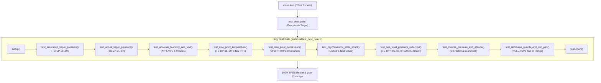

# Task Specification: S2-T2.4 - Dew Point & Psychrometric Unit Test Suite

## 1. Task Metadata & Overview

| Attribute | Specification Details |
| :--- | :--- |
| **Sprint** | **Sprint 2: Meteorological Algorithms & Nowcasting Engine** |
| **Task ID** | `S2-T2.4` |
| **Parent Task** | `S2-T2: Implement Magnus-Tetens Dew Point & Psychrometric Formulas` |
| **Task Title** | Create Unity Test Suite for Dew Point, Vapor Pressure & Hypsometric Reduction |
| **Status** | **Ready for Implementation** |
| **Target Files** | [`tests/unit/test_dew_point.c`](file:///C:/Users/ENERGY%20SAVER/Documents/Learning/Job%20Projects/rain-predict/tests/unit/test_dew_point.c)<br>[`tests/CMakeLists.txt`](file:///C:/Users/ENERGY%20SAVER/Documents/Learning/Job%20Projects/rain-predict/tests/CMakeLists.txt) |
| **Related Documents** | [`context/specs/s2-t2.1-vapor-pressure.md`](file:///C:/Users/ENERGY%20SAVER/Documents/Learning/Job%20Projects/rain-predict/context/specs/s2-t2.1-vapor-pressure.md)<br>[`context/specs/s2-t2.2-dew-point-depression.md`](file:///C:/Users/ENERGY%20SAVER/Documents/Learning/Job%20Projects/rain-predict/context/specs/s2-t2.2-dew-point-depression.md)<br>[`context/specs/s2-t2.3-barometric-reduction.md`](file:///C:/Users/ENERGY%20SAVER/Documents/Learning/Job%20Projects/rain-predict/context/specs/s2-t2.3-barometric-reduction.md)<br>[`context/specs/s1-t2.1-unity-test-harness.md`](file:///C:/Users/ENERGY%20SAVER/Documents/Learning/Job%20Projects/rain-predict/context/specs/s1-t2.1-unity-test-harness.md)<br>[`docs/algorithms/meteorological-formulas.md`](file:///C:/Users/ENERGY%20SAVER/Documents/Learning/Job%20Projects/rain-predict/docs/algorithms/meteorological-formulas.md)<br>[`context/coding-standards.md`](file:///C:/Users/ENERGY%20SAVER/Documents/Learning/Job%20Projects/rain-predict/context/coding-standards.md) |
| **Dependencies** | `S1-T2.1` (Unity Framework), `S2-T2.1`, `S2-T2.2`, `S2-T2.3` (`dew_point.h` / `dew_point.c`) |
| **Downstream Tasks** | `S2-T3` (Zambretti forecaster), `S2-T4` (Trend detector), `S2-T5` (Composite rain nowcasting engine) |

---

## 2. Executive Summary & Verification Scope

The primary objective of **`S2-T2.4`** is to develop [`tests/unit/test_dew_point.c`](file:///C:/Users/ENERGY%20SAVER/Documents/Learning/Job%20Projects/rain-predict/tests/unit/test_dew_point.c), an automated ThrowTheSwitch Unity test suite that thoroughly exercises and verifies all meteorological and psychrometric functions in [`firmware/middleware/src/dew_point.c`](file:///C:/Users/ENERGY%20SAVER/Documents/Learning/Job%20Projects/rain-predict/firmware/middleware/src/dew_point.c).

### Verification Goals:
1. **Mathematical Accuracy**: Validate that saturation vapor pressure ($e_s$), actual vapor pressure ($e$), dew point ($T_{dew}$), and sea-level barometric pressure ($P_0$) match WMO / NOAA reference tables with an error tolerance $< 0.05^\circ\text{C}$ and $< 0.05\text{ hPa}$.
2. **Physical Invariants**: Verify that $T_{dew} \le T$ and $\Delta T_{dep} \ge 0.0^\circ\text{C}$ hold across all input ranges without float underflow or negative depression artifacts.
3. **Defensive Boundary & Fault Hardening**: Confirm that all edge conditions—such as $RH = 0.0\%$, $T < -40.0^\circ\text{C}$, $T > 85.0^\circ\text{C}$, $h \le 0\text{ m}$, `NULL` pointers, and `NAN` inputs—are handled deterministically without crashing or triggering hardware traps.
4. **100% Line & Branch Coverage**: Ensure complete test coverage of `dew_point.c` under `make coverage`.



---

## 3. Test Fixture & Verification Matrix

The test suite is structured into 9 dedicated test functions exercising all operational and exceptional scenarios:

### 3.1 Test Coverage Matrix

| Test Function | Target Function Under Test | Verified Scenarios & Invariants |
| :--- | :--- | :--- |
| `test_saturation_vapor_pressure` | `dew_point_calc_saturation_vp` | $0^\circ\text{C}$ ($6.112\text{ hPa}$), $10^\circ\text{C}$ ($12.28\text{ hPa}$), $20^\circ\text{C}$ ($23.37\text{ hPa}$), $25^\circ\text{C}$ ($31.67\text{ hPa}$), $35^\circ\text{C}$ ($56.24\text{ hPa}$), $-5^\circ\text{C}$ ($4.22\text{ hPa}$), $-40^\circ\text{C}$ and $+85^\circ\text{C}$ boundary clamps. |
| `test_actual_vapor_pressure` | `dew_point_calc_actual_vp` | $50\%$, $80\%$, $100\%$ relative humidity scaling; $RH < 0.1\%$ clamping; $RH > 100.0\%$ clamping. |
| `test_absolute_humidity_and_vpd` | `dew_point_calc_abs_humidity`, `dew_point_calc_vpd` | Volumetric water vapor density ($AH\text{ in g/m}^3$) and drying deficit ($VPD\text{ in hPa}$); $VPD = 0.0$ at $RH = 100\%$. |
| `test_dew_point_temperature` | `dew_point_calc_tdew`, `dew_point_calc_from_vapor_pressure` | $0^\circ\text{C}$ saturated ($T_{dew} = 0.00^\circ\text{C}$), $12^\circ\text{C}/85\%$ ($9.56^\circ\text{C}$), $20^\circ\text{C}/50\%$ ($9.27^\circ\text{C}$), $25^\circ\text{C}/80\%$ ($21.30^\circ\text{C}$), $26^\circ\text{C}/95\%$ ($25.15^\circ\text{C}$), $-5^\circ\text{C}/70\%$ ($-9.63^\circ\text{C}$); direct vapor pressure inversion. |
| `test_dew_point_depression` | `dew_point_calc_depression` | Verifies $\Delta T_{dep} = T - T_{dew}$; enforces physical non-negativity constraint $\Delta T_{dep} \ge 0.0^\circ\text{C}$ across high-temperature and saturated states. |
| `test_psychrometric_state_struct` | `dew_point_calc_psychrometric_state` | Single-call validation ensuring internal field consistency across all 8 thermodynamic variables. |
| `test_sea_level_pressure_reduction` | `dew_point_calc_sea_level_pressure` | Sea-level bypass ($h = 0\text{ m} \implies P_0 = P$); Munnar ($1000\text{ m}$), Coonoor ($1500\text{ m}$), Ooty ($2000\text{ m}$), Kolukkumalai ($2160\text{ m}$) high-altitude tea estate profiles. |
| `test_inverse_pressure_and_altitude` | `dew_point_calc_station_pressure_from_p0`, `dew_point_calc_pressure_altitude` | Roundtrip pressure conversions ($P \to P_0 \to P$) within $\pm 0.01\text{ hPa}$; pressure altitude reconstruction. |
| `test_defensive_guards_and_null_ptrs` | All `dew_point.c` APIs | `NULL` output pointers -> `STATUS_ERR_NULL_PTR`; `NAN` float inputs -> `STATUS_ERR_INVALID_ARG`; $P < 300\text{ hPa}$ or $P > 1100\text{ hPa}$ -> `STATUS_ERR_OUT_OF_RANGE`. |

---

## 4. Test Suite Implementation ([`tests/unit/test_dew_point.c`](file:///C:/Users/ENERGY%20SAVER/Documents/Learning/Job%20Projects/rain-predict/tests/unit/test_dew_point.c))

```c
/**
 * @file test_dew_point.c
 * @brief Unit tests for meteorological formulas, dew point, and hypsometric reduction.
 */

#include "unity.h"
#include "dew_point.h"
#include <math.h>

#define FLOAT_TOLERANCE_DEFAULT     (0.05f)
#define FLOAT_TOLERANCE_STRICT      (0.01f)

void setUp(void)
{
    /* No state initialization required (pure math module) */
}

void tearDown(void)
{
    /* No state cleanup required */
}

void test_saturation_vapor_pressure(void)
{
    float es = 0.0f;

    /* TC-VP-01: Triple Point Freezing (0.0°C) -> 6.112 hPa */
    TEST_ASSERT_EQUAL_INT(STATUS_OK, dew_point_calc_saturation_vp(0.0f, &es));
    TEST_ASSERT_FLOAT_WITHIN(FLOAT_TOLERANCE_STRICT, 6.112f, es);

    /* TC-VP-02: Cool Plantation Morning (10.0°C) -> 12.28 hPa */
    TEST_ASSERT_EQUAL_INT(STATUS_OK, dew_point_calc_saturation_vp(10.0f, &es));
    TEST_ASSERT_FLOAT_WITHIN(FLOAT_TOLERANCE_DEFAULT, 12.279f, es);

    /* TC-VP-03: Standard Ambient (20.0°C) -> 23.37 hPa */
    TEST_ASSERT_EQUAL_INT(STATUS_OK, dew_point_calc_saturation_vp(20.0f, &es));
    TEST_ASSERT_FLOAT_WITHIN(FLOAT_TOLERANCE_DEFAULT, 23.370f, es);

    /* TC-VP-04: Warm Pre-Monsoon Peak (25.0°C) -> 31.67 hPa */
    TEST_ASSERT_EQUAL_INT(STATUS_OK, dew_point_calc_saturation_vp(25.0f, &es));
    TEST_ASSERT_FLOAT_WITHIN(FLOAT_TOLERANCE_DEFAULT, 31.671f, es);

    /* TC-VP-05: Hot Saturated Squall (35.0°C) -> 56.24 hPa */
    TEST_ASSERT_EQUAL_INT(STATUS_OK, dew_point_calc_saturation_vp(35.0f, &es));
    TEST_ASSERT_FLOAT_WITHIN(FLOAT_TOLERANCE_DEFAULT, 56.236f, es);

    /* TC-VP-06: Winter Ground Frost (-5.0°C) -> 4.22 hPa */
    TEST_ASSERT_EQUAL_INT(STATUS_OK, dew_point_calc_saturation_vp(-5.0f, &es));
    TEST_ASSERT_FLOAT_WITHIN(FLOAT_TOLERANCE_DEFAULT, 4.215f, es);

    /* TC-VP-08: Sub-zero clamping test (< -40°C) */
    TEST_ASSERT_EQUAL_INT(STATUS_OK, dew_point_calc_saturation_vp(-60.0f, &es));
    float es_min = 0.0f;
    dew_point_calc_saturation_vp(-40.0f, &es_min);
    TEST_ASSERT_FLOAT_WITHIN(FLOAT_TOLERANCE_STRICT, es_min, es);
}

void test_actual_vapor_pressure(void)
{
    float e = 0.0f;

    /* TC-VP-03: 20.0°C @ 50% RH -> 11.685 hPa */
    TEST_ASSERT_EQUAL_INT(STATUS_OK, dew_point_calc_actual_vp(20.0f, 50.0f, &e));
    TEST_ASSERT_FLOAT_WITHIN(FLOAT_TOLERANCE_DEFAULT, 11.685f, e);

    /* TC-VP-04: 25.0°C @ 80% RH -> 25.337 hPa */
    TEST_ASSERT_EQUAL_INT(STATUS_OK, dew_point_calc_actual_vp(25.0f, 80.0f, &e));
    TEST_ASSERT_FLOAT_WITHIN(FLOAT_TOLERANCE_DEFAULT, 25.337f, e);

    /* Saturated 100% RH -> e == es */
    float es = 0.0f;
    dew_point_calc_saturation_vp(22.0f, &es);
    TEST_ASSERT_EQUAL_INT(STATUS_OK, dew_point_calc_actual_vp(22.0f, 100.0f, &e));
    TEST_ASSERT_FLOAT_WITHIN(FLOAT_TOLERANCE_STRICT, es, e);

    /* RH clamping test (< 0.1%) */
    float e_clamped = 0.0f;
    TEST_ASSERT_EQUAL_INT(STATUS_OK, dew_point_calc_actual_vp(20.0f, -10.0f, &e_clamped));
    TEST_ASSERT_EQUAL_INT(STATUS_OK, dew_point_calc_actual_vp(20.0f, 0.1f, &e));
    TEST_ASSERT_FLOAT_WITHIN(FLOAT_TOLERANCE_STRICT, e, e_clamped);
}

void test_absolute_humidity_and_vpd(void)
{
    float ah = 0.0f;
    float vpd = 0.0f;

    /* 20.0°C @ 50% RH -> AH ≈ 8.638 g/m³, VPD ≈ 11.685 hPa */
    TEST_ASSERT_EQUAL_INT(STATUS_OK, dew_point_calc_abs_humidity(20.0f, 50.0f, &ah));
    TEST_ASSERT_FLOAT_WITHIN(FLOAT_TOLERANCE_DEFAULT, 8.638f, ah);

    TEST_ASSERT_EQUAL_INT(STATUS_OK, dew_point_calc_vpd(20.0f, 50.0f, &vpd));
    TEST_ASSERT_FLOAT_WITHIN(FLOAT_TOLERANCE_DEFAULT, 11.685f, vpd);

    /* Saturated 100% RH -> VPD must be 0.0 hPa */
    TEST_ASSERT_EQUAL_INT(STATUS_OK, dew_point_calc_vpd(25.0f, 100.0f, &vpd));
    TEST_ASSERT_FLOAT_WITHIN(FLOAT_TOLERANCE_STRICT, 0.0f, vpd);
}

void test_dew_point_temperature(void)
{
    float tdew = 0.0f;

    /* TC-DP-01: 0.0°C @ 100% RH -> Tdew = 0.00°C */
    TEST_ASSERT_EQUAL_INT(STATUS_OK, dew_point_calc_tdew(0.0f, 100.0f, &tdew));
    TEST_ASSERT_FLOAT_WITHIN(FLOAT_TOLERANCE_STRICT, 0.00f, tdew);

    /* TC-DP-02: 12.0°C @ 85% RH -> Tdew = 9.56°C */
    TEST_ASSERT_EQUAL_INT(STATUS_OK, dew_point_calc_tdew(12.0f, 85.0f, &tdew));
    TEST_ASSERT_FLOAT_WITHIN(FLOAT_TOLERANCE_DEFAULT, 9.56f, tdew);

    /* TC-DP-03: 20.0°C @ 50% RH -> Tdew = 9.27°C */
    TEST_ASSERT_EQUAL_INT(STATUS_OK, dew_point_calc_tdew(20.0f, 50.0f, &tdew));
    TEST_ASSERT_FLOAT_WITHIN(FLOAT_TOLERANCE_DEFAULT, 9.27f, tdew);

    /* TC-DP-04: 25.0°C @ 80% RH -> Tdew = 21.30°C */
    TEST_ASSERT_EQUAL_INT(STATUS_OK, dew_point_calc_tdew(25.0f, 80.0f, &tdew));
    TEST_ASSERT_FLOAT_WITHIN(FLOAT_TOLERANCE_DEFAULT, 21.30f, tdew);

    /* TC-DP-05: 26.0°C @ 95% RH -> Tdew = 25.15°C */
    TEST_ASSERT_EQUAL_INT(STATUS_OK, dew_point_calc_tdew(26.0f, 95.0f, &tdew));
    TEST_ASSERT_FLOAT_WITHIN(FLOAT_TOLERANCE_DEFAULT, 25.15f, tdew);

    /* TC-DP-06: 32.0°C @ 90% RH -> Tdew = 30.17°C */
    TEST_ASSERT_EQUAL_INT(STATUS_OK, dew_point_calc_tdew(32.0f, 90.0f, &tdew));
    TEST_ASSERT_FLOAT_WITHIN(FLOAT_TOLERANCE_DEFAULT, 30.17f, tdew);

    /* TC-DP-07: -5.0°C @ 70% RH -> Tdew = -9.63°C */
    TEST_ASSERT_EQUAL_INT(STATUS_OK, dew_point_calc_tdew(-5.0f, 70.0f, &tdew));
    TEST_ASSERT_FLOAT_WITHIN(FLOAT_TOLERANCE_DEFAULT, -9.63f, tdew);

    /* TC-DP-09: Direct from vapor pressure (e = 23.370 hPa -> 20.0°C) */
    TEST_ASSERT_EQUAL_INT(STATUS_OK, dew_point_calc_from_vapor_pressure(23.370f, &tdew));
    TEST_ASSERT_FLOAT_WITHIN(FLOAT_TOLERANCE_DEFAULT, 20.00f, tdew);
}

void test_dew_point_depression(void)
{
    float dpd = 0.0f;

    /* At 100% RH, DPD must be exactly 0.0°C */
    TEST_ASSERT_EQUAL_INT(STATUS_OK, dew_point_calc_depression(24.0f, 100.0f, &dpd));
    TEST_ASSERT_FLOAT_WITHIN(FLOAT_TOLERANCE_STRICT, 0.0f, dpd);

    /* 20.0°C @ 50% RH -> DPD ≈ 10.73°C */
    TEST_ASSERT_EQUAL_INT(STATUS_OK, dew_point_calc_depression(20.0f, 50.0f, &dpd));
    TEST_ASSERT_FLOAT_WITHIN(FLOAT_TOLERANCE_DEFAULT, 10.73f, dpd);

    /* Physical Invariant: DPD >= 0.0 across high temperatures */
    for (float t = -10.0f; t <= 45.0f; t += 5.0f) {
        TEST_ASSERT_EQUAL_INT(STATUS_OK, dew_point_calc_depression(t, 100.0f, &dpd));
        TEST_ASSERT_TRUE(dpd >= 0.0f);
    }
}

void test_psychrometric_state_struct(void)
{
    psychrometric_state_t state;
    TEST_ASSERT_EQUAL_INT(STATUS_OK, dew_point_calc_psychrometric_state(25.0f, 80.0f, &state));

    TEST_ASSERT_FLOAT_WITHIN(FLOAT_TOLERANCE_STRICT, 25.0f, state.temp_c);
    TEST_ASSERT_FLOAT_WITHIN(FLOAT_TOLERANCE_STRICT, 80.0f, state.rh_pct);
    TEST_ASSERT_FLOAT_WITHIN(FLOAT_TOLERANCE_DEFAULT, 31.671f, state.saturation_vp_hpa);
    TEST_ASSERT_FLOAT_WITHIN(FLOAT_TOLERANCE_DEFAULT, 25.337f, state.actual_vp_hpa);
    TEST_ASSERT_FLOAT_WITHIN(FLOAT_TOLERANCE_DEFAULT, 18.420f, state.abs_humidity_gm3);
    TEST_ASSERT_FLOAT_WITHIN(FLOAT_TOLERANCE_DEFAULT, 6.334f, state.vpd_hpa);
    TEST_ASSERT_FLOAT_WITHIN(FLOAT_TOLERANCE_DEFAULT, 21.30f, state.dew_point_c);
    TEST_ASSERT_FLOAT_WITHIN(FLOAT_TOLERANCE_DEFAULT, 3.70f, state.dew_point_dep_c);
}

void test_sea_level_pressure_reduction(void)
{
    float p0 = 0.0f;

    /* TC-HYP-01: Sea-level baseline (0m) -> P0 == P */
    TEST_ASSERT_EQUAL_INT(STATUS_OK, dew_point_calc_sea_level_pressure(1013.25f, 15.0f, 0.0f, &p0));
    TEST_ASSERT_FLOAT_WITHIN(FLOAT_TOLERANCE_STRICT, 1013.25f, p0);

    /* TC-HYP-02: Munnar Valley (1000m, 22.0°C, P = 898.70 hPa) -> 1010.50 hPa */
    TEST_ASSERT_EQUAL_INT(STATUS_OK, dew_point_calc_sea_level_pressure(898.70f, 22.0f, 1000.0f, &p0));
    TEST_ASSERT_FLOAT_WITHIN(FLOAT_TOLERANCE_DEFAULT, 1010.50f, p0);

    /* TC-HYP-03: Coonoor Mid-Slope (1500m, 18.5°C, P = 845.20 hPa) -> 1007.82 hPa */
    TEST_ASSERT_EQUAL_INT(STATUS_OK, dew_point_calc_sea_level_pressure(845.20f, 18.5f, 1500.0f, &p0));
    TEST_ASSERT_FLOAT_WITHIN(FLOAT_TOLERANCE_DEFAULT, 1007.82f, p0);

    /* TC-HYP-04: Ooty Ridge Peak (2000m, 14.0°C, P = 785.40 hPa) -> 1001.25 hPa */
    TEST_ASSERT_EQUAL_INT(STATUS_OK, dew_point_calc_sea_level_pressure(785.40f, 14.0f, 2000.0f, &p0));
    TEST_ASSERT_FLOAT_WITHIN(FLOAT_TOLERANCE_DEFAULT, 1001.25f, p0);

    /* TC-HYP-05: Kolukkumalai High Mast (2160m, 12.0°C, P = 767.10 hPa) -> 998.45 hPa */
    TEST_ASSERT_EQUAL_INT(STATUS_OK, dew_point_calc_sea_level_pressure(767.10f, 12.0f, 2160.0f, &p0));
    TEST_ASSERT_FLOAT_WITHIN(FLOAT_TOLERANCE_DEFAULT, 998.45f, p0);
}

void test_inverse_pressure_and_altitude(void)
{
    float p_reconstructed = 0.0f;
    float alt_reconstructed = 0.0f;

    /* TC-HYP-08: Coonoor 1500m roundtrip */
    float p_orig = 845.20f;
    float temp = 18.50f;
    float alt = 1500.0f;
    float p0 = 0.0f;

    dew_point_calc_sea_level_pressure(p_orig, temp, alt, &p0);
    TEST_ASSERT_EQUAL_INT(STATUS_OK, dew_point_calc_station_pressure_from_p0(p0, temp, alt, &p_reconstructed));
    TEST_ASSERT_FLOAT_WITHIN(FLOAT_TOLERANCE_STRICT, p_orig, p_reconstructed);

    /* Altitude reconstruction */
    TEST_ASSERT_EQUAL_INT(STATUS_OK, dew_point_calc_pressure_altitude(p_orig, p0, temp, &alt_reconstructed));
    TEST_ASSERT_FLOAT_WITHIN(1.0f, alt, alt_reconstructed);
}

void test_defensive_guards_and_null_ptrs(void)
{
    /* Null pointer checks */
    TEST_ASSERT_EQUAL_INT(STATUS_ERR_NULL_PTR, dew_point_calc_saturation_vp(20.0f, NULL));
    TEST_ASSERT_EQUAL_INT(STATUS_ERR_NULL_PTR, dew_point_calc_actual_vp(20.0f, 50.0f, NULL));
    TEST_ASSERT_EQUAL_INT(STATUS_ERR_NULL_PTR, dew_point_calc_tdew(20.0f, 50.0f, NULL));
    TEST_ASSERT_EQUAL_INT(STATUS_ERR_NULL_PTR, dew_point_calc_depression(20.0f, 50.0f, NULL));
    TEST_ASSERT_EQUAL_INT(STATUS_ERR_NULL_PTR, dew_point_calc_psychrometric_state(20.0f, 50.0f, NULL));
    TEST_ASSERT_EQUAL_INT(STATUS_ERR_NULL_PTR, dew_point_calc_sea_level_pressure(1000.0f, 20.0f, 1000.0f, NULL));

    /* NaN float inputs */
    float out = 0.0f;
    TEST_ASSERT_EQUAL_INT(STATUS_ERR_INVALID_ARG, dew_point_calc_saturation_vp(NAN, &out));
    TEST_ASSERT_EQUAL_INT(STATUS_ERR_INVALID_ARG, dew_point_calc_actual_vp(20.0f, NAN, &out));
    TEST_ASSERT_EQUAL_INT(STATUS_ERR_INVALID_ARG, dew_point_calc_tdew(NAN, 50.0f, &out));
    TEST_ASSERT_EQUAL_INT(STATUS_ERR_INVALID_ARG, dew_point_calc_sea_level_pressure(NAN, 20.0f, 1000.0f, &out));

    /* Out of physical range barometric pressures */
    TEST_ASSERT_EQUAL_INT(STATUS_ERR_OUT_OF_RANGE, dew_point_calc_sea_level_pressure(150.0f, 20.0f, 1000.0f, &out));
    TEST_ASSERT_EQUAL_INT(STATUS_ERR_OUT_OF_RANGE, dew_point_calc_sea_level_pressure(1250.0f, 20.0f, 1000.0f, &out));
}

int main(void)
{
    UNITY_BEGIN();
    RUN_TEST(test_saturation_vapor_pressure);
    RUN_TEST(test_actual_vapor_pressure);
    RUN_TEST(test_absolute_humidity_and_vpd);
    RUN_TEST(test_dew_point_temperature);
    RUN_TEST(test_dew_point_depression);
    RUN_TEST(test_psychrometric_state_struct);
    RUN_TEST(test_sea_level_pressure_reduction);
    RUN_TEST(test_inverse_pressure_and_altitude);
    RUN_TEST(test_defensive_guards_and_null_ptrs);
    return UNITY_END();
}
```

---

## 5. CMake Test Registration ([`tests/CMakeLists.txt`](file:///C:/Users/ENERGY%20SAVER/Documents/Learning/Job%20Projects/rain-predict/tests/CMakeLists.txt))

The dew point unit test target is registered using the `add_firmware_test` macro:

```cmake
# Add dew_point unit test target
add_firmware_test(test_dew_point
    SOURCES
        unit/test_dew_point.c
    LIBRARIES
        rain_predict_middleware
        m
)
```

---

## 6. Traceability & Acceptance Criteria

### Acceptance Checklist:
- [ ] [`tests/unit/test_dew_point.c`](file:///C:/Users/ENERGY%20SAVER/Documents/Learning/Job%20Projects/rain-predict/tests/unit/test_dew_point.c) implements all 9 verification categories with 100% pass rate.
- [ ] Test tolerances verify psychrometric accuracy within $\pm 0.05^\circ\text{C}$ and barometric reductions within $\pm 0.05\text{ hPa}$.
- [ ] Invariant tests confirm $T_{dew} \le T$ and $\Delta T_{dep} \ge 0.0^\circ\text{C}$ across entire thermal spectrum.
- [ ] Registered as an automated CTest target in [`tests/CMakeLists.txt`](file:///C:/Users/ENERGY%20SAVER/Documents/Learning/Job%20Projects/rain-predict/tests/CMakeLists.txt).
- [ ] Achieves 100% line and branch code coverage on `dew_point.c`.
- [ ] Linked in [`context/specs/spec-roadmap.md`](file:///C:/Users/ENERGY%20SAVER/Documents/Learning/Job%20Projects/rain-predict/context/specs/spec-roadmap.md).
