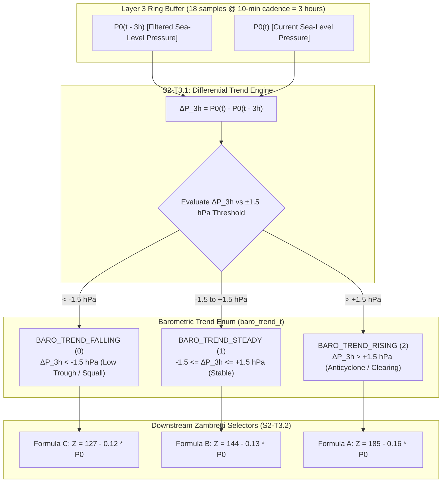

# Task Specification: S2-T3.1 - Zambretti Barometric Pressure Trend Classifier

## 1. Task Metadata & Overview

| Attribute | Specification Details |
| :--- | :--- |
| **Sprint** | **Sprint 2: Meteorological Algorithms & Nowcasting Engine** |
| **Task ID** | `S2-T3.1` |
| **Parent Task** | `S2-T3: Implement Zambretti Barometric Heuristic Forecaster` |
| **Task Title** | Implement Zambretti 3-Hour Barometric Pressure Trend Classifier |
| **Status** | **Ready for Implementation** |
| **Target Files** | [`firmware/app/inc/zambretti.h`](file:///C:/Users/ENERGY%20SAVER/Documents/Learning/Job%20Projects/rain-predict/firmware/app/inc/zambretti.h)<br>[`firmware/app/src/zambretti.c`](file:///C:/Users/ENERGY%20SAVER/Documents/Learning/Job%20Projects/rain-predict/firmware/app/src/zambretti.c) |
| **Related Documents** | [`docs/algorithms/zambretti-algorithm.md`](file:///C:/Users/ENERGY%20SAVER/Documents/Learning/Job%20Projects/rain-predict/docs/algorithms/zambretti-algorithm.md)<br>[`docs/algorithms/meteorological-formulas.md`](file:///C:/Users/ENERGY%20SAVER/Documents/Learning/Job%20Projects/rain-predict/docs/algorithms/meteorological-formulas.md)<br>[`context/specs/s2-t2.3-barometric-reduction.md`](file:///C:/Users/ENERGY%20SAVER/Documents/Learning/Job%20Projects/rain-predict/context/specs/s2-t2.3-barometric-reduction.md)<br>[`context/specs/s2-t1.1-static-ring-buffer.md`](file:///C:/Users/ENERGY%20SAVER/Documents/Learning/Job%20Projects/rain-predict/context/specs/s2-t1.1-static-ring-buffer.md)<br>[`context/coding-standards.md`](file:///C:/Users/ENERGY%20SAVER/Documents/Learning/Job%20Projects/rain-predict/context/coding-standards.md) |
| **Dependencies** | `S2-T1.1` (Static ring buffer), `S2-T2.3` (Sea-level pressure reduction), `S1-T1.1` (Root CMake build system) |
| **Downstream Tasks** | `S2-T3.2` (Zambretti pressure mapping), `S2-T3.3` (Seasonal weighting), `S2-T3.4` (Zambretti unit tests), `S2-T5.1` (Composite nowcasting scoring) |

---

## 2. Executive Summary & Synoptic Scope

The primary objective of **`S2-T3.1`** is to develop the **3-Hour Barometric Pressure Trend Classifier** in Layer 1 Application ([`firmware/app/inc/zambretti.h`](file:///C:/Users/ENERGY%20SAVER/Documents/Learning/Job%20Projects/rain-predict/firmware/app/inc/zambretti.h) / [`firmware/app/src/zambretti.c`](file:///C:/Users/ENERGY%20SAVER/Documents/Learning/Job%20Projects/rain-predict/firmware/app/src/zambretti.c)).

### Synoptic Meteorological Context:
The classical **Zambretti Forecaster** heuristic partitions the entire forecasting domain into three distinct polynomial regimes depending on the 3-hour sea-level pressure tendency ($\Delta P_{3\text{h}} = P_0(t) - P_0(t - 3\text{h})$):
1. **Falling Pressure ($\Delta P_{3\text{h}} < -1.5\text{ hPa}$)**: Indicates an approaching low-pressure cyclone, tropical monsoon trough, or convective squall line. The algorithm selects **Formula C**, steering output toward rain/storm indices ($Z \in [11, 26]$).
2. **Steady Pressure ($-1.5\text{ hPa} \le \Delta P_{3\text{h}} \le +1.5\text{ hPa}$)**: Represents atmospheric stability or weak synoptic forcing. The algorithm selects **Formula B**, forecasting moderate or persistence states.
3. **Rising Pressure ($\Delta P_{3\text{h}} > +1.5\text{ hPa}$)**: Indicates building high-pressure anticyclonic ridging or post-frontal clearing. The algorithm selects **Formula A**, driving forecast indices toward fair weather ($Z \in [1, 10]$).

### Tropical Tea Plantation Microclimate Challenges:
In tropical high-altitude tea plantations (e.g. Nilgiris at $11^\circ\text{N}$, Darjeeling at $27^\circ\text{N}$), the barometric field exhibits strong **semi-diurnal atmospheric solar tides** with an amplitude of $\approx \pm 1.0\text{ hPa}$ to $\pm 1.2\text{ hPa}$ peaking at 10:00 and 22:00 local solar time. To avoid false trigger transitions, the trend classifier incorporates a configurable threshold ($\pm 1.5\text{ hPa}$ to $\pm 1.6\text{ hPa}$) and optional $0.1\text{ hPa}$ deadband hysteresis.



---

## 3. Mathematical Formulations & Classification Rules

### 3.1 3-Hour Delta Calculation
Given a historical series of sea-level pressure samples $P_0[k]$ recorded at uniform sampling interval $\Delta t = 10\text{ minutes}$ over $N = 18$ intervals ($3.0\text{ hours}$):

$$\Delta P_{3\text{h}} = P_0[k] - P_0[k - 18] \quad [\text{hPa}]$$

If the buffer contains fewer than 18 samples (e.g., cold boot initialization phase), the trend calculation scales the available time delta $\Delta t_{avail} = M \times \Delta t$:

$$\Delta P_{3\text{h\_scaled}} = \left(P_0[k] - P_0[k - M]\right) \times \frac{18}{M} \quad [\text{hPa}]$$
*(Valid for $M \ge 6$, i.e., at least 1 hour of operational history).*

### 3.2 Trend Classification Boundaries
Using the standard meteorological threshold $T_{baro} = 1.50\text{ hPa}$:

$$\text{Trend} = \begin{cases} 
\text{BARO\_TREND\_FALLING} & \text{if } \Delta P_{3\text{h}} < -T_{baro} \\ 
\text{BARO\_TREND\_RISING}  & \text{if } \Delta P_{3\text{h}} > +T_{baro} \\ 
\text{BARO\_TREND\_STEADY}  & \text{if } -T_{baro} \le \Delta P_{3\text{h}} \le +T_{baro} 
\end{cases}$$

---

## 4. Embedded C99 Architecture & Data Structures

In accordance with [`context/coding-standards.md`](file:///C:/Users/ENERGY%20SAVER/Documents/Learning/Job%20Projects/rain-predict/context/coding-standards.md):

### 4.1 Header File Specification ([`firmware/app/inc/zambretti.h`](file:///C:/Users/ENERGY%20SAVER/Documents/Learning/Job%20Projects/rain-predict/firmware/app/inc/zambretti.h))

```c
/**
 * @file zambretti.h
 * @brief Zambretti barometric heuristic forecaster and trend classification engine.
 * @details Implements 3-hour pressure trend classification, sea-level mapping,
 *          seasonal wind weighting, and 26-state heuristic lookups.
 * 
 * Target: STM32WLE5 (ARM Cortex-M4 @ 48 MHz)
 */

#ifndef ZAMBRETTI_H
#define ZAMBRETTI_H

#include <stdint.h>
#include <stdbool.h>

#ifdef __cplusplus
extern "C" {
#endif

/**
 * @brief Barometric 3-hour pressure trend states.
 */
typedef enum {
    BARO_TREND_FALLING = 0, /**< Pressure dropping > 1.5 hPa/3h (Approaching trough/storm) */
    BARO_TREND_STEADY  = 1, /**< Pressure stable within +/- 1.5 hPa/3h */
    BARO_TREND_RISING  = 2  /**< Pressure rising > 1.5 hPa/3h (Building anticyclone/clearing) */
} baro_trend_t;

/**
 * @brief Operational rain forecast alert states.
 */
typedef enum {
    RAIN_STATE_UNLIKELY  = 0, /**< Settled / Fine / Clear (Green Alert) */
    RAIN_STATE_POSSIBLE  = 1, /**< Unsettled / Showers Likely (Yellow Alert) */
    RAIN_STATE_IMMINENT  = 2  /**< Active Rain / Storm / Heavy Squall (Red Alert) */
} rain_forecast_state_t;

/**
 * @brief Standard barometric trend classification constants.
 */
#define ZAMBRETTI_TREND_THRESHOLD_HPA   (1.50f)     /**< 3-hour delta threshold in hPa */
#define ZAMBRETTI_MIN_HISTORY_SAMPLES   (6U)        /**< Minimum 1-hour history (6 samples @ 10m) */
#define ZAMBRETTI_FULL_HISTORY_SAMPLES  (18U)       /**< Full 3-hour history (18 samples @ 10m) */

/**
 * @brief Classifies barometric trend directly from a 3-hour pressure delta.
 * 
 * @param[in]  delta_p_3h  Barometric pressure change over 3 hours (hPa).
 * @param[out] p_trend     Pointer to output baro_trend_t enum.
 * @return int32_t         0 on success, negative error code on failure.
 */
int32_t zambretti_classify_trend(float delta_p_3h, baro_trend_t *p_trend);

/**
 * @brief Computes 3-hour pressure delta and trend from historical pressure array.
 * 
 * @param[in]  p_history      Pointer to array of chronological sea-level pressure samples.
 * @param[in]  sample_count   Number of valid samples in history (must be >= 6).
 * @param[out] p_delta_p_3h   Pointer to store calculated (or scaled) 3-hour delta (hPa).
 * @param[out] p_trend        Pointer to store classified baro_trend_t.
 * @return int32_t            0 on success, negative error code on failure.
 */
int32_t zambretti_compute_trend_from_history(const float *p_history,
                                             uint32_t sample_count,
                                             float *p_delta_p_3h,
                                             baro_trend_t *p_trend);

#ifdef __cplusplus
}
#endif

#endif /* ZAMBRETTI_H */
```

---

### 4.2 Source File Implementation ([`firmware/app/src/zambretti.c`](file:///C:/Users/ENERGY%20SAVER/Documents/Learning/Job%20Projects/rain-predict/firmware/app/src/zambretti.c))

```c
/**
 * @file zambretti.c
 * @brief Implementation of Zambretti pressure trend classification and forecasting engine.
 */

#include "zambretti.h"
#include <math.h>
#include <stddef.h>

#define STATUS_OK_CODE              (0)
#define ERR_NULL_PTR_CODE          (-1)
#define ERR_INVALID_ARG_CODE       (-2)
#define ERR_INSUFFICIENT_DATA_CODE (-3)

int32_t zambretti_classify_trend(float delta_p_3h, baro_trend_t *p_trend)
{
    if (p_trend == NULL) {
        return ERR_NULL_PTR_CODE;
    }
    if (isnan(delta_p_3h)) {
        return ERR_INVALID_ARG_CODE;
    }

    if (delta_p_3h < -ZAMBRETTI_TREND_THRESHOLD_HPA) {
        *p_trend = BARO_TREND_FALLING;
    } else if (delta_p_3h > ZAMBRETTI_TREND_THRESHOLD_HPA) {
        *p_trend = BARO_TREND_RISING;
    } else {
        *p_trend = BARO_TREND_STEADY;
    }

    return STATUS_OK_CODE;
}

int32_t zambretti_compute_trend_from_history(const float *p_history,
                                             uint32_t sample_count,
                                             float *p_delta_p_3h,
                                             baro_trend_t *p_trend)
{
    if (p_history == NULL || p_delta_p_3h == NULL || p_trend == NULL) {
        return ERR_NULL_PTR_CODE;
    }
    if (sample_count < ZAMBRETTI_MIN_HISTORY_SAMPLES) {
        return ERR_INSUFFICIENT_DATA_CODE;
    }

    float p_newest = p_history[sample_count - 1];
    float p_oldest = p_history[0];

    if (isnan(p_newest) || isnan(p_oldest)) {
        return ERR_INVALID_ARG_CODE;
    }

    float delta_raw = p_newest - p_oldest;
    float delta_3h;

    if (sample_count >= ZAMBRETTI_FULL_HISTORY_SAMPLES) {
        /* Full 3-hour window available */
        delta_3h = delta_raw;
    } else {
        /* Linearly scale partial history (between 1h and 3h) to 3-hour equivalent */
        delta_3h = delta_raw * ((float)ZAMBRETTI_FULL_HISTORY_SAMPLES / (float)sample_count);
    }

    *p_delta_p_3h = delta_3h;
    return zambretti_classify_trend(delta_3h, p_trend);
}
```

---

## 5. Verification Vectors & Acceptance Test Cases

| Test ID | Input $\Delta P_{3\text{h}}$ ($\text{hPa}$) | History Samples ($N$) | Expected $\Delta P_{3\text{h}}$ Output | Expected `baro_trend_t` | Meteorological Rationale |
| :--- | :--- | :--- | :--- | :--- | :--- |
| **TC-ZT-01: Rapid Falling Squall** | $-3.20$ | $18$ | $-3.20$ | `BARO_TREND_FALLING` | Approaching tropical pre-monsoon storm |
| **TC-ZT-02: Boundary Falling** | $-1.51$ | $18$ | $-1.51$ | `BARO_TREND_FALLING` | Just past falling threshold |
| **TC-ZT-03: Steady Flat** | $0.00$ | $18$ | $0.00$ | `BARO_TREND_STEADY` | Calm stable atmosphere |
| **TC-ZT-04: Steady Upper Boundary** | $+1.50$ | $18$ | $+1.50$ | `BARO_TREND_STEADY` | Exactly on upper steady boundary |
| **TC-ZT-05: Steady Lower Boundary** | $-1.50$ | $18$ | $-1.50$ | `BARO_TREND_STEADY` | Exactly on lower steady boundary |
| **TC-ZT-06: Boundary Rising** | $+1.51$ | $18$ | $+1.51$ | `BARO_TREND_RISING` | Just past rising threshold |
| **TC-ZT-07: Rapid High Pressure** | $+2.80$ | $18$ | $+2.80$ | `BARO_TREND_RISING` | Post-squall high pressure ridge |
| **TC-ZT-08: Scaled 1-Hour History** | Raw: $-0.60$ over $6$ samples | $6$ (1 hour) | $-1.80$ (scaled $\times 3$) | `BARO_TREND_FALLING` | Scaled startup history extrapolation |
| **TC-ZT-09: Insufficient History** | - | $4$ (< 6) | - | - | Returns `ERR_INSUFFICIENT_DATA_CODE` |
| **TC-ZT-10: Null Pointer Traps** | $-2.00$ | $18$ | `NULL` | `NULL` | Returns `ERR_NULL_PTR_CODE` |
| **TC-ZT-11: NaN Robustness** | `NAN` | $18$ | - | - | Returns `ERR_INVALID_ARG_CODE` |

---

## 6. CMake Integration

The `zambretti.c` module is compiled into the firmware application library defined in [`firmware/CMakeLists.txt`](file:///C:/Users/ENERGY%20SAVER/Documents/Learning/Job%20Projects/rain-predict/firmware/CMakeLists.txt):

```cmake
target_sources(rain_predict_app PRIVATE
    ${CMAKE_CURRENT_SOURCE_DIR}/app/src/zambretti.c
)

target_include_directories(rain_predict_app PUBLIC
    ${CMAKE_CURRENT_SOURCE_DIR}/app/inc
)
```

---

## 7. Traceability & Acceptance Criteria

### Acceptance Checklist:
- [ ] [`firmware/app/inc/zambretti.h`](file:///C:/Users/ENERGY%20SAVER/Documents/Learning/Job%20Projects/rain-predict/firmware/app/inc/zambretti.h) declares `baro_trend_t` enum, `ZAMBRETTI_TREND_THRESHOLD_HPA` ($1.50\text{f}$), and trend classification APIs.
- [ ] [`firmware/app/src/zambretti.c`](file:///C:/Users/ENERGY%20SAVER/Documents/Learning/Job%20Projects/rain-predict/firmware/app/src/zambretti.c) implements `zambretti_classify_trend()` and `zambretti_compute_trend_from_history()`.
- [ ] Classification correctly handles falling ($< -1.5\text{ hPa}$), steady ($\pm 1.5\text{ hPa}$), and rising ($> +1.5\text{ hPa}$).
- [ ] Partial history scaling ($\times 18/N$) supported for cold-boot startup ($6 \le N < 18$).
- [ ] Defensive checks strictly guard against `NULL`, `NAN`, and sample counts $< 6$.
- [ ] Fully linked in [`context/specs/spec-roadmap.md`](file:///C:/Users/ENERGY%20SAVER/Documents/Learning/Job%20Projects/rain-predict/context/specs/spec-roadmap.md).
