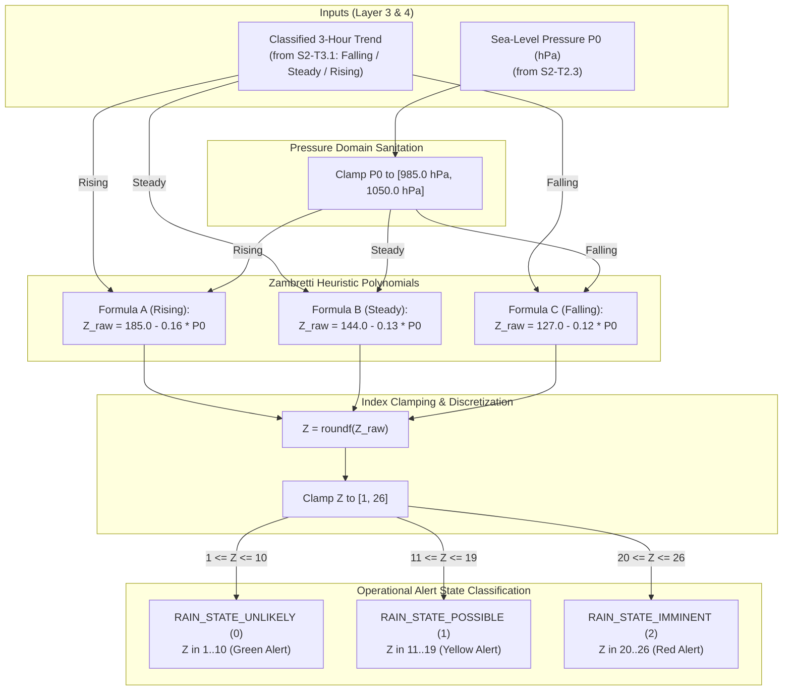

# Task Specification: S2-T3.2 - Zambretti Sea-Level Pressure Mapping & Heuristic Formulas

## 1. Task Metadata & Overview

| Attribute | Specification Details |
| :--- | :--- |
| **Sprint** | **Sprint 2: Meteorological Algorithms & Nowcasting Engine** |
| **Task ID** | `S2-T3.2` |
| **Parent Task** | `S2-T3: Implement Zambretti Barometric Heuristic Forecaster` |
| **Task Title** | Implement Zambretti Sea-Level Pressure Polynomial Mapping & Range Clamping |
| **Status** | **Ready for Implementation** |
| **Target Files** | [`firmware/app/inc/zambretti.h`](file:///C:/Users/ENERGY%20SAVER/Documents/Learning/Job%20Projects/rain-predict/firmware/app/inc/zambretti.h)<br>[`firmware/app/src/zambretti.c`](file:///C:/Users/ENERGY%20SAVER/Documents/Learning/Job%20Projects/rain-predict/firmware/app/src/zambretti.c) |
| **Related Documents** | [`docs/algorithms/zambretti-algorithm.md`](file:///C:/Users/ENERGY%20SAVER/Documents/Learning/Job%20Projects/rain-predict/docs/algorithms/zambretti-algorithm.md)<br>[`context/specs/s2-t3.1-zambretti-trend.md`](file:///C:/Users/ENERGY%20SAVER/Documents/Learning/Job%20Projects/rain-predict/context/specs/s2-t3.1-zambretti-trend.md)<br>[`context/specs/s2-t2.3-barometric-reduction.md`](file:///C:/Users/ENERGY%20SAVER/Documents/Learning/Job%20Projects/rain-predict/context/specs/s2-t2.3-barometric-reduction.md)<br>[`docs/algorithms/meteorological-formulas.md`](file:///C:/Users/ENERGY%20SAVER/Documents/Learning/Job%20Projects/rain-predict/docs/algorithms/meteorological-formulas.md)<br>[`context/coding-standards.md`](file:///C:/Users/ENERGY%20SAVER/Documents/Learning/Job%20Projects/rain-predict/context/coding-standards.md) |
| **Dependencies** | `S2-T3.1` (Zambretti trend classifier), `S2-T2.3` (Sea-level pressure reduction), `S1-T1.1` (Root CMake build system) |
| **Downstream Tasks** | `S2-T3.3` (Seasonal wind lookups), `S2-T3.4` (Zambretti unit tests), `S2-T5.1` (Composite nowcaster scoring) |

---

## 2. Executive Summary & Algorithmic Scope

The primary objective of **`S2-T3.2`** is to implement the **Zambretti Empirical Pressure Mapping Formulas and 26-State Range Clamping** in Layer 1 Application ([`firmware/app/inc/zambretti.h`](file:///C:/Users/ENERGY%20SAVER/Documents/Learning/Job%20Projects/rain-predict/firmware/app/inc/zambretti.h) / [`firmware/app/src/zambretti.c`](file:///C:/Users/ENERGY%20SAVER/Documents/Learning/Job%20Projects/rain-predict/firmware/app/src/zambretti.c)).

### Algorithmic Purpose:
The Negretti & Zambra heuristic maps the sea-level equivalent pressure ($P_0 \in [985.0\text{ hPa}, 1050.0\text{ hPa}]$) into a discrete integer index $Z \in [1, 26]$ through three distinct empirical polynomials selected by the 3-hour pressure trend ($\Delta P_{3\text{h}}$):
1. **Rising Pressure (Formula A)**: $Z_{raw} = 185.0 - 0.16 \times P_0$.
2. **Steady Pressure (Formula B)**: $Z_{raw} = 144.0 - 0.13 \times P_0$.
3. **Falling Pressure (Formula C)**: $Z_{raw} = 127.0 - 0.12 \times P_0$.

The raw continuous value $Z_{raw}$ is rounded to the nearest integer, strictly bounded to $1 \le Z \le 26$, and partitioned into 3 actionable plantation operational alert states:
- **`RAIN_STATE_UNLIKELY` ($1 \le Z \le 10$)**: Green Alert - Settled fair weather, optimal for plucking and field work.
- **`RAIN_STATE_POSSIBLE` ($11 \le Z \le 19$)**: Yellow Alert - Unsettled conditions, cloud cover building, isolated showers possible.
- **`RAIN_STATE_IMMINENT` ($20 \le Z \le 26$)**: Red Alert - Active storm fronts, heavy rainfall, high probability of precipitation.



---

## 3. Mathematical Formulations & Mapping Rules

### 3.1 Sea-Level Pressure Range Boundaries
Standard terrestrial sea-level barometric pressure span:

$$P_{min} = 985.0\text{ hPa} \quad \le \quad P_0 \quad \le \quad P_{max} = 1050.0\text{ hPa}$$

- If $P_0 < 985.0\text{ hPa}$ (e.g. tropical cyclone eye or severe depression), $P_0$ is clamped to $985.0\text{ hPa}$ to prevent out-of-bounds polynomial underflow.
- If $P_0 > 1050.0\text{ hPa}$ (e.g. intense continental anticyclone), $P_0$ is clamped to $1050.0\text{ hPa}$.

---

### 3.2 Trend-Selected Empirical Polynomials

$$\begin{aligned}
\text{Formula A (Rising Trend)}: \quad & Z_{raw} = 185.0\text{f} - (0.16\text{f} \times P_0) \\
\text{Formula B (Steady Trend)}: \quad & Z_{raw} = 144.0\text{f} - (0.13\text{f} \times P_0) \\
\text{Formula C (Falling Trend)}: \quad & Z_{raw} = 127.0\text{f} - (0.12\text{f} \times P_0)
\end{aligned}$$

#### Discretization & Integer Bounding:

$$Z = \text{clamp}\left(\left\lfloor Z_{raw} + 0.5\text{f} \right\rfloor, \, 1, \, 26\right)$$

---

### 3.3 The 26 Meteorological Zambretti States & Text Descriptors

| Index ($Z$) | Meteorological Description | Operational State | Code Identifier |
| :---: | :--- | :---: | :--- |
| **1** | Settled Fine Weather | `RAIN_STATE_UNLIKELY` | `ZAMBRETTI_TXT_SETTLED_FINE` |
| **2** | Fine Weather | `RAIN_STATE_UNLIKELY` | `ZAMBRETTI_TXT_FINE` |
| **3** | Becoming Fine | `RAIN_STATE_UNLIKELY` | `ZAMBRETTI_TXT_BECOMING_FINE` |
| **4** | Fine, Becoming Less Settled | `RAIN_STATE_UNLIKELY` | `ZAMBRETTI_TXT_FINE_LESS_SETTLED` |
| **5** | Fine, Possible Showers | `RAIN_STATE_UNLIKELY` | `ZAMBRETTI_TXT_FINE_POSSIBLE_SHOWERS` |
| **6** | Fairly Fine, Improving | `RAIN_STATE_UNLIKELY` | `ZAMBRETTI_TXT_FAIRLY_FINE_IMPROVING` |
| **7** | Fairly Fine, Possible Showers Early | `RAIN_STATE_UNLIKELY` | `ZAMBRETTI_TXT_FAIRLY_FINE_EARLY_SHOWERS` |
| **8** | Fairly Fine, Showers Later | `RAIN_STATE_UNLIKELY` | `ZAMBRETTI_TXT_FAIRLY_FINE_LATER_SHOWERS` |
| **9** | Showery Early, Improving | `RAIN_STATE_UNLIKELY` | `ZAMBRETTI_TXT_SHOWERY_EARLY_IMPROVING` |
| **10** | Changeable, Mending | `RAIN_STATE_UNLIKELY` | `ZAMBRETTI_TXT_CHANGEABLE_MENDING` |
| **11** | Fairly Fine, Showers Likely | `RAIN_STATE_POSSIBLE` | `ZAMBRETTI_TXT_FAIRLY_FINE_SHOWERS_LIKELY` |
| **12** | Rather Unsettled, Clearing Later | `RAIN_STATE_POSSIBLE` | `ZAMBRETTI_TXT_UNSETTLED_CLEARING_LATER` |
| **13** | Unsettled, Probably Improving | `RAIN_STATE_POSSIBLE` | `ZAMBRETTI_TXT_UNSETTLED_PROBABLY_IMPROVING` |
| **14** | Showery, Bright Intervals | `RAIN_STATE_POSSIBLE` | `ZAMBRETTI_TXT_SHOWERY_BRIGHT_INTERVALS` |
| **15** | Showery, Becoming More Unsettled | `RAIN_STATE_POSSIBLE` | `ZAMBRETTI_TXT_SHOWERY_BECOMING_MORE_UNSETTLED` |
| **16** | Changeable, Some Rain | `RAIN_STATE_POSSIBLE` | `ZAMBRETTI_TXT_CHANGEABLE_SOME_RAIN` |
| **17** | Unsettled, Short Fine Intervals | `RAIN_STATE_POSSIBLE` | `ZAMBRETTI_TXT_UNSETTLED_SHORT_FINE_INTERVALS` |
| **18** | Unsettled, Rain Later | `RAIN_STATE_POSSIBLE` | `ZAMBRETTI_TXT_UNSETTLED_RAIN_LATER` |
| **19** | Unsettled, Some Rain | `RAIN_STATE_POSSIBLE` | `ZAMBRETTI_TXT_UNSETTLED_SOME_RAIN` |
| **20** | Mostly Very Unsettled | `RAIN_STATE_IMMINENT` | `ZAMBRETTI_TXT_MOSTLY_VERY_UNSETTLED` |
| **21** | Occasional Rain, Worsening | `RAIN_STATE_IMMINENT` | `ZAMBRETTI_TXT_OCCASIONAL_RAIN_WORSENING` |
| **22** | Rain at Times, Very Unsettled | `RAIN_STATE_IMMINENT` | `ZAMBRETTI_TXT_RAIN_AT_TIMES_VERY_UNSETTLED` |
| **23** | Rain at Frequent Intervals | `RAIN_STATE_IMMINENT` | `ZAMBRETTI_TXT_RAIN_FREQUENT_INTERVALS` |
| **24** | Rain, Very Unsettled | `RAIN_STATE_IMMINENT` | `ZAMBRETTI_TXT_RAIN_VERY_UNSETTLED` |
| **25** | Stormy, Much Rain | `RAIN_STATE_IMMINENT` | `ZAMBRETTI_TXT_STORMY_MUCH_RAIN` |
| **26** | Severe Storm, Heavy Rain | `RAIN_STATE_IMMINENT` | `ZAMBRETTI_TXT_SEVERE_STORM_HEAVY_RAIN` |

---

## 4. Embedded C99 Architecture & API Design

In accordance with [`context/coding-standards.md`](file:///C:/Users/ENERGY%20SAVER/Documents/Learning/Job%20Projects/rain-predict/context/coding-standards.md):

### 4.1 Additions to Header File ([`firmware/app/inc/zambretti.h`](file:///C:/Users/ENERGY%20SAVER/Documents/Learning/Job%20Projects/rain-predict/firmware/app/inc/zambretti.h))

```c
/**
 * @brief Pressure clamping constants for Zambretti polynomials.
 */
#define ZAMBRETTI_P0_MIN_HPA            (985.0f)    /**< Lowest nominal sea-level pressure */
#define ZAMBRETTI_P0_MAX_HPA            (1050.0f)   /**< Highest nominal sea-level pressure */

/**
 * @brief Zambretti index bounds.
 */
#define ZAMBRETTI_INDEX_MIN             (1U)        /**< Settled Fine Weather */
#define ZAMBRETTI_INDEX_MAX             (26U)       /**< Severe Storm, Heavy Rain */

/**
 * @brief Operational alert threshold partitions.
 */
#define ZAMBRETTI_ALERT_UNLIKELY_MAX    (10U)       /**< Z <= 10 -> RAIN_STATE_UNLIKELY */
#define ZAMBRETTI_ALERT_POSSIBLE_MAX    (19U)       /**< 11 <= Z <= 19 -> RAIN_STATE_POSSIBLE */

/**
 * @brief Calculates raw continuous Zambretti index from P0 and classified trend.
 * 
 * @param[in]  p0_hpa     Sea-level equivalent pressure in hPa.
 * @param[in]  trend      Classified barometric trend (FALLING, STEADY, RISING).
 * @param[out] p_z_raw    Pointer to store raw continuous index value.
 * @return int32_t        0 on success, negative error code on failure.
 */
int32_t zambretti_calc_raw_index(float p0_hpa, baro_trend_t trend, float *p_z_raw);

/**
 * @brief Maps sea-level pressure and trend to a discrete Zambretti index (1 to 26).
 * 
 * @param[in]  p0_hpa     Sea-level equivalent pressure in hPa.
 * @param[in]  trend      Classified barometric trend.
 * @param[out] p_z_index  Pointer to store discrete integer index (1 to 26).
 * @return int32_t        0 on success, negative error code on failure.
 */
int32_t zambretti_map_to_index(float p0_hpa, baro_trend_t trend, uint8_t *p_z_index);

/**
 * @brief Maps a discrete Zambretti index (1..26) to an operational alert state.
 * 
 * @param[in]  z_index    Discrete Zambretti index (1 to 26).
 * @return rain_forecast_state_t Evaluated alert state (UNLIKELY, POSSIBLE, IMMINENT).
 */
rain_forecast_state_t zambretti_map_to_state(uint8_t z_index);

/**
 * @brief Returns English descriptive forecast string for a given Zambretti index.
 * 
 * @param[in]  z_index    Discrete Zambretti index (1 to 26).
 * @return const char*    Pointer to flash-resident null-terminated string descriptor.
 */
const char *zambretti_get_forecast_text(uint8_t z_index);

/**
 * @brief Full end-to-end Zambretti forecast calculation.
 * 
 * @param[in]  p0_hpa       Current sea-level pressure (hPa).
 * @param[in]  delta_p_3h   Pressure change over 3 hours (hPa).
 * @param[out] p_z_index    Optional pointer to receive discrete index (1..26).
 * @param[out] p_state      Optional pointer to receive operational forecast state.
 * @return int32_t          0 on success, negative error code on failure.
 */
int32_t zambretti_calculate(float p0_hpa,
                            float delta_p_3h,
                            uint8_t *p_z_index,
                            rain_forecast_state_t *p_state);
```

---

### 4.2 Additions to Source File ([`firmware/app/src/zambretti.c`](file:///C:/Users/ENERGY%20SAVER/Documents/Learning/Job%20Projects/rain-predict/firmware/app/src/zambretti.c))

```c
static const char * const s_zambretti_descriptions[26] = {
    "Settled Fine Weather",                 /* 1 */
    "Fine Weather",                         /* 2 */
    "Becoming Fine",                        /* 3 */
    "Fine, Becoming Less Settled",          /* 4 */
    "Fine, Possible Showers",               /* 5 */
    "Fairly Fine, Improving",               /* 6 */
    "Fairly Fine, Possible Showers Early",  /* 7 */
    "Fairly Fine, Showers Later",           /* 8 */
    "Showery Early, Improving",             /* 9 */
    "Changeable, Mending",                  /* 10 */
    "Fairly Fine, Showers Likely",          /* 11 */
    "Rather Unsettled, Clearing Later",     /* 12 */
    "Unsettled, Probably Improving",        /* 13 */
    "Showery, Bright Intervals",            /* 14 */
    "Showery, Becoming More Unsettled",     /* 15 */
    "Changeable, Some Rain",                /* 16 */
    "Unsettled, Short Fine Intervals",      /* 17 */
    "Unsettled, Rain Later",                /* 18 */
    "Unsettled, Some Rain",                 /* 19 */
    "Mostly Very Unsettled",                /* 20 */
    "Occasional Rain, Worsening",           /* 21 */
    "Rain at Times, Very Unsettled",        /* 22 */
    "Rain at Frequent Intervals",           /* 23 */
    "Rain, Very Unsettled",                 /* 24 */
    "Stormy, Much Rain",                    /* 25 */
    "Severe Storm, Heavy Rain"              /* 26 */
};

int32_t zambretti_calc_raw_index(float p0_hpa, baro_trend_t trend, float *p_z_raw)
{
    if (p_z_raw == NULL) {
        return ERR_NULL_PTR_CODE;
    }
    if (isnan(p0_hpa)) {
        return ERR_INVALID_ARG_CODE;
    }

    /* Clamp P0 to nominal meteorological boundaries */
    float p0 = p0_hpa;
    if (p0 < ZAMBRETTI_P0_MIN_HPA) {
        p0 = ZAMBRETTI_P0_MIN_HPA;
    } else if (p0 > ZAMBRETTI_P0_MAX_HPA) {
        p0 = ZAMBRETTI_P0_MAX_HPA;
    }

    switch (trend) {
        case BARO_TREND_RISING:
            /* Formula A: Z = 185 - 0.16 * P0 */
            *p_z_raw = 185.0f - (0.16f * p0);
            break;

        case BARO_TREND_STEADY:
            /* Formula B: Z = 144 - 0.13 * P0 */
            *p_z_raw = 144.0f - (0.13f * p0);
            break;

        case BARO_TREND_FALLING:
            /* Formula C: Z = 127 - 0.12 * P0 */
            *p_z_raw = 127.0f - (0.12f * p0);
            break;

        default:
            return ERR_INVALID_ARG_CODE;
    }

    return STATUS_OK_CODE;
}

int32_t zambretti_map_to_index(float p0_hpa, baro_trend_t trend, uint8_t *p_z_index)
{
    if (p_z_index == NULL) {
        return ERR_NULL_PTR_CODE;
    }

    float z_raw = 0.0f;
    int32_t ret = zambretti_calc_raw_index(p0_hpa, trend, &z_raw);
    if (ret != STATUS_OK_CODE) {
        return ret;
    }

    int32_t z_int = (int32_t)roundf(z_raw);
    if (z_int < (int32_t)ZAMBRETTI_INDEX_MIN) {
        z_int = (int32_t)ZAMBRETTI_INDEX_MIN;
    } else if (z_int > (int32_t)ZAMBRETTI_INDEX_MAX) {
        z_int = (int32_t)ZAMBRETTI_INDEX_MAX;
    }

    *p_z_index = (uint8_t)z_int;
    return STATUS_OK_CODE;
}

rain_forecast_state_t zambretti_map_to_state(uint8_t z_index)
{
    if (z_index <= ZAMBRETTI_ALERT_UNLIKELY_MAX) {
        return RAIN_STATE_UNLIKELY;
    } else if (z_index <= ZAMBRETTI_ALERT_POSSIBLE_MAX) {
        return RAIN_STATE_POSSIBLE;
    } else {
        return RAIN_STATE_IMMINENT;
    }
}

const char *zambretti_get_forecast_text(uint8_t z_index)
{
    if (z_index < ZAMBRETTI_INDEX_MIN || z_index > ZAMBRETTI_INDEX_MAX) {
        return "Unknown Zambretti Index";
    }
    return s_zambretti_descriptions[z_index - 1U];
}

int32_t zambretti_calculate(float p0_hpa,
                            float delta_p_3h,
                            uint8_t *p_z_index,
                            rain_forecast_state_t *p_state)
{
    baro_trend_t trend = BARO_TREND_STEADY;
    int32_t ret = zambretti_classify_trend(delta_p_3h, &trend);
    if (ret != STATUS_OK_CODE) {
        return ret;
    }

    uint8_t z = 0U;
    ret = zambretti_map_to_index(p0_hpa, trend, &z);
    if (ret != STATUS_OK_CODE) {
        return ret;
    }

    if (p_z_index != NULL) {
        *p_z_index = z;
    }
    if (p_state != NULL) {
        *p_state = zambretti_map_to_state(z);
    }

    return STATUS_OK_CODE;
}
```

---

## 5. Verification Vectors & Acceptance Test Cases

| Test ID | Input $P_0$ ($\text{hPa}$) | Trend Category | Formula Evaluated | Raw $Z_{raw}$ | Clamped $Z$ Index | Expected Alert State |
| :--- | :--- | :--- | :--- | :--- | :--- | :--- |
| **TC-ZM-01: Severe Storm Drop** | $985.0$ | `BARO_TREND_FALLING` | Formula C: $127 - 0.12 \times 985$ | $8.80$ | $9$ | `RAIN_STATE_UNLIKELY` |
| **TC-ZM-02: Standard Ambient Steady** | $1013.25$ | `BARO_TREND_STEADY` | Formula B: $144 - 0.13 \times 1013.25$ | $12.28$ | $12$ | `RAIN_STATE_POSSIBLE` |
| **TC-ZM-03: Low Pressure Steady** | $990.0$ | `BARO_TREND_STEADY` | Formula B: $144 - 0.13 \times 990$ | $15.30$ | $15$ | `RAIN_STATE_POSSIBLE` |
| **TC-ZM-04: High Anticyclone Rising** | $1040.0$ | `BARO_TREND_RISING` | Formula A: $185 - 0.16 \times 1040$ | $18.60$ | $19$ | `RAIN_STATE_POSSIBLE` |
| **TC-ZM-05: Peak Anticyclone Rising** | $1050.0$ | `BARO_TREND_RISING` | Formula A: $185 - 0.16 \times 1050$ | $17.00$ | $17$ | `RAIN_STATE_POSSIBLE` |
| **TC-ZM-06: Extreme Low Clamp** | $950.0$ (< 985) | `BARO_TREND_FALLING` | Clamped to $985.0$ | $8.80$ | $9$ | `RAIN_STATE_UNLIKELY` |
| **TC-ZM-07: Extreme High Clamp** | $1080.0$ (> 1050) | `BARO_TREND_RISING` | Clamped to $1050.0$ | $17.00$ | $17$ | `RAIN_STATE_POSSIBLE` |
| **TC-ZM-08: Alert State Mapping** | - | - | $Z = 5$ | - | $5$ | `RAIN_STATE_UNLIKELY` (0) |
| **TC-ZM-09: Alert State Mapping** | - | - | $Z = 15$ | - | $15$ | `RAIN_STATE_POSSIBLE` (1) |
| **TC-ZM-10: Alert State Mapping** | - | - | $Z = 24$ | - | $24$ | `RAIN_STATE_IMMINENT` (2) |
| **TC-ZM-11: String Descriptor Lookup** | - | - | $Z = 26$ | - | $26$ | `"Severe Storm, Heavy Rain"` |
| **TC-ZM-12: Null Output Pointers** | $1013.25$ | `BARO_TREND_STEADY` | - | - | - | Returns `ERR_NULL_PTR_CODE` |

---

## 6. Traceability & Acceptance Criteria

### Acceptance Checklist:
- [ ] [`firmware/app/inc/zambretti.h`](file:///C:/Users/ENERGY%20SAVER/Documents/Learning/Job%20Projects/rain-predict/firmware/app/inc/zambretti.h) declares `zambretti_calc_raw_index()`, `zambretti_map_to_index()`, `zambretti_map_to_state()`, `zambretti_get_forecast_text()`, and `zambretti_calculate()`.
- [ ] [`firmware/app/src/zambretti.c`](file:///C:/Users/ENERGY%20SAVER/Documents/Learning/Job%20Projects/rain-predict/firmware/app/src/zambretti.c) implements Formulas A, B, and C with single-precision floating point operations.
- [ ] Input $P_0$ is clamped within $[985.0\text{ hPa}, 1050.0\text{ hPa}]$ and output index clamped within $[1, 26]$.
- [ ] Operational alert states correctly partitioned: $Z \le 10 \to \text{UNLIKELY}$, $11 \le Z \le 19 \to \text{POSSIBLE}$, $Z \ge 20 \to \text{IMMINENT}$.
- [ ] Flash-resident English string table provides descriptions for all 26 Zambretti index codes.
- [ ] Zero dynamic memory allocation and execution cycle count $< 200$ CPU cycles @ 48 MHz.
- [ ] Fully linked in [`context/specs/spec-roadmap.md`](file:///C:/Users/ENERGY%20SAVER/Documents/Learning/Job%20Projects/rain-predict/context/specs/spec-roadmap.md).
