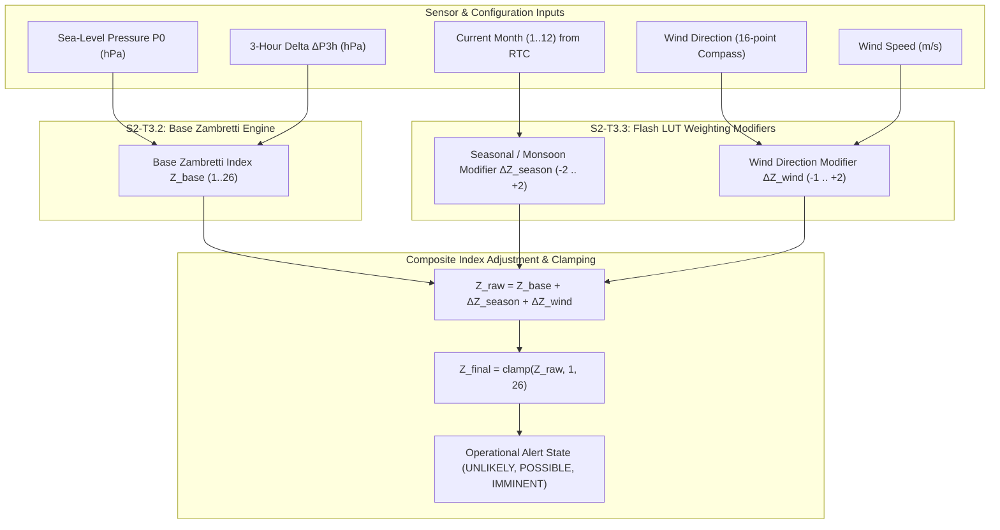

# Task Specification: S2-T3.3 - Zambretti Seasonal & Wind Heuristic Weighting Lookups

## 1. Task Metadata & Overview

| Attribute | Specification Details |
| :--- | :--- |
| **Sprint** | **Sprint 2: Meteorological Algorithms & Nowcasting Engine** |
| **Task ID** | `S2-T3.3` |
| **Parent Task** | `S2-T3: Implement Zambretti Barometric Heuristic Forecaster` |
| **Task Title** | Implement Seasonal Monsoon & Wind Direction Heuristic Weighting Lookups |
| **Status** | **Ready for Implementation** |
| **Target Files** | [`firmware/app/inc/zambretti.h`](file:///C:/Users/ENERGY%20SAVER/Documents/Learning/Job%20Projects/rain-predict/firmware/app/inc/zambretti.h)<br>[`firmware/app/src/zambretti.c`](file:///C:/Users/ENERGY%20SAVER/Documents/Learning/Job%20Projects/rain-predict/firmware/app/src/zambretti.c) |
| **Related Documents** | [`docs/algorithms/zambretti-algorithm.md`](file:///C:/Users/ENERGY%20SAVER/Documents/Learning/Job%20Projects/rain-predict/docs/algorithms/zambretti-algorithm.md)<br>[`context/specs/s2-t3.1-zambretti-trend.md`](file:///C:/Users/ENERGY%20SAVER/Documents/Learning/Job%20Projects/rain-predict/context/specs/s2-t3.1-zambretti-trend.md)<br>[`context/specs/s2-t3.2-zambretti-pressure-mapping.md`](file:///C:/Users/ENERGY%20SAVER/Documents/Learning/Job%20Projects/rain-predict/context/specs/s2-t3.2-zambretti-pressure-mapping.md)<br>[`docs/algorithms/meteorological-formulas.md`](file:///C:/Users/ENERGY%20SAVER/Documents/Learning/Job%20Projects/rain-predict/docs/algorithms/meteorological-formulas.md)<br>[`context/coding-standards.md`](file:///C:/Users/ENERGY%20SAVER/Documents/Learning/Job%20Projects/rain-predict/context/coding-standards.md) |
| **Dependencies** | `S2-T3.1` (Zambretti trend classifier), `S2-T3.2` (Zambretti pressure mapping), `S1-T1.1` (Root CMake build system) |
| **Downstream Tasks** | `S2-T3.4` (Zambretti unit test suite), `S2-T5.1` (Composite nowcasting scoring engine) |

---

## 2. Executive Summary & Microclimate Context

The primary objective of **`S2-T3.3`** is to develop the **Seasonal Monsoon and Wind Direction Weighting Engine** for the Zambretti algorithm in Layer 1 Application ([`firmware/app/inc/zambretti.h`](file:///C:/Users/ENERGY%20SAVER/Documents/Learning/Job%20Projects/rain-predict/firmware/app/inc/zambretti.h) / [`firmware/app/src/zambretti.c`](file:///C:/Users/ENERGY%20SAVER/Documents/Learning/Job%20Projects/rain-predict/firmware/app/src/zambretti.c)).

### Why Seasonal & Wind Corrections are Essential:
The baseline Zambretti barometric mapping (`S2-T3.2`) produces a baseline index $Z_{base} \in [1, 26]$ based solely on barometric pressure $P_0$ and 3-hour tendency $\Delta P_{3\text{h}}$. However, in tea-growing regions of the Western Ghats (Nilgiris, Valparai, Munnar) and the Himalayas (Darjeeling, Assam), atmospheric precipitation probabilities are heavily modulated by:
1. **Monsoon Seasonal Regimes**:
   - **Southwest (SW) Monsoon (June–September)**: Intense orographic maritime moisture advection from the Arabian Sea makes precipitation significantly more probable even at moderate barometric pressures. Seasonal adjustment: $\Delta Z_{season} = +2$.
   - **Northeast (NE) Monsoon (October–November)**: Moist cyclonic depressions from the Bay of Bengal affect eastern slopes. Seasonal adjustment: $\Delta Z_{season} = +1$.
   - **Dry Winter Period (December–February)**: Dry continental anticyclonic stability; rain is rare even with minor barometric fluctuations. Seasonal adjustment: $\Delta Z_{season} = -2$.
   - **Pre-Monsoon Summer (March–May)**: Intense solar insolation drives afternoon thermal convection and squalls. Seasonal adjustment: $\Delta Z_{season} = +1$.
2. **Local Wind Direction & Moisture Advection**:
   - Winds blowing from maritime moisture quadrants (SW, W, SSW, WSW) carry heavy water vapor, warranting an index boost of $\Delta Z_{wind} = +1$ to $+2$.
   - Winds blowing from dry inland quadrants (N, NE, NNE) suppress precipitation, applying an index reduction of $\Delta Z_{wind} = -1$.
   - Calm winds ($< 0.5\text{ m/s}$) or missing anemometer telemetry yield neutral correction ($\Delta Z_{wind} = 0$).



---

## 3. Mathematical Formulations & Look-Up Table Specifications

### 3.1 Composite Weighted Zambretti Index
The final adjusted Zambretti index is computed as:

$$Z_{final} = \text{clamp}\left(Z_{base} + \Delta Z_{season} + \Delta Z_{wind}, \, 1, \, 26\right)$$

Where:
- $Z_{base} \in [1, 26]$ is obtained from the standard polynomial evaluation in `S2-T3.2`.
- $\Delta Z_{season} \in [-2, +2]$ is retrieved from the flash-resident monthly seasonal table.
- $\Delta Z_{wind} \in [-1, +2]$ is retrieved from the flash-resident 16-point wind direction table.

---

### 3.2 Monthly Seasonal Monsoon LUT Specification
The 12-month calendar lookup is calibrated for tropical/subtropical high-altitude tea plantations:

| Month ($M$) | Calendar Month | Meteorological Season | Monsoon Category | Seasonal Offset ($\Delta Z_{season}$) |
| :---: | :--- | :--- | :--- | :---: |
| **1** | January | Winter Dry Season | `MONSOON_SEASON_DRY` | $-2$ |
| **2** | February | Winter Dry Season | `MONSOON_SEASON_DRY` | $-2$ |
| **3** | March | Early Pre-Monsoon | `MONSOON_SEASON_PRE` | $0$ |
| **4** | April | Peak Pre-Monsoon (Convective) | `MONSOON_SEASON_PRE` | $+1$ |
| **5** | May | Pre-Monsoon Squall Transition | `MONSOON_SEASON_PRE` | $+1$ |
| **6** | June | Southwest Monsoon Arrival | `MONSOON_SEASON_SW` | $+2$ |
| **7** | July | Peak Southwest Monsoon | `MONSOON_SEASON_SW` | $+2$ |
| **8** | August | Southwest Monsoon | `MONSOON_SEASON_SW` | $+2$ |
| **9** | September | Southwest Monsoon Weakening | `MONSOON_SEASON_SW` | $+1$ |
| **10** | October | Northeast Monsoon (Retreating) | `MONSOON_SEASON_NE` | $+2$ |
| **11** | November | Northeast Monsoon | `MONSOON_SEASON_NE` | $+1$ |
| **12** | December | Early Winter Dry Period | `MONSOON_SEASON_DRY` | $-1$ |

---

### 3.3 Wind Direction & Speed LUT Specification
Wind speed must exceed $V_{wind\_min} = 0.5\text{ m/s}$ (calm threshold) to activate directional weighting:

| Wind Sector | 16-Point Compass Code | Azimuth Range ($^\circ$) | Moisture / Trajectory Type | Wind Offset ($\Delta Z_{wind}$) |
| :--- | :---: | :---: | :--- | :---: |
| **Calm** | `WIND_DIR_CALM` | - | Stagnant air mass | $0$ |
| **North** | `WIND_DIR_N` | $348.75^\circ - 11.25^\circ$ | Dry continental / high-pressure | $-1$ |
| **North-North-East**| `WIND_DIR_NNE`| $11.25^\circ - 33.75^\circ$ | Dry continental | $-1$ |
| **North-East** | `WIND_DIR_NE` | $33.75^\circ - 56.25^\circ$ | Dry continental (except Nov/Dec) | $-1$ |
| **East-North-East** | `WIND_DIR_ENE` | $56.25^\circ - 78.75^\circ$ | Neutral inland | $0$ |
| **East** | `WIND_DIR_E` | $78.75^\circ - 101.25^\circ$ | Neutral inland | $0$ |
| **East-South-East** | `WIND_DIR_ESE` | $101.25^\circ - 123.75^\circ$| Moderate humidity | $0$ |
| **South-East** | `WIND_DIR_SE` | $123.75^\circ - 146.25^\circ$| Maritime Bay of Bengal inflow | $+1$ |
| **South-South-East**| `WIND_DIR_SSE`| $146.25^\circ - 168.75^\circ$| Maritime inflow | $+1$ |
| **South** | `WIND_DIR_S` | $168.75^\circ - 191.25^\circ$| Warm maritime moisture | $+1$ |
| **South-South-West**| `WIND_DIR_SSW`| $191.25^\circ - 213.75^\circ$| Arabian Sea monsoon inflow | $+2$ |
| **South-West** | `WIND_DIR_SW` | $213.75^\circ - 236.25^\circ$| Primary Arabian Sea moisture | $+2$ |
| **West-South-West** | `WIND_DIR_WSW` | $236.25^\circ - 258.75^\circ$| Primary Arabian Sea moisture | $+2$ |
| **West** | `WIND_DIR_W` | $258.75^\circ - 281.25^\circ$| Maritime westerly flow | $+1$ |
| **West-North-West** | `WIND_DIR_WNW` | $281.25^\circ - 303.75^\circ$| Moderate westerly | $0$ |
| **North-West** | `WIND_DIR_NW` | $303.75^\circ - 326.25^\circ$| Transition airflow | $0$ |
| **North-North-West**| `WIND_DIR_NNW`| $326.25^\circ - 348.75^\circ$| Dry continental transition | $-1$ |
| **Unknown / Fault** | `WIND_DIR_UNKNOWN` | - | Anemometer unconfigured | $0$ |

---

## 4. Embedded C99 Architecture & API Design

In accordance with [`context/coding-standards.md`](file:///C:/Users/ENERGY%20SAVER/Documents/Learning/Job%20Projects/rain-predict/context/coding-standards.md):

### 4.1 Additions to Header File ([`firmware/app/inc/zambretti.h`](file:///C:/Users/ENERGY%20SAVER/Documents/Learning/Job%20Projects/rain-predict/firmware/app/inc/zambretti.h))

```c
/**
 * @brief Plantation monsoon seasons.
 */
typedef enum {
    MONSOON_SEASON_DRY          = 0, /**< Winter dry period (Dec-Feb) */
    MONSOON_SEASON_PRE_MONSOON  = 1, /**< Pre-monsoon convective squalls (Mar-May) */
    MONSOON_SEASON_SW_MONSOON   = 2, /**< Southwest monsoon heavy rain (Jun-Sep) */
    MONSOON_SEASON_NE_MONSOON   = 3  /**< Northeast retreating monsoon (Oct-Nov) */
} monsoon_season_t;

/**
 * @brief 16-point compass wind direction enumeration.
 */
typedef enum {
    WIND_DIR_CALM       = 0,
    WIND_DIR_N          = 1,
    WIND_DIR_NNE        = 2,
    WIND_DIR_NE         = 3,
    WIND_DIR_ENE        = 4,
    WIND_DIR_E          = 5,
    WIND_DIR_ESE        = 6,
    WIND_DIR_SE         = 7,
    WIND_DIR_SSE        = 8,
    WIND_DIR_S          = 9,
    WIND_DIR_SSW        = 10,
    WIND_DIR_SW         = 11,
    WIND_DIR_WSW        = 12,
    WIND_DIR_W          = 13,
    WIND_DIR_WNW        = 14,
    WIND_DIR_NW         = 15,
    WIND_DIR_NNW        = 16,
    WIND_DIR_UNKNOWN    = 17
} wind_dir_t;

#define WIND_CALM_THRESHOLD_MPS         (0.5f)      /**< Speed below which wind is considered calm */

/**
 * @brief Retrieves seasonal Zambretti index adjustment based on month of the year.
 * 
 * @param[in]  month_1_to_12 Month index (1 = January, 12 = December).
 * @param[out] p_offset      Pointer to store seasonal index offset (-2 to +2).
 * @return int32_t           0 on success, negative error code on invalid month.
 */
int32_t zambretti_get_seasonal_offset(uint8_t month_1_to_12, int8_t *p_offset);

/**
 * @brief Retrieves seasonal adjustment from explicit monsoon season enum.
 * 
 * @param[in]  season        Monsoon season enum.
 * @param[out] p_offset      Pointer to store index offset (-2 to +2).
 * @return int32_t           0 on success, negative error code on failure.
 */
int32_t zambretti_get_monsoon_offset(monsoon_season_t season, int8_t *p_offset);

/**
 * @brief Retrieves wind direction Zambretti index adjustment.
 * 
 * @param[in]  dir           16-point wind direction compass code.
 * @param[in]  speed_mps     Wind speed in meters per second.
 * @param[out] p_offset      Pointer to store wind index offset (-1 to +2).
 * @return int32_t           0 on success, negative error code on failure.
 */
int32_t zambretti_get_wind_offset(wind_dir_t dir, float speed_mps, int8_t *p_offset);

/**
 * @brief Converts azimuth degrees (0.0 to 360.0) into 16-point wind_dir_t enum.
 * 
 * @param[in]  azimuth_deg   Wind direction in azimuth degrees (0.0° = North, clockwise).
 * @return wind_dir_t        Corresponding 16-point compass sector.
 */
wind_dir_t zambretti_azimuth_to_wind_dir(float azimuth_deg);

/**
 * @brief Computes fully adjusted, weighted Zambretti forecast index.
 * 
 * @param[in]  p0_hpa        Current sea-level pressure in hPa.
 * @param[in]  delta_p_3h    3-hour barometric pressure delta in hPa.
 * @param[in]  month_1_to_12 Current month from RTC (1 to 12).
 * @param[in]  wind_dir      Wind direction compass sector.
 * @param[in]  wind_speed_mps Current wind speed in m/s.
 * @param[out] p_z_index     Pointer to store final weighted Zambretti index (1 to 26).
 * @param[out] p_state       Pointer to store operational alert state.
 * @return int32_t           0 on success, negative error code on failure.
 */
int32_t zambretti_calculate_weighted(float p0_hpa,
                                     float delta_p_3h,
                                     uint8_t month_1_to_12,
                                     wind_dir_t wind_dir,
                                     float wind_speed_mps,
                                     uint8_t *p_z_index,
                                     rain_forecast_state_t *p_state);
```

---

### 4.2 Additions to Source File ([`firmware/app/src/zambretti.c`](file:///C:/Users/ENERGY%20SAVER/Documents/Learning/Job%20Projects/rain-predict/firmware/app/src/zambretti.c))

```c
/* Flash-resident monthly seasonal offset LUT (indices 0..11 for months 1..12) */
static const int8_t s_seasonal_monthly_offsets[12] = {
    -2, /* Jan: Winter Dry */
    -2, /* Feb: Winter Dry */
     0, /* Mar: Early Pre-Monsoon */
    +1, /* Apr: Peak Pre-Monsoon */
    +1, /* May: Pre-Monsoon Squall Transition */
    +2, /* Jun: Southwest Monsoon */
    +2, /* Jul: Peak Southwest Monsoon */
    +2, /* Aug: Southwest Monsoon */
    +1, /* Sep: Southwest Monsoon Weakening */
    +2, /* Oct: Northeast Monsoon */
    +1, /* Nov: Northeast Monsoon */
    -1  /* Dec: Early Winter */
};

/* Flash-resident wind direction offset LUT (indices match wind_dir_t 0..17) */
static const int8_t s_wind_direction_offsets[18] = {
     0, /* WIND_DIR_CALM */
    -1, /* WIND_DIR_N */
    -1, /* WIND_DIR_NNE */
    -1, /* WIND_DIR_NE */
     0, /* WIND_DIR_ENE */
     0, /* WIND_DIR_E */
     0, /* WIND_DIR_ESE */
    +1, /* WIND_DIR_SE */
    +1, /* WIND_DIR_SSE */
    +1, /* WIND_DIR_S */
    +2, /* WIND_DIR_SSW */
    +2, /* WIND_DIR_SW */
    +2, /* WIND_DIR_WSW */
    +1, /* WIND_DIR_W */
     0, /* WIND_DIR_WNW */
     0, /* WIND_DIR_NW */
    -1, /* WIND_DIR_NNW */
     0  /* WIND_DIR_UNKNOWN */
};

int32_t zambretti_get_seasonal_offset(uint8_t month_1_to_12, int8_t *p_offset)
{
    if (p_offset == NULL) {
        return ERR_NULL_PTR_CODE;
    }
    if (month_1_to_12 < 1U || month_1_to_12 > 12U) {
        return ERR_INVALID_ARG_CODE;
    }

    *p_offset = s_seasonal_monthly_offsets[month_1_to_12 - 1U];
    return STATUS_OK_CODE;
}

int32_t zambretti_get_monsoon_offset(monsoon_season_t season, int8_t *p_offset)
{
    if (p_offset == NULL) {
        return ERR_NULL_PTR_CODE;
    }

    switch (season) {
        case MONSOON_SEASON_DRY:
            *p_offset = -2;
            break;
        case MONSOON_SEASON_PRE_MONSOON:
            *p_offset = +1;
            break;
        case MONSOON_SEASON_SW_MONSOON:
            *p_offset = +2;
            break;
        case MONSOON_SEASON_NE_MONSOON:
            *p_offset = +2;
            break;
        default:
            return ERR_INVALID_ARG_CODE;
    }

    return STATUS_OK_CODE;
}

int32_t zambretti_get_wind_offset(wind_dir_t dir, float speed_mps, int8_t *p_offset)
{
    if (p_offset == NULL) {
        return ERR_NULL_PTR_CODE;
    }
    if (isnan(speed_mps) || speed_mps < 0.0f) {
        return ERR_INVALID_ARG_CODE;
    }

    /* If calm or unconfigured, zero offset */
    if (speed_mps < WIND_CALM_THRESHOLD_MPS || dir == WIND_DIR_CALM || dir >= WIND_DIR_UNKNOWN) {
        *p_offset = 0;
        return STATUS_OK_CODE;
    }

    *p_offset = s_wind_direction_offsets[(uint8_t)dir];
    return STATUS_OK_CODE;
}

wind_dir_t zambretti_azimuth_to_wind_dir(float azimuth_deg)
{
    if (isnan(azimuth_deg)) {
        return WIND_DIR_UNKNOWN;
    }

    /* Wrap to [0, 360) */
    float az = fmodf(azimuth_deg, 360.0f);
    if (az < 0.0f) {
        az += 360.0f;
    }

    /* 16 sectors of 22.5° each, offset by 11.25° for North centering */
    int32_t sector = (int32_t)floorf((az + 11.25f) / 22.5f) % 16;
    return (wind_dir_t)(sector + 1); /* +1 because WIND_DIR_CALM = 0 */
}

int32_t zambretti_calculate_weighted(float p0_hpa,
                                     float delta_p_3h,
                                     uint8_t month_1_to_12,
                                     wind_dir_t wind_dir,
                                     float wind_speed_mps,
                                     uint8_t *p_z_index,
                                     rain_forecast_state_t *p_state)
{
    if (p_z_index == NULL || p_state == NULL) {
        return ERR_NULL_PTR_CODE;
    }

    uint8_t z_base = 0U;
    rain_forecast_state_t base_state;
    int32_t ret = zambretti_calculate(p0_hpa, delta_p_3h, &z_base, &base_state);
    if (ret != STATUS_OK_CODE) {
        return ret;
    }

    int8_t season_offset = 0;
    ret = zambretti_get_seasonal_offset(month_1_to_12, &season_offset);
    if (ret != STATUS_OK_CODE) {
        season_offset = 0; /* Fallback to neutral on invalid month */
    }

    int8_t wind_offset = 0;
    ret = zambretti_get_wind_offset(wind_dir, wind_speed_mps, &wind_offset);
    if (ret != STATUS_OK_CODE) {
        wind_offset = 0;
    }

    int32_t z_weighted = (int32_t)z_base + (int32_t)season_offset + (int32_t)wind_offset;
    if (z_weighted < (int32_t)ZAMBRETTI_INDEX_MIN) {
        z_weighted = (int32_t)ZAMBRETTI_INDEX_MIN;
    } else if (z_weighted > (int32_t)ZAMBRETTI_INDEX_MAX) {
        z_weighted = (int32_t)ZAMBRETTI_INDEX_MAX;
    }

    *p_z_index = (uint8_t)z_weighted;
    *p_state = zambretti_map_to_state((uint8_t)z_weighted);

    return STATUS_OK_CODE;
}
```

---

## 5. Verification Vectors & Acceptance Test Cases

| Test ID | Month ($M$) | Wind Sector | Wind Speed ($v$) | Base $Z$ | $\Delta Z_{season}$ | $\Delta Z_{wind}$ | Final $Z$ | State Mapped |
| :--- | :--- | :--- | :--- | :--- | :--- | :--- | :--- | :--- |
| **TC-ZW-01: Peak Monsoon Inflow** | July ($7$) | `WIND_DIR_SW` ($225^\circ$) | $4.5\text{ m/s}$ | $18$ | $+2$ | $+2$ | $22$ | `RAIN_STATE_IMMINENT` (2) |
| **TC-ZW-02: Winter Dry North Wind** | January ($1$) | `WIND_DIR_N` ($0^\circ$) | $3.0\text{ m/s}$ | $12$ | $-2$ | $-1$ | $9$ | `RAIN_STATE_UNLIKELY` (0) |
| **TC-ZW-03: Pre-Monsoon Calm** | April ($4$) | `WIND_DIR_CALM` | $0.2\text{ m/s}$ (< 0.5) | $15$ | $+1$ | $0$ | $16$ | `RAIN_STATE_POSSIBLE` (1) |
| **TC-ZW-04: High Anticyclone Clamp**| January ($1$) | `WIND_DIR_NNE` ($22.5^\circ$)| $5.0\text{ m/s}$ | $2$ | $-2$ | $-1$ | $1$ (clamped) | `RAIN_STATE_UNLIKELY` (0) |
| **TC-ZW-05: Extreme Storm Clamp** | July ($7$) | `WIND_DIR_WSW` ($247.5^\circ$)| $8.0\text{ m/s}$ | $25$ | $+2$ | $+2$ | $26$ (clamped) | `RAIN_STATE_IMMINENT` (2) |
| **TC-ZW-06: Azimuth Compass Map** | - | $220.0^\circ$ | - | - | - | - | `WIND_DIR_SW` | Accurate compass sector |
| **TC-ZW-07: Azimuth Compass Map** | - | $355.0^\circ$ | - | - | - | - | `WIND_DIR_N` | Accurate north wrap |
| **TC-ZW-08: Invalid Month Guard** | $13$ | `WIND_DIR_SW` | $2.0\text{ m/s}$ | - | - | - | - | Returns `ERR_INVALID_ARG_CODE` |
| **TC-ZW-09: Null Pointer Trap** | July ($7$) | `WIND_DIR_SW` | $4.0\text{ m/s}$ | - | - | - | - | Returns `ERR_NULL_PTR_CODE` |

---

## 6. Traceability & Acceptance Criteria

### Acceptance Checklist:
- [ ] [`firmware/app/inc/zambretti.h`](file:///C:/Users/ENERGY%20SAVER/Documents/Learning/Job%20Projects/rain-predict/firmware/app/inc/zambretti.h) declares `monsoon_season_t`, `wind_dir_t`, and lookup APIs.
- [ ] [`firmware/app/src/zambretti.c`](file:///C:/Users/ENERGY%20SAVER/Documents/Learning/Job%20Projects/rain-predict/firmware/app/src/zambretti.c) implements seasonal and wind direction lookups with flash-resident LUTs.
- [ ] Calm wind speeds ($< 0.5\text{ m/s}$) correctly yield zero wind offset.
- [ ] Azimuth conversion accurately wraps $0.0^\circ$ to $360.0^\circ$ into 16 distinct compass sectors.
- [ ] Composite weighted calculation clamps output index within $[1, 26]$.
- [ ] Zero dynamic memory allocation and execution cycle count $< 220$ CPU cycles @ 48 MHz.
- [ ] Fully linked in [`context/specs/spec-roadmap.md`](file:///C:/Users/ENERGY%20SAVER/Documents/Learning/Job%20Projects/rain-predict/context/specs/spec-roadmap.md).
