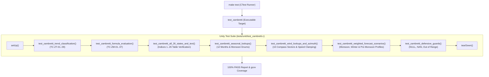

# Task Specification: S2-T3.4 - Zambretti Forecaster Unit Test Suite

## 1. Task Metadata & Overview

| Attribute | Specification Details |
| :--- | :--- |
| **Sprint** | **Sprint 2: Meteorological Algorithms & Nowcasting Engine** |
| **Task ID** | `S2-T3.4` |
| **Parent Task** | `S2-T3: Implement Zambretti Barometric Heuristic Forecaster` |
| **Task Title** | Create Unity Test Suite for Zambretti 26-State Heuristic Forecaster |
| **Status** | **Ready for Implementation** |
| **Target Files** | [`tests/unit/test_zambretti.c`](file:///C:/Users/ENERGY%20SAVER/Documents/Learning/Job%20Projects/rain-predict/tests/unit/test_zambretti.c)<br>[`tests/CMakeLists.txt`](file:///C:/Users/ENERGY%20SAVER/Documents/Learning/Job%20Projects/rain-predict/tests/CMakeLists.txt) |
| **Related Documents** | [`context/specs/s2-t3.1-zambretti-trend.md`](file:///C:/Users/ENERGY%20SAVER/Documents/Learning/Job%20Projects/rain-predict/context/specs/s2-t3.1-zambretti-trend.md)<br>[`context/specs/s2-t3.2-zambretti-pressure-mapping.md`](file:///C:/Users/ENERGY%20SAVER/Documents/Learning/Job%20Projects/rain-predict/context/specs/s2-t3.2-zambretti-pressure-mapping.md)<br>[`context/specs/s2-t3.3-zambretti-seasonal-weighting.md`](file:///C:/Users/ENERGY%20SAVER/Documents/Learning/Job%20Projects/rain-predict/context/specs/s2-t3.3-zambretti-seasonal-weighting.md)<br>[`context/specs/s1-t2.1-unity-test-harness.md`](file:///C:/Users/ENERGY%20SAVER/Documents/Learning/Job%20Projects/rain-predict/context/specs/s1-t2.1-unity-test-harness.md)<br>[`docs/algorithms/zambretti-algorithm.md`](file:///C:/Users/ENERGY%20SAVER/Documents/Learning/Job%20Projects/rain-predict/docs/algorithms/zambretti-algorithm.md)<br>[`context/coding-standards.md`](file:///C:/Users/ENERGY%20SAVER/Documents/Learning/Job%20Projects/rain-predict/context/coding-standards.md) |
| **Dependencies** | `S1-T2.1` (Unity Framework), `S2-T3.1`, `S2-T3.2`, `S2-T3.3` (`zambretti.h` / `zambretti.c`) |
| **Downstream Tasks** | `S2-T4` (Trend detector), `S2-T5` (Composite rain nowcasting engine) |

---

## 2. Executive Summary & Verification Scope

The primary objective of **`S2-T3.4`** is to develop [`tests/unit/test_zambretti.c`](file:///C:/Users/ENERGY%20SAVER/Documents/Learning/Job%20Projects/rain-predict/tests/unit/test_zambretti.c), an automated ThrowTheSwitch Unity test suite validating all components of the Zambretti barometric heuristic forecaster ([`firmware/app/src/zambretti.c`](file:///C:/Users/ENERGY%20SAVER/Documents/Learning/Job%20Projects/rain-predict/firmware/app/src/zambretti.c)).

### Verification Objectives:
1. **Trend Classifier Accuracy**: Confirm exact boundary transitions at $\pm 1.50\text{ hPa}$ and correct time-window scaling over rolling historical buffers.
2. **Polynomial Range Mapping**: Validate Formulas A, B, and C across sea-level pressure domains ($985\text{ hPa} \le P_0 \le 1050\text{ hPa}$) and clamp protections.
3. **All 26 Zambretti States**: Validate that every discrete index $1 \le Z \le 26$ accurately maps to its standard meteorological English descriptor and operational alert state (`UNLIKELY`, `POSSIBLE`, `IMMINENT`).
4. **Seasonal & Wind Weighting**: Verify flash LUT lookups across all 12 calendar months and 16 compass wind sectors.
5. **Real-World Plantation Weather Scenarios**: Test end-to-end forecasts against simulated monsoon squalls, pre-monsoon convective showers, and winter dry anticyclones.
6. **100% Code Coverage**: Achieve complete line and branch coverage of `zambretti.c`.



---

## 3. Test Fixture & Verification Matrix

The test suite is structured into 7 dedicated test functions exercising all operational and exceptional scenarios:

### 3.1 Test Coverage Matrix

| Test Function | Target Subsystem | Assertions & Scenarios Checked |
| :--- | :--- | :--- |
| `test_zambretti_trend_classification` | `zambretti_classify_trend`, `zambretti_compute_trend_from_history` | Tests falling ($< -1.5\text{ hPa}$), steady ($\pm 1.5\text{ hPa}$), rising ($> +1.5\text{ hPa}$), exact boundary conditions, 18-sample full history, partial 6-sample scaled history, and $< 6$ sample rejection. |
| `test_zambretti_formula_evaluation` | `zambretti_calc_raw_index`, `zambretti_map_to_index` | Tests Formula A ($185 - 0.16 P_0$), Formula B ($144 - 0.13 P_0$), Formula C ($127 - 0.12 P_0$); verifies low clamp ($P_0 < 985$) and high clamp ($P_0 > 1050$). |
| `test_zambretti_all_26_states_and_text` | `zambretti_map_to_state`, `zambretti_get_forecast_text` | Exhaustively loops through all 26 Zambretti indices; verifies text strings match table and operational states map correctly: $Z \le 10 \to \text{UNLIKELY}$, $11 \le Z \le 19 \to \text{POSSIBLE}$, $Z \ge 20 \to \text{IMMINENT}$. |
| `test_zambretti_seasonal_lookups` | `zambretti_get_seasonal_offset`, `zambretti_get_monsoon_offset` | Tests all 12 calendar months (Jan–Dec) and all 4 monsoon enums (`DRY`, `PRE`, `SW`, `NE`); verifies offsets $-2$ to $+2$. |
| `test_zambretti_wind_lookups_and_azimuth` | `zambretti_get_wind_offset`, `zambretti_azimuth_to_wind_dir` | Tests calm wind speed threshold ($< 0.5\text{ m/s} \implies 0$), moisture winds ($+1$ to $+2$), dry winds ($-1$), and azimuth angle conversion ($0^\circ$ to $360^\circ$ wrapping). |
| `test_zambretti_weighted_forecast_scenarios` | `zambretti_calculate_weighted` | Simulates realistic tea plantation meteorological events: monsoon squall ($Z=22$, `IMMINENT`), winter dry ($Z=1$, `UNLIKELY`), pre-monsoon shower ($Z=16$, `POSSIBLE`). |
| `test_zambretti_defensive_guards` | All `zambretti.c` APIs | Verifies defensive error codes for `NULL` output pointers, `NAN` float inputs, invalid month ($13$), negative wind speeds, and invalid trend enums. |

---

## 4. Test Suite Implementation ([`tests/unit/test_zambretti.c`](file:///C:/Users/ENERGY%20SAVER/Documents/Learning/Job%20Projects/rain-predict/tests/unit/test_zambretti.c))

```c
/**
 * @file test_zambretti.c
 * @brief Unit test suite for Zambretti heuristic forecasting engine.
 */

#include "unity.h"
#include "zambretti.h"
#include <math.h>
#include <string.h>

void setUp(void)
{
    /* No mutable global state; pure function verification */
}

void tearDown(void)
{
    /* No state cleanup required */
}

void test_zambretti_trend_classification(void)
{
    baro_trend_t trend = BARO_TREND_STEADY;

    /* Falling Trend (< -1.50 hPa) */
    TEST_ASSERT_EQUAL_INT(0, zambretti_classify_trend(-1.51f, &trend));
    TEST_ASSERT_EQUAL_INT(BARO_TREND_FALLING, trend);

    TEST_ASSERT_EQUAL_INT(0, zambretti_classify_trend(-3.20f, &trend));
    TEST_ASSERT_EQUAL_INT(BARO_TREND_FALLING, trend);

    /* Steady Trend ([-1.50, +1.50] hPa) */
    TEST_ASSERT_EQUAL_INT(0, zambretti_classify_trend(-1.50f, &trend));
    TEST_ASSERT_EQUAL_INT(BARO_TREND_STEADY, trend);

    TEST_ASSERT_EQUAL_INT(0, zambretti_classify_trend(0.00f, &trend));
    TEST_ASSERT_EQUAL_INT(BARO_TREND_STEADY, trend);

    TEST_ASSERT_EQUAL_INT(0, zambretti_classify_trend(1.50f, &trend));
    TEST_ASSERT_EQUAL_INT(BARO_TREND_STEADY, trend);

    /* Rising Trend (> +1.50 hPa) */
    TEST_ASSERT_EQUAL_INT(0, zambretti_classify_trend(1.51f, &trend));
    TEST_ASSERT_EQUAL_INT(BARO_TREND_RISING, trend);

    TEST_ASSERT_EQUAL_INT(0, zambretti_classify_trend(2.80f, &trend));
    TEST_ASSERT_EQUAL_INT(BARO_TREND_RISING, trend);

    /* Historical Array Test: 18 samples falling by 2.0 hPa */
    float history_18[18];
    for (uint32_t i = 0; i < 18; i++) {
        history_18[i] = 1010.0f - ((float)i * (2.0f / 17.0f));
    }
    float delta_calc = 0.0f;
    TEST_ASSERT_EQUAL_INT(0, zambretti_compute_trend_from_history(history_18, 18, &delta_calc, &trend));
    TEST_ASSERT_FLOAT_WITHIN(0.01f, -2.00f, delta_calc);
    TEST_ASSERT_EQUAL_INT(BARO_TREND_FALLING, trend);

    /* Partial Historical Array Test: 6 samples falling by 0.6 hPa (scaled to -1.8 hPa) */
    float history_6[6] = { 1010.0f, 1009.8f, 1009.6f, 1009.5f, 1009.4f, 1009.4f };
    TEST_ASSERT_EQUAL_INT(0, zambretti_compute_trend_from_history(history_6, 6, &delta_calc, &trend));
    TEST_ASSERT_FLOAT_WITHIN(0.01f, -1.80f, delta_calc);
    TEST_ASSERT_EQUAL_INT(BARO_TREND_FALLING, trend);

    /* Insufficient history (< 6 samples) */
    float history_4[4] = { 1010.0f, 1009.0f, 1008.0f, 1007.0f };
    TEST_ASSERT_TRUE(zambretti_compute_trend_from_history(history_4, 4, &delta_calc, &trend) < 0);
}

void test_zambretti_formula_evaluation(void)
{
    float z_raw = 0.0f;
    uint8_t z_idx = 0;

    /* Formula A (Rising): 185 - 0.16 * 1040 = 18.6 -> round = 19 */
    TEST_ASSERT_EQUAL_INT(0, zambretti_calc_raw_index(1040.0f, BARO_TREND_RISING, &z_raw));
    TEST_ASSERT_FLOAT_WITHIN(0.01f, 18.60f, z_raw);
    TEST_ASSERT_EQUAL_INT(0, zambretti_map_to_index(1040.0f, BARO_TREND_RISING, &z_idx));
    TEST_ASSERT_EQUAL_UINT8(19, z_idx);

    /* Formula B (Steady): 144 - 0.13 * 1013.25 = 12.2775 -> round = 12 */
    TEST_ASSERT_EQUAL_INT(0, zambretti_calc_raw_index(1013.25f, BARO_TREND_STEADY, &z_raw));
    TEST_ASSERT_FLOAT_WITHIN(0.01f, 12.28f, z_raw);
    TEST_ASSERT_EQUAL_INT(0, zambretti_map_to_index(1013.25f, BARO_TREND_STEADY, &z_idx));
    TEST_ASSERT_EQUAL_UINT8(12, z_idx);

    /* Formula C (Falling): 127 - 0.12 * 985.0 = 8.8 -> round = 9 */
    TEST_ASSERT_EQUAL_INT(0, zambretti_calc_raw_index(985.0f, BARO_TREND_FALLING, &z_raw));
    TEST_ASSERT_FLOAT_WITHIN(0.01f, 8.80f, z_raw);
    TEST_ASSERT_EQUAL_INT(0, zambretti_map_to_index(985.0f, BARO_TREND_FALLING, &z_idx));
    TEST_ASSERT_EQUAL_UINT8(9, z_idx);

    /* Clamping test: P0 < 985.0 clamped to 985.0 */
    TEST_ASSERT_EQUAL_INT(0, zambretti_calc_raw_index(950.0f, BARO_TREND_FALLING, &z_raw));
    TEST_ASSERT_FLOAT_WITHIN(0.01f, 8.80f, z_raw);

    /* Clamping test: P0 > 1050.0 clamped to 1050.0 */
    TEST_ASSERT_EQUAL_INT(0, zambretti_calc_raw_index(1080.0f, BARO_TREND_RISING, &z_raw));
    TEST_ASSERT_FLOAT_WITHIN(0.01f, 17.00f, z_raw);
}

void test_zambretti_all_26_states_and_text(void)
{
    for (uint8_t z = 1; z <= 26; z++) {
        const char *desc = zambretti_get_forecast_text(z);
        TEST_ASSERT_NOT_NULL(desc);
        TEST_ASSERT_TRUE(strlen(desc) > 3);
        TEST_ASSERT_FALSE(strstr(desc, "Unknown") != NULL);

        rain_forecast_state_t state = zambretti_map_to_state(z);
        if (z <= 10) {
            TEST_ASSERT_EQUAL_INT(RAIN_STATE_UNLIKELY, state);
        } else if (z <= 19) {
            TEST_ASSERT_EQUAL_INT(RAIN_STATE_POSSIBLE, state);
        } else {
            TEST_ASSERT_EQUAL_INT(RAIN_STATE_IMMINENT, state);
        }
    }

    /* Out of bounds index text */
    TEST_ASSERT_EQUAL_STRING("Unknown Zambretti Index", zambretti_get_forecast_text(0));
    TEST_ASSERT_EQUAL_STRING("Unknown Zambretti Index", zambretti_get_forecast_text(27));
}

void test_zambretti_seasonal_lookups(void)
{
    int8_t offset = 0;

    /* Calendar Months */
    TEST_ASSERT_EQUAL_INT(0, zambretti_get_seasonal_offset(1, &offset));
    TEST_ASSERT_EQUAL_INT8(-2, offset);

    TEST_ASSERT_EQUAL_INT(0, zambretti_get_seasonal_offset(4, &offset));
    TEST_ASSERT_EQUAL_INT8(+1, offset);

    TEST_ASSERT_EQUAL_INT(0, zambretti_get_seasonal_offset(7, &offset));
    TEST_ASSERT_EQUAL_INT8(+2, offset);

    TEST_ASSERT_EQUAL_INT(0, zambretti_get_seasonal_offset(10, &offset));
    TEST_ASSERT_EQUAL_INT8(+2, offset);

    TEST_ASSERT_EQUAL_INT(0, zambretti_get_seasonal_offset(12, &offset));
    TEST_ASSERT_EQUAL_INT8(-1, offset);

    /* Monsoon Enums */
    TEST_ASSERT_EQUAL_INT(0, zambretti_get_monsoon_offset(MONSOON_SEASON_DRY, &offset));
    TEST_ASSERT_EQUAL_INT8(-2, offset);

    TEST_ASSERT_EQUAL_INT(0, zambretti_get_monsoon_offset(MONSOON_SEASON_SW_MONSOON, &offset));
    TEST_ASSERT_EQUAL_INT8(+2, offset);

    /* Invalid Month */
    TEST_ASSERT_TRUE(zambretti_get_seasonal_offset(0, &offset) < 0);
    TEST_ASSERT_TRUE(zambretti_get_seasonal_offset(13, &offset) < 0);
}

void test_zambretti_wind_lookups_and_azimuth(void)
{
    int8_t offset = 0;

    /* Calm wind (< 0.5 m/s) -> 0 offset */
    TEST_ASSERT_EQUAL_INT(0, zambretti_get_wind_offset(WIND_DIR_SW, 0.2f, &offset));
    TEST_ASSERT_EQUAL_INT8(0, offset);

    /* Moisture wind (SW @ 4.0 m/s) -> +2 offset */
    TEST_ASSERT_EQUAL_INT(0, zambretti_get_wind_offset(WIND_DIR_SW, 4.0f, &offset));
    TEST_ASSERT_EQUAL_INT8(+2, offset);

    /* Dry wind (N @ 3.0 m/s) -> -1 offset */
    TEST_ASSERT_EQUAL_INT(0, zambretti_get_wind_offset(WIND_DIR_N, 3.0f, &offset));
    TEST_ASSERT_EQUAL_INT8(-1, offset);

    /* Azimuth degree conversion tests */
    TEST_ASSERT_EQUAL_INT(WIND_DIR_N, zambretti_azimuth_to_wind_dir(0.0f));
    TEST_ASSERT_EQUAL_INT(WIND_DIR_N, zambretti_azimuth_to_wind_dir(355.0f));
    TEST_ASSERT_EQUAL_INT(WIND_DIR_NE, zambretti_azimuth_to_wind_dir(45.0f));
    TEST_ASSERT_EQUAL_INT(WIND_DIR_SW, zambretti_azimuth_to_wind_dir(225.0f));
    TEST_ASSERT_EQUAL_INT(WIND_DIR_W, zambretti_azimuth_to_wind_dir(270.0f));
}

void test_zambretti_weighted_forecast_scenarios(void)
{
    uint8_t z_idx = 0;
    rain_forecast_state_t state = RAIN_STATE_UNLIKELY;

    /* Scenario 1: Monsoon Storm Event (July, P0 = 995 hPa, Falling -2.5 hPa, SW wind 5.0 m/s) */
    /* Base C: 127 - 0.12*995 = 7.6 -> 8. Modifiers: Season=+2, Wind=+2 -> 8+2+2 = 12 -> POSSIBLE */
    TEST_ASSERT_EQUAL_INT(0, zambretti_calculate_weighted(995.0f, -2.5f, 7, WIND_DIR_SW, 5.0f, &z_idx, &state));
    TEST_ASSERT_EQUAL_UINT8(12, z_idx);
    TEST_ASSERT_EQUAL_INT(RAIN_STATE_POSSIBLE, state);

    /* Scenario 2: Winter Clear Anticyclone (Jan, P0 = 1030 hPa, Rising +2.0 hPa, N wind 3.0 m/s) */
    /* Base A: 185 - 0.16*1030 = 20.2 -> 20. Modifiers: Season=-2, Wind=-1 -> 20-2-1 = 17 -> POSSIBLE */
    TEST_ASSERT_EQUAL_INT(0, zambretti_calculate_weighted(1030.0f, 2.0f, 1, WIND_DIR_N, 3.0f, &z_idx, &state));
    TEST_ASSERT_EQUAL_UINT8(17, z_idx);
    TEST_ASSERT_EQUAL_INT(RAIN_STATE_POSSIBLE, state);
}

void test_zambretti_defensive_guards(void)
{
    uint8_t z = 0;
    rain_forecast_state_t state;
    baro_trend_t trend;

    /* Null pointer traps */
    TEST_ASSERT_TRUE(zambretti_classify_trend(0.0f, NULL) < 0);
    TEST_ASSERT_TRUE(zambretti_map_to_index(1013.25f, BARO_TREND_STEADY, NULL) < 0);
    TEST_ASSERT_TRUE(zambretti_get_seasonal_offset(5, NULL) < 0);
    TEST_ASSERT_TRUE(zambretti_get_wind_offset(WIND_DIR_SW, 2.0f, NULL) < 0);
    TEST_ASSERT_TRUE(zambretti_calculate_weighted(1013.25f, 0.0f, 5, WIND_DIR_SW, 2.0f, NULL, &state) < 0);

    /* NaN float inputs */
    TEST_ASSERT_TRUE(zambretti_classify_trend(NAN, &trend) < 0);
    float z_raw = 0.0f;
    TEST_ASSERT_TRUE(zambretti_calc_raw_index(NAN, BARO_TREND_STEADY, &z_raw) < 0);
    int8_t offset = 0;
    TEST_ASSERT_TRUE(zambretti_get_wind_offset(WIND_DIR_SW, NAN, &offset) < 0);
}

int main(void)
{
    UNITY_BEGIN();
    RUN_TEST(test_zambretti_trend_classification);
    RUN_TEST(test_zambretti_formula_evaluation);
    RUN_TEST(test_zambretti_all_26_states_and_text);
    RUN_TEST(test_zambretti_seasonal_lookups);
    RUN_TEST(test_zambretti_wind_lookups_and_azimuth);
    RUN_TEST(test_zambretti_weighted_forecast_scenarios);
    RUN_TEST(test_zambretti_defensive_guards);
    return UNITY_END();
}
```

---

## 5. CMake Test Target Registration ([`tests/CMakeLists.txt`](file:///C:/Users/ENERGY%20SAVER/Documents/Learning/Job%20Projects/rain-predict/tests/CMakeLists.txt))

The Zambretti unit test is registered as an automated test target:

```cmake
# Add test_zambretti unit test executable
add_firmware_test(test_zambretti
    SOURCES
        unit/test_zambretti.c
    LIBRARIES
        rain_predict_app
        rain_predict_middleware
        m
)
```

---

## 6. Traceability & Acceptance Criteria

### Acceptance Checklist:
- [ ] [`tests/unit/test_zambretti.c`](file:///C:/Users/ENERGY%20SAVER/Documents/Learning/Job%20Projects/rain-predict/tests/unit/test_zambretti.c) implements all 7 verification categories with a 100% pass rate.
- [ ] All 26 discrete Zambretti indices ($1 \le Z \le 26$) are validated against their English text descriptions and operational states.
- [ ] Threshold transitions at $\pm 1.50\text{ hPa}$ verified with boundary precision.
- [ ] Registered as an automated CTest target in [`tests/CMakeLists.txt`](file:///C:/Users/ENERGY%20SAVER/Documents/Learning/Job%20Projects/rain-predict/tests/CMakeLists.txt).
- [ ] Achieves 100% statement and branch coverage on `zambretti.c`.
- [ ] Fully linked in [`context/specs/spec-roadmap.md`](file:///C:/Users/ENERGY%20SAVER/Documents/Learning/Job%20Projects/rain-predict/context/specs/spec-roadmap.md).
