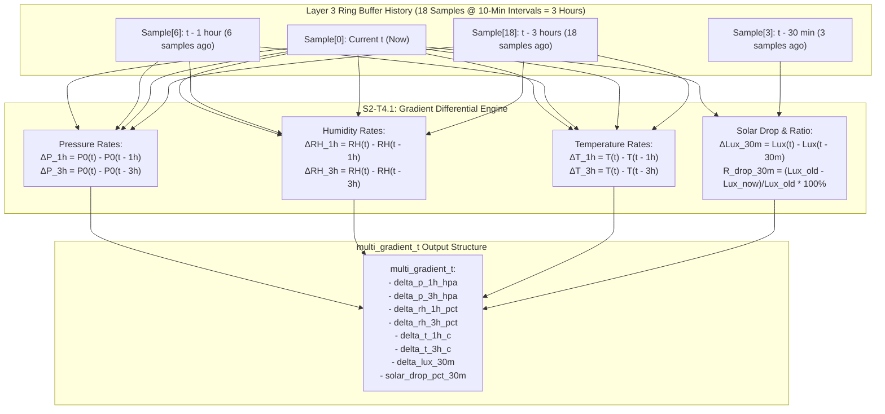

# Task Specification: S2-T4.1 - Multi-Variable 1-Hour & 3-Hour Gradient Differentials

## 1. Task Metadata & Overview

| Attribute | Specification Details |
| :--- | :--- |
| **Sprint** | **Sprint 2: Meteorological Algorithms & Nowcasting Engine** |
| **Task ID** | `S2-T4.1` |
| **Parent Task** | `S2-T4: Implement Multi-Variable Gradient Trend Detector` |
| **Task Title** | Implement Multi-Variable 1-Hour & 3-Hour Atmospheric Gradient Differentials ($\Delta P/\Delta t$, $\Delta RH/\Delta t$, $\Delta T/\Delta t$, $\Delta Lux/\Delta t$) |
| **Status** | **Ready for Implementation** |
| **Target Files** | [`firmware/app/inc/trend_detector.h`](file:///C:/Users/ENERGY%20SAVER/Documents/Learning/Job%20Projects/rain-predict/firmware/app/inc/trend_detector.h)<br>[`firmware/app/src/trend_detector.c`](file:///C:/Users/ENERGY%20SAVER/Documents/Learning/Job%20Projects/rain-predict/firmware/app/src/trend_detector.c) |
| **Related Documents** | [`docs/algorithms/trend-detection-and-nowcasting.md`](file:///C:/Users/ENERGY%20SAVER/Documents/Learning/Job%20Projects/rain-predict/docs/algorithms/trend-detection-and-nowcasting.md)<br>[`docs/algorithms/meteorological-formulas.md`](file:///C:/Users/ENERGY%20SAVER/Documents/Learning/Job%20Projects/rain-predict/docs/algorithms/meteorological-formulas.md)<br>[`context/specs/s2-t1.1-static-ring-buffer.md`](file:///C:/Users/ENERGY%20SAVER/Documents/Learning/Job%20Projects/rain-predict/context/specs/s2-t1.1-static-ring-buffer.md)<br>[`context/specs/s2-t1.2-moving-average-filter.md`](file:///C:/Users/ENERGY%20SAVER/Documents/Learning/Job%20Projects/rain-predict/context/specs/s2-t1.2-moving-average-filter.md)<br>[`context/specs/s2-t2.1-vapor-pressure.md`](file:///C:/Users/ENERGY%20SAVER/Documents/Learning/Job%20Projects/rain-predict/context/specs/s2-t2.1-vapor-pressure.md)<br>[`context/coding-standards.md`](file:///C:/Users/ENERGY%20SAVER/Documents/Learning/Job%20Projects/rain-predict/context/coding-standards.md) |
| **Dependencies** | `S2-T1.1` (Ring buffer), `S2-T1.2` (Moving average filter), `S2-T2.1` / `S2-T2.2` (Dew point engine), `S1-T1.1` (Root CMake build system) |
| **Downstream Tasks** | `S2-T4.2` (Pressure trend states), `S2-T4.3` (Solar cloud attenuation), `S2-T4.4` (Trend detector tests), `S2-T5.1` (Composite nowcasting scoring engine) |

---

## 2. Executive Summary & Physical Nowcasting Scope

The primary objective of **`S2-T4.1`** is to develop the **Multi-Variable Gradient Differential Engine** within Layer 1 Application ([`firmware/app/inc/trend_detector.h`](file:///C:/Users/ENERGY%20SAVER/Documents/Learning/Job%20Projects/rain-predict/firmware/app/inc/trend_detector.h) / [`firmware/app/src/trend_detector.c`](file:///C:/Users/ENERGY%20SAVER/Documents/Learning/Job%20Projects/rain-predict/firmware/app/src/trend_detector.c)).

### Physical Significance of Atmospheric Rates of Change ($\frac{d\vec{X}}{dt}$):
Static sensor measurements ($P, RH, T, Lux$) provide only instantaneous estate state. Rapid convective rainfall, monsoon squalls, and cloudburst events in mountainous tea plantations are characterized by **steep temporal derivatives**:
1. **Barometric Tendency ($\Delta P_{1\text{h}}, \Delta P_{3\text{h}}$)**: A rapid barometric drop ($\Delta P_{1\text{h}} < -1.5\text{ hPa/hr}$ or $\Delta P_{3\text{h}} < -3.0\text{ hPa/3hr}$) indicates strong mesoscale convergence, low-pressure trough passage, or gust-front propagation.
2. **Moisture Advection Rate ($\Delta RH_{1\text{h}}, \Delta RH_{3\text{h}}$)**: Fast relative humidity surge ($\Delta RH_{1\text{h}} \ge +10\%\text{/hr}$) signals maritime air mass invasion or rapid boundary-layer cooling toward saturation.
3. **Thermal Inversion / Cold Pool Drop ($\Delta T_{1\text{h}}$)**: Sudden temperature drop ($\Delta T_{1\text{h}} \le -3.0^\circ\text{C/hr}$) during daylight hours is caused by evaporative downdrafts preceding convective thunderstorms.
4. **Solar Irradiance Drop Rate ($\Delta Lux_{30\text{m}}, R_{drop\_30m}$)**: A sudden $> 50\%$ to $70\%$ light loss within 30 minutes during peak midday insolation directly detects dense cumulonimbus storm clouds obscuring the estate canopy.



---

## 3. Mathematical Formulations & Discrete Derivatives

### 3.1 Time Indexing & History Representation
Samples are recorded in chronological order at nominal sampling intervals $\Delta t_{step} = 10\text{ minutes}$ ($600\text{ seconds}$):
- $k = 0$: Current sample ($t$).
- $k = 3$: 30 minutes prior ($t - 30\text{m}$).
- $k = 6$: 1 hour prior ($t - 1\text{h}$).
- $k = 18$: 3 hours prior ($t - 3\text{h}$).

---

### 3.2 Discrete Differential Formulations

1. **1-Hour & 3-Hour Barometric Differentials**:
   $$\Delta P_{1\text{h}} = P_0[0] - P_0[6] \quad [\text{hPa/hr}]$$
   $$\Delta P_{3\text{h}} = P_0[0] - P_0[18] \quad [\text{hPa/3hr}]$$

2. **1-Hour & 3-Hour Relative Humidity Differentials**:
   $$\Delta RH_{1\text{h}} = RH[0] - RH[6] \quad [\%/\text{hr}]$$
   $$\Delta RH_{3\text{h}} = RH[0] - RH[18] \quad [\%/3\text{hr}]$$

3. **1-Hour & 3-Hour Temperature Differentials**:
   $$\Delta T_{1\text{h}} = T[0] - T[6] \quad [^\circ\text{C/hr}]$$
   $$\Delta T_{3\text{h}} = T[0] - T[18] \quad [^\circ\text{C/3hr}]$$

4. **30-Minute Solar Irradiance Differentials & Attenuation Drop Ratio**:
   $$\Delta Lux_{30\text{m}} = Lux[0] - Lux[3] \quad [\text{Lux}]$$
   $$R_{drop\_30m} = \begin{cases}
   \max\left(0.0, \, \frac{Lux[3] - Lux[0]}{Lux[3]} \times 100.0\right) & \text{if } Lux[3] \ge 5000.0\text{ Lux} \\
   0.0 & \text{if } Lux[3] < 5000.0\text{ Lux (Night / Dawn / Dusk)}
   \end{cases}$$

---

### 3.3 Dynamic Startup & Sample Scaling
During initial system boot when fewer than 18 history samples are available ($N_{avail} < 18$):
- If $N_{avail} \ge 6$ (at least 1 hour of runtime), 3-hour differentials are linearly scaled:
  $$\Delta X_{3\text{h\_scaled}} = (X[0] - X[N_{avail}]) \times \left(\frac{18}{N_{avail}}\right)$$
- If $N_{avail} < 3$ (less than 30 minutes), differentials return $0.0\text{f}$ and status flag indicates initializing state.

---

## 4. Embedded C99 Data Structures & API Specification

In accordance with [`context/coding-standards.md`](file:///C:/Users/ENERGY%20SAVER/Documents/Learning/Job%20Projects/rain-predict/context/coding-standards.md):

### 4.1 Header File Specification ([`firmware/app/inc/trend_detector.h`](file:///C:/Users/ENERGY%20SAVER/Documents/Learning/Job%20Projects/rain-predict/firmware/app/inc/trend_detector.h))

```c
/**
 * @file trend_detector.h
 * @brief Multi-variable gradient differential and environmental trend detection engine.
 * @details Computes 1-hour and 3-hour rates of change for barometric pressure,
 *          relative humidity, temperature, and solar irradiance cloud attenuation.
 * 
 * Target: STM32WLE5 (ARM Cortex-M4 @ 48 MHz)
 */

#ifndef TREND_DETECTOR_H
#define TREND_DETECTOR_H

#include <stdint.h>
#include <stdbool.h>

#ifdef __cplusplus
extern "C" {
#endif

/**
 * @brief Environmental sample snapshot for historical window buffers.
 */
typedef struct {
    float p0_hpa;            /**< Sea-level reduced barometric pressure (hPa) */
    float rh_pct;            /**< Relative humidity (%) */
    float temp_c;            /**< Ambient temperature (°C) */
    float lux;               /**< Solar illuminance (Lux) */
    uint32_t timestamp_s;    /**< RTC timestamp in seconds */
} env_sample_t;

/**
 * @brief Calculated multi-variable atmospheric gradient differentials.
 */
typedef struct {
    float delta_p_1h_hpa;        /**< 1-hour barometric delta (hPa/hr) */
    float delta_p_3h_hpa;        /**< 3-hour barometric delta (hPa/3hr) */
    float delta_rh_1h_pct;       /**< 1-hour relative humidity delta (%/hr) */
    float delta_rh_3h_pct;       /**< 3-hour relative humidity delta (%/3hr) */
    float delta_t_1h_c;          /**< 1-hour temperature delta (°C/hr) */
    float delta_t_3h_c;          /**< 3-hour temperature delta (°C/3hr) */
    float delta_lux_30m;         /**< 30-minute solar illuminance delta (Lux) */
    float delta_lux_1h;          /**< 1-hour solar illuminance delta (Lux) */
    float solar_drop_pct_30m;    /**< 30-minute relative solar attenuation (%) */
    bool is_history_complete;    /**< True if full 3-hour history (>= 18 samples) available */
} multi_gradient_t;

/**
 * @brief History window index offsets (at 10-minute sampling interval).
 */
#define TREND_SAMPLES_30MIN         (3U)        /**< 30 minutes = 3 samples */
#define TREND_SAMPLES_1HOUR         (6U)        /**< 1 hour = 6 samples */
#define TREND_SAMPLES_3HOUR         (18U)       /**< 3 hours = 18 samples */

#define SOLAR_DAYLIGHT_MIN_LUX      (5000.0f)   /**< Minimum prior lux to evaluate % drop */

/**
 * @brief Computes multi-variable gradient differentials from a historical array of samples.
 * 
 * @param[in]  p_samples      Chronological array of samples [0 = oldest, count-1 = newest].
 * @param[in]  sample_count   Number of valid samples in the array (must be >= 1).
 * @param[out] p_gradients    Pointer to output multi_gradient_t struct.
 * @return int32_t            0 on success, negative error code on failure.
 */
int32_t trend_detector_compute_gradients(const env_sample_t *p_samples,
                                         uint32_t sample_count,
                                         multi_gradient_t *p_gradients);

#ifdef __cplusplus
}
#endif

#endif /* TREND_DETECTOR_H */
```

---

### 4.2 Source File Implementation ([`firmware/app/src/trend_detector.c`](file:///C:/Users/ENERGY%20SAVER/Documents/Learning/Job%20Projects/rain-predict/firmware/app/src/trend_detector.c))

```c
/**
 * @file trend_detector.c
 * @brief Implementation of multi-variable gradient differential calculations.
 */

#include "trend_detector.h"
#include <math.h>
#include <stddef.h>
#include <string.h>

#define STATUS_OK_CODE              (0)
#define ERR_NULL_PTR_CODE          (-1)
#define ERR_INVALID_ARG_CODE       (-2)
#define ERR_INSUFFICIENT_DATA_CODE (-3)

int32_t trend_detector_compute_gradients(const env_sample_t *p_samples,
                                         uint32_t sample_count,
                                         multi_gradient_t *p_gradients)
{
    if (p_samples == NULL || p_gradients == NULL) {
        return ERR_NULL_PTR_CODE;
    }
    if (sample_count == 0U) {
        return ERR_INSUFFICIENT_DATA_CODE;
    }

    /* Initialize output structure with safe defaults */
    memset(p_gradients, 0, sizeof(multi_gradient_t));

    uint32_t curr_idx = sample_count - 1U;
    const env_sample_t *p_curr = &p_samples[curr_idx];

    /* Defensive validation of newest sample */
    if (isnan(p_curr->p0_hpa) || isnan(p_curr->rh_pct) ||
        isnan(p_curr->temp_c) || isnan(p_curr->lux)) {
        return ERR_INVALID_ARG_CODE;
    }

    /* Evaluate 30-minute differential (3 samples ago) */
    if (sample_count > TREND_SAMPLES_30MIN) {
        uint32_t idx_30m = sample_count - 1U - TREND_SAMPLES_30MIN;
        const env_sample_t *p_30m = &p_samples[idx_30m];

        if (!isnan(p_30m->lux)) {
            p_gradients->delta_lux_30m = p_curr->lux - p_30m->lux;

            /* Compute relative solar drop percentage if daytime insolation was significant */
            if (p_30m->lux >= SOLAR_DAYLIGHT_MIN_LUX) {
                float drop = p_30m->lux - p_curr->lux;
                if (drop > 0.0f) {
                    p_gradients->solar_drop_pct_30m = (drop / p_30m->lux) * 100.0f;
                } else {
                    p_gradients->solar_drop_pct_30m = 0.0f;
                }
            } else {
                p_gradients->solar_drop_pct_30m = 0.0f;
            }
        }
    }

    /* Evaluate 1-hour differential (6 samples ago) */
    if (sample_count > TREND_SAMPLES_1HOUR) {
        uint32_t idx_1h = sample_count - 1U - TREND_SAMPLES_1HOUR;
        const env_sample_t *p_1h = &p_samples[idx_1h];

        if (!isnan(p_1h->p0_hpa) && !isnan(p_1h->rh_pct) &&
            !isnan(p_1h->temp_c) && !isnan(p_1h->lux)) {
            p_gradients->delta_p_1h_hpa = p_curr->p0_hpa - p_1h->p0_hpa;
            p_gradients->delta_rh_1h_pct = p_curr->rh_pct - p_1h->rh_pct;
            p_gradients->delta_t_1h_c = p_curr->temp_c - p_1h->temp_c;
            p_gradients->delta_lux_1h = p_curr->lux - p_1h->lux;
        }
    } else if (sample_count > 1U) {
        /* Scaled 1-hour estimate for initial bootstrap */
        const env_sample_t *p_oldest = &p_samples[0];
        uint32_t intervals = sample_count - 1U;
        float scale = (float)TREND_SAMPLES_1HOUR / (float)intervals;

        p_gradients->delta_p_1h_hpa = (p_curr->p0_hpa - p_oldest->p0_hpa) * scale;
        p_gradients->delta_rh_1h_pct = (p_curr->rh_pct - p_oldest->rh_pct) * scale;
        p_gradients->delta_t_1h_c = (p_curr->temp_c - p_oldest->temp_c) * scale;
    }

    /* Evaluate 3-hour differential (18 samples ago) */
    if (sample_count > TREND_SAMPLES_3HOUR) {
        uint32_t idx_3h = sample_count - 1U - TREND_SAMPLES_3HOUR;
        const env_sample_t *p_3h = &p_samples[idx_3h];

        if (!isnan(p_3h->p0_hpa) && !isnan(p_3h->rh_pct) && !isnan(p_3h->temp_c)) {
            p_gradients->delta_p_3h_hpa = p_curr->p0_hpa - p_3h->p0_hpa;
            p_gradients->delta_rh_3h_pct = p_curr->rh_pct - p_3h->rh_pct;
            p_gradients->delta_t_3h_c = p_curr->temp_c - p_3h->temp_c;
            p_gradients->is_history_complete = true;
        }
    } else if (sample_count >= TREND_SAMPLES_1HOUR) {
        /* Scaled 3-hour extrapolation if at least 1 hour available */
        const env_sample_t *p_oldest = &p_samples[0];
        uint32_t intervals = sample_count - 1U;
        float scale = (float)TREND_SAMPLES_3HOUR / (float)intervals;

        p_gradients->delta_p_3h_hpa = (p_curr->p0_hpa - p_oldest->p0_hpa) * scale;
        p_gradients->delta_rh_3h_pct = (p_curr->rh_pct - p_oldest->rh_pct) * scale;
        p_gradients->delta_t_3h_c = (p_curr->temp_c - p_oldest->temp_c) * scale;
        p_gradients->is_history_complete = false;
    }

    return STATUS_OK_CODE;
}
```

---

## 5. Verification Vectors & Acceptance Test Cases

| Test ID | Input History Profile | Expected $\Delta P_{1\text{h}}$ | Expected $\Delta P_{3\text{h}}$ | Expected $\Delta RH_{1\text{h}}$ | Expected $\Delta T_{1\text{h}}$ | Expected Solar Drop $\%$ |
| :--- | :--- | :--- | :--- | :--- | :--- | :--- |
| **TC-GD-01: Severe Squall Event** | $P_0$: $-2.0\text{ hPa/hr}$, $RH$: $+15\%\text{/hr}$, $T$: $-4^\circ\text{C/hr}$, $Lux$: $60\text{k} \to 10\text{k}$ in $30\text{m}$ | $-2.00\text{ hPa}$ | $-6.00\text{ hPa}$ | $+15.0\%$ | $-4.00^\circ\text{C}$ | $83.33\%$ ($> 70\%$) |
| **TC-GD-02: Steady Ambient** | $P_0$: $0.0$, $RH$: $0.0$, $T$: $0.0$, $Lux$: $50\text{k} \to 48\text{k}$ | $0.00\text{ hPa}$ | $0.00\text{ hPa}$ | $0.0\%$ | $0.00^\circ\text{C}$ | $4.00\%$ |
| **TC-GD-03: Nighttime Solar Bypass** | $Lux_{old} = 50.0\text{ Lux}$ ($< 5000$) | - | - | - | - | $0.0\%$ (Bypassed) |
| **TC-GD-04: Scaled Partial History** | $N=6$ ($1\text{h}$): $P_0$ drop $-1.0\text{ hPa}$ | $-1.00\text{ hPa}$ | $-3.00\text{ hPa}$ (scaled $\times 3$) | - | - | - |
| **TC-GD-05: Null Pointer Traps** | `NULL` samples or gradients | - | - | - | - | Returns `ERR_NULL_PTR_CODE` |
| **TC-GD-06: Zero Sample Count** | $N=0$ | - | - | - | - | Returns `ERR_INSUFFICIENT_DATA_CODE` |

---

## 6. CMake Integration

The `trend_detector.c` module is linked into the firmware application target in [`firmware/CMakeLists.txt`](file:///C:/Users/ENERGY%20SAVER/Documents/Learning/Job%20Projects/rain-predict/firmware/CMakeLists.txt):

```cmake
target_sources(rain_predict_app PRIVATE
    ${CMAKE_CURRENT_SOURCE_DIR}/app/src/trend_detector.c
)

target_include_directories(rain_predict_app PUBLIC
    ${CMAKE_CURRENT_SOURCE_DIR}/app/inc
)
```

---

## 7. Traceability & Acceptance Criteria

### Acceptance Checklist:
- [ ] [`firmware/app/inc/trend_detector.h`](file:///C:/Users/ENERGY%20SAVER/Documents/Learning/Job%20Projects/rain-predict/firmware/app/inc/trend_detector.h) declares `env_sample_t`, `multi_gradient_t`, and `trend_detector_compute_gradients()`.
- [ ] [`firmware/app/src/trend_detector.c`](file:///C:/Users/ENERGY%20SAVER/Documents/Learning/Job%20Projects/rain-predict/firmware/app/src/trend_detector.c) computes 1-hour and 3-hour differentials for $P_0$, $RH$, $T$, and 30-min solar attenuation.
- [ ] Relative solar drop is strictly evaluated only during daylight insolation ($Lux \ge 5000\text{ Lux}$).
- [ ] Partial history scaling supported for cold-boot startup.
- [ ] Zero dynamic memory allocation and execution cycle latency $< 250$ CPU cycles @ 48 MHz.
- [ ] Fully linked in [`context/specs/spec-roadmap.md`](file:///C:/Users/ENERGY%20SAVER/Documents/Learning/Job%20Projects/rain-predict/context/specs/spec-roadmap.md).
