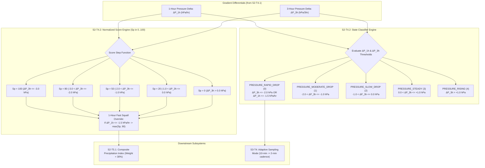

# Task Specification: S2-T4.2 - Barometric Pressure Trend State Classification & Scoring

## 1. Task Metadata & Overview

| Attribute | Specification Details |
| :--- | :--- |
| **Sprint** | **Sprint 2: Meteorological Algorithms & Nowcasting Engine** |
| **Task ID** | `S2-T4.2` |
| **Parent Task** | `S2-T4: Implement Multi-Variable Gradient Trend Detector` |
| **Task Title** | Implement Barometric Pressure Trend State Classification & Normalized Sub-Scoring |
| **Status** | **Ready for Implementation** |
| **Target Files** | [`firmware/app/inc/trend_detector.h`](file:///C:/Users/ENERGY%20SAVER/Documents/Learning/Job%20Projects/rain-predict/firmware/app/inc/trend_detector.h)<br>[`firmware/app/src/trend_detector.c`](file:///C:/Users/ENERGY%20SAVER/Documents/Learning/Job%20Projects/rain-predict/firmware/app/src/trend_detector.c) |
| **Related Documents** | [`context/specs/s2-t4.1-gradient-differentials.md`](file:///C:/Users/ENERGY%20SAVER/Documents/Learning/Job%20Projects/rain-predict/context/specs/s2-t4.1-gradient-differentials.md)<br>[`docs/algorithms/trend-detection-and-nowcasting.md`](file:///C:/Users/ENERGY%20SAVER/Documents/Learning/Job%20Projects/rain-predict/docs/algorithms/trend-detection-and-nowcasting.md)<br>[`docs/algorithms/meteorological-formulas.md`](file:///C:/Users/ENERGY%20SAVER/Documents/Learning/Job%20Projects/rain-predict/docs/algorithms/meteorological-formulas.md)<br>[`context/specs/s2-t3.1-zambretti-trend.md`](file:///C:/Users/ENERGY%20SAVER/Documents/Learning/Job%20Projects/rain-predict/context/specs/s2-t3.1-zambretti-trend.md)<br>[`context/coding-standards.md`](file:///C:/Users/ENERGY%20SAVER/Documents/Learning/Job%20Projects/rain-predict/context/coding-standards.md) |
| **Dependencies** | `S2-T4.1` (Gradient differentials), `S1-T1.1` (Root CMake build system) |
| **Downstream Tasks** | `S2-T4.3` (Solar cloud attenuation classifier), `S2-T4.4` (Trend detector unit tests), `S2-T5.1` (Composite nowcasting scoring engine) |

---

## 2. Executive Summary & Barometric Nowcasting Scope

The primary objective of **`S2-T4.2`** is to develop the **Barometric Pressure Trend State Classifier and Normalized Sub-Scoring Function ($S_P \in [0, 100]$)** within Layer 1 Application ([`firmware/app/inc/trend_detector.h`](file:///C:/Users/ENERGY%20SAVER/Documents/Learning/Job%20Projects/rain-predict/firmware/app/inc/trend_detector.h) / [`firmware/app/src/trend_detector.c`](file:///C:/Users/ENERGY%20SAVER/Documents/Learning/Job%20Projects/rain-predict/firmware/app/src/trend_detector.c)).

### Why High-Resolution Barometric Classification is Critical:
While the Zambretti algorithm (`S2-T3`) provides macro 3–12 hour synoptic forecasts, mesoscale tropical convective squalls and mountain thunderstorms develop within **30 to 90 minutes**. High-resolution barometric rate analysis provides two essential functions:
1. **Discrete State Classification (`pressure_trend_state_t`)**: Categorizes atmospheric forcing into 5 actionable states (`PRESSURE_RAPID_DROP`, `PRESSURE_MODERATE_DROP`, `PRESSURE_SLOW_DROP`, `PRESSURE_STEADY`, `PRESSURE_RISING`).
2. **Normalized Pressure Sub-Score ($S_P \in [0, 100]$, Weight $30\%$)**: Feeds into the Composite Precipitation Index ($CPI$).
3. **Adaptive Sampling Trigger**: Detection of `PRESSURE_RAPID_DROP` ($\Delta P_{1\text{h}} \le -1.5\text{ hPa/hr}$ or $\Delta P_{3\text{h}} \le -2.0\text{ hPa/3hr}$) instantly commands the system to enter **2-minute rapid storm tracking mode**.



---

## 3. Mathematical Formulations & Threshold Boundaries

### 3.1 State Classification Rules

$$\text{State} = \begin{cases}
\text{PRESSURE\_RAPID\_DROP} & \text{if } \Delta P_{3\text{h}} \le -2.00\text{ hPa} \text{ or } \Delta P_{1\text{h}} \le -1.50\text{ hPa} \\
\text{PRESSURE\_MODERATE\_DROP} & \text{if } -2.00\text{ hPa} < \Delta P_{3\text{h}} \le -1.00\text{ hPa} \\
\text{PRESSURE\_SLOW\_DROP} & \text{if } -1.00\text{ hPa} < \Delta P_{3\text{h}} \le 0.00\text{ hPa} \\
\text{PRESSURE\_STEADY} & \text{if } 0.00\text{ hPa} < \Delta P_{3\text{h}} \le +1.00\text{ hPa} \\
\text{PRESSURE\_RISING} & \text{if } \Delta P_{3\text{h}} > +1.00\text{ hPa}
\end{cases}$$

---

### 3.2 Normalized Barometric Scoring Function ($S_P$)
The base pressure score $S_{P\_base}$ is computed from the 3-hour tendency:

$$S_{P\_base} = \begin{cases}
100 & \text{if } \Delta P_{3\text{h}} \le -3.00\text{ hPa} \quad (\text{Severe tropical squall line}) \\
80  & \text{if } -3.00\text{ hPa} < \Delta P_{3\text{h}} \le -2.00\text{ hPa} \quad (\text{Rapid barometric fall}) \\
50  & \text{if } -2.00\text{ hPa} < \Delta P_{3\text{h}} \le -1.00\text{ hPa} \quad (\text{Moderate barometric fall}) \\
20  & \text{if } -1.00\text{ hPa} < \Delta P_{3\text{h}} \le 0.00\text{ hPa} \quad (\text{Slow barometric fall}) \\
0   & \text{if } \Delta P_{3\text{h}} > 0.00\text{ hPa} \quad (\text{Rising pressure / anticyclone})
\end{cases}$$

#### 1-Hour Convective Cloudburst Override:
If a localized storm cell causes a steep 1-hour plunge ($\Delta P_{1\text{h}} \le -1.50\text{ hPa/hr}$), the score is boosted immediately to ensure prompt early warning:

$$S_P = \max\left(S_{P\_base}, \, 90\right)$$

---

## 4. Embedded C99 Architecture & API Design

In accordance with [`context/coding-standards.md`](file:///C:/Users/ENERGY%20SAVER/Documents/Learning/Job%20Projects/rain-predict/context/coding-standards.md):

### 4.1 Additions to Header File ([`firmware/app/inc/trend_detector.h`](file:///C:/Users/ENERGY%20SAVER/Documents/Learning/Job%20Projects/rain-predict/firmware/app/inc/trend_detector.h))

```c
/**
 * @brief Barometric pressure trend state classifications.
 */
typedef enum {
    PRESSURE_RAPID_DROP     = 0, /**< Drop > 2.0 hPa/3h or > 1.5 hPa/1h (Severe storm risk) */
    PRESSURE_MODERATE_DROP  = 1, /**< Drop 1.0 to 2.0 hPa/3h (Developing low trough) */
    PRESSURE_SLOW_DROP      = 2, /**< Drop 0.0 to 1.0 hPa/3h (Weak diurnal decrease) */
    PRESSURE_STEADY         = 3, /**< Pressure change 0.0 to +1.0 hPa/3h (Stable field) */
    PRESSURE_RISING         = 4  /**< Pressure rise > 1.0 hPa/3h (Building anticyclone/clearing) */
} pressure_trend_state_t;

/**
 * @brief Pressure trend threshold constants.
 */
#define BARO_THRESH_RAPID_DROP_3H_HPA       (-2.00f)
#define BARO_THRESH_RAPID_DROP_1H_HPA       (-1.50f)
#define BARO_THRESH_MOD_DROP_3H_HPA         (-1.00f)
#define BARO_THRESH_SEVERE_SQUALL_3H_HPA    (-3.00f)

/**
 * @brief Classifies the discrete barometric pressure trend state.
 * 
 * @param[in]  delta_p_1h    1-hour barometric delta in hPa.
 * @param[in]  delta_p_3h    3-hour barometric delta in hPa.
 * @param[out] p_state       Pointer to store classified pressure_trend_state_t.
 * @return int32_t           0 on success, negative error code on failure.
 */
int32_t trend_detector_classify_pressure(float delta_p_1h,
                                         float delta_p_3h,
                                         pressure_trend_state_t *p_state);

/**
 * @brief Computes normalized barometric precipitation sub-score (0 to 100).
 * 
 * @param[in]  delta_p_1h    1-hour barometric delta in hPa.
 * @param[in]  delta_p_3h    3-hour barometric delta in hPa.
 * @param[out] p_score       Pointer to store normalized score (0 to 100).
 * @return int32_t           0 on success, negative error code on failure.
 */
int32_t trend_detector_score_pressure(float delta_p_1h,
                                      float delta_p_3h,
                                      uint8_t *p_score);

/**
 * @brief Returns descriptive name string for a given pressure trend state.
 * 
 * @param[in]  state         Classified pressure trend state.
 * @return const char*       Pointer to flash string descriptor.
 */
const char *trend_detector_get_pressure_state_name(pressure_trend_state_t state);
```

---

### 4.2 Additions to Source File ([`firmware/app/src/trend_detector.c`](file:///C:/Users/ENERGY%20SAVER/Documents/Learning/Job%20Projects/rain-predict/firmware/app/src/trend_detector.c))

```c
static const char * const s_pressure_state_names[5] = {
    "Rapid Drop (Storm Imminent)",
    "Moderate Drop (Trough Developing)",
    "Slow Drop (Normal Diurnal)",
    "Steady (Stable Atmosphere)",
    "Rising (High Anticyclone)"
};

int32_t trend_detector_classify_pressure(float delta_p_1h,
                                         float delta_p_3h,
                                         pressure_trend_state_t *p_state)
{
    if (p_state == NULL) {
        return ERR_NULL_PTR_CODE;
    }
    if (isnan(delta_p_1h) || isnan(delta_p_3h)) {
        return ERR_INVALID_ARG_CODE;
    }

    if (delta_p_3h <= BARO_THRESH_RAPID_DROP_3H_HPA ||
        delta_p_1h <= BARO_THRESH_RAPID_DROP_1H_HPA) {
        *p_state = PRESSURE_RAPID_DROP;
    } else if (delta_p_3h <= BARO_THRESH_MOD_DROP_3H_HPA) {
        *p_state = PRESSURE_MODERATE_DROP;
    } else if (delta_p_3h <= 0.0f) {
        *p_state = PRESSURE_SLOW_DROP;
    } else if (delta_p_3h <= 1.0f) {
        *p_state = PRESSURE_STEADY;
    } else {
        *p_state = PRESSURE_RISING;
    }

    return STATUS_OK_CODE;
}

int32_t trend_detector_score_pressure(float delta_p_1h,
                                      float delta_p_3h,
                                      uint8_t *p_score)
{
    if (p_score == NULL) {
        return ERR_NULL_PTR_CODE;
    }
    if (isnan(delta_p_1h) || isnan(delta_p_3h)) {
        return ERR_INVALID_ARG_CODE;
    }

    uint8_t score = 0U;

    if (delta_p_3h <= BARO_THRESH_SEVERE_SQUALL_3H_HPA) {
        score = 100U;
    } else if (delta_p_3h <= BARO_THRESH_RAPID_DROP_3H_HPA) {
        score = 80U;
    } else if (delta_p_3h <= BARO_THRESH_MOD_DROP_3H_HPA) {
        score = 50U;
    } else if (delta_p_3h <= 0.0f) {
        score = 20U;
    } else {
        score = 0U;
    }

    /* Fast 1-hour squall override */
    if (delta_p_1h <= BARO_THRESH_RAPID_DROP_1H_HPA) {
        if (score < 90U) {
            score = 90U;
        }
    }

    *p_score = score;
    return STATUS_OK_CODE;
}

const char *trend_detector_get_pressure_state_name(pressure_trend_state_t state)
{
    if (state > PRESSURE_RISING) {
        return "Unknown Pressure State";
    }
    return s_pressure_state_names[(uint8_t)state];
}
```

---

## 5. Verification Vectors & Acceptance Test Cases

| Test ID | Input $\Delta P_{1\text{h}}$ | Input $\Delta P_{3\text{h}}$ | Expected `pressure_trend_state_t` | Expected $S_P$ Score | Meteorological Scenario |
| :--- | :--- | :--- | :--- | :--- | :--- |
| **TC-PS-01: Severe Squall Line** | $-1.80\text{ hPa}$ | $-3.50\text{ hPa}$ | `PRESSURE_RAPID_DROP` (0) | $100$ | Mesoscale convective system |
| **TC-PS-02: Rapid 3-Hour Drop** | $-0.80\text{ hPa}$ | $-2.20\text{ hPa}$ | `PRESSURE_RAPID_DROP` (0) | $80$ | Monsoon low depression |
| **TC-PS-03: Sudden 1-Hour Squall** | $-1.60\text{ hPa}$ | $-1.20\text{ hPa}$ | `PRESSURE_RAPID_DROP` (0) | $90$ (1h override) | Fast gust front / thunderstorm |
| **TC-PS-04: Moderate Trough** | $-0.40\text{ hPa}$ | $-1.50\text{ hPa}$ | `PRESSURE_MODERATE_DROP` (1) | $50$ | Approaching cloudy trough |
| **TC-PS-05: Diurnal Drift** | $-0.10\text{ hPa}$ | $-0.60\text{ hPa}$ | `PRESSURE_SLOW_DROP` (2) | $20$ | Natural solar thermal tidal swing |
| **TC-PS-06: Flat Calm Field** | $0.00\text{ hPa}$ | $+0.50\text{ hPa}$ | `PRESSURE_STEADY` (3) | $0$ | Stable barometric field |
| **TC-PS-07: Building Anticyclone** | $+0.60\text{ hPa}$ | $+1.80\text{ hPa}$ | `PRESSURE_RISING` (4) | $0$ | Post-storm clearing high pressure |
| **TC-PS-08: State Descriptor Lookup**| - | - | - | - | Returns non-empty string |
| **TC-PS-09: Null Pointer Trap** | $-1.00\text{ hPa}$ | $-1.00\text{ hPa}$ | `NULL` | `NULL` | Returns `ERR_NULL_PTR_CODE` |
| **TC-PS-10: NaN Input Robustness** | `NAN` | $-1.00\text{ hPa}$ | - | - | Returns `ERR_INVALID_ARG_CODE` |

---

## 6. Traceability & Acceptance Criteria

### Acceptance Checklist:
- [ ] [`firmware/app/inc/trend_detector.h`](file:///C:/Users/ENERGY%20SAVER/Documents/Learning/Job%20Projects/rain-predict/firmware/app/inc/trend_detector.h) declares `pressure_trend_state_t` enum and barometric classification/scoring prototypes.
- [ ] [`firmware/app/src/trend_detector.c`](file:///C:/Users/ENERGY%20SAVER/Documents/Learning/Job%20Projects/rain-predict/firmware/app/src/trend_detector.c) implements `trend_detector_classify_pressure()` and `trend_detector_score_pressure()`.
- [ ] 1-hour fast drop override ($\Delta P_{1\text{h}} \le -1.5\text{ hPa/hr}$) correctly elevates score to $\ge 90$ and classifies as `PRESSURE_RAPID_DROP`.
- [ ] Zero dynamic memory allocation and execution latency $< 150$ CPU cycles @ 48 MHz.
- [ ] Fully linked in [`context/specs/spec-roadmap.md`](file:///C:/Users/ENERGY%20SAVER/Documents/Learning/Job%20Projects/rain-predict/context/specs/spec-roadmap.md).
