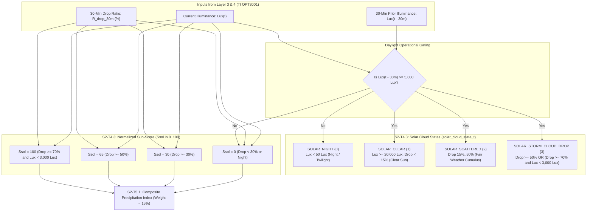

# Task Specification: S2-T4.3 - Solar Irradiance Cloud Attenuation Classification & Scoring

## 1. Task Metadata & Overview

| Attribute | Specification Details |
| :--- | :--- |
| **Sprint** | **Sprint 2: Meteorological Algorithms & Nowcasting Engine** |
| **Task ID** | `S2-T4.3` |
| **Parent Task** | `S2-T4: Implement Multi-Variable Gradient Trend Detector` |
| **Task Title** | Implement Solar Irradiance Cloud Attenuation State Classification & Scoring |
| **Status** | **Ready for Implementation** |
| **Target Files** | [`firmware/app/inc/trend_detector.h`](file:///C:/Users/ENERGY%20SAVER/Documents/Learning/Job%20Projects/rain-predict/firmware/app/inc/trend_detector.h)<br>[`firmware/app/src/trend_detector.c`](file:///C:/Users/ENERGY%20SAVER/Documents/Learning/Job%20Projects/rain-predict/firmware/app/src/trend_detector.c) |
| **Related Documents** | [`context/specs/s2-t4.1-gradient-differentials.md`](file:///C:/Users/ENERGY%20SAVER/Documents/Learning/Job%20Projects/rain-predict/context/specs/s2-t4.1-gradient-differentials.md)<br>[`context/specs/s2-t4.2-pressure-trend-states.md`](file:///C:/Users/ENERGY%20SAVER/Documents/Learning/Job%20Projects/rain-predict/context/specs/s2-t4.2-pressure-trend-states.md)<br>[`docs/algorithms/trend-detection-and-nowcasting.md`](file:///C:/Users/ENERGY%20SAVER/Documents/Learning/Job%20Projects/rain-predict/docs/algorithms/trend-detection-and-nowcasting.md)<br>[`docs/sensors/opt3001-ambient-light.md`](file:///C:/Users/ENERGY%20SAVER/Documents/Learning/Job%20Projects/rain-predict/docs/sensors/opt3001-ambient-light.md)<br>[`context/coding-standards.md`](file:///C:/Users/ENERGY%20SAVER/Documents/Learning/Job%20Projects/rain-predict/context/coding-standards.md) |
| **Dependencies** | `S2-T4.1` (Gradient differentials), `S1-T1.1` (Root CMake build system) |
| **Downstream Tasks** | `S2-T4.4` (Trend detector unit tests), `S2-T5.1` (Composite nowcasting scoring engine) |

---

## 2. Executive Summary & Optical Nowcasting Scope

The primary objective of **`S2-T4.3`** is to develop the **Solar Irradiance Cloud Attenuation State Classifier and Normalized Solar Sub-Scoring Function ($S_{SOL} \in [0, 100]$)** within Layer 1 Application ([`firmware/app/inc/trend_detector.h`](file:///C:/Users/ENERGY%20SAVER/Documents/Learning/Job%20Projects/rain-predict/firmware/app/inc/trend_detector.h) / [`firmware/app/src/trend_detector.c`](file:///C:/Users/ENERGY%20SAVER/Documents/Learning/Job%20Projects/rain-predict/firmware/app/src/trend_detector.c)).

### Why Optical Lux Sensing is a Critical Early Indicator:
In mountainous tropical tea estates (e.g. Nilgiris / Western Ghats), convective storm clouds (**Cumulonimbus incus / congestus**) grow vertically to heights of $8,000\text{ m}$ to $14,000\text{ m}$ in less than $45\text{ minutes}$.
1. **Optical Cloud Thickness Extinction**: A towering storm cell advancing over the estate canopy attenuates broadband ambient solar irradiance from peak sunlight ($60,000–100,000\text{ Lux}$) down to deep twilight ($< 2,000\text{ Lux}$) in $15–30\text{ minutes}$.
2. **Advance Lead Time**: Optical cloud attenuation occurs **$20–45\text{ minutes}$ BEFORE** the first raindrops strike the tipping bucket gauge, providing crucial lead time to sound field worker sirens.
3. **Nighttime & Dawn/Dusk Gating**: The optical classifier automatically suppresses false alarms at night or during low-sun twilight ($Lux < 5,000\text{ Lux}$), setting $S_{SOL} = 0$.



---

## 3. Mathematical Formulations & Classification Rules

### 3.1 Relative Solar Attenuation Ratio ($R_{drop\_30m}$)

$$R_{drop\_30m} = \left(\frac{Lux[t - 30\text{m}] - Lux[t]}{Lux[t - 30\text{m}]}\right) \times 100.0\%$$

---

### 3.2 State Classification Logic

$$\text{State} = \begin{cases}
\text{SOLAR\_NIGHT} & \text{if } Lux[t - 30\text{m}] < 50.0\text{ Lux} \text{ and } Lux[t] < 50.0\text{ Lux} \\
\text{SOLAR\_STORM\_CLOUD\_DROP} & \text{if } Lux[t - 30\text{m}] \ge 5000.0\text{ Lux} \text{ and } (R_{drop\_30m} \ge 50.0\% \text{ or } (R_{drop\_30m} \ge 70.0\% \text{ and } Lux[t] < 3000.0\text{ Lux})) \\
\text{SOLAR\_SCATTERED} & \text{if } Lux[t - 30\text{m}] \ge 5000.0\text{ Lux} \text{ and } (15.0\% \le R_{drop\_30m} < 50.0\% \text{ or } Lux[t] < 20000.0\text{ Lux}) \\
\text{SOLAR\_CLEAR} & \text{otherwise (Unattenuated direct sunlight } \ge 20000.0\text{ Lux)}
\end{cases}$$

---

### 3.3 Normalized Solar Sub-Score ($S_{SOL} \in [0, 100]$)

$$S_{SOL} = \begin{cases}
100 & \text{if } Lux[t - 30\text{m}] \ge 5000.0\text{ Lux}, \, R_{drop\_30m} \ge 70.0\%, \text{ and } Lux[t] < 3000.0\text{ Lux} \\
65  & \text{if } Lux[t - 30\text{m}] \ge 5000.0\text{ Lux} \text{ and } R_{drop\_30m} \ge 50.0\% \\
30  & \text{if } Lux[t - 30\text{m}] \ge 5000.0\text{ Lux} \text{ and } R_{drop\_30m} \ge 30.0\% \\
0   & \text{if } Lux[t - 30\text{m}] < 5000.0\text{ Lux} \text{ or } R_{drop\_30m} < 30.0\%
\end{cases}$$

---

## 4. Embedded C99 Architecture & API Design

In accordance with [`context/coding-standards.md`](file:///C:/Users/ENERGY%20SAVER/Documents/Learning/Job%20Projects/rain-predict/context/coding-standards.md):

### 4.1 Additions to Header File ([`firmware/app/inc/trend_detector.h`](file:///C:/Users/ENERGY%20SAVER/Documents/Learning/Job%20Projects/rain-predict/firmware/app/inc/trend_detector.h))

```c
/**
 * @brief Solar irradiance cloud attenuation states.
 */
typedef enum {
    SOLAR_NIGHT             = 0, /**< Night / Dawn / Dusk (Lux < 50) */
    SOLAR_CLEAR             = 1, /**< Clear direct sunlight (> 20,000 Lux, drop < 15%) */
    SOLAR_SCATTERED         = 2, /**< Scattered fair-weather cumulus / cirrus (drop 15-50%) */
    SOLAR_STORM_CLOUD_DROP  = 3  /**< Severe optical extinction by cumulonimbus (drop >= 50%) */
} solar_cloud_state_t;

/**
 * @brief Solar cloud attenuation threshold constants.
 */
#define SOLAR_NIGHT_THRESH_LUX              (50.0f)
#define SOLAR_CLEAR_MIN_LUX                 (20000.0f)
#define SOLAR_STORM_DARKNESS_LUX            (3000.0f)
#define SOLAR_DROP_THRESH_SEVERE_PCT        (70.0f)
#define SOLAR_DROP_THRESH_MODERATE_PCT      (50.0f)
#define SOLAR_DROP_THRESH_MILD_PCT          (30.0f)
#define SOLAR_DROP_THRESH_CLEAR_PCT         (15.0f)

/**
 * @brief Classifies the discrete solar irradiance cloud attenuation state.
 * 
 * @param[in]  lux_now        Current measured ambient light in Lux.
 * @param[in]  lux_30m_ago    Light level 30 minutes prior in Lux.
 * @param[in]  drop_pct_30m   Calculated 30-minute relative drop percentage (0 to 100).
 * @param[out] p_state        Pointer to store classified solar_cloud_state_t.
 * @return int32_t            0 on success, negative error code on failure.
 */
int32_t trend_detector_classify_solar(float lux_now,
                                      float lux_30m_ago,
                                      float drop_pct_30m,
                                      solar_cloud_state_t *p_state);

/**
 * @brief Computes normalized solar cloud attenuation precipitation sub-score (0 to 100).
 * 
 * @param[in]  lux_now        Current measured ambient light in Lux.
 * @param[in]  lux_30m_ago    Light level 30 minutes prior in Lux.
 * @param[in]  drop_pct_30m   Calculated 30-minute relative drop percentage.
 * @param[out] p_score        Pointer to store normalized score (0 to 100).
 * @return int32_t            0 on success, negative error code on failure.
 */
int32_t trend_detector_score_solar(float lux_now,
                                   float lux_30m_ago,
                                   float drop_pct_30m,
                                   uint8_t *p_score);

/**
 * @brief Returns descriptive name string for a given solar cloud state.
 * 
 * @param[in]  state          Classified solar cloud state.
 * @return const char*        Pointer to flash string descriptor.
 */
const char *trend_detector_get_solar_state_name(solar_cloud_state_t state);
```

---

### 4.2 Additions to Source File ([`firmware/app/src/trend_detector.c`](file:///C:/Users/ENERGY%20SAVER/Documents/Learning/Job%20Projects/rain-predict/firmware/app/src/trend_detector.c))

```c
static const char * const s_solar_state_names[4] = {
    "Night / Low Light",
    "Clear Sky (High Insolation)",
    "Scattered Clouds",
    "Storm Cloud Extinction (Cumulonimbus)"
};

int32_t trend_detector_classify_solar(float lux_now,
                                      float lux_30m_ago,
                                      float drop_pct_30m,
                                      solar_cloud_state_t *p_state)
{
    if (p_state == NULL) {
        return ERR_NULL_PTR_CODE;
    }
    if (isnan(lux_now) || isnan(lux_30m_ago) || isnan(drop_pct_30m)) {
        return ERR_INVALID_ARG_CODE;
    }

    if (lux_now < SOLAR_NIGHT_THRESH_LUX && lux_30m_ago < SOLAR_NIGHT_THRESH_LUX) {
        *p_state = SOLAR_NIGHT;
    } else if (lux_30m_ago >= SOLAR_DAYLIGHT_MIN_LUX &&
               (drop_pct_30m >= SOLAR_DROP_THRESH_MODERATE_PCT ||
                (drop_pct_30m >= SOLAR_DROP_THRESH_SEVERE_PCT && lux_now < SOLAR_STORM_DARKNESS_LUX))) {
        *p_state = SOLAR_STORM_CLOUD_DROP;
    } else if (drop_pct_30m >= SOLAR_DROP_THRESH_CLEAR_PCT || lux_now < SOLAR_CLEAR_MIN_LUX) {
        *p_state = SOLAR_SCATTERED;
    } else {
        *p_state = SOLAR_CLEAR;
    }

    return STATUS_OK_CODE;
}

int32_t trend_detector_score_solar(float lux_now,
                                   float lux_30m_ago,
                                   float drop_pct_30m,
                                   uint8_t *p_score)
{
    if (p_score == NULL) {
        return ERR_NULL_PTR_CODE;
    }
    if (isnan(lux_now) || isnan(lux_30m_ago) || isnan(drop_pct_30m)) {
        return ERR_INVALID_ARG_CODE;
    }

    /* Suppress scoring if prior light was below daylight threshold */
    if (lux_30m_ago < SOLAR_DAYLIGHT_MIN_LUX) {
        *p_score = 0U;
        return STATUS_OK_CODE;
    }

    uint8_t score = 0U;

    if (drop_pct_30m >= SOLAR_DROP_THRESH_SEVERE_PCT && lux_now < SOLAR_STORM_DARKNESS_LUX) {
        score = 100U;
    } else if (drop_pct_30m >= SOLAR_DROP_THRESH_MODERATE_PCT) {
        score = 65U;
    } else if (drop_pct_30m >= SOLAR_DROP_THRESH_MILD_PCT) {
        score = 30U;
    } else {
        score = 0U;
    }

    *p_score = score;
    return STATUS_OK_CODE;
}

const char *trend_detector_get_solar_state_name(solar_cloud_state_t state)
{
    if (state > SOLAR_STORM_CLOUD_DROP) {
        return "Unknown Solar State";
    }
    return s_solar_state_names[(uint8_t)state];
}
```

---

## 5. Verification Vectors & Acceptance Test Cases

| Test ID | $Lux_{30m\_ago}$ | $Lux_{now}$ | Drop $\%$ | Expected `solar_cloud_state_t` | Expected $S_{SOL}$ Score | Scenario Description |
| :--- | :--- | :--- | :--- | :--- | :--- | :--- |
| **TC-SO-01: Cumulonimbus Blackout** | $60,000\text{ Lux}$ | $1,500\text{ Lux}$ | $97.5\%$ | `SOLAR_STORM_CLOUD_DROP` (3) | $100$ | Massive storm cloud overhead |
| **TC-SO-02: Moderate Storm Cloud** | $50,000\text{ Lux}$ | $20,000\text{ Lux}$| $60.0\%$ | `SOLAR_STORM_CLOUD_DROP` (3) | $65$ | Dense cloud darkening |
| **TC-SO-03: Mild Cloud Shadow** | $60,000\text{ Lux}$ | $38,000\text{ Lux}$| $36.7\%$ | `SOLAR_SCATTERED` (2) | $30$ | Passing cumulus cloud |
| **TC-SO-04: Clear Sunshine** | $80,000\text{ Lux}$ | $78,000\text{ Lux}$| $2.5\%$ | `SOLAR_CLEAR` (1) | $0$ | High solar noon insolation |
| **TC-SO-05: Nighttime Gating** | $20.0\text{ Lux}$ | $10.0\text{ Lux}$ | $50.0\%$ | `SOLAR_NIGHT` (0) | $0$ (Bypassed) | Darkness / midnight |
| **TC-SO-06: Low Twilight Gating** | $3,000\text{ Lux}$ | $1,000\text{ Lux}$ | $66.7\%$ | `SOLAR_SCATTERED` (2) | $0$ ($< 5000$ Lux) | Dusk twilight transition |
| **TC-SO-07: State Descriptor** | - | - | - | `SOLAR_STORM_CLOUD_DROP` | - | `"Storm Cloud Extinction (Cumulonimbus)"` |
| **TC-SO-08: Null Pointer Guard** | $50,000\text{ Lux}$ | $10,000\text{ Lux}$| $80.0\%$ | `NULL` | `NULL` | Returns `ERR_NULL_PTR_CODE` |

---

## 6. Traceability & Acceptance Criteria

### Acceptance Checklist:
- [ ] [`firmware/app/inc/trend_detector.h`](file:///C:/Users/ENERGY%20SAVER/Documents/Learning/Job%20Projects/rain-predict/firmware/app/inc/trend_detector.h) declares `solar_cloud_state_t` enum and solar classification/scoring APIs.
- [ ] [`firmware/app/src/trend_detector.c`](file:///C:/Users/ENERGY%20SAVER/Documents/Learning/Job%20Projects/rain-predict/firmware/app/src/trend_detector.c) implements `trend_detector_classify_solar()` and `trend_detector_score_solar()`.
- [ ] Nighttime ($Lux < 50\text{ Lux}$) and low-sun twilight ($Lux < 5000\text{ Lux}$) strictly yield $S_{SOL} = 0$.
- [ ] Severe cumulonimbus blackout ($\ge 70\%$ drop and $Lux < 3000\text{ Lux}$) outputs $S_{SOL} = 100$.
- [ ] Zero dynamic memory allocation and latency $< 120$ CPU cycles @ 48 MHz.
- [ ] Fully linked in [`context/specs/spec-roadmap.md`](file:///C:/Users/ENERGY%20SAVER/Documents/Learning/Job%20Projects/rain-predict/context/specs/spec-roadmap.md).
