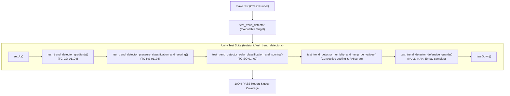

# Task Specification: S2-T4.4 - Multi-Variable Trend Detector Unit Test Suite

## 1. Task Metadata & Overview

| Attribute | Specification Details |
| :--- | :--- |
| **Sprint** | **Sprint 2: Meteorological Algorithms & Nowcasting Engine** |
| **Task ID** | `S2-T4.4` |
| **Parent Task** | `S2-T4: Implement Multi-Variable Gradient Trend Detector` |
| **Task Title** | Create Unity Test Suite for Multi-Variable Gradient Differentials & State Classifiers |
| **Status** | **Ready for Implementation** |
| **Target Files** | [`tests/unit/test_trend_detector.c`](file:///C:/Users/ENERGY%20SAVER/Documents/Learning/Job%20Projects/rain-predict/tests/unit/test_trend_detector.c)<br>[`tests/CMakeLists.txt`](file:///C:/Users/ENERGY%20SAVER/Documents/Learning/Job%20Projects/rain-predict/tests/CMakeLists.txt) |
| **Related Documents** | [`context/specs/s2-t4.1-gradient-differentials.md`](file:///C:/Users/ENERGY%20SAVER/Documents/Learning/Job%20Projects/rain-predict/context/specs/s2-t4.1-gradient-differentials.md)<br>[`context/specs/s2-t4.2-pressure-trend-states.md`](file:///C:/Users/ENERGY%20SAVER/Documents/Learning/Job%20Projects/rain-predict/context/specs/s2-t4.2-pressure-trend-states.md)<br>[`context/specs/s2-t4.3-solar-cloud-states.md`](file:///C:/Users/ENERGY%20SAVER/Documents/Learning/Job%20Projects/rain-predict/context/specs/s2-t4.3-solar-cloud-states.md)<br>[`context/specs/s1-t2.1-unity-test-harness.md`](file:///C:/Users/ENERGY%20SAVER/Documents/Learning/Job%20Projects/rain-predict/context/specs/s1-t2.1-unity-test-harness.md)<br>[`docs/algorithms/trend-detection-and-nowcasting.md`](file:///C:/Users/ENERGY%20SAVER/Documents/Learning/Job%20Projects/rain-predict/docs/algorithms/trend-detection-and-nowcasting.md)<br>[`context/coding-standards.md`](file:///C:/Users/ENERGY%20SAVER/Documents/Learning/Job%20Projects/rain-predict/context/coding-standards.md) |
| **Dependencies** | `S1-T2.1` (Unity Framework), `S2-T4.1`, `S2-T4.2`, `S2-T4.3` (`trend_detector.h` / `trend_detector.c`) |
| **Downstream Tasks** | `S2-T5` (Composite rain nowcasting scoring engine) |

---

## 2. Executive Summary & Verification Scope

The primary objective of **`S2-T4.4`** is to develop [`tests/unit/test_trend_detector.c`](file:///C:/Users/ENERGY%20SAVER/Documents/Learning/Job%20Projects/rain-predict/tests/unit/test_trend_detector.c), an automated ThrowTheSwitch Unity test suite validating all components of the multi-variable gradient detection module ([`firmware/app/src/trend_detector.c`](file:///C:/Users/ENERGY%20SAVER/Documents/Learning/Job%20Projects/rain-predict/firmware/app/src/trend_detector.c)).

### Verification Objectives:
1. **Gradient Differentials Accuracy**: Verify 1-hour and 3-hour differentials for barometric pressure ($\Delta P$), relative humidity ($\Delta RH$), temperature ($\Delta T$), and 30-minute solar illuminance ($\Delta Lux, R_{drop\_30m}$) with float precision.
2. **Partial History Bootstrapping**: Confirm linear scaling behavior during cold-boot startup ($N = 6 \to 18$).
3. **Barometric State Classification & Scoring**: Validate all 5 pressure states and normalized scoring ($S_P \in [0, 100]$) including 1-hour convective squall overrides.
4. **Solar Attenuation Classification & Scoring**: Validate all 4 optical states, daylight gating ($Lux_{prior} \ge 5000\text{ Lux}$), and normalized scoring ($S_{SOL} \in [0, 100]$).
5. **Defensive Error Handling**: Ensure zero crashes or traps when encountering `NULL` pointers, `NAN` sensor floats, or empty history buffers.
6. **100% Statement & Branch Coverage**: Validate all execution paths under `make coverage`.



---

## 3. Test Fixture & Verification Matrix

The test suite implements 5 dedicated test functions covering all analytical derivatives, state mappings, and exceptional cases:

### 3.1 Test Coverage Matrix

| Test Function | Target Subsystem | Assertions & Scenarios Checked |
| :--- | :--- | :--- |
| `test_trend_detector_gradients` | `trend_detector_compute_gradients` | Full 18-sample history array (3 hours): validates $\Delta P_{1\text{h}}$, $\Delta P_{3\text{h}}$, $\Delta RH_{1\text{h}}$, $\Delta RH_{3\text{h}}$, $\Delta T_{1\text{h}}$, $\Delta T_{3\text{h}}$, $\Delta Lux_{30\text{m}}$, and $R_{drop\_30m}$; tests 6-sample scaled bootstrapping and empty buffer handling. |
| `test_trend_detector_pressure_classification_and_scoring` | `trend_detector_classify_pressure`, `trend_detector_score_pressure` | Tests `PRESSURE_RAPID_DROP` ($S_P = 80..100$), `PRESSURE_MODERATE_DROP` ($S_P = 50$), `PRESSURE_SLOW_DROP` ($S_P = 20$), `PRESSURE_STEADY` ($S_P = 0$), `PRESSURE_RISING` ($S_P = 0$); verifies 1-hour fast drop override ($\Delta P_{1\text{h}} \le -1.5 \implies S_P \ge 90$). |
| `test_trend_detector_solar_classification_and_scoring` | `trend_detector_classify_solar`, `trend_detector_score_solar` | Tests `SOLAR_STORM_CLOUD_DROP` ($S_{SOL} = 65..100$), `SOLAR_SCATTERED` ($S_{SOL} = 30$), `SOLAR_CLEAR` ($S_{SOL} = 0$), `SOLAR_NIGHT` ($S_{SOL} = 0$); tests daylight threshold suppression ($Lux < 5000$). |
| `test_trend_detector_humidity_and_temp_derivatives` | `trend_detector_compute_gradients` | Confirms steep humidity surge ($\ge +15\%/\text{hr}$) and rapid evaporative convective temperature plunge ($\le -4^\circ\text{C/hr}$) are recorded accurately in output struct. |
| `test_trend_detector_defensive_guards` | All `trend_detector.c` APIs | Verifies error return codes for `NULL` sample arrays, `NULL` struct pointers, `NAN` float fields in samples, and invalid state enums. |

---

## 4. Test Suite Implementation ([`tests/unit/test_trend_detector.c`](file:///C:/Users/ENERGY%20SAVER/Documents/Learning/Job%20Projects/rain-predict/tests/unit/test_trend_detector.c))

```c
/**
 * @file test_trend_detector.c
 * @brief Unit tests for multi-variable atmospheric gradient detection engine.
 */

#include "unity.h"
#include "trend_detector.h"
#include <math.h>
#include <string.h>

void setUp(void)
{
    /* No state initialization needed; pure struct calculations */
}

void tearDown(void)
{
    /* No state cleanup required */
}

void test_trend_detector_gradients(void)
{
    /* Construct 19 chronological samples (index 0 = oldest, 18 = newest) */
    env_sample_t history[19];
    for (uint32_t i = 0; i < 19; i++) {
        history[i].p0_hpa = 1010.0f - ((float)i * (3.0f / 18.0f));     /* Drops by 3.0 hPa over 3h */
        history[i].rh_pct = 60.0f + ((float)i * (20.0f / 18.0f));      /* Rises by 20% over 3h */
        history[i].temp_c = 25.0f - ((float)i * (4.0f / 18.0f));       /* Drops by 4.0°C over 3h */
        history[i].lux = 60000.0f - ((float)i * (50000.0f / 18.0f));   /* Drops from 60k to 10k Lux */
        history[i].timestamp_s = 1000U + (i * 600U);
    }

    multi_gradient_t grad;
    TEST_ASSERT_EQUAL_INT(0, trend_detector_compute_gradients(history, 19, &grad));

    /* 3-hour delta (sample 18 vs sample 0) */
    TEST_ASSERT_FLOAT_WITHIN(0.05f, -3.00f, grad.delta_p_3h_hpa);
    TEST_ASSERT_FLOAT_WITHIN(0.05f, 20.00f, grad.delta_rh_3h_pct);
    TEST_ASSERT_FLOAT_WITHIN(0.05f, -4.00f, grad.delta_t_3h_c);
    TEST_ASSERT_TRUE(grad.is_history_complete);

    /* 1-hour delta (sample 18 vs sample 12, 6 samples) */
    TEST_ASSERT_FLOAT_WITHIN(0.05f, -1.00f, grad.delta_p_1h_hpa);
    TEST_ASSERT_FLOAT_WITHIN(0.05f, 6.67f, grad.delta_rh_1h_pct);
    TEST_ASSERT_FLOAT_WITHIN(0.05f, -1.33f, grad.delta_t_1h_c);

    /* 30-min solar drop (sample 18 vs sample 15, 3 samples) */
    /* Lux at 15 is 60k - 15*(50k/18) = 18333 Lux. Lux at 18 is 10000 Lux. Drop = 8333 Lux (~45.4%) */
    TEST_ASSERT_FLOAT_WITHIN(100.0f, -8333.3f, grad.delta_lux_30m);
    TEST_ASSERT_FLOAT_WITHIN(1.0f, 45.45f, grad.solar_drop_pct_30m);

    /* Partial history scaled test: 7 samples (1 hour) */
    multi_gradient_t partial_grad;
    TEST_ASSERT_EQUAL_INT(0, trend_detector_compute_gradients(history, 7, &partial_grad));
    TEST_ASSERT_FALSE(partial_grad.is_history_complete);
    TEST_ASSERT_FLOAT_WITHIN(0.1f, -3.00f, partial_grad.delta_p_3h_hpa);

    /* Empty sample test */
    TEST_ASSERT_TRUE(trend_detector_compute_gradients(history, 0, &grad) < 0);
}

void test_trend_detector_pressure_classification_and_scoring(void)
{
    pressure_trend_state_t state;
    uint8_t score = 0;

    /* TC-PS-01: Severe Squall (-3.5 hPa/3h) -> RAPID_DROP, Score 100 */
    TEST_ASSERT_EQUAL_INT(0, trend_detector_classify_pressure(-1.0f, -3.50f, &state));
    TEST_ASSERT_EQUAL_INT(PRESSURE_RAPID_DROP, state);
    TEST_ASSERT_EQUAL_INT(0, trend_detector_score_pressure(-1.0f, -3.50f, &score));
    TEST_ASSERT_EQUAL_UINT8(100, score);

    /* TC-PS-02: Rapid Drop (-2.2 hPa/3h) -> RAPID_DROP, Score 80 */
    TEST_ASSERT_EQUAL_INT(0, trend_detector_classify_pressure(-0.8f, -2.20f, &state));
    TEST_ASSERT_EQUAL_INT(PRESSURE_RAPID_DROP, state);
    TEST_ASSERT_EQUAL_INT(0, trend_detector_score_pressure(-0.8f, -2.20f, &score));
    TEST_ASSERT_EQUAL_UINT8(80, score);

    /* TC-PS-03: Sudden 1-Hour Squall (-1.6 hPa/1h, -1.2 hPa/3h) -> RAPID_DROP, Score 90 (override) */
    TEST_ASSERT_EQUAL_INT(0, trend_detector_classify_pressure(-1.60f, -1.20f, &state));
    TEST_ASSERT_EQUAL_INT(PRESSURE_RAPID_DROP, state);
    TEST_ASSERT_EQUAL_INT(0, trend_detector_score_pressure(-1.60f, -1.20f, &score));
    TEST_ASSERT_EQUAL_UINT8(90, score);

    /* TC-PS-04: Moderate Trough (-1.5 hPa/3h) -> MODERATE_DROP, Score 50 */
    TEST_ASSERT_EQUAL_INT(0, trend_detector_classify_pressure(-0.4f, -1.50f, &state));
    TEST_ASSERT_EQUAL_INT(PRESSURE_MODERATE_DROP, state);
    TEST_ASSERT_EQUAL_INT(0, trend_detector_score_pressure(-0.4f, -1.50f, &score));
    TEST_ASSERT_EQUAL_UINT8(50, score);

    /* TC-PS-05: Diurnal Drift (-0.6 hPa/3h) -> SLOW_DROP, Score 20 */
    TEST_ASSERT_EQUAL_INT(0, trend_detector_classify_pressure(-0.1f, -0.60f, &state));
    TEST_ASSERT_EQUAL_INT(PRESSURE_SLOW_DROP, state);
    TEST_ASSERT_EQUAL_INT(0, trend_detector_score_pressure(-0.1f, -0.60f, &score));
    TEST_ASSERT_EQUAL_UINT8(20, score);

    /* TC-PS-06: Steady (+0.5 hPa/3h) -> STEADY, Score 0 */
    TEST_ASSERT_EQUAL_INT(0, trend_detector_classify_pressure(0.0f, 0.50f, &state));
    TEST_ASSERT_EQUAL_INT(PRESSURE_STEADY, state);
    TEST_ASSERT_EQUAL_INT(0, trend_detector_score_pressure(0.0f, 0.50f, &score));
    TEST_ASSERT_EQUAL_UINT8(0, score);

    /* TC-PS-07: Rising (+1.8 hPa/3h) -> RISING, Score 0 */
    TEST_ASSERT_EQUAL_INT(0, trend_detector_classify_pressure(0.5f, 1.80f, &state));
    TEST_ASSERT_EQUAL_INT(PRESSURE_RISING, state);
    TEST_ASSERT_EQUAL_INT(0, trend_detector_score_pressure(0.5f, 1.80f, &score));
    TEST_ASSERT_EQUAL_UINT8(0, score);

    /* String lookups */
    TEST_ASSERT_NOT_NULL(trend_detector_get_pressure_state_name(PRESSURE_RAPID_DROP));
    TEST_ASSERT_TRUE(strlen(trend_detector_get_pressure_state_name(PRESSURE_RAPID_DROP)) > 5);
}

void test_trend_detector_solar_classification_and_scoring(void)
{
    solar_cloud_state_t state;
    uint8_t score = 0;

    /* TC-SO-01: Cumulonimbus Blackout (60k -> 1.5k, 97.5% drop) -> STORM_CLOUD, Score 100 */
    TEST_ASSERT_EQUAL_INT(0, trend_detector_classify_solar(1500.0f, 60000.0f, 97.5f, &state));
    TEST_ASSERT_EQUAL_INT(SOLAR_STORM_CLOUD_DROP, state);
    TEST_ASSERT_EQUAL_INT(0, trend_detector_score_solar(1500.0f, 60000.0f, 97.5f, &score));
    TEST_ASSERT_EQUAL_UINT8(100, score);

    /* TC-SO-02: Moderate Storm Cloud (50k -> 20k, 60% drop) -> STORM_CLOUD, Score 65 */
    TEST_ASSERT_EQUAL_INT(0, trend_detector_classify_solar(20000.0f, 50000.0f, 60.0f, &state));
    TEST_ASSERT_EQUAL_INT(SOLAR_STORM_CLOUD_DROP, state);
    TEST_ASSERT_EQUAL_INT(0, trend_detector_score_solar(20000.0f, 50000.0f, 60.0f, &score));
    TEST_ASSERT_EQUAL_UINT8(65, score);

    /* TC-SO-03: Mild Cloud Shadow (60k -> 38k, 36.7% drop) -> SCATTERED, Score 30 */
    TEST_ASSERT_EQUAL_INT(0, trend_detector_classify_solar(38000.0f, 60000.0f, 36.7f, &state));
    TEST_ASSERT_EQUAL_INT(SOLAR_SCATTERED, state);
    TEST_ASSERT_EQUAL_INT(0, trend_detector_score_solar(38000.0f, 60000.0f, 36.7f, &score));
    TEST_ASSERT_EQUAL_UINT8(30, score);

    /* TC-SO-04: Clear Sunshine (80k -> 78k, 2.5% drop) -> CLEAR, Score 0 */
    TEST_ASSERT_EQUAL_INT(0, trend_detector_classify_solar(78000.0f, 80000.0f, 2.5f, &state));
    TEST_ASSERT_EQUAL_INT(SOLAR_CLEAR, state);
    TEST_ASSERT_EQUAL_INT(0, trend_detector_score_solar(78000.0f, 80000.0f, 2.5f, &score));
    TEST_ASSERT_EQUAL_UINT8(0, score);

    /* TC-SO-05: Nighttime Gating (20 -> 10 Lux, 50% drop) -> NIGHT, Score 0 */
    TEST_ASSERT_EQUAL_INT(0, trend_detector_classify_solar(10.0f, 20.0f, 50.0f, &state));
    TEST_ASSERT_EQUAL_INT(SOLAR_NIGHT, state);
    TEST_ASSERT_EQUAL_INT(0, trend_detector_score_solar(10.0f, 20.0f, 50.0f, &score));
    TEST_ASSERT_EQUAL_UINT8(0, score);

    /* TC-SO-06: Low Twilight Gating (3000 -> 1000 Lux) -> SCATTERED, Score 0 (< 5000 Lux) */
    TEST_ASSERT_EQUAL_INT(0, trend_detector_classify_solar(1000.0f, 3000.0f, 66.7f, &state));
    TEST_ASSERT_EQUAL_INT(SOLAR_SCATTERED, state);
    TEST_ASSERT_EQUAL_INT(0, trend_detector_score_solar(1000.0f, 3000.0f, 66.7f, &score));
    TEST_ASSERT_EQUAL_UINT8(0, score);

    /* String lookups */
    TEST_ASSERT_NOT_NULL(trend_detector_get_solar_state_name(SOLAR_STORM_CLOUD_DROP));
    TEST_ASSERT_TRUE(strlen(trend_detector_get_solar_state_name(SOLAR_STORM_CLOUD_DROP)) > 5);
}

void test_trend_detector_humidity_and_temp_derivatives(void)
{
    env_sample_t samples[7];
    for (uint32_t i = 0; i < 7; i++) {
        samples[i].p0_hpa = 1005.0f;
        samples[i].rh_pct = 70.0f + ((float)i * (15.0f / 6.0f));    /* +15% in 1 hour */
        samples[i].temp_c = 28.0f - ((float)i * (5.0f / 6.0f));     /* -5°C in 1 hour */
        samples[i].lux = 40000.0f;
        samples[i].timestamp_s = i * 600U;
    }

    multi_gradient_t grad;
    TEST_ASSERT_EQUAL_INT(0, trend_detector_compute_gradients(samples, 7, &grad));
    TEST_ASSERT_FLOAT_WITHIN(0.05f, 15.00f, grad.delta_rh_1h_pct);
    TEST_ASSERT_FLOAT_WITHIN(0.05f, -5.00f, grad.delta_t_1h_c);
}

void test_trend_detector_defensive_guards(void)
{
    multi_gradient_t grad;
    pressure_trend_state_t p_state;
    solar_cloud_state_t s_state;
    uint8_t score;

    /* Null pointer traps */
    TEST_ASSERT_TRUE(trend_detector_compute_gradients(NULL, 10, &grad) < 0);
    TEST_ASSERT_TRUE(trend_detector_classify_pressure(0.0f, 0.0f, NULL) < 0);
    TEST_ASSERT_TRUE(trend_detector_score_pressure(0.0f, 0.0f, NULL) < 0);
    TEST_ASSERT_TRUE(trend_detector_classify_solar(1000.0f, 1000.0f, 0.0f, NULL) < 0);
    TEST_ASSERT_TRUE(trend_detector_score_solar(1000.0f, 1000.0f, 0.0f, NULL) < 0);

    /* NaN float inputs */
    TEST_ASSERT_TRUE(trend_detector_classify_pressure(NAN, 0.0f, &p_state) < 0);
    TEST_ASSERT_TRUE(trend_detector_score_pressure(0.0f, NAN, &score) < 0);
    TEST_ASSERT_TRUE(trend_detector_classify_solar(NAN, 1000.0f, 0.0f, &s_state) < 0);
    TEST_ASSERT_TRUE(trend_detector_score_solar(1000.0f, NAN, 0.0f, &score) < 0);
}

int main(void)
{
    UNITY_BEGIN();
    RUN_TEST(test_trend_detector_gradients);
    RUN_TEST(test_trend_detector_pressure_classification_and_scoring);
    RUN_TEST(test_trend_detector_solar_classification_and_scoring);
    RUN_TEST(test_trend_detector_humidity_and_temp_derivatives);
    RUN_TEST(test_trend_detector_defensive_guards);
    return UNITY_END();
}
```

---

## 5. CMake Test Target Registration ([`tests/CMakeLists.txt`](file:///C:/Users/ENERGY%20SAVER/Documents/Learning/Job%20Projects/rain-predict/tests/CMakeLists.txt))

The trend detector unit test executable is registered in the test harness:

```cmake
# Add test_trend_detector unit test executable
add_firmware_test(test_trend_detector
    SOURCES
        unit/test_trend_detector.c
    LIBRARIES
        rain_predict_app
        rain_predict_middleware
        m
)
```

---

## 6. Traceability & Acceptance Criteria

### Acceptance Checklist:
- [ ] [`tests/unit/test_trend_detector.c`](file:///C:/Users/ENERGY%20SAVER/Documents/Learning/Job%20Projects/rain-predict/tests/unit/test_trend_detector.c) implements all 5 verification suites with 100% pass rate.
- [ ] 1-hour and 3-hour atmospheric differentials verified for $\Delta P, \Delta RH, \Delta T, \Delta Lux$.
- [ ] 1-hour convective squall override ($\Delta P_{1\text{h}} \le -1.5\text{ hPa/hr} \implies S_P \ge 90$) verified.
- [ ] Solar attenuation blackout ($\ge 70\%$ drop and $Lux < 3000\text{ Lux} \implies S_{SOL} = 100$) and night gating confirmed.
- [ ] Registered as an automated CTest target in [`tests/CMakeLists.txt`](file:///C:/Users/ENERGY%20SAVER/Documents/Learning/Job%20Projects/rain-predict/tests/CMakeLists.txt).
- [ ] Achieves 100% statement and branch coverage on `trend_detector.c`.
- [ ] Fully linked in [`context/specs/spec-roadmap.md`](file:///C:/Users/ENERGY%20SAVER/Documents/Learning/Job%20Projects/rain-predict/context/specs/spec-roadmap.md).
