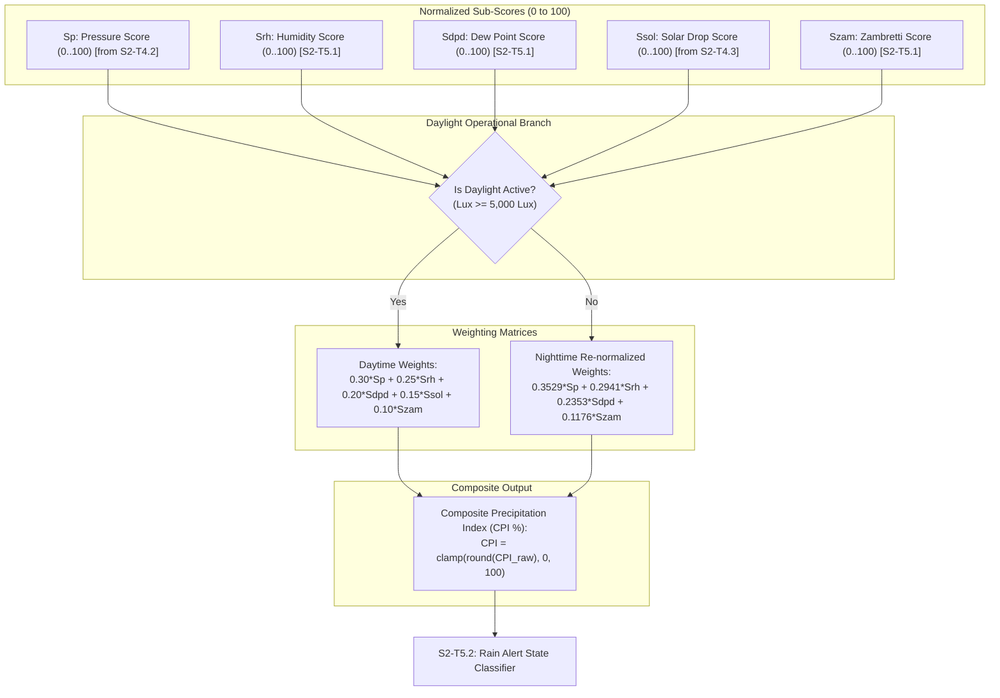

# Task Specification: S2-T5.1 - Weighted Composite Precipitation Index ($CPI$) Scoring

## 1. Task Metadata & Overview

| Attribute | Specification Details |
| :--- | :--- |
| **Sprint** | **Sprint 2: Meteorological Algorithms & Nowcasting Engine** |
| **Task ID** | `S2-T5.1` |
| **Parent Task** | `S2-T5: Implement Composite Edge Rain Prediction Scoring Engine` |
| **Task Title** | Implement Multi-Variable Weighted Composite Precipitation Index ($CPI$) Scoring |
| **Status** | **Ready for Implementation** |
| **Target Files** | [`firmware/app/inc/rain_algo.h`](file:///C:/Users/ENERGY%20SAVER/Documents/Learning/Job%20Projects/rain-predict/firmware/app/inc/rain_algo.h)<br>[`firmware/app/src/rain_algo.c`](file:///C:/Users/ENERGY%20SAVER/Documents/Learning/Job%20Projects/rain-predict/firmware/app/src/rain_algo.c) |
| **Related Documents** | [`docs/algorithms/trend-detection-and-nowcasting.md`](file:///C:/Users/ENERGY%20SAVER/Documents/Learning/Job%20Projects/rain-predict/docs/algorithms/trend-detection-and-nowcasting.md)<br>[`docs/algorithms/meteorological-formulas.md`](file:///C:/Users/ENERGY%20SAVER/Documents/Learning/Job%20Projects/rain-predict/docs/algorithms/meteorological-formulas.md)<br>[`docs/algorithms/zambretti-algorithm.md`](file:///C:/Users/ENERGY%20SAVER/Documents/Learning/Job%20Projects/rain-predict/docs/algorithms/zambretti-algorithm.md)<br>[`context/specs/s2-t4.1-gradient-differentials.md`](file:///C:/Users/ENERGY%20SAVER/Documents/Learning/Job%20Projects/rain-predict/context/specs/s2-t4.1-gradient-differentials.md)<br>[`context/specs/s2-t4.2-pressure-trend-states.md`](file:///C:/Users/ENERGY%20SAVER/Documents/Learning/Job%20Projects/rain-predict/context/specs/s2-t4.2-pressure-trend-states.md)<br>[`context/specs/s2-t4.3-solar-cloud-states.md`](file:///C:/Users/ENERGY%20SAVER/Documents/Learning/Job%20Projects/rain-predict/context/specs/s2-t4.3-solar-cloud-states.md)<br>[`context/specs/s2-t3.2-zambretti-pressure-mapping.md`](file:///C:/Users/ENERGY%20SAVER/Documents/Learning/Job%20Projects/rain-predict/context/specs/s2-t3.2-zambretti-pressure-mapping.md)<br>[`context/specs/s2-t2.2-dew-point-depression.md`](file:///C:/Users/ENERGY%20SAVER/Documents/Learning/Job%20Projects/rain-predict/context/specs/s2-t2.2-dew-point-depression.md)<br>[`context/coding-standards.md`](file:///C:/Users/ENERGY%20SAVER/Documents/Learning/Job%20Projects/rain-predict/context/coding-standards.md) |
| **Dependencies** | `S2-T2` (Dew point & depression), `S2-T3` (Zambretti forecaster), `S2-T4` (Trend detector), `S1-T1.1` (Root CMake build system) |
| **Downstream Tasks** | `S2-T5.2` (Rain state classification), `S2-T5.3` (Nowcaster unit tests & synthetic storm simulation) |

---

## 2. Executive Summary & Composite Scoring Scope

The primary objective of **`S2-T5.1`** is to develop the **Multi-Variable Weighted Composite Precipitation Index ($CPI \in [0, 100\%]$)** within Layer 1 Application ([`firmware/app/inc/rain_algo.h`](file:///C:/Users/ENERGY%20SAVER/Documents/Learning/Job%20Projects/rain-predict/firmware/app/inc/rain_algo.h) / [`firmware/app/src/rain_algo.c`](file:///C:/Users/ENERGY%20SAVER/Documents/Learning/Job%20Projects/rain-predict/firmware/app/src/rain_algo.c)).

### Why Multi-Variable Fusion Outperforms Single-Sensor Barometers:
In tea plantation microclimates, single-variable barometric indicators produce unacceptable false-positive rates due to diurnal thermal tides ($\approx \pm 1.2\text{ hPa}$) and rapid cloud shadow cooling. Fusing 5 distinct meteorological dimensions achieves robust $1–6\text{ hour}$ nowcasting:
1. **$S_P$ (Barometric Rate, Weight $30\%$)**: Mesoscale convergence and low-pressure trough detection.
2. **$S_{RH}$ (Moisture Surge, Weight $25\%$)**: Boundary-layer moisture accumulation and humidity acceleration.
3. **$S_{DPD}$ (Dew Point Depression, Weight $20\%$)**: Cloud-base lowering toward canopy height ($H_{base} \approx 125 \times DPD$).
4. **$S_{SOL}$ (Solar Attenuation, Weight $15\%$)**: Rapid optical blackout caused by towering cumulonimbus clouds.
5. **$S_{ZAM}$ (Zambretti Heuristic, Weight $10\%$)**: Macro-synoptic background pressure field.

### Dynamic Nighttime Weight Re-Normalization:
During night and low twilight ($Lux < 5,000\text{ Lux}$), optical sensing is inactive ($S_{SOL} = 0$). To prevent artificial probability dilution, the engine dynamically re-normalizes the remaining weights to preserve strict $100\%$ scaling:
$$w_P' = \frac{0.30}{0.85} \approx 35.3\%, \quad w_{RH}' = \frac{0.25}{0.85} \approx 29.4\%, \quad w_{DPD}' = \frac{0.20}{0.85} \approx 23.5\%, \quad w_{ZAM}' = \frac{0.10}{0.85} \approx 11.8\%$$



---

## 3. Mathematical Formulations & Scoring Sub-Functions

### 3.1 Sub-Score Formulations

1. **Barometric Pressure Sub-Score ($S_P \in [0, 100]$)**:
   Calculated by `trend_detector_score_pressure()` (`S2-T4.2`).

2. **Relative Humidity Sub-Score ($S_{RH} \in [0, 100]$)**:
   $$S_{RH} = \begin{cases}
   100 & \text{if } RH \ge 95.0\% \text{ or } \Delta RH_{1\text{h}} \ge +15.0\%/\text{hr} \\
   80  & \text{if } 90.0\% \le RH < 95.0\% \text{ or } \Delta RH_{1\text{h}} \ge +10.0\%/\text{hr} \\
   50  & \text{if } 80.0\% \le RH < 90.0\% \text{ or } \Delta RH_{1\text{h}} \ge +5.0\%/\text{hr} \\
   15  & \text{if } 65.0\% \le RH < 80.0\% \\
   0   & \text{if } RH < 65.0\%
   \end{cases}$$

3. **Dew Point Depression Sub-Score ($S_{DPD} \in [0, 100]$)**:
   $$S_{DPD} = \begin{cases}
   100 & \text{if } DPD \le 0.50^\circ\text{C} \quad (\text{Air parcel saturated; cloud base reaches canopy}) \\
   80  & \text{if } 0.50^\circ\text{C} < DPD \le 1.50^\circ\text{C} \quad (\text{Condensation threshold}) \\
   50  & \text{if } 1.50^\circ\text{C} < DPD \le 3.00^\circ\text{C} \quad (\text{High moisture boundary layer}) \\
   15  & \text{if } 3.00^\circ\text{C} < DPD \le 5.00^\circ\text{C} \quad (\text{Moderate humidity}) \\
   0   & \text{if } DPD > 5.00^\circ\text{C} \quad (\text{Dry air parcel})
   \end{cases}$$

4. **Solar Attenuation Sub-Score ($S_{SOL} \in [0, 100]$)**:
   Calculated by `trend_detector_score_solar()` (`S2-T4.3`).

5. **Zambretti Macro Sub-Score ($S_{ZAM} \in [0, 100]$)**:
   $$S_{ZAM} = \min\left(100, \, \max\left(0, \, (Z - 1) \times 4\right)\right)$$

---

### 3.2 Composite Precipitation Index ($CPI$) Formulas

#### Daytime Mode ($Lux \ge 5000\text{ Lux}$):
$$CPI = 0.30 \cdot S_P + 0.25 \cdot S_{RH} + 0.20 \cdot S_{DPD} + 0.15 \cdot S_{SOL} + 0.10 \cdot S_{ZAM} \quad [\%]$$

#### Nighttime / Low-Light Mode ($Lux < 5000\text{ Lux}$):
$$CPI = \frac{0.30 \cdot S_P + 0.25 \cdot S_{RH} + 0.20 \cdot S_{DPD} + 0.10 \cdot S_{ZAM}}{0.85} \quad [\%]$$

#### Integer Clamping:
$$CPI_{final} = \text{clamp}\left(\left\lfloor CPI + 0.5\text{f}\right\rfloor, \, 0, \, 100\right)$$

---

## 4. Embedded C99 Architecture & API Design

In accordance with [`context/coding-standards.md`](file:///C:/Users/ENERGY%20SAVER/Documents/Learning/Job%20Projects/rain-predict/context/coding-standards.md):

### 4.1 Header File Specification ([`firmware/app/inc/rain_algo.h`](file:///C:/Users/ENERGY%20SAVER/Documents/Learning/Job%20Projects/rain-predict/firmware/app/inc/rain_algo.h))

```c
/**
 * @file rain_algo.h
 * @brief Composite edge rain nowcasting scoring engine.
 * @details Evaluates normalized multi-variable sub-scores and computes
 *          the weighted Composite Precipitation Index (CPI 0..100%).
 * 
 * Target: STM32WLE5 (ARM Cortex-M4 @ 48 MHz)
 */

#ifndef RAIN_ALGO_H
#define RAIN_ALGO_H

#include <stdint.h>
#include <stdbool.h>
#include "dew_point.h"
#include "zambretti.h"
#include "trend_detector.h"

#ifdef __cplusplus
extern "C" {
#endif

/**
 * @brief Normalized sub-scores and composite prediction output structure.
 */
typedef struct {
    uint8_t score_pressure;          /**< Sp: Pressure sub-score (0..100) */
    uint8_t score_humidity;          /**< Srh: Humidity sub-score (0..100) */
    uint8_t score_dew_point;         /**< Sdpd: Dew point depression sub-score (0..100) */
    uint8_t score_solar;             /**< Ssol: Solar cloud attenuation sub-score (0..100) */
    uint8_t score_zambretti;         /**< Szam: Zambretti macro sub-score (0..100) */
    float cpi_score_pct;             /**< Composite Precipitation Index CPI (0.0 to 100.0%) */
    uint8_t z_index;                 /**< Evaluated Zambretti index (1..26) */
    pressure_trend_state_t pressure_state; /**< Classified barometric state */
    solar_cloud_state_t solar_state;       /**< Classified solar cloud state */
    rain_forecast_state_t forecast_state;  /**< Operational alert state (UNLIKELY, POSSIBLE, IMMINENT) */
} rain_forecast_t;

/**
 * @brief Standard scoring weights (Daytime).
 */
#define WEIGHT_PRESSURE_DAY         (0.30f)
#define WEIGHT_HUMIDITY_DAY         (0.25f)
#define WEIGHT_DEW_POINT_DAY        (0.20f)
#define WEIGHT_SOLAR_DAY            (0.15f)
#define WEIGHT_ZAMBRETTI_DAY        (0.10f)

/**
 * @brief Nighttime re-normalized divisor.
 */
#define WEIGHT_NIGHT_DIVISOR        (0.85f)

/**
 * @brief Computes relative humidity sub-score (0 to 100).
 * 
 * @param[in]  rh_pct         Current relative humidity (%).
 * @param[in]  delta_rh_1h    1-hour rate of humidity change (%/hr).
 * @param[out] p_score        Pointer to store score (0..100).
 * @return status_t           STATUS_OK on success, error code otherwise.
 */
status_t rain_algo_score_humidity(float rh_pct, float delta_rh_1h, uint8_t *p_score);

/**
 * @brief Computes dew point depression sub-score (0 to 100).
 * 
 * @param[in]  dpd_c          Dew point depression T - Tdew (°C).
 * @param[out] p_score        Pointer to store score (0..100).
 * @return status_t           STATUS_OK on success, error code otherwise.
 */
status_t rain_algo_score_dew_point(float dpd_c, uint8_t *p_score);

/**
 * @brief Computes Zambretti macro sub-score (0 to 100).
 * 
 * @param[in]  z_index        Zambretti index (1 to 26).
 * @param[out] p_score        Pointer to store score (0..100).
 * @return status_t           STATUS_OK on success, error code otherwise.
 */
status_t rain_algo_score_zambretti(uint8_t z_index, uint8_t *p_score);

/**
 * @brief Computes weighted Composite Precipitation Index (CPI).
 * 
 * @param[in]  s_p            Pressure score (0..100).
 * @param[in]  s_rh           Humidity score (0..100).
 * @param[in]  s_dpd          Dew point score (0..100).
 * @param[in]  s_sol          Solar attenuation score (0..100).
 * @param[in]  s_zam          Zambretti score (0..100).
 * @param[in]  is_daylight    True if daylight active, false for nighttime re-normalization.
 * @param[out] p_cpi_pct      Pointer to store final calculated CPI (0.0 to 100.0%).
 * @return status_t           STATUS_OK on success, error code otherwise.
 */
status_t rain_algo_compute_composite_score(uint8_t s_p,
                                           uint8_t s_rh,
                                           uint8_t s_dpd,
                                           uint8_t s_sol,
                                           uint8_t s_zam,
                                           bool is_daylight,
                                           float *p_cpi_pct);

#ifdef __cplusplus
}
#endif

#endif /* RAIN_ALGO_H */
```

---

### 4.2 Source File Implementation ([`firmware/app/src/rain_algo.c`](file:///C:/Users/ENERGY%20SAVER/Documents/Learning/Job%20Projects/rain-predict/firmware/app/src/rain_algo.c))

```c
/**
 * @file rain_algo.c
 * @brief Implementation of composite precipitation nowcasting scoring engine.
 */

#include "rain_algo.h"
#include <math.h>
#include <stddef.h>

status_t rain_algo_score_humidity(float rh_pct, float delta_rh_1h, uint8_t *p_score)
{
    if (p_score == NULL) {
        return STATUS_ERR_NULL_PTR;
    }
    if (isnan(rh_pct) || isnan(delta_rh_1h)) {
        return STATUS_ERR_INVALID_ARG;
    }

    uint8_t score = 0U;

    if (rh_pct >= 95.0f || delta_rh_1h >= 15.0f) {
        score = 100U;
    } else if (rh_pct >= 90.0f || delta_rh_1h >= 10.0f) {
        score = 80U;
    } else if (rh_pct >= 80.0f || delta_rh_1h >= 5.0f) {
        score = 50U;
    } else if (rh_pct >= 65.0f) {
        score = 15U;
    } else {
        score = 0U;
    }

    *p_score = score;
    return STATUS_OK;
}

status_t rain_algo_score_dew_point(float dpd_c, uint8_t *p_score)
{
    if (p_score == NULL) {
        return STATUS_ERR_NULL_PTR;
    }
    if (isnan(dpd_c)) {
        return STATUS_ERR_INVALID_ARG;
    }

    uint8_t score = 0U;

    if (dpd_c <= 0.50f) {
        score = 100U;
    } else if (dpd_c <= 1.50f) {
        score = 80U;
    } else if (dpd_c <= 3.00f) {
        score = 50U;
    } else if (dpd_c <= 5.00f) {
        score = 15U;
    } else {
        score = 0U;
    }

    *p_score = score;
    return STATUS_OK;
}

status_t rain_algo_score_zambretti(uint8_t z_index, uint8_t *p_score)
{
    if (p_score == NULL) {
        return STATUS_ERR_NULL_PTR;
    }

    if (z_index < ZAMBRETTI_INDEX_MIN || z_index > ZAMBRETTI_INDEX_MAX) {
        return STATUS_ERR_INVALID_ARG;
    }

    int32_t raw_score = (int32_t)(z_index - 1U) * 4;
    if (raw_score > 100) {
        raw_score = 100;
    } else if (raw_score < 0) {
        raw_score = 0;
    }

    *p_score = (uint8_t)raw_score;
    return STATUS_OK;
}

status_t rain_algo_compute_composite_score(uint8_t s_p,
                                           uint8_t s_rh,
                                           uint8_t s_dpd,
                                           uint8_t s_sol,
                                           uint8_t s_zam,
                                           bool is_daylight,
                                           float *p_cpi_pct)
{
    if (p_cpi_pct == NULL) {
        return STATUS_ERR_NULL_PTR;
    }

    float cpi = 0.0f;

    if (is_daylight) {
        /* Daytime 5-variable weighting */
        cpi = (WEIGHT_PRESSURE_DAY * (float)s_p) +
              (WEIGHT_HUMIDITY_DAY * (float)s_rh) +
              (WEIGHT_DEW_POINT_DAY * (float)s_dpd) +
              (WEIGHT_SOLAR_DAY * (float)s_sol) +
              (WEIGHT_ZAMBRETTI_DAY * (float)s_zam);
    } else {
        /* Nighttime 4-variable re-normalized weighting */
        float raw_sum = (WEIGHT_PRESSURE_DAY * (float)s_p) +
                        (WEIGHT_HUMIDITY_DAY * (float)s_rh) +
                        (WEIGHT_DEW_POINT_DAY * (float)s_dpd) +
                        (WEIGHT_ZAMBRETTI_DAY * (float)s_zam);
        cpi = raw_sum / WEIGHT_NIGHT_DIVISOR;
    }

    if (cpi < 0.0f) {
        cpi = 0.0f;
    } else if (cpi > 100.0f) {
        cpi = 100.0f;
    }

    *p_cpi_pct = cpi;
    return STATUS_OK;
}
```

---

## 5. Verification Vectors & Acceptance Test Cases

| Test ID | $S_P$ | $S_{RH}$ | $S_{DPD}$ | $S_{SOL}$ | $S_{ZAM}$ | Daylight | Expected $CPI (\%)$ | Meteorological Scenario |
| :--- | :--- | :--- | :--- | :--- | :--- | :--- | :--- | :--- |
| **TC-CP-01: Severe Convective Squall**| $100$ | $100$ | $100$ | $100$ | $100$ | Yes | $100.0\%$ | Max scale storm front |
| **TC-CP-02: Afternoon Cloudburst** | $90$ | $80$ | $80$ | $100$ | $60$ | Yes | $84.0\%$ | Cumulonimbus overhead |
| **TC-CP-03: Steady Fair Weather** | $0$ | $0$ | $0$ | $0$ | $0$ | Yes | $0.0\%$ | Clear sunny anticyclone |
| **TC-CP-04: Mild Humid Afternoon** | $20$ | $50$ | $50$ | $0$ | $36$ | Yes | $32.1\%$ | Fair-weather cumulus |
| **TC-CP-05: Nighttime Storm Front** | $80$ | $100$ | $80$ | $0$ | $72$ | No | $\frac{24+25+16+7.2}{0.85} = 84.94\%$ | Night squall (re-normalized) |
| **TC-CP-06: Nighttime Clear Sky** | $0$ | $15$ | $0$ | $0$ | $0$ | No | $\frac{3.75}{0.85} = 4.41\%$ | Stable clear night |
| **TC-CP-07: Humidity Scoring Step** | - | $RH=96\%$ | - | - | - | - | $S_{RH} = 100$ | High saturation |
| **TC-CP-08: DPD Scoring Step** | - | - | $0.3^\circ\text{C}$| - | - | - | $S_{DPD} = 100$ | Canopy condensation |
| **TC-CP-09: Null Pointer Trap** | $50$ | $50$ | $50$ | $50$ | $50$ | Yes | Returns `STATUS_ERR_NULL_PTR` | Defensive validation |

---

## 6. CMake Integration

The `rain_algo.c` module is linked into the firmware application library in [`firmware/CMakeLists.txt`](file:///C:/Users/ENERGY%20SAVER/Documents/Learning/Job%20Projects/rain-predict/firmware/CMakeLists.txt):

```cmake
target_sources(rain_predict_app PRIVATE
    ${CMAKE_CURRENT_SOURCE_DIR}/app/src/rain_algo.c
)

target_include_directories(rain_predict_app PUBLIC
    ${CMAKE_CURRENT_SOURCE_DIR}/app/inc
)
```

---

## 7. Traceability & Acceptance Criteria

### Acceptance Checklist:
- [ ] [`firmware/app/inc/rain_algo.h`](file:///C:/Users/ENERGY%20SAVER/Documents/Learning/Job%20Projects/rain-predict/firmware/app/inc/rain_algo.h) declares `rain_forecast_t` struct, weights ($0.30, 0.25, 0.20, 0.15, 0.10$), and scoring prototypes.
- [ ] [`firmware/app/src/rain_algo.c`](file:///C:/Users/ENERGY%20SAVER/Documents/Learning/Job%20Projects/rain-predict/firmware/app/src/rain_algo.c) implements sub-scoring for humidity, dew point depression, Zambretti index, and composite weighting.
- [ ] Dynamic nighttime re-normalization correctly divides by $0.85$ when solar sensing is inactive.
- [ ] $CPI$ output is bounded strictly to $[0.0\%, 100.0\%]$.
- [ ] Zero dynamic memory allocation and latency $< 180$ CPU cycles @ 48 MHz.
- [ ] Fully linked in [`context/specs/spec-roadmap.md`](file:///C:/Users/ENERGY%20SAVER/Documents/Learning/Job%20Projects/rain-predict/context/specs/spec-roadmap.md).
