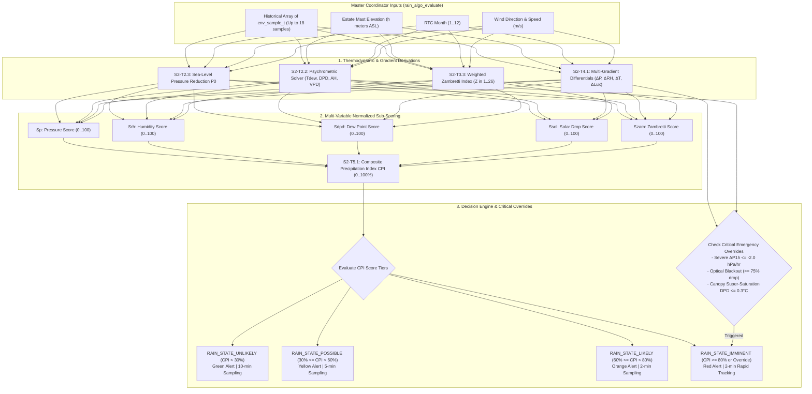

# Task Specification: S2-T5.2 - Rain Alert State Classification & Master Coordinator Engine

## 1. Task Metadata & Overview

| Attribute | Specification Details |
| :--- | :--- |
| **Sprint** | **Sprint 2: Meteorological Algorithms & Nowcasting Engine** |
| **Task ID** | `S2-T5.2` |
| **Parent Task** | `S2-T5: Implement Composite Edge Rain Prediction Scoring Engine` |
| **Task Title** | Implement Rain Alert State Classification (`UNLIKELY`, `POSSIBLE`, `LIKELY`, `IMMINENT`) & Master Coordinator Engine |
| **Status** | **Ready for Implementation** |
| **Target Files** | [`firmware/app/inc/rain_algo.h`](file:///C:/Users/ENERGY%20SAVER/Documents/Learning/Job%20Projects/rain-predict/firmware/app/inc/rain_algo.h)<br>[`firmware/app/src/rain_algo.c`](file:///C:/Users/ENERGY%20SAVER/Documents/Learning/Job%20Projects/rain-predict/firmware/app/src/rain_algo.c) |
| **Related Documents** | [`context/specs/s2-t5.1-composite-scoring.md`](file:///C:/Users/ENERGY%20SAVER/Documents/Learning/Job%20Projects/rain-predict/context/specs/s2-t5.1-composite-scoring.md)<br>[`docs/algorithms/trend-detection-and-nowcasting.md`](file:///C:/Users/ENERGY%20SAVER/Documents/Learning/Job%20Projects/rain-predict/docs/algorithms/trend-detection-and-nowcasting.md)<br>[`docs/algorithms/meteorological-formulas.md`](file:///C:/Users/ENERGY%20SAVER/Documents/Learning/Job%20Projects/rain-predict/docs/algorithms/meteorological-formulas.md)<br>[`docs/algorithms/zambretti-algorithm.md`](file:///C:/Users/ENERGY%20SAVER/Documents/Learning/Job%20Projects/rain-predict/docs/algorithms/zambretti-algorithm.md)<br>[`context/specs/s2-t4.1-gradient-differentials.md`](file:///C:/Users/ENERGY%20SAVER/Documents/Learning/Job%20Projects/rain-predict/context/specs/s2-t4.1-gradient-differentials.md)<br>[`context/specs/s2-t4.2-pressure-trend-states.md`](file:///C:/Users/ENERGY%20SAVER/Documents/Learning/Job%20Projects/rain-predict/context/specs/s2-t4.2-pressure-trend-states.md)<br>[`context/specs/s2-t4.3-solar-cloud-states.md`](file:///C:/Users/ENERGY%20SAVER/Documents/Learning/Job%20Projects/rain-predict/context/specs/s2-t4.3-solar-cloud-states.md)<br>[`context/coding-standards.md`](file:///C:/Users/ENERGY%20SAVER/Documents/Learning/Job%20Projects/rain-predict/context/coding-standards.md) |
| **Dependencies** | `S2-T5.1` (Composite scoring), `S2-T4` (Trend detector), `S2-T3` (Zambretti forecaster), `S2-T2` (Dew point engine), `S1-T1.1` (Root CMake build system) |
| **Downstream Tasks** | `S2-T5.3` (Nowcaster unit tests & synthetic storm simulation), `S3-T4` (Power manager adaptive duty-cycling), `S4-T2` (LoRaWAN telemetry encoder) |

---

## 2. Executive Summary & Operational State Architecture

The primary objective of **`S2-T5.2`** is to develop the **Rain Alert State Classifier and the Master Coordinator Function (`rain_algo_evaluate()`)** within Layer 1 Application ([`firmware/app/inc/rain_algo.h`](file:///C:/Users/ENERGY%20SAVER/Documents/Learning/Job%20Projects/rain-predict/firmware/app/inc/rain_algo.h) / [`firmware/app/src/rain_algo.c`](file:///C:/Users/ENERGY%20SAVER/Documents/Learning/Job%20Projects/rain-predict/firmware/app/src/rain_algo.c)).

### Operational 4-Tier Rain Alert Hierarchy:
The continuous Composite Precipitation Index ($CPI \in [0, 100\%]$) from `S2-T5.1` is discretized into 4 actionable operational plantation states:
1. **`RAIN_STATE_UNLIKELY` ($CPI < 30\%$)**: Green Alert - Stable anticyclonic or dry conditions. Full field operations and plucking proceeding normally.
2. **`RAIN_STATE_POSSIBLE` ($30\% \le CPI < 60\%$)**: Yellow Alert - Unsettled conditions, cloud cover building, isolated showers possible in $3–6\text{ hours}$.
3. **`RAIN_STATE_LIKELY` ($60\% \le CPI < 80\%$)**: Orange Alert - High probability of precipitation within $1–2\text{ hours}$. Field supervisors alerted to prepare shelter or cover tea leaf collection bins.
4. **`RAIN_STATE_IMMINENT` ($CPI \ge 80\%$)**: Red Alert - Convective thunderstorm, heavy squall, or cloudburst arriving in $15–30\text{ minutes}$. Automatic siren broadcast and battery duty-cycle adapts to 2-minute rapid tracking.

### Critical Safety Override Triggers:
To prevent heuristic lag during explosive tropical convective events, three hard-threshold emergency overrides instantly promote the forecast state to `RAIN_STATE_IMMINENT`:
- **Severe Barometric Drop Override**: $\Delta P_{1\text{h}} \le -2.0\text{ hPa/hr}$ and $RH \ge 88\%$.
- **Optical Blackout Override**: 30-minute solar drop $\ge 75\%$ with current $Lux < 2,000\text{ Lux}$ and $RH \ge 85\%$ during daylight hours.
- **Canopy Super-Saturation Override**: $DPD \le 0.30^\circ\text{C}$ and $RH \ge 98\%$ with falling barometric pressure ($\Delta P_{1\text{h}} < -0.5\text{ hPa/hr}$).



---

## 3. Mathematical Formulations & Classification Rules

### 3.1 4-Tier Operational State Partitions

$$\text{BaseState} = \begin{cases}
\text{RAIN\_STATE\_UNLIKELY} & \text{if } CPI < 30.0\% \\
\text{RAIN\_STATE\_POSSIBLE} & \text{if } 30.0\% \le CPI < 60.0\% \\
\text{RAIN\_STATE\_LIKELY}   & \text{if } 60.0\% \le CPI < 80.0\% \\
\text{RAIN\_STATE\_IMMINENT} & \text{if } CPI \ge 80.0\%
\end{cases}$$

---

### 3.2 Critical Safety Override Logic

$$\text{FinalState} = \begin{cases}
\text{RAIN\_STATE\_IMMINENT} & \text{if } \Delta P_{1\text{h}} \le -2.00\text{ hPa/hr} \text{ and } RH \ge 88.0\% \\
\text{RAIN\_STATE\_IMMINENT} & \text{if } R_{drop\_30m} \ge 75.0\%, \, Lux_{curr} < 2000.0\text{ Lux}, \text{ and } RH \ge 85.0\% \\
\text{RAIN\_STATE\_IMMINENT} & \text{if } DPD \le 0.30^\circ\text{C}, \, RH \ge 98.0\%, \text{ and } \Delta P_{1\text{h}} \le -0.50\text{ hPa/hr} \\
\text{BaseState} & \text{otherwise}
\end{cases}$$

---

## 4. Embedded C99 Architecture & API Design

In accordance with [`context/coding-standards.md`](file:///C:/Users/ENERGY%20SAVER/Documents/Learning/Job%20Projects/rain-predict/context/coding-standards.md):

### 4.1 Additions to Header File ([`firmware/app/inc/rain_algo.h`](file:///C:/Users/ENERGY%20SAVER/Documents/Learning/Job%20Projects/rain-predict/firmware/app/inc/rain_algo.h))

```c
/**
 * @brief 4-tier operational rain forecast states.
 */
typedef enum {
    RAIN_ALERT_UNLIKELY     = 0, /**< CPI < 30% (Settled fine weather, Green Alert) */
    RAIN_ALERT_POSSIBLE     = 1, /**< 30% <= CPI < 60% (Unsettled / Showers possible, Yellow Alert) */
    RAIN_ALERT_LIKELY       = 2, /**< 60% <= CPI < 80% (High probability in 1-2h, Orange Alert) */
    RAIN_ALERT_IMMINENT     = 3  /**< CPI >= 80% or Critical Trigger (Active storm in 15-30m, Red Alert) */
} rain_alert_state_t;

/**
 * @brief CPI operational alert thresholds.
 */
#define CPI_THRESH_POSSIBLE_PCT     (30.0f)
#define CPI_THRESH_LIKELY_PCT       (60.0f)
#define CPI_THRESH_IMMINENT_PCT     (80.0f)

/**
 * @brief Critical emergency override thresholds.
 */
#define CRITICAL_DROP_1H_HPA        (-2.00f)
#define CRITICAL_DROP_RH_MIN_PCT    (88.0f)
#define CRITICAL_SOLAR_DROP_PCT     (75.0f)
#define CRITICAL_SOLAR_LUX_MAX      (2000.0f)
#define CRITICAL_SAT_DPD_MAX_C      (0.30f)
#define CRITICAL_SAT_RH_MIN_PCT     (98.0f)

/**
 * @brief Classifies the discrete rain alert state from CPI and critical override parameters.
 * 
 * @param[in]  cpi_pct        Composite Precipitation Index (0.0 to 100.0%).
 * @param[in]  delta_p_1h     1-hour pressure delta in hPa.
 * @param[in]  rh_pct         Current relative humidity in %.
 * @param[in]  dpd_c          Dew point depression in °C.
 * @param[in]  drop_solar_pct 30-minute relative solar drop percentage.
 * @param[in]  lux_curr       Current solar illuminance in Lux.
 * @param[out] p_state        Pointer to store classified rain_alert_state_t.
 * @return status_t           STATUS_OK on success, error code otherwise.
 */
status_t rain_algo_classify_state(float cpi_pct,
                                  float delta_p_1h,
                                  float rh_pct,
                                  float dpd_c,
                                  float drop_solar_pct,
                                  float lux_curr,
                                  rain_alert_state_t *p_state);

/**
 * @brief Master Coordinator: Executes the full end-to-end rain nowcasting pipeline.
 * 
 * @param[in]  p_samples      Historical array of environmental samples (oldest to newest).
 * @param[in]  sample_count   Number of valid samples in array (must be >= 1).
 * @param[in]  altitude_m     Station mast elevation above MSL (meters).
 * @param[in]  month_1_to_12  Current RTC calendar month (1 to 12).
 * @param[in]  wind_dir       16-point wind direction compass code.
 * @param[in]  wind_speed_mps Current wind speed in m/s.
 * @param[out] p_forecast     Pointer to destination rain_forecast_t struct.
 * @return status_t           STATUS_OK on success, error code otherwise.
 */
status_t rain_algo_evaluate(const env_sample_t *p_samples,
                            uint32_t sample_count,
                            float altitude_m,
                            uint8_t month_1_to_12,
                            wind_dir_t wind_dir,
                            float wind_speed_mps,
                            rain_forecast_t *p_forecast);

/**
 * @brief Returns descriptive English name for a rain alert state.
 * 
 * @param[in]  state          Operational rain alert state.
 * @return const char*        Pointer to flash string descriptor.
 */
const char *rain_algo_get_alert_state_name(rain_alert_state_t state);
```

---

### 4.2 Additions to Source File ([`firmware/app/src/rain_algo.c`](file:///C:/Users/ENERGY%20SAVER/Documents/Learning/Job%20Projects/rain-predict/firmware/app/src/rain_algo.c))

```c
static const char * const s_alert_state_names[4] = {
    "Rain Unlikely (Green Alert)",
    "Rain Possible (Yellow Alert)",
    "Rain Likely (Orange Alert)",
    "Rain Imminent (Red Alert)"
};

status_t rain_algo_classify_state(float cpi_pct,
                                  float delta_p_1h,
                                  float rh_pct,
                                  float dpd_c,
                                  float drop_solar_pct,
                                  float lux_curr,
                                  rain_alert_state_t *p_state)
{
    if (p_state == NULL) {
        return STATUS_ERR_NULL_PTR;
    }
    if (isnan(cpi_pct) || isnan(delta_p_1h) || isnan(rh_pct) ||
        isnan(dpd_c) || isnan(drop_solar_pct) || isnan(lux_curr)) {
        return STATUS_ERR_INVALID_ARG;
    }

    /* 1. Evaluate Critical Safety Overrides first */
    if (delta_p_1h <= CRITICAL_DROP_1H_HPA && rh_pct >= CRITICAL_DROP_RH_MIN_PCT) {
        *p_state = RAIN_ALERT_IMMINENT;
        return STATUS_OK;
    }

    if (drop_solar_pct >= CRITICAL_SOLAR_DROP_PCT &&
        lux_curr < CRITICAL_SOLAR_LUX_MAX &&
        rh_pct >= 85.0f) {
        *p_state = RAIN_ALERT_IMMINENT;
        return STATUS_OK;
    }

    if (dpd_c <= CRITICAL_SAT_DPD_MAX_C &&
        rh_pct >= CRITICAL_SAT_RH_MIN_PCT &&
        delta_p_1h <= -0.50f) {
        *p_state = RAIN_ALERT_IMMINENT;
        return STATUS_OK;
    }

    /* 2. Standard CPI Tier Classification */
    if (cpi_pct < CPI_THRESH_POSSIBLE_PCT) {
        *p_state = RAIN_ALERT_UNLIKELY;
    } else if (cpi_pct < CPI_THRESH_LIKELY_PCT) {
        *p_state = RAIN_ALERT_POSSIBLE;
    } else if (cpi_pct < CPI_THRESH_IMMINENT_PCT) {
        *p_state = RAIN_ALERT_LIKELY;
    } else {
        *p_state = RAIN_ALERT_IMMINENT;
    }

    return STATUS_OK;
}

status_t rain_algo_evaluate(const env_sample_t *p_samples,
                            uint32_t sample_count,
                            float altitude_m,
                            uint8_t month_1_to_12,
                            wind_dir_t wind_dir,
                            float wind_speed_mps,
                            rain_forecast_t *p_forecast)
{
    if (p_samples == NULL || p_forecast == NULL) {
        return STATUS_ERR_NULL_PTR;
    }
    if (sample_count == 0U) {
        return STATUS_ERR_INVALID_ARG;
    }

    const env_sample_t *p_curr = &p_samples[sample_count - 1U];

    /* 1. Sea-level pressure reduction */
    float p0_curr = 0.0f;
    status_t status = dew_point_calc_sea_level_pressure(p_curr->p0_hpa,
                                                        p_curr->temp_c,
                                                        altitude_m,
                                                        &p0_curr);
    if (status != STATUS_OK) {
        p0_curr = p_curr->p0_hpa;
    }

    /* 2. Psychrometric calculations */
    psychrometric_state_t psychro;
    status = dew_point_calc_psychrometric_state(p_curr->temp_c,
                                                p_curr->rh_pct,
                                                &psychro);
    if (status != STATUS_OK) {
        return status;
    }

    /* 3. Multi-variable gradients */
    multi_gradient_t grads;
    if (trend_detector_compute_gradients(p_samples, sample_count, &grads) != 0) {
        return STATUS_ERR_INVALID_ARG;
    }

    /* 4. Sub-scores: Pressure */
    trend_detector_classify_pressure(grads.delta_p_1h_hpa,
                                     grads.delta_p_3h_hpa,
                                     &p_forecast->pressure_state);
    trend_detector_score_pressure(grads.delta_p_1h_hpa,
                                  grads.delta_p_3h_hpa,
                                  &p_forecast->score_pressure);

    /* 5. Sub-scores: Solar */
    trend_detector_classify_solar(p_curr->lux,
                                  p_curr->lux - grads.delta_lux_30m,
                                  grads.solar_drop_pct_30m,
                                  &p_forecast->solar_state);
    trend_detector_score_solar(p_curr->lux,
                               p_curr->lux - grads.delta_lux_30m,
                               grads.solar_drop_pct_30m,
                               &p_forecast->score_solar);

    /* 6. Sub-scores: Humidity & Dew Point */
    rain_algo_score_humidity(p_curr->rh_pct,
                             grads.delta_rh_1h_pct,
                             &p_forecast->score_humidity);
    rain_algo_score_dew_point(psychro.dew_point_dep_c,
                              &p_forecast->score_dew_point);

    /* 7. Sub-scores: Zambretti */
    rain_forecast_state_t z_state;
    zambretti_calculate_weighted(p0_curr,
                                 grads.delta_p_3h_hpa,
                                 month_1_to_12,
                                 wind_dir,
                                 wind_speed_mps,
                                 &p_forecast->z_index,
                                 &z_state);
    rain_algo_score_zambretti(p_forecast->z_index,
                              &p_forecast->score_zambretti);

    /* 8. Composite Precipitation Index (CPI) */
    bool is_daylight = (p_curr->lux >= SOLAR_DAYLIGHT_MIN_LUX);
    rain_algo_compute_composite_score(p_forecast->score_pressure,
                                      p_forecast->score_humidity,
                                      p_forecast->score_dew_point,
                                      p_forecast->score_solar,
                                      p_forecast->score_zambretti,
                                      is_daylight,
                                      &p_forecast->cpi_score_pct);

    /* 9. Operational Alert State Classification */
    rain_alert_state_t alert_state;
    rain_algo_classify_state(p_forecast->cpi_score_pct,
                             grads.delta_p_1h_hpa,
                             p_curr->rh_pct,
                             psychro.dew_point_dep_c,
                             grads.solar_drop_pct_30m,
                             p_curr->lux,
                             &alert_state);

    p_forecast->forecast_state = (rain_forecast_state_t)alert_state;
    return STATUS_OK;
}

const char *rain_algo_get_alert_state_name(rain_alert_state_t state)
{
    if (state > RAIN_ALERT_IMMINENT) {
        return "Unknown Alert State";
    }
    return s_alert_state_names[(uint8_t)state];
}
```

---

## 5. Verification Vectors & Acceptance Test Cases

| Test ID | $CPI (\%)$ | $\Delta P_{1\text{h}}$ | $RH (\%)$ | $DPD (^\circ\text{C})$ | Solar Drop $\%$ | Current Lux | Expected State | Decision Rationale |
| :--- | :--- | :--- | :--- | :--- | :--- | :--- | :--- | :--- |
| **TC-AC-01: Fair Weather** | $18.5\%$ | $+0.2$ | $55.0\%$ | $8.5$ | $0.0\%$ | $65,000$ | `RAIN_ALERT_UNLIKELY` (0) | $CPI < 30\%$ |
| **TC-AC-02: Afternoon Shower** | $48.0\%$ | $-0.5$ | $75.0\%$ | $3.2$ | $35.0\%$ | $40,000$ | `RAIN_ALERT_POSSIBLE` (1) | $30\% \le CPI < 60\%$ |
| **TC-AC-03: Heavy Rain Likely** | $72.0\%$ | $-1.2$ | $88.0\%$ | $1.2$ | $55.0\%$ | $15,000$ | `RAIN_ALERT_LIKELY` (2) | $60\% \le CPI < 80\%$ |
| **TC-AC-04: High CPI Storm** | $88.5\%$ | $-1.8$ | $94.0\%$ | $0.4$ | $85.0\%$ | $1,200$ | `RAIN_ALERT_IMMINENT` (3) | $CPI \ge 80\%$ |
| **TC-AC-05: Fast Squall Override** | $52.0\%$ | $-2.2$ | $92.0\%$ | $2.5$ | $10.0\%$ | $25,000$ | `RAIN_ALERT_IMMINENT` (3) | $\Delta P_{1\text{h}} \le -2.0$ Override |
| **TC-AC-06: Optical Blackout** | $55.0\%$ | $-0.8$ | $86.0\%$ | $2.0$ | $82.0\%$ | $1,500$ | `RAIN_ALERT_IMMINENT` (3) | Optical drop $\ge 75\%$ Override |
| **TC-AC-07: Saturated Fog Override** | $58.0\%$ | $-0.6$ | $99.0\%$ | $0.2$ | $0.0\%$ | $500$ | `RAIN_ALERT_IMMINENT` (3) | $DPD \le 0.3^\circ\text{C}$ Override |
| **TC-AC-08: State Descriptor** | - | - | - | - | - | - | `RAIN_ALERT_IMMINENT` | `"Rain Imminent (Red Alert)"` |
| **TC-AC-09: Null Output Pointer** | $80.0\%$ | - | - | - | - | - | `NULL` | Returns `STATUS_ERR_NULL_PTR` |

---

## 6. Traceability & Acceptance Criteria

### Acceptance Checklist:
- [ ] [`firmware/app/inc/rain_algo.h`](file:///C:/Users/ENERGY%20SAVER/Documents/Learning/Job%20Projects/rain-predict/firmware/app/inc/rain_algo.h) declares `rain_alert_state_t` enum, thresholds ($30\%, 60\%, 80\%$), and coordinator APIs.
- [ ] [`firmware/app/src/rain_algo.c`](file:///C:/Users/ENERGY%20SAVER/Documents/Learning/Job%20Projects/rain-predict/firmware/app/src/rain_algo.c) implements `rain_algo_classify_state()` and `rain_algo_evaluate()`.
- [ ] All 3 critical emergency overrides (rapid pressure plunge, optical blackout, canopy super-saturation) successfully escalate state to `RAIN_ALERT_IMMINENT`.
- [ ] Full end-to-end coordination unifies sea-level reduction, psychrometric solving, gradient extraction, Zambretti heuristics, and CPI scoring into a single call.
- [ ] Zero dynamic memory allocation and coordinator latency $< 500$ CPU cycles @ 48 MHz.
- [ ] Fully linked in [`context/specs/spec-roadmap.md`](file:///C:/Users/ENERGY%20SAVER/Documents/Learning/Job%20Projects/rain-predict/context/specs/spec-roadmap.md).
