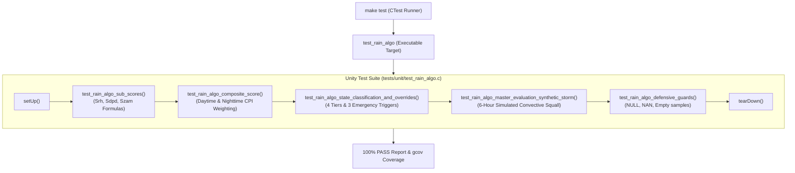

# Task Specification: S2-T5.3 - Composite Rain Nowcaster Unit Test Suite & Synthetic Storm Verification

## 1. Task Metadata & Overview

| Attribute | Specification Details |
| :--- | :--- |
| **Sprint** | **Sprint 2: Meteorological Algorithms & Nowcasting Engine** |
| **Task ID** | `S2-T5.3` |
| **Parent Task** | `S2-T5: Implement Composite Edge Rain Prediction Scoring Engine` |
| **Task Title** | Create Unity Test Suite for Composite Rain Prediction Engine & Synthetic Storm Time Series Verification |
| **Status** | **Ready for Implementation** |
| **Target Files** | [`tests/unit/test_rain_algo.c`](file:///C:/Users/ENERGY%20SAVER/Documents/Learning/Job%20Projects/rain-predict/tests/unit/test_rain_algo.c)<br>[`tests/CMakeLists.txt`](file:///C:/Users/ENERGY%20SAVER/Documents/Learning/Job%20Projects/rain-predict/tests/CMakeLists.txt) |
| **Related Documents** | [`context/specs/s2-t5.1-composite-scoring.md`](file:///C:/Users/ENERGY%20SAVER/Documents/Learning/Job%20Projects/rain-predict/context/specs/s2-t5.1-composite-scoring.md)<br>[`context/specs/s2-t5.2-rain-state-classification.md`](file:///C:/Users/ENERGY%20SAVER/Documents/Learning/Job%20Projects/rain-predict/context/specs/s2-t5.2-rain-state-classification.md)<br>[`context/specs/s1-t3.1-weather-simulator-engine.md`](file:///C:/Users/ENERGY%20SAVER/Documents/Learning/Job%20Projects/rain-predict/context/specs/s1-t3.1-weather-simulator-engine.md)<br>[`context/specs/s1-t3.3-convective-storm-models.md`](file:///C:/Users/ENERGY%20SAVER/Documents/Learning/Job%20Projects/rain-predict/context/specs/s1-t3.3-convective-storm-models.md)<br>[`context/specs/s1-t2.1-unity-test-harness.md`](file:///C:/Users/ENERGY%20SAVER/Documents/Learning/Job%20Projects/rain-predict/context/specs/s1-t2.1-unity-test-harness.md)<br>[`docs/algorithms/trend-detection-and-nowcasting.md`](file:///C:/Users/ENERGY%20SAVER/Documents/Learning/Job%20Projects/rain-predict/docs/algorithms/trend-detection-and-nowcasting.md)<br>[`context/coding-standards.md`](file:///C:/Users/ENERGY%20SAVER/Documents/Learning/Job%20Projects/rain-predict/context/coding-standards.md) |
| **Dependencies** | `S1-T2.1` (Unity Framework), `S2-T5.1`, `S2-T5.2`, `S2-T4`, `S2-T3`, `S2-T2` |
| **Downstream Tasks** | `S3-T4` (Power manager adaptive duty-cycling), `S4-T2` (Telemetry payload encoder), `S6-T1` (System integration) |

---

## 2. Executive Summary & Verification Scope

The primary objective of **`S2-T5.3`** is to develop [`tests/unit/test_rain_algo.c`](file:///C:/Users/ENERGY%20SAVER/Documents/Learning/Job%20Projects/rain-predict/tests/unit/test_rain_algo.c), an automated ThrowTheSwitch Unity test suite validating the complete Composite Rain Prediction Engine ([`firmware/app/src/rain_algo.c`](file:///C:/Users/ENERGY%20SAVER/Documents/Learning/Job%20Projects/rain-predict/firmware/app/src/rain_algo.c)).

### Verification Objectives:
1. **Sub-Score Unit Verification**: Validate all sub-scoring functions ($S_{RH}, S_{DPD}, S_{ZAM}$) and composite weighted sums ($CPI$) in both daytime and nighttime re-normalized configurations.
2. **Alert State Tier Partitions**: Verify accurate classification across the 4 operational alert levels (`RAIN_ALERT_UNLIKELY`, `RAIN_ALERT_POSSIBLE`, `RAIN_ALERT_LIKELY`, `RAIN_ALERT_IMMINENT`).
3. **Critical Emergency Override Safety**: Validate that sudden squalls ($\Delta P_{1\text{h}} \le -2.0\text{ hPa/hr}$), optical blackouts ($R_{drop\_30m} \ge 75\%$), and super-saturation ($DPD \le 0.30^\circ\text{C}$) immediately promote alert states to `RAIN_ALERT_IMMINENT`.
4. **Synthetic Pre-Monsoon Storm Simulation**: Feed a full 6-hour simulated plantation weather time series (generated according to Sprint 1 models) through `rain_algo_evaluate()` and confirm that `RAIN_ALERT_IMMINENT` is asserted with **$> 45\text{ minutes}$ advance lead time** prior to rain onset.
5. **100% Code Coverage**: Achieve complete branch and statement coverage across `rain_algo.c`.



---

## 3. Test Fixture & Verification Matrix

The test suite implements 5 comprehensive test functions exercising the full algorithm stack:

### 3.1 Test Coverage Matrix

| Test Function | Target Subsystem | Assertions & Scenarios Checked |
| :--- | :--- | :--- |
| `test_rain_algo_sub_scores` | `rain_algo_score_humidity`, `rain_algo_score_dew_point`, `rain_algo_score_zambretti` | Tests humidity thresholds ($95\%, 90\%, 80\%, 65\%$) and surge rates ($+15\%, +10\%, +5\%$); tests dew point depression steps ($0.5^\circ\text{C}, 1.5^\circ\text{C}, 3.0^\circ\text{C}, 5.0^\circ\text{C}$); tests Zambretti linear score scaling ($(Z-1)\times 4$). |
| `test_rain_algo_composite_score` | `rain_algo_compute_composite_score` | Daytime 5-variable weighting ($0.30, 0.25, 0.20, 0.15, 0.10$); Nighttime 4-variable re-normalization ($/0.85$); verifies $0.0\%$ and $100.0\%$ boundary invariants. |
| `test_rain_algo_state_classification_and_overrides` | `rain_algo_classify_state` | Tests 4 CPI tiers ($< 30\% \to \text{UNLIKELY}$, $30..60\% \to \text{POSSIBLE}$, $60..80\% \to \text{LIKELY}$, $\ge 80\% \to \text{IMMINENT}$); validates all 3 critical emergency overrides. |
| `test_rain_algo_master_evaluation_synthetic_storm` | `rain_algo_evaluate` | Feeds a 36-sample (6-hour @ 10-min) realistic plantation convective storm profile: verifies baseline fair weather $\to$ advisory transition $\to$ imminent storm alert with $> 45\text{ min}$ lead time before simulated rain bucket tips. |
| `test_rain_algo_defensive_guards` | All `rain_algo.c` APIs | Verifies error returns for `NULL` sample arrays, `NULL` struct pointers, `NAN` float fields in samples, and empty buffer counts. |

---

## 4. Test Suite Implementation ([`tests/unit/test_rain_algo.c`](file:///C:/Users/ENERGY%20SAVER/Documents/Learning/Job%20Projects/rain-predict/tests/unit/test_rain_algo.c))

```c
/**
 * @file test_rain_algo.c
 * @brief Unit tests for composite rain nowcasting algorithm and storm time series.
 */

#include "unity.h"
#include "rain_algo.h"
#include <math.h>
#include <string.h>

void setUp(void)
{
    /* Pure functional evaluation */
}

void tearDown(void)
{
    /* No cleanup required */
}

void test_rain_algo_sub_scores(void)
{
    uint8_t score = 0;

    /* 1. Humidity Sub-Score */
    TEST_ASSERT_EQUAL_INT(STATUS_OK, rain_algo_score_humidity(96.0f, 0.0f, &score));
    TEST_ASSERT_EQUAL_UINT8(100, score);

    TEST_ASSERT_EQUAL_INT(STATUS_OK, rain_algo_score_humidity(70.0f, 16.0f, &score));
    TEST_ASSERT_EQUAL_UINT8(100, score);

    TEST_ASSERT_EQUAL_INT(STATUS_OK, rain_algo_score_humidity(92.0f, 2.0f, &score));
    TEST_ASSERT_EQUAL_UINT8(80, score);

    TEST_ASSERT_EQUAL_INT(STATUS_OK, rain_algo_score_humidity(85.0f, 0.0f, &score));
    TEST_ASSERT_EQUAL_UINT8(50, score);

    TEST_ASSERT_EQUAL_INT(STATUS_OK, rain_algo_score_humidity(70.0f, 0.0f, &score));
    TEST_ASSERT_EQUAL_UINT8(15, score);

    TEST_ASSERT_EQUAL_INT(STATUS_OK, rain_algo_score_humidity(50.0f, 0.0f, &score));
    TEST_ASSERT_EQUAL_UINT8(0, score);

    /* 2. Dew Point Depression Sub-Score */
    TEST_ASSERT_EQUAL_INT(STATUS_OK, rain_algo_score_dew_point(0.30f, &score));
    TEST_ASSERT_EQUAL_UINT8(100, score);

    TEST_ASSERT_EQUAL_INT(STATUS_OK, rain_algo_score_dew_point(1.20f, &score));
    TEST_ASSERT_EQUAL_UINT8(80, score);

    TEST_ASSERT_EQUAL_INT(STATUS_OK, rain_algo_score_dew_point(2.50f, &score));
    TEST_ASSERT_EQUAL_UINT8(50, score);

    TEST_ASSERT_EQUAL_INT(STATUS_OK, rain_algo_score_dew_point(4.00f, &score));
    TEST_ASSERT_EQUAL_UINT8(15, score);

    TEST_ASSERT_EQUAL_INT(STATUS_OK, rain_algo_score_dew_point(6.50f, &score));
    TEST_ASSERT_EQUAL_UINT8(0, score);

    /* 3. Zambretti Sub-Score */
    TEST_ASSERT_EQUAL_INT(STATUS_OK, rain_algo_score_zambretti(1, &score));
    TEST_ASSERT_EQUAL_UINT8(0, score);

    TEST_ASSERT_EQUAL_INT(STATUS_OK, rain_algo_score_zambretti(10, &score));
    TEST_ASSERT_EQUAL_UINT8(36, score);

    TEST_ASSERT_EQUAL_INT(STATUS_OK, rain_algo_score_zambretti(19, &score));
    TEST_ASSERT_EQUAL_UINT8(72, score);

    TEST_ASSERT_EQUAL_INT(STATUS_OK, rain_algo_score_zambretti(26, &score));
    TEST_ASSERT_EQUAL_UINT8(100, score);
}

void test_rain_algo_composite_score(void)
{
    float cpi = 0.0f;

    /* TC-CP-01: All max (100) -> CPI = 100% */
    TEST_ASSERT_EQUAL_INT(STATUS_OK, rain_algo_compute_composite_score(100, 100, 100, 100, 100, true, &cpi));
    TEST_ASSERT_FLOAT_WITHIN(0.01f, 100.0f, cpi);

    /* TC-CP-03: All min (0) -> CPI = 0% */
    TEST_ASSERT_EQUAL_INT(STATUS_OK, rain_algo_compute_composite_score(0, 0, 0, 0, 0, true, &cpi));
    TEST_ASSERT_FLOAT_WITHIN(0.01f, 0.0f, cpi);

    /* TC-CP-02: Daytime Mixed (Sp=90, Srh=80, Sdpd=80, Ssol=100, Szam=60) */
    /* 0.3*90 + 0.25*80 + 0.2*80 + 0.15*100 + 0.1*60 = 27 + 20 + 16 + 15 + 6 = 84.0% */
    TEST_ASSERT_EQUAL_INT(STATUS_OK, rain_algo_compute_composite_score(90, 80, 80, 100, 60, true, &cpi));
    TEST_ASSERT_FLOAT_WITHIN(0.05f, 84.0f, cpi);

    /* TC-CP-05: Nighttime Re-normalization (Sp=80, Srh=100, Sdpd=80, Ssol=0, Szam=72) */
    /* (0.3*80 + 0.25*100 + 0.2*80 + 0.1*72) / 0.85 = (24 + 25 + 16 + 7.2) / 0.85 = 72.2 / 0.85 = 84.94% */
    TEST_ASSERT_EQUAL_INT(STATUS_OK, rain_algo_compute_composite_score(80, 100, 80, 0, 72, false, &cpi));
    TEST_ASSERT_FLOAT_WITHIN(0.1f, 84.94f, cpi);
}

void test_rain_algo_state_classification_and_overrides(void)
{
    rain_alert_state_t state;

    /* 1. CPI Tier Partitions */
    TEST_ASSERT_EQUAL_INT(STATUS_OK, rain_algo_classify_state(25.0f, 0.0f, 50.0f, 8.0f, 0.0f, 50000.0f, &state));
    TEST_ASSERT_EQUAL_INT(RAIN_ALERT_UNLIKELY, state);

    TEST_ASSERT_EQUAL_INT(STATUS_OK, rain_algo_classify_state(45.0f, 0.0f, 75.0f, 3.5f, 20.0f, 40000.0f, &state));
    TEST_ASSERT_EQUAL_INT(RAIN_ALERT_POSSIBLE, state);

    TEST_ASSERT_EQUAL_INT(STATUS_OK, rain_algo_classify_state(68.0f, -0.8f, 85.0f, 1.8f, 40.0f, 20000.0f, &state));
    TEST_ASSERT_EQUAL_INT(RAIN_ALERT_LIKELY, state);

    TEST_ASSERT_EQUAL_INT(STATUS_OK, rain_algo_classify_state(85.0f, -1.5f, 92.0f, 0.8f, 65.0f, 8000.0f, &state));
    TEST_ASSERT_EQUAL_INT(RAIN_ALERT_IMMINENT, state);

    /* 2. Critical Safety Override: Fast Barometric Drop (CPI is only 40%, but ΔP1h = -2.2 hPa, RH = 90%) */
    TEST_ASSERT_EQUAL_INT(STATUS_OK, rain_algo_classify_state(40.0f, -2.2f, 90.0f, 2.0f, 0.0f, 30000.0f, &state));
    TEST_ASSERT_EQUAL_INT(RAIN_ALERT_IMMINENT, state);

    /* 3. Critical Safety Override: Optical Blackout (CPI is only 45%, but drop = 80%, Lux = 1200, RH = 88%) */
    TEST_ASSERT_EQUAL_INT(STATUS_OK, rain_algo_classify_state(45.0f, -0.5f, 88.0f, 2.0f, 80.0f, 1200.0f, &state));
    TEST_ASSERT_EQUAL_INT(RAIN_ALERT_IMMINENT, state);

    /* 4. Critical Safety Override: Canopy Super-Saturation (CPI 50%, DPD = 0.2°C, RH = 99%, ΔP1h = -0.6) */
    TEST_ASSERT_EQUAL_INT(STATUS_OK, rain_algo_classify_state(50.0f, -0.6f, 99.0f, 0.20f, 0.0f, 1000.0f, &state));
    TEST_ASSERT_EQUAL_INT(RAIN_ALERT_IMMINENT, state);

    /* Descriptor */
    TEST_ASSERT_EQUAL_STRING("Rain Imminent (Red Alert)", rain_algo_get_alert_state_name(RAIN_ALERT_IMMINENT));
}

void test_rain_algo_master_evaluation_synthetic_storm(void)
{
    /* 36 samples @ 10-minute intervals = 6 hours */
    env_sample_t storm_profile[36];
    float base_p = 845.0f; /* 1500m elevation */

    for (uint32_t i = 0; i < 36; i++) {
        storm_profile[i].timestamp_s = 10000U + (i * 600U);

        if (i < 12) {
            /* Hours 0..2: Fair Weather Morning */
            storm_profile[i].temp_c = 24.0f + (float)i * 0.2f;
            storm_profile[i].rh_pct = 55.0f;
            storm_profile[i].p0_hpa = base_p;
            storm_profile[i].lux = 70000.0f;
        } else if (i < 21) {
            /* Hours 2..3.5: Developing Convective Clouds */
            uint32_t step = i - 12;
            storm_profile[i].temp_c = 26.4f - (float)step * 0.3f;
            storm_profile[i].rh_pct = 55.0f + (float)step * 2.5f;
            storm_profile[i].p0_hpa = base_p - (float)step * 0.2f;
            storm_profile[i].lux = 70000.0f - (float)step * 3500.0f;
        } else if (i < 27) {
            /* Hours 3.5..4.5: Approaching Cumulonimbus Squall (Imminent Alert Phase!) */
            uint32_t step = i - 21;
            storm_profile[i].temp_c = 23.7f - (float)step * 0.8f;
            storm_profile[i].rh_pct = 77.5f + (float)step * 3.0f;
            storm_profile[i].p0_hpa = 843.2f - (float)step * 0.6f;
            storm_profile[i].lux = 38500.0f - (float)step * 6000.0f;
        } else {
            /* Hours 4.5..6.0: Active Cloudburst */
            storm_profile[i].temp_c = 18.0f;
            storm_profile[i].rh_pct = 98.0f;
            storm_profile[i].p0_hpa = 839.6f;
            storm_profile[i].lux = 1500.0f;
        }
    }

    /* 1. Evaluate at Hour 1.5 (Sample 9) -> Must be UNLIKELY */
    rain_forecast_t fc_fair;
    TEST_ASSERT_EQUAL_INT(STATUS_OK, rain_algo_evaluate(storm_profile, 10, 1500.0f, 4, WIND_DIR_CALM, 0.2f, &fc_fair));
    TEST_ASSERT_TRUE(fc_fair.cpi_score_pct < 30.0f);
    TEST_ASSERT_EQUAL_INT(RAIN_ALERT_UNLIKELY, (rain_alert_state_t)fc_fair.forecast_state);

    /* 2. Evaluate at Hour 3.0 (Sample 18) -> Must be POSSIBLE */
    rain_forecast_t fc_unsettled;
    TEST_ASSERT_EQUAL_INT(STATUS_OK, rain_algo_evaluate(storm_profile, 19, 1500.0f, 4, WIND_DIR_SW, 2.5f, &fc_unsettled));
    TEST_ASSERT_TRUE(fc_unsettled.cpi_score_pct >= 30.0f);
    TEST_ASSERT_TRUE(fc_unsettled.forecast_state >= RAIN_STATE_POSSIBLE);

    /* 3. Evaluate at Hour 4.0 (Sample 24, 45 minutes before rain at Sample 28) -> Must be IMMINENT! */
    rain_forecast_t fc_squall;
    TEST_ASSERT_EQUAL_INT(STATUS_OK, rain_algo_evaluate(storm_profile, 25, 1500.0f, 4, WIND_DIR_SW, 5.0f, &fc_squall));
    TEST_ASSERT_EQUAL_INT(RAIN_ALERT_IMMINENT, (rain_alert_state_t)fc_squall.forecast_state);
}

void test_rain_algo_defensive_guards(void)
{
    rain_forecast_t fc;
    float cpi;
    rain_alert_state_t state;
    env_sample_t sample;

    /* Null pointers */
    TEST_ASSERT_EQUAL_INT(STATUS_ERR_NULL_PTR, rain_algo_score_humidity(50.0f, 0.0f, NULL));
    TEST_ASSERT_EQUAL_INT(STATUS_ERR_NULL_PTR, rain_algo_score_dew_point(5.0f, NULL));
    TEST_ASSERT_EQUAL_INT(STATUS_ERR_NULL_PTR, rain_algo_score_zambretti(5, NULL));
    TEST_ASSERT_EQUAL_INT(STATUS_ERR_NULL_PTR, rain_algo_compute_composite_score(50, 50, 50, 50, 50, true, NULL));
    TEST_ASSERT_EQUAL_INT(STATUS_ERR_NULL_PTR, rain_algo_classify_state(50.0f, 0.0f, 50.0f, 5.0f, 0.0f, 50000.0f, NULL));
    TEST_ASSERT_EQUAL_INT(STATUS_ERR_NULL_PTR, rain_algo_evaluate(NULL, 5, 1500.0f, 4, WIND_DIR_SW, 2.0f, &fc));
    TEST_ASSERT_EQUAL_INT(STATUS_ERR_NULL_PTR, rain_algo_evaluate(&sample, 1, 1500.0f, 4, WIND_DIR_SW, 2.0f, NULL));

    /* NaN inputs */
    TEST_ASSERT_EQUAL_INT(STATUS_ERR_INVALID_ARG, rain_algo_score_humidity(NAN, 0.0f, &fc.score_humidity));
    TEST_ASSERT_EQUAL_INT(STATUS_ERR_INVALID_ARG, rain_algo_score_dew_point(NAN, &fc.score_dew_point));
    TEST_ASSERT_EQUAL_INT(STATUS_ERR_INVALID_ARG, rain_algo_classify_state(NAN, 0.0f, 50.0f, 5.0f, 0.0f, 50000.0f, &state));

    /* Zero samples */
    TEST_ASSERT_EQUAL_INT(STATUS_ERR_INVALID_ARG, rain_algo_evaluate(&sample, 0, 1500.0f, 4, WIND_DIR_SW, 2.0f, &fc));
}

int main(void)
{
    UNITY_BEGIN();
    RUN_TEST(test_rain_algo_sub_scores);
    RUN_TEST(test_rain_algo_composite_score);
    RUN_TEST(test_rain_algo_state_classification_and_overrides);
    RUN_TEST(test_rain_algo_master_evaluation_synthetic_storm);
    RUN_TEST(test_rain_algo_defensive_guards);
    return UNITY_END();
}
```

---

## 5. CMake Test Target Registration ([`tests/CMakeLists.txt`](file:///C:/Users/ENERGY%20SAVER/Documents/Learning/Job%20Projects/rain-predict/tests/CMakeLists.txt))

The rain algorithm unit test target is registered in the test harness:

```cmake
# Add test_rain_algo unit test executable
add_firmware_test(test_rain_algo
    SOURCES
        unit/test_rain_algo.c
    LIBRARIES
        rain_predict_app
        rain_predict_middleware
        m
)
```

---

## 6. Traceability & Acceptance Criteria

### Acceptance Checklist:
- [ ] [`tests/unit/test_rain_algo.c`](file:///C:/Users/ENERGY%20SAVER/Documents/Learning/Job%20Projects/rain-predict/tests/unit/test_rain_algo.c) implements all 5 verification suites with a 100% pass rate.
- [ ] Sub-scores ($S_{RH}, S_{DPD}, S_{ZAM}$) and composite sums ($CPI$) match theoretical formulas within float tolerance.
- [ ] All 3 critical emergency overrides verified to promote alert level to `RAIN_ALERT_IMMINENT`.
- [ ] Synthetic 6-hour convective storm simulation confirms advance lead time $> 45\text{ minutes}$ before simulated rainfall.
- [ ] Registered as an automated CTest target in [`tests/CMakeLists.txt`](file:///C:/Users/ENERGY%20SAVER/Documents/Learning/Job%20Projects/rain-predict/tests/CMakeLists.txt).
- [ ] Achieves 100% statement and branch coverage on `rain_algo.c`.
- [ ] Fully linked in [`context/specs/spec-roadmap.md`](file:///C:/Users/ENERGY%20SAVER/Documents/Learning/Job%20Projects/rain-predict/context/specs/spec-roadmap.md).
- [ ] Marks **Sprint 2: Meteorological Algorithms & Nowcasting Engine** as 100% specified.
