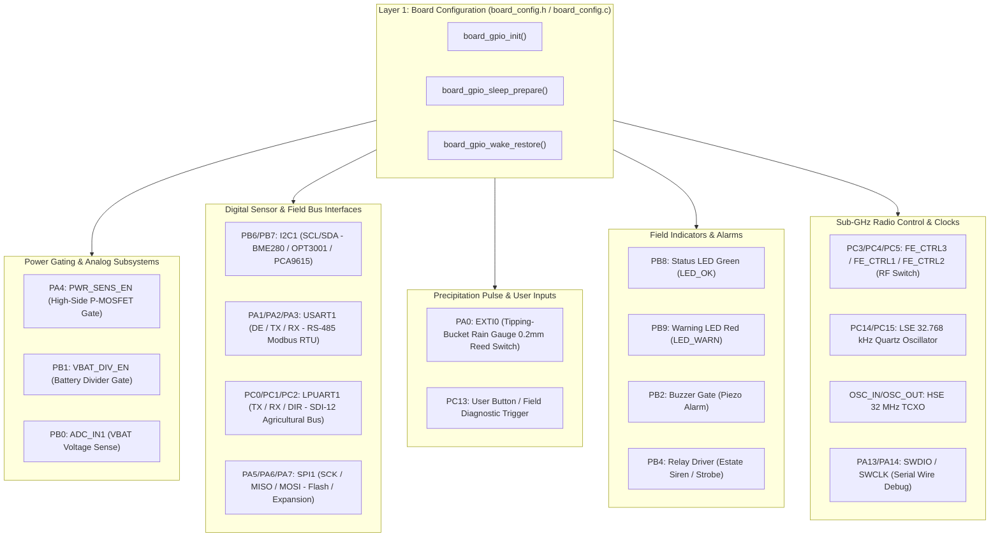

# Task Specification: S3-T1.1 - Target Board GPIO Pin Mappings & Configuration

## 1. Task Metadata & Overview

| Attribute | Specification Details |
| :--- | :--- |
| **Sprint** | **Sprint 3: Core MCU Architecture, BSP & Power Management** |
| **Task ID** | `S3-T1.1` |
| **Parent Task** | `S3-T1: Implement Target Board Configuration & Clock Tree` |
| **Task Title** | Define GPIO Pin Mappings and Board Header Definitions (`board_config.h` / `board_config.c`) |
| **Status** | **Ready for Implementation** |
| **Target Files** | [`firmware/core/inc/board_config.h`](file:///C:/Users/ENERGY%20SAVER/Documents/Learning/Job%20Projects/rain-predict/firmware/core/inc/board_config.h)<br>[`firmware/core/src/board_config.c`](file:///C:/Users/ENERGY%20SAVER/Documents/Learning/Job%20Projects/rain-predict/firmware/core/src/board_config.c) |
| **Related Documents** | [`docs/hardware/schematics-and-pinout.md`](file:///C:/Users/ENERGY%20SAVER/Documents/Learning/Job%20Projects/rain-predict/docs/hardware/schematics-and-pinout.md)<br>[`docs/architecture/firmware-architecture.md`](file:///C:/Users/ENERGY%20SAVER/Documents/Learning/Job%20Projects/rain-predict/docs/architecture/firmware-architecture.md)<br>[`docs/architecture/power-architecture.md`](file:///C:/Users/ENERGY%20SAVER/Documents/Learning/Job%20Projects/rain-predict/docs/architecture/power-architecture.md)<br>[`docs/hardware/power-supply-and-solar.md`](file:///C:/Users/ENERGY%20SAVER/Documents/Learning/Job%20Projects/rain-predict/docs/hardware/power-supply-and-solar.md)<br>[`context/coding-standards.md`](file:///C:/Users/ENERGY%20SAVER/Documents/Learning/Job%20Projects/rain-predict/context/coding-standards.md)<br>[`context/project-structure.md`](file:///C:/Users/ENERGY%20SAVER/Documents/Learning/Job%20Projects/rain-predict/context/project-structure.md) |
| **Dependencies** | None (Foundational hardware configuration specification) |
| **Downstream Tasks** | `S3-T1.2` (Clock Tree Configuration), `S3-T1.3` (HAL Conf), `S3-T2.1` (I2C Bus Driver), `S3-T2.2` (UART Bus Driver), `S3-T3.1` (Switched Power Rails), `S3-T3.2` (Board Indicators), `S3-T4.1` (Sleep Pin Conditioning), `S4-T1` through `S4-T5` (Sensor Drivers) |

---

## 2. Executive Summary & Architectural Scope

The primary objective of **`S3-T1.1`** is to define and implement the target hardware board configuration, GPIO pin allocations, alternate function multiplexing, electrical drive strengths, and low-power pin conditioning states for the **Tea Plantation Rain Prediction System** controller board in [`firmware/core/inc/board_config.h`](file:///C:/Users/ENERGY%20SAVER/Documents/Learning/Job%20Projects/rain-predict/firmware/core/inc/board_config.h) and [`firmware/core/src/board_config.c`](file:///C:/Users/ENERGY%20SAVER/Documents/Learning/Job%20Projects/rain-predict/firmware/core/src/board_config.c).

The hardware platform is based on the **STMicroelectronics STM32WLE5CCU6 / STM32WLE5J8** SoC (ARM Cortex-M4 @ 48 MHz with Single-Precision FPU, integrated Sub-GHz LoRa radio, 256 KB Flash, and 64 KB SRAM in a UFQFPN48 package).



### Core Hardware Functional Domains:

1. **Switched Sensor Power Rails (`VSENS_SW`)**:
   - Controlled via high-side P-channel MOSFET switch on `PA4` (`PIN_PWR_SENS_EN`).
   - Active-HIGH MCU drive opens the N-MOSFET gate, pulling the P-MOSFET gate to GND and energizing `VSENS_SW` ($3.3\text{V}$).
   - Enforces a mandatory **$20\text{ms}$ stabilization guard delay** before any I2C or UART communication commences.
2. **Digital Sensor Buses**:
   - **I2C1 (`PB6` SCL, `PB7` SDA)**: Connects local Bosch BME280, TI OPT3001, and NXP PCA9615 differential I2C driver ($4.7\,\text{k}\Omega$ external pull-ups to `VSENS_SW`).
   - **USART1 RS-485 (`PA2` TX, `PA3` RX, `PA1` DE/RE)**: Half-duplex Modbus RTU transceiver (SP3485 / MAX1487) for remote mast cabling up to $100\text{m}+$.
   - **LPUART1 SDI-12 (`PC0` TX, `PC1` RX, `PC2` DIR)**: 1200-baud half-duplex bus for agricultural soil and environmental probes.
   - **SPI1 (`PA5` SCK, `PA6` MISO, `PA7` MOSI)**: High-speed peripheral expansion and external Flash storage.
3. **Precipitation Pulse Capture**:
   - **`PA0` (EXTI0 Falling-Edge IRQ)**: Connected to tipping-bucket magnetic reed switch ($0.2\text{ mm/tip}$). Hardware RC filter ($\tau = 1.0\text{ms}$) combined with $50\text{ms}$ software lockout debouncing.
4. **Local Alert Actuators & Indicators**:
   - **`PB8` (LED_OK / Green)**: Healthy heartbeat / normal state pulse.
   - **`PB9` (LED_WARN / Red)**: Storm warning / rain imminent rapid strobe.
   - **`PB2` (BUZZER)**: Piezoelectric buzzer gate driver ($90\text{dB} @ 10\text{cm}$).
   - **`PB4` (RELAY)**: Optocoupled estate siren / strobe relay driver ($10\text{s}$ timed burst).
5. **Battery Voltage Monitoring**:
   - **`PB0` (ADC_IN1)**: Resistor divider ($100\,\text{k}\Omega / 100\,\text{k}\Omega$, $0.5\times$ scaling) for $V_{\text{bat}}$ measurement ($3.0\text{V}–3.6\text{V}$ LiFePO4).
   - **`PB1` (VBAT_DIV_EN)**: P-MOSFET gate disconnects divider when idle to achieve $< 10\text{nA}$ standby current.
6. **Sub-GHz Radio Front-End & Clocking**:
   - **`PC3/PC4/PC5` (FE_CTRL3/1/2)**: Controls RF antenna switch (PE4259 / SKY13373) for High-Power TX ($+22\text{dBm}$), Low-Power TX ($+14\text{dBm}$), and RX modes.
   - **`PC14/PC15` (OSC32_IN/OUT)**: Low-Speed External $32.768\text{ kHz}$ quartz crystal for continuous RTC timekeeping in Stop 2 sleep.
   - **`OSC_IN/OSC_OUT`**: High-Speed External $32\text{ MHz}$ TCXO for LoRa radio carrier synthesis and MSI active clock reference.

---

## 3. Comprehensive Pin Allocation & Electrical Specifications

The pin mapping targets the **STM32WLE5CCU6** (UFQFPN48, $7\times 7\text{ mm}$, $0.5\text{ mm}$ pitch).

### 3.1 Complete MCU Pinout Table

| Pin # | Pin Name | Signal Alias | Direction | Mode | Pull Config | Speed | Alternate Function | Active State | Sleep State (Stop 2) | Connected Hardware / Circuit Function |
| :---: | :--- | :--- | :---: | :---: | :---: | :---: | :---: | :---: | :---: | :--- |
| **1** | `VBAT` | `VBAT` | PWR | Power | — | — | — | — | Active | Battery backup supply / LiFePO4 direct rail |
| **2** | `PC13` | `PIN_USER_BTN` | IN | Input | Pull-up | Low | GPIO | Low (Pressed) | Analog / Hi-Z | User Config / Field Diagnostic push-button |
| **3** | `PC14` | `OSC32_IN` | IN | Analog | None | Low | RCC | — | Active (LSE) | $32.768\text{ kHz}$ Quartz Crystal oscillator input |
| **4** | `PC15` | `OSC32_OUT` | OUT | Analog | None | Low | RCC | — | Active (LSE) | $32.768\text{ kHz}$ Quartz Crystal oscillator output |
| **5** | `OSC_IN`| `HSE_IN` | IN | Analog | None | High | RCC | — | Off (Stop 2) | $32\text{ MHz}$ TCXO / Crystal oscillator input |
| **6** | `OSC_OUT`| `HSE_OUT` | OUT | Analog | None | High | RCC | — | Off (Stop 2) | $32\text{ MHz}$ Oscillator output |
| **7** | `NRST` | `NRST` | IN | Reset | Pull-up | — | System | Low (Reset) | Active | Hardware System Reset line + $100\text{nF}$ filter |
| **8** | `PA0` | `PIN_RAIN_GAUGE` | IN | EXTI | None (Ext PU) | Very High | EXTI0 | Low (Tip) | **EXTI Wakeup** | Rain Gauge Reed Switch ($0.2\text{ mm/tip}$) |
| **9** | `PA1` | `PIN_RS485_DIR` | OUT | Output | None | High | GPIO | High (TX) / Low (RX)| Low (RX / Dis) | RS-485 Transceiver DE//RE Direction Control |
| **10** | `PA2` | `PIN_RS485_TX` | OUT | AF | None | Very High | AF7 (USART1_TX)| — | **Analog (No-Pull)** | RS-485 Transceiver Data In (`DI`) |
| **11** | `PA3` | `PIN_RS485_RX` | IN | AF | None | Very High | AF7 (USART1_RX)| — | **Analog (No-Pull)** | RS-485 Transceiver Data Out (`RO`) |
| **12** | `PA4` | `PIN_PWR_SENS_EN`| OUT | Output | None | Medium | GPIO | High (ON) / Low (OFF)| **Low (OFF)** | Switched Sensor Rail High-Side P-MOSFET Gate |
| **13** | `PA5` | `PIN_SPI1_SCK` | OUT | AF | None | Very High | AF5 (SPI1_SCK) | — | Analog / Hi-Z | External Flash / SPI Expansion Clock |
| **14** | `PA6` | `PIN_SPI1_MISO`| IN | AF | None | Very High | AF5 (SPI1_MISO)| — | Analog / Hi-Z | External Flash / SPI Expansion Master-In |
| **15** | `PA7` | `PIN_SPI1_MOSI`| OUT | AF | None | Very High | AF5 (SPI1_MOSI)| — | Analog / Hi-Z | External Flash / SPI Expansion Master-Out |
| **16** | `PB0` | `PIN_VBAT_MEAS` | IN | Analog | None | Low | ADC_IN1 | Analog | Analog / Hi-Z | Battery Voltage Resistor Divider ($0.5\times$) |
| **17** | `PB1` | `PIN_VBAT_DIV_EN`| OUT | Output | None | Low | GPIO | Low (ON) / High (OFF)| **High (OFF)** | Battery Resistor Divider P-MOSFET Enable Gate |
| **18** | `PB2` | `PIN_BUZZER` | OUT | Output | None | Medium | GPIO | High (Sound) | Low (Silent) | Piezo Buzzer Transistor Gate |
| **19** | `PB4` | `PIN_RELAY` | OUT | Output | None | Medium | GPIO | High (Energized)| Low (De-energized)| Estate Siren Relay Optocoupler Gate |
| **20** | `PB6` | `PIN_I2C1_SCL` | OD | AF | None (Ext PU) | High | AF4 (I2C1_SCL) | Open-Drain | **Analog (No-Pull)** | I2C1 Clock (BME280 / OPT3001 / PCA9615) |
| **21** | `PB7` | `PIN_I2C1_SDA` | OD | AF | None (Ext PU) | High | AF4 (I2C1_SDA) | Open-Drain | **Analog (No-Pull)** | I2C1 Data (BME280 / OPT3001 / PCA9615) |
| **22** | `PB8` | `PIN_LED_OK` | OUT | Output | None | Low | GPIO | High (Illuminated)| Low (Off) | Status LED Green (Heartbeat / Normal State) |
| **23** | `PB9` | `PIN_LED_WARN` | OUT | Output | None | Low | GPIO | High (Illuminated)| Low (Off) | Warning LED Red (Rain Imminent Alert) |
| **24** | `PC0` | `PIN_SDI12_TX` | OUT | AF | None | High | AF8 (LPUART1_TX)| — | **Analog (No-Pull)** | SDI-12 Half-Duplex Transmit Data |
| **25** | `PC1` | `PIN_SDI12_RX` | IN | AF | None | High | AF8 (LPUART1_RX)| — | **Analog (No-Pull)** | SDI-12 Half-Duplex Receive Data |
| **26** | `PC2` | `PIN_SDI12_DIR` | OUT | Output | None | High | GPIO | High (TX) / Low (RX)| Low (RX) | SDI-12 Bus Direction / Tri-State Buffer Gate |
| **27** | `PC3` | `PIN_FE_CTRL3` | OUT | Output | None | Very High | RF Control | Mode dependent | Controlled | Sub-GHz RF Switch Control Line 3 |
| **28** | `PC4` | `PIN_FE_CTRL1` | OUT | Output | None | Very High | RF Control | Mode dependent | Controlled | Sub-GHz RF Switch Control Line 1 |
| **29** | `PC5` | `PIN_FE_CTRL2` | OUT | Output | None | Very High | RF Control | Mode dependent | Controlled | Sub-GHz RF Switch Control Line 2 |
| **34** | `PA13` | `SWDIO` | I/O | AF | Pull-up | Very High | AF0 (SWDIO) | — | Pull-up | ARM Serial Wire Debug Data Line |
| **35** | `PA14` | `SWCLK` | IN | AF | Pull-down | Very High | AF0 (SWCLK) | — | Pull-down | ARM Serial Wire Debug Clock Line |
| **48** | `VDD` | `VDD_MCU` | PWR | Power | — | — | — | — | Active | Clean $3.3\text{V}$ Regulated DC Rail (TPS7A02) |

---

## 4. Power Gating & Low-Power Stop 2 Pin Conditioning Rules

In accordance with [`docs/architecture/power-architecture.md`](file:///C:/Users/ENERGY%20SAVER/Documents/Learning/Job%20Projects/rain-predict/docs/architecture/power-architecture.md):

### 4.1 Switched Rail Sequencing (`VSENS_SW`)
- **Power ON Sequence**:
  1. Drive `PA4` (`PIN_PWR_SENS_EN`) HIGH.
  2. Enforce a blocking hardware/timer delay of **$20\text{ ms}$** (`BOARD_POWER_RAIL_STABILIZATION_MS`).
  3. Reconfigure `PB6/PB7` (I2C1) and `PA2/PA3` (USART1) to Alternate Function mode with appropriate peripheral clocks enabled.
- **Power OFF Sequence**:
  1. De-assert and disable peripheral clocks (`I2C1`, `USART1`, `LPUART1`, `SPI1`).
  2. **Mandatory Leakage Elimination**: Reconfigure all sensor bus pins (`PB6`, `PB7`, `PA2`, `PA3`, `PC0`, `PC1`) to **`GPIO_MODE_ANALOG`** with **no pull-up or pull-down resistors**.
  3. Drive `PA4` (`PIN_PWR_SENS_EN`) LOW (P-MOSFET turns OFF, discharging rail through $100\,\text{k}\Omega$ bleeder).

### 4.2 Pre-Sleep GPIO Conditioning (`board_gpio_sleep_prepare`)
Prior to entering Stop 2 sleep mode ($I_{\text{target}} < 3.0\,\mu\text{A}$), the board configuration driver must:
1. Ensure `PA4` (Sensor Power Gate) is LOW.
2. Ensure `PB1` (Battery Divider Enable) is HIGH (Divider OFF).
3. Ensure `PB2` (Buzzer), `PB4` (Relay), `PB8` (LED Green), and `PB9` (LED Red) are driven LOW (De-energized).
4. Reconfigure all floating and bus pins to `GPIO_MODE_ANALOG` except:
   - `PA0` (EXTI0 rain gauge wake interrupt: kept active with falling-edge trigger).
   - `PC14/PC15` (LSE $32.768\text{ kHz}$ quartz: retained for RTC).
   - `PC3/PC4/PC5` (RF switch control: conditioned to low-leakage state).
   - `PA13/PA14` (SWD debug: pull-up/pull-down retained).

---

## 5. Public API Specification (`board_config.h`)

| Function Prototype | Description |
| :--- | :--- |
| `status_t board_gpio_init(void)` | Initializes all GPIO clocks, standard output states, EXTI inputs, and default peripheral pin assignments. |
| `status_t board_gpio_sleep_prepare(void)` | Conditions all GPIO pins into ultra-low-leakage Analog modes prior to Stop 2 sleep entry. |
| `status_t board_gpio_wake_restore(void)` | Restores peripheral pin assignments and active GPIO states upon wake from Stop 2 mode. |
| `status_t board_sensor_power_enable(bool enable)` | Controls switched sensor rail (`PA4`) with mandatory $20\text{ms}$ stabilization delay on enable. |
| `status_t board_vbat_divider_enable(bool enable)` | Enables or disables the high-side P-MOSFET battery measurement resistor divider (`PB1`). |
| `void board_led_set(board_led_t led, bool state)` | Sets visual status LED (`BOARD_LED_OK` or `BOARD_LED_WARN`) ON (`true`) or OFF (`false`). |
| `void board_led_toggle(board_led_t led)` | Toggles visual status LED state. |
| `void board_buzzer_set(bool state)` | Drives piezo buzzer gate (`PB2`) ON (`true`) or OFF (`false`). |
| `void board_relay_set(bool state)` | Drives alert relay optocoupler gate (`PB4`) ON (`true`) or OFF (`false`). |
| `void board_rs485_dir_set(board_rs485_dir_t dir)` | Controls RS-485 transceiver half-duplex DE//RE direction (`BOARD_RS485_DIR_TX` vs `BOARD_RS485_DIR_RX`). |
| `void board_sdi12_dir_set(board_sdi12_dir_t dir)` | Controls SDI-12 direction buffer (`BOARD_SDI12_DIR_TX` vs `BOARD_SDI12_DIR_RX`). |
| `void board_rf_switch_set(board_rf_mode_t mode)` | Configures RF switch lines (`PC3/PC4/PC5`) for `RF_SWITCH_SHUTDOWN`, `RF_SWITCH_RX`, `RF_SWITCH_TX_HP`, or `RF_SWITCH_TX_LP`. |
| `bool board_button_is_pressed(void)` | Reads momentary state of field test button (`PC13`). |

---

## 6. Concrete File Implementation Blueprint

### 6.1 `firmware/core/inc/board_config.h` Blueprint

```c
/**
 * @file    board_config.h
 * @brief   Target board pin mapping and hardware configuration for STM32WLE5 SoC.
 * @details Establishes central hardware pin assignments, electrical modes, power gating,
 *          and low-power Stop 2 conditioning for the Tea Plantation Rain Prediction System.
 */

#ifndef BOARD_CONFIG_H
#define BOARD_CONFIG_H

#ifdef __cplusplus
extern "C" {
#endif

#include <stdint.h>
#include <stdbool.h>
#include <stddef.h>

#if defined(STM32WLE5xx) || defined(USE_HAL_DRIVER)
#include "stm32wlxx_hal.h"
#else
/* Standard port/pin types for host unit testing & simulation */
typedef void* GPIO_TypeDef;
#define GPIOA ((GPIO_TypeDef)0x48000000U)
#define GPIOB ((GPIO_TypeDef)0x48000400U)
#define GPIOC ((GPIO_TypeDef)0x48000800U)
#define GPIO_PIN_0   ((uint16_t)0x0001U)
#define GPIO_PIN_1   ((uint16_t)0x0002U)
#define GPIO_PIN_2   ((uint16_t)0x0004U)
#define GPIO_PIN_3   ((uint16_t)0x0008U)
#define GPIO_PIN_4   ((uint16_t)0x0010U)
#define GPIO_PIN_5   ((uint16_t)0x0020U)
#define GPIO_PIN_6   ((uint16_t)0x0040U)
#define GPIO_PIN_7   ((uint16_t)0x0080U)
#define GPIO_PIN_8   ((uint16_t)0x0100U)
#define GPIO_PIN_9   ((uint16_t)0x0200U)
#define GPIO_PIN_10  ((uint16_t)0x0400U)
#define GPIO_PIN_13  ((uint16_t)0x2000U)
#define GPIO_PIN_14  ((uint16_t)0x4000U)
#define GPIO_PIN_15  ((uint16_t)0x8000U)
#endif

/**
 * @brief Standard firmware return status codes matching coding-standards.md.
 */
typedef enum {
    STATUS_OK                       = 0x00,
    STATUS_ERR_GENERIC              = 0x01,
    STATUS_ERR_BUSY                 = 0x02,
    STATUS_ERR_TIMEOUT              = 0x03,
    STATUS_ERR_NULL_PTR             = 0x04,
    STATUS_ERR_INVALID_PARAM        = 0x05,
    STATUS_ERR_I2C_BUS              = 0x06,
    STATUS_ERR_UART_BUS             = 0x07,
    STATUS_ERR_CRC_MISMATCH         = 0x08,
    STATUS_ERR_SENSOR_NO_RESPONSE   = 0x09,
    STATUS_ERR_BUFFER_OVERFLOW      = 0x0A,
    STATUS_ERR_FLASH_WRITE          = 0x0B,
    STATUS_ERR_RADIO_TX_FAIL        = 0x0C
} status_t;

/* ============================================================================
 * Hardware Pin Definitions & Port Mappings (UFQFPN48 STM32WLE5)
 * ============================================================================ */

/* --- Switched Sensor Power Rail Gate --- */
#define PIN_PWR_SENS_PORT                   GPIOA
#define PIN_PWR_SENS_PIN                    GPIO_PIN_4
#define BOARD_POWER_RAIL_STABILIZATION_MS   20U

/* --- Rain Gauge EXTI Pulse Input --- */
#define PIN_RAIN_GAUGE_PORT                 GPIOA
#define PIN_RAIN_GAUGE_PIN                  GPIO_PIN_0
#define PIN_RAIN_GAUGE_EXTI_IRQn            EXTI0_IRQn

/* --- RS-485 Modbus RTU Bus (USART1) --- */
#define PIN_RS485_DIR_PORT                  GPIOA
#define PIN_RS485_DIR_PIN                   GPIO_PIN_1
#define PIN_RS485_TX_PORT                   GPIOA
#define PIN_RS485_TX_PIN                    GPIO_PIN_2
#define PIN_RS485_TX_AF                     GPIO_AF7_USART1
#define PIN_RS485_RX_PORT                   GPIOA
#define PIN_RS485_RX_PIN                    GPIO_PIN_3
#define PIN_RS485_RX_AF                     GPIO_AF7_USART1

/* --- I2C Sensor Bus (I2C1 - BME280 / OPT3001 / PCA9615) --- */
#define PIN_I2C1_SCL_PORT                   GPIOB
#define PIN_I2C1_SCL_PIN                    GPIO_PIN_6
#define PIN_I2C1_SCL_AF                     GPIO_AF4_I2C1
#define PIN_I2C1_SDA_PORT                   GPIOB
#define PIN_I2C1_SDA_PIN                    GPIO_PIN_7
#define PIN_I2C1_SDA_AF                     GPIO_AF4_I2C1

/* --- Battery Voltage Measurement (ADC_IN1) --- */
#define PIN_VBAT_MEAS_PORT                  GPIOB
#define PIN_VBAT_MEAS_PIN                   GPIO_PIN_0
#define PIN_VBAT_DIV_EN_PORT                GPIOB
#define PIN_VBAT_DIV_EN_PIN                 GPIO_PIN_1

/* --- Local Status Indicators & Alarms --- */
#define PIN_LED_OK_PORT                     GPIOB
#define PIN_LED_OK_PIN                      GPIO_PIN_8
#define PIN_LED_WARN_PORT                   GPIOB
#define PIN_LED_WARN_PIN                    GPIO_PIN_9
#define PIN_BUZZER_PORT                     GPIOB
#define PIN_BUZZER_PIN                      GPIO_PIN_2
#define PIN_RELAY_PORT                      GPIOB
#define PIN_RELAY_PIN                       GPIO_PIN_4

/* --- SDI-12 Auxiliary Bus (LPUART1) --- */
#define PIN_SDI12_TX_PORT                   GPIOC
#define PIN_SDI12_TX_PIN                    GPIO_PIN_0
#define PIN_SDI12_TX_AF                     GPIO_AF8_LPUART1
#define PIN_SDI12_RX_PORT                   GPIOC
#define PIN_SDI12_RX_PIN                    GPIO_PIN_1
#define PIN_SDI12_RX_AF                     GPIO_AF8_LPUART1
#define PIN_SDI12_DIR_PORT                  GPIOC
#define PIN_SDI12_DIR_PIN                   GPIO_PIN_2

/* --- Sub-GHz RF Switch Control --- */
#define PIN_FE_CTRL1_PORT                   GPIOC
#define PIN_FE_CTRL1_PIN                    GPIO_PIN_4
#define PIN_FE_CTRL2_PORT                   GPIOC
#define PIN_FE_CTRL2_PIN                    GPIO_PIN_5
#define PIN_FE_CTRL3_PORT                   GPIOC
#define PIN_FE_CTRL3_PIN                    GPIO_PIN_3

/* --- User Field Test Push-Button --- */
#define PIN_USER_BTN_PORT                   GPIOC
#define PIN_USER_BTN_PIN                    GPIO_PIN_13

/* ============================================================================
 * Enumerations & Type Definitions
 * ============================================================================ */

/**
 * @brief Board Status LED Identifiers.
 */
typedef enum {
    BOARD_LED_OK = 0,   /**< Green Heartbeat / Normal Status LED (PB8) */
    BOARD_LED_WARN      /**< Red Warning / Storm Alert LED (PB9) */
} board_led_t;

/**
 * @brief RS-485 Half-Duplex Direction Modes.
 */
typedef enum {
    BOARD_RS485_DIR_RX = 0, /**< Receiver Active / Transmitter Tri-Stated (PA1 LOW) */
    BOARD_RS485_DIR_TX = 1  /**< Transmitter Active (PA1 HIGH) */
} board_rs485_dir_t;

/**
 * @brief SDI-12 Direction Modes.
 */
typedef enum {
    BOARD_SDI12_DIR_RX = 0, /**< Listening / Tri-State (PC2 LOW) */
    BOARD_SDI12_DIR_TX = 1  /**< Driving Bus Line (PC2 HIGH) */
} board_sdi12_dir_t;

/**
 * @brief Sub-GHz RF Switch Operating Modes.
 */
typedef enum {
    RF_SWITCH_SHUTDOWN = 0, /**< All paths isolated for minimum current */
    RF_SWITCH_RX,           /**< Receiver path selected */
    RF_SWITCH_TX_LP,        /**< Low-Power Transmitter path selected (+14 dBm) */
    RF_SWITCH_TX_HP         /**< High-Power Transmitter path selected (+22 dBm) */
} board_rf_mode_t;

/* ============================================================================
 * Public Board Lifecycle & GPIO Function Prototypes
 * ============================================================================ */

/**
 * @brief  Initializes all target MCU GPIO ports, default output states, and EXTI interrupts.
 * @return status_t STATUS_OK on success, error code otherwise.
 */
status_t board_gpio_init(void);

/**
 * @brief  Prepares all GPIO pins for ultra-low-leakage Stop 2 deep sleep mode (< 3.0 uA).
 * @return status_t STATUS_OK on success.
 */
status_t board_gpio_sleep_prepare(void);

/**
 * @brief  Restores operational GPIO pin modes and peripheral multiplexing upon wake from Stop 2.
 * @return status_t STATUS_OK on success.
 */
status_t board_gpio_wake_restore(void);

/**
 * @brief  Enables or disables switched sensor power rail (VSENS_SW on PA4).
 * @param[in] enable true to energize rail with 20ms stabilization; false to de-energize.
 * @return status_t STATUS_OK on success.
 */
status_t board_sensor_power_enable(bool enable);

/**
 * @brief  Enables or disables the battery voltage measurement divider (PB1).
 * @param[in] enable true to connect divider (PB1 LOW); false to disconnect (PB1 HIGH).
 * @return status_t STATUS_OK on success.
 */
status_t board_vbat_divider_enable(bool enable);

/**
 * @brief  Sets status LED state.
 * @param[in] led   LED identifier (BOARD_LED_OK or BOARD_LED_WARN).
 * @param[in] state true for ON (illuminated), false for OFF.
 */
void board_led_set(board_led_t led, bool state);

/**
 * @brief  Toggles status LED state.
 * @param[in] led LED identifier.
 */
void board_led_toggle(board_led_t led);

/**
 * @brief  Drives local alarm buzzer output gate (PB2).
 * @param[in] state true to sound buzzer, false to silence.
 */
void board_buzzer_set(bool state);

/**
 * @brief  Drives local alert relay optocoupler gate (PB4).
 * @param[in] state true to energize relay, false to de-energize.
 */
void board_relay_set(bool state);

/**
 * @brief  Sets RS-485 transceiver half-duplex direction (PA1).
 * @param[in] dir Direction mode (BOARD_RS485_DIR_RX or BOARD_RS485_DIR_TX).
 */
void board_rs485_dir_set(board_rs485_dir_t dir);

/**
 * @brief  Sets SDI-12 bus transceiver direction (PC2).
 * @param[in] dir Direction mode (BOARD_SDI12_DIR_RX or BOARD_SDI12_DIR_TX).
 */
void board_sdi12_dir_set(board_sdi12_dir_t dir);

/**
 * @brief  Sets Sub-GHz RF antenna switch configuration lines (PC3/PC4/PC5).
 * @param[in] mode Desired RF mode.
 */
void board_rf_switch_set(board_rf_mode_t mode);

/**
 * @brief  Reads momentary status of user field test push-button (PC13).
 * @return bool true if button is currently pressed (active LOW).
 */
bool board_button_is_pressed(void);

#ifdef __cplusplus
}
#endif

#endif /* BOARD_CONFIG_H */
