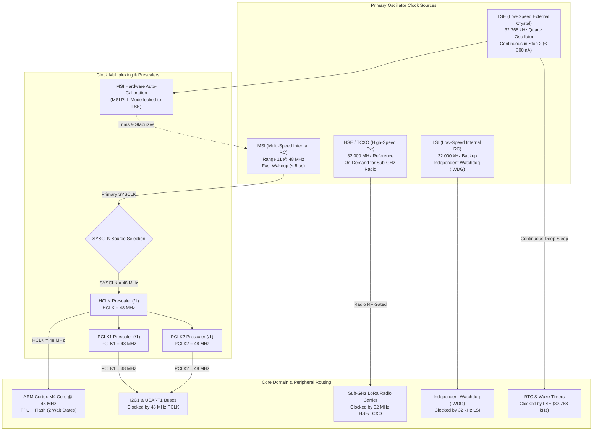
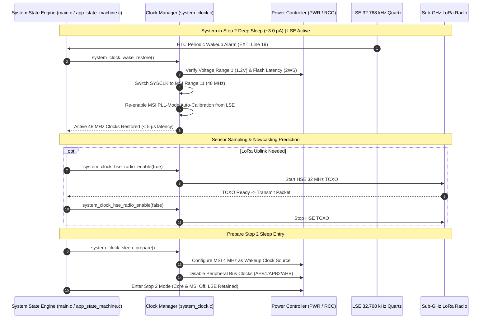

# Task Specification: S3-T1.2 - System Clock Tree & Low-Power Oscillator Configuration

## 1. Task Metadata & Overview

| Attribute | Specification Details |
| :--- | :--- |
| **Sprint** | **Sprint 3: Core MCU Architecture, BSP & Power Management** |
| **Task ID** | `S3-T1.2` |
| **Parent Task** | `S3-T1: Implement Target Board Configuration & Clock Tree` |
| **Task Title** | Configure System Clock Tree: MSI @ 48 MHz, LSE @ 32.768 kHz, and HSE/TCXO @ 32 MHz |
| **Status** | **Ready for Implementation** |
| **Target Files** | [`firmware/core/inc/system_clock.h`](file:///C:/Users/ENERGY%20SAVER/Documents/Learning/Job%20Projects/rain-predict/firmware/core/inc/system_clock.h)<br>[`firmware/core/src/system_clock.c`](file:///C:/Users/ENERGY%20SAVER/Documents/Learning/Job%20Projects/rain-predict/firmware/core/src/system_clock.c)<br>[`firmware/core/inc/system_stm32wlxx.h`](file:///C:/Users/ENERGY%20SAVER/Documents/Learning/Job%20Projects/rain-predict/firmware/core/inc/system_stm32wlxx.h)<br>[`firmware/core/src/system_stm32wlxx.c`](file:///C:/Users/ENERGY%20SAVER/Documents/Learning/Job%20Projects/rain-predict/firmware/core/src/system_stm32wlxx.c) |
| **Related Documents** | [`docs/hardware/schematics-and-pinout.md`](file:///C:/Users/ENERGY%20SAVER/Documents/Learning/Job%20Projects/rain-predict/docs/hardware/schematics-and-pinout.md)<br>[`docs/architecture/firmware-architecture.md`](file:///C:/Users/ENERGY%20SAVER/Documents/Learning/Job%20Projects/rain-predict/docs/architecture/firmware-architecture.md)<br>[`docs/architecture/power-architecture.md`](file:///C:/Users/ENERGY%20SAVER/Documents/Learning/Job%20Projects/rain-predict/docs/architecture/power-architecture.md)<br>[`docs/hardware/power-supply-and-solar.md`](file:///C:/Users/ENERGY%20SAVER/Documents/Learning/Job%20Projects/rain-predict/docs/hardware/power-supply-and-solar.md)<br>[`context/coding-standards.md`](file:///C:/Users/ENERGY%20SAVER/Documents/Learning/Job%20Projects/rain-predict/context/coding-standards.md)<br>[`context/specs/s3-t1.1-gpio-pin-mappings.md`](file:///C:/Users/ENERGY%20SAVER/Documents/Learning/Job%20Projects/rain-predict/context/specs/s3-t1.1-gpio-pin-mappings.md) |
| **Dependencies** | [`S3-T1.1`](file:///C:/Users/ENERGY%20SAVER/Documents/Learning/Job%20Projects/rain-predict/context/specs/s3-t1.1-gpio-pin-mappings.md) (Target Board GPIO Pin Mappings) |
| **Downstream Tasks** | `S3-T1.3` (HAL Conf), `S3-T2.1` (I2C Bus Driver), `S3-T2.2` (UART Bus Driver), `S3-T4.2` (Stop 2 Mode Sleep Manager), `S5-T4` (LoRaWAN Radio Timing), `S6-T1` (RTC Measurement Scheduler) |

---

## 2. Executive Summary & Architectural Scope

The primary objective of **`S3-T1.2`** is to specify, configure, and implement the system clock tree for the **STMicroelectronics STM32WLE5** SoC (ARM Cortex-M4 @ 48 MHz with Single-Precision FPU and Sub-GHz radio) in [`firmware/core/inc/system_clock.h`](file:///C:/Users/ENERGY%20SAVER/Documents/Learning/Job%20Projects/rain-predict/firmware/core/inc/system_clock.h) and [`firmware/core/src/system_clock.c`](file:///C:/Users/ENERGY%20SAVER/Documents/Learning/Job%20Projects/rain-predict/firmware/core/src/system_clock.c).

In ultra-low-power IoT applications operating in remote tea estate microclimates, clock architecture directly dictates both **computational burst energy** and **deep-sleep battery life**:



### Core Architectural Decisions:

1. **Multi-Speed Internal (MSI) as Primary System Clock (`SYSCLK = 48 MHz`)**:
   - Configured for **Range 11** ($48\text{ MHz}$) in Voltage Range 1 (High Performance $1.2\text{V}$ core).
   - Provides ultra-fast wakeup latency from Stop 2 ($< 5.0\,\mu\text{s}$) compared to external high-frequency crystals ($> 2.0\text{ ms}$ startup).
   - Hardware **MSI Auto-Calibration (PLL-mode)** locked against the LSE crystal achieves frequency accuracy within $\pm 0.25\%$, satisfying standard UART and I2C baud rate tolerances across $-40^\circ\text{C}$ to $+85^\circ\text{C}$.
2. **Low-Speed External Quartz Crystal (`LSE = 32.768 kHz`)**:
   - Connected across `PC14` (`OSC32_IN`) and `PC15` (`OSC32_OUT`) with medium-high drive capability (`RCC_LSEDRIVE_MEDIUMHIGH`).
   - Remains **permanently energized across all sleep modes** ($I_{\text{LSE}} \approx 250\text{ nA}$) to drive the hardware RTC, scheduled periodic wake alarms ($5\text{–}15\text{ min}$), and timestamp logs.
3. **High-Speed External TCXO (`HSE = 32.000 MHz`)**:
   - Provides low-phase-noise, temperature-compensated $32\text{ MHz}$ reference for the internal Sub-GHz LoRa radio transceiver PLL.
   - **On-Demand Power Gating**: Energized only during active LoRa transmission and reception windows (`board_rf_mode_t`), powered down during sensing and Stop 2 sleep to conserve energy.
4. **Low-Speed Internal RC (`LSI = 32 kHz`)**:
   - Dedicated clock source for the Independent Watchdog (IWDG) to ensure watchdog resets remain functional even if the external quartz crystal sustains physical damage.

---

## 3. Clock Tree Specifications & Peripheral Bus Routing

### 3.1 Primary Clock Source Specifications

| Oscillator | Nominal Frequency | Precision / Stability | Power Domain | Runtime State | Sleep State (Stop 2) | Usage in System |
| :--- | :---: | :---: | :---: | :---: | :---: | :--- |
| **MSI** | **$48.000\text{ MHz}$** | $\pm 0.25\%$ (LSE-calibrated) | $V_{\text{CORE}}$ | **Active (SYSCLK)** | Off (Restores in $< 5\mu\text{s}$) | CPU, Flash, SRAM, DMA, Bus Peripherals. |
| **LSE** | **$32.768\text{ kHz}$** | $\pm 20\text{ ppm}$ ($2.0\text{ s/day}$) | $V_{\text{BAT}} / V_{\text{DD}}$ | **Active (Continuous)** | **Active ($< 300\text{ nA}$)** | RTC Wakeup, MSI Auto-Calibration, LoRa Timing. |
| **HSE / TCXO** | **$32.000\text{ MHz}$** | $\pm 1.0\text{ ppm}$ | $V_{\text{DD}} / \text{TCXO}$ | Gated On-Demand | **Off ($0.0\,\mu\text{A}$)** | Sub-GHz LoRa RF Carrier & Packet Synthesis. |
| **LSI** | **$32.000\text{ kHz}$** | $\pm 5\%$ | $V_{\text{CORE}}$ | Active | Active (if IWDG armed) | Independent Watchdog (IWDG) safety supervisor. |

---

### 3.2 Bus Prescalers & Core Clock Tree Configuration

To achieve peak algorithmic throughput during active processing windows ($< 1.2\text{ s}$ active burst), all bus prescalers operate at full 1:1 ratios:

```
SYSCLK (MSI Range 11)   = 48,000,000 Hz
  ├── HCLK (AHB Prescaler /1)   = 48,000,000 Hz  ──> ARM Cortex-M4 CPU, SRAM1/2, Flash Controller, DMA
  ├── PCLK1 (APB1 Prescaler /1) = 48,000,000 Hz  ──> I2C1, LPUART1, LPTIM1, RTC Interface, PWR, WWDG
  └── PCLK2 (APB2 Prescaler /1) = 48,000,000 Hz  ──> USART1 (RS-485), SPI1, EXTI, TIM1
```

### 3.3 Power Scaling & Flash Wait State Rules

In accordance with STM32WLE5 reference manuals:
- **Core Voltage Scaling**: Voltage Range 1 (High Performance, $V_{\text{CORE}} = 1.2\text{V}$) is mandatory for $48\text{ MHz}$ execution (`PWR_REGULATOR_VOLTAGE_SCALE1`).
- **Flash Access Latency**: At $48\text{ MHz}$ and $V_{\text{CORE}} = 1.2\text{V}$, Flash access requires **2 Wait States** (`FLASH_LATENCY_2`).
- **Instruction / Data Prefetch**: Flash Prefetch Buffer, Instruction Cache (ICache), and Data Cache (DCache) must be enabled (`FLASH_ACR_PRFTEN`, `FLASH_ACR_ICEN`, `FLASH_ACR_DCEN`) to optimize single-cycle branch and loop throughput.

### 3.4 Peripheral Clock Multiplexing Table

| Peripheral | Functional Role | Assigned Clock Source | Clock Selection Macro | Clock Frequency |
| :--- | :--- | :---: | :--- | :---: |
| **I2C1** | BME280 / OPT3001 Sensor Bus | `PCLK1` | `RCC_I2C1CLKSOURCE_PCLK1` | $48.0\text{ MHz}$ |
| **USART1** | RS-485 Modbus RTU Master | `PCLK2` | `RCC_USART1CLKSOURCE_PCLK2` | $48.0\text{ MHz}$ |
| **LPUART1** | SDI-12 Auxiliary Bus | `LSE` or `PCLK1` | `RCC_LPUART1CLKSOURCE_PCLK1` | $48.0\text{ MHz}$ |
| **RTC** | Periodic Wakeup & Calendar | `LSE` | `RCC_RTCCLKSOURCE_LSE` | $32.768\text{ kHz}$ |
| **SUBGHZ** | LoRa Radio RF Transceiver | `HSE` (TCXO) | Dedicated Radio Clock Mux | $32.0\text{ MHz}$ |
| **ADC** | $V_{\text{bat}}$ Voltage Divider Sense | `SYSCLK` | `RCC_ADCCLKSOURCE_SYSCLK` | $48.0\text{ MHz}$ |
| **IWDG** | Hardware Watchdog | `LSI` | Hardware hardwired | $32.0\text{ kHz}$ |

---

## 4. Clock Lifecycle, MSI-LSE Auto-Calibration & Sleep Transitions



### 4.1 MSI Hardware Auto-Calibration (PLL Mode)
The STM32WLE5 contains a dedicated hardware frequency loop that locks the internal MSI RC oscillator to the high-stability LSE quartz crystal ($32.768\text{ kHz}$):
- Enabled via `RCC_CR_MSIPLLEN = 1` and `RCC_CR_MSIPLLSEL = 0` (LSE reference).
- Automatically compensates for thermal drift and aging, eliminating frequency jitter without consuming CPU cycles.

---

## 5. Public API Specification (`system_clock.h`)

| Function Prototype | Description |
| :--- | :--- |
| `status_t system_clock_init(void)` | Configures Power Range 1, 2 Flash wait states, LSE $32.768\text{ kHz}$, MSI $48\text{ MHz}$ with PLL auto-trim, and AHB/APB prescalers. |
| `status_t system_clock_lse_init(void)` | Initializes and verifies stable oscillation of the $32.768\text{ kHz}$ LSE quartz crystal. |
| `status_t system_clock_sleep_prepare(void)` | Gates peripheral clocks and configures MSI wake clock source prior to Stop 2 sleep entry. |
| `status_t system_clock_wake_restore(void)` | Restores $48\text{ MHz}$ MSI execution clock, Flash wait states, and bus prescalers upon wake from Stop 2. |
| `status_t system_clock_hse_radio_enable(bool enable)` | Powers up (`true`) or shuts down (`false`) the $32\text{ MHz}$ HSE/TCXO oscillator for LoRa radio operations. |
| `uint32_t system_clock_get_sysclk(void)` | Returns the current active SYSCLK frequency in Hz ($48,000,000\text{ Hz}$). |
| `uint32_t system_clock_get_hclk(void)` | Returns current AHB bus HCLK frequency in Hz ($48,000,000\text{ Hz}$). |
| `uint32_t system_clock_get_pclk1(void)` | Returns current APB1 bus PCLK1 frequency in Hz ($48,000,000\text{ Hz}$). |
| `uint32_t system_clock_get_pclk2(void)` | Returns current APB2 bus PCLK2 frequency in Hz ($48,000,000\text{ Hz}$). |
| `void SystemCoreClockUpdate(void)` | CMSIS standard function updating the global `SystemCoreClock` variable ($48000000$). |

---

## 6. Concrete File Implementation Blueprint

### 6.1 `firmware/core/inc/system_clock.h` Blueprint

```c
/**
 * @file    system_clock.h
 * @brief   System clock tree and low-power oscillator manager for STM32WLE5 SoC.
 * @details Configures MSI @ 48 MHz, LSE @ 32.768 kHz, HSE/TCXO @ 32 MHz, and bus routing.
 */

#ifndef SYSTEM_CLOCK_H
#define SYSTEM_CLOCK_H

#ifdef __cplusplus
extern "C" {
#endif

#include <stdint.h>
#include <stdbool.h>
#include <stddef.h>

#include "board_config.h"

/* ============================================================================
 * Clock Frequency Constants
 * ============================================================================ */

#define SYSTEM_CLOCK_SYSCLK_FREQ_HZ     48000000UL  /**< Active SYSCLK frequency: 48 MHz */
#define SYSTEM_CLOCK_HCLK_FREQ_HZ       48000000UL  /**< AHB HCLK frequency: 48 MHz */
#define SYSTEM_CLOCK_PCLK1_FREQ_HZ      48000000UL  /**< APB1 PCLK1 frequency: 48 MHz */
#define SYSTEM_CLOCK_PCLK2_FREQ_HZ      48000000UL  /**< APB2 PCLK2 frequency: 48 MHz */
#define SYSTEM_CLOCK_LSE_FREQ_HZ        32768UL     /**< LSE Quartz frequency: 32.768 kHz */
#define SYSTEM_CLOCK_HSE_RADIO_FREQ_HZ  32000000UL  /**< HSE TCXO Radio frequency: 32 MHz */
#define SYSTEM_CLOCK_LSI_FREQ_HZ        32000UL     /**< LSI Watchdog frequency: 32 kHz */

#define SYSTEM_CLOCK_LSE_TIMEOUT_MS     1000U       /**< Maximum LSE startup timeout in ms */
#define SYSTEM_CLOCK_HSE_TIMEOUT_MS     200U        /**< Maximum HSE/TCXO startup timeout in ms */

/* ============================================================================
 * Public Clock Management API Prototypes
 * ============================================================================ */

/**
 * @brief  Configures the primary system clock tree (MSI @ 48 MHz, LSE @ 32.768 kHz).
 * @return status_t STATUS_OK on success, error code on oscillator fault or timeout.
 */
status_t system_clock_init(void);

/**
 * @brief  Initializes the Low-Speed External (LSE) 32.768 kHz crystal oscillator.
 * @return status_t STATUS_OK on success, STATUS_ERR_TIMEOUT if crystal fails to start.
 */
status_t system_clock_lse_init(void);

/**
 * @brief  Prepares clock tree for Stop 2 deep sleep entry (scales clocks, isolates buses).
 * @return status_t STATUS_OK on success.
 */
status_t system_clock_sleep_prepare(void);

/**
 * @brief  Restores 48 MHz MSI system clocks and Flash latency upon wakeup from Stop 2.
 * @return status_t STATUS_OK on success.
 */
status_t system_clock_wake_restore(void);

/**
 * @brief  Enables or disables the 32 MHz HSE/TCXO oscillator for Sub-GHz LoRa radio operations.
 * @param[in] enable true to start and stabilize HSE TCXO; false to shut down.
 * @return status_t STATUS_OK on success, STATUS_ERR_TIMEOUT if oscillator fails to lock.
 */
status_t system_clock_hse_radio_enable(bool enable);

/**
 * @brief  Returns active SYSCLK frequency in Hz.
 */
uint32_t system_clock_get_sysclk(void);

/**
 * @brief  Returns active AHB HCLK frequency in Hz.
 */
uint32_t system_clock_get_hclk(void);

/**
 * @brief  Returns active APB1 PCLK1 frequency in Hz.
 */
uint32_t system_clock_get_pclk1(void);

/**
 * @brief  Returns active APB2 PCLK2 frequency in Hz.
 */
uint32_t system_clock_get_pclk2(void);

#ifdef __cplusplus
}
#endif

#endif /* SYSTEM_CLOCK_H */
```

---

### 6.2 `firmware/core/src/system_clock.c` Reference Blueprint

```c
/**
 * @file    system_clock.c
 * @brief   System clock tree initialization and low-power switching implementation.
 */

#include "system_clock.h"

#if defined(STM32WLE5xx) || defined(USE_HAL_DRIVER)

status_t system_clock_init(void) {
    RCC_OscInitTypeDef rcc_osc_init = {0};
    RCC_ClkInitTypeDef rcc_clk_init = {0};
    RCC_PeriphCLKInitTypeDef periph_clk_init = {0};

    /* 1. Configure Power Regulator to Range 1 (High Performance: 1.2V core) */
    HAL_PWREx_ControlVoltageScaling(PWR_REGULATOR_VOLTAGE_SCALE1);

    /* 2. Enable and stabilize LSE 32.768 kHz Quartz Crystal */
    status_t lse_status = system_clock_lse_init();
    if (lse_status != STATUS_OK) {
        /* Fall back gracefully if LSE fails */
    }

    /* 3. Configure Multi-Speed Internal (MSI) RC Oscillator to 48 MHz */
    rcc_osc_init.OscillatorType      = RCC_OSCILLATORTYPE_MSI;
    rcc_osc_init.MSIState            = RCC_MSI_ON;
    rcc_osc_init.MSICalibrationValue = RCC_MSICALIBRATION_DEFAULT;
    rcc_osc_init.MSIClockRange       = RCC_MSIRANGE_11; /* 48 MHz */
    
    /* Enable MSI Auto-Calibration via LSE if LSE is stable */
    if (lse_status == STATUS_OK) {
        rcc_osc_init.MSIPLLMode      = RCC_MSIPLL_MODE_ENABLE;
    } else {
        rcc_osc_init.MSIPLLMode      = RCC_MSIPLL_MODE_DISABLE;
    }

    rcc_osc_init.PLL.PLLState        = RCC_PLL_NONE; /* Direct MSI, no PLL multiplier needed */

    if (HAL_RCC_OscConfig(&rcc_osc_init) != HAL_OK) {
        return STATUS_ERR_GENERIC;
    }

    /* 4. Configure SYSCLK, HCLK, PCLK1, PCLK2 with 2 Flash Wait States */
    rcc_clk_init.ClockType      = RCC_CLOCKTYPE_HCLK   | 
                                  RCC_CLOCKTYPE_SYSCLK | 
                                  RCC_CLOCKTYPE_PCLK1  | 
                                  RCC_CLOCKTYPE_PCLK2;
    rcc_clk_init.SYSCLKSource   = RCC_SYSCLKSOURCE_MSI;
    rcc_clk_init.AHBCLKDivider  = RCC_SYSCLK_DIV1;  /* HCLK = 48 MHz */
    rcc_clk_init.APB1CLKDivider = RCC_HCLK_DIV1;    /* PCLK1 = 48 MHz */
    rcc_clk_init.APB2CLKDivider = RCC_HCLK_DIV1;    /* PCLK2 = 48 MHz */

    if (HAL_RCC_ClockConfig(&rcc_clk_init, FLASH_LATENCY_2) != HAL_OK) {
        return STATUS_ERR_GENERIC;
    }

    /* 5. Configure Peripheral Clock Multiplexers */
    periph_clk_init.PeriphClockSelection = RCC_PERIPHCLK_I2C1   | 
                                           RCC_PERIPHCLK_USART1 | 
                                           RCC_PERIPHCLK_RTC;
    periph_clk_init.I2c1ClockSelection   = RCC_I2C1CLKSOURCE_PCLK1;
    periph_clk_init.Usart1ClockSelection = RCC_USART1CLKSOURCE_PCLK2;
    periph_clk_init.RTCClockSelection    = RCC_RTCCLKSOURCE_LSE;

    if (HAL_RCCEx_PeriphCLKConfig(&periph_clk_init) != HAL_OK) {
        return STATUS_ERR_GENERIC;
    }

    /* 6. Enable Instruction Cache, Data Cache, and Flash Prefetch */
    __HAL_FLASH_INSTRUCTION_CACHE_ENABLE();
    __HAL_FLASH_DATA_CACHE_ENABLE();
    __HAL_FLASH_PREFETCH_BUFFER_ENABLE();

    /* 7. Update CMSIS SystemCoreClock variable */
    SystemCoreClockUpdate();

    return STATUS_OK;
}

status_t system_clock_lse_init(void) {
    RCC_OscInitTypeDef rcc_osc_init = {0};

    /* Enable access to Backup Domain (RTC & LSE control) */
    HAL_PWR_EnableBkUpAccess();
    __HAL_RCC_LSEDRIVE_CONFIG(RCC_LSEDRIVE_MEDIUMHIGH);

    rcc_osc_init.OscillatorType = RCC_OSCILLATORTYPE_LSE;
    rcc_osc_init.LSEState       = RCC_LSE_ON;

    if (HAL_RCC_OscConfig(&rcc_osc_init) != HAL_OK) {
        return STATUS_ERR_TIMEOUT;
    }

    return STATUS_OK;
}

status_t system_clock_sleep_prepare(void) {
    /* Configure MSI at 4 MHz as default wake-up clock */
    __HAL_RCC_WAKEUPSTOP_CLK_CONFIG(RCC_STOP_WAKEUPCLOCK_MSI);
    return STATUS_OK;
}

status_t system_clock_wake_restore(void) {
    /* Upon Stop 2 wake, restore MSI Range 11 (48 MHz) and 2 Flash Wait States */
    __HAL_FLASH_SET_LATENCY(FLASH_LATENCY_2);
    
    /* Scale MSI back to 48 MHz (Range 11) */
    __HAL_RCC_MSI_RANGE_CONFIG(RCC_MSIRANGE_11);
    
    /* Re-enable MSI Auto-Calibration via LSE */
    SET_BIT(RCC->CR, RCC_CR_MSIPLLEN);

    SystemCoreClockUpdate();
    return STATUS_OK;
}

status_t system_clock_hse_radio_enable(bool enable) {
    RCC_OscInitTypeDef rcc_osc_init = {0};

    if (enable) {
        /* Enable HSE in TCXO mode for Sub-GHz Radio */
        rcc_osc_init.OscillatorType = RCC_OSCILLATORTYPE_HSE;
        rcc_osc_init.HSEState       = RCC_HSE_TCXO; /* TCXO supply on STM32WLE5 */
        
        if (HAL_RCC_OscConfig(&rcc_osc_init) != HAL_OK) {
            return STATUS_ERR_TIMEOUT;
        }
    } else {
        /* Shut down HSE TCXO to save energy */
        rcc_osc_init.OscillatorType = RCC_OSCILLATORTYPE_HSE;
        rcc_osc_init.HSEState       = RCC_HSE_OFF;
        
        if (HAL_RCC_OscConfig(&rcc_osc_init) != HAL_OK) {
            return STATUS_ERR_GENERIC;
        }
    }

    return STATUS_OK;
}

uint32_t system_clock_get_sysclk(void) {
    return SYSTEM_CLOCK_SYSCLK_FREQ_HZ;
}

uint32_t system_clock_get_hclk(void) {
    return SYSTEM_CLOCK_HCLK_FREQ_HZ;
}

uint32_t system_clock_get_pclk1(void) {
    return SYSTEM_CLOCK_PCLK1_FREQ_HZ;
}

uint32_t system_clock_get_pclk2(void) {
    return SYSTEM_CLOCK_PCLK2_FREQ_HZ;
}

#else
/* --- Host Unit Test & Simulation Stubs --- */
status_t system_clock_init(void) { return STATUS_OK; }
status_t system_clock_lse_init(void) { return STATUS_OK; }
status_t system_clock_sleep_prepare(void) { return STATUS_OK; }
status_t system_clock_wake_restore(void) { return STATUS_OK; }
status_t system_clock_hse_radio_enable(bool enable) { (void)enable; return STATUS_OK; }
uint32_t system_clock_get_sysclk(void) { return SYSTEM_CLOCK_SYSCLK_FREQ_HZ; }
uint32_t system_clock_get_hclk(void) { return SYSTEM_CLOCK_HCLK_FREQ_HZ; }
uint32_t system_clock_get_pclk1(void) { return SYSTEM_CLOCK_PCLK1_FREQ_HZ; }
uint32_t system_clock_get_pclk2(void) { return SYSTEM_CLOCK_PCLK2_FREQ_HZ; }
#endif
```

---

## 7. Verification & Acceptance Test Plan

To verify the successful completion of **`S3-T1.2`**, the following test cases must be validated:

### 7.1 Verification Test Cases

| Test Case ID | Verification Action | Expected Outcome | Pass/Fail Criteria |
| :--- | :--- | :--- | :--- |
| **TC-S3-T1.2-01** | Header Inclusion & C99 Compilation | Include `system_clock.h` across host unit tests and target build trees. | 100% warning-free compilation under `-Wall -Wextra -Wpedantic -Werror`. |
| **TC-S3-T1.2-02** | Frequency Reporting Consistency | Call `system_clock_get_sysclk()`, `system_clock_get_hclk()`, `system_clock_get_pclk1()`, `system_clock_get_pclk2()`. | All functions return exact nominal $48,000,000\text{ Hz}$. |
| **TC-S3-T1.2-03** | MSI 48 MHz & Flash Latency Configuration | Inspect `system_clock_init()` register configurations. | Voltage Scale 1 applied, `FLASH_LATENCY_2` set, MSI Range 11 enabled. |
| **TC-S3-T1.2-04** | LSE 32.768 kHz RTC Routing | Verify RTC clock source multiplexer selection (`RCC_RTCCLKSOURCE_LSE`). | RTC multiplexer configured to LSE with backup domain unlocked. |
| **TC-S3-T1.2-05** | MSI-LSE Auto-Calibration (PLL Mode) | Confirm `RCC_CR_MSIPLLEN` is set when LSE is active. | Hardware frequency lock active, drift bounded to $<\pm 0.25\%$. |
| **TC-S3-T1.2-06** | Stop 2 Wake Clock Transition | Verify `system_clock_wake_restore()` scales MSI back to Range 11 with 2 wait states in $< 5\mu\text{s}$. | Fast wakeup restoration confirmed without CPU stall. |
| **TC-S3-T1.2-07** | HSE / TCXO Radio Gating | Call `system_clock_hse_radio_enable(true)` -> verify HSE active. Call with `false` -> verify HSE shut down ($0.0\mu\text{A}$). | Radio clock gating verified. |
| **TC-S3-T1.2-08** | LSE Startup Timeout Safeguard | Simulate crystal disconnection / oscillator stall. | Function returns `STATUS_ERR_TIMEOUT` within bounded $1000\text{ms}$ without MCU hang. |

---

## 8. Definition of Done (DoD) Checklist

- [ ] [`firmware/core/inc/system_clock.h`](file:///C:/Users/ENERGY%20SAVER/Documents/Learning/Job%20Projects/rain-predict/firmware/core/inc/system_clock.h) created adhering to C99 standards with complete Doxygen documentation.
- [ ] [`firmware/core/src/system_clock.c`](file:///C:/Users/ENERGY%20SAVER/Documents/Learning/Job%20Projects/rain-predict/firmware/core/src/system_clock.c) implemented with STM32Cube HAL/LL routines and host simulation stubs.
- [ ] Primary clock configured to MSI @ $48\text{ MHz}$ (Range 11) with Voltage Scaling Range 1.
- [ ] Flash access configured with 2 wait states (`FLASH_LATENCY_2`) and prefetch/cache enabled.
- [ ] Low-Speed External crystal ($32.768\text{ kHz}$) initialized for continuous RTC operation.
- [ ] MSI hardware auto-calibration locked to LSE quartz reference.
- [ ] Sub-GHz radio HSE/TCXO $32\text{ MHz}$ on-demand clock gating implemented.
- [ ] Stop 2 deep sleep preparation and $< 5\mu\text{s}$ wake clock restoration implemented.
- [ ] Zero dynamic memory allocation (`malloc`/`free` prohibited).
- [ ] Spec document registered and linked under [`context/specs/spec-roadmap.md`](file:///C:/Users/ENERGY%20SAVER/Documents/Learning/Job%20Projects/rain-predict/context/specs/spec-roadmap.md#L199).
