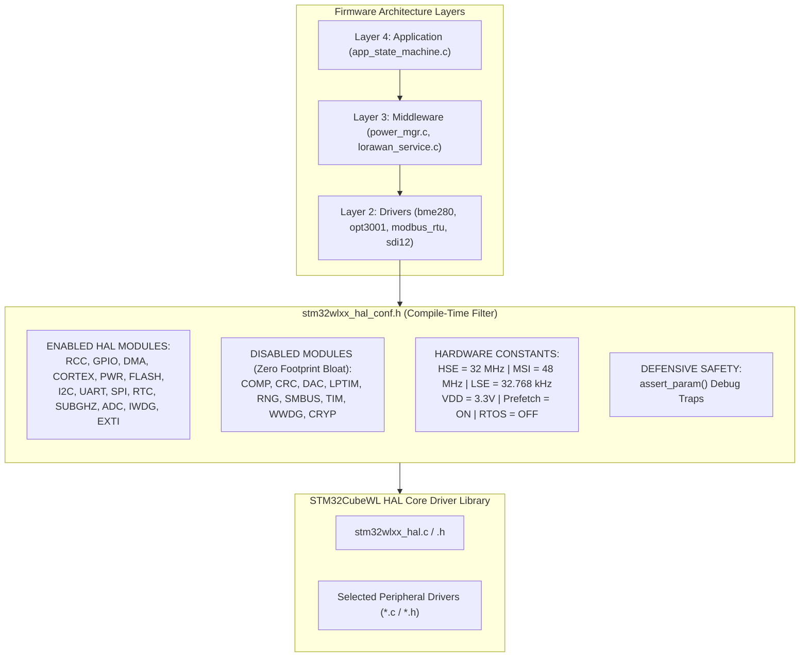

# Task Specification: S3-T1.3 - STM32CubeWL HAL Module Configuration

## 1. Task Metadata & Overview

| Attribute | Specification Details |
| :--- | :--- |
| **Sprint** | **Sprint 3: Core MCU Architecture, BSP & Power Management** |
| **Task ID** | `S3-T1.3` |
| **Parent Task** | `S3-T1: Implement Target Board Configuration & Clock Tree` |
| **Task Title** | Configure STM32CubeWL HAL Module Definitions (`stm32wlxx_hal_conf.h`) |
| **Status** | **Ready for Implementation** |
| **Target Files** | [`firmware/core/inc/stm32wlxx_hal_conf.h`](file:///C:/Users/ENERGY%20SAVER/Documents/Learning/Job%20Projects/rain-predict/firmware/core/inc/stm32wlxx_hal_conf.h) |
| **Related Documents** | [`context/specs/s3-t1.1-gpio-pin-mappings.md`](file:///C:/Users/ENERGY%20SAVER/Documents/Learning/Job%20Projects/rain-predict/context/specs/s3-t1.1-gpio-pin-mappings.md)<br>[`context/specs/s3-t1.2-clock-tree-config.md`](file:///C:/Users/ENERGY%20SAVER/Documents/Learning/Job%20Projects/rain-predict/context/specs/s3-t1.2-clock-tree-config.md)<br>[`docs/hardware/schematics-and-pinout.md`](file:///C:/Users/ENERGY%20SAVER/Documents/Learning/Job%20Projects/rain-predict/docs/hardware/schematics-and-pinout.md)<br>[`docs/architecture/firmware-architecture.md`](file:///C:/Users/ENERGY%20SAVER/Documents/Learning/Job%20Projects/rain-predict/docs/architecture/firmware-architecture.md)<br>[`docs/architecture/power-architecture.md`](file:///C:/Users/ENERGY%20SAVER/Documents/Learning/Job%20Projects/rain-predict/docs/architecture/power-architecture.md)<br>[`context/coding-standards.md`](file:///C:/Users/ENERGY%20SAVER/Documents/Learning/Job%20Projects/rain-predict/context/coding-standards.md)<br>[`context/project-structure.md`](file:///C:/Users/ENERGY%20SAVER/Documents/Learning/Job%20Projects/rain-predict/context/project-structure.md) |
| **Dependencies** | [`S3-T1.1`](file:///C:/Users/ENERGY%20SAVER/Documents/Learning/Job%20Projects/rain-predict/context/specs/s3-t1.1-gpio-pin-mappings.md) (Target Board Pinout), [`S3-T1.2`](file:///C:/Users/ENERGY%20SAVER/Documents/Learning/Job%20Projects/rain-predict/context/specs/s3-t1.2-clock-tree-config.md) (Clock Tree Configuration) |
| **Downstream Tasks** | `S3-T2.1` (I2C Bus Driver), `S3-T2.2` (UART Bus Driver), `S3-T3.1` (Power Rails), `S3-T4` (Low-Power Sleep Manager), `S4-T1` through `S4-T5` (Sensor Drivers), `S5-T4` (LoRaWAN Stack) |

---

## 2. Executive Summary & Architectural Scope

The primary objective of **`S3-T1.3`** is to tailor, optimize, and standardize the STM32CubeWL Hardware Abstraction Layer (HAL) module configuration file ([`firmware/core/inc/stm32wlxx_hal_conf.h`](file:///C:/Users/ENERGY%20SAVER/Documents/Learning/Job%20Projects/rain-predict/firmware/core/inc/stm32wlxx_hal_conf.h)) for the **Tea Plantation Rain Prediction System**.

In bare-metal, ultra-low-power embedded IoT firmware, the HAL configuration header acts as the **central compile-time architectural filter**:
1. **Memory Footprint Optimization**: Enables strictly the hardware peripheral drivers required by the firmware layers, completely stripping unneeded modules from compilation and linking to preserve Flash ($256\text{ KB}$) and SRAM ($64\text{ KB}$).
2. **Oscillator & Physical Parameter Synchronization**: Standardizes high-frequency and low-frequency oscillator values (`HSE_VALUE = 32MHz`, `MSI_VALUE = 48MHz`, `LSE_VALUE = 32.768kHz`, `VDD_VALUE = 3300mV`) matching the physical hardware PCB.
3. **Execution Determinism & Timing**: Configures SysTick interrupt priority, cache acceleration (ICache, DCache, Prefetch), and disables RTOS hooks in favor of deterministic cyclic state machine scheduling.
4. **Defensive Debug Instrumentation**: Configures parameter validation assertions (`USE_FULL_ASSERT`) for compile-time diagnostic safety in debug builds with zero overhead in production release builds.



---

## 3. Module Selection & Configuration Matrix

To enforce strict memory safety and code hygiene, each STM32CubeWL HAL module is explicitly evaluated:

### 3.1 Enabled HAL Modules

| Module Macro Definition | Peripheral Subsystem | Architectural Role in Rain Prediction Station | Target Files / Associated Drivers |
| :--- | :--- | :--- | :--- |
| `#define HAL_MODULE_ENABLED` | HAL Core | Fundamental HAL state management, delays, and ticks. | [`firmware/core/src/main.c`](file:///C:/Users/ENERGY%20SAVER/Documents/Learning/Job%20Projects/rain-predict/firmware/core/src/main.c) |
| `#define HAL_RCC_MODULE_ENABLED` | Reset & Clock Control | MSI $48\text{ MHz}$, LSE $32.768\text{ kHz}$, and HSE $32\text{ MHz}$ clock tree setup. | [`firmware/core/src/system_clock.c`](file:///C:/Users/ENERGY%20SAVER/Documents/Learning/Job%20Projects/rain-predict/firmware/core/src/system_clock.c) |
| `#define HAL_GPIO_MODULE_ENABLED` | General Purpose I/O | Switched power rail gate (`PA4`), LEDs, Buzzer, Siren relay, and pin muxing. | [`firmware/core/src/board_config.c`](file:///C:/Users/ENERGY%20SAVER/Documents/Learning/Job%20Projects/rain-predict/firmware/core/src/board_config.c) |
| `#define HAL_DMA_MODULE_ENABLED` | Direct Memory Access | Non-blocking UART RX/TX transfers and SPI flash page logging. | [`firmware/drivers/src/uart_bus.c`](file:///C:/Users/ENERGY%20SAVER/Documents/Learning/Job%20Projects/rain-predict/firmware/drivers/src/uart_bus.c) |
| `#define HAL_CORTEX_MODULE_ENABLED` | Cortex-M4 Core / NVIC | NVIC interrupt priorities, SysTick timer, and MPU memory protection. | Core hardware initialization. |
| `#define HAL_PWR_MODULE_ENABLED` | Power & Low-Power Modes | Voltage Scaling Range 1 ($1.2\text{V}$) and Stop 2 deep sleep entry/exit. | [`firmware/middleware/src/power_mgr.c`](file:///C:/Users/ENERGY%20SAVER/Documents/Learning/Job%20Projects/rain-predict/firmware/middleware/src/power_mgr.c) |
| `#define HAL_FLASH_MODULE_ENABLED` | Flash Memory Controller | Flash latency (2 wait states), prefetch buffer, cache, and NVM ring storage. | [`firmware/middleware/src/flash_storage.c`](file:///C:/Users/ENERGY%20SAVER/Documents/Learning/Job%20Projects/rain-predict/firmware/middleware/src/flash_storage.c) |
| `#define HAL_I2C_MODULE_ENABLED` | I2C Bus Controller | Fast-mode $400\text{ kHz}$ interface to Bosch BME280 and TI OPT3001 sensors. | [`firmware/drivers/src/i2c_bus.c`](file:///C:/Users/ENERGY%20SAVER/Documents/Learning/Job%20Projects/rain-predict/firmware/drivers/src/i2c_bus.c) |
| `#define HAL_UART_MODULE_ENABLED` | USART / LPUART Controller | Half-duplex RS-485 Modbus RTU (`USART1`) and SDI-12 auxiliary bus (`LPUART1`). | [`firmware/drivers/src/uart_bus.c`](file:///C:/Users/ENERGY%20SAVER/Documents/Learning/Job%20Projects/rain-predict/firmware/drivers/src/uart_bus.c) |
| `#define HAL_SPI_MODULE_ENABLED` | SPI Bus Controller | High-speed SPI1 for external Flash memory / expansion logging. | External SPI peripheral driver. |
| `#define HAL_RTC_MODULE_ENABLED` | Real-Time Clock | Low-power calendar, sub-second timestamping, and Stop 2 periodic wake timer. | [`firmware/app/src/measurement_scheduler.c`](file:///C:/Users/ENERGY%20SAVER/Documents/Learning/Job%20Projects/rain-predict/firmware/app/src/measurement_scheduler.c) |
| `#define HAL_SUBGHZ_MODULE_ENABLED`| Sub-GHz LoRa Radio | Integrated Sub-GHz radio PHY for long-range telemetry transmission. | [`firmware/middleware/src/lorawan_service.c`](file:///C:/Users/ENERGY%20SAVER/Documents/Learning/Job%20Projects/rain-predict/firmware/middleware/src/lorawan_service.c) |
| `#define HAL_ADC_MODULE_ENABLED` | Analog-to-Digital Converter | 12-bit ADC sampling of battery voltage ($V_{\text{bat}}$) and solar rail. | [`firmware/middleware/src/power_mgr.c`](file:///C:/Users/ENERGY%20SAVER/Documents/Learning/Job%20Projects/rain-predict/firmware/middleware/src/power_mgr.c) |
| `#define HAL_IWDG_MODULE_ENABLED` | Independent Watchdog | $8.0\text{ s}$ hardware watchdog supervisor clocked by internal $32\text{ kHz}$ LSI. | [`firmware/core/src/main.c`](file:///C:/Users/ENERGY%20SAVER/Documents/Learning/Job%20Projects/rain-predict/firmware/core/src/main.c) |
| `#define HAL_EXTI_MODULE_ENABLED` | External Interrupts | Falling-edge pulse capture from tipping-bucket rain gauge (`PA0` / EXTI0). | [`firmware/drivers/src/rain_gauge_driver.c`](file:///C:/Users/ENERGY%20SAVER/Documents/Learning/Job%20Projects/rain-predict/firmware/drivers/src/rain_gauge_driver.c) |

---

### 3.2 Disabled HAL Modules (Excluded from Compilation)

The following modules are commented out to eliminate dead code and guarantee zero footprint overhead:

| Module Macro (Disabled) | Subsystem | Rationale for Exclusion |
| :--- | :--- | :--- |
| `HAL_COMP_MODULE_ENABLED` | Analog Comparators | External analog comparators not required; ADC handles voltage thresholding. |
| `HAL_CRC_MODULE_ENABLED` | Hardware CRC | Modbus RTU CRC-16 uses verified table-driven software implementation. |
| `HAL_CRYP_MODULE_ENABLED` | Crypto Accelerator | LoRaWAN AES-128 crypto managed directly by Sub-GHz radio / LoRa stack. |
| `HAL_DAC_MODULE_ENABLED` | Digital-to-Analog | No analog waveform output required on station node. |
| `HAL_GTZC_MODULE_ENABLED` | TrustZone Controller | Target STM32WLE5CC is single-core Cortex-M4 without TrustZone. |
| `HAL_HSEM_MODULE_ENABLED` | Hardware Semaphore | Dual-core synchronization not applicable (STM32WLE5 is single core). |
| `HAL_IPCC_MODULE_ENABLED` | Inter-Processor Comm | Inter-processor mailbox not applicable for single-core STM32WLE5. |
| `HAL_IRDA_MODULE_ENABLED` | IrDA Transceiver | Infrared communication not utilized. |
| `HAL_LPTIM_MODULE_ENABLED`| Low-Power Timers | RTC Wakeup Timer fulfills all low-power wake requirements. |
| `HAL_RNG_MODULE_ENABLED` | Random Number Gen | Radio stack utilizes Sub-GHz RSSI noise entropy for OTAA dev nonce. |
| `HAL_SMARTCARD_MODULE_ENABLED` | SmartCard Interface | ISO/IEC 7816 smartcards not utilized. |
| `HAL_SMBUS_MODULE_ENABLED`| System Management Bus| Standard I2C is utilized for sensor communications. |
| `HAL_TIM_MODULE_ENABLED` | General Purpose Timers| Periodic scheduling driven by RTC and SysTick; hardware timers unused. |
| `HAL_WWDG_MODULE_ENABLED` | Window Watchdog | Independent Watchdog (IWDG) selected for standalone safety. |

---

## 4. Hardware Parameter & Timing Constants Specification

The configuration file must define exact electrical and oscillator parameters matching [`docs/hardware/schematics-and-pinout.md`](file:///C:/Users/ENERGY%20SAVER/Documents/Learning/Job%20Projects/rain-predict/docs/hardware/schematics-and-pinout.md):

```c
/* ============================================================================
 * Oscillator Frequency Values & Start-Up Timeouts
 * ============================================================================ */

#define HSE_VALUE               32000000UL  /*!< High-Speed External TCXO frequency in Hz */
#define HSE_STARTUP_TIMEOUT     100U        /*!< Timeout for HSE start up, in ms */

#define MSI_VALUE               48000000UL  /*!< Multi-Speed Internal RC frequency in Hz */

#define HSI_VALUE               16000000UL  /*!< High-Speed Internal RC frequency in Hz */

#define LSE_VALUE               32768UL     /*!< Low-Speed External Quartz frequency in Hz */
#define LSE_STARTUP_TIMEOUT     5000U       /*!< Timeout for LSE start up, in ms */

#define LSI_VALUE               32000UL     /*!< Low-Speed Internal RC frequency in Hz */

#define VDD_VALUE               3300UL      /*!< VDD supply voltage in mV (3.3V DC rail) */

/* ============================================================================
 * System Architecture & Driver Behavior Configuration
 * ============================================================================ */

#define TICK_INT_PRIORITY       0x00U       /*!< SysTick interrupt priority (0 = Highest) */
#define USE_RTOS                0U          /*!< Bare-metal deterministic execution (No RTOS) */
#define PREFETCH_ENABLE         1U          /*!< Enable Flash Prefetch buffer */
#define INSTRUCTION_CACHE_ENABLE 1U         /*!< Enable Cortex-M4 Instruction Cache */
#define DATA_CACHE_ENABLE       1U          /*!< Enable Cortex-M4 Data Cache */
```

---

## 5. Defensive Parameter Assertions (`USE_FULL_ASSERT`)

In accordance with [`context/coding-standards.md`](file:///C:/Users/ENERGY%20SAVER/Documents/Learning/Job%20Projects/rain-predict/context/coding-standards.md):
- When compiling with `-DDEBUG` or `USE_FULL_ASSERT = 1`, all HAL function parameters are verified using the `assert_param()` macro.
- If a parameter assertion fails, the macro routes to `assert_failed(uint8_t *file, uint32_t line)`, preventing undefined peripheral behavior or register corruption.
- In production Release builds (`-DNDEBUG`), `assert_param()` expands to `((void)0U)` to ensure zero CPU cycle penalty.

---

## 6. Concrete File Implementation Blueprint

### 6.1 `firmware/core/inc/stm32wlxx_hal_conf.h` Blueprint

```c
/**
 * @file    stm32wlxx_hal_conf.h
 * @brief   STM32CubeWL HAL module configuration for Tea Plantation Rain Prediction Station.
 * @details Tailored compile-time filter enabling strictly required peripheral modules,
 *          accurate oscillator constants, cache parameters, and defensive assert hooks.
 */

#ifndef STM32WLXX_HAL_CONF_H
#define STM32WLXX_HAL_CONF_H

#ifdef __cplusplus
extern "C" {
#endif

/* ============================================================================
 * 1. Module Selection (Enabled HAL Modules)
 * ============================================================================ */

#define HAL_MODULE_ENABLED
#define HAL_ADC_MODULE_ENABLED
#define HAL_CORTEX_MODULE_ENABLED
#define HAL_DMA_MODULE_ENABLED
#define HAL_EXTI_MODULE_ENABLED
#define HAL_FLASH_MODULE_ENABLED
#define HAL_GPIO_MODULE_ENABLED
#define HAL_I2C_MODULE_ENABLED
#define HAL_IWDG_MODULE_ENABLED
#define HAL_PWR_MODULE_ENABLED
#define HAL_RCC_MODULE_ENABLED
#define HAL_RTC_MODULE_ENABLED
#define HAL_SPI_MODULE_ENABLED
#define HAL_SUBGHZ_MODULE_ENABLED
#define HAL_UART_MODULE_ENABLED

/* Disabled Modules: COMP, CRC, CRYP, DAC, GTZC, HSEM, IPCC, IRDA, LPTIM, RNG, SMARTCARD, SMBUS, TIM, WWDG */

/* ============================================================================
 * 2. Hardware Oscillator & Voltage Parameter Definitions
 * ============================================================================ */

#if !defined(HSE_VALUE)
#define HSE_VALUE               32000000UL  /*!< Frequency of the High-Speed External TCXO in Hz */
#endif

#if !defined(HSE_STARTUP_TIMEOUT)
#define HSE_STARTUP_TIMEOUT     100U        /*!< Timeout for HSE start up, in ms */
#endif

#if !defined(MSI_VALUE)
#define MSI_VALUE               48000000UL  /*!< Frequency of the Multi-Speed Internal RC in Hz */
#endif

#if !defined(HSI_VALUE)
#define HSI_VALUE               16000000UL  /*!< Frequency of the High-Speed Internal RC in Hz */
#endif

#if !defined(LSE_VALUE)
#define LSE_VALUE               32768UL     /*!< Frequency of the Low-Speed External Quartz in Hz */
#endif

#if !defined(LSE_STARTUP_TIMEOUT)
#define LSE_STARTUP_TIMEOUT     5000U       /*!< Timeout for LSE start up, in ms */
#endif

#if !defined(LSI_VALUE)
#define LSI_VALUE               32000UL     /*!< Frequency of the Low-Speed Internal RC in Hz */
#endif

#if !defined(VDD_VALUE)
#define VDD_VALUE               3300UL      /*!< VDD value in mV */
#endif

#if !defined(TICK_INT_PRIORITY)
#define TICK_INT_PRIORITY       0x00U       /*!< SysTick interrupt priority (0 = Highest) */
#endif

#if !defined(USE_RTOS)
#define USE_RTOS                0U          /*!< Bare-metal deterministic execution */
#endif

#if !defined(PREFETCH_ENABLE)
#define PREFETCH_ENABLE         1U          /*!< Flash prefetch buffer enabled */
#endif

#if !defined(INSTRUCTION_CACHE_ENABLE)
#define INSTRUCTION_CACHE_ENABLE 1U         /*!< Instruction cache enabled */
#endif

#if !defined(DATA_CACHE_ENABLE)
#define DATA_CACHE_ENABLE       1U          /*!< Data cache enabled */
#endif

/* ============================================================================
 * 3. Defensive Parameter Assertion Configuration
 * ============================================================================ */

#ifdef DEBUG
  #define USE_FULL_ASSERT       1U
#else
  #define USE_FULL_ASSERT       0U
#endif

#if (USE_FULL_ASSERT == 1U)
  /**
   * @brief  The assert_param macro is used for function parameter validation.
   * @param  expr If expr is false, calls assert_failed function with source file and line.
   */
  #define assert_param(expr) ((expr) ? (void)0U : assert_failed((uint8_t *)__FILE__, __LINE__))
  void assert_failed(uint8_t *file, uint32_t line);
#else
  #define assert_param(expr) ((void)0U)
#endif

/* ============================================================================
 * 4. Active HAL Module Header Inclusions
 * ============================================================================ */

#if defined(STM32WLE5xx) || defined(USE_HAL_DRIVER)

#ifdef HAL_RCC_MODULE_ENABLED
  #include "stm32wlxx_hal_rcc.h"
  #include "stm32wlxx_hal_rcc_ex.h"
#endif

#ifdef HAL_GPIO_MODULE_ENABLED
  #include "stm32wlxx_hal_gpio.h"
#endif

#ifdef HAL_DMA_MODULE_ENABLED
  #include "stm32wlxx_hal_dma.h"
#endif

#ifdef HAL_CORTEX_MODULE_ENABLED
  #include "stm32wlxx_hal_cortex.h"
#endif

#ifdef HAL_ADC_MODULE_ENABLED
  #include "stm32wlxx_hal_adc.h"
  #include "stm32wlxx_hal_adc_ex.h"
#endif

#ifdef HAL_EXTI_MODULE_ENABLED
  #include "stm32wlxx_hal_exti.h"
#endif

#ifdef HAL_FLASH_MODULE_ENABLED
  #include "stm32wlxx_hal_flash.h"
  #include "stm32wlxx_hal_flash_ex.h"
#endif

#ifdef HAL_I2C_MODULE_ENABLED
  #include "stm32wlxx_hal_i2c.h"
  #include "stm32wlxx_hal_i2c_ex.h"
#endif

#ifdef HAL_IWDG_MODULE_ENABLED
  #include "stm32wlxx_hal_iwdg.h"
#endif

#ifdef HAL_PWR_MODULE_ENABLED
  #include "stm32wlxx_hal_pwr.h"
  #include "stm32wlxx_hal_pwr_ex.h"
#endif

#ifdef HAL_RTC_MODULE_ENABLED
  #include "stm32wlxx_hal_rtc.h"
  #include "stm32wlxx_hal_rtc_ex.h"
#endif

#ifdef HAL_SPI_MODULE_ENABLED
  #include "stm32wlxx_hal_spi.h"
#endif

#ifdef HAL_SUBGHZ_MODULE_ENABLED
  #include "stm32wlxx_hal_subghz.h"
#endif

#ifdef HAL_UART_MODULE_ENABLED
  #include "stm32wlxx_hal_uart.h"
  #include "stm32wlxx_hal_uart_ex.h"
#endif

#endif /* STM32WLE5xx || USE_HAL_DRIVER */

#ifdef __cplusplus
}
#endif

#endif /* STM32WLXX_HAL_CONF_H */
```

---

## 7. Verification & Acceptance Test Plan

To verify the successful completion of **`S3-T1.3`**, the following test cases must be validated:

### 7.1 Verification Test Cases

| Test Case ID | Verification Action | Expected Outcome | Pass/Fail Criteria |
| :--- | :--- | :--- | :--- |
| **TC-S3-T1.3-01** | Header Inclusion & C99 Compilation | Include `stm32wlxx_hal_conf.h` in firmware build tree with strict flags. | 100% warning-free compilation under `-Wall -Wextra -Wpedantic -Werror`. |
| **TC-S3-T1.3-02** | Hardware Constant Validation | Verify values of `HSE_VALUE` ($32\text{ MHz}$), `MSI_VALUE` ($48\text{ MHz}$), `LSE_VALUE` ($32.768\text{ kHz}$), and `VDD_VALUE` ($3.3\text{V}$). | All oscillator constants exactly match hardware schematics and clock tree specifications. |
| **TC-S3-T1.3-03** | Enabled Module Completeness | Verify that RCC, GPIO, DMA, PWR, FLASH, I2C, UART, SPI, RTC, SUBGHZ, ADC, IWDG, and EXTI modules are enabled. | All required driver header files resolve without unresolved symbol errors. |
| **TC-S3-T1.3-04** | Unused Module Stripping | Verify that disabled modules (TIM, DAC, COMP, CRC, RNG, WWDG, CRYP) are excluded. | Zero dead-code footprint overhead linked into `.elf` artifact. |
| **TC-S3-T1.3-05** | Cache & Prefetch Settings | Verify `PREFETCH_ENABLE = 1`, `INSTRUCTION_CACHE_ENABLE = 1`, `DATA_CACHE_ENABLE = 1`. | Cache definitions enabled for maximum instruction throughput. |
| **TC-S3-T1.3-06** | Assert Hook Operational in Debug | Build with `DEBUG` defined -> trigger `assert_param(0)`. | Handler safely branches to `assert_failed()` with correct file and line number. |
| **TC-S3-T1.3-07** | Zero Overhead in Release Builds | Build with `NDEBUG` defined -> inspect assembly. | `assert_param()` completely omitted with zero binary footprint penalty. |
| **TC-S3-T1.3-08** | SysTick Priority Assignment | Inspect `TICK_INT_PRIORITY` value. | Set to `0x00U` (highest priority) for deterministic delay accounting. |

---

## 8. Definition of Done (DoD) Checklist

- [ ] [`firmware/core/inc/stm32wlxx_hal_conf.h`](file:///C:/Users/ENERGY%20SAVER/Documents/Learning/Job%20Projects/rain-predict/firmware/core/inc/stm32wlxx_hal_conf.h) created adhering to C99 standards with complete Doxygen documentation.
- [ ] Required peripheral HAL modules (RCC, GPIO, DMA, PWR, FLASH, I2C, UART, SPI, RTC, SUBGHZ, ADC, IWDG, EXTI) explicitly enabled.
- [ ] Unused modules (TIM, DAC, COMP, CRC, RNG, WWDG, CRYP) disabled to eliminate dead-code bloat.
- [ ] Oscillator constants synchronized (`HSE = 32MHz`, `MSI = 48MHz`, `LSE = 32.768kHz`, `VDD = 3300mV`).
- [ ] Prefetch, Instruction Cache, and Data Cache enabled.
- [ ] Defensive `assert_param()` macro and `assert_failed()` handler configured.
- [ ] Spec document registered and linked under [`context/specs/spec-roadmap.md`](file:///C:/Users/ENERGY%20SAVER/Documents/Learning/Job%20Projects/rain-predict/context/specs/spec-roadmap.md#L200).
