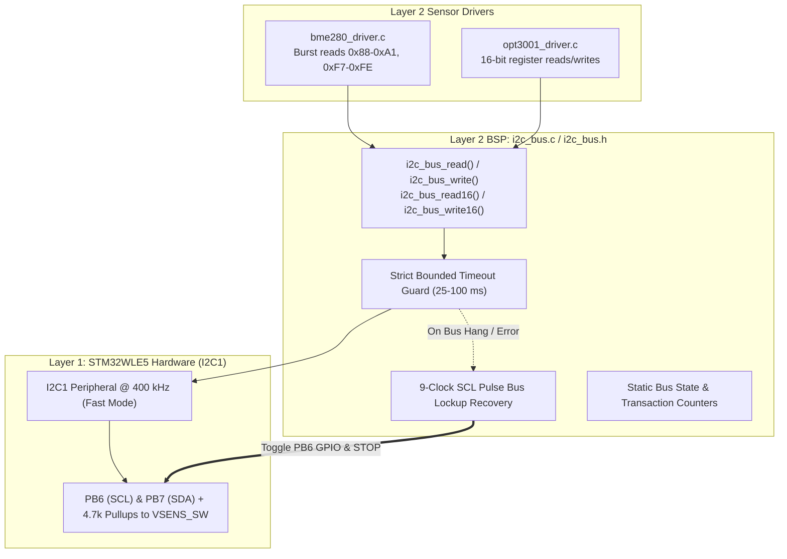
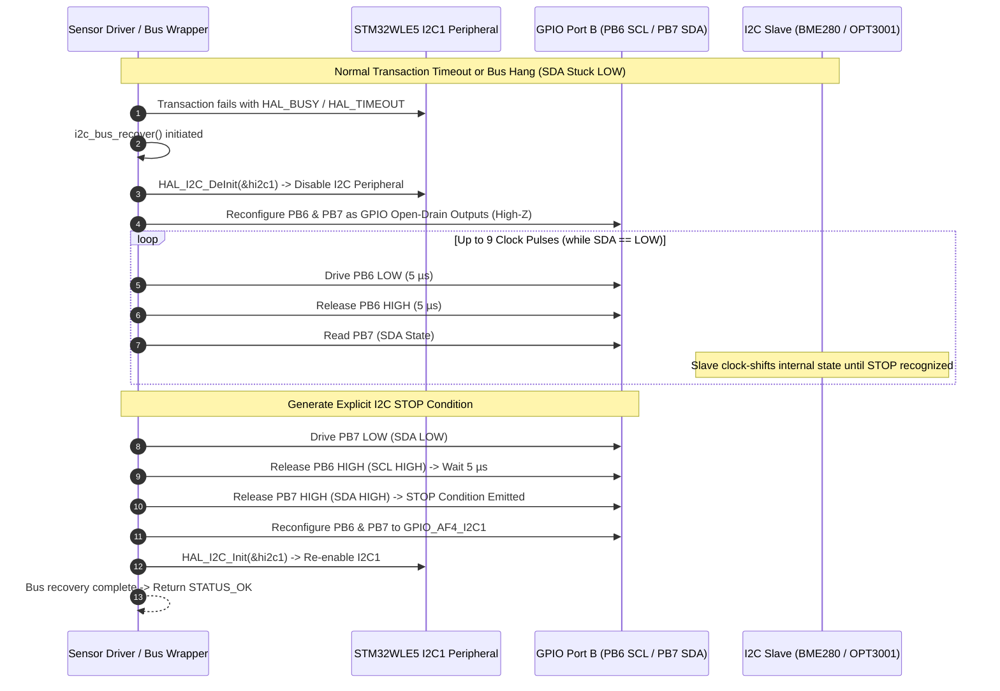

# Task Specification: S3-T2.1 - Non-Blocking I2C Bus Driver & Lockup Recovery

## 1. Task Metadata & Overview

| Attribute | Specification Details |
| :--- | :--- |
| **Sprint** | **Sprint 3: Core MCU Architecture, BSP & Power Management** |
| **Task ID** | `S3-T2.1` |
| **Parent Task** | `S3-T2: Implement Bounded Non-Blocking Bus Wrappers` |
| **Task Title** | Implement Bounded Non-Blocking I2C Bus Driver with 9-Clock Pulse Lockup Recovery |
| **Status** | **Ready for Implementation** |
| **Target Files** | [`firmware/drivers/inc/i2c_bus.h`](file:///C:/Users/ENERGY%20SAVER/Documents/Learning/Job%20Projects/rain-predict/firmware/drivers/inc/i2c_bus.h)<br>[`firmware/drivers/src/i2c_bus.c`](file:///C:/Users/ENERGY%20SAVER/Documents/Learning/Job%20Projects/rain-predict/firmware/drivers/src/i2c_bus.c) |
| **Related Documents** | [`docs/sensors/bme280-integration.md`](file:///C:/Users/ENERGY%20SAVER/Documents/Learning/Job%20Projects/rain-predict/docs/sensors/bme280-integration.md)<br>[`docs/sensors/opt3001-solar-irradiance.md`](file:///C:/Users/ENERGY%20SAVER/Documents/Learning/Job%20Projects/rain-predict/docs/sensors/opt3001-solar-irradiance.md)<br>[`docs/hardware/schematics-and-pinout.md`](file:///C:/Users/ENERGY%20SAVER/Documents/Learning/Job%20Projects/rain-predict/docs/hardware/schematics-and-pinout.md)<br>[`docs/architecture/firmware-architecture.md`](file:///C:/Users/ENERGY%20SAVER/Documents/Learning/Job%20Projects/rain-predict/docs/architecture/firmware-architecture.md)<br>[`context/specs/s1-t2.2-mock-i2c-bus.md`](file:///C:/Users/ENERGY%20SAVER/Documents/Learning/Job%20Projects/rain-predict/context/specs/s1-t2.2-mock-i2c-bus.md)<br>[`context/coding-standards.md`](file:///C:/Users/ENERGY%20SAVER/Documents/Learning/Job%20Projects/rain-predict/context/coding-standards.md) |
| **Dependencies** | [`S3-T1.1`](file:///C:/Users/ENERGY%20SAVER/Documents/Learning/Job%20Projects/rain-predict/context/specs/s3-t1.1-gpio-pin-mappings.md) (Board Pinout), [`S3-T1.2`](file:///C:/Users/ENERGY%20SAVER/Documents/Learning/Job%20Projects/rain-predict/context/specs/s3-t1.2-clock-tree-config.md) (Clock Tree), [`S3-T1.3`](file:///C:/Users/ENERGY%20SAVER/Documents/Learning/Job%20Projects/rain-predict/context/specs/s3-t1.3-hal-module-config.md) (HAL Conf) |
| **Downstream Tasks** | `S4-T1` (Bosch BME280 Driver), `S4-T2` (TI OPT3001 Driver), `S6-T3` (Application State Machine Sensor Sampling) |

---

## 2. Executive Summary & Architectural Scope

The primary objective of **`S3-T2.1`** is to develop a production-grade, bounded, non-blocking I2C bus hardware abstraction wrapper ([`firmware/drivers/inc/i2c_bus.h`](file:///C:/Users/ENERGY%20SAVER/Documents/Learning/Job%20Projects/rain-predict/firmware/drivers/inc/i2c_bus.h) and [`firmware/drivers/src/i2c_bus.c`](file:///C:/Users/ENERGY%20SAVER/Documents/Learning/Job%20Projects/rain-predict/firmware/drivers/src/i2c_bus.c)) targeting the **STMicroelectronics STM32WLE5** SoC.

The meteorological sensing payload relies on I2C1 (`PB6` SCL, `PB7` SDA) to communicate with:
1. **Bosch BME280**: High-precision Barometric Pressure ($300–1100\text{ hPa}$), Temperature ($-40^\circ\text{C}–+85^\circ\text{C}$), and Relative Humidity ($0–100\%$) at 7-bit slave address `0x76` (or `0x77`).
2. **TI OPT3001**: Ambient Light & Solar Irradiance ($0.01–83,000\text{ Lux}$) at 7-bit slave address `0x44` (or `0x45`).
3. **NXP PCA9615**: Differential I2C physical layer bridge across shielded field cables.



### Critical Field Resilience Mandates:

1. **Hardware Bus Lockup Recovery (9-Clock SCL Pulse Cycling)**:
   - In outdoor agricultural deployments, voltage fluctuations, ESD events, or slave resets during a read cycle can leave an I2C slave holding SDA clamped LOW, permanently deadlocking the hardware I2C peripheral.
   - If SDA is detected LOW or a transaction times out, the driver temporarily switches `PB6/PB7` to General-Purpose Open-Drain outputs, generates up to 9 clock pulses on SCL ($100\text{ kHz}$), issues an explicit I2C **STOP condition**, and re-initializes the I2C1 peripheral.
2. **Deterministic Bounded Timeouts**:
   - Every peripheral transfer enforces a hardware/software timeout ($25\text{–}100\text{ms}$).
   - **Zero MCU Deadlock**: Detached sensor cables, damaged ICs, or NACKs must immediately return a structured status code (`STATUS_ERR_TIMEOUT`, `STATUS_ERR_I2C_BUS`, or `STATUS_ERR_SENSOR_NO_RESPONSE`) without blocking the application state machine or causing watchdog trips.
3. **Multi-Byte Burst & Word Support**:
   - Supports contiguous multi-byte burst reading (for BME280 24-byte calibration vectors and 8-byte data bursts).
   - Provides native 16-bit big-endian word helper APIs (`i2c_bus_read16`, `i2c_bus_write16`) for TI OPT3001 registers.
4. **Zero Dynamic Memory Allocation**:
   - All driver handles and state structures are statically allocated at compile time.

---

## 3. Bus Electrical & Timing Specifications

In accordance with [`docs/hardware/schematics-and-pinout.md`](file:///C:/Users/ENERGY%20SAVER/Documents/Learning/Job%20Projects/rain-predict/docs/hardware/schematics-and-pinout.md):

### 3.1 Electrical Interface & Pin Mapping

| Signal | MCU Pin | Pin Mode | Alternate Function | External Pull-Up | Target Devices |
| :--- | :---: | :---: | :---: | :---: | :--- |
| **I2C1_SCL** | `PB6` | Open-Drain | `GPIO_AF4_I2C1` | $4.7\,\text{k}\Omega$ to `VSENS_SW` | BME280, OPT3001, PCA9615 |
| **I2C1_SDA** | `PB7` | Open-Drain | `GPIO_AF4_I2C1` | $4.7\,\text{k}\Omega$ to `VSENS_SW` | BME280, OPT3001, PCA9615 |

### 3.2 Bus Speed & Timing Parameters

| Parameter | Standard Mode | Fast Mode (Default) | Units |
| :--- | :---: | :---: | :---: |
| **Bus Frequency ($f_{\text{SCL}}$)** | $100$ | **$400$** | $\text{kHz}$ |
| **Peripheral Clock Source** | `PCLK1` ($48\text{ MHz}$) | `PCLK1` ($48\text{ MHz}$) | — |
| **Rise Time ($t_r$)** | $1000$ | $300$ | $\text{ns}$ |
| **Fall Time ($t_f$)** | $300$ | $300$ | $\text{ns}$ |
| **Analog Noise Filter** | Enabled | Enabled | — |
| **Digital Noise Filter** | 0 | 0 | cycles |
| **Default Transaction Timeout** | $50$ | **$25$** | $\text{ms}$ |
| **Max Slave Probe Timeout** | $100$ | **$50$** | $\text{ms}$ |

---

## 4. Bus Lockup Recovery Algorithm Specification



### Step-by-Step Bus Recovery Procedure:
1. De-initialize the `I2C1` peripheral using `HAL_I2C_DeInit()`.
2. Configure `PB6` (SCL) and `PB7` (SDA) as Open-Drain GPIO outputs with no pull-up resistors.
3. Read `PB7` (SDA):
   - If SDA is HIGH, the bus is already free.
   - If SDA is LOW, cycle `PB6` (SCL) LOW and HIGH up to 9 times with $5\,\mu\text{s}$ half-period ($100\text{ kHz}$) delays.
   - Check SDA after each rising edge. If SDA goes HIGH, the hung slave has released the bus.
4. Generate an I2C **STOP condition**:
   - Drive SDA LOW while SCL is LOW.
   - Release SCL HIGH.
   - Wait $5\,\mu\text{s}$.
   - Release SDA HIGH while SCL remains HIGH.
5. Reconfigure `PB6/PB7` back to Alternate Function `GPIO_AF4_I2C1`.
6. Re-initialize `I2C1` with original timing registers.

---

## 5. Public API Specification (`i2c_bus.h`)

| Function Prototype | Description |
| :--- | :--- |
| `status_t i2c_bus_init(uint32_t speed_hz)` | Initializes STM32WLE5 I2C1 hardware peripheral at specified clock speed ($100\text{ kHz}$ or $400\text{ kHz}$). |
| `status_t i2c_bus_deinit(void)` | De-initializes I2C1 peripheral and disables clock gating before low-power sleep. |
| `status_t i2c_bus_read(uint8_t dev_addr, uint8_t reg_addr, uint8_t *p_data, uint16_t length, uint32_t timeout_ms)` | Reads multi-byte contiguous buffer from slave device register with bounded timeout. |
| `status_t i2c_bus_write(uint8_t dev_addr, uint8_t reg_addr, const uint8_t *p_data, uint16_t length, uint32_t timeout_ms)` | Writes multi-byte buffer to slave device register with bounded timeout. |
| `status_t i2c_bus_read16(uint8_t dev_addr, uint8_t reg_addr, uint16_t *p_value, uint32_t timeout_ms)` | Reads a 16-bit big-endian word from slave register and converts to host endianness. |
| `status_t i2c_bus_write16(uint8_t dev_addr, uint8_t reg_addr, uint16_t value, uint32_t timeout_ms)` | Writes a 16-bit word to slave register in big-endian byte order. |
| `status_t i2c_bus_is_device_ready(uint8_t dev_addr, uint32_t trials, uint32_t timeout_ms)` | Probes target slave address to confirm presence and readiness. |
| `status_t i2c_bus_recover(void)` | Executes 9-clock SCL pulse recovery sequence to release stuck I2C slave devices. |
| `bool i2c_bus_is_busy(void)` | Returns `true` if I2C bus transaction is currently in progress. |

---

## 6. Concrete File Implementation Blueprint

### 6.1 `firmware/drivers/inc/i2c_bus.h` Blueprint

```c
/**
 * @file    i2c_bus.h
 * @brief   Non-blocking bounded I2C bus driver with 9-clock lockup recovery for STM32WLE5.
 * @details Layer 2 Hardware Abstraction wrapper for Bosch BME280 and TI OPT3001 sensors.
 */

#ifndef I2C_BUS_H
#define I2C_BUS_H

#ifdef __cplusplus
extern "C" {
#endif

#include <stdint.h>
#include <stdbool.h>
#include <stddef.h>

#include "board_config.h"

/* ============================================================================
 * Standard I2C Bus Constants
 * ============================================================================ */

#define I2C_BUS_SPEED_STANDARD_HZ       100000UL    /**< 100 kHz Standard Mode */
#define I2C_BUS_SPEED_FAST_HZ           400000UL    /**< 400 kHz Fast Mode */

#define I2C_BUS_DEFAULT_TIMEOUT_MS      25U         /**< Default transaction timeout in ms */
#define I2C_BUS_PROBE_TIMEOUT_MS        50U         /**< Slave readiness probe timeout in ms */
#define I2C_BUS_MAX_RECOVERY_CLOCKS     9U          /**< Maximum recovery pulses */

/* ============================================================================
 * Public Driver API Prototypes
 * ============================================================================ */

/**
 * @brief  Initializes the hardware I2C1 bus peripheral.
 * @param[in] speed_hz Bus clock frequency (I2C_BUS_SPEED_STANDARD_HZ or I2C_BUS_SPEED_FAST_HZ).
 * @return status_t    STATUS_OK on success, error code otherwise.
 */
status_t i2c_bus_init(uint32_t speed_hz);

/**
 * @brief  De-initializes the I2C1 bus peripheral prior to low-power Stop 2 sleep.
 * @return status_t STATUS_OK on success.
 */
status_t i2c_bus_deinit(void);

/**
 * @brief  Reads a contiguous multi-byte sequence from a target slave device register.
 * @param[in]  dev_addr   7-bit I2C slave device address (e.g., 0x76 or 0x44).
 * @param[in]  reg_addr   8-bit starting register address.
 * @param[out] p_data     Pointer to destination byte buffer.
 * @param[in]  length     Number of bytes to read.
 * @param[in]  timeout_ms Maximum transaction timeout in milliseconds.
 * @return status_t       STATUS_OK on success, error code on timeout/NACK.
 */
status_t i2c_bus_read(uint8_t dev_addr, uint8_t reg_addr, uint8_t *p_data, uint16_t length, uint32_t timeout_ms);

/**
 * @brief  Writes a contiguous multi-byte sequence to a target slave device register.
 * @param[in] dev_addr   7-bit I2C slave device address.
 * @param[in] reg_addr   8-bit starting register address.
 * @param[in] p_data     Pointer to data buffer to transmit.
 * @param[in] length     Number of bytes to write.
 * @param[in] timeout_ms Maximum transaction timeout in milliseconds.
 * @return status_t      STATUS_OK on success, error code on timeout/NACK.
 */
status_t i2c_bus_write(uint8_t dev_addr, uint8_t reg_addr, const uint8_t *p_data, uint16_t length, uint32_t timeout_ms);

/**
 * @brief  Reads a 16-bit big-endian register word from target device.
 * @param[in]  dev_addr   7-bit I2C slave device address.
 * @param[in]  reg_addr   8-bit register address.
 * @param[out] p_value    Pointer to store 16-bit word (converted to host endianness).
 * @param[in]  timeout_ms Maximum transaction timeout in milliseconds.
 * @return status_t       STATUS_OK on success, error code on failure.
 */
status_t i2c_bus_read16(uint8_t dev_addr, uint8_t reg_addr, uint16_t *p_value, uint32_t timeout_ms);

/**
 * @brief  Writes a 16-bit word to target device in big-endian byte order.
 * @param[in] dev_addr   7-bit I2C slave device address.
 * @param[in] reg_addr   8-bit register address.
 * @param[in] value      16-bit word to transmit.
 * @param[in] timeout_ms Maximum transaction timeout in milliseconds.
 * @return status_t      STATUS_OK on success, error code on failure.
 */
status_t i2c_bus_write16(uint8_t dev_addr, uint8_t reg_addr, uint16_t value, uint32_t timeout_ms);

/**
 * @brief  Probes target device address to verify ACK readiness.
 * @param[in] dev_addr   7-bit I2C slave address.
 * @param[in] trials     Number of probe attempts.
 * @param[in] timeout_ms Timeout per probe trial in ms.
 * @return status_t      STATUS_OK if device responds with ACK, error otherwise.
 */
status_t i2c_bus_is_device_ready(uint8_t dev_addr, uint32_t trials, uint32_t timeout_ms);

/**
 * @brief  Executes a 9-clock SCL pulse cycling sequence to clear stuck I2C slave devices.
 * @return status_t STATUS_OK if bus was successfully recovered.
 */
status_t i2c_bus_recover(void);

/**
 * @brief  Checks whether the I2C peripheral is actively performing a transfer.
 * @return bool true if bus is busy.
 */
bool i2c_bus_is_busy(void);

#ifdef __cplusplus
}
#endif

#endif /* I2C_BUS_H */
```

---

### 6.2 `firmware/drivers/src/i2c_bus.c` Reference Blueprint

```c
/**
 * @file    i2c_bus.c
 * @brief   Implementation of Bounded Non-Blocking I2C Driver with Lockup Recovery.
 */

#include "i2c_bus.h"

#if defined(STM32WLE5xx) || defined(USE_HAL_DRIVER)

static I2C_HandleTypeDef s_hi2c1;
static bool s_is_initialized = false;
static uint32_t s_current_speed_hz = I2C_BUS_SPEED_FAST_HZ;

static void i2c_bus_delay_us(uint32_t us) {
    /* 48 MHz CPU clock: ~48 cycles per microsecond */
    uint32_t cycles = us * 12U;
    while (cycles--) {
        __NOP();
    }
}

status_t i2c_bus_init(uint32_t speed_hz) {
    s_current_speed_hz = (speed_hz == I2C_BUS_SPEED_STANDARD_HZ) ? 
                          I2C_BUS_SPEED_STANDARD_HZ : I2C_BUS_SPEED_FAST_HZ;

    /* 1. Enable GPIO and Peripheral Clocks */
    __HAL_RCC_GPIOB_CLK_ENABLE();
    __HAL_RCC_I2C1_CLK_ENABLE();

    /* 2. Configure PB6 (SCL) and PB7 (SDA) */
    GPIO_InitTypeDef gpio_init = {0};
    gpio_init.Pin       = PIN_I2C1_SCL_PIN | PIN_I2C1_SDA_PIN;
    gpio_init.Mode      = GPIO_MODE_AF_OD;
    gpio_init.Pull      = GPIO_NOPULL; /* External 4.7k pull-up on PCB */
    gpio_init.Speed     = GPIO_SPEED_FREQ_VERY_HIGH;
    gpio_init.Alternate = PIN_I2C1_SCL_AF;
    HAL_GPIO_Init(GPIOB, &gpio_init);

    /* 3. Configure I2C1 Timing & Modes */
    s_hi2c1.Instance              = I2C1;
    /* Timing register calculation for 48 MHz PCLK1:
     * 400 kHz Fast Mode:     0x00802172
     * 100 kHz Standard Mode: 0x10909CEC */
    s_hi2c1.Init.Timing           = (s_current_speed_hz == I2C_BUS_SPEED_FAST_HZ) ? 
                                    0x00802172U : 0x10909CECU;
    s_hi2c1.Init.OwnAddress1      = 0;
    s_hi2c1.Init.AddressingMode   = I2C_ADDRESSINGMODE_7BIT;
    s_hi2c1.Init.DualAddressMode  = I2C_DUALADDRESS_DISABLE;
    s_hi2c1.Init.OwnAddress2      = 0;
    s_hi2c1.Init.OwnAddress2Masks = I2C_OA2_NOMASK;
    s_hi2c1.Init.GeneralCallMode  = I2C_GENERALCALL_DISABLE;
    s_hi2c1.Init.NoStretchMode    = I2C_NOSTRETCH_DISABLE;

    if (HAL_I2C_Init(&s_hi2c1) != HAL_OK) {
        return STATUS_ERR_I2C_BUS;
    }

    /* Enable Analog Filter */
    if (HAL_I2CEx_ConfigAnalogFilter(&s_hi2c1, I2C_ANALOGFILTER_ENABLE) != HAL_OK) {
        return STATUS_ERR_I2C_BUS;
    }

    s_is_initialized = true;
    return STATUS_OK;
}

status_t i2c_bus_deinit(void) {
    if (s_is_initialized) {
        HAL_I2C_DeInit(&s_hi2c1);
        __HAL_RCC_I2C1_CLK_DISABLE();
        s_is_initialized = false;
    }
    return STATUS_OK;
}

status_t i2c_bus_read(uint8_t dev_addr, uint8_t reg_addr, uint8_t *p_data, uint16_t length, uint32_t timeout_ms) {
    if (p_data == NULL || length == 0) {
        return STATUS_ERR_NULL_PTR;
    }
    if (!s_is_initialized) {
        return STATUS_ERR_GENERIC;
    }

    /* Shift 7-bit address to 8-bit HAL format */
    uint16_t hal_addr = (uint16_t)(dev_addr << 1);

    HAL_StatusTypeDef hal_status = HAL_I2C_Mem_Read(&s_hi2c1, hal_addr, (uint16_t)reg_addr,
                                                    I2C_MEMADD_SIZE_8BIT, p_data, length, timeout_ms);

    if (hal_status == HAL_OK) {
        return STATUS_OK;
    } else if (hal_status == HAL_TIMEOUT) {
        i2c_bus_recover();
        return STATUS_ERR_TIMEOUT;
    } else {
        i2c_bus_recover();
        return STATUS_ERR_SENSOR_NO_RESPONSE;
    }
}

status_t i2c_bus_write(uint8_t dev_addr, uint8_t reg_addr, const uint8_t *p_data, uint16_t length, uint32_t timeout_ms) {
    if (p_data == NULL || length == 0) {
        return STATUS_ERR_NULL_PTR;
    }
    if (!s_is_initialized) {
        return STATUS_ERR_GENERIC;
    }

    uint16_t hal_addr = (uint16_t)(dev_addr << 1);

    HAL_StatusTypeDef hal_status = HAL_I2C_Mem_Write(&s_hi2c1, hal_addr, (uint16_t)reg_addr,
                                                     I2C_MEMADD_SIZE_8BIT, (uint8_t *)p_data, length, timeout_ms);

    if (hal_status == HAL_OK) {
        return STATUS_OK;
    } else if (hal_status == HAL_TIMEOUT) {
        i2c_bus_recover();
        return STATUS_ERR_TIMEOUT;
    } else {
        i2c_bus_recover();
        return STATUS_ERR_SENSOR_NO_RESPONSE;
    }
}

status_t i2c_bus_read16(uint8_t dev_addr, uint8_t reg_addr, uint16_t *p_value, uint32_t timeout_ms) {
    if (p_value == NULL) return STATUS_ERR_NULL_PTR;

    uint8_t raw_buf[2] = {0};
    status_t status = i2c_bus_read(dev_addr, reg_addr, raw_buf, 2, timeout_ms);
    if (status == STATUS_OK) {
        /* Convert Big-Endian from sensor to Host Endian */
        *p_value = (uint16_t)(((uint16_t)raw_buf[0] << 8) | raw_buf[1]);
    }
    return status;
}

status_t i2c_bus_write16(uint8_t dev_addr, uint8_t reg_addr, uint16_t value, uint32_t timeout_ms) {
    uint8_t raw_buf[2];
    raw_buf[0] = (uint8_t)((value >> 8) & 0xFF);
    raw_buf[1] = (uint8_t)(value & 0xFF);
    return i2c_bus_write(dev_addr, reg_addr, raw_buf, 2, timeout_ms);
}

status_t i2c_bus_is_device_ready(uint8_t dev_addr, uint32_t trials, uint32_t timeout_ms) {
    if (!s_is_initialized) return STATUS_ERR_GENERIC;

    uint16_t hal_addr = (uint16_t)(dev_addr << 1);
    HAL_StatusTypeDef hal_status = HAL_I2C_IsDeviceReady(&s_hi2c1, hal_addr, trials, timeout_ms);

    return (hal_status == HAL_OK) ? STATUS_OK : STATUS_ERR_SENSOR_NO_RESPONSE;
}

status_t i2c_bus_recover(void) {
    /* 1. De-initialize I2C1 peripheral */
    HAL_I2C_DeInit(&s_hi2c1);

    /* 2. Configure PB6 (SCL) and PB7 (SDA) as Open-Drain GPIO outputs */
    GPIO_InitTypeDef gpio_init = {0};
    gpio_init.Pin   = PIN_I2C1_SCL_PIN | PIN_I2C1_SDA_PIN;
    gpio_init.Mode  = GPIO_MODE_OUTPUT_OD;
    gpio_init.Pull  = GPIO_NOPULL;
    gpio_init.Speed = GPIO_SPEED_FREQ_HIGH;
    HAL_GPIO_Init(GPIOB, &gpio_init);

    /* Set SCL and SDA high */
    HAL_GPIO_WritePin(GPIOB, PIN_I2C1_SCL_PIN | PIN_I2C1_SDA_PIN, GPIO_PIN_SET);
    i2c_bus_delay_us(10);

    /* 3. If SDA is stuck LOW, clock SCL up to 9 times */
    for (uint8_t i = 0; i < I2C_BUS_MAX_RECOVERY_CLOCKS; i++) {
        if (HAL_GPIO_ReadPin(GPIOB, PIN_I2C1_SDA_PIN) == GPIO_PIN_SET) {
            break; /* Slave released SDA */
        }
        HAL_GPIO_WritePin(GPIOB, PIN_I2C1_SCL_PIN, GPIO_PIN_RESET);
        i2c_bus_delay_us(5);
        HAL_GPIO_WritePin(GPIOB, PIN_I2C1_SCL_PIN, GPIO_PIN_SET);
        i2c_bus_delay_us(5);
    }

    /* 4. Generate explicit STOP Condition */
    HAL_GPIO_WritePin(GPIOB, PIN_I2C1_SDA_PIN, GPIO_PIN_RESET);
    i2c_bus_delay_us(5);
    HAL_GPIO_WritePin(GPIOB, PIN_I2C1_SCL_PIN, GPIO_PIN_SET);
    i2c_bus_delay_us(5);
    HAL_GPIO_WritePin(GPIOB, PIN_I2C1_SDA_PIN, GPIO_PIN_SET);
    i2c_bus_delay_us(10);

    /* 5. Re-initialize I2C1 Peripheral */
    return i2c_bus_init(s_current_speed_hz);
}

bool i2c_bus_is_busy(void) {
    if (!s_is_initialized) return false;
    return (HAL_I2C_GetState(&s_hi2c1) != HAL_I2C_STATE_READY);
}

#endif /* STM32WLE5xx || USE_HAL_DRIVER */
```

---

## 7. Verification & Acceptance Test Plan

To verify the successful completion of **`S3-T2.1`**, the following test cases must be validated:

### 7.1 Verification Test Cases

| Test Case ID | Verification Action | Expected Outcome | Pass/Fail Criteria |
| :--- | :--- | :--- | :--- |
| **TC-S3-T2.1-01** | Header Inclusion & C99 Compilation | Include `i2c_bus.h` in target build tree with strict flags. | 100% warning-free compilation under `-Wall -Wextra -Wpedantic -Werror`. |
| **TC-S3-T2.1-02** | Bus Initialization & Clock Speeds | Initialize with `400 kHz` and `100 kHz`. | Valid timing register configured; peripheral reports `HAL_I2C_STATE_READY`. |
| **TC-S3-T2.1-03** | Multi-Byte Burst Readback | Perform 24-byte burst read (`0x88` to `0xA1`). | All bytes read consecutively with valid ACK sequence. |
| **TC-S3-T2.1-04** | 16-Bit Big-Endian Conversion | Write `0x1234` via `i2c_bus_write16` -> read back via `i2c_bus_read16`. | Byte-swapping correctly orders MSB first (`0x12` followed by `0x34`). |
| **TC-S3-T2.1-05** | Bounded Timeout Enforcement | Probe nonexistent device address (`0x3A`) with $25\text{ms}$ timeout. | Function returns `STATUS_ERR_SENSOR_NO_RESPONSE` within $\le 26\text{ms}$ without CPU hang. |
| **TC-S3-T2.1-06** | 9-Clock Bus Lockup Recovery | Simulate slave holding SDA LOW -> invoke `i2c_bus_recover()`. | PB6 toggles up to 9 pulses, emits STOP condition, re-enables I2C1 successfully. |
| **TC-S3-T2.1-07** | NULL Pointer Defensive Guards | Call `i2c_bus_read()` and `i2c_bus_write()` with `p_data = NULL`. | Returns `STATUS_ERR_NULL_PTR` immediately with zero bus transactions. |
| **TC-S3-T2.1-08** | Pre-Sleep Deinitialization | Call `i2c_bus_deinit()` prior to sleep -> verify clock gated. | `I2C1` peripheral disabled cleanly; pins released for low-power analog conditioning. |

---

## 8. Definition of Done (DoD) Checklist

- [ ] [`firmware/drivers/inc/i2c_bus.h`](file:///C:/Users/ENERGY%20SAVER/Documents/Learning/Job%20Projects/rain-predict/firmware/drivers/inc/i2c_bus.h) created adhering to C99 standards with complete Doxygen documentation.
- [ ] [`firmware/drivers/src/i2c_bus.c`](file:///C:/Users/ENERGY%20SAVER/Documents/Learning/Job%20Projects/rain-predict/firmware/drivers/src/i2c_bus.c) implemented with STM32CubeWL HAL routines.
- [ ] Non-blocking bounded timeouts ($25\text{–}100\text{ms}$) strictly enforced on all transactions.
- [ ] 9-clock SCL pulse lockup recovery and STOP condition generator implemented.
- [ ] 16-bit big-endian register helper APIs (`read16`/`write16`) implemented.
- [ ] Pre-sleep de-initialization routine (`i2c_bus_deinit`) implemented.
- [ ] Zero dynamic memory allocation (`malloc`/`free` prohibited).
- [ ] Spec document registered and linked under [`context/specs/spec-roadmap.md`](file:///C:/Users/ENERGY%20SAVER/Documents/Learning/Job%20Projects/rain-predict/context/specs/spec-roadmap.md#L206).
