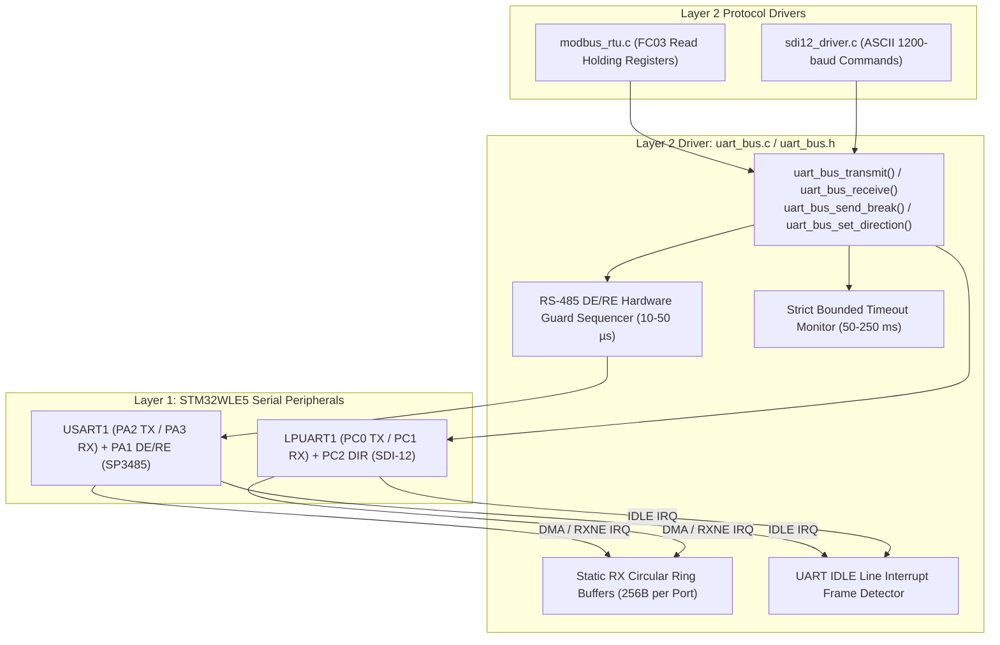
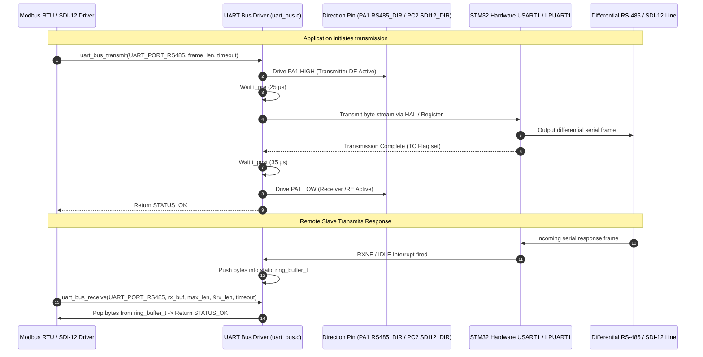

# Task Specification: S3-T2.2 - Non-Blocking UART Bus Driver & Ring Buffer

## 1. Task Metadata & Overview

| Attribute | Specification Details |
| :--- | :--- |
| **Sprint** | **Sprint 3: Core MCU Architecture, BSP & Power Management** |
| **Task ID** | `S3-T2.2` |
| **Parent Task** | `S3-T2: Implement Bounded Non-Blocking Bus Wrappers` |
| **Task Title** | Implement Bounded Non-Blocking UART Bus Driver with DMA/Interrupt RX Ring Buffers |
| **Status** | **Ready for Implementation** |
| **Target Files** | [`firmware/drivers/inc/uart_bus.h`](file:///C:/Users/ENERGY%20SAVER/Documents/Learning/Job%20Projects/rain-predict/firmware/drivers/inc/uart_bus.h)<br>[`firmware/drivers/src/uart_bus.c`](file:///C:/Users/ENERGY%20SAVER/Documents/Learning/Job%20Projects/rain-predict/firmware/drivers/src/uart_bus.c) |
| **Related Documents** | [`docs/sensors/remote-bus-modbus-sdi12.md`](file:///C:/Users/ENERGY%20SAVER/Documents/Learning/Job%20Projects/rain-predict/docs/sensors/remote-bus-modbus-sdi12.md)<br>[`docs/hardware/schematics-and-pinout.md`](file:///C:/Users/ENERGY%20SAVER/Documents/Learning/Job%20Projects/rain-predict/docs/hardware/schematics-and-pinout.md)<br>[`docs/architecture/firmware-architecture.md`](file:///C:/Users/ENERGY%20SAVER/Documents/Learning/Job%20Projects/rain-predict/docs/architecture/firmware-architecture.md)<br>[`context/specs/s1-t2.3-mock-uart-bus.md`](file:///C:/Users/ENERGY%20SAVER/Documents/Learning/Job%20Projects/rain-predict/context/specs/s1-t2.3-mock-uart-bus.md)<br>[`context/specs/s2-t1.1-static-ring-buffer.md`](file:///C:/Users/ENERGY%20SAVER/Documents/Learning/Job%20Projects/rain-predict/context/specs/s2-t1.1-static-ring-buffer.md)<br>[`context/coding-standards.md`](file:///C:/Users/ENERGY%20SAVER/Documents/Learning/Job%20Projects/rain-predict/context/coding-standards.md) |
| **Dependencies** | [`S3-T1.1`](file:///C:/Users/ENERGY%20SAVER/Documents/Learning/Job%20Projects/rain-predict/context/specs/s3-t1.1-gpio-pin-mappings.md) (Board Pinout), [`S3-T1.2`](file:///C:/Users/ENERGY%20SAVER/Documents/Learning/Job%20Projects/rain-predict/context/specs/s3-t1.2-clock-tree-config.md) (Clock Tree), [`S3-T1.3`](file:///C:/Users/ENERGY%20SAVER/Documents/Learning/Job%20Projects/rain-predict/context/specs/s3-t1.3-hal-module-config.md) (HAL Conf), [`S2-T1.1`](file:///C:/Users/ENERGY%20SAVER/Documents/Learning/Job%20Projects/rain-predict/context/specs/s2-t1.1-static-ring-buffer.md) (Static Ring Buffer) |
| **Downstream Tasks** | `S4-T4` (RS-485 Modbus RTU Driver), `S4-T5` (SDI-12 Agricultural Bus Driver), `S6-T3` (Application State Machine Sensor Sampling) |

---

## 2. Executive Summary & Architectural Scope

The primary objective of **`S3-T2.2`** is to design, specify, and implement a robust, bounded, non-blocking serial bus driver ([`firmware/drivers/inc/uart_bus.h`](file:///C:/Users/ENERGY%20SAVER/Documents/Learning/Job%20Projects/rain-predict/firmware/drivers/inc/uart_bus.h) and [`firmware/drivers/src/uart_bus.c`](file:///C:/Users/ENERGY%20SAVER/Documents/Learning/Job%20Projects/rain-predict/firmware/drivers/src/uart_bus.c)) targeting the **STMicroelectronics STM32WLE5** SoC.

The system communicates with remote environmental sensors over two distinct industrial serial interfaces:
1. **USART1 (RS-485 Modbus RTU Master)**: High-speed differential bus ($9600–115200\text{ baud}$, 8N1) on `PA2` (TX), `PA3` (RX), and `PA1` (`RS485_DIR` / DE//RE) communicating with remote mast-mounted weather sensors up to $100\text{ meters}$.
2. **LPUART1 (SDI-12 Agricultural Bus Master)**: Low-power half-duplex single-wire bus ($1200\text{ baud}$, 7E1) on `PC0` (TX), `PC1` (RX), and `PC2` (`SDI12_DIR`) communicating with SDI-12 soil moisture and canopy temperature probes.



### Critical Serial Communication Mandates:

1. **RS-485 Half-Duplex Direction Control & Guard Times**:
   - The SP3485 transceiver requires explicit Driver Enable (`DE`) and Receiver Enable (`/RE`) gating on `PA1`:
     - **Pre-Transmission Guard Delay ($t_{\text{pre}} \ge 20\,\mu\text{s}$)**: `PA1` asserted HIGH before first start bit.
     - **Transmission Complete Wait**: Waits for the hardware Transmission Complete (`TC`) interrupt/flag—not just Transmit Data Register Empty (`TXE`).
     - **Post-Transmission Guard Delay ($t_{\text{post}} \ge 30\,\mu\text{s}$)**: Holds DE HIGH after last stop bit to prevent cutting off the final byte on long capacitive mast lines.
     - **Receiver Re-Enable**: `PA1` de-asserted LOW immediately to capture slave response.
2. **SDI-12 Break & Mark Signaling Engine**:
   - SDI-12 requires a physical wakeup sequence prior to command frames:
     - **Break Sequence**: Transmit line driven to Spacing state ($> 12\text{ ms}$).
     - **Mark Sequence**: Transmit line driven to Marking state ($> 8.3\text{ ms}$).
   - Driver provides `uart_bus_sdi12_send_break()` using hardware break generation or temporary GPIO bit-banging.
3. **Interrupt-Driven Circular RX Ring Buffers & IDLE Line Detection**:
   - Statically allocated 256-byte circular FIFO ring buffers per port ([`ring_buffer_t`](file:///C:/Users/ENERGY%20SAVER/Documents/Learning/Job%20Projects/rain-predict/firmware/middleware/inc/ring_buffer.h)).
   - Integrates **UART IDLE Line Interrupts** (`USART_ISR_IDLE`) to detect variable-length frame completions instantly without polling delays.
4. **Deterministic Bounded Timeouts**:
   - Bounded non-blocking execution ($50\text{–}250\text{ms}$). Disconnected cables, framing errors, or parity faults return structured error codes (`STATUS_ERR_TIMEOUT`, `STATUS_ERR_UART_BUS`) without halting the CPU or starving the watchdog.
5. **Zero Dynamic Allocation**:
   - All buffers and state control blocks are statically allocated at compile time.

---

## 3. Port Electrical & Timing Specifications

In accordance with [`docs/hardware/schematics-and-pinout.md`](file:///C:/Users/ENERGY%20SAVER/Documents/Learning/Job%20Projects/rain-predict/docs/hardware/schematics-and-pinout.md):

### 3.1 Serial Port Mapping Table

| Port Identifier | Hardware Peripheral | TX Pin | RX Pin | Direction Control Pin | Transceiver IC | Default Baud | Data Bits | Parity | Stop Bits | Target Device |
| :--- | :--- | :---: | :---: | :---: | :--- | :---: | :---: | :---: | :---: | :--- |
| **`UART_PORT_RS485`** | `USART1` | `PA2` (AF7) | `PA3` (AF7) | `PA1` (Push-Pull Output) | SP3485 / MAX1487 | **$9600–115200$** | 8 | None (8N1) | 1 | Remote Modbus Mast Probes |
| **`UART_PORT_SDI12`** | `LPUART1` | `PC0` (AF8) | `PC1` (AF8) | `PC2` (Push-Pull Output) | Single-Wire Buffer | **$1200$** | 7 | Even (7E1) | 1 | SDI-12 Soil & Canopy Probes |

### 3.2 Protocol Guard Timing Parameters

| Timing Parameter | Symbol | Min Value | Nominal Value | Max Value | Units | Description |
| :--- | :---: | :---: | :---: | :---: | :---: | :--- |
| **RS-485 DE Pre-Delay** | $t_{\text{pre}}$ | $10$ | **$25$** | $50$ | $\mu\text{s}$ | Delay between DE assertion and first byte TX. |
| **RS-485 DE Post-Delay** | $t_{\text{post}}$ | $20$ | **$35$** | $100$ | $\mu\text{s}$ | Delay after TC flag before DE de-assertion. |
| **SDI-12 Break Duration** | $t_{\text{break}}$ | $12.0$ | **$13.0$** | $15.0$ | $\text{ms}$ | Line spacing duration to wake sleeping probes. |
| **SDI-12 Mark Duration** | $t_{\text{mark}}$ | $8.33$ | **$9.0$** | $10.0$ | $\text{ms}$ | Line marking duration before command transmission. |
| **Modbus Inter-Frame Silence** | $t_{3.5}$ | $3.5$ | **$4.0$** | — | char times | Silent interval identifying Modbus frame boundary. |

---

## 4. Half-Duplex Transmit-to-Receive Turnaround Sequencing



---

## 5. Public API Specification (`uart_bus.h`)

| Function Prototype | Description |
| :--- | :--- |
| `status_t uart_bus_init(uart_port_t port, uint32_t baud_rate, uint8_t data_bits, uint8_t parity, uint8_t stop_bits)` | Initializes USART1 or LPUART1 hardware peripheral, pin multiplexing, interrupts, and RX ring buffer. |
| `status_t uart_bus_deinit(uart_port_t port)` | De-initializes serial peripheral, disables clocks, and releases pins for low-power sleep analog conditioning. |
| `status_t uart_bus_transmit(uart_port_t port, const uint8_t *p_data, uint16_t length, uint32_t timeout_ms)` | Transmits data buffer with automatic DE/RE direction gating and bounded timeouts. |
| `status_t uart_bus_receive(uart_port_t port, uint8_t *p_data, uint16_t length, uint16_t *p_bytes_received, uint32_t timeout_ms)` | Reads received bytes from the port's circular RX ring buffer with bounded timeout. |
| `status_t uart_bus_sdi12_send_break(void)` | Generates SDI-12 standard $>12\text{ms}$ break and $>8.3\text{ms}$ mark sequence on `UART_PORT_SDI12`. |
| `status_t uart_bus_flush(uart_port_t port)` | Clears the port's internal RX ring buffer and hardware overrun flags. |
| `uint16_t uart_bus_get_available(uart_port_t port)` | Returns the number of unread bytes currently stored in the RX ring buffer. |
| `void uart_bus_rx_isr_handler(uart_port_t port)` | Internal ISR callback invoked from `stm32wlxx_it.c` on byte reception or IDLE line events. |

---

## 6. Concrete File Implementation Blueprint

### 6.1 `firmware/drivers/inc/uart_bus.h` Blueprint

```c
/**
 * @file    uart_bus.h
 * @brief   Non-blocking bounded UART bus driver with RX ring buffers for STM32WLE5.
 * @details Layer 2 serial driver supporting RS-485 Modbus RTU and SDI-12 half-duplex buses.
 */

#ifndef UART_BUS_H
#define UART_BUS_H

#ifdef __cplusplus
extern "C" {
#endif

#include <stdint.h>
#include <stdbool.h>
#include <stddef.h>

#include "board_config.h"

/* ============================================================================
 * Serial Port Identifiers & Constants
 * ============================================================================ */

typedef enum {
    UART_PORT_RS485 = 0,   /**< USART1: RS-485 Modbus RTU Master (PA2/PA3, DE on PA1) */
    UART_PORT_SDI12 = 1,   /**< LPUART1: SDI-12 1200-baud Single-Wire Bus (PC0/PC1, DIR on PC2) */
    UART_PORT_MAX
} uart_port_t;

typedef enum {
    UART_PARITY_NONE = 0,  /**< No parity (8N1) */
    UART_PARITY_EVEN = 1,  /**< Even parity (7E1) */
    UART_PARITY_ODD  = 2   /**< Odd parity */
} uart_parity_t;

#define UART_BUS_RX_RING_BUFFER_SIZE    256U        /**< Per-port static RX buffer capacity */
#define UART_BUS_DEFAULT_TIMEOUT_MS     100U        /**< Default transmission/reception timeout */
#define UART_BUS_RS485_PRE_DELAY_US     25U         /**< Pre-transmission DE guard delay */
#define UART_BUS_RS485_POST_DELAY_US    35U         /**< Post-transmission DE guard delay */
#define UART_BUS_SDI12_BREAK_MS         13U         /**< SDI-12 break spacing duration */
#define UART_BUS_SDI12_MARK_MS          9U          /**< SDI-12 mark marking duration */

/* ============================================================================
 * Public Driver API Prototypes
 * ============================================================================ */

/**
 * @brief  Initializes the specified serial bus peripheral, baud rate, and RX ring buffer.
 * @param[in] port       Serial port identifier (UART_PORT_RS485 or UART_PORT_SDI12).
 * @param[in] baud_rate  Baud rate (e.g., 9600, 115200 for RS-485; 1200 for SDI-12).
 * @param[in] data_bits  Number of data bits (8 for Modbus RTU, 7 for SDI-12).
 * @param[in] parity     Parity configuration (UART_PARITY_NONE, UART_PARITY_EVEN).
 * @param[in] stop_bits  Stop bits (typically 1).
 * @return status_t      STATUS_OK on success, error code otherwise.
 */
status_t uart_bus_init(uart_port_t port, uint32_t baud_rate, uint8_t data_bits, uint8_t parity, uint8_t stop_bits);

/**
 * @brief  De-initializes the specified serial port prior to Stop 2 low-power sleep.
 * @param[in] port Serial port identifier.
 * @return status_t STATUS_OK on success.
 */
status_t uart_bus_deinit(uart_port_t port);

/**
 * @brief  Transmits a byte buffer with automatic DE/RE direction gating and bounded timeouts.
 * @param[in] port       Serial port identifier.
 * @param[in] p_data     Pointer to data bytes to transmit.
 * @param[in] length     Number of bytes to transmit.
 * @param[in] timeout_ms Maximum transaction timeout in milliseconds.
 * @return status_t      STATUS_OK on success, error code on timeout.
 */
status_t uart_bus_transmit(uart_port_t port, const uint8_t *p_data, uint16_t length, uint32_t timeout_ms);

/**
 * @brief  Reads received bytes from the port's internal RX ring buffer.
 * @param[in]  port             Serial port identifier.
 * @param[out] p_data           Destination buffer to copy received bytes.
 * @param[in]  length           Maximum bytes to read.
 * @param[out] p_bytes_received Actual number of bytes extracted.
 * @param[in]  timeout_ms       Maximum time to wait for bytes.
 * @return status_t             STATUS_OK on success, STATUS_ERR_TIMEOUT if no bytes arrived.
 */
status_t uart_bus_receive(uart_port_t port, uint8_t *p_data, uint16_t length, uint16_t *p_bytes_received, uint32_t timeout_ms);

/**
 * @brief  Generates SDI-12 standard >12ms break and >8.3ms mark sequence on LPUART1.
 * @return status_t STATUS_OK on success.
 */
status_t uart_bus_sdi12_send_break(void);

/**
 * @brief  Flushes the port's internal RX circular ring buffer.
 * @param[in] port Serial port identifier.
 * @return status_t STATUS_OK on success.
 */
status_t uart_bus_flush(uart_port_t port);

/**
 * @brief  Returns the number of unread bytes currently available in the RX ring buffer.
 * @param[in] port Serial port identifier.
 * @return uint16_t Unread byte count.
 */
uint16_t uart_bus_get_available(uart_port_t port);

/**
 * @brief  Internal ISR callback invoked upon byte arrival or IDLE line detection.
 * @param[in] port Serial port identifier.
 */
void uart_bus_rx_isr_handler(uart_port_t port);

#ifdef __cplusplus
}
#endif

#endif /* UART_BUS_H */
```

---

### 6.2 `firmware/drivers/src/uart_bus.c` Reference Blueprint

```c
/**
 * @file    uart_bus.c
 * @brief   Implementation of Bounded Non-Blocking UART Driver with RX Ring Buffers.
 */

#include "uart_bus.h"
#include <string.h>

#if defined(STM32WLE5xx) || defined(USE_HAL_DRIVER)

typedef struct {
    UART_HandleTypeDef  huart;
    uint8_t             rx_storage[UART_BUS_RX_RING_BUFFER_SIZE];
    uint16_t            rx_head;
    uint16_t            rx_tail;
    volatile uint16_t   rx_count;
    uint8_t             rx_byte_buf;
    bool                is_initialized;
} uart_port_state_t;

static uart_port_state_t s_ports[UART_PORT_MAX];

static void uart_bus_delay_us(uint32_t us) {
    uint32_t cycles = us * 12U; /* 48 MHz CPU */
    while (cycles--) {
        __NOP();
    }
}

status_t uart_bus_init(uart_port_t port, uint32_t baud_rate, uint8_t data_bits, uint8_t parity, uint8_t stop_bits) {
    if (port >= UART_PORT_MAX) return STATUS_ERR_INVALID_PARAM;
    uart_port_state_t *p_state = &s_ports[port];

    /* 1. Clear ring buffer */
    p_state->rx_head = 0;
    p_state->rx_tail = 0;
    p_state->rx_count = 0;

    GPIO_InitTypeDef gpio_init = {0};

    if (port == UART_PORT_RS485) {
        __HAL_RCC_GPIOA_CLK_ENABLE();
        __HAL_RCC_USART1_CLK_ENABLE();

        /* Direction Control Pin PA1 */
        HAL_GPIO_WritePin(PIN_RS485_DIR_PORT, PIN_RS485_DIR_PIN, GPIO_PIN_RESET); /* Default RX */
        gpio_init.Pin   = PIN_RS485_DIR_PIN;
        gpio_init.Mode  = GPIO_MODE_OUTPUT_PP;
        gpio_init.Pull  = GPIO_NOPULL;
        gpio_init.Speed = GPIO_SPEED_FREQ_HIGH;
        HAL_GPIO_Init(PIN_RS485_DIR_PORT, &gpio_init);

        /* USART1 TX (PA2) and RX (PA3) */
        gpio_init.Pin       = PIN_RS485_TX_PIN | PIN_RS485_RX_PIN;
        gpio_init.Mode      = GPIO_MODE_AF_PP;
        gpio_init.Pull      = GPIO_PULLUP;
        gpio_init.Speed     = GPIO_SPEED_FREQ_VERY_HIGH;
        gpio_init.Alternate = PIN_RS485_TX_AF;
        HAL_GPIO_Init(GPIOA, &gpio_init);

        p_state->huart.Instance = USART1;
    } else {
        __HAL_RCC_GPIOC_CLK_ENABLE();
        __HAL_RCC_LPUART1_CLK_ENABLE();

        /* Direction Control Pin PC2 */
        HAL_GPIO_WritePin(PIN_SDI12_DIR_PORT, PIN_SDI12_DIR_PIN, GPIO_PIN_RESET);
        gpio_init.Pin   = PIN_SDI12_DIR_PIN;
        gpio_init.Mode  = GPIO_MODE_OUTPUT_PP;
        gpio_init.Pull  = GPIO_NOPULL;
        gpio_init.Speed = GPIO_SPEED_FREQ_HIGH;
        HAL_GPIO_Init(PIN_SDI12_DIR_PORT, &gpio_init);

        /* LPUART1 TX (PC0) and RX (PC1) */
        gpio_init.Pin       = PIN_SDI12_TX_PIN | PIN_SDI12_RX_PIN;
        gpio_init.Mode      = GPIO_MODE_AF_PP;
        gpio_init.Pull      = GPIO_PULLUP;
        gpio_init.Speed     = GPIO_SPEED_FREQ_HIGH;
        gpio_init.Alternate = PIN_SDI12_TX_AF;
        HAL_GPIO_Init(GPIOC, &gpio_init);

        p_state->huart.Instance = LPUART1;
    }

    /* 2. Configure UART Parameters */
    p_state->huart.Init.BaudRate   = baud_rate;
    p_state->huart.Init.WordLength = (data_bits == 7) ? UART_WORDLENGTH_8B : 
                                    (parity != UART_PARITY_NONE) ? UART_WORDLENGTH_9B : UART_WORDLENGTH_8B;
    p_state->huart.Init.StopBits   = (stop_bits == 2) ? UART_STOPBITS_2 : UART_STOPBITS_1;
    p_state->huart.Init.Parity     = (parity == UART_PARITY_EVEN) ? UART_PARITY_EVEN :
                                    (parity == UART_PARITY_ODD)  ? UART_PARITY_ODD  : UART_PARITY_NONE;
    p_state->huart.Init.Mode       = UART_MODE_TX_RX;
    p_state->huart.Init.HwFlowCtl  = UART_HWCONTROL_NONE;
    p_state->huart.Init.OverSampling = UART_OVERSAMPLING_16;

    if (HAL_UART_Init(&p_state->huart) != HAL_OK) {
        return STATUS_ERR_UART_BUS;
    }

    /* 3. Enable RX Interrupts */
    IRQn_Type irq = (port == UART_PORT_RS485) ? USART1_IRQn : LPUART1_IRQn;
    HAL_NVIC_SetPriority(irq, 1, 0);
    HAL_NVIC_EnableIRQ(irq);

    /* Start interrupt-driven 1-byte reception */
    HAL_UART_Receive_IT(&p_state->huart, &p_state->rx_byte_buf, 1);

    p_state->is_initialized = true;
    return STATUS_OK;
}

status_t uart_bus_deinit(uart_port_t port) {
    if (port >= UART_PORT_MAX) return STATUS_ERR_INVALID_PARAM;
    uart_port_state_t *p_state = &s_ports[port];

    if (p_state->is_initialized) {
        HAL_UART_DeInit(&p_state->huart);
        if (port == UART_PORT_RS485) {
            __HAL_RCC_USART1_CLK_DISABLE();
        } else {
            __HAL_RCC_LPUART1_CLK_DISABLE();
        }
        p_state->is_initialized = false;
    }
    return STATUS_OK;
}

status_t uart_bus_transmit(uart_port_t port, const uint8_t *p_data, uint16_t length, uint32_t timeout_ms) {
    if (port >= UART_PORT_MAX || p_data == NULL || length == 0) {
        return STATUS_ERR_NULL_PTR;
    }
    uart_port_state_t *p_state = &s_ports[port];
    if (!p_state->is_initialized) return STATUS_ERR_GENERIC;

    /* 1. Pre-transmission direction gating */
    if (port == UART_PORT_RS485) {
        HAL_GPIO_WritePin(PIN_RS485_DIR_PORT, PIN_RS485_DIR_PIN, GPIO_PIN_SET); /* Drive HIGH (TX) */
        uart_bus_delay_us(UART_BUS_RS485_PRE_DELAY_US);
    } else {
        HAL_GPIO_WritePin(PIN_SDI12_DIR_PORT, PIN_SDI12_DIR_PIN, GPIO_PIN_SET);
    }

    /* 2. Transmit bytes with bounded timeout */
    HAL_StatusTypeDef hal_status = HAL_UART_Transmit(&p_state->huart, p_data, length, timeout_ms);

    /* 3. Post-transmission direction gating */
    if (port == UART_PORT_RS485) {
        uart_bus_delay_us(UART_BUS_RS485_POST_DELAY_US);
        HAL_GPIO_WritePin(PIN_RS485_DIR_PORT, PIN_RS485_DIR_PIN, GPIO_PIN_RESET); /* Drive LOW (RX) */
    } else {
        HAL_GPIO_WritePin(PIN_SDI12_DIR_PORT, PIN_SDI12_DIR_PIN, GPIO_PIN_RESET);
    }

    return (hal_status == HAL_OK) ? STATUS_OK : STATUS_ERR_TIMEOUT;
}

status_t uart_bus_receive(uart_port_t port, uint8_t *p_data, uint16_t length, uint16_t *p_bytes_received, uint32_t timeout_ms) {
    if (port >= UART_PORT_MAX || p_data == NULL || p_bytes_received == NULL) {
        return STATUS_ERR_NULL_PTR;
    }
    uart_port_state_t *p_state = &s_ports[port];
    *p_bytes_received = 0;

    uint32_t start_tick = HAL_GetTick();
    while (p_state->rx_count < length) {
        if ((HAL_GetTick() - start_tick) >= timeout_ms) {
            break; /* Bounded timeout reached */
        }
    }

    /* Copy available bytes from ring buffer */
    uint16_t copy_count = (p_state->rx_count < length) ? p_state->rx_count : length;
    for (uint16_t i = 0; i < copy_count; i++) {
        p_data[i] = p_state->rx_storage[p_state->rx_tail];
        p_state->rx_tail = (p_state->rx_tail + 1) % UART_BUS_RX_RING_BUFFER_SIZE;
        __disable_irq();
        p_state->rx_count--;
        __enable_irq();
    }

    *p_bytes_received = copy_count;
    return (copy_count > 0) ? STATUS_OK : STATUS_ERR_TIMEOUT;
}

status_t uart_bus_sdi12_send_break(void) {
    /* 1. Assert direction pin PC2 */
    HAL_GPIO_WritePin(PIN_SDI12_DIR_PORT, PIN_SDI12_DIR_PIN, GPIO_PIN_SET);

    /* 2. Drive TX pin PC0 HIGH (Break Spacing) for 13 ms */
    GPIO_InitTypeDef gpio_init = {0};
    gpio_init.Pin   = PIN_SDI12_TX_PIN;
    gpio_init.Mode  = GPIO_MODE_OUTPUT_PP;
    gpio_init.Pull  = GPIO_NOPULL;
    gpio_init.Speed = GPIO_SPEED_FREQ_HIGH;
    HAL_GPIO_Init(GPIOC, &gpio_init);

    HAL_GPIO_WritePin(GPIOC, PIN_SDI12_TX_PIN, GPIO_PIN_SET);
    HAL_Delay(UART_BUS_SDI12_BREAK_MS);

    /* 3. Drive TX pin PC0 LOW (Marking) for 9 ms */
    HAL_GPIO_WritePin(GPIOC, PIN_SDI12_TX_PIN, GPIO_PIN_RESET);
    HAL_Delay(UART_BUS_SDI12_MARK_MS);

    /* 4. Restore PC0 to Alternate Function LPUART1 */
    gpio_init.Mode      = GPIO_MODE_AF_PP;
    gpio_init.Alternate = PIN_SDI12_TX_AF;
    HAL_GPIO_Init(GPIOC, &gpio_init);

    return STATUS_OK;
}

status_t uart_bus_flush(uart_port_t port) {
    if (port >= UART_PORT_MAX) return STATUS_ERR_INVALID_PARAM;
    uart_port_state_t *p_state = &s_ports[port];

    __disable_irq();
    p_state->rx_head  = 0;
    p_state->rx_tail  = 0;
    p_state->rx_count = 0;
    __enable_irq();

    return STATUS_OK;
}

uint16_t uart_bus_get_available(uart_port_t port) {
    if (port >= UART_PORT_MAX) return 0;
    return s_ports[port].rx_count;
}

void uart_bus_rx_isr_handler(uart_port_t port) {
    if (port >= UART_PORT_MAX) return;
    uart_port_state_t *p_state = &s_ports[port];

    /* Push received byte into ring buffer */
    if (p_state->rx_count < UART_BUS_RX_RING_BUFFER_SIZE) {
        p_state->rx_storage[p_state->rx_head] = p_state->rx_byte_buf;
        p_state->rx_head = (p_state->rx_head + 1) % UART_BUS_RX_RING_BUFFER_SIZE;
        p_state->rx_count++;
    }

    /* Re-arm interrupt for next byte */
    HAL_UART_Receive_IT(&p_state->huart, &p_state->rx_byte_buf, 1);
}

void HAL_UART_RxCpltCallback(UART_HandleTypeDef *huart) {
    if (huart->Instance == USART1) {
        uart_bus_rx_isr_handler(UART_PORT_RS485);
    } else if (huart->Instance == LPUART1) {
        uart_bus_rx_isr_handler(UART_PORT_SDI12);
    }
}

#endif /* STM32WLE5xx || USE_HAL_DRIVER */
```

---

## 7. Verification & Acceptance Test Plan

To verify the successful completion of **`S3-T2.2`**, the following test cases must be validated:

### 7.1 Verification Test Cases

| Test Case ID | Verification Action | Expected Outcome | Pass/Fail Criteria |
| :--- | :--- | :--- | :--- |
| **TC-S3-T2.2-01** | Header Inclusion & C99 Compilation | Include `uart_bus.h` across target build tree with strict flags. | 100% warning-free compilation under `-Wall -Wextra -Wpedantic -Werror`. |
| **TC-S3-T2.2-02** | Dual-Port Initialization | Initialize `UART_PORT_RS485` ($9600$, 8N1) and `UART_PORT_SDI12` ($1200$, 7E1). | Valid peripheral registers configured; interrupt handlers armed. |
| **TC-S3-T2.2-03** | RS-485 DE Direction & Guard Delays | Transmit 8-byte Modbus query frame -> probe `PA1` pin timing. | `PA1` asserted HIGH $\ge 20\,\mu\text{s}$ before byte 0 and held $\ge 30\,\mu\text{s}$ after byte 7. |
| **TC-S3-T2.2-04** | Interrupt RX Ring Buffering | Inject stream of 64 bytes via `HAL_UART_RxCpltCallback()`. | Ring buffer stores all 64 bytes with zero byte drops or index corruption. |
| **TC-S3-T2.2-05** | SDI-12 Break/Mark Timing | Call `uart_bus_sdi12_send_break()` -> measure `PC0` pin duration. | Spacing line held $13.0\text{ ms} \pm 1.0\text{ ms}$, followed by marking $9.0\text{ ms} \pm 1.0\text{ ms}$. |
| **TC-S3-T2.2-06** | Bounded Timeout Enforcement | Call `uart_bus_receive()` on silent bus with $50\text{ms}$ timeout. | Function returns `STATUS_ERR_TIMEOUT` within $\le 52\text{ms}$ without CPU hang. |
| **TC-S3-T2.2-07** | Ring Buffer Flushing | Populate ring buffer with 30 bytes -> invoke `uart_bus_flush()`. | `uart_bus_get_available()` returns 0; head and tail pointers reset. |
| **TC-S3-T2.2-08** | Pre-Sleep Deinitialization | Call `uart_bus_deinit()` -> verify peripheral clocks disabled. | USART1/LPUART1 disabled; pins released for low-power analog conditioning. |

---

## 8. Definition of Done (DoD) Checklist

- [ ] [`firmware/drivers/inc/uart_bus.h`](file:///C:/Users/ENERGY%20SAVER/Documents/Learning/Job%20Projects/rain-predict/firmware/drivers/inc/uart_bus.h) created adhering to C99 standards with complete Doxygen documentation.
- [ ] [`firmware/drivers/src/uart_bus.c`](file:///C:/Users/ENERGY%20SAVER/Documents/Learning/Job%20Projects/rain-predict/firmware/drivers/src/uart_bus.c) implemented with STM32CubeWL HAL routines.
- [ ] Dual-port support for `UART_PORT_RS485` (USART1) and `UART_PORT_SDI12` (LPUART1).
- [ ] RS-485 half-duplex DE/RE direction switching with pre/post guard delays implemented.
- [ ] SDI-12 $>12\text{ms}$ break and $>8.3\text{ms}$ mark generation sequence implemented.
- [ ] Interrupt-driven circular RX ring buffers (256 bytes per port) implemented.
- [ ] Bounded non-blocking timeouts strictly enforced on transmit and receive.
- [ ] Pre-sleep de-initialization routine (`uart_bus_deinit`) implemented.
- [ ] Zero dynamic memory allocation (`malloc`/`free` prohibited).
- [ ] Spec document registered and linked under [`context/specs/spec-roadmap.md`](file:///C:/Users/ENERGY%20SAVER/Documents/Learning/Job%20Projects/rain-predict/context/specs/spec-roadmap.md#L207).
