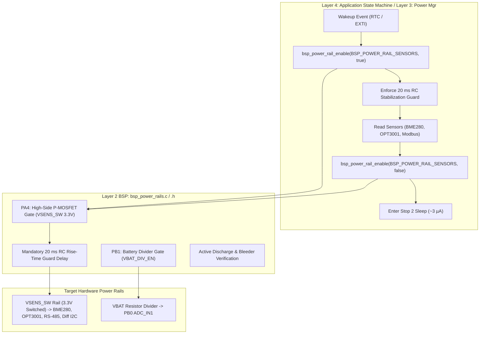

# Task Specification: S3-T3.1 - Switched Sensor Power Rails Driver

## 1. Task Metadata & Overview

| Attribute | Specification Details |
| :--- | :--- |
| **Sprint** | **Sprint 3: Core MCU Architecture, BSP & Power Management** |
| **Task ID** | `S3-T3.1` |
| **Parent Task** | `S3-T3: Implement Switched Sensor Power Rails & Board Indicators` |
| **Task Title** | Implement Switched Sensor Power Rails Driver with High-Side P-MOSFET Gating & Stabilization Delays |
| **Status** | **Ready for Implementation** |
| **Target Files** | [`firmware/drivers/inc/bsp_power_rails.h`](file:///C:/Users/ENERGY%20SAVER/Documents/Learning/Job%20Projects/rain-predict/firmware/drivers/inc/bsp_power_rails.h)<br>[`firmware/drivers/src/bsp_power_rails.c`](file:///C:/Users/ENERGY%20SAVER/Documents/Learning/Job%20Projects/rain-predict/firmware/drivers/src/bsp_power_rails.c) |
| **Related Documents** | [`docs/hardware/schematics-and-pinout.md`](file:///C:/Users/ENERGY%20SAVER/Documents/Learning/Job%20Projects/rain-predict/docs/hardware/schematics-and-pinout.md)<br>[`docs/architecture/power-architecture.md`](file:///C:/Users/ENERGY%20SAVER/Documents/Learning/Job%20Projects/rain-predict/docs/architecture/power-architecture.md)<br>[`docs/hardware/power-supply-and-solar.md`](file:///C:/Users/ENERGY%20SAVER/Documents/Learning/Job%20Projects/rain-predict/docs/hardware/power-supply-and-solar.md)<br>[`context/specs/s3-t1.1-gpio-pin-mappings.md`](file:///C:/Users/ENERGY%20SAVER/Documents/Learning/Job%20Projects/rain-predict/context/specs/s3-t1.1-gpio-pin-mappings.md)<br>[`context/specs/s1-t2.4-mock-gpio.md`](file:///C:/Users/ENERGY%20SAVER/Documents/Learning/Job%20Projects/rain-predict/context/specs/s1-t2.4-mock-gpio.md)<br>[`context/coding-standards.md`](file:///C:/Users/ENERGY%20SAVER/Documents/Learning/Job%20Projects/rain-predict/context/coding-standards.md) |
| **Dependencies** | [`S3-T1.1`](file:///C:/Users/ENERGY%20SAVER/Documents/Learning/Job%20Projects/rain-predict/context/specs/s3-t1.1-gpio-pin-mappings.md) (Board Pinout & GPIO Configurations) |
| **Downstream Tasks** | `S3-T4.1` (Pre-Sleep GPIO Leakage Conditioning), `S4-T1` through `S4-T5` (Sensor Drivers), `S6-T3` (Application State Machine Power Lifecycle) |

---

## 2. Executive Summary & Architectural Scope

The primary objective of **`S3-T3.1`** is to develop the switched power rail management driver ([`firmware/drivers/inc/bsp_power_rails.h`](file:///C:/Users/ENERGY%20SAVER/Documents/Learning/Job%20Projects/rain-predict/firmware/drivers/inc/bsp_power_rails.h) and [`firmware/drivers/src/bsp_power_rails.c`](file:///C:/Users/ENERGY%20SAVER/Documents/Learning/Job%20Projects/rain-predict/firmware/drivers/src/bsp_power_rails.c)) for the **Tea Plantation Rain Prediction System**.

In unattended highland tea estate microclimates, sensor transceivers (Bosch BME280, TI OPT3001, SP3485 RS-485, PCA9615 differential I2C, SDI-12 buffers) draw significant quiescent current ($> 500\,\mu\text{A}$) if left continuously powered. To achieve the project's target **$< 5.0\,\mu\text{A}$ Stop 2 sleep current** and $>14$-day zero-sunlight battery survivability, all sensor sub-circuits are isolated behind hardware load switches.



### Critical Hardware & Power Governance Mandates:

1. **High-Side P-MOSFET Load Switch Control (`PA4` / `PIN_PWR_SENS_EN`)**:
   - Driving `PA4` HIGH activates an N-MOSFET (2N7002 / DMN65D8L), pulling the P-MOSFET (DMG2305UX, $R_{\text{DS(on)}} < 0.05\,\Omega$) gate to ground, cleanly energizing `VSENS_SW` ($3.3\text{V}$).
   - Driving `PA4` LOW turns off the P-MOSFET, isolating the rail. A $100\,\text{k}\Omega$ parallel bleeder resistor rapidly discharges bus decoupling capacitance ($< 10\text{ ms}$).
2. **Mandatory $20\text{ ms}$ RC Stabilization Guard Delay**:
   - When `VSENS_SW` is energized, sensor IC internal power-on-reset (POR) circuits and decoupling capacitors require up to $15\text{ ms}$ to stabilize.
   - **Mandatory Driver Rule**: Firmware must enforce a calibrated **$20\text{ ms}$ stabilization delay** (`BSP_POWER_RAIL_STABILIZATION_MS`) before any I2C or UART communication commences. Attempting bus communication before stabilization results in bus NACKs or hung slave state machines.
3. **Battery Voltage Divider Power Gating (`PB1` / `PIN_VBAT_DIV_EN`)**:
   - The $100\,\text{k}\Omega / 100\,\text{k}\Omega$ resistor divider on `PB0` (ADC_IN1) is gated via a P-MOSFET controlled by `PB1`.
   - `PB1` is driven LOW (active) only during active ADC acquisition ($< 1\text{ ms}$) and driven HIGH (OFF) in standby, reducing standby divider leakage from $16.5\,\mu\text{A}$ to **$< 10\text{ nA}$**.
4. **Parasitic Back-Powering Prevention**:
   - Before de-energizing `VSENS_SW`, all GPIO pins connected to sensors (I2C `PB6/PB7`, UART `PA2/PA3`, SDI-12 `PC0/PC1`) must be converted to `GPIO_MODE_ANALOG` to eliminate parasitic leakage ($200\,\mu\text{A}$ to $2\text{ mA}$) through internal MCU ESD clamping diodes.

---

## 3. Power Rail Hardware Specifications

In accordance with [`docs/hardware/schematics-and-pinout.md`](file:///C:/Users/ENERGY%20SAVER/Documents/Learning/Job%20Projects/rain-predict/docs/hardware/schematics-and-pinout.md):

### 3.1 Switched Power Rail Allocation Table

| Power Rail Identifier | Control Pin | Active Polarity | Switch Topology | Stabilization Delay | Output Voltage | Powered Loads & Sensors | Standby Leakage |
| :--- | :---: | :---: | :---: | :---: | :---: | :--- | :---: |
| **`BSP_POWER_RAIL_SENSORS`** | `PA4` | **HIGH = ON** | High-Side P-MOSFET (DMG2305UX) | **$20\text{ ms}$** | $3.3\text{V}$ Switched (`VSENS_SW`) | BME280, OPT3001, SP3485 RS-485, PCA9615, SDI-12 | $< 0.1\,\mu\text{A}$ |
| **`BSP_POWER_RAIL_VBAT_SENSE`**| `PB1` | **LOW = ON** | High-Side P-MOSFET | **$2\text{ ms}$** | $0.5 \times V_{\text{bat}}$ | $100\,\text{k}\Omega / 100\,\text{k}\Omega$ ADC Resistor Divider | $< 10\text{ nA}$ |

### 3.2 Electrical Timing & Inrush Current Governance

```
Power-Up Sequence:
PA4 Gate:         ──────┐
                        └──────────────────────────────────────── (Driven HIGH)
VSENS_SW Rail:    ───────────/~~~~~~~~~~~~~~~~~~~~~~~~~~~~~~~~~~~ (Ramps to 3.3V in 2.5ms)
Stabilization:    |<----------- 20 ms Guard Delay ------------->|
I2C/UART Traffic: ───────────────────────────────────────────────/~~~~~~ (Bus traffic allowed)
```

- **Inrush Current Limiting**: Gate RC circuit ($100\,\text{k}\Omega + 10\text{nF}$) limits $dV/dt$ to prevent voltage dips on the clean MCU $3.3\text{V}$ rail.
- **Bleeder Discharge**: $100\,\text{k}\Omega$ pulldown on `VSENS_SW` guarantees rail voltage collapses to $< 0.2\text{V}$ within $10\text{ ms}$ of de-assertion.

---

## 4. Public API Specification (`bsp_power_rails.h`)

| Function Prototype | Description |
| :--- | :--- |
| `status_t bsp_power_rails_init(void)` | Initializes power rail GPIO pins and ensures all load switches are de-energized (safe startup state). |
| `status_t bsp_power_rail_enable(bsp_power_rail_t rail, bool enable)` | Energizes or de-energizes the specified power rail, enforcing stabilization delay on power-on. |
| `bool bsp_power_rail_is_enabled(bsp_power_rail_t rail)` | Returns `true` if the specified power rail is currently energized. |
| `status_t bsp_power_rails_all_off(void)` | De-energizes all switched power rails simultaneously prior to Stop 2 sleep entry. |
| `status_t bsp_power_rail_stabilize(bsp_power_rail_t rail)` | Executes the calibrated hardware stabilization guard delay for the specified rail. |
| `uint32_t bsp_power_rail_get_stabilization_ms(bsp_power_rail_t rail)` | Returns the required stabilization guard time in milliseconds for the rail. |

---

## 5. Concrete File Implementation Blueprint

### 5.1 `firmware/drivers/inc/bsp_power_rails.h` Blueprint

```c
/**
 * @file    bsp_power_rails.h
 * @brief   Switched sensor power rail driver for STM32WLE5 SoC.
 * @details High-side P-MOSFET load switch management with stabilization guard timing.
 */

#ifndef BSP_POWER_RAILS_H
#define BSP_POWER_RAILS_H

#ifdef __cplusplus
extern "C" {
#endif

#include <stdint.h>
#include <stdbool.h>
#include <stddef.h>

#include "board_config.h"

/* ============================================================================
 * Power Rail Identifiers & Timing Constants
 * ============================================================================ */

typedef enum {
    BSP_POWER_RAIL_SENSORS    = 0,  /**< Switched 3.3V Sensor Rail (PA4 / VSENS_SW) */
    BSP_POWER_RAIL_VBAT_SENSE = 1,  /**< Battery Divider Sense Gate (PB1 / VBAT_DIV_EN) */
    BSP_POWER_RAIL_MAX
} bsp_power_rail_t;

#define BSP_POWER_RAIL_SENSORS_STABILIZE_MS     20U  /**< Sensor rail RC stabilization delay in ms */
#define BSP_POWER_RAIL_VBAT_STABILIZE_MS        2U   /**< Battery divider stabilization delay in ms */
#define BSP_POWER_RAIL_DISCHARGE_DELAY_MS       10U  /**< Rail discharge delay in ms */

/* ============================================================================
 * Public Driver API Prototypes
 * ============================================================================ */

/**
 * @brief  Initializes power rail control GPIOs to default safe power-off states.
 * @return status_t STATUS_OK on success.
 */
status_t bsp_power_rails_init(void);

/**
 * @brief  Energizes or de-energizes the specified hardware power rail.
 * @param[in] rail   Power rail identifier (BSP_POWER_RAIL_SENSORS or BSP_POWER_RAIL_VBAT_SENSE).
 * @param[in] enable true to energize rail with stabilization delay; false to de-energize.
 * @return status_t  STATUS_OK on success, error code otherwise.
 */
status_t bsp_power_rail_enable(bsp_power_rail_t rail, bool enable);

/**
 * @brief  Checks whether a specified power rail is currently energized.
 * @param[in] rail Power rail identifier.
 * @return bool    true if rail is energized.
 */
bool bsp_power_rail_is_enabled(bsp_power_rail_t rail);

/**
 * @brief  De-energizes all switched power rails prior to deep sleep entry.
 * @return status_t STATUS_OK on success.
 */
status_t bsp_power_rails_all_off(void);

/**
 * @brief  Executes calibrated hardware stabilization guard delay for specified rail.
 * @param[in] rail Power rail identifier.
 * @return status_t STATUS_OK on success.
 */
status_t bsp_power_rail_stabilize(bsp_power_rail_t rail);

/**
 * @brief  Returns required stabilization guard delay in milliseconds.
 * @param[in] rail Power rail identifier.
 * @return uint32_t Delay in milliseconds.
 */
uint32_t bsp_power_rail_get_stabilization_ms(bsp_power_rail_t rail);

#ifdef __cplusplus
}
#endif

#endif /* BSP_POWER_RAILS_H */
```

---

### 5.2 `firmware/drivers/src/bsp_power_rails.c` Reference Blueprint

```c
/**
 * @file    bsp_power_rails.c
 * @brief   Implementation of Switched Power Rail Controller with Delay Guards.
 */

#include "bsp_power_rails.h"

#if defined(STM32WLE5xx) || defined(USE_HAL_DRIVER)

static bool s_rail_states[BSP_POWER_RAIL_MAX] = {false, false};

status_t bsp_power_rails_init(void) {
    /* 1. Enable GPIO port clocks */
    __HAL_RCC_GPIOA_CLK_ENABLE();
    __HAL_RCC_GPIOB_CLK_ENABLE();

    GPIO_InitTypeDef gpio_init = {0};

    /* 2. Sensor Rail Gate PA4: Default OFF (LOW) */
    HAL_GPIO_WritePin(PIN_PWR_SENS_PORT, PIN_PWR_SENS_PIN, GPIO_PIN_RESET);
    gpio_init.Pin   = PIN_PWR_SENS_PIN;
    gpio_init.Mode  = GPIO_MODE_OUTPUT_PP;
    gpio_init.Pull  = GPIO_NOPULL;
    gpio_init.Speed = GPIO_SPEED_FREQ_MEDIUM;
    HAL_GPIO_Init(PIN_PWR_SENS_PORT, &gpio_init);

    /* 3. Battery Divider Gate PB1: Default OFF (HIGH) */
    HAL_GPIO_WritePin(PIN_VBAT_DIV_EN_PORT, PIN_VBAT_DIV_EN_PIN, GPIO_PIN_SET);
    gpio_init.Pin   = PIN_VBAT_DIV_EN_PIN;
    gpio_init.Mode  = GPIO_MODE_OUTPUT_PP;
    gpio_init.Pull  = GPIO_NOPULL;
    gpio_init.Speed = GPIO_SPEED_FREQ_LOW;
    HAL_GPIO_Init(PIN_VBAT_DIV_EN_PORT, &gpio_init);

    s_rail_states[BSP_POWER_RAIL_SENSORS]    = false;
    s_rail_states[BSP_POWER_RAIL_VBAT_SENSE] = false;

    return STATUS_OK;
}

status_t bsp_power_rail_enable(bsp_power_rail_t rail, bool enable) {
    if (rail >= BSP_POWER_RAIL_MAX) return STATUS_ERR_INVALID_PARAM;

    if (rail == BSP_POWER_RAIL_SENSORS) {
        if (enable) {
            /* PA4 HIGH turns ON high-side P-MOSFET switch */
            HAL_GPIO_WritePin(PIN_PWR_SENS_PORT, PIN_PWR_SENS_PIN, GPIO_PIN_SET);
            s_rail_states[BSP_POWER_RAIL_SENSORS] = true;
            bsp_power_rail_stabilize(BSP_POWER_RAIL_SENSORS);
        } else {
            /* PA4 LOW turns OFF switch */
            HAL_GPIO_WritePin(PIN_PWR_SENS_PORT, PIN_PWR_SENS_PIN, GPIO_PIN_RESET);
            s_rail_states[BSP_POWER_RAIL_SENSORS] = false;
        }
    } else if (rail == BSP_POWER_RAIL_VBAT_SENSE) {
        if (enable) {
            /* PB1 LOW turns ON P-MOSFET divider gate */
            HAL_GPIO_WritePin(PIN_VBAT_DIV_EN_PORT, PIN_VBAT_DIV_EN_PIN, GPIO_PIN_RESET);
            s_rail_states[BSP_POWER_RAIL_VBAT_SENSE] = true;
            bsp_power_rail_stabilize(BSP_POWER_RAIL_VBAT_SENSE);
        } else {
            /* PB1 HIGH turns OFF divider */
            HAL_GPIO_WritePin(PIN_VBAT_DIV_EN_PORT, PIN_VBAT_DIV_EN_PIN, GPIO_PIN_SET);
            s_rail_states[BSP_POWER_RAIL_VBAT_SENSE] = false;
        }
    }

    return STATUS_OK;
}

bool bsp_power_rail_is_enabled(bsp_power_rail_t rail) {
    if (rail >= BSP_POWER_RAIL_MAX) return false;
    return s_rail_states[rail];
}

status_t bsp_power_rails_all_off(void) {
    bsp_power_rail_enable(BSP_POWER_RAIL_SENSORS, false);
    bsp_power_rail_enable(BSP_POWER_RAIL_VBAT_SENSE, false);
    return STATUS_OK;
}

status_t bsp_power_rail_stabilize(bsp_power_rail_t rail) {
    uint32_t delay_ms = bsp_power_rail_get_stabilization_ms(rail);
    if (delay_ms > 0) {
        HAL_Delay(delay_ms);
    }
    return STATUS_OK;
}

uint32_t bsp_power_rail_get_stabilization_ms(bsp_power_rail_t rail) {
    switch (rail) {
        case BSP_POWER_RAIL_SENSORS:    return BSP_POWER_RAIL_SENSORS_STABILIZE_MS;
        case BSP_POWER_RAIL_VBAT_SENSE: return BSP_POWER_RAIL_VBAT_STABILIZE_MS;
        default:                        return 0;
    }
}

#else
/* --- Host Unit Test Stubs --- */
static bool s_mock_rails[BSP_POWER_RAIL_MAX] = {false, false};

status_t bsp_power_rails_init(void) {
    s_mock_rails[0] = false;
    s_mock_rails[1] = false;
    return STATUS_OK;
}

status_t bsp_power_rail_enable(bsp_power_rail_t rail, bool enable) {
    if (rail >= BSP_POWER_RAIL_MAX) return STATUS_ERR_INVALID_PARAM;
    s_mock_rails[rail] = enable;
    return STATUS_OK;
}

bool bsp_power_rail_is_enabled(bsp_power_rail_t rail) {
    if (rail >= BSP_POWER_RAIL_MAX) return false;
    return s_mock_rails[rail];
}

status_t bsp_power_rails_all_off(void) {
    s_mock_rails[0] = false;
    s_mock_rails[1] = false;
    return STATUS_OK;
}

status_t bsp_power_rail_stabilize(bsp_power_rail_t rail) {
    (void)rail;
    return STATUS_OK;
}

uint32_t bsp_power_rail_get_stabilization_ms(bsp_power_rail_t rail) {
    return (rail == BSP_POWER_RAIL_SENSORS) ? BSP_POWER_RAIL_SENSORS_STABILIZE_MS : BSP_POWER_RAIL_VBAT_STABILIZE_MS;
}
#endif
```

---

## 6. Verification & Acceptance Test Plan

To verify the successful completion of **`S3-T3.1`**, the following test cases must be validated:

### 6.1 Verification Test Cases

| Test Case ID | Verification Action | Expected Outcome | Pass/Fail Criteria |
| :--- | :--- | :--- | :--- |
| **TC-S3-T3.1-01** | Header Inclusion & C99 Compilation | Include `bsp_power_rails.h` in build tree with strict flags. | 100% warning-free compilation under `-Wall -Wextra -Wpedantic -Werror`. |
| **TC-S3-T3.1-02** | Default Power-On States | Call `bsp_power_rails_init()` -> check `PA4` and `PB1`. | `PA4` is LOW (Sensor power OFF), `PB1` is HIGH (Divider OFF), rail states report `false`. |
| **TC-S3-T3.1-03** | Sensor Rail Activation Timing | Call `bsp_power_rail_enable(BSP_POWER_RAIL_SENSORS, true)`. | `PA4` driven HIGH and $20\text{ ms} \pm 1\text{ ms}$ stabilization delay executed before function returns. |
| **TC-S3-T3.1-04** | Sensor Rail Deactivation | Call `bsp_power_rail_enable(BSP_POWER_RAIL_SENSORS, false)`. | `PA4` driven LOW immediately; `bsp_power_rail_is_enabled()` reports `false`. |
| **TC-S3-T3.1-05** | Battery Divider Gating | Call `bsp_power_rail_enable(BSP_POWER_RAIL_VBAT_SENSE, true)`. | `PB1` driven LOW (Active) with $2\text{ms}$ delay. Call with `false` -> `PB1` driven HIGH. |
| **TC-S3-T3.1-06** | All Rails Shutdown Helper | Energize all rails -> call `bsp_power_rails_all_off()`. | All rails de-energized (`PA4` LOW, `PB1` HIGH) simultaneously. |
| **TC-S3-T3.1-07** | Invalid Parameter Guard | Call `bsp_power_rail_enable(BSP_POWER_RAIL_MAX, true)`. | Function returns `STATUS_ERR_INVALID_PARAM` immediately without mutating GPIO states. |
| **TC-S3-T3.1-08** | Host Mock Compatibility | Run host unit tests against mock stubs. | Full API behaves deterministically on x86_64 host without hardware HAL dependencies. |

---

## 7. Definition of Done (DoD) Checklist

- [ ] [`firmware/drivers/inc/bsp_power_rails.h`](file:///C:/Users/ENERGY%20SAVER/Documents/Learning/Job%20Projects/rain-predict/firmware/drivers/inc/bsp_power_rails.h) created adhering to C99 standards with complete Doxygen documentation.
- [ ] [`firmware/drivers/src/bsp_power_rails.c`](file:///C:/Users/ENERGY%20SAVER/Documents/Learning/Job%20Projects/rain-predict/firmware/drivers/src/bsp_power_rails.c) implemented with STM32CubeWL HAL load switch control and host stubs.
- [ ] Switched sensor power rail (`PA4`) with calibrated $20\text{ ms}$ stabilization delay implemented.
- [ ] Battery divider gate (`PB1`) with active-LOW P-MOSFET logic and $2\text{ ms}$ stabilization implemented.
- [ ] All-off master shutdown function (`bsp_power_rails_all_off`) implemented for pre-sleep sequencing.
- [ ] Zero dynamic memory allocation (`malloc`/`free` prohibited).
- [ ] Spec document registered and linked under [`context/specs/spec-roadmap.md`](file:///C:/Users/ENERGY%20SAVER/Documents/Learning/Job%20Projects/rain-predict/context/specs/spec-roadmap.md#L213).
