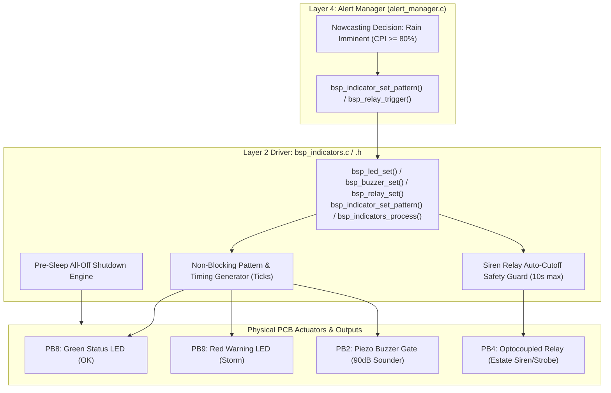

# Task Specification: S3-T3.2 - Board Indicators & Alarm Actuator Driver

## 1. Task Metadata & Overview

| Attribute | Specification Details |
| :--- | :--- |
| **Sprint** | **Sprint 3: Core MCU Architecture, BSP & Power Management** |
| **Task ID** | `S3-T3.2` |
| **Parent Task** | `S3-T3: Implement Switched Sensor Power Rails & Board Indicators` |
| **Task Title** | Implement Board Status LEDs, Piezo Buzzer, and Alert Relay Actuator Driver |
| **Status** | **Ready for Implementation** |
| **Target Files** | [`firmware/drivers/inc/bsp_indicators.h`](file:///C:/Users/ENERGY%20SAVER/Documents/Learning/Job%20Projects/rain-predict/firmware/drivers/inc/bsp_indicators.h)<br>[`firmware/drivers/src/bsp_indicators.c`](file:///C:/Users/ENERGY%20SAVER/Documents/Learning/Job%20Projects/rain-predict/firmware/drivers/src/bsp_indicators.c) |
| **Related Documents** | [`docs/hardware/schematics-and-pinout.md`](file:///C:/Users/ENERGY%20SAVER/Documents/Learning/Job%20Projects/rain-predict/docs/hardware/schematics-and-pinout.md)<br>[`docs/architecture/firmware-architecture.md`](file:///C:/Users/ENERGY%20SAVER/Documents/Learning/Job%20Projects/rain-predict/docs/architecture/firmware-architecture.md)<br>[`docs/architecture/power-architecture.md`](file:///C:/Users/ENERGY%20SAVER/Documents/Learning/Job%20Projects/rain-predict/docs/architecture/power-architecture.md)<br>[`context/specs/s3-t1.1-gpio-pin-mappings.md`](file:///C:/Users/ENERGY%20SAVER/Documents/Learning/Job%20Projects/rain-predict/context/specs/s3-t1.1-gpio-pin-mappings.md)<br>[`context/specs/s1-t2.4-mock-gpio.md`](file:///C:/Users/ENERGY%20SAVER/Documents/Learning/Job%20Projects/rain-predict/context/specs/s1-t2.4-mock-gpio.md)<br>[`context/coding-standards.md`](file:///C:/Users/ENERGY%20SAVER/Documents/Learning/Job%20Projects/rain-predict/context/coding-standards.md) |
| **Dependencies** | [`S3-T1.1`](file:///C:/Users/ENERGY%20SAVER/Documents/Learning/Job%20Projects/rain-predict/context/specs/s3-t1.1-gpio-pin-mappings.md) (Board Pinout & GPIO Configurations) |
| **Downstream Tasks** | `S6-T2` (Local Alert Manager & Actuation), `S6-T3` (Application State Machine Alert Dispatch) |

---

## 2. Executive Summary & Architectural Scope

The primary objective of **`S3-T3.2`** is to develop the board indicator and alarm actuation driver ([`firmware/drivers/inc/bsp_indicators.h`](file:///C:/Users/ENERGY%20SAVER/Documents/Learning/Job%20Projects/rain-predict/firmware/drivers/inc/bsp_indicators.h) and [`firmware/drivers/src/bsp_indicators.c`](file:///C:/Users/ENERGY%20SAVER/Documents/Learning/Job%20Projects/rain-predict/firmware/drivers/src/bsp_indicators.c)) for the **Tea Plantation Rain Prediction System**.

In rugged, remote tea plantation environments, edge nowcasts must provide immediate, high-visibility feedback to field supervisors, plucking teams, and spraying crews without requiring handheld receivers or cloud access:
1. **Visual State LEDs**:
   - **Green Status LED (`PB8` / `LED_STATUS_OK`)**: Emits low-duty heartbeat pulses in fair weather ($CPI < 30\%$).
   - **Red Warning LED (`PB9` / `LED_WARN_RAIN`)**: Rapidly flashes high-intensity strobe pulses during imminent convective storm events ($CPI \ge 80\%$).
   - **Amber Combination**: Simultaneous green/red illumination during unsettled watch states ($30\% \le CPI < 60\%$).
2. **Audible Piezoelectric Buzzer (`PB2` / `PIN_BUZZER`)**:
   - Drives a $90\text{dB} @ 10\text{cm}$ sounder via an N-MOSFET gate for distinct chirp sequences (e.g. triple alert burst).
3. **Estate Siren & Warning Relay (`PB4` / `PIN_RELAY`)**:
   - Drives an optocoupled relay switch controlling an external $12\text{V}/24\text{V}$ estate horn, siren, or motorized strobe with programmable timed auto-shutoff (e.g., $10\text{s}$ blast).



### Critical Field Operation & Safety Mandates:

1. **Non-Blocking Pattern Generation**:
   - Indicator flashing (strobe, blink, breathe, chirp) is driven by a periodic non-blocking service tick (`bsp_indicators_process(delta_ms)`).
   - **Zero Busy-Waits**: No `HAL_Delay()` calls are permitted inside pattern generation to ensure deterministic state machine execution and uninterrupted radio/sensor workflows.
2. **Hardware Relay Auto-Cutoff Safety Guard**:
   - Outdoor high-power sirens and motorized strobes consume heavy battery current ($> 500\text{ mA}$).
   - The driver enforces a strict, hardware-enforced software maximum on-time guard (`BSP_RELAY_MAX_PULSE_DURATION_MS = 10,000ms`), automatically de-energizing the relay after the timeout even if higher application layers crash or freeze.
3. **Low-Power Deep Sleep Pre-Conditioning**:
   - Prior to entering Stop 2 sleep ($< 3.0\,\mu\text{A}$), `bsp_indicators_all_off()` drives all output gates (`PB8`, `PB9`, `PB2`, `PB4`) firmly to ground (`RESET`), guaranteeing zero active leakage.

---

## 3. Actuator Hardware & Electrical Specifications

In accordance with [`docs/hardware/schematics-and-pinout.md`](file:///C:/Users/ENERGY%20SAVER/Documents/Learning/Job%20Projects/rain-predict/docs/hardware/schematics-and-pinout.md):

### 3.1 Actuator Pin Allocation Table

| Actuator Channel | MCU Pin | Pin Mode | Drive Topology | Active State | Default State | Max Current | Connected Hardware |
| :--- | :---: | :---: | :---: | :---: | :---: | :---: | :--- |
| **Status LED Green** | `PB8` | Output PP | High-Side Push-Pull | **HIGH (ON)** | LOW (OFF) | $4.0\text{ mA}$ | Green SMD LED + $470\,\Omega$ resistor |
| **Warning LED Red** | `PB9` | Output PP | High-Side Push-Pull | **HIGH (ON)** | LOW (OFF) | $4.0\text{ mA}$ | Red SMD LED + $330\,\Omega$ resistor |
| **Piezo Buzzer Gate** | `PB2` | Output PP | N-MOSFET Gate (2N7002) | **HIGH (Sound)** | LOW (Silent) | $< 15\text{ mA}$ | 3.3V Piezoelectric Transducer ($90\text{dB}$) |
| **Alert Relay Gate** | `PB4` | Output PP | Optocoupler Gate (PC817) | **HIGH (Energize)**| LOW (De-energize)| $< 10\text{ mA}$ | 10A SPDT Relay / $12\text{V}$ Estate Siren Rail |

### 3.2 Standard Indicator Flash & Sound Patterns

| Pattern Identifier | Visual Output (LEDs) | Audible Output (Buzzer) | Relay State | Agronomic Context |
| :--- | :--- | :--- | :---: | :--- |
| **`INDICATOR_PATTERN_OFF`** | All Off | Silent | De-energized | Deep sleep / Idle state. |
| **`INDICATOR_PATTERN_HEARTBEAT`**| Green $50\text{ms}$ pulse every $5\text{s}$ | Silent | De-energized | Fair weather ($CPI < 30\%$), node healthy. |
| **`INDICATOR_PATTERN_WATCH`** | Amber ($500\text{ms}$ ON / $500\text{ms}$ OFF) | 1 chirp every $10\text{s}$ | De-energized | Unsettled weather ($30\% \le CPI < 60\%$). |
| **`INDICATOR_PATTERN_WARNING`** | Red ($200\text{ms}$ ON / $200\text{ms}$ OFF) | Rapid double chirp | De-energized | Rain likely ($60\% \le CPI < 80\%$). |
| **`INDICATOR_PATTERN_STORM_ALERT`**| Red rapid strobe ($100\text{ms}$ ON/OFF) | Continuous burst | **$10\text{s}$ Pulse** | Rain imminent ($CPI \ge 80\%$) / Severe squall. |

---

## 4. Public API Specification (`bsp_indicators.h`)

| Function Prototype | Description |
| :--- | :--- |
| `status_t bsp_indicators_init(void)` | Initializes GPIO pins (`PB8`, `PB9`, `PB2`, `PB4`) and resets all actuators to safe OFF states. |
| `void bsp_led_set(bsp_led_t led, bool state)` | Directly controls an individual status LED (Green or Red). |
| `void bsp_led_toggle(bsp_led_t led)` | Directly toggles an individual status LED. |
| `void bsp_buzzer_set(bool state)` | Directly drives piezoelectric buzzer gate ON (`true`) or OFF (`false`). |
| `void bsp_relay_set(bool state)` | Directly drives alert relay gate ON (`true`) or OFF (`false`). |
| `status_t bsp_relay_trigger_timed(uint32_t duration_ms)` | Energizes alert relay with an automatic hardware/software cutoff after `duration_ms` (max $10\text{s}$). |
| `status_t bsp_indicator_set_pattern(bsp_indicator_pattern_t pattern)` | Configures the non-blocking autonomous visual and audible pattern generator. |
| `void bsp_indicators_process(uint32_t delta_ms)` | Non-blocking periodic service routine updating pattern timings and relay auto-cutoff timers. |
| `status_t bsp_indicators_all_off(void)` | De-energizes all visual and audible actuators simultaneously prior to deep sleep entry. |

---

## 5. Concrete File Implementation Blueprint

### 5.1 `firmware/drivers/inc/bsp_indicators.h` Blueprint

```c
/**
 * @file    bsp_indicators.h
 * @brief   Board indicator and alarm actuator driver for STM32WLE5 SoC.
 * @details Non-blocking controller for LEDs (PB8/PB9), Buzzer (PB2), and Siren Relay (PB4).
 */

#ifndef BSP_INDICATORS_H
#define BSP_INDICATORS_H

#ifdef __cplusplus
extern "C" {
#endif

#include <stdint.h>
#include <stdbool.h>
#include <stddef.h>

#include "board_config.h"

/* ============================================================================
 * Indicator Types & Pattern Definitions
 * ============================================================================ */

typedef enum {
    BSP_LED_GREEN = 0,   /**< Status LED Green (PB8) */
    BSP_LED_RED   = 1,   /**< Warning LED Red (PB9) */
    BSP_LED_MAX
} bsp_led_t;

typedef enum {
    BSP_INDICATOR_PATTERN_OFF = 0,      /**< All indicators silenced and dark */
    BSP_INDICATOR_PATTERN_HEARTBEAT,    /**< Green pulse (50ms) every 5 seconds */
    BSP_INDICATOR_PATTERN_WATCH,        /**< Amber slow blink (500ms ON / 500ms OFF) */
    BSP_INDICATOR_PATTERN_WARNING,      /**< Red medium blink (200ms ON / 200ms OFF) + double chirp */
    BSP_INDICATOR_PATTERN_STORM_ALERT   /**< Red rapid strobe (100ms ON/OFF) + siren burst */
} bsp_indicator_pattern_t;

#define BSP_RELAY_MAX_PULSE_DURATION_MS     10000U  /**< Maximum siren relay on-time: 10 seconds */
#define BSP_RELAY_DEFAULT_PULSE_MS          5000U   /**< Default alert siren pulse: 5 seconds */

/* ============================================================================
 * Public Driver API Prototypes
 * ============================================================================ */

/**
 * @brief  Initializes indicator GPIOs (PB8, PB9, PB2, PB4) and clears all active states.
 * @return status_t STATUS_OK on success.
 */
status_t bsp_indicators_init(void);

/**
 * @brief  Directly controls the state of a status LED.
 * @param[in] led   LED identifier (BSP_LED_GREEN or BSP_LED_RED).
 * @param[in] state true for ON, false for OFF.
 */
void bsp_led_set(bsp_led_t led, bool state);

/**
 * @brief  Toggles the state of a status LED.
 * @param[in] led LED identifier.
 */
void bsp_led_toggle(bsp_led_t led);

/**
 * @brief  Directly drives the piezoelectric buzzer gate.
 * @param[in] state true to sound buzzer, false to silence.
 */
void bsp_buzzer_set(bool state);

/**
 * @brief  Directly controls the alert relay gate.
 * @param[in] state true to energize relay, false to de-energize.
 */
void bsp_relay_set(bool state);

/**
 * @brief  Energizes alert relay for a timed duration with automatic safety shutoff.
 * @param[in] duration_ms Pulse duration in ms (clamped to BSP_RELAY_MAX_PULSE_DURATION_MS).
 * @return status_t STATUS_OK on success.
 */
status_t bsp_relay_trigger_timed(uint32_t duration_ms);

/**
 * @brief  Configures the active non-blocking indicator pattern.
 * @param[in] pattern Desired indicator operational pattern.
 * @return status_t STATUS_OK on success.
 */
status_t bsp_indicator_set_pattern(bsp_indicator_pattern_t pattern);

/**
 * @brief  Non-blocking periodic update routine for pattern animation and relay timeout.
 * @param[in] delta_ms Time elapsed in milliseconds since last update call.
 */
void bsp_indicators_process(uint32_t delta_ms);

/**
 * @brief  De-energizes all indicators and alert actuators prior to deep sleep entry.
 * @return status_t STATUS_OK on success.
 */
status_t bsp_indicators_all_off(void);

#ifdef __cplusplus
}
#endif

#endif /* BSP_INDICATORS_H */
```

---

### 5.2 `firmware/drivers/src/bsp_indicators.c` Reference Blueprint

```c
/**
 * @file    bsp_indicators.c
 * @brief   Implementation of Non-Blocking Indicator Pattern and Actuator Driver.
 */

#include "bsp_indicators.h"

#if defined(STM32WLE5xx) || defined(USE_HAL_DRIVER)

typedef struct {
    bsp_indicator_pattern_t pattern;
    uint32_t                pattern_timer_ms;
    uint32_t                relay_timer_ms;
    bool                    relay_active;
} indicator_state_t;

static indicator_state_t s_state;

status_t bsp_indicators_init(void) {
    __HAL_RCC_GPIOB_CLK_ENABLE();

    GPIO_InitTypeDef gpio_init = {0};

    /* Configure PB8 (LED_OK), PB9 (LED_WARN), PB2 (BUZZER), PB4 (RELAY) */
    HAL_GPIO_WritePin(GPIOB, PIN_LED_OK_PIN | PIN_LED_WARN_PIN | PIN_BUZZER_PIN | PIN_RELAY_PIN, GPIO_PIN_RESET);
    gpio_init.Pin   = PIN_LED_OK_PIN | PIN_LED_WARN_PIN | PIN_BUZZER_PIN | PIN_RELAY_PIN;
    gpio_init.Mode  = GPIO_MODE_OUTPUT_PP;
    gpio_init.Pull  = GPIO_NOPULL;
    gpio_init.Speed = GPIO_SPEED_FREQ_LOW;
    HAL_GPIO_Init(GPIOB, &gpio_init);

    s_state.pattern          = BSP_INDICATOR_PATTERN_OFF;
    s_state.pattern_timer_ms = 0;
    s_state.relay_timer_ms   = 0;
    s_state.relay_active     = false;

    return STATUS_OK;
}

void bsp_led_set(bsp_led_t led, bool state) {
    GPIO_PinState pin_state = state ? GPIO_PIN_SET : GPIO_PIN_RESET;
    if (led == BSP_LED_GREEN) {
        HAL_GPIO_WritePin(PIN_LED_OK_PORT, PIN_LED_OK_PIN, pin_state);
    } else if (led == BSP_LED_RED) {
        HAL_GPIO_WritePin(PIN_LED_WARN_PORT, PIN_LED_WARN_PIN, pin_state);
    }
}

void bsp_led_toggle(bsp_led_t led) {
    if (led == BSP_LED_GREEN) {
        HAL_GPIO_TogglePin(PIN_LED_OK_PORT, PIN_LED_OK_PIN);
    } else if (led == BSP_LED_RED) {
        HAL_GPIO_TogglePin(PIN_LED_WARN_PORT, PIN_LED_WARN_PIN);
    }
}

void bsp_buzzer_set(bool state) {
    HAL_GPIO_WritePin(PIN_BUZZER_PORT, PIN_BUZZER_PIN, state ? GPIO_PIN_SET : GPIO_PIN_RESET);
}

void bsp_relay_set(bool state) {
    HAL_GPIO_WritePin(PIN_RELAY_PORT, PIN_RELAY_PIN, state ? GPIO_PIN_SET : GPIO_PIN_RESET);
    s_state.relay_active = state;
    if (!state) {
        s_state.relay_timer_ms = 0;
    }
}

status_t bsp_relay_trigger_timed(uint32_t duration_ms) {
    if (duration_ms == 0) {
        bsp_relay_set(false);
        return STATUS_OK;
    }

    /* Clamp to maximum allowed pulse duration */
    uint32_t pulse_len = (duration_ms > BSP_RELAY_MAX_PULSE_DURATION_MS) ?
                          BSP_RELAY_MAX_PULSE_DURATION_MS : duration_ms;

    s_state.relay_timer_ms = pulse_len;
    bsp_relay_set(true);
    return STATUS_OK;
}

status_t bsp_indicator_set_pattern(bsp_indicator_pattern_t pattern) {
    s_state.pattern = pattern;
    s_state.pattern_timer_ms = 0;

    if (pattern == BSP_INDICATOR_PATTERN_OFF) {
        bsp_indicators_all_off();
    }
    return STATUS_OK;
}

void bsp_indicators_process(uint32_t delta_ms) {
    /* 1. Handle timed relay auto-cutoff */
    if (s_state.relay_active) {
        if (delta_ms >= s_state.relay_timer_ms) {
            bsp_relay_set(false);
        } else {
            s_state.relay_timer_ms -= delta_ms;
        }
    }

    /* 2. Process non-blocking indicator patterns */
    s_state.pattern_timer_ms += delta_ms;

    switch (s_state.pattern) {
        case BSP_INDICATOR_PATTERN_HEARTBEAT: {
            /* 50ms Green pulse every 5000ms */
            uint32_t cycle = s_state.pattern_timer_ms % 5000U;
            bsp_led_set(BSP_LED_GREEN, (cycle < 50U));
            bsp_led_set(BSP_LED_RED, false);
            bsp_buzzer_set(false);
            break;
        }

        case BSP_INDICATOR_PATTERN_WATCH: {
            /* 500ms Amber blink (Green + Red) */
            uint32_t cycle = s_state.pattern_timer_ms % 1000U;
            bool on = (cycle < 500U);
            bsp_led_set(BSP_LED_GREEN, on);
            bsp_led_set(BSP_LED_RED, on);
            /* Chirp for 50ms at start of each 10s window */
            uint32_t sound_cycle = s_state.pattern_timer_ms % 10000U;
            bsp_buzzer_set(sound_cycle < 50U);
            break;
        }

        case BSP_INDICATOR_PATTERN_WARNING: {
            /* 200ms Red blink */
            uint32_t cycle = s_state.pattern_timer_ms % 400U;
            bsp_led_set(BSP_LED_GREEN, false);
            bsp_led_set(BSP_LED_RED, (cycle < 200U));
            /* Double chirp */
            uint32_t sound_cycle = s_state.pattern_timer_ms % 2000U;
            bool chirp = (sound_cycle < 60U) || (sound_cycle >= 120U && sound_cycle < 180U);
            bsp_buzzer_set(chirp);
            break;
        }

        case BSP_INDICATOR_PATTERN_STORM_ALERT: {
            /* 100ms Red rapid strobe */
            uint32_t cycle = s_state.pattern_timer_ms % 200U;
            bsp_led_set(BSP_LED_GREEN, false);
            bsp_led_set(BSP_LED_RED, (cycle < 100U));
            bsp_buzzer_set(cycle < 100U);
            break;
        }

        case BSP_INDICATOR_PATTERN_OFF:
        default:
            bsp_led_set(BSP_LED_GREEN, false);
            bsp_led_set(BSP_LED_RED, false);
            bsp_buzzer_set(false);
            break;
    }
}

status_t bsp_indicators_all_off(void) {
    bsp_led_set(BSP_LED_GREEN, false);
    bsp_led_set(BSP_LED_RED, false);
    bsp_buzzer_set(false);
    bsp_relay_set(false);
    s_state.pattern = BSP_INDICATOR_PATTERN_OFF;
    s_state.pattern_timer_ms = 0;
    return STATUS_OK;
}

#else
/* --- Host Unit Test Stubs --- */
static bool s_mock_leds[2] = {false, false};
static bool s_mock_buzzer = false;
static bool s_mock_relay = false;
static bsp_indicator_pattern_t s_mock_pattern = BSP_INDICATOR_PATTERN_OFF;

status_t bsp_indicators_init(void) {
    s_mock_leds[0] = false;
    s_mock_leds[1] = false;
    s_mock_buzzer = false;
    s_mock_relay = false;
    s_mock_pattern = BSP_INDICATOR_PATTERN_OFF;
    return STATUS_OK;
}

void bsp_led_set(bsp_led_t led, bool state) {
    if (led < BSP_LED_MAX) s_mock_leds[led] = state;
}

void bsp_led_toggle(bsp_led_t led) {
    if (led < BSP_LED_MAX) s_mock_leds[led] = !s_mock_leds[led];
}

void bsp_buzzer_set(bool state) {
    s_mock_buzzer = state;
}

void bsp_relay_set(bool state) {
    s_mock_relay = state;
}

status_t bsp_relay_trigger_timed(uint32_t duration_ms) {
    s_mock_relay = (duration_ms > 0);
    return STATUS_OK;
}

status_t bsp_indicator_set_pattern(bsp_indicator_pattern_t pattern) {
    s_mock_pattern = pattern;
    return STATUS_OK;
}

void bsp_indicators_process(uint32_t delta_ms) {
    (void)delta_ms;
}

status_t bsp_indicators_all_off(void) {
    s_mock_leds[0] = false;
    s_mock_leds[1] = false;
    s_mock_buzzer = false;
    s_mock_relay = false;
    s_mock_pattern = BSP_INDICATOR_PATTERN_OFF;
    return STATUS_OK;
}
#endif
```

---

## 6. Verification & Acceptance Test Plan

To verify the successful completion of **`S3-T3.2`**, the following test cases must be validated:

### 6.1 Verification Test Cases

| Test Case ID | Verification Action | Expected Outcome | Pass/Fail Criteria |
| :--- | :--- | :--- | :--- |
| **TC-S3-T3.2-01** | Header Inclusion & C99 Compilation | Include `bsp_indicators.h` in build tree with strict flags. | 100% warning-free compilation under `-Wall -Wextra -Wpedantic -Werror`. |
| **TC-S3-T3.2-02** | Default Power-On Output States | Call `bsp_indicators_init()` -> check `PB8`, `PB9`, `PB2`, `PB4`. | All pins driven LOW (LEDs dark, Buzzer silent, Relay open). |
| **TC-S3-T3.2-03** | Direct LED Control & Toggle | Call `bsp_led_set(BSP_LED_GREEN, true)` -> verify `PB8` is HIGH. Call `bsp_led_toggle()` -> verify `PB8` is LOW. | Direct GPIO actuation confirmed. |
| **TC-S3-T3.2-04** | Direct Buzzer & Relay Control | Set Buzzer HIGH -> verify `PB2` HIGH. Set Relay HIGH -> verify `PB4` HIGH. | Actuator gate pins verified. |
| **TC-S3-T3.2-05** | Timed Relay Auto-Cutoff | Call `bsp_relay_trigger_timed(500)` -> step `bsp_indicators_process(600)`. | Relay energizes immediately and automatically de-energizes after $500\text{ms}$. |
| **TC-S3-T3.2-06** | Relay Maximum Pulse Clamping | Call `bsp_relay_trigger_timed(30000)` ($30\text{s}$). | Timeout clamped to $10,000\text{ms}$ maximum guard duration. |
| **TC-S3-T3.2-07** | Pattern Animation State Progression | Set `INDICATOR_PATTERN_HEARTBEAT` -> step time in $50\text{ms}$ increments. | Green LED illuminates for first $50\text{ms}$ of each $5000\text{ms}$ cycle. |
| **TC-S3-T3.2-08** | Pre-Sleep Master Shutdown | Trigger all actuators -> call `bsp_indicators_all_off()`. | All outputs immediately de-energized (`PB8/PB9/PB2/PB4` LOW); pattern set to `OFF`. |

---

## 7. Definition of Done (DoD) Checklist

- [ ] [`firmware/drivers/inc/bsp_indicators.h`](file:///C:/Users/ENERGY%20SAVER/Documents/Learning/Job%20Projects/rain-predict/firmware/drivers/inc/bsp_indicators.h) created adhering to C99 standards with complete Doxygen documentation.
- [ ] [`firmware/drivers/src/bsp_indicators.c`](file:///C:/Users/ENERGY%20SAVER/Documents/Learning/Job%20Projects/rain-predict/firmware/drivers/src/bsp_indicators.c) implemented with STM32CubeWL HAL GPIO actuation and host stubs.
- [ ] Direct control functions for Green LED (`PB8`), Red LED (`PB9`), Buzzer (`PB2`), and Relay (`PB4`).
- [ ] Non-blocking indicator pattern generator (`Heartbeat`, `Watch`, `Warning`, `Storm Alert`) implemented without busy-waits.
- [ ] Timed alert relay auto-cutoff with $10\text{s}$ maximum clamp protection implemented.
- [ ] Master shutdown function (`bsp_indicators_all_off`) implemented for low-power sleep transitions.
- [ ] Zero dynamic memory allocation (`malloc`/`free` prohibited).
- [ ] Spec document registered and linked under [`context/specs/spec-roadmap.md`](file:///C:/Users/ENERGY%20SAVER/Documents/Learning/Job%20Projects/rain-predict/context/specs/spec-roadmap.md#L214).
