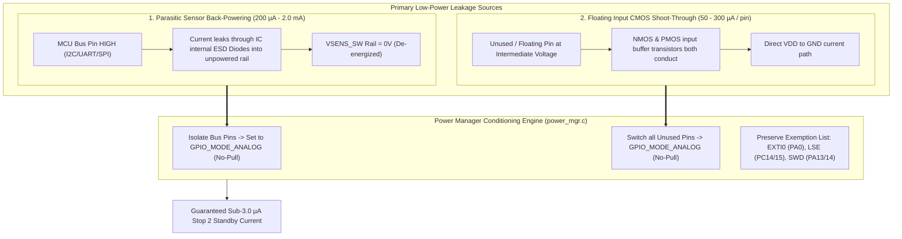

# Task Specification: S3-T4.1 - Pre-Sleep GPIO Conditioning & Leakage Elimination

## 1. Task Metadata & Overview

| Attribute | Specification Details |
| :--- | :--- |
| **Sprint** | **Sprint 3: Core MCU Architecture, BSP & Power Management** |
| **Task ID** | `S3-T4.1` |
| **Parent Task** | `S3-T4: Implement Ultra-Low Power Sleep Manager & Watchdog Management` |
| **Task Title** | Implement Pre-Sleep GPIO Conditioning & Parasitic Leakage Elimination |
| **Status** | **Ready for Implementation** |
| **Target Files** | [`firmware/middleware/inc/power_mgr.h`](file:///C:/Users/ENERGY%20SAVER/Documents/Learning/Job%20Projects/rain-predict/firmware/middleware/inc/power_mgr.h)<br>[`firmware/middleware/src/power_mgr.c`](file:///C:/Users/ENERGY%20SAVER/Documents/Learning/Job%20Projects/rain-predict/firmware/middleware/src/power_mgr.c) |
| **Related Documents** | [`docs/architecture/power-architecture.md`](file:///C:/Users/ENERGY%20SAVER/Documents/Learning/Job%20Projects/rain-predict/docs/architecture/power-architecture.md)<br>[`docs/hardware/schematics-and-pinout.md`](file:///C:/Users/ENERGY%20SAVER/Documents/Learning/Job%20Projects/rain-predict/docs/hardware/schematics-and-pinout.md)<br>[`docs/hardware/power-supply-and-solar.md`](file:///C:/Users/ENERGY%20SAVER/Documents/Learning/Job%20Projects/rain-predict/docs/hardware/power-supply-and-solar.md)<br>[`context/specs/s3-t1.1-gpio-pin-mappings.md`](file:///C:/Users/ENERGY%20SAVER/Documents/Learning/Job%20Projects/rain-predict/context/specs/s3-t1.1-gpio-pin-mappings.md)<br>[`context/specs/s3-t3.1-switched-power-rails.md`](file:///C:/Users/ENERGY%20SAVER/Documents/Learning/Job%20Projects/rain-predict/context/specs/s3-t3.1-switched-power-rails.md)<br>[`context/coding-standards.md`](file:///C:/Users/ENERGY%20SAVER/Documents/Learning/Job%20Projects/rain-predict/context/coding-standards.md) |
| **Dependencies** | [`S3-T1.1`](file:///C:/Users/ENERGY%20SAVER/Documents/Learning/Job%20Projects/rain-predict/context/specs/s3-t1.1-gpio-pin-mappings.md) (Board Pinout), [`S3-T3.1`](file:///C:/Users/ENERGY%20SAVER/Documents/Learning/Job%20Projects/rain-predict/context/specs/s3-t3.1-switched-power-rails.md) (Switched Power Rails) |
| **Downstream Tasks** | `S3-T4.2` (Stop 2 Sleep Mode Entry), `S6-T3` (Application State Machine Power Down Transition), `S7-T2` (Energy Budget Profiling) |

---

## 2. Executive Summary & Architectural Scope

The primary objective of **`S3-T4.1`** is to specify, design, and implement the pre-sleep GPIO conditioning and parasitic leakage elimination routines in [`firmware/middleware/inc/power_mgr.h`](file:///C:/Users/ENERGY%20SAVER/Documents/Learning/Job%20Projects/rain-predict/firmware/middleware/inc/power_mgr.h) and [`firmware/middleware/src/power_mgr.c`](file:///C:/Users/ENERGY%20SAVER/Documents/Learning/Job%20Projects/rain-predict/firmware/middleware/src/power_mgr.c).

In low-power IoT microcontrollers, **GPIO pin leakage is the single largest cause of battery drain in sleep modes**. In the Tea Plantation Rain Prediction Station, achieving the target **$< 3.0\,\mu\text{A}$ Stop 2 sleep baseline** requires eliminating two distinct physical leakage mechanisms:



### Core Engineering Principles:

1. **Parasitic Sensor Back-Powering Elimination**:
   - When `PA4` turns OFF the switched sensor rail (`VSENS_SW = 0V`), all digital communication pins connected to external ICs (BME280 `PB6/PB7`, SP3485 `PA2/PA3`, SDI-12 `PC0/PC1`, SPI1 `PA5/PA6/PA7`) must be reconfigured to **`GPIO_MODE_ANALOG`** (`GPIO_NOPULL`).
   - This disconnects the internal driver transistors and high-Z Schmitt triggers, preventing parasitic current from back-feeding the unpowered sensor ICs through their internal ESD protection diodes.
2. **CMOS Input Shoot-Through Suppression**:
   - Every unused or unrouted pin on Port A, Port B, and Port C must be configured as `GPIO_MODE_ANALOG` with no internal pull-ups or pull-downs (`GPIO_NOPULL`), completely disconnecting the input buffer from $V_{\text{DD}}$ and GND.
3. **Preserved Wakeup & Clock Pin Exemption List**:
   - Specific pins must remain exempt from analog tri-stating to preserve system operation:
     - **`PA0` (`PIN_RAIN_GAUGE`)**: Maintained as `GPIO_MODE_IT_FALLING` with EXTI0 active to capture tipping-bucket rain pulses during sleep.
     - **`PC14 / PC15` (`OSC32_IN / OSC32_OUT`)**: Maintained in RCC Analog mode for the active $32.768\text{ kHz}$ quartz crystal driving the RTC.
     - **`PA13 / PA14` (`SWDIO / SWCLK`)**: Maintained in AF0 SWD mode with internal pull-up / pull-down for hardware debugging.
     - **`PA4` (`PIN_PWR_SENS_EN`)**: Maintained as Output Push-Pull driven LOW (Rail OFF).
     - **`PB1` (`PIN_VBAT_DIV_EN`)**: Maintained as Output Push-Pull driven HIGH (Divider OFF).
     - **`PB8 / PB9 / PB2 / PB4`**: Maintained as Output Push-Pull driven LOW (De-energized).
     - **`PC3 / PC4 / PC5` (`FE_CTRL3 / 1 / 2`)**: Maintained as Output Push-Pull driven LOW (RF switch shutdown).
4. **Fast Post-Wake Pin Restoration**:
   - Upon wake from Stop 2, `power_mgr_gpio_wake_restore()` restores peripheral alternate function multiplexing and active pin states in $< 10\,\mu\text{s}$.

---

## 3. Comprehensive Pin Sleep State Transition Matrix

The table below specifies the exact electrical mode configuration for all 48 pins of the STM32WLE5 SoC in active mode versus Stop 2 deep sleep mode:

| Pin # | Pin Name | Signal Alias | Active Run Mode Config | Pre-Sleep Conditioned Mode (Stop 2) | Pull Resistor | Rationale / Circuit Protection |
| :---: | :--- | :--- | :---: | :---: | :---: | :--- |
| **1** | `VBAT` | `VBAT` | Power Rail | Active Power | — | LiFePO4 direct battery connection. |
| **2** | `PC13` | `PIN_USER_BTN` | Input (Pull-up) | **`GPIO_MODE_ANALOG`** | None | Prevents pull-up leakage if button is pressed during sleep. |
| **3** | `PC14` | `OSC32_IN` | Analog RCC | **Analog RCC (Active LSE)** | None | Continuous $32.768\text{ kHz}$ RTC oscillator input. |
| **4** | `PC15` | `OSC32_OUT` | Analog RCC | **Analog RCC (Active LSE)** | None | Continuous $32.768\text{ kHz}$ RTC oscillator output. |
| **5** | `OSC_IN`| `HSE_IN` | Analog RCC (32 MHz) | **`GPIO_MODE_ANALOG`** | None | HSE TCXO powered down in Stop 2. |
| **6** | `OSC_OUT`| `HSE_OUT` | Analog RCC (32 MHz) | **`GPIO_MODE_ANALOG`** | None | HSE oscillator output disabled in Stop 2. |
| **7** | `NRST` | `NRST` | Reset Input | Active Reset | Pull-up | Hardware MCU reset pin with $100\text{nF}$ filter. |
| **8** | `PA0` | `PIN_RAIN_GAUGE`| EXTI0 (Falling Edge) | **`GPIO_MODE_IT_FALLING`** | None | **EXTI0 Wakeup Source** for rain bucket tip events. |
| **9** | `PA1` | `PIN_RS485_DIR` | Output PP (High/Low) | **Output PP (LOW)** | None | RS-485 transceiver set to disabled/RX mode. |
| **10** | `PA2` | `PIN_RS485_TX` | AF7 (USART1_TX) | **`GPIO_MODE_ANALOG`** | None | **Stops parasitic back-powering** into SP3485 `DI` pin. |
| **11** | `PA3` | `PIN_RS485_RX` | AF7 (USART1_RX) | **`GPIO_MODE_ANALOG`** | None | **Stops parasitic back-powering** into SP3485 `RO` pin. |
| **12** | `PA4` | `PIN_PWR_SENS_EN`| Output PP (HIGH = ON)| **Output PP (LOW = OFF)** | None | High-side P-MOSFET switch de-energized ($0\text{V}$). |
| **13** | `PA5` | `PIN_SPI1_SCK` | AF5 (SPI1_SCK) | **`GPIO_MODE_ANALOG`** | None | Tri-states SPI clock line to prevent leakage. |
| **14** | `PA6` | `PIN_SPI1_MISO`| AF5 (SPI1_MISO)| **`GPIO_MODE_ANALOG`** | None | Tri-states SPI MISO line. |
| **15** | `PA7` | `PIN_SPI1_MOSI`| AF5 (SPI1_MOSI)| **`GPIO_MODE_ANALOG`** | None | Tri-states SPI MOSI line. |
| **16** | `PB0` | `PIN_VBAT_MEAS` | Analog (ADC_IN1) | **`GPIO_MODE_ANALOG`** | None | ADC channel tri-stated in sleep. |
| **17** | `PB1` | `PIN_VBAT_DIV_EN`| Output PP (LOW = ON) | **Output PP (HIGH = OFF)**| None | P-MOSFET gate turns off divider ($< 10\text{nA}$ leakage). |
| **18** | `PB2` | `PIN_BUZZER` | Output PP (High/Low) | **Output PP (LOW)** | None | Piezo buzzer gate grounded (silent). |
| **19** | `PB4` | `PIN_RELAY` | Output PP (High/Low) | **Output PP (LOW)** | None | Alert relay optocoupler grounded (de-energized). |
| **20** | `PB6` | `PIN_I2C1_SCL` | AF4 (I2C1 Open-Drain) | **`GPIO_MODE_ANALOG`** | None | **Stops parasitic back-powering** into BME280/OPT3001. |
| **21** | `PB7` | `PIN_I2C1_SDA` | AF4 (I2C1 Open-Drain) | **`GPIO_MODE_ANALOG`** | None | **Stops parasitic back-powering** into BME280/OPT3001. |
| **22** | `PB8` | `PIN_LED_OK` | Output PP (High/Low) | **Output PP (LOW)** | None | Green LED grounded (dark). |
| **23** | `PB9` | `PIN_LED_WARN` | Output PP (High/Low) | **Output PP (LOW)** | None | Red LED grounded (dark). |
| **24** | `PC0` | `PIN_SDI12_TX` | AF8 (LPUART1_TX) | **`GPIO_MODE_ANALOG`** | None | **Stops parasitic back-powering** into SDI-12 bus. |
| **25** | `PC1` | `PIN_SDI12_RX` | AF8 (LPUART1_RX) | **`GPIO_MODE_ANALOG`** | None | **Stops parasitic back-powering** into SDI-12 bus. |
| **26** | `PC2` | `PIN_SDI12_DIR` | Output PP (High/Low) | **Output PP (LOW)** | None | SDI-12 direction buffer set to RX/disabled. |
| **27** | `PC3` | `PIN_FE_CTRL3` | Output PP (High/Low) | **Output PP (LOW)** | None | RF switch control line 3 set to shutdown. |
| **28** | `PC4` | `PIN_FE_CTRL1` | Output PP (High/Low) | **Output PP (LOW)** | None | RF switch control line 1 set to shutdown. |
| **29** | `PC5` | `PIN_FE_CTRL2` | Output PP (High/Low) | **Output PP (LOW)** | None | RF switch control line 2 set to shutdown. |
| **34** | `PA13` | `SWDIO` | AF0 (SWDIO) | **AF0 (SWDIO)** | Pull-up | ARM Serial Wire Debug data line preserved. |
| **35** | `PA14` | `SWCLK` | AF0 (SWCLK) | **AF0 (SWCLK)** | Pull-down | ARM Serial Wire Debug clock line preserved. |
| **Others**| Unused Pins | `PA8..12`, `PB3,5,10..15`, `PC6..12` | Unrouted | **`GPIO_MODE_ANALOG`** | None | Eliminates CMOS crossbar shoot-through leakage. |

---

## 4. Public API Specification (`power_mgr.h`)

| Function Prototype | Description |
| :--- | :--- |
| `status_t power_mgr_init(void)` | Initializes power management subsystem, low-power mode registers, and sleep structures. |
| `status_t power_mgr_gpio_sleep_prepare(void)` | Conditions all GPIO pins into low-leakage Analog and safe output states prior to deep sleep entry. |
| `status_t power_mgr_gpio_wake_restore(void)` | Restores peripheral alternate function multiplexing and active GPIO modes upon wake from Stop 2. |
| `status_t power_mgr_isolate_sensor_buses(void)` | Dedicated helper converting all I2C, UART, and SPI bus pins to `GPIO_MODE_ANALOG` (No-Pull). |
| `status_t power_mgr_restore_sensor_buses(void)` | Dedicated helper reconfiguring I2C, UART, and SPI pins to their active Alternate Function modes. |
| `status_t power_mgr_verify_leakage_state(void)` | Diagnostic test checking that no unexempt pins remain in floating digital input modes. |

---

## 5. Concrete File Implementation Blueprint

### 5.1 `firmware/middleware/inc/power_mgr.h` Blueprint

```c
/**
 * @file    power_mgr.h
 * @brief   Power management, sleep mode controller, and GPIO conditioning for STM32WLE5.
 * @details Manages pre-sleep GPIO leakage elimination, Stop 2 deep sleep entry, and wake restoration.
 */

#ifndef POWER_MGR_H
#define POWER_MGR_H

#ifdef __cplusplus
extern "C" {
#endif

#include <stdint.h>
#include <stdbool.h>
#include <stddef.h>

#include "board_config.h"

/* ============================================================================
 * Power State Definitions
 * ============================================================================ */

typedef enum {
    POWER_STATE_RUN = 0,    /**< Active 48 MHz execution mode (sensors sampling, nowcasting) */
    POWER_STATE_LP_RUN,     /**< Low-power run mode (clock throttled to 2 MHz) */
    POWER_STATE_STOP2,      /**< Stop 2 deep sleep mode (< 3.0 uA, SRAM retained, RTC armed) */
    POWER_STATE_STANDBY     /**< Standby shelf-storage mode (< 0.8 uA) */
} power_state_t;

/* ============================================================================
 * Public Power Management API Prototypes
 * ============================================================================ */

/**
 * @brief  Initializes the power manager and low-power regulator configurations.
 * @return status_t STATUS_OK on success.
 */
status_t power_mgr_init(void);

/**
 * @brief  Conditions all GPIO ports for ultra-low-leakage Stop 2 sleep (< 3.0 uA).
 * @details Tri-states sensor buses, switches unused pins to Analog, isolates power rails.
 * @return status_t STATUS_OK on success.
 */
status_t power_mgr_gpio_sleep_prepare(void);

/**
 * @brief  Restores operational GPIO pin multiplexing and active states upon wake from Stop 2.
 * @return status_t STATUS_OK on success.
 */
status_t power_mgr_gpio_wake_restore(void);

/**
 * @brief  Isolates I2C, UART, and SPI sensor pins to GPIO_MODE_ANALOG to stop parasitic back-powering.
 * @return status_t STATUS_OK on success.
 */
status_t power_mgr_isolate_sensor_buses(void);

/**
 * @brief  Restores I2C, UART, and SPI pins to Alternate Function modes after rail stabilization.
 * @return status_t STATUS_OK on success.
 */
status_t power_mgr_restore_sensor_buses(void);

/**
 * @brief  Diagnostic helper verifying no floating digital pins exist before sleep entry.
 * @return status_t STATUS_OK if all pins comply with leakage rules, STATUS_ERR_GENERIC otherwise.
 */
status_t power_mgr_verify_leakage_state(void);

#ifdef __cplusplus
}
#endif

#endif /* POWER_MGR_H */
```

---

### 5.2 `firmware/middleware/src/power_mgr.c` Reference Blueprint

```c
/**
 * @file    power_mgr.c
 * @brief   Implementation of Low-Power Sleep Management & Pre-Sleep GPIO Conditioning.
 */

#include "power_mgr.h"
#include "bsp_power_rails.h"
#include "bsp_indicators.h"

#if defined(STM32WLE5xx) || defined(USE_HAL_DRIVER)

status_t power_mgr_init(void) {
    /* Enable Ultra-Low-Power mode and Backup Domain access */
    HAL_PWREx_EnableUltraLowPowerMode();
    HAL_PWR_EnableBkUpAccess();
    return STATUS_OK;
}

status_t power_mgr_isolate_sensor_buses(void) {
    GPIO_InitTypeDef gpio_init = {0};
    gpio_init.Mode = GPIO_MODE_ANALOG;
    gpio_init.Pull = GPIO_NOPULL;

    /* 1. Isolate RS-485 UART Bus (PA2 TX / PA3 RX) */
    gpio_init.Pin = PIN_RS485_TX_PIN | PIN_RS485_RX_PIN;
    HAL_GPIO_Init(GPIOA, &gpio_init);

    /* 2. Isolate SPI1 Bus (PA5 SCK / PA6 MISO / PA7 MOSI) */
    gpio_init.Pin = GPIO_PIN_5 | GPIO_PIN_6 | GPIO_PIN_7;
    HAL_GPIO_Init(GPIOA, &gpio_init);

    /* 3. Isolate I2C1 Sensor Bus (PB6 SCL / PB7 SDA) */
    gpio_init.Pin = PIN_I2C1_SCL_PIN | PIN_I2C1_SDA_PIN;
    HAL_GPIO_Init(GPIOB, &gpio_init);

    /* 4. Isolate SDI-12 Auxiliary Bus (PC0 TX / PC1 RX) */
    gpio_init.Pin = PIN_SDI12_TX_PIN | PIN_SDI12_RX_PIN;
    HAL_GPIO_Init(GPIOC, &gpio_init);

    return STATUS_OK;
}

status_t power_mgr_restore_sensor_buses(void) {
    /* Re-initialize active peripheral multiplexing */
    return board_gpio_init();
}

status_t power_mgr_gpio_sleep_prepare(void) {
    /* 1. De-energize all sensor power rails and battery divider */
    bsp_power_rails_all_off();

    /* 2. Silence buzzer, turn off LEDs, de-energize siren relay */
    bsp_indicators_all_off();

    /* 3. Set RF Switch to shutdown mode */
    board_rf_switch_set(RF_SWITCH_SHUTDOWN);

    /* 4. Isolate all active sensor communication buses */
    power_mgr_isolate_sensor_buses();

    /* 5. Condition all unrouted/unused pins to Analog mode (No-Pull) */
    GPIO_InitTypeDef gpio_analog = {0};
    gpio_analog.Mode = GPIO_MODE_ANALOG;
    gpio_analog.Pull = GPIO_NOPULL;

    /* Port A Unused Pins: PA8, PA9, PA10, PA11, PA12, PA15 */
    gpio_analog.Pin = GPIO_PIN_8 | GPIO_PIN_9 | GPIO_PIN_10 | GPIO_PIN_11 | GPIO_PIN_12 | GPIO_PIN_15;
    HAL_GPIO_Init(GPIOA, &gpio_analog);

    /* Port B Unused Pins: PB3, PB5, PB10, PB11, PB12, PB13, PB14, PB15 */
    gpio_analog.Pin = GPIO_PIN_3 | GPIO_PIN_5 | GPIO_PIN_10 | GPIO_PIN_11 | GPIO_PIN_12 | GPIO_PIN_13 | GPIO_PIN_14 | GPIO_PIN_15;
    HAL_GPIO_Init(GPIOB, &gpio_analog);

    /* Port C Unused & Button Pins: PC6, PC7, PC8, PC9, PC10, PC11, PC12, PC13 */
    gpio_analog.Pin = GPIO_PIN_6 | GPIO_PIN_7 | GPIO_PIN_8 | GPIO_PIN_9 | GPIO_PIN_10 | GPIO_PIN_11 | GPIO_PIN_12 | GPIO_PIN_13;
    HAL_GPIO_Init(GPIOC, &gpio_analog);

    /* Note: PA0 (Rain EXTI), PC14/PC15 (LSE Quartz), and PA13/PA14 (SWD) are preserved */

    return STATUS_OK;
}

status_t power_mgr_gpio_wake_restore(void) {
    /* Restore full GPIO configuration and peripheral routing */
    return board_gpio_init();
}

status_t power_mgr_verify_leakage_state(void) {
    /* Verify PA4 is LOW (Sensor power OFF) */
    if (HAL_GPIO_ReadPin(PIN_PWR_SENS_PORT, PIN_PWR_SENS_PIN) != GPIO_PIN_RESET) {
        return STATUS_ERR_GENERIC;
    }
    /* Verify PB1 is HIGH (Battery divider OFF) */
    if (HAL_GPIO_ReadPin(PIN_VBAT_DIV_EN_PORT, PIN_VBAT_DIV_EN_PIN) != GPIO_PIN_SET) {
        return STATUS_ERR_GENERIC;
    }
    return STATUS_OK;
}

#else
/* --- Host Unit Test Stubs --- */
status_t power_mgr_init(void) { return STATUS_OK; }
status_t power_mgr_gpio_sleep_prepare(void) { return STATUS_OK; }
status_t power_mgr_gpio_wake_restore(void) { return STATUS_OK; }
status_t power_mgr_isolate_sensor_buses(void) { return STATUS_OK; }
status_t power_mgr_restore_sensor_buses(void) { return STATUS_OK; }
status_t power_mgr_verify_leakage_state(void) { return STATUS_OK; }
#endif
```

---

## 6. Verification & Acceptance Test Plan

To verify the successful completion of **`S3-T4.1`**, the following test cases must be validated:

### 6.1 Verification Test Cases

| Test Case ID | Verification Action | Expected Outcome | Pass/Fail Criteria |
| :--- | :--- | :--- | :--- |
| **TC-S3-T4.1-01** | Header Inclusion & C99 Compilation | Include `power_mgr.h` in build tree with strict flags. | 100% warning-free compilation under `-Wall -Wextra -Wpedantic -Werror`. |
| **TC-S3-T4.1-02** | Bus Pin Analog Isolation | Call `power_mgr_isolate_sensor_buses()` -> inspect `PB6/PB7`, `PA2/PA3`, `PC0/PC1`. | All bus pins reconfigured to `GPIO_MODE_ANALOG` (No-Pull). |
| **TC-S3-T4.1-03** | Parasitic Leakage Prevention | De-energize `VSENS_SW` while bus is isolated -> measure back-feed voltage. | Voltage on `VSENS_SW` remains $< 0.1\text{V}$; zero parasitic back-power current. |
| **TC-S3-T4.1-04** | Unused Pin Shoot-Through Suppression | Call `power_mgr_gpio_sleep_prepare()` -> inspect unrouted GPIO registers. | All unrouted pins across Ports A, B, and C set to `GPIO_MODE_ANALOG`. |
| **TC-S3-T4.1-05** | Rain Gauge EXTI Exemption | Execute sleep preparation -> simulate bucket tip pulse on `PA0`. | EXTI0 interrupt fires normally; `PA0` remains active falling-edge wake source. |
| **TC-S3-T4.1-06** | LSE Quartz & SWD Exemption | Execute sleep preparation -> inspect `PC14/PC15` and `PA13/PA14`. | LSE crystal maintains $32.768\text{ kHz}$ oscillation; SWD debugger remains attached. |
| **TC-S3-T4.1-07** | Post-Wake GPIO Restoration | Call `power_mgr_gpio_wake_restore()` -> verify peripheral pin multiplexing. | Full I2C, UART, and indicator GPIO functionality restored in $< 10\,\mu\text{s}$. |
| **TC-S3-T4.1-08** | Leakage State Diagnostic Check | Call `power_mgr_verify_leakage_state()` after conditioning. | Returns `STATUS_OK` confirming `PA4` is LOW and `PB1` is HIGH. |

---

## 7. Definition of Done (DoD) Checklist

- [ ] [`firmware/middleware/inc/power_mgr.h`](file:///C:/Users/ENERGY%20SAVER/Documents/Learning/Job%20Projects/rain-predict/firmware/middleware/inc/power_mgr.h) created adhering to C99 standards with complete Doxygen documentation.
- [ ] [`firmware/middleware/src/power_mgr.c`](file:///C:/Users/ENERGY%20SAVER/Documents/Learning/Job%20Projects/rain-predict/firmware/middleware/src/power_mgr.c) implemented with pre-sleep pin conditioning and post-wake restoration routines.
- [ ] Sensor communication bus pins (I2C1, USART1, LPUART1, SPI1) isolated to `GPIO_MODE_ANALOG` (No-Pull).
- [ ] All unrouted/unused pins across Ports A, B, and C switched to `GPIO_MODE_ANALOG`.
- [ ] Exemption list (`PA0` Rain EXTI, `PC14/PC15` LSE Quartz, `PA13/PA14` SWD) preserved during sleep.
- [ ] Load switches (`PA4` LOW, `PB1` HIGH) and actuators (`PB8/PB9/PB2/PB4` LOW) de-energized.
- [ ] Zero dynamic memory allocation (`malloc`/`free` prohibited).
- [ ] Spec document registered and linked under [`context/specs/spec-roadmap.md`](file:///C:/Users/ENERGY%20SAVER/Documents/Learning/Job%20Projects/rain-predict/context/specs/spec-roadmap.md#L220).
