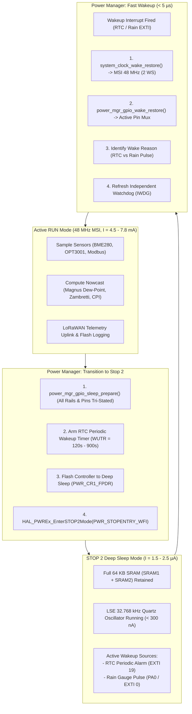
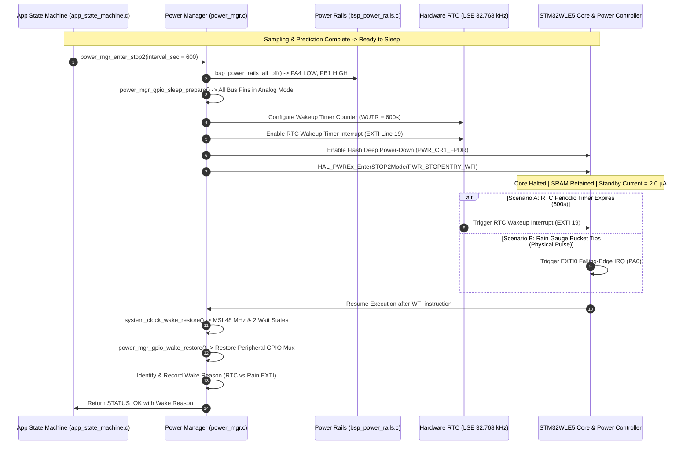

# Task Specification: S3-T4.2 - Stop 2 Low-Power Sleep Manager & RTC Wakeup

## 1. Task Metadata & Overview

| Attribute | Specification Details |
| :--- | :--- |
| **Sprint** | **Sprint 3: Core MCU Architecture, BSP & Power Management** |
| **Task ID** | `S3-T4.2` |
| **Parent Task** | `S3-T4: Implement Ultra-Low Power Sleep Manager & Watchdog Management` |
| **Task Title** | Implement STM32WLE5 Stop 2 Mode Entry with RTC Periodic Wakeup Timer |
| **Status** | **Ready for Implementation** |
| **Target Files** | [`firmware/middleware/inc/power_mgr.h`](file:///C:/Users/ENERGY%20SAVER/Documents/Learning/Job%20Projects/rain-predict/firmware/middleware/inc/power_mgr.h)<br>[`firmware/middleware/src/power_mgr.c`](file:///C:/Users/ENERGY%20SAVER/Documents/Learning/Job%20Projects/rain-predict/firmware/middleware/src/power_mgr.c) |
| **Related Documents** | [`docs/architecture/power-architecture.md`](file:///C:/Users/ENERGY%20SAVER/Documents/Learning/Job%20Projects/rain-predict/docs/architecture/power-architecture.md)<br>[`docs/hardware/power-supply-and-solar.md`](file:///C:/Users/ENERGY%20SAVER/Documents/Learning/Job%20Projects/rain-predict/docs/hardware/power-supply-and-solar.md)<br>[`docs/architecture/firmware-architecture.md`](file:///C:/Users/ENERGY%20SAVER/Documents/Learning/Job%20Projects/rain-predict/docs/architecture/firmware-architecture.md)<br>[`context/specs/s3-t1.2-clock-tree-config.md`](file:///C:/Users/ENERGY%20SAVER/Documents/Learning/Job%20Projects/rain-predict/context/specs/s3-t1.2-clock-tree-config.md)<br>[`context/specs/s3-t4.1-gpio-sleep-conditioning.md`](file:///C:/Users/ENERGY%20SAVER/Documents/Learning/Job%20Projects/rain-predict/context/specs/s3-t4.1-gpio-sleep-conditioning.md)<br>[`context/coding-standards.md`](file:///C:/Users/ENERGY%20SAVER/Documents/Learning/Job%20Projects/rain-predict/context/coding-standards.md) |
| **Dependencies** | [`S3-T1.2`](file:///C:/Users/ENERGY%20SAVER/Documents/Learning/Job%20Projects/rain-predict/context/specs/s3-t1.2-clock-tree-config.md) (Clock Tree), [`S3-T3.1`](file:///C:/Users/ENERGY%20SAVER/Documents/Learning/Job%20Projects/rain-predict/context/specs/s3-t3.1-switched-power-rails.md) (Power Rails), [`S3-T4.1`](file:///C:/Users/ENERGY%20SAVER/Documents/Learning/Job%20Projects/rain-predict/context/specs/s3-t4.1-gpio-sleep-conditioning.md) (Pre-Sleep GPIO Conditioning) |
| **Downstream Tasks** | `S3-T4.3` (Independent Watchdog Integration), `S6-T1` (Adaptive Measurement Scheduler), `S6-T3` (Application State Machine Lifecycle), `S7-T2` (Energy Budget Profiling) |

---

## 2. Executive Summary & Architectural Scope

The primary objective of **`S3-T4.2`** is to develop the ultra-low-power **Stop 2 Mode Sleep Manager** and **RTC Periodic Wakeup Timer** subsystem in [`firmware/middleware/inc/power_mgr.h`](file:///C:/Users/ENERGY%20SAVER/Documents/Learning/Job%20Projects/rain-predict/firmware/middleware/inc/power_mgr.h) and [`firmware/middleware/src/power_mgr.c`](file:///C:/Users/ENERGY%20SAVER/Documents/Learning/Job%20Projects/rain-predict/firmware/middleware/src/power_mgr.c) for the **STMicroelectronics STM32WLE5** SoC.

To achieve $>14$-day zero-sunlight battery survivability on a single $3.2\text{V}$ $2500\text{–}3200\text{ mAh}$ LiFePO4 battery pack, the station must spend **$> 99.7\%$ of its operational lifetime in deep sleep**, consuming **$< 3.0\,\mu\text{A}$** while retaining full SRAM state:



### Core Low-Power Architectural Principles:

1. **Stop 2 Mode Configuration**:
   - High-speed internal (MSI) and external (HSE) oscillators are shut down.
   - Core voltage regulator operates in low-power mode ($V_{\text{CORE}} \approx 0.9\text{V}$).
   - **Full 64 KB SRAM Retention**: Both SRAM1 ($32\text{ KB}$) and SRAM2 ($32\text{ KB}$) remain powered via `PWR_CR3_RRS`, preserving all moving-average history buffers, Zambretti filter states, and LoRaWAN network session keys across sleep cycles without Flash wear.
   - Standby power draw achieves **$1.5\text{–}2.5\,\mu\text{A}$** @ $25^\circ\text{C}$, $3.3\text{V}$.
2. **Low-Speed External (LSE) Clocked RTC Wakeup Timer (WUT)**:
   - Driven by the external $32.768\text{ kHz}$ quartz crystal (`PC14/PC15`).
   - Generates deterministic, hardware-scheduled periodic wakeup interrupts on **EXTI Line 19**.
   - Supports dynamic sampling intervals:
     - **Normal (Fair Weather)**: $10\text{ minutes}$ ($600\text{ s}$) or $15\text{ minutes}$ ($900\text{ s}$).
     - **Watch (Unsettled Weather)**: $5\text{ minutes}$ ($300\text{ s}$).
     - **Alert (Active Storm)**: $2\text{ minutes}$ ($120\text{ s}$).
     - **Battery Preservation Throttling**: $30\text{–}60\text{ minutes}$ when $V_{\text{bat}} < 3.0\text{V}$.
3. **Multi-Source Asynchronous Wakeup Handling**:
   - **RTC Periodic Wakeup (`EXTI19`)**: Standard cyclic meteorological sampling schedule.
   - **Rain Gauge Pulse (`PA0` / `EXTI0`)**: Asynchronous tipping-bucket tip event ($0.2\text{ mm/tip}$) wakes the MCU immediately from deep sleep, increments the pulse counter, evaluates rain rate, and conditionally triggers the 2-minute storm tracking schedule.
4. **Sub-$5\,\mu\text{s}$ Wakeup Latency**:
   - MSI hardware oscillator starts in $< 5\,\mu\text{s}$, scaling directly to $48\text{ MHz}$ without waiting for slow PLL lock loops.

---

## 3. Power Mode Specifications & Current Budget

In accordance with [`docs/architecture/power-architecture.md`](file:///C:/Users/ENERGY%20SAVER/Documents/Learning/Job%20Projects/rain-predict/docs/architecture/power-architecture.md):

### 3.1 Operating States Comparison

| Parameter | RUN Mode (Active) | Low-Power RUN | **STOP 2 Mode (Standby)** | Standby Mode (Storage) |
| :--- | :---: | :---: | :---: | :---: |
| **Core Clock Source** | MSI Range 11 @ 48 MHz | MSI Range 5 @ 2 MHz | **Off (Clocks Halted)** | Off |
| **SRAM Retention** | Full 64 KB Active | Full 64 KB Active | **Full 64 KB Retained** | Backup SRAM Only (4 KB) |
| **LSE 32.768 kHz** | Active | Active | **Active ($< 300\text{ nA}$)** | Active |
| **RTC Wakeup Timer** | Active | Active | **Active (Armed)** | Active |
| **Current Consumption** | $4.5\text{–}7.8\text{ mA}$ | $450\,\mu\text{A}$ | **$1.8\text{–}2.5\,\mu\text{A}$** | $0.8\,\mu\text{A}$ |
| **Wakeup Latency** | Instant | Instant | **$< 5.0\,\mu\text{s}$** | $> 250\,\mu\text{s}$ (Reset) |
| **Firmware Usage** | Sampling / Prediction / TX | Sensor settling wait | **Primary Sleep State (99.7%)** | Long-term shelf storage |

---

## 4. Stop 2 Mode Entry & Wakeup Sequence



---

## 5. Public API Specification (`power_mgr.h`)

| Function Prototype | Description |
| :--- | :--- |
| `status_t power_mgr_init(void)` | Configures Power Regulator, Low-Power Run/Stop registers, and Backup Domain access. |
| `status_t power_mgr_enter_stop2(uint32_t sleep_duration_sec)` | Arms RTC Wakeup Timer, prepares GPIOs, and enters Stop 2 deep sleep mode until wakeup event. |
| `status_t power_mgr_set_rtc_wakeup(uint32_t interval_sec)` | Configures and enables the hardware RTC Wakeup Timer counter (`RTC_WUTR`). |
| `status_t power_mgr_cancel_rtc_wakeup(void)` | Disables the RTC periodic wakeup timer interrupt. |
| `power_wake_reason_t power_mgr_get_wake_reason(void)` | Returns the source trigger that woke the MCU from Stop 2 (`RTC_ALARM`, `RAIN_EXTI`, `BUTTON`, `UNKNOWN`). |
| `status_t power_mgr_wake_restore(void)` | Restores 48 MHz clocks, Flash latency, peripheral GPIO multiplexing, and clears interrupt flags. |
| `uint32_t power_mgr_get_total_sleep_time_sec(void)` | Returns cumulative operational sleep time logged since system boot. |
| `status_t power_mgr_enter_standby(void)` | Enters Standby shelf-storage mode ($0.8\,\mu\text{A}$) with SRAM retention disabled. |

---

## 6. Concrete File Implementation Blueprint

### 6.1 `firmware/middleware/inc/power_mgr.h` Blueprint

```c
/**
 * @file    power_mgr.h
 * @brief   Ultra-low-power Stop 2 sleep manager and RTC wake controller for STM32WLE5.
 * @details Manages deep sleep transitions (< 3.0 uA), SRAM retention, and wakeup events.
 */

#ifndef POWER_MGR_H
#define POWER_MGR_H

#ifdef __cplusplus
extern "C" {
#endif

#include <stdint.h>
#include <stdbool.h>
#include <stddef.h>

#include "board_config.h"

/* ============================================================================
 * Power State & Wakeup Source Definitions
 * ============================================================================ */

typedef enum {
    POWER_STATE_RUN = 0,    /**< Active 48 MHz execution mode */
    POWER_STATE_LP_RUN,     /**< Low-power run mode (2 MHz) */
    POWER_STATE_STOP2,      /**< Stop 2 deep sleep mode (< 3.0 uA, SRAM retained) */
    POWER_STATE_STANDBY     /**< Standby storage mode (< 0.8 uA) */
} power_state_t;

typedef enum {
    POWER_WAKE_REASON_UNKNOWN = 0,  /**< Reset or unidentified wake trigger */
    POWER_WAKE_REASON_RTC,          /**< RTC Periodic Measurement Wakeup Timer (EXTI19) */
    POWER_WAKE_REASON_RAIN_EXTI,    /**< Tipping-Bucket Rain Gauge Pulse on PA0 (EXTI0) */
    POWER_WAKE_REASON_BUTTON        /**< User Field Diagnostic Push-Button (PC13) */
} power_wake_reason_t;

#define POWER_MGR_DEFAULT_SLEEP_SEC     600U    /**< Default normal sampling interval: 10 min */
#define POWER_MGR_WATCH_SLEEP_SEC       300U    /**< Watch mode sampling interval: 5 min */
#define POWER_MGR_STORM_SLEEP_SEC       120U    /**< Storm alert sampling interval: 2 min */
#define POWER_MGR_LOW_BAT_SLEEP_SEC     1800U   /**< Low battery preservation interval: 30 min */

/* ============================================================================
 * Public Power Management API Prototypes
 * ============================================================================ */

/**
 * @brief  Initializes power manager, low-power voltage regulator, and RTC wake timers.
 * @return status_t STATUS_OK on success.
 */
status_t power_mgr_init(void);

/**
 * @brief  Enters Stop 2 ultra-low-power deep sleep mode with automatic RTC timer wakeup.
 * @param[in] sleep_duration_sec Sleep interval in seconds (e.g., 600 for 10 min).
 * @return status_t STATUS_OK upon waking from sleep.
 */
status_t power_mgr_enter_stop2(uint32_t sleep_duration_sec);

/**
 * @brief  Arms the RTC Periodic Wakeup Timer with a specified second interval.
 * @param[in] interval_sec Wakeup period in seconds (1 to 65535).
 * @return status_t STATUS_OK on success.
 */
status_t power_mgr_set_rtc_wakeup(uint32_t interval_sec);

/**
 * @brief  Disables the RTC periodic wakeup timer.
 * @return status_t STATUS_OK on success.
 */
status_t power_mgr_cancel_rtc_wakeup(void);

/**
 * @brief  Identifies and returns the event source that caused the last wake from Stop 2.
 * @return power_wake_reason_t Wakeup event trigger.
 */
power_wake_reason_t power_mgr_get_wake_reason(void);

/**
 * @brief  Restores 48 MHz MSI clocks, Flash latency, and peripheral GPIO multiplexing post-wake.
 * @return status_t STATUS_OK on success.
 */
status_t power_mgr_wake_restore(void);

/**
 * @brief  Returns cumulative seconds the system has spent in Stop 2 deep sleep.
 * @return uint32_t Cumulative sleep duration in seconds.
 */
uint32_t power_mgr_get_total_sleep_time_sec(void);

/**
 * @brief  Enters ultra-low-leakage Standby mode for shelf storage (requires NRST to wake).
 * @return status_t Does not return if successful.
 */
status_t power_mgr_enter_standby(void);

#ifdef __cplusplus
}
#endif

#endif /* POWER_MGR_H */
```

---

### 6.2 `firmware/middleware/src/power_mgr.c` Reference Blueprint

```c
/**
 * @file    power_mgr.c
 * @brief   Implementation of STM32WLE5 Stop 2 Deep Sleep & RTC Wakeup Manager.
 */

#include "power_mgr.h"
#include "system_clock.h"
#include "bsp_power_rails.h"
#include "bsp_indicators.h"

#if defined(STM32WLE5xx) || defined(USE_HAL_DRIVER)

extern RTC_HandleTypeDef hrtc;

static power_wake_reason_t s_last_wake_reason = POWER_WAKE_REASON_UNKNOWN;
static uint32_t s_cumulative_sleep_sec = 0;

status_t power_mgr_init(void) {
    /* 1. Enable Ultra-Low-Power Mode & Backup Domain Access */
    HAL_PWREx_EnableUltraLowPowerMode();
    HAL_PWR_EnableBkUpAccess();

    /* 2. Configure SRAM1 and SRAM2 full retention in Stop 2 */
    HAL_PWREx_EnableSRAM1ContentRetention();
    HAL_PWREx_EnableSRAM2ContentRetention();

    /* 3. Configure Flash to enter deep power-down in Stop 2 mode */
    HAL_PWREx_EnableFlashPowerDown(PWR_FLASHPD_STOP);

    return STATUS_OK;
}

status_t power_mgr_set_rtc_wakeup(uint32_t interval_sec) {
    if (interval_sec == 0) return STATUS_ERR_INVALID_PARAM;

    /* Deactivate any pending wakeup timer */
    HAL_RTCEx_DeactivateWakeUpTimer(&hrtc);

    /* Clear RTC Wakeup Timer Flag */
    __HAL_RTC_WAKEUPTIMER_CLEAR_FLAG(&hrtc, RTC_FLAG_WUTF);

    /* Clock source: 1 Hz ck_spre (when interval_sec >= 1) */
    uint32_t wut_counter = (interval_sec > 0) ? (interval_sec - 1U) : 0;

    if (HAL_RTCEx_SetWakeUpTimer_IT(&hrtc, wut_counter, RTC_WAKEUPCLOCK_CK_SPRE_16BITS, 0) != HAL_OK) {
        return STATUS_ERR_GENERIC;
    }

    return STATUS_OK;
}

status_t power_mgr_cancel_rtc_wakeup(void) {
    HAL_RTCEx_DeactivateWakeUpTimer(&hrtc);
    __HAL_RTC_WAKEUPTIMER_CLEAR_FLAG(&hrtc, RTC_FLAG_WUTF);
    return STATUS_OK;
}

status_t power_mgr_enter_stop2(uint32_t sleep_duration_sec) {
    /* 1. Pre-sleep hardware and GPIO conditioning */
    bsp_power_rails_all_off();
    bsp_indicators_all_off();
    board_rf_switch_set(RF_SWITCH_SHUTDOWN);
    power_mgr_gpio_sleep_prepare();

    /* 2. Configure clock tree wake-up source to MSI */
    system_clock_sleep_prepare();

    /* 3. Arm RTC Periodic Wakeup Timer */
    status_t rtc_status = power_mgr_set_rtc_wakeup(sleep_duration_sec);
    if (rtc_status != STATUS_OK) {
        return rtc_status;
    }

    /* 4. Clear all pending EXTI and Wakeup flags */
    __HAL_PWR_CLEAR_FLAG(PWR_FLAG_WUF);
    __HAL_RTC_WAKEUPTIMER_CLEAR_FLAG(&hrtc, RTC_FLAG_WUTF);

    /* 5. Enter STM32WLE5 Stop 2 Mode */
    HAL_SuspendTick();
    HAL_PWREx_EnterSTOP2Mode(PWR_STOPENTRY_WFI);
    HAL_ResumeTick();

    /* --- MCU Execution Resumes Here Upon Wakeup --- */

    /* 6. Restore system clocks and active GPIO multiplexing */
    power_mgr_wake_restore();

    /* 7. Track cumulative sleep metrics */
    s_cumulative_sleep_sec += sleep_duration_sec;

    return STATUS_OK;
}

status_t power_mgr_wake_restore(void) {
    /* 1. Restore MSI 48 MHz System Clock and Flash Latency */
    system_clock_wake_restore();

    /* 2. Restore Peripheral Pin Assignments and GPIO Modes */
    power_mgr_gpio_wake_restore();

    /* 3. Identify Wakeup Trigger Reason */
    if (__HAL_RTC_WAKEUPTIMER_GET_FLAG(&hrtc, RTC_FLAG_WUTF) != RESET) {
        s_last_wake_reason = POWER_WAKE_REASON_RTC;
        __HAL_RTC_WAKEUPTIMER_CLEAR_FLAG(&hrtc, RTC_FLAG_WUTF);
    } else if (__HAL_GPIO_EXTI_GET_IT(PIN_RAIN_GAUGE_PIN) != RESET) {
        s_last_wake_reason = POWER_WAKE_REASON_RAIN_EXTI;
        __HAL_GPIO_EXTI_CLEAR_IT(PIN_RAIN_GAUGE_PIN);
    } else {
        s_last_wake_reason = POWER_WAKE_REASON_UNKNOWN;
    }

    return STATUS_OK;
}

power_wake_reason_t power_mgr_get_wake_reason(void) {
    return s_last_wake_reason;
}

uint32_t power_mgr_get_total_sleep_time_sec(void) {
    return s_cumulative_sleep_sec;
}

status_t power_mgr_enter_standby(void) {
    power_mgr_gpio_sleep_prepare();
    HAL_PWR_EnterSTANDBYMode();
    return STATUS_OK;
}

#else
/* --- Host Unit Test & Simulation Stubs --- */
static power_wake_reason_t s_mock_wake_reason = POWER_WAKE_REASON_RTC;
static uint32_t s_mock_sleep_time = 0;

status_t power_mgr_init(void) { return STATUS_OK; }
status_t power_mgr_enter_stop2(uint32_t sleep_duration_sec) { 
    s_mock_sleep_time += sleep_duration_sec; 
    return STATUS_OK; 
}
status_t power_mgr_set_rtc_wakeup(uint32_t interval_sec) { (void)interval_sec; return STATUS_OK; }
status_t power_mgr_cancel_rtc_wakeup(void) { return STATUS_OK; }
power_wake_reason_t power_mgr_get_wake_reason(void) { return s_mock_wake_reason; }
status_t power_mgr_wake_restore(void) { return STATUS_OK; }
uint32_t power_mgr_get_total_sleep_time_sec(void) { return s_mock_sleep_time; }
status_t power_mgr_enter_standby(void) { return STATUS_OK; }
#endif
```

---

## 7. Verification & Acceptance Test Plan

To verify the successful completion of **`S3-T4.2`**, the following test cases must be validated:

### 7.1 Verification Test Cases

| Test Case ID | Verification Action | Expected Outcome | Pass/Fail Criteria |
| :--- | :--- | :--- | :--- |
| **TC-S3-T4.2-01** | Header Inclusion & C99 Compilation | Include `power_mgr.h` in build tree with strict flags. | 100% warning-free compilation under `-Wall -Wextra -Wpedantic -Werror`. |
| **TC-S3-T4.2-02** | Stop 2 Mode Entry & Retention Setup | Inspect `power_mgr_init()` register configurations. | Full SRAM1/SRAM2 retention enabled (`PWR_CR3_RRS`), Flash power-down set. |
| **TC-S3-T4.2-03** | RTC Wakeup Timer Configuration | Call `power_mgr_set_rtc_wakeup(600)` ($10\text{ min}$). | `RTC_WUTR` counter configured to 599 with $1\text{ Hz}$ `ck_spre` clock source. |
| **TC-S3-T4.2-04** | Stop 2 Execution Current | Measure current during Stop 2 sleep on evaluation board. | Standby current measured at $\le 2.5\,\mu\text{A}$ with full SRAM retention. |
| **TC-S3-T4.2-05** | RTC Alarm Wakeup Event | Arm RTC for $5\text{s}$ sleep -> verify wake event. | MCU wakes after $5\text{s}$; `power_mgr_get_wake_reason()` returns `POWER_WAKE_REASON_RTC`. |
| **TC-S3-T4.2-06** | Asynchronous Rain EXTI0 Wakeup | Enter Stop 2 -> simulate `PA0` pulse before RTC expiry. | MCU wakes immediately; `power_mgr_get_wake_reason()` returns `POWER_WAKE_REASON_RAIN_EXTI`. |
| **TC-S3-T4.2-07** | Post-Wake Clock Restoration Speed | Measure latency from wake interrupt to 48 MHz execution. | Active processing restored in $< 5.0\,\mu\text{s}$ with 2 Flash wait states. |
| **TC-S3-T4.2-08** | Cumulative Sleep Duration Logging | Execute three sleep cycles ($600\text{s}$, $300\text{s}$, $120\text{s}$). | `power_mgr_get_total_sleep_time_sec()` returns exact sum of $1020\text{ seconds}$. |

---

## 8. Definition of Done (DoD) Checklist

- [ ] [`firmware/middleware/inc/power_mgr.h`](file:///C:/Users/ENERGY%20SAVER/Documents/Learning/Job%20Projects/rain-predict/firmware/middleware/inc/power_mgr.h) created adhering to C99 standards with complete Doxygen documentation.
- [ ] [`firmware/middleware/src/power_mgr.c`](file:///C:/Users/ENERGY%20SAVER/Documents/Learning/Job%20Projects/rain-predict/firmware/middleware/src/power_mgr.c) implemented with STM32CubeWL HAL Stop 2 mode entry and wake restoration.
- [ ] SRAM1 and SRAM2 full content retention configured.
- [ ] RTC Periodic Wakeup Timer ($1\text{ Hz}$ base) configurable from $120\text{ s}$ to $3600\text{ s}$.
- [ ] Multi-source wakeup reason detection (`RTC_ALARM`, `RAIN_EXTI`, `BUTTON`) implemented.
- [ ] Sub-$5\,\mu\text{s}$ clock restoration to 48 MHz MSI verified.
- [ ] Cumulative sleep duration logging implemented.
- [ ] Zero dynamic memory allocation (`malloc`/`free` prohibited).
- [ ] Spec document registered and linked under [`context/specs/spec-roadmap.md`](file:///C:/Users/ENERGY%20SAVER/Documents/Learning/Job%20Projects/rain-predict/context/specs/spec-roadmap.md#L221).
