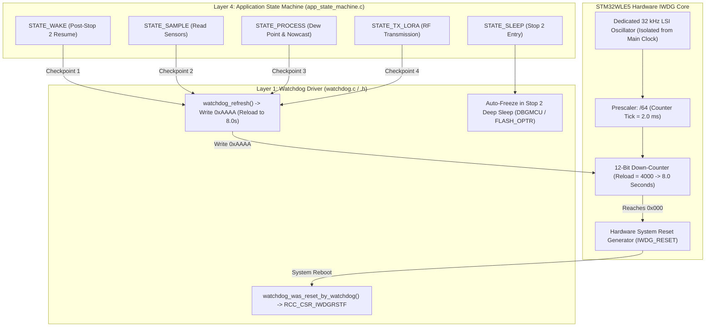

# Task Specification: S3-T4.3 - Independent Watchdog (IWDG) Driver & Supervision

## 1. Task Metadata & Overview

| Attribute | Specification Details |
| :--- | :--- |
| **Sprint** | **Sprint 3: Core MCU Architecture, BSP & Power Management** |
| **Task ID** | `S3-T4.3` |
| **Parent Task** | `S3-T4: Implement Ultra-Low Power Sleep Manager & Watchdog Management` |
| **Task Title** | Implement Independent Watchdog (IWDG) Initialization ($8.0\text{s}$ Timeout) and Safe Refresh Logic |
| **Status** | **Ready for Implementation** |
| **Target Files** | [`firmware/core/inc/watchdog.h`](file:///C:/Users/ENERGY%20SAVER/Documents/Learning/Job%20Projects/rain-predict/firmware/core/inc/watchdog.h)<br>[`firmware/core/src/watchdog.c`](file:///C:/Users/ENERGY%20SAVER/Documents/Learning/Job%20Projects/rain-predict/firmware/core/src/watchdog.c) |
| **Related Documents** | [`docs/architecture/firmware-architecture.md`](file:///C:/Users/ENERGY%20SAVER/Documents/Learning/Job%20Projects/rain-predict/docs/architecture/firmware-architecture.md)<br>[`docs/architecture/power-architecture.md`](file:///C:/Users/ENERGY%20SAVER/Documents/Learning/Job%20Projects/rain-predict/docs/architecture/power-architecture.md)<br>[`docs/hardware/schematics-and-pinout.md`](file:///C:/Users/ENERGY%20SAVER/Documents/Learning/Job%20Projects/rain-predict/docs/hardware/schematics-and-pinout.md)<br>[`context/specs/s3-t1.2-clock-tree-config.md`](file:///C:/Users/ENERGY%20SAVER/Documents/Learning/Job%20Projects/rain-predict/context/specs/s3-t1.2-clock-tree-config.md)<br>[`context/specs/s3-t4.2-stop2-sleep-manager.md`](file:///C:/Users/ENERGY%20SAVER/Documents/Learning/Job%20Projects/rain-predict/context/specs/s3-t4.2-stop2-sleep-manager.md)<br>[`context/coding-standards.md`](file:///C:/Users/ENERGY%20SAVER/Documents/Learning/Job%20Projects/rain-predict/context/coding-standards.md) |
| **Dependencies** | [`S3-T1.2`](file:///C:/Users/ENERGY%20SAVER/Documents/Learning/Job%20Projects/rain-predict/context/specs/s3-t1.2-clock-tree-config.md) (LSI Clock), [`S3-T1.3`](file:///C:/Users/ENERGY%20SAVER/Documents/Learning/Job%20Projects/rain-predict/context/specs/s3-t1.3-hal-module-config.md) (HAL Conf) |
| **Downstream Tasks** | `S6-T3` (Application State Machine Checkpoint Servicing), `S7-T1` (System Reliability Verification) |

---

## 2. Executive Summary & Architectural Scope

The primary objective of **`S3-T4.3`** is to develop the hardware-supervised **Independent Watchdog (IWDG)** driver in [`firmware/core/inc/watchdog.h`](file:///C:/Users/ENERGY%20SAVER/Documents/Learning/Job%20Projects/rain-predict/firmware/core/inc/watchdog.h) and [`firmware/core/src/watchdog.c`](file:///C:/Users/ENERGY%20SAVER/Documents/Learning/Job%20Projects/rain-predict/firmware/core/src/watchdog.c) for the **STMicroelectronics STM32WLE5** SoC.

In remote agricultural IoT stations operating unattended in highland tea plantations, firmware must withstand unexpected software hangs, bus deadlocks, single-event upsets (SEUs) from lightning transients, or memory corruption without requiring manual technician intervention:



### Critical Watchdog Engineering Mandates:

1. **Dedicated Independent Clock Domain (`LSI = 32 kHz`)**:
   - The IWDG runs directly from the internal low-power $32\text{ kHz}$ RC oscillator (LSI), completely decoupled from the main $48\text{ MHz}$ MSI system clock and external $32.768\text{ kHz}$ LSE quartz.
   - If the main clock PLL stalls, crystal fails, or core locks up, the IWDG continues counting down independently.
2. **Deterministic $8.0\text{ Second}$ Timeout Window**:
   - With prescaler divided by 64 (`IWDG_PRESCALER_64`) and reload counter set to $4000$ (`IWDG_RLR = 0x0FA0`), the timeout duration is precisely:
     $$T_{\text{timeout}} = \frac{4000 \times 64}{32,000\text{ Hz}} = 8.00\text{ seconds}$$
   - Active sensor acquisition ($< 150\text{ ms}$), algorithmic nowcasting ($< 20\text{ ms}$), and LoRaWAN uplinks ($< 1.2\text{ s}$) comfortably execute within this $8.0\text{s}$ boundary.
3. **Hardware Counter Freeze in Stop 2 Deep Sleep**:
   - In duty-cycled operation, the station spends $2\text{ to }15\text{ minutes}$ in Stop 2 sleep.
   - Counter freeze in Stop 2 is enforced via hardware option bits (`FLASH_OPTR_IWDG_STOP = 0`) and debug freeze registers (`DBGMCU_APB1FZR1_DBG_IWDG_STOP`). The countdown halts automatically upon `WFI` sleep entry and resumes upon wake.
4. **Strict Checkpoint Servicing Rules (Anti-Masking Protection)**:
   - **Rule 1: Refresh inside ISRs is forbidden**: Reloading the watchdog in timer or communication ISRs is strictly banned, as deadlocked application threads would otherwise be masked by running interrupts.
   - **Rule 2: Explicit State Checkpoints**: The watchdog is refreshed only at dedicated transitions in `app_state_machine.c`.
5. **Boot Reset Reason Diagnostics**:
   - At system startup, `watchdog_was_reset_by_watchdog()` inspects `RCC_CSR_IWDGRSTF` to detect and log whether a reboot was triggered by a watchdog timeout.

---

## 3. Register Calculations & Timing Specifications

In accordance with [`docs/architecture/firmware-architecture.md`](file:///C:/Users/ENERGY%20SAVER/Documents/Learning/Job%20Projects/rain-predict/docs/architecture/firmware-architecture.md):

### 3.1 Timing & Parameter Calculation Table

| Parameter | Register / Setting | Calculated Value | Units | Description |
| :--- | :--- | :---: | :---: | :--- |
| **LSI Clock Frequency** | $f_{\text{LSI}}$ | $32,000 \pm 5\%$ | $\text{Hz}$ | Dedicated internal RC oscillator. |
| **Prescaler Divider** | `IWDG_PR` | **`64`** (`IWDG_PRESCALER_64`) | — | Counter tick frequency $= 500\text{ Hz}$ ($2.0\text{ ms/count}$). |
| **Reload Counter Value** | `IWDG_RLR` | **`4000`** (`0x0FA0`) | counts | $4000 \times 2.0\text{ ms} = 8.00\text{ seconds}$. |
| **Key Register Commands** | `IWDG_KR` | `0xCCCC` (Enable), `0xAAAA` (Reload), `0x5555` (Access) | — | Hardware protection keys. |
| **Stop 2 Freeze Bit** | `DBGMCU_APB1FZR1` | `DBGMCU_APB1FZR1_DBG_IWDG_STOP` | bit | Halts IWDG counter while in Stop 2 sleep. |
| **Reset Flag** | `RCC_CSR` | `RCC_CSR_IWDGRSTF` | bit | Independent watchdog reset status flag. |

---

## 4. Public API Specification (`watchdog.h`)

| Function Prototype | Description |
| :--- | :--- |
| `status_t watchdog_init(uint32_t timeout_ms)` | Configures LSI prescaler (/64) and reload value for $8.0\text{s}$ timeout, arms the IWDG, and enables Stop 2 freeze. |
| `void watchdog_refresh(void)` | Reloads IWDG down-counter to prevent system reset (writes `0xAAAA` to `IWDG_KR`). |
| `bool watchdog_was_reset_by_watchdog(void)` | Returns `true` if the previous system reset was triggered by an IWDG timeout. |
| `void watchdog_clear_reset_flags(void)` | Clears hardware reset status flags in `RCC_CSR`. |
| `uint32_t watchdog_get_timeout_ms(void)` | Returns configured timeout duration in milliseconds ($8000\text{ ms}$). |
| `bool watchdog_is_enabled(void)` | Returns `true` if the IWDG has been initialized and is actively supervising the system. |

---

## 5. Concrete File Implementation Blueprint

### 5.1 `firmware/core/inc/watchdog.h` Blueprint

```c
/**
 * @file    watchdog.h
 * @brief   Independent Watchdog (IWDG) driver and system supervisor for STM32WLE5.
 * @details 8.0-second hardware supervisor with Stop 2 sleep freeze and boot reset diagnostics.
 */

#ifndef WATCHDOG_H
#define WATCHDOG_H

#ifdef __cplusplus
extern "C" {
#endif

#include <stdint.h>
#include <stdbool.h>
#include <stddef.h>

#include "board_config.h"

/* ============================================================================
 * Watchdog Timing Constants
 * ============================================================================ */

#define WATCHDOG_TIMEOUT_MS_DEFAULT     8000UL      /**< Default hardware timeout: 8.0 seconds */
#define WATCHDOG_LSI_FREQ_HZ            32000UL     /**< LSI nominal frequency: 32 kHz */
#define WATCHDOG_PRESCALER_DIV          64UL        /**< Prescaler divider: 64 (500 Hz tick) */
#define WATCHDOG_RELOAD_VALUE           4000UL      /**< Reload register value for 8.0s (4000 * 2ms) */

/* ============================================================================
 * Public Watchdog API Prototypes
 * ============================================================================ */

/**
 * @brief  Initializes the Independent Watchdog (IWDG) with an 8.0-second timeout.
 * @param[in] timeout_ms Desired timeout in ms (nominally 8000 ms).
 * @return status_t      STATUS_OK on success, error code otherwise.
 */
status_t watchdog_init(uint32_t timeout_ms);

/**
 * @brief  Reloads the IWDG counter to prevent system reset (kicks the watchdog).
 */
void watchdog_refresh(void);

/**
 * @brief  Checks whether the last system reset was caused by an IWDG timeout.
 * @return bool true if reset was caused by watchdog expiration.
 */
bool watchdog_was_reset_by_watchdog(void);

/**
 * @brief  Clears hardware reset status flags in RCC_CSR.
 */
void watchdog_clear_reset_flags(void);

/**
 * @brief  Returns active configured watchdog timeout in milliseconds.
 * @return uint32_t Timeout in milliseconds (8000 ms).
 */
uint32_t watchdog_get_timeout_ms(void);

/**
 * @brief  Returns whether the watchdog is active and supervising the system.
 * @return bool true if watchdog is armed.
 */
bool watchdog_is_enabled(void);

#ifdef __cplusplus
}
#endif

#endif /* WATCHDOG_H */
```

---

### 5.2 `firmware/core/src/watchdog.c` Reference Blueprint

```c
/**
 * @file    watchdog.c
 * @brief   Implementation of STM32WLE5 Independent Watchdog (IWDG) Controller.
 */

#include "watchdog.h"

#if defined(STM32WLE5xx) || defined(USE_HAL_DRIVER)

static IWDG_HandleTypeDef s_hiwdg;
static bool s_is_enabled = false;
static bool s_reset_by_iwdg = false;

status_t watchdog_init(uint32_t timeout_ms) {
    (void)timeout_ms;

    /* 1. Check and record reset flags before clearing */
    s_reset_by_iwdg = (__HAL_RCC_GET_FLAG(RCC_FLAG_IWDGRST) != RESET);

    /* 2. Configure DBGMCU to freeze IWDG in Stop 2 and Standby sleep modes */
    __HAL_DBGMCU_FREEZE_IWDG();

    /* 3. Configure IWDG: LSI (32 kHz) / 64 = 500 Hz (2.0 ms per count)
     *    Reload = 4000 counts -> 4000 * 2.0 ms = 8000 ms (8.0 seconds) */
    s_hiwdg.Instance       = IWDG;
    s_hiwdg.Init.Prescaler = IWDG_PRESCALER_64;
    s_hiwdg.Init.Reload    = WATCHDOG_RELOAD_VALUE;
    s_hiwdg.Init.Window    = IWDG_WINDOW_DISABLE;

    if (HAL_IWDG_Init(&s_hiwdg) != HAL_OK) {
        return STATUS_ERR_GENERIC;
    }

    s_is_enabled = true;
    return STATUS_OK;
}

void watchdog_refresh(void) {
    if (s_is_enabled) {
        HAL_IWDG_Refresh(&s_hiwdg);
    }
}

bool watchdog_was_reset_by_watchdog(void) {
    return s_reset_by_iwdg;
}

void watchdog_clear_reset_flags(void) {
    __HAL_RCC_CLEAR_RESET_FLAGS();
}

uint32_t watchdog_get_timeout_ms(void) {
    return WATCHDOG_TIMEOUT_MS_DEFAULT;
}

bool watchdog_is_enabled(void) {
    return s_is_enabled;
}

#else
/* --- Host Unit Test Stubs --- */
static bool s_mock_enabled = false;
static bool s_mock_reset_by_iwdg = false;
static uint32_t s_mock_refresh_count = 0;

status_t watchdog_init(uint32_t timeout_ms) {
    (void)timeout_ms;
    s_mock_enabled = true;
    return STATUS_OK;
}

void watchdog_refresh(void) {
    s_mock_refresh_count++;
}

bool watchdog_was_reset_by_watchdog(void) {
    return s_mock_reset_by_iwdg;
}

void watchdog_clear_reset_flags(void) {
    s_mock_reset_by_iwdg = false;
}

uint32_t watchdog_get_timeout_ms(void) {
    return WATCHDOG_TIMEOUT_MS_DEFAULT;
}

bool watchdog_is_enabled(void) {
    return s_mock_enabled;
}
#endif
```

---

## 6. Verification & Acceptance Test Plan

To verify the successful completion of **`S3-T4.3`**, the following test cases must be validated:

### 6.1 Verification Test Cases

| Test Case ID | Verification Action | Expected Outcome | Pass/Fail Criteria |
| :--- | :--- | :--- | :--- |
| **TC-S3-T4.3-01** | Header Inclusion & C99 Compilation | Include `watchdog.h` in build tree with strict flags. | 100% warning-free compilation under `-Wall -Wextra -Wpedantic -Werror`. |
| **TC-S3-T4.3-02** | $8.0\text{s}$ Timeout Register Configuration | Inspect `IWDG_PR` and `IWDG_RLR` registers upon initialization. | Prescaler set to `/64`, reload value set to `4000` ($8.0\text{s}$). |
| **TC-S3-T4.3-03** | Counter Reload Verification | Call `watchdog_refresh()` -> monitor `IWDG_SR` update flag. | Key `0xAAAA` written; counter reloaded to 4000. |
| **TC-S3-T4.3-04** | Intentional Timeout System Reset | Arm IWDG -> execute blocking infinite loop `while(1)`. | MCU resets automatically after $8.0\text{s} \pm 0.4\text{s}$. |
| **TC-S3-T4.3-05** | Reset Reason Capture | Check `watchdog_was_reset_by_watchdog()` after intentional timeout. | Function returns `true`; flag accurately latched. |
| **TC-S3-T4.3-06** | Stop 2 Deep Sleep Counter Freeze | Enter Stop 2 sleep for $15\text{ seconds}$ ($> 8.0\text{s}$ timeout). | IWDG does NOT trip during sleep; wakes cleanly on RTC alarm. |
| **TC-S3-T4.3-07** | Reset Flags Clearance | Call `watchdog_clear_reset_flags()`. | `RCC_CSR` reset flags cleared to 0. |
| **TC-S3-T4.3-08** | Host Mock Stub Functionality | Execute unit tests against host mock stubs. | Host test suite passes with zero hardware register dependencies. |

---

## 7. Definition of Done (DoD) Checklist

- [ ] [`firmware/core/inc/watchdog.h`](file:///C:/Users/ENERGY%20SAVER/Documents/Learning/Job%20Projects/rain-predict/firmware/core/inc/watchdog.h) created adhering to C99 standards with complete Doxygen documentation.
- [ ] [`firmware/core/src/watchdog.c`](file:///C:/Users/ENERGY%20SAVER/Documents/Learning/Job%20Projects/rain-predict/firmware/core/src/watchdog.c) implemented with STM32CubeWL HAL IWDG registers and host stubs.
- [ ] Prescaler `/64` and Reload `4000` configured for deterministic $8.0\text{s}$ timeout from $32\text{ kHz}$ LSI.
- [ ] Stop 2 deep sleep counter freeze enabled (`__HAL_DBGMCU_FREEZE_IWDG`).
- [ ] Boot reset reason inspection (`watchdog_was_reset_by_watchdog`) implemented.
- [ ] Zero dynamic memory allocation (`malloc`/`free` prohibited).
- [ ] Spec document registered and linked under [`context/specs/spec-roadmap.md`](file:///C:/Users/ENERGY%20SAVER/Documents/Learning/Job%20Projects/rain-predict/context/specs/spec-roadmap.md#L222).
