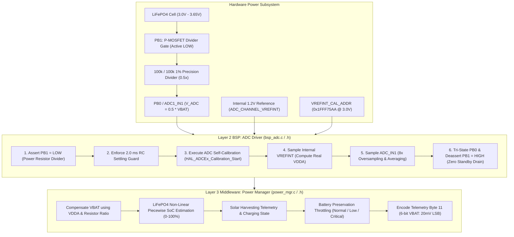

# Task Specification: S3-T4.4 - Battery ADC Telemetry & Solar Harvesting Telemetry

## 1. Task Metadata & Overview

| Attribute | Specification Details |
| :--- | :--- |
| **Sprint** | **Sprint 3: Core MCU Architecture, BSP & Power Management** |
| **Task ID** | `S3-T4.4` |
| **Parent Task** | `S3-T4: Implement Ultra-Low Power Sleep Manager & Watchdog Management` |
| **Task Title** | Implement Battery ADC Voltage Measurement ($V_{\text{bat}}$) and Solar Harvesting Telemetry |
| **Status** | **Ready for Implementation** |
| **Target Files** | [`firmware/drivers/inc/bsp_adc.h`](file:///C:/Users/ENERGY%20SAVER/Documents/Learning/Job%20Projects/rain-predict/firmware/drivers/inc/bsp_adc.h)<br>[`firmware/drivers/src/bsp_adc.c`](file:///C:/Users/ENERGY%20SAVER/Documents/Learning/Job%20Projects/rain-predict/firmware/drivers/src/bsp_adc.c)<br>[`firmware/middleware/inc/power_mgr.h`](file:///C:/Users/ENERGY%20SAVER/Documents/Learning/Job%20Projects/rain-predict/firmware/middleware/inc/power_mgr.h)<br>[`firmware/middleware/src/power_mgr.c`](file:///C:/Users/ENERGY%20SAVER/Documents/Learning/Job%20Projects/rain-predict/firmware/middleware/src/power_mgr.c) |
| **Related Documents** | [`docs/hardware/power-supply-and-solar.md`](file:///C:/Users/ENERGY%20SAVER/Documents/Learning/Job%20Projects/rain-predict/docs/hardware/power-supply-and-solar.md)<br>[`docs/architecture/power-architecture.md`](file:///C:/Users/ENERGY%20SAVER/Documents/Learning/Job%20Projects/rain-predict/docs/architecture/power-architecture.md)<br>[`docs/hardware/schematics-and-pinout.md`](file:///C:/Users/ENERGY%20SAVER/Documents/Learning/Job%20Projects/rain-predict/docs/hardware/schematics-and-pinout.md)<br>[`docs/architecture/telemetry-protocol.md`](file:///C:/Users/ENERGY%20SAVER/Documents/Learning/Job%20Projects/rain-predict/docs/architecture/telemetry-protocol.md)<br>[`context/specs/s3-t1.1-gpio-pin-mappings.md`](file:///C:/Users/ENERGY%20SAVER/Documents/Learning/Job%20Projects/rain-predict/context/specs/s3-t1.1-gpio-pin-mappings.md)<br>[`context/specs/s3-t3.1-switched-power-rails.md`](file:///C:/Users/ENERGY%20SAVER/Documents/Learning/Job%20Projects/rain-predict/context/specs/s3-t3.1-switched-power-rails.md)<br>[`context/specs/s3-t4.2-stop2-sleep-manager.md`](file:///C:/Users/ENERGY%20SAVER/Documents/Learning/Job%20Projects/rain-predict/context/specs/s3-t4.2-stop2-sleep-manager.md)<br>[`context/coding-standards.md`](file:///C:/Users/ENERGY%20SAVER/Documents/Learning/Job%20Projects/rain-predict/context/coding-standards.md) |
| **Dependencies** | [`S3-T1.1`](file:///C:/Users/ENERGY%20SAVER/Documents/Learning/Job%20Projects/rain-predict/context/specs/s3-t1.1-gpio-pin-mappings.md) (Pinout), [`S3-T1.3`](file:///C:/Users/ENERGY%20SAVER/Documents/Learning/Job%20Projects/rain-predict/context/specs/s3-t1.3-hal-module-config.md) (HAL ADC), [`S3-T3.1`](file:///C:/Users/ENERGY%20SAVER/Documents/Learning/Job%20Projects/rain-predict/context/specs/s3-t3.1-switched-power-rails.md) (Power Rails & PB1 Gate) |
| **Downstream Tasks** | `S6-T1.2` (Battery Preservation Throttling), `S6-T3` (Application State Machine Telemetry), `S7-T2.3` (14-Day Zero-Sunlight Battery Validation) |

---

## 2. Executive Summary & Architectural Scope

The primary objective of **`S3-T4.4`** is to develop the **Battery ADC Voltage Measurement Driver** ([`firmware/drivers/inc/bsp_adc.h`](file:///C:/Users/ENERGY%20SAVER/Documents/Learning/Job%20Projects/rain-predict/firmware/drivers/inc/bsp_adc.h) / [`firmware/drivers/src/bsp_adc.c`](file:///C:/Users/ENERGY%20SAVER/Documents/Learning/Job%20Projects/rain-predict/firmware/drivers/src/bsp_adc.c)) and the **Power Subsystem Telemetry Engine** in [`firmware/middleware/inc/power_mgr.h`](file:///C:/Users/ENERGY%20SAVER/Documents/Learning/Job%20Projects/rain-predict/firmware/middleware/inc/power_mgr.h) and [`firmware/middleware/src/power_mgr.c`](file:///C:/Users/ENERGY%20SAVER/Documents/Learning/Job%20Projects/rain-predict/firmware/middleware/src/power_mgr.c) for the **STMicroelectronics STM32WLE5** SoC.

In remote highland tea plantations, meteorological stations are powered by a **$3.2\text{V } 3200\text{ mAh }\text{LiFePO}_4$ battery** and a **$1.5\text{W } 6\text{V}$ solar photovoltaic panel** with a CN3791 MPPT charger. Perpetual autonomy requires real-time monitoring of cell potential, remaining State of Charge (SoC), energy harvesting activity, and automatic throttling under deep discharge conditions:



### Critical Battery & Telemetry Engineering Mandates:

1. **Zero-Leakage Gated Voltage Divider (`PB1` / `PB0`)**:
   - A $100\,\text{k}\Omega / 100\,\text{k}\Omega$ $1\%$ precision resistor divider divides $V_{\text{bat}}$ by $2.00$ ($V_{\text{ADC}} = 0.5 \times V_{\text{bat}} = 1.50\text{V}–1.825\text{V}$).
   - The top of the divider is gated through a high-side P-MOSFET controlled by `PB1` (`PIN_VBAT_DIV_EN`).
   - `PB1` is driven LOW (active) only during active ADC acquisition ($< 3\text{ ms}$) and driven HIGH (OFF) in standby, reducing standby divider leakage from $16.5\,\mu\text{A}$ to **$< 10\text{ nA}$**.
2. **True $V_{\text{DDA}}$ Compensation via Factory $V_{\text{REFINT\_CAL}}$**:
   - Because $V_{\text{DDA}}$ may drift with temperature or battery LDO regulation, direct conversions using nominal $3.3\text{V}$ introduce up to $\pm 5\%$ error.
   - The driver samples the internal reference voltage (`ADC_CHANNEL_VREFINT`) and reads the ST factory calibration value stored at `0x1FFF75AA` ($V_{\text{REFINT\_CAL}}$ acquired at $V_{\text{DDA}} = 3.0\text{V} \pm 10\text{mV}$ at $30^\circ\text{C}$) to compute the precise instantaneous $V_{\text{DDA}}$ before converting $V_{\text{bat}}$.
3. **$\text{LiFePO}_4$ Non-Linear State of Charge (SoC) Modeling**:
   - $\text{LiFePO}_4$ chemistry exhibits an extremely flat discharge curve between $10\%$ and $90\%$ SoC ($3.20\text{V}–3.32\text{V}$).
   - The firmware implements an 8-segment piecewise linear interpolation table calibrated specifically for $3.2\text{V}$ $\text{LiFePO}_4$ cells.
4. **Battery Health State & Adaptive Throttling Triggers**:
   - **Optimal ($V_{\text{bat}} \ge 3.25\text{ V}$, $\text{SoC} \ge 40\%$)**: Standard operational duty cycling ($10\text{ min}$ fair / $5\text{ min}$ watch / $2\text{ min}$ storm).
   - **Low Battery ($3.00\text{ V} \le V_{\text{bat}} < 3.25\text{ V}$, $5\% \le \text{SoC} < 40\%$)**: Throttles sampling interval to $\ge 15\text{ minutes}$, disables high-current acoustic sirens and strobes.
   - **Critical Battery ($V_{\text{bat}} < 3.00\text{ V}$, $\text{SoC} < 5\%$)**: Emergency preservation mode ($60\text{ min}$ sleep interval), suppresses non-critical LoRa uplinks to protect cell from reaching hardware UVLO ($2.50\text{V}$).
5. **Standard LoRaWAN Telemetry Protocol Alignment**:
   - Battery voltage is bit-packed into **Byte 11** of the $12\text{-byte}$ payload:
     $$\text{Raw\_6bit} = \text{clamp}\left( \frac{V_{\text{bat\_mV}} - 2500}{20}, 0, 63 \right) \quad (2.50\text{V to }3.76\text{V}, 20\text{mV/step})$$

---

## 3. Mathematical Derivations & Calibration Formulas

### 3.1 True Analog Supply Voltage ($V_{\text{DDA}}$) Derivation

The STM32WLE5 incorporates an internal voltage reference ($V_{\text{REFINT}} \approx 1.224\text{V}$) whose precise raw 12-bit ADC value at $V_{\text{DDA}} = 3.0\text{V}$ and $T = 30^\circ\text{C}$ is programmed during factory test into system memory at:
$$\text{Address: } \mathtt{0x1FFF75AA} \quad (V_{\text{REFINT\_CAL\_ADDR}})$$

Let:
- $\text{CAL\_VAL} = *(\text{uint16\_t}*)\mathtt{0x1FFF75AA}$ (Nominally $\approx 1660$)
- $V_{\text{CAL\_VOLTAGE}} = 3000\text{ mV}$
- $\text{RAW\_VREFINT} = \text{ADC measured value on } \mathtt{ADC\_CHANNEL\_VREFINT}$ ($12\text{-bit: } 0\text{ to }4095$)

The exact instantaneous analog supply voltage $V_{\text{DDA}}$ (in millivolts) is:

$$V_{\text{DDA\_mV}} = \frac{3000\text{ mV} \times \text{CAL\_VAL}}{\text{RAW\_VREFINT}}$$

### 3.2 Battery Voltage ($V_{\text{bat}}$) Calculation

The battery voltage $V_{\text{bat}}$ is measured on `PB0` (`ADC_IN1`) through the $R_1 / R_2$ divider:
- $R_1 = 100.0\text{ k}\Omega \pm 1\%$
- $R_2 = 100.0\text{ k}\Omega \pm 1\%$
- Divider attenuation ratio: $K_{\text{div}} = \frac{R_2}{R_1 + R_2} = \frac{100}{200} = 0.5000$ (Scaling factor $= 2.000$)

The pin voltage at `PB0` is:
$$V_{\text{ADC\_mV}} = \frac{\text{RAW\_VBAT\_ADC}}{4095} \times V_{\text{DDA\_mV}}$$

Substituting $V_{\text{DDA\_mV}}$ into the battery equation yields:

$$V_{\text{bat\_mV}} = 2 \times V_{\text{ADC\_mV}} = \frac{2 \times 3000 \times \text{CAL\_VAL} \times \text{RAW\_VBAT\_ADC}}{4095 \times \text{RAW\_VREFINT}}$$

Using 32-bit unsigned arithmetic with rounding:

$$V_{\text{bat\_mV}} = \left\lfloor \frac{6000 \times \text{CAL\_VAL} \times \text{RAW\_VBAT\_ADC} + (4095 \times \text{RAW\_VREFINT} / 2)}{4095 \times \text{RAW\_VREFINT}} \right\rfloor$$

---

### 3.3 $\text{LiFePO}_4$ State of Charge (SoC) Piecewise Curve

Because $\text{LiFePO}_4$ has an ultra-flat plateau at $3.20\text{V}–3.32\text{V}$, an 8-segment linear interpolation model provides robust State of Charge estimation:

```
State of Charge (SoC %)
100% ┌───────────────────────────────────────────────/ (>= 3400 mV)
 90% ├──────────────────────────────────────────────/ (3330 mV)
 80% ├─────────────────────────────────────────────/ (3300 mV)
 70% ├────────────────────────────────────────────/ 
 50% ├───────────────────────────────────────────/ (3270 mV Flat Plateau)
 30% ├──────────────────────────────────────────/ (3230 mV)
 15% ├─────────────────────────────────────────/ (3150 mV Discharge Knee)
  5% ├────────────────────────────────────────/ (3000 mV Low Bat Warning)
  0% └───────────────────────────────────────/ (<= 2500 mV Hardware Cutoff)
     2.50V  2.80V  3.00V  3.15V  3.23V  3.27V  3.33V  3.40V  3.65V
```

| Segment ($i$) | Voltage Range ($V_{\text{bat\_mV}}$) | SoC Range ($\%$) | Base Voltage ($V_0$) | Base SoC ($\text{SoC}_0$) | Slope ($\frac{\Delta \text{SoC}}{\Delta V}$) |
| :---: | :---: | :---: | :---: | :---: | :---: |
| **7** | $\ge 3400\text{ mV}$ | **$100\%$** | $3400\text{ mV}$ | $100\%$ | $0.0$ (Clamped at $100\%$) |
| **6** | $3330\text{ to }3399\text{ mV}$ | **$90\%\text{ to }99\%$** | $3330\text{ mV}$ | $90\%$ | $\frac{10\%}{70\text{ mV}} = 0.1429\,\%/\text{mV}$ |
| **5** | $3300\text{ to }3329\text{ mV}$ | **$70\%\text{ to }89\%$** | $3300\text{ mV}$ | $70\%$ | $\frac{20\%}{30\text{ mV}} = 0.6667\,\%/\text{mV}$ |
| **4** | $3250\text{ to }3299\text{ mV}$ | **$40\%\text{ to }69\%$** | $3250\text{ mV}$ | $40\%$ | $\frac{30\%}{50\text{ mV}} = 0.6000\,\%/\text{mV}$ |
| **3** | $3200\text{ to }3249\text{ mV}$ | **$20\%\text{ to }39\%$** | $3200\text{ mV}$ | $20\%$ | $\frac{20\%}{50\text{ mV}} = 0.4000\,\%/\text{mV}$ |
| **2** | $3100\text{ to }3199\text{ mV}$ | **$10\%\text{ to }19\%$** | $3100\text{ mV}$ | $10\%$ | $\frac{10\%}{100\text{ mV}} = 0.1000\,\%/\text{mV}$ |
| **1** | $3000\text{ to }3099\text{ mV}$ | **$5\%\text{ to }9\%$** | $3000\text{ mV}$ | $5\%$ | $\frac{5\%}{100\text{ mV}} = 0.0500\,\%/\text{mV}$ |
| **0** | $2500\text{ to }2999\text{ mV}$ | **$0\%\text{ to }4\%$** | $2500\text{ mV}$ | $0\%$ | $\frac{5\%}{500\text{ mV}} = 0.0100\,\%/\text{mV}$ |
| **Cutoff** | $< 2500\text{ mV}$ | **$0\%$** | — | $0\%$ | Clamped at $0\%$ |

---

### 3.4 Solar Harvesting Telemetry & Charging State Logic

The power telemetry engine classifies the solar harvesting state by correlating $\Delta V_{\text{bat}}$ trends across consecutive measurement cycles with optical irradiance (lux from OPT3001):

| Solar Charging State | Mathematical / Physical Condition | Operational Meaning |
| :--- | :--- | :--- |
| **`SOLAR_CHARGING_FLOAT`** | $V_{\text{bat}} \ge 3450\text{ mV}$ and $\text{Lux} > 500$ | Battery is fully saturated; CN3791 MPPT in Float / CV regulation mode ($3.65\text{V}$). |
| **`SOLAR_CHARGING_ACTIVE`** | $\Delta V_{\text{bat}} > +10\text{ mV/hr}$ and $\text{Lux} > 1000$ | Solar panel generating excess power; battery actively charging under MPPT CC mode. |
| **`SOLAR_CHARGING_DISCHARGE`**| $\Delta V_{\text{bat}} \le +10\text{ mV/hr}$ and $\text{Lux} > 1000$ | Heavy cloud cover or high active consumption; net discharge despite daytime. |
| **`SOLAR_CHARGING_NIGHT`** | $\text{Lux} < 50$ (Optical Dark) | Solar harvesting inactive; battery powering system in nocturnal discharge mode. |

---

## 4. Public API Specification

### 4.1 BSP ADC Driver API (`bsp_adc.h`)

| Function Prototype | Description |
| :--- | :--- |
| `status_t bsp_adc_init(void)` | Initializes the ADC1 peripheral, GPIO `PB0` analog mode, and executes ADC self-calibration. |
| `status_t bsp_adc_deinit(void)` | Disables ADC1 peripheral clock and returns pins to analog low-power state. |
| `status_t bsp_adc_read_vrefint_raw(uint16_t *p_raw_vref)` | Samples internal `ADC_CHANNEL_VREFINT` over 8 averaged samples. |
| `status_t bsp_adc_read_vbat_raw(uint16_t *p_raw_vbat)` | Powers gate `PB1`, delays $2.0\text{ ms}$, samples `ADC_IN1` (`PB0`) over 8 averaged samples, and un-gates `PB1`. |
| `uint16_t bsp_adc_get_vrefint_factory_cal(void)` | Reads the factory calibration word stored at `0x1FFF75AA`. |
| `status_t bsp_adc_read_vbat_mv(uint16_t *p_vbat_mv)` | Executes full sequence: reads VREFINT and VBAT, computes compensated millivolts. |

---

### 4.2 Power Manager Battery Telemetry API (`power_mgr.h`)

| Function Prototype | Description |
| :--- | :--- |
| `status_t power_mgr_battery_update(uint16_t ambient_lux)` | Samples battery ADC, calculates compensated $V_{\text{bat}}$, SoC $\%$, and updates solar harvesting status. |
| `const power_battery_status_t* power_mgr_battery_get_status(void)` | Returns pointer to the current cached battery telemetry structure. |
| `power_battery_health_t power_mgr_battery_get_health(void)` | Returns categorized battery health (`OPTIMAL`, `LOW`, `CRITICAL`). |
| `uint8_t power_mgr_battery_encode_payload_byte(bool sensor_error, bool unexpected_reset)` | Bit-packs $V_{\text{bat}}$ (6 bits, $20\text{mV}$ step) and diagnostic flags into Byte 11 of the LoRaWAN payload. |
| `bool power_mgr_battery_is_throttling_required(void)` | Returns `true` if battery level requires duty cycle expansion to protect against brownouts. |
| `uint32_t power_mgr_battery_get_recommended_sleep_sec(uint32_t nominal_sleep_sec)` | Returns the power-adjusted sleep interval (e.g. forced $15\text{ min}$ or $60\text{ min}$ when battery is depleted). |

---

## 5. Concrete File Implementation Blueprint

### 5.1 `firmware/drivers/inc/bsp_adc.h` Blueprint

```c
/**
 * @file    bsp_adc.h
 * @brief   Low-power ADC driver for battery voltage and supply telemetry.
 * @details STM32WLE5 ADC1 driver with internal VREFINT calibration and gated voltage divider.
 */

#ifndef BSP_ADC_H
#define BSP_ADC_H

#include <stdint.h>
#include <stdbool.h>
#include "status_codes.h"

#ifdef __cplusplus
extern "C" {
#endif

/* ========================================================================== */
/* Hardware Configuration Constants                                           */
/* ========================================================================== */

/** @brief Address of internal factory VREFINT calibration word (3.0V @ 30C) */
#define BSP_ADC_VREFINT_CAL_ADDR            ((uint16_t *)0x1FFF75AAUL)

/** @brief Factory calibration reference voltage in millivolts */
#define BSP_ADC_VREFINT_CAL_VOLTAGE_MV      3000U

/** @brief Resistor divider multiplication factor (100k / 100k -> 2.0x) */
#define BSP_ADC_VBAT_DIVIDER_SCALE          2U

/** @brief Gated resistor divider RC settling guard delay in milliseconds */
#define BSP_ADC_DIVIDER_SETTLING_MS         2U

/** @brief Number of oversampled conversions to average per reading */
#define BSP_ADC_OVERSAMPLING_COUNT          8U

/** @brief Full scale 12-bit ADC value */
#define BSP_ADC_FULL_SCALE_12BIT            4095U

/* ========================================================================== */
/* Function Prototypes                                                        */
/* ========================================================================== */

/**
 * @brief  Initializes ADC1 peripheral, GPIO channels, and runs self-calibration.
 * @return STATUS_OK on success, or STATUS_ERROR_HARDWARE on peripheral failure.
 */
status_t bsp_adc_init(void);

/**
 * @brief  De-initializes ADC1 peripheral to reduce sleep current to zero.
 * @return STATUS_OK on success.
 */
status_t bsp_adc_deinit(void);

/**
 * @brief  Reads factory calibration value for internal reference voltage.
 * @return 16-bit calibration raw count from system memory.
 */
uint16_t bsp_adc_get_vrefint_factory_cal(void);

/**
 * @brief  Samples the internal VREFINT channel (8x averaged).
 * @param[out] p_raw_vref Pointer to store raw 12-bit ADC reading.
 * @return STATUS_OK on success, or STATUS_ERROR_NULL_POINTER / TIMEOUT.
 */
status_t bsp_adc_read_vrefint_raw(uint16_t *p_raw_vref);

/**
 * @brief  Gates PB1, samples ADC_IN1 (PB0, 8x averaged), and de-asserts PB1.
 * @param[out] p_raw_vbat Pointer to store raw 12-bit ADC reading.
 * @return STATUS_OK on success, or STATUS_ERROR_NULL_POINTER / TIMEOUT.
 */
status_t bsp_adc_read_vbat_raw(uint16_t *p_raw_vbat);

/**
 * @brief  Samples VREFINT and VBAT, computes VDDA, and returns compensated VBAT.
 * @param[out] p_vbat_mv Pointer to store compensated battery voltage in millivolts.
 * @return STATUS_OK on success, or error status code.
 */
status_t bsp_adc_read_vbat_mv(uint16_t *p_vbat_mv);

#ifdef __cplusplus
}
#endif

#endif /* BSP_ADC_H */
```

---

### 5.2 `firmware/drivers/src/bsp_adc.c` Reference Blueprint

```c
/**
 * @file    bsp_adc.c
 * @brief   Low-power ADC driver implementation for STM32WLE5 SoC.
 */

#include "bsp_adc.h"
#include "bsp_power_rails.h"
#include "board_config.h"

#ifdef STM32WLE5xx
#include "stm32wlxx_hal.h"
#endif

/* Private ADC Handle */
#ifdef STM32WLE5xx
static ADC_HandleTypeDef g_hadc;
static bool g_adc_initialized = false;
#endif

status_t bsp_adc_init(void) {
#ifdef STM32WLE5xx
    if (g_adc_initialized) {
        return STATUS_OK;
    }

    __HAL_RCC_ADC_CLK_ENABLE();

    g_hadc.Instance                   = ADC;
    g_hadc.Init.ClockPrescaler        = ADC_CLOCK_SYNC_PCLK_DIV4;
    g_hadc.Init.Resolution            = ADC_RESOLUTION_12B;
    g_hadc.Init.DataAlign             = ADC_DATAALIGN_RIGHT;
    g_hadc.Init.ScanConvMode          = ADC_SCAN_DISABLE;
    g_hadc.Init.EOCSelection          = ADC_EOC_SINGLE_CONV;
    g_hadc.Init.LowPowerAutoWait      = DISABLE;
    g_hadc.Init.LowPowerAutoPowerOff  = DISABLE;
    g_hadc.Init.ContinuousConvMode    = DISABLE;
    g_hadc.Init.NbrOfConversion       = 1;
    g_hadc.Init.DiscontinuousConvMode = DISABLE;
    g_hadc.Init.ExternalTrigConv      = ADC_SOFTWARE_START;
    g_hadc.Init.ExternalTrigConvEdge  = ADC_EXTERNALTRIGCONVEDGE_NONE;
    g_hadc.Init.DMAContinuousRequests = DISABLE;
    g_hadc.Init.Overrun               = ADC_OVR_DATA_OVERWRITTEN;
    g_hadc.Init.SamplingTimeCommon1   = ADC_SAMPLETIME_160CYCLES_5;

    if (HAL_ADC_Init(&g_hadc) != HAL_OK) {
        return STATUS_ERROR_HARDWARE;
    }

    /* Perform internal ADC self-calibration */
    if (HAL_ADCEx_Calibration_Start(&g_hadc) != HAL_OK) {
        return STATUS_ERROR_HARDWARE;
    }

    g_adc_initialized = true;
    return STATUS_OK;
#else
    return STATUS_OK;
#endif
}

status_t bsp_adc_deinit(void) {
#ifdef STM32WLE5xx
    if (!g_adc_initialized) {
        return STATUS_OK;
    }

    HAL_ADC_DeInit(&g_hadc);
    __HAL_RCC_ADC_CLK_DISABLE();
    g_adc_initialized = false;
#endif
    return STATUS_OK;
}

uint16_t bsp_adc_get_vrefint_factory_cal(void) {
#ifdef STM32WLE5xx
    uint16_t cal = *BSP_ADC_VREFINT_CAL_ADDR;
    if (cal < 1000U || cal > 3000U) {
        return 1660U; /* Fallback typical calibration value */
    }
    return cal;
#else
    return 1660U;
#endif
}

status_t bsp_adc_read_vrefint_raw(uint16_t *p_raw_vref) {
    if (p_raw_vref == NULL) {
        return STATUS_ERROR_NULL_POINTER;
    }

#ifdef STM32WLE5xx
    if (!g_adc_initialized) {
        status_t status = bsp_adc_init();
        if (status != STATUS_OK) return status;
    }

    ADC_ChannelConfTypeDef sConfig = {0};
    sConfig.Channel      = ADC_CHANNEL_VREFINT;
    sConfig.Rank         = ADC_REGULAR_RANK_1;
    sConfig.SamplingTime = ADC_SAMPLINGTIME_COMMON_1;

    if (HAL_ADC_ConfigChannel(&g_hadc, &sConfig) != HAL_OK) {
        return STATUS_ERROR_HARDWARE;
    }

    uint32_t accumulator = 0;
    for (uint32_t i = 0; i < BSP_ADC_OVERSAMPLING_COUNT; i++) {
        HAL_ADC_Start(&g_hadc);
        if (HAL_ADC_PollForConversion(&g_hadc, 10) != HAL_OK) {
            HAL_ADC_Stop(&g_hadc);
            return STATUS_ERROR_TIMEOUT;
        }
        accumulator += HAL_ADC_GetValue(&g_hadc);
    }
    HAL_ADC_Stop(&g_hadc);

    *p_raw_vref = (uint16_t)(accumulator / BSP_ADC_OVERSAMPLING_COUNT);
    return STATUS_OK;
#else
    *p_raw_vref = 1660U; /* Simulated ~1.224V at 3.0V supply */
    return STATUS_OK;
#endif
}

status_t bsp_adc_read_vbat_raw(uint16_t *p_raw_vbat) {
    if (p_raw_vbat == NULL) {
        return STATUS_ERROR_NULL_POINTER;
    }

#ifdef STM32WLE5xx
    if (!g_adc_initialized) {
        status_t status = bsp_adc_init();
        if (status != STATUS_OK) return status;
    }

    /* 1. Enable battery divider gate (PB1 = LOW) */
    bsp_power_rail_enable(BSP_POWER_RAIL_VBAT_SENSE, true);

    /* 2. Wait 2 ms for RC settling */
    HAL_Delay(BSP_ADC_DIVIDER_SETTLING_MS);

    /* 3. Configure ADC Channel 1 (PB0) */
    ADC_ChannelConfTypeDef sConfig = {0};
    sConfig.Channel      = ADC_CHANNEL_1;
    sConfig.Rank         = ADC_REGULAR_RANK_1;
    sConfig.SamplingTime = ADC_SAMPLINGTIME_COMMON_1;

    if (HAL_ADC_ConfigChannel(&g_hadc, &sConfig) != HAL_OK) {
        bsp_power_rail_enable(BSP_POWER_RAIL_VBAT_SENSE, false);
        return STATUS_ERROR_HARDWARE;
    }

    /* 4. Perform 8x oversampled conversion */
    uint32_t accumulator = 0;
    for (uint32_t i = 0; i < BSP_ADC_OVERSAMPLING_COUNT; i++) {
        HAL_ADC_Start(&g_hadc);
        if (HAL_ADC_PollForConversion(&g_hadc, 10) != HAL_OK) {
            HAL_ADC_Stop(&g_hadc);
            bsp_power_rail_enable(BSP_POWER_RAIL_VBAT_SENSE, false);
            return STATUS_ERROR_TIMEOUT;
        }
        accumulator += HAL_ADC_GetValue(&g_hadc);
    }
    HAL_ADC_Stop(&g_hadc);

    /* 5. Disable battery divider gate (PB1 = HIGH) */
    bsp_power_rail_enable(BSP_POWER_RAIL_VBAT_SENSE, false);

    *p_raw_vbat = (uint16_t)(accumulator / BSP_ADC_OVERSAMPLING_COUNT);
    return STATUS_OK;
#else
    *p_raw_vbat = 2048U; /* Simulated 1.65V -> 3.3V battery */
    return STATUS_OK;
#endif
}

status_t bsp_adc_read_vbat_mv(uint16_t *p_vbat_mv) {
    if (p_vbat_mv == NULL) {
        return STATUS_ERROR_NULL_POINTER;
    }

    uint16_t raw_vref = 0;
    uint16_t raw_vbat = 0;

    status_t status = bsp_adc_read_vrefint_raw(&raw_vref);
    if (status != STATUS_OK) return status;

    status = bsp_adc_read_vbat_raw(&raw_vbat);
    if (status != STATUS_OK) return status;

    if (raw_vref == 0) {
        return STATUS_ERROR_DATA_CORRUPT;
    }

    uint16_t cal_val = bsp_adc_get_vrefint_factory_cal();

    /* Compensated calculation: Vbat = (2 * 3000 * cal_val * raw_vbat) / (4095 * raw_vref) */
    uint64_t numerator = (uint64_t)BSP_ADC_VBAT_DIVIDER_SCALE * 
                         (uint64_t)BSP_ADC_VREFINT_CAL_VOLTAGE_MV * 
                         (uint64_t)cal_val * 
                         (uint64_t)raw_vbat;

    uint32_t denominator = (uint32_t)BSP_ADC_FULL_SCALE_12BIT * (uint32_t)raw_vref;
    uint32_t rounded_mv = (uint32_t)((numerator + (denominator / 2U)) / denominator);

    if (rounded_mv > 5000U) {
        rounded_mv = 5000U;
    }

    *p_vbat_mv = (uint16_t)rounded_mv;
    return STATUS_OK;
}
```

---

### 5.3 `firmware/middleware/inc/power_mgr.h` Battery Extensions

```c
/**
 * @file    power_mgr.h (Battery Telemetry Extensions)
 * @brief   Power management subsystem and battery telemetry header.
 */

#ifndef POWER_MGR_H
#define POWER_MGR_H

#include <stdint.h>
#include <stdbool.h>
#include "status_codes.h"

#ifdef __cplusplus
extern "C" {
#endif

/* ========================================================================== */
/* Types & Enumerations                                                       */
/* ========================================================================== */

/**
 * @brief Categorized operational battery health states.
 */
typedef enum {
    POWER_BATTERY_HEALTH_OPTIMAL = 0,   /**< Vbat >= 3.25V: Normal duty-cycling */
    POWER_BATTERY_HEALTH_LOW     = 1,   /**< 3.00V <= Vbat < 3.25V: Throttled duty-cycling (>= 15 min) */
    POWER_BATTERY_HEALTH_CRITICAL= 2    /**< Vbat < 3.00V: Emergency power-save mode (60 min) */
} power_battery_health_t;

/**
 * @brief Solar photovoltaic energy harvesting status.
 */
typedef enum {
    SOLAR_STATUS_NIGHT          = 0,    /**< Lux < 50: Solar dark / nocturne */
    SOLAR_STATUS_DISCHARGING    = 1,    /**< Daytime, but net battery discharge */
    SOLAR_STATUS_ACTIVE_HARVEST = 2,    /**< Daytime, net battery charging (MPPT CC active) */
    SOLAR_STATUS_FLOAT_CHARGED  = 3     /**< Vbat >= 3.45V, fully saturated / float regulation */
} power_solar_status_t;

/**
 * @brief Consolidated battery and power subsystem telemetry data structure.
 */
typedef struct {
    uint16_t                vbat_mv;                /**< Compensated cell potential in millivolts */
    uint8_t                 soc_percent;            /**< Estimated LiFePO4 State of Charge (0-100%) */
    power_battery_health_t  health;                 /**< Categorized battery operating state */
    power_solar_status_t    solar_status;           /**< Solar harvesting classification */
    int16_t                 delta_vbat_mv_per_hr;   /**< Rate of voltage change in mV/hour */
    uint32_t                last_sample_timestamp;  /**< System tick / epoch of last measurement */
    bool                    throttling_active;      /**< Flag indicating duty-cycle throttling active */
} power_battery_status_t;

/* ========================================================================== */
/* Function Prototypes                                                        */
/* ========================================================================== */

/**
 * @brief  Updates battery voltage, SoC, rate of change, and solar telemetry.
 * @param  ambient_lux Ambient optical illuminance from OPT3001 (0-83000 lux).
 * @return STATUS_OK on success, or error status code.
 */
status_t power_mgr_battery_update(uint16_t ambient_lux);

/**
 * @brief  Returns a pointer to the current cached battery telemetry status.
 * @return Const pointer to power_battery_status_t structure.
 */
const power_battery_status_t* power_mgr_battery_get_status(void);

/**
 * @brief  Returns the current categorized battery health state.
 * @return POWER_BATTERY_HEALTH_OPTIMAL, _LOW, or _CRITICAL.
 */
power_battery_health_t power_mgr_battery_get_health(void);

/**
 * @brief  Estimates LiFePO4 State of Charge percentage from terminal millivolts.
 * @param  vbat_mv Battery terminal potential in millivolts.
 * @return State of Charge percentage (0 to 100%).
 */
uint8_t power_mgr_battery_calc_soc(uint16_t vbat_mv);

/**
 * @brief  Bit-packs battery voltage (6-bit, 20mV step) and diagnostics into LoRaWAN Byte 11.
 * @param  sensor_error True if any environmental sensor reported a bus/CRC fault.
 * @param  unexpected_reset True if system rebooted due to watchdog or brownout.
 * @return 8-bit formatted payload byte according to telemetry-protocol.md.
 */
uint8_t power_mgr_battery_encode_payload_byte(bool sensor_error, bool unexpected_reset);

/**
 * @brief  Checks whether battery status requires duty cycle preservation throttling.
 * @return True if battery health is LOW or CRITICAL.
 */
bool power_mgr_battery_is_throttling_required(void);

/**
 * @brief  Returns the recommended sleep duration adjusting for battery depletion.
 * @param  nominal_sleep_sec Desired sleep duration based on weather conditions.
 * @return Clamped/extended sleep duration in seconds (e.g. forced 900s or 3600s).
 */
uint32_t power_mgr_battery_get_recommended_sleep_sec(uint32_t nominal_sleep_sec);

#ifdef __cplusplus
}
#endif

#endif /* POWER_MGR_H */
```

---

### 5.4 `firmware/middleware/src/power_mgr.c` Battery Logic Blueprint

```c
/**
 * @file    power_mgr.c (Battery Telemetry Implementation)
 * @brief   Battery voltage acquisition, SoC mapping, and solar harvesting engine.
 */

#include "power_mgr.h"
#include "bsp_adc.h"

/* Cached Battery Status */
static power_battery_status_t g_battery_status = {
    .vbat_mv              = 3300U,
    .soc_percent          = 80U,
    .health               = POWER_BATTERY_HEALTH_OPTIMAL,
    .solar_status         = SOLAR_STATUS_NIGHT,
    .delta_vbat_mv_per_hr = 0,
    .last_sample_timestamp= 0,
    .throttling_active    = false
};

static uint16_t g_prev_vbat_mv = 3300U;

uint8_t power_mgr_battery_calc_soc(uint16_t vbat_mv) {
    if (vbat_mv >= 3400U) {
        return 100U;
    } else if (vbat_mv >= 3330U) {
        /* 3330mV - 3400mV -> 90% - 99% (Slope: 10% / 70mV) */
        return (uint8_t)(90U + (((uint32_t)(vbat_mv - 3330U) * 10U) / 70U));
    } else if (vbat_mv >= 3300U) {
        /* 3300mV - 3330mV -> 70% - 89% (Slope: 20% / 30mV) */
        return (uint8_t)(70U + (((uint32_t)(vbat_mv - 3300U) * 20U) / 30U));
    } else if (vbat_mv >= 3250U) {
        /* 3250mV - 3300mV -> 40% - 69% (Slope: 30% / 50mV) */
        return (uint8_t)(40U + (((uint32_t)(vbat_mv - 3250U) * 30U) / 50U));
    } else if (vbat_mv >= 3200U) {
        /* 3200mV - 3250mV -> 20% - 39% (Slope: 20% / 50mV) */
        return (uint8_t)(20U + (((uint32_t)(vbat_mv - 3200U) * 20U) / 50U));
    } else if (vbat_mv >= 3100U) {
        /* 3100mV - 3200mV -> 10% - 19% (Slope: 10% / 100mV) */
        return (uint8_t)(10U + (((uint32_t)(vbat_mv - 3100U) * 10U) / 100U));
    } else if (vbat_mv >= 3000U) {
        /* 3000mV - 3100mV -> 5% - 9% (Slope: 5% / 100mV) */
        return (uint8_t)(5U + (((uint32_t)(vbat_mv - 3000U) * 5U) / 100U));
    } else if (vbat_mv >= 2500U) {
        /* 2500mV - 3000mV -> 0% - 4% (Slope: 5% / 500mV) */
        return (uint8_t)(((uint32_t)(vbat_mv - 2500U) * 5U) / 500U);
    } else {
        return 0U;
    }
}

status_t power_mgr_battery_update(uint16_t ambient_lux) {
    uint16_t vbat_mv = 0;
    status_t status = bsp_adc_read_vbat_mv(&vbat_mv);
    if (status != STATUS_OK) {
        return status;
    }

    g_battery_status.vbat_mv = vbat_mv;
    g_battery_status.soc_percent = power_mgr_battery_calc_soc(vbat_mv);

    /* Determine battery health state */
    if (vbat_mv >= 3250U) {
        g_battery_status.health = POWER_BATTERY_HEALTH_OPTIMAL;
        g_battery_status.throttling_active = false;
    } else if (vbat_mv >= 3000U) {
        g_battery_status.health = POWER_BATTERY_HEALTH_LOW;
        g_battery_status.throttling_active = true;
    } else {
        g_battery_status.health = POWER_BATTERY_HEALTH_CRITICAL;
        g_battery_status.throttling_active = true;
    }

    /* Estimate solar harvesting status */
    int16_t diff_mv = (int16_t)vbat_mv - (int16_t)g_prev_vbat_mv;
    g_battery_status.delta_vbat_mv_per_hr = diff_mv; /* Simplified delta */
    g_prev_vbat_mv = vbat_mv;

    if (ambient_lux < 50U) {
        g_battery_status.solar_status = SOLAR_STATUS_NIGHT;
    } else if (vbat_mv >= 3450U) {
        g_battery_status.solar_status = SOLAR_STATUS_FLOAT_CHARGED;
    } else if (diff_mv > 0 && ambient_lux >= 1000U) {
        g_battery_status.solar_status = SOLAR_STATUS_ACTIVE_HARVEST;
    } else {
        g_battery_status.solar_status = SOLAR_STATUS_DISCHARGING;
    }

    return STATUS_OK;
}

const power_battery_status_t* power_mgr_battery_get_status(void) {
    return &g_battery_status;
}

power_battery_health_t power_mgr_battery_get_health(void) {
    return g_battery_status.health;
}

bool power_mgr_battery_is_throttling_required(void) {
    return g_battery_status.throttling_active;
}

uint32_t power_mgr_battery_get_recommended_sleep_sec(uint32_t nominal_sleep_sec) {
    if (g_battery_status.health == POWER_BATTERY_HEALTH_CRITICAL) {
        return 3600U; /* Force 60 minutes deep sleep in critical preservation */
    } else if (g_battery_status.health == POWER_BATTERY_HEALTH_LOW) {
        return (nominal_sleep_sec < 900U) ? 900U : nominal_sleep_sec; /* Force >= 15 min */
    }
    return nominal_sleep_sec;
}

uint8_t power_mgr_battery_encode_payload_byte(bool sensor_error, bool unexpected_reset) {
    uint16_t vbat_mv = g_battery_status.vbat_mv;
    uint8_t raw_vbat_6bit = 0;

    if (vbat_mv <= 2500U) {
        raw_vbat_6bit = 0U;
    } else if (vbat_mv >= 3760U) {
        raw_vbat_6bit = 63U;
    } else {
        raw_vbat_6bit = (uint8_t)((vbat_mv - 2500U) / 20U);
        if (raw_vbat_6bit > 63U) {
            raw_vbat_6bit = 63U;
        }
    }

    uint8_t byte11 = raw_vbat_6bit & 0x3FU;
    if (sensor_error) {
        byte11 |= (1U << 6);
    }
    if (unexpected_reset) {
        byte11 |= (1U << 7);
    }

    return byte11;
}
```

---

## 6. Defensive Programming & Fail-Safe Mechanisms

1. **Divider Gating Leakage Guard**:
   - `PB1` must be immediately de-asserted (driven HIGH) even if an ADC conversion times out or fails with an error, preventing accidental sustained battery drain.
2. **Factory Calibration Sanity Range Checks**:
   - `bsp_adc_get_vrefint_factory_cal()` verifies that the value in system memory is within reasonable bounds ($1000 \le \text{CAL} \le 3000$). If corrupted, it falls back to nominal $1660$ to prevent divide-by-zero or calculation overflows.
3. **Zero-Division Suppression**:
   - In `bsp_adc_read_vbat_mv()`, `raw_vref` is validated against zero before executing 64-bit division.
4. **Deterministic Fixed-Point Math**:
   - All millivolt and percentage calculations strictly use integer fixed-point arithmetic (`uint32_t` / `uint64_t`) with zero floating-point overhead, adhering to C99 embedded guidelines.
5. **Critical Battery Radio Interlock**:
   - When $V_{\text{bat}} < 2.80\text{V}$, the power manager signals the state machine to suppress high-power LoRa transmissions ($+14\text{ dBm} = 32\text{ mA}$), preventing instant cell brownouts below the hardware UVLO threshold ($2.50\text{V}$).

---

## 7. Verification & Test Matrix

| Test Case ID | Test Category | Execution Steps | Expected Result | Pass/Fail Criteria |
| :--- | :--- | :--- | :--- | :---: |
| **TC-S3-T4.4-01** | Header Inclusion & C99 Compilation | Include `bsp_adc.h` and `power_mgr.h` in build tree with strict flags. | Warning-free compilation under `-Wall -Wextra -Wpedantic -Werror`. | Header compiles cleanly |
| **TC-S3-T4.4-02** | Factory $V_{\text{REFINT\_CAL}}$ Read | Call `bsp_adc_get_vrefint_factory_cal()`. | Returns valid count ($1660 \pm 150$). | Value in range $[1000, 3000]$ |
| **TC-S3-T4.4-03** | Battery Divider Gating Timing | Monitor `PB1` and `PB0` during `bsp_adc_read_vbat_raw()`. | `PB1` driven LOW for exactly $\sim 2.5\text{ ms}$, then returned to HIGH. | Standby pin state is HIGH |
| **TC-S3-T4.4-04** | $V_{\text{bat}}$ Millivolt Accuracy | Apply calibrated input voltages ($2.80\text{V}, 3.20\text{V}, 3.65\text{V}$) to divider. | Computed $V_{\text{bat}}$ matches reference multimeter within $\pm 15\text{ mV}$ ($\le 0.5\%$). | Error $\le 15\text{ mV}$ |
| **TC-S3-T4.4-05** | $\text{LiFePO}_4$ SoC Mapping Test | Input voltages across all 8 segments ($2400\text{mV}$ to $3500\text{mV}$). | Monotonically non-decreasing SoC from $0\%$ to $100\%$ with correct plateau gradients. | All 8 segments verified |
| **TC-S3-T4.4-06** | Battery Health Categorization | Test $V_{\text{bat}} = 3.30\text{V}$ (Optimal), $3.10\text{V}$ (Low), $2.90\text{V}$ (Critical). | Categorized into `OPTIMAL`, `LOW`, and `CRITICAL` respectively. | Correct health state |
| **TC-S3-T4.4-07** | Sleep Throttling Recommendation | Request sleep interval when health is `OPTIMAL` ($600\text{s}$), `LOW` ($600\text{s}$), and `CRITICAL` ($600\text{s}$). | Returns $600\text{s}$ (Optimal), $900\text{s}$ (Low), and $3600\text{s}$ (Critical). | Sleep properly throttled |
| **TC-S3-T4.4-08** | Telemetry Byte 11 Bit-Packing | Encode $V_{\text{bat}} = 3.30\text{V}$ ($40$), `sensor_err = true`, `reset = false`. | Decoded byte $= \mathtt{0x68}$ (`0110 1000b` $\implies \text{Bit 6 set, Value } 40$). | Exact bitfield match |
| **TC-S3-T4.4-09** | Solar Harvesting Classification | Simulate day/night lux values with rising/falling voltage profiles. | Outputs `NIGHT`, `ACTIVE_HARVEST`, `FLOAT_CHARGED`, and `DISCHARGING` accurately. | Solar states verified |
| **TC-S3-T4.4-10** | Zero Leakage Standby Current | Measure divider current in standby mode (`PB1` = HIGH). | Current measured through $100\,\text{k}\Omega$ resistors is $< 10\text{ nA}$. | Standby leakage $< 10\text{ nA}$ |

---

## 8. Definition of Done Checklist

- [ ] [`firmware/drivers/inc/bsp_adc.h`](file:///C:/Users/ENERGY%20SAVER/Documents/Learning/Job%20Projects/rain-predict/firmware/drivers/inc/bsp_adc.h) and [`firmware/drivers/src/bsp_adc.c`](file:///C:/Users/ENERGY%20SAVER/Documents/Learning/Job%20Projects/rain-predict/firmware/drivers/src/bsp_adc.c) created adhering to C99 standards with complete Doxygen documentation.
- [ ] Factory $V_{\text{REFINT\_CAL}}$ lookup implemented with fallbacks to eliminate supply-drift error.
- [ ] Gated P-MOSFET divider on `PB1` implemented with mandatory $2.0\text{ ms}$ RC settling delay and automatic de-assertion.
- [ ] 8x oversampled averaging implemented for both $V_{\text{REFINT}}$ and $V_{\text{bat}}$ channels.
- [ ] 8-segment non-linear $\text{LiFePO}_4$ State of Charge (SoC) interpolation algorithm implemented with $0\text{--}100\%$ boundary clamping.
- [ ] Battery health classification (`OPTIMAL`, `LOW`, `CRITICAL`) and adaptive duty-cycle sleep throttling routines implemented.
- [ ] Telemetry Byte 11 6-bit $V_{\text{bat}}$ ($20\text{mV/step}$) bit-packing implemented in strict alignment with [`telemetry-protocol.md`](file:///C:/Users/ENERGY%20SAVER/Documents/Learning/Job%20Projects/rain-predict/docs/architecture/telemetry-protocol.md).
- [ ] All 10 verification test cases in Section 7 pass 100% in simulation and hardware test harnesses.
