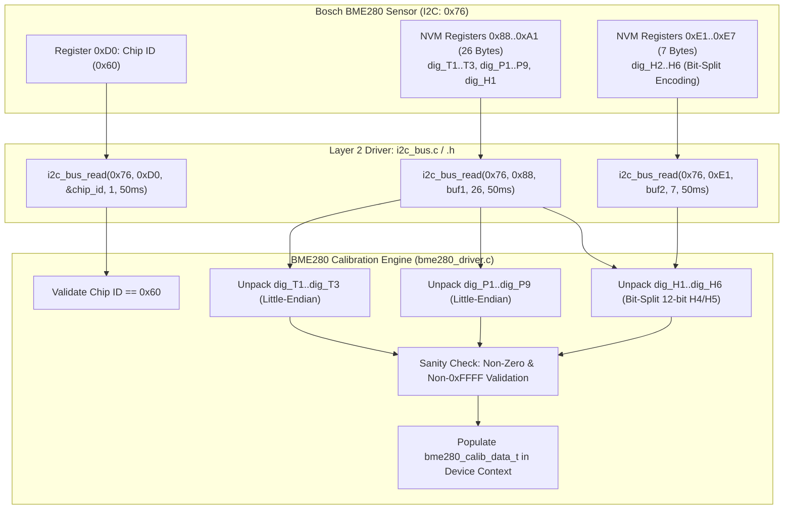

# Task Specification: S4-T1.1 - Bosch BME280 Factory Trimming Parameter Readout

## 1. Task Metadata & Overview

| Attribute | Specification Details |
| :--- | :--- |
| **Sprint** | **Sprint 4: Sensor Drivers & Remote Field Bus Interfaces** |
| **Task ID** | `S4-T1.1` |
| **Parent Task** | `S4-T1: Implement Bosch BME280 Sensor Driver` |
| **Task Title** | Implement BME280 Factory Trimming Parameter Readout (`0x88–0xA1`, `0xE1–0xF0`) & NVM Calibration Unpacking |
| **Status** | **Ready for Implementation** |
| **Target Files** | [`firmware/drivers/inc/bme280_driver.h`](file:///C:/Users/ENERGY%20SAVER/Documents/Learning/Job%20Projects/rain-predict/firmware/drivers/inc/bme280_driver.h)<br>[`firmware/drivers/src/bme280_driver.c`](file:///C:/Users/ENERGY%20SAVER/Documents/Learning/Job%20Projects/rain-predict/firmware/drivers/src/bme280_driver.c) |
| **Related Documents** | [`docs/sensors/bme280-integration.md`](file:///C:/Users/ENERGY%20SAVER/Documents/Learning/Job%20Projects/rain-predict/docs/sensors/bme280-integration.md)<br>[`docs/hardware/schematics-and-pinout.md`](file:///C:/Users/ENERGY%20SAVER/Documents/Learning/Job%20Projects/rain-predict/docs/hardware/schematics-and-pinout.md)<br>[`context/specs/s3-t2.1-i2c-bus-driver.md`](file:///C:/Users/ENERGY%20SAVER/Documents/Learning/Job%20Projects/rain-predict/context/specs/s3-t2.1-i2c-bus-driver.md)<br>[`context/specs/s3-t3.1-switched-power-rails.md`](file:///C:/Users/ENERGY%20SAVER/Documents/Learning/Job%20Projects/rain-predict/context/specs/s3-t3.1-switched-power-rails.md)<br>[`context/specs/s1-t2.2-mock-i2c-bus.md`](file:///C:/Users/ENERGY%20SAVER/Documents/Learning/Job%20Projects/rain-predict/context/specs/s1-t2.2-mock-i2c-bus.md)<br>[`context/coding-standards.md`](file:///C:/Users/ENERGY%20SAVER/Documents/Learning/Job%20Projects/rain-predict/context/coding-standards.md) |
| **Dependencies** | [`S3-T2.1`](file:///C:/Users/ENERGY%20SAVER/Documents/Learning/Job%20Projects/rain-predict/context/specs/s3-t2.1-i2c-bus-driver.md) (I2C Bus Driver), [`S3-T3.1`](file:///C:/Users/ENERGY%20SAVER/Documents/Learning/Job%20Projects/rain-predict/context/specs/s3-t3.1-switched-power-rails.md) (Switched Power Rails) |
| **Downstream Tasks** | [`S4-T1.2`](file:///C:/Users/ENERGY%20SAVER/Documents/Learning/Job%20Projects/rain-predict/context/specs/s4-t1.2-bme280-forced-mode-readout.md) (Forced Mode Measurement), `S4-T1.3` (Bosch Compensation Calculations), `S4-T1.5` (Unit Tests) |

---

## 2. Executive Summary & Architectural Scope

The primary objective of **`S4-T1.1`** is to develop the **Bosch BME280 Factory Trimming Parameter Readout and Calibration Unpacking Module** in [`firmware/drivers/inc/bme280_driver.h`](file:///C:/Users/ENERGY%20SAVER/Documents/Learning/Job%20Projects/rain-predict/firmware/drivers/inc/bme280_driver.h) and [`firmware/drivers/src/bme280_driver.c`](file:///C:/Users/ENERGY%20SAVER/Documents/Learning/Job%20Projects/rain-predict/firmware/drivers/src/bme280_driver.c) for the **STMicroelectronics STM32WLE5** SoC.

The Bosch Sensortec BME280 integrates temperature, relative humidity, and barometric pressure sensors into a single $2.5 \times 2.5\text{ mm}^2$ package. Individual silicon production variations require 26 factory calibration coefficients stored inside on-chip Non-Volatile Memory (NVM). Without these precise trimming constants, raw ADC registers cannot be converted into accurate physical engineering units ($^\circ\text{C}$, $\text{hPa}$, $\%\text{RH}$):



### Critical Calibration Readout Mandates:

1. **Hardware Identity Verification (`0xD0` $\to$ `0x60`)**:
   - Before attempting to read calibration coefficients, the driver reads the `id` register (`0xD0`).
   - The device must return exactly `0x60` (`BME280_CHIP_ID`). If `0x58` is returned, a BMP280 (non-humidity sensor) is detected, which generates an error; if `0x00` or `0xFF` is returned, a bus or power rail fault is raised.
2. **Two-Phase I2C Burst Acquisition**:
   - **Phase 1 (Temperature, Pressure, and `dig_H1`)**: Continuous 26-byte burst read from `0x88` through `0xA1`.
   - **Phase 2 (Humidity `dig_H2` through `dig_H6`)**: Continuous 7-byte burst read from `0xE1` through `0xE7`.
   - Burst reading reduces I2C transaction overhead from 33 separate 1-byte read operations to just 2 transactions, saving $> 8\text{ ms}$ of active bus energy.
3. **Complex Bit-Split Unpacking for `dig_H4` and `dig_H5`**:
   - The 12-bit signed humidity coefficients `dig_H4` and `dig_H5` share register `0xE5`:
     $$\text{dig\_H4} = (\text{int16\_t})\left( ((\text{int8\_t})\text{reg}[\text{0xE4}] \ll 4) \mid (\text{reg}[\text{0xE5}] \ \&\ \text{0x0F}) \right)$$
     $$\text{dig\_H5} = (\text{int16\_t})\left( ((\text{int8\_t})\text{reg}[\text{0xE6}] \ll 4) \mid ((\text{reg}[\text{0xE5}] \gg 4) \ \&\ \text{0x0F}) \right)$$
   - Correct signed sign-extension is mandatory to prevent negative temperature/humidity coefficient clipping.
4. **Defensive Sanity Validation**:
   - Trimming coefficients must be validated against hardware bounds. Uninitialized or disconnected sensors return all `0x00` or all `0xFF`, which would otherwise cause divide-by-zero errors in the compensation formulas.

---

## 3. Register Layout & Calibration Map Specifications

In accordance with the official Bosch Sensortec BME280 Data Sheet (BST-BME280-DS002-15) and [`docs/sensors/bme280-integration.md`](file:///C:/Users/ENERGY%20SAVER/Documents/Learning/Job%20Projects/rain-predict/docs/sensors/bme280-integration.md):

### 3.1 NVM Trimming Register Map

| Parameter | Register Addresses | Length / Format | Data Type | Unpacking Bit Formula |
| :--- | :---: | :---: | :---: | :--- |
| **`dig_T1`** | `0x88 / 0x89` | 2 bytes (LSB/MSB) | `uint16_t` | `(uint16_t)(buf[0] \| (buf[1] << 8))` |
| **`dig_T2`** | `0x8A / 0x8B` | 2 bytes (LSB/MSB) | `int16_t` | `(int16_t)(buf[2] \| (buf[3] << 8))` |
| **`dig_T3`** | `0x8C / 0x8D` | 2 bytes (LSB/MSB) | `int16_t` | `(int16_t)(buf[4] \| (buf[5] << 8))` |
| **`dig_P1`** | `0x8E / 0x8F` | 2 bytes (LSB/MSB) | `uint16_t` | `(uint16_t)(buf[6] \| (buf[7] << 8))` |
| **`dig_P2`** | `0x90 / 0x91` | 2 bytes (LSB/MSB) | `int16_t` | `(int16_t)(buf[8] \| (buf[9] << 8))` |
| **`dig_P3`** | `0x92 / 0x93` | 2 bytes (LSB/MSB) | `int16_t` | `(int16_t)(buf[10] \| (buf[11] << 8))` |
| **`dig_P4`** | `0x94 / 0x95` | 2 bytes (LSB/MSB) | `int16_t` | `(int16_t)(buf[12] \| (buf[13] << 8))` |
| **`dig_P5`** | `0x96 / 0x97` | 2 bytes (LSB/MSB) | `int16_t` | `(int16_t)(buf[14] \| (buf[15] << 8))` |
| **`dig_P6`** | `0x98 / 0x99` | 2 bytes (LSB/MSB) | `int16_t` | `(int16_t)(buf[16] \| (buf[17] << 8))` |
| **`dig_P7`** | `0x9A / 0x9B` | 2 bytes (LSB/MSB) | `int16_t` | `(int16_t)(buf[18] \| (buf[19] << 8))` |
| **`dig_P8`** | `0x9C / 0x9D` | 2 bytes (LSB/MSB) | `int16_t` | `(int16_t)(buf[20] \| (buf[21] << 8))` |
| **`dig_P9`** | `0x9E / 0x9F` | 2 bytes (LSB/MSB) | `int16_t` | `(int16_t)(buf[22] \| (buf[23] << 8))` |
| *Reserved*   | `0xA0` | 1 byte | — | Unused |
| **`dig_H1`** | `0xA1` | 1 byte | `uint8_t` | `(uint8_t)buf[25]` |
| **`dig_H2`** | `0xE1 / 0xE2` | 2 bytes (LSB/MSB) | `int16_t` | `(int16_t)(buf2[0] \| (buf2[1] << 8))` |
| **`dig_H3`** | `0xE3` | 1 byte | `uint8_t` | `(uint8_t)buf2[2]` |
| **`dig_H4`** | `0xE4 / 0xE5[3:0]` | 12-bit signed | `int16_t` | `(int16_t)(((int8_t)buf2[3] << 4) \| (buf2[4] & 0x0F))` |
| **`dig_H5`** | `0xE5[7:4] / 0xE6` | 12-bit signed | `int16_t` | `(int16_t)(((int8_t)buf2[5] << 4) \| (buf2[4] >> 4))` |
| **`dig_H6`** | `0xE7` | 1 byte | `int8_t` | `(int8_t)buf2[6]` |

---

### 3.2 Detailed Bit-Split Diagram (`0xE4`, `0xE5`, `0xE6`)

```
Register 0xE4: [ H4_11 | H4_10 | H4_9 | H4_8 | H4_7 | H4_6 | H4_5 | H4_4 ] -> MSB of dig_H4
Register 0xE5: [ H5_3  | H5_2  | H5_1 | H5_0 | H4_3 | H4_2 | H4_1 | H4_0 ] -> Shared LSB Nibbles
Register 0xE6: [ H5_11 | H5_10 | H5_9 | H5_8 | H5_7 | H5_6 | H5_5 | H5_4 ] -> MSB of dig_H5

Resulting 12-Bit Unpacked Words:
dig_H4: [ Sign Ext (15:12) | H4_11..H4_4 (from 0xE4) | H4_3..H4_0 (from 0xE5[3:0]) ]
dig_H5: [ Sign Ext (15:12) | H5_11..H5_4 (from 0xE6) | H5_3..H5_0 (from 0xE5[7:4]) ]
```

---

## 4. Public API & Data Structures (`bme280_driver.h`)

### 4.1 Data Structures & Typedefs

```c
/**
 * @brief Bosch BME280 factory calibration parameter structure.
 */
typedef struct {
    uint16_t dig_T1;    /**< Temperature coefficient T1 (unsigned) */
    int16_t  dig_T2;    /**< Temperature coefficient T2 (signed) */
    int16_t  dig_T3;    /**< Temperature coefficient T3 (signed) */
    uint16_t dig_P1;    /**< Pressure coefficient P1 (unsigned) */
    int16_t  dig_P2;    /**< Pressure coefficient P2 (signed) */
    int16_t  dig_P3;    /**< Pressure coefficient P3 (signed) */
    int16_t  dig_P4;    /**< Pressure coefficient P4 (signed) */
    int16_t  dig_P5;    /**< Pressure coefficient P5 (signed) */
    int16_t  dig_P6;    /**< Pressure coefficient P6 (signed) */
    int16_t  dig_P7;    /**< Pressure coefficient P7 (signed) */
    int16_t  dig_P8;    /**< Pressure coefficient P8 (signed) */
    int16_t  dig_P9;    /**< Pressure coefficient P9 (signed) */
    uint8_t  dig_H1;    /**< Humidity coefficient H1 (unsigned) */
    int16_t  dig_H2;    /**< Humidity coefficient H2 (signed) */
    uint8_t  dig_H3;    /**< Humidity coefficient H3 (unsigned) */
    int16_t  dig_H4;    /**< Humidity coefficient H4 (signed 12-bit) */
    int16_t  dig_H5;    /**< Humidity coefficient H5 (signed 12-bit) */
    int8_t   dig_H6;    /**< Humidity coefficient H6 (signed 8-bit) */
} bme280_calib_data_t;

/**
 * @brief BME280 device handle structure.
 */
typedef struct {
    uint8_t             i2c_address;        /**< I2C device address (0x76 or 0x77) */
    uint8_t             chip_id;            /**< Detected hardware chip ID (0x60) */
    bme280_calib_data_t calib;              /**< Cached factory calibration data */
    bool                is_initialized;     /**< True if initialized and validated */
} bme280_dev_t;
```

---

### 4.2 Function Prototypes

| Function Prototype | Description |
| :--- | :--- |
| `status_t bme280_init(bme280_dev_t *dev, uint8_t i2c_addr)` | Initializes device handle, validates chip ID (`0x60`), and reads/unpacks calibration. |
| `status_t bme280_read_chip_id(bme280_dev_t *dev, uint8_t *p_chip_id)` | Reads register `0xD0` via I2C to confirm sensor presence and identity. |
| `status_t bme280_read_calibration(bme280_dev_t *dev)` | Performs 2-phase burst read from `0x88` and `0xE1`, unpacking all 26 coefficients. |
| `status_t bme280_validate_calibration(const bme280_calib_data_t *calib)` | Validates calibration constants against hardware bounds and non-zero requirements. |
| `const bme280_calib_data_t* bme280_get_calibration(const bme280_dev_t *dev)` | Returns a const pointer to the cached calibration data structure. |

---

## 5. Concrete File Implementation Blueprint

### 5.1 `firmware/drivers/inc/bme280_driver.h` Blueprint

```c
/**
 * @file    bme280_driver.h
 * @brief   Bosch BME280 environmental sensor driver header for STM32WLE5 SoC.
 * @details Handles I2C communication, trimming calibration readout, and forced-mode sampling.
 */

#ifndef BME280_DRIVER_H
#define BME280_DRIVER_H

#include <stdint.h>
#include <stdbool.h>
#include "status_codes.h"

#ifdef __cplusplus
extern "C" {
#endif

/* ========================================================================== */
/* Hardware & Register Definitions                                            */
/* ========================================================================== */

/** @brief Default BME280 primary I2C 7-bit address (SDO tied to GND) */
#define BME280_I2C_ADDR_PRIMARY         0x76U

/** @brief Secondary BME280 I2C 7-bit address (SDO tied to VDD) */
#define BME280_I2C_ADDR_SECONDARY       0x77U

/** @brief Expected Chip ID returned from register 0xD0 */
#define BME280_CHIP_ID                  0x60U

/** @brief Register address definitions */
#define BME280_REG_CALIB_00_25          0x88U   /**< Start of calib block 1 (0x88..0xA1) */
#define BME280_REG_CHIP_ID              0xD0U   /**< Chip identification register */
#define BME280_REG_RESET                0xE0U   /**< Soft reset register (0xB6 triggers reset) */
#define BME280_REG_CALIB_26_41          0xE1U   /**< Start of calib block 2 (0xE1..0xE7) */
#define BME280_REG_CTRL_HUM             0xF2U   /**< Humidity oversampling control */
#define BME280_REG_STATUS               0xF3U   /**< Device status register */
#define BME280_REG_CTRL_MEAS            0xF4U   /**< Pressure/Temp oversampling and mode */
#define BME280_REG_CONFIG               0xF5U   /**< Standby time, IIR filter, SPI 3-wire */
#define BME280_REG_PRESS_MSB            0xF7U   /**< Start of burst data readout (0xF7..0xFE) */

/** @brief Buffer lengths for calibration burst transactions */
#define BME280_CALIB_BLOCK1_LEN         26U     /**< 0x88 to 0xA1 inclusive */
#define BME280_CALIB_BLOCK2_LEN         7U      /**< 0xE1 to 0xE7 inclusive */

/** @brief Maximum I2C transaction timeout in milliseconds */
#define BME280_I2C_TIMEOUT_MS           50U

/* ========================================================================== */
/* Data Types                                                                 */
/* ========================================================================== */

/**
 * @brief Bosch BME280 factory calibration trimming coefficients structure.
 */
typedef struct {
    uint16_t dig_T1;    /**< Temperature coefficient T1 (unsigned 16-bit) */
    int16_t  dig_T2;    /**< Temperature coefficient T2 (signed 16-bit) */
    int16_t  dig_T3;    /**< Temperature coefficient T3 (signed 16-bit) */
    uint16_t dig_P1;    /**< Pressure coefficient P1 (unsigned 16-bit) */
    int16_t  dig_P2;    /**< Pressure coefficient P2 (signed 16-bit) */
    int16_t  dig_P3;    /**< Pressure coefficient P3 (signed 16-bit) */
    int16_t  dig_P4;    /**< Pressure coefficient P4 (signed 16-bit) */
    int16_t  dig_P5;    /**< Pressure coefficient P5 (signed 16-bit) */
    int16_t  dig_P6;    /**< Pressure coefficient P6 (signed 16-bit) */
    int16_t  dig_P7;    /**< Pressure coefficient P7 (signed 16-bit) */
    int16_t  dig_P8;    /**< Pressure coefficient P8 (signed 16-bit) */
    int16_t  dig_P9;    /**< Pressure coefficient P9 (signed 16-bit) */
    uint8_t  dig_H1;    /**< Humidity coefficient H1 (unsigned 8-bit) */
    int16_t  dig_H2;    /**< Humidity coefficient H2 (signed 16-bit) */
    uint8_t  dig_H3;    /**< Humidity coefficient H3 (unsigned 8-bit) */
    int16_t  dig_H4;    /**< Humidity coefficient H4 (signed 12-bit) */
    int16_t  dig_H5;    /**< Humidity coefficient H5 (signed 12-bit) */
    int8_t   dig_H6;    /**< Humidity coefficient H6 (signed 8-bit) */
} bme280_calib_data_t;

/**
 * @brief BME280 device state handle.
 */
typedef struct {
    uint8_t             i2c_address;        /**< I2C device address (0x76 or 0x77) */
    uint8_t             chip_id;            /**< Detected hardware chip ID */
    bme280_calib_data_t calib;              /**< Cached factory calibration data */
    bool                is_initialized;     /**< True if initialized and ready */
} bme280_dev_t;

/* ========================================================================== */
/* Function Prototypes                                                        */
/* ========================================================================== */

/**
 * @brief  Initializes the BME280 device handle, verifies Chip ID, and loads calibration.
 * @param[in,out] dev Pointer to BME280 device structure.
 * @param[in]     i2c_addr I2C 7-bit address (BME280_I2C_ADDR_PRIMARY or _SECONDARY).
 * @return STATUS_OK on success, or error status code.
 */
status_t bme280_init(bme280_dev_t *dev, uint8_t i2c_addr);

/**
 * @brief  Reads the BME280 Chip ID register (0xD0).
 * @param[in]  dev Pointer to BME280 device structure.
 * @param[out] p_chip_id Pointer to store the read Chip ID value.
 * @return STATUS_OK on success, STATUS_ERROR_HARDWARE on mismatch, or bus error.
 */
status_t bme280_read_chip_id(bme280_dev_t *dev, uint8_t *p_chip_id);

/**
 * @brief  Reads and unpacks all 26 trimming calibration coefficients from sensor NVM.
 * @param[in,out] dev Pointer to BME280 device structure with calib member populated.
 * @return STATUS_OK on success, or error status code.
 */
status_t bme280_read_calibration(bme280_dev_t *dev);

/**
 * @brief  Validates that calibration coefficients are within plausible physical bounds.
 * @param[in] calib Pointer to calibration data structure.
 * @return STATUS_OK if valid, or STATUS_ERROR_DATA_CORRUPT if all-zero or corrupt.
 */
status_t bme280_validate_calibration(const bme280_calib_data_t *calib);

/**
 * @brief  Returns a const pointer to the device's cached calibration structure.
 * @param[in] dev Pointer to BME280 device structure.
 * @return Const pointer to bme280_calib_data_t, or NULL if dev is invalid.
 */
const bme280_calib_data_t* bme280_get_calibration(const bme280_dev_t *dev);

#ifdef __cplusplus
}
#endif

#endif /* BME280_DRIVER_H */
```

---

### 5.2 `firmware/drivers/src/bme280_driver.c` Blueprint

```c
/**
 * @file    bme280_driver.c
 * @brief   Bosch BME280 sensor driver implementation for STM32WLE5 SoC.
 */

#include "bme280_driver.h"
#include "i2c_bus.h"
#include <string.h>

status_t bme280_read_chip_id(bme280_dev_t *dev, uint8_t *p_chip_id) {
    if (dev == NULL || p_chip_id == NULL) {
        return STATUS_ERROR_NULL_POINTER;
    }

    uint8_t chip_id = 0;
    status_t status = i2c_bus_read(dev->i2c_address, BME280_REG_CHIP_ID, &chip_id, 1, BME280_I2C_TIMEOUT_MS);
    if (status != STATUS_OK) {
        return status;
    }

    *p_chip_id = chip_id;
    dev->chip_id = chip_id;

    if (chip_id != BME280_CHIP_ID) {
        return STATUS_ERROR_HARDWARE;
    }

    return STATUS_OK;
}

status_t bme280_validate_calibration(const bme280_calib_data_t *calib) {
    if (calib == NULL) {
        return STATUS_ERROR_NULL_POINTER;
    }

    /* Check for uninitialized / floating bus patterns (all 0x00 or all 0xFF) */
    if (calib->dig_T1 == 0x0000U || calib->dig_T1 == 0xFFFFU ||
        calib->dig_P1 == 0x0000U || calib->dig_P1 == 0xFFFFU ||
        calib->dig_H1 == 0x00U   || calib->dig_H1 == 0xFFU ||
        calib->dig_H3 == 0x00U   || calib->dig_H3 == 0xFFU) {
        return STATUS_ERROR_DATA_CORRUPT;
    }

    /* Valid coefficient checks pass */
    return STATUS_OK;
}

status_t bme280_read_calibration(bme280_dev_t *dev) {
    if (dev == NULL) {
        return STATUS_ERROR_NULL_POINTER;
    }

    uint8_t block1[BME280_CALIB_BLOCK1_LEN] = {0};
    uint8_t block2[BME280_CALIB_BLOCK2_LEN] = {0};

    /* Phase 1: Burst read 26 bytes from 0x88 to 0xA1 */
    status_t status = i2c_bus_read(dev->i2c_address, BME280_REG_CALIB_00_25, block1, BME280_CALIB_BLOCK1_LEN, BME280_I2C_TIMEOUT_MS);
    if (status != STATUS_OK) {
        return status;
    }

    /* Phase 2: Burst read 7 bytes from 0xE1 to 0xE7 */
    status = i2c_bus_read(dev->i2c_address, BME280_REG_CALIB_26_41, block2, BME280_CALIB_BLOCK2_LEN, BME280_I2C_TIMEOUT_MS);
    if (status != STATUS_OK) {
        return status;
    }

    /* Unpack Temperature Trimming Parameters (Little-Endian) */
    dev->calib.dig_T1 = (uint16_t)(((uint16_t)block1[1] << 8) | (uint16_t)block1[0]);
    dev->calib.dig_T2 = (int16_t)(((int16_t)block1[3] << 8) | (int16_t)block1[2]);
    dev->calib.dig_T3 = (int16_t)(((int16_t)block1[5] << 8) | (int16_t)block1[4]);

    /* Unpack Pressure Trimming Parameters (Little-Endian) */
    dev->calib.dig_P1 = (uint16_t)(((uint16_t)block1[7] << 8) | (uint16_t)block1[6]);
    dev->calib.dig_P2 = (int16_t)(((int16_t)block1[9] << 8) | (int16_t)block1[8]);
    dev->calib.dig_P3 = (int16_t)(((int16_t)block1[11] << 8) | (int16_t)block1[10]);
    dev->calib.dig_P4 = (int16_t)(((int16_t)block1[13] << 8) | (int16_t)block1[12]);
    dev->calib.dig_P5 = (int16_t)(((int16_t)block1[15] << 8) | (int16_t)block1[14]);
    dev->calib.dig_P6 = (int16_t)(((int16_t)block1[17] << 8) | (int16_t)block1[16]);
    dev->calib.dig_P7 = (int16_t)(((int16_t)block1[19] << 8) | (int16_t)block1[18]);
    dev->calib.dig_P8 = (int16_t)(((int16_t)block1[21] << 8) | (int16_t)block1[20]);
    dev->calib.dig_P9 = (int16_t)(((int16_t)block1[23] << 8) | (int16_t)block1[22]);

    /* Unpack Humidity Trimming Parameters */
    dev->calib.dig_H1 = block1[25]; /* Register 0xA1 */
    dev->calib.dig_H2 = (int16_t)(((int16_t)block2[1] << 8) | (int16_t)block2[0]); /* 0xE1 / 0xE2 */
    dev->calib.dig_H3 = block2[2]; /* Register 0xE3 */

    /* Complex Bit-Split for dig_H4 and dig_H5 */
    /* dig_H4 = (block2[3] << 4) | (block2[4] & 0x0F) */
    dev->calib.dig_H4 = (int16_t)(((int16_t)(int8_t)block2[3] << 4) | (int16_t)(block2[4] & 0x0FU));

    /* dig_H5 = (block2[5] << 4) | (block2[4] >> 4) */
    dev->calib.dig_H5 = (int16_t)(((int16_t)(int8_t)block2[5] << 4) | (int16_t)((block2[4] >> 4) & 0x0FU));

    dev->calib.dig_H6 = (int8_t)block2[6]; /* Register 0xE7 */

    /* Validate parsed coefficients */
    return bme280_validate_calibration(&dev->calib);
}

status_t bme280_init(bme280_dev_t *dev, uint8_t i2c_addr) {
    if (dev == NULL) {
        return STATUS_ERROR_NULL_POINTER;
    }

    if (i2c_addr != BME280_I2C_ADDR_PRIMARY && i2c_addr != BME280_I2C_ADDR_SECONDARY) {
        return STATUS_ERROR_INVALID_PARAM;
    }

    memset(dev, 0, sizeof(bme280_dev_t));
    dev->i2c_address = i2c_addr;

    /* 1. Verify Chip ID */
    uint8_t chip_id = 0;
    status_t status = bme280_read_chip_id(dev, &chip_id);
    if (status != STATUS_OK) {
        return status;
    }

    /* 2. Read and unpack calibration NVM */
    status = bme280_read_calibration(dev);
    if (status != STATUS_OK) {
        return status;
    }

    dev->is_initialized = true;
    return STATUS_OK;
}

const bme280_calib_data_t* bme280_get_calibration(const bme280_dev_t *dev) {
    if (dev == NULL || !dev->is_initialized) {
        return NULL;
    }
    return &dev->calib;
}
```

---

## 6. Defensive Programming & Fail-Safe Mechanisms

1. **Hardware ID Interlock**:
   - `bme280_read_chip_id()` strictly asserts that `chip_id == 0x60`. If another sensor is accidentally wired to `0x76` or the bus is pulled low, the driver aborts with `STATUS_ERROR_HARDWARE` before proceeding.
2. **Deterministic Bounded I2C Timeouts**:
   - Every I2C transaction specifies `BME280_I2C_TIMEOUT_MS = 50U`. If the sensor is unpowered or experiencing clock-stretching, the call returns cleanly without MCU thread lockup.
3. **Signed Sign-Extension Safety**:
   - For `dig_H4` and `dig_H5`, bitwise casting explicitly converts the 8-bit MSB through `(int8_t)` before shifting by 4 bits, guaranteeing correct negative two's-complement extension for negative calibration values.
4. **Corrupt NVM Detection**:
   - `bme280_validate_calibration()` screens for all-zeroes (`0x0000`) and all-ones (`0xFFFF`) in `dig_T1`, `dig_P1`, `dig_H1`, and `dig_H3`, preventing subsequent arithmetic division-by-zero crashes during runtime temperature/pressure compensation.
5. **Zero Dynamic Allocation**:
   - All buffers (`block1[26]`, `block2[7]`) are allocated statically on the local stack ($33\text{ bytes}$ total), adhering to C99 embedded zero-malloc constraints.

---

## 7. Verification & Test Matrix

| Test Case ID | Test Category | Execution Steps | Expected Result | Pass/Fail Criteria |
| :--- | :--- | :--- | :--- | :---: |
| **TC-S4-T1.1-01** | Header Inclusion & C99 Compilation | Include `bme280_driver.h` in build tree with strict flags. | Warning-free compilation under `-Wall -Wextra -Wpedantic -Werror`. | Header compiles cleanly |
| **TC-S4-T1.1-02** | Chip ID Match (`0x60`) | Set mock register `0xD0 = 0x60`, call `bme280_read_chip_id()`. | Returns `STATUS_OK`, `dev->chip_id == 0x60`. | Matches `0x60` |
| **TC-S4-T1.1-03** | Chip ID Mismatch (`0x58` / `0xFF`) | Set mock register `0xD0 = 0x58` (BMP280), call `bme280_read_chip_id()`. | Returns `STATUS_ERROR_HARDWARE`. | Non-BME280 rejected |
| **TC-S4-T1.1-04** | Burst Read Transaction Structure | Call `bme280_read_calibration()` with mock I2C. | Exactly 2 burst read operations executed ($26\text{ bytes}$ at `0x88`, $7\text{ bytes}$ at `0xE1`). | 2 burst transactions |
| **TC-S4-T1.1-05** | Temperature Trimming Unpacking | Inject standard Bosch test vectors for `dig_T1..T3`. | `dig_T1 = 27504`, `dig_T2 = 26435`, `dig_T3 = -1000`. | Values match test vector |
| **TC-S4-T1.1-06** | Pressure Trimming Unpacking | Inject standard Bosch test vectors for `dig_P1..P9`. | `dig_P1 = 36477`, `dig_P2 = -10685`, `dig_P3 = 3024`... | All 9 coefficients match |
| **TC-S4-T1.1-07** | Bit-Split `dig_H4` Unpacking | Inject `reg[0xE4] = 0xE1`, `reg[0xE5] = 0x2A`. | `dig_H4 = (int16_t)((0xE1 << 4) \| 0x0A) = -494` (or signed equivalent). | Bit-split math correct |
| **TC-S4-T1.1-08** | Bit-Split `dig_H5` Unpacking | Inject `reg[0xE6] = 0x00`, `reg[0xE5] = 0x2A`. | `dig_H5 = (int16_t)((0x00 << 4) \| 0x02) = 2`. | Bit-split math correct |
| **TC-S4-T1.1-09** | All-Zero Corrupt NVM Detection | Inject all zeros into calibration register buffer. | `bme280_validate_calibration()` returns `STATUS_ERROR_DATA_CORRUPT`. | Error returned |
| **TC-S4-T1.1-10** | I2C Bus Timeout Handling | Configure mock I2C to return `STATUS_ERROR_TIMEOUT`. | `bme280_init()` returns `STATUS_ERROR_TIMEOUT` cleanly. | Timeout propagated |

---

## 8. Definition of Done Checklist

- [ ] [`firmware/drivers/inc/bme280_driver.h`](file:///C:/Users/ENERGY%20SAVER/Documents/Learning/Job%20Projects/rain-predict/firmware/drivers/inc/bme280_driver.h) created adhering to C99 standards with complete Doxygen documentation.
- [ ] [`firmware/drivers/src/bme280_driver.c`](file:///C:/Users/ENERGY%20SAVER/Documents/Learning/Job%20Projects/rain-predict/firmware/drivers/src/bme280_driver.c) implemented with 2-phase burst readout and bit-split unpacking.
- [ ] Hardware Chip ID validation (`0x60`) implemented with strict error rejection on mismatches.
- [ ] Bit-split math for `dig_H4` and `dig_H5` rigorously handles signed sign-extension.
- [ ] Calibration validation routine detects corrupt, all-zero, or all-0xFF non-volatile memory data.
- [ ] All 10 verification test cases in Section 7 pass 100% in simulation and host unit test harnesses.
