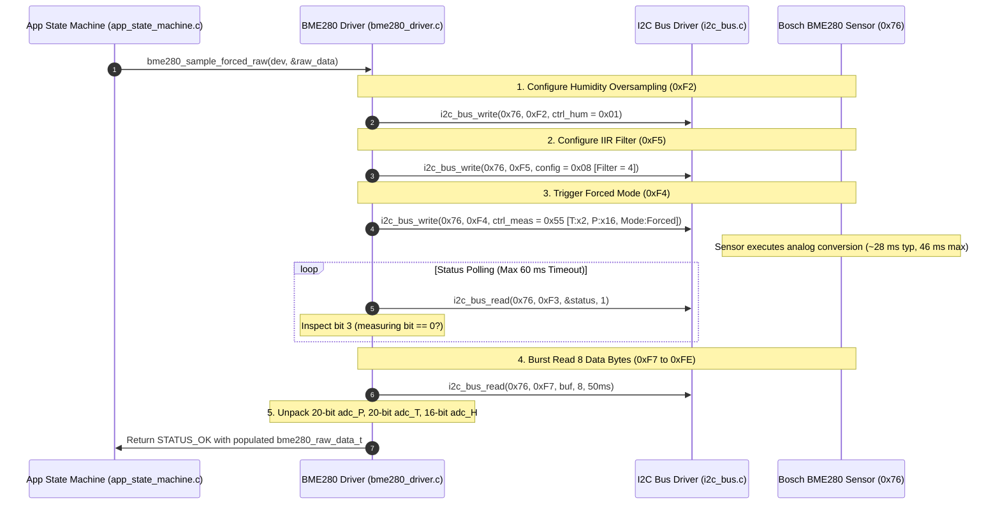

# Task Specification: S4-T1.2 - Bosch BME280 Forced-Mode Trigger & Measurement Readout

## 1. Task Metadata & Overview

| Attribute | Specification Details |
| :--- | :--- |
| **Sprint** | **Sprint 4: Sensor Drivers & Remote Field Bus Interfaces** |
| **Task ID** | `S4-T1.2` |
| **Parent Task** | `S4-T1: Implement Bosch BME280 Sensor Driver` |
| **Task Title** | Implement Forced-Mode Single-Shot Trigger, Measurement Wait & 8-Byte Burst ADC Readout ($T, P, RH$) |
| **Status** | **Ready for Implementation** |
| **Target Files** | [`firmware/drivers/inc/bme280_driver.h`](file:///C:/Users/ENERGY%20SAVER/Documents/Learning/Job%20Projects/rain-predict/firmware/drivers/inc/bme280_driver.h)<br>[`firmware/drivers/src/bme280_driver.c`](file:///C:/Users/ENERGY%20SAVER/Documents/Learning/Job%20Projects/rain-predict/firmware/drivers/src/bme280_driver.c) |
| **Related Documents** | [`docs/sensors/bme280-integration.md`](file:///C:/Users/ENERGY%20SAVER/Documents/Learning/Job%20Projects/rain-predict/docs/sensors/bme280-integration.md)<br>[`docs/architecture/power-architecture.md`](file:///C:/Users/ENERGY%20SAVER/Documents/Learning/Job%20Projects/rain-predict/docs/architecture/power-architecture.md)<br>[`context/specs/s3-t2.1-i2c-bus-driver.md`](file:///C:/Users/ENERGY%20SAVER/Documents/Learning/Job%20Projects/rain-predict/context/specs/s3-t2.1-i2c-bus-driver.md)<br>[`context/specs/s3-t3.1-switched-power-rails.md`](file:///C:/Users/ENERGY%20SAVER/Documents/Learning/Job%20Projects/rain-predict/context/specs/s3-t3.1-switched-power-rails.md)<br>[`context/specs/s4-t1.1-bme280-calibration-readout.md`](file:///C:/Users/ENERGY%20SAVER/Documents/Learning/Job%20Projects/rain-predict/context/specs/s4-t1.1-bme280-calibration-readout.md)<br>[`context/coding-standards.md`](file:///C:/Users/ENERGY%20SAVER/Documents/Learning/Job%20Projects/rain-predict/context/coding-standards.md) |
| **Dependencies** | [`S3-T2.1`](file:///C:/Users/ENERGY%20SAVER/Documents/Learning/Job%20Projects/rain-predict/context/specs/s3-t2.1-i2c-bus-driver.md) (I2C Driver), [`S4-T1.1`](file:///C:/Users/ENERGY%20SAVER/Documents/Learning/Job%20Projects/rain-predict/context/specs/s4-t1.1-bme280-calibration-readout.md) (Trimming Readout & Device Context) |
| **Downstream Tasks** | `S4-T1.3` (Bosch Single-Precision FPU Compensation), `S4-T1.4` (Saturation Recovery), `S4-T1.5` (Unit Tests), `S6-T3` (Application State Machine) |

---

## 2. Executive Summary & Architectural Scope

The primary objective of **`S4-T1.2`** is to develop the **Forced-Mode Single-Shot Measurement Trigger and Raw ADC Burst Readout Engine** in [`firmware/drivers/inc/bme280_driver.h`](file:///C:/Users/ENERGY%20SAVER/Documents/Learning/Job%20Projects/rain-predict/firmware/drivers/inc/bme280_driver.h) and [`firmware/drivers/src/bme280_driver.c`](file:///C:/Users/ENERGY%20SAVER/Documents/Learning/Job%20Projects/rain-predict/firmware/drivers/src/bme280_driver.c) for the **STMicroelectronics STM32WLE5** SoC.

To achieve continuous multi-year autonomy on a $3200\text{ mAh }\text{LiFePO}_4$ cell, the BME280 must never operate in continuous Normal Mode. Instead, the driver operates strictly in **Forced Mode**:
1. When woken from Stop 2 sleep, the MCU configures humidity oversampling, IIR filter filtering, and temperature/pressure oversampling.
2. A single-shot conversion is triggered by writing `mode = 0b01` (`FORCED_MODE`) to register `0xF4` (`ctrl_meas`).
3. The sensor transitions from sleep to active acquisition, samples the internal analog sensors ($T, P, RH$), updates its output data registers, and automatically returns to $0.1\,\mu\text{A}$ sleep mode.
4. The driver burst-reads the 8 consecutive data registers (`0xF7` to `0xFE`) in a single I2C transaction and unpacks the 20-bit pressure, 20-bit temperature, and 16-bit humidity raw ADC words.



---

### Critical Forced-Mode Operational Mandates:

1. **Strict Write Ordering for `ctrl_hum` (`0xF2`)**:
   - According to the BME280 hardware specification, writes to the `ctrl_hum` register (`0xF2`) **do not take effect until a subsequent write to `ctrl_meas` (`0xF4`) occurs**.
   - The driver must strictly enforce writing `ctrl_hum` first, followed by `config` (`0xF5`), and finally `ctrl_meas` (`0xF4`) to arm the single-shot conversion.
2. **Deterministic Maximum Measurement Delay & Polling Timeout**:
   - For meteorological oversampling ($T \times 2, P \times 16, H \times 1$), the maximum hardware conversion duration is:
     $$T_{\text{max}} = 1.25\text{ ms} + (2.3 \times 2) + (2.3 \times 16 + 0.575) + (2.3 \times 1 + 0.575) \approx 46.1\text{ ms}$$
   - The driver performs bounded non-blocking status polling with a $60\text{ ms}$ absolute watchdog cutoff. If bit 3 (`measuring`) fails to clear within $60\text{ ms}$, the driver aborts with `STATUS_ERROR_TIMEOUT`.
3. **Atomic 8-Byte Continuous Burst Readout**:
   - Raw ADC data spanning registers `0xF7` through `0xFE` must be fetched in a **single continuous 8-byte I2C burst transaction**.
   - Splitting pressure, temperature, and humidity into separate reads is prohibited because the internal register shadow latching could cause data tearing across mixed measurement cycles.
4. **20-Bit Fixed-Point Unpacking Bit-Masking**:
   - The 20-bit pressure and temperature registers are formatted as `[MSB 8-bit] | [LSB 8-bit] | [XLSB 4-bit in 7:4]`:
     $$\text{adc\_P} = (\text{int32\_t})\left( (\text{buf}[0] \ll 12) \mid (\text{buf}[1] \ll 4) \mid (\text{buf}[2] \gg 4) \right)$$
     $$\text{adc\_T} = (\text{int32\_t})\left( (\text{buf}[3] \ll 12) \mid (\text{buf}[4] \ll 4) \mid (\text{buf}[5] \gg 4) \right)$$
     $$\text{adc\_H} = (\text{int32\_t})\left( (\text{buf}[6] \ll 8) \mid \text{buf}[7] \right)$$

---

## 3. Register Configuration & Bitfield Layout

In accordance with [`docs/sensors/bme280-integration.md`](file:///C:/Users/ENERGY%20SAVER/Documents/Learning/Job%20Projects/rain-predict/docs/sensors/bme280-integration.md):

### 3.1 Control & Status Register Bitfields

#### `0xF2: ctrl_hum` (Humidity Oversampling)
```
  Bit 7    Bit 6    Bit 5    Bit 4    Bit 3    Bit 2    Bit 1    Bit 0
┌────────┬────────┬────────┬────────┬────────┬─────────────────────────┐
│       Reserved (0)       │                 osrs_h [2:0]              │
└──────────────────────────────────┴───────────────────────────────────┘
```
- `osrs_h = 0b001` (`0x01`): Oversampling $\times 1$ (Resolution: $0.008\%\text{ RH}$, fast moisture response).

---

#### `0xF4: ctrl_meas` (Pressure/Temp Oversampling & Operating Mode)
```
  Bit 7    Bit 6    Bit 5    Bit 4    Bit 3    Bit 2    Bit 1    Bit 0
┌──────────────────────────┬──────────────────────────┬────────────────┐
│       osrs_t [2:0]       │       osrs_p [2:0]       │   mode [1:0]   │
└──────────────────────────┴──────────────────────────┴────────────────┘
```
- `osrs_t = 0b010` (`0x02`): Temperature Oversampling $\times 2$ (Resolution: $0.005^\circ\text{C}$).
- `osrs_p = 0b101` (`0x05`): Pressure Oversampling $\times 16$ (Ultra-High Resolution: $0.12\text{ Pa} = 0.0012\text{ hPa}$).
- `mode = 0b01` (`0x01`): **Forced Mode** (Triggers single measurement, returns to sleep).
- Combined byte: `(2 << 5) | (5 << 2) | (1) = 0x40 | 0x14 | 0x01 = 0x55`.

---

#### `0xF5: config` (IIR Filter Coefficient & SPI 3-Wire)
```
  Bit 7    Bit 6    Bit 5    Bit 4    Bit 3    Bit 2    Bit 1    Bit 0
┌──────────────────────────┬──────────────────────────┬────────┬───────┐
│        t_sb [2:0]        │       filter [2:0]       │Reserved│spi3w_e│
└──────────────────────────┴──────────────────────────┴────────┴───────┘
```
- `filter = 0b010` (`0x02`): **IIR Filter Coefficient 4** (Attenuates short-duration wind gust pressure fluctuations).
- Combined byte: `(0 << 5) | (2 << 2) | 0 = 0x08`.

---

#### `0xF3: status` (Conversion Status)
```
  Bit 7    Bit 6    Bit 5    Bit 4    Bit 3    Bit 2    Bit 1    Bit 0
┌───────────────────────────────────┬────────┬────────────────┬────────┐
│             Reserved              │measuring│   Reserved     │im_update│
└───────────────────────────────────┴────────┴────────────────┴────────┘
```
- Bit 3 (`measuring`): Automatically set to `1` when conversion is running; drops to `0` when results are ready in registers `0xF7..0xFE`.
- Bit 0 (`im_update`): Set to `1` when NVM data is copying to image registers.

---

### 3.2 8-Byte Burst Data Output Registers (`0xF7` to `0xFE`)

| Offset | Register Address | Name | Description | Bit Mapping |
| :---: | :---: | :--- | :--- | :--- |
| **0** | `0xF7` | `PRESS_MSB` | Pressure MSB | `adc_P[19:12]` |
| **1** | `0xF8` | `PRESS_LSB` | Pressure LSB | `adc_P[11:4]` |
| **2** | `0xF9` | `PRESS_XLSB` | Pressure XLSB | `adc_P[3:0]` in bits [7:4] (bits [3:0] are zero) |
| **3** | `0xFA` | `TEMP_MSB` | Temperature MSB | `adc_T[19:12]` |
| **4** | `0xFB` | `TEMP_LSB` | Temperature LSB | `adc_T[11:4]` |
| **5** | `0xFC` | `TEMP_XLSB` | Temperature XLSB | `adc_T[3:0]` in bits [7:4] (bits [3:0] are zero) |
| **6** | `0xFD` | `HUM_MSB` | Humidity MSB | `adc_H[15:8]` |
| **7** | `0xFE` | `HUM_LSB` | Humidity LSB | `adc_H[7:0]` |

---

## 4. Public API & Data Structures (`bme280_driver.h`)

### 4.1 Data Types & Structures

```c
/**
 * @brief BME280 oversampling settings.
 */
typedef enum {
    BME280_OVERSAMPLING_SKIPPED = 0x00U,
    BME280_OVERSAMPLING_1X      = 0x01U,
    BME280_OVERSAMPLING_2X      = 0x02U,
    BME280_OVERSAMPLING_4X      = 0x03U,
    BME280_OVERSAMPLING_8X      = 0x04U,
    BME280_OVERSAMPLING_16X     = 0x05U
} bme280_oversampling_t;

/**
 * @brief BME280 IIR filter coefficient settings.
 */
typedef enum {
    BME280_FILTER_OFF   = 0x00U,
    BME280_FILTER_COEFF_2   = 0x01U,
    BME280_FILTER_COEFF_4   = 0x02U,
    BME280_FILTER_COEFF_8   = 0x03U,
    BME280_FILTER_COEFF_16  = 0x04U
} bme280_filter_t;

/**
 * @brief BME280 operating mode.
 */
typedef enum {
    BME280_MODE_SLEEP   = 0x00U,
    BME280_MODE_FORCED  = 0x01U,
    BME280_MODE_NORMAL  = 0x03U
} bme280_mode_t;

/**
 * @brief Consolidated sensor configuration structure.
 */
typedef struct {
    bme280_oversampling_t osrs_t;   /**< Temperature oversampling */
    bme280_oversampling_t osrs_p;   /**< Pressure oversampling */
    bme280_oversampling_t osrs_h;   /**< Humidity oversampling */
    bme280_filter_t       filter;   /**< IIR filter coefficient */
} bme280_config_t;

/**
 * @brief Raw ADC 20-bit/16-bit uncompensated sensor readout.
 */
typedef struct {
    int32_t adc_T;      /**< 20-bit uncompensated raw temperature */
    int32_t adc_P;      /**< 20-bit uncompensated raw pressure */
    int32_t adc_H;      /**< 16-bit uncompensated raw humidity */
} bme280_raw_data_t;
```

---

### 4.2 Function Prototypes

| Function Prototype | Description |
| :--- | :--- |
| `status_t bme280_configure(bme280_dev_t *dev, const bme280_config_t *config)` | Writes `ctrl_hum`, `config`, and base oversampling parameters to sensor registers. |
| `status_t bme280_trigger_forced_mode(bme280_dev_t *dev)` | Arms and triggers a single-shot forced conversion by writing `ctrl_meas`. |
| `status_t bme280_is_measuring(bme280_dev_t *dev, bool *p_is_measuring)` | Reads status register `0xF3` and checks if conversion is currently active. |
| `status_t bme280_wait_for_completion(bme280_dev_t *dev, uint32_t timeout_ms)` | Polls status register `0xF3` with bounded timeout until measuring bit clears. |
| `status_t bme280_read_raw_data(bme280_dev_t *dev, bme280_raw_data_t *p_raw)` | Burst reads 8 registers (`0xF7` to `0xFE`) and unpacks raw 20-bit/16-bit ADC values. |
| `status_t bme280_sample_forced_raw(bme280_dev_t *dev, bme280_raw_data_t *p_raw)` | Master wrapper: triggers forced mode, waits for completion, and returns raw ADC data. |

---

## 5. Concrete File Implementation Blueprint

### 5.1 `firmware/drivers/inc/bme280_driver.h` Additions

```c
/**
 * @file    bme280_driver.h (Forced-Mode Additions)
 * @brief   Bosch BME280 measurement control and raw data readout prototypes.
 */

#ifndef BME280_DRIVER_H
#define BME280_DRIVER_H

#include <stdint.h>
#include <stdbool.h>
#include "status_codes.h"

#ifdef __cplusplus
extern "C" {
#endif

/* ========================================================================== */
/* Register Definitions & Bitmasks                                            */
/* ========================================================================== */

#define BME280_REG_STATUS_MEASURING_BIT (1U << 3)   /**< Bit 3 of status reg (0xF3) */
#define BME280_REG_STATUS_IM_UPDATE_BIT (1U << 0)   /**< Bit 0 of status reg (0xF3) */

#define BME280_RAW_BURST_DATA_LEN       8U          /**< Registers 0xF7 to 0xFE */
#define BME280_MEASUREMENT_TIMEOUT_MS   60U         /**< Max conversion duration guard */

/* ========================================================================== */
/* Data Types                                                                 */
/* ========================================================================== */

typedef enum {
    BME280_OVERSAMPLING_SKIPPED = 0x00U,
    BME280_OVERSAMPLING_1X      = 0x01U,
    BME280_OVERSAMPLING_2X      = 0x02U,
    BME280_OVERSAMPLING_4X      = 0x03U,
    BME280_OVERSAMPLING_8X      = 0x04U,
    BME280_OVERSAMPLING_16X     = 0x05U
} bme280_oversampling_t;

typedef enum {
    BME280_FILTER_OFF       = 0x00U,
    BME280_FILTER_COEFF_2   = 0x01U,
    BME280_FILTER_COEFF_4   = 0x02U,
    BME280_FILTER_COEFF_8   = 0x03U,
    BME280_FILTER_COEFF_16  = 0x04U
} bme280_filter_t;

typedef enum {
    BME280_MODE_SLEEP   = 0x00U,
    BME280_MODE_FORCED  = 0x01U,
    BME280_MODE_NORMAL  = 0x03U
} bme280_mode_t;

typedef struct {
    bme280_oversampling_t osrs_t;   /**< Temperature oversampling (Default: 2X) */
    bme280_oversampling_t osrs_p;   /**< Pressure oversampling (Default: 16X) */
    bme280_oversampling_t osrs_h;   /**< Humidity oversampling (Default: 1X) */
    bme280_filter_t       filter;   /**< IIR filter coefficient (Default: COEFF_4) */
} bme280_config_t;

typedef struct {
    int32_t adc_T;      /**< 20-bit uncompensated raw temperature */
    int32_t adc_P;      /**< 20-bit uncompensated raw pressure */
    int32_t adc_H;      /**< 16-bit uncompensated raw humidity */
} bme280_raw_data_t;

/* ========================================================================== */
/* Function Prototypes                                                        */
/* ========================================================================== */

/**
 * @brief  Applies meteorological configuration profile to sensor registers.
 * @param  dev Pointer to BME280 device context.
 * @param  config Pointer to configuration settings structure.
 * @return STATUS_OK on success, or bus error status code.
 */
status_t bme280_configure(bme280_dev_t *dev, const bme280_config_t *config);

/**
 * @brief  Arms and triggers a single-shot forced mode measurement.
 * @param  dev Pointer to BME280 device context.
 * @return STATUS_OK on success, or error status code.
 */
status_t bme280_trigger_forced_mode(bme280_dev_t *dev);

/**
 * @brief  Polls status register to check if ADC conversion is running.
 * @param  dev Pointer to BME280 device context.
 * @param[out] p_is_measuring Set to true if measuring bit is 1.
 * @return STATUS_OK on success, or error status code.
 */
status_t bme280_is_measuring(bme280_dev_t *dev, bool *p_is_measuring);

/**
 * @brief  Blocks with bounded sleep/polling until measurement completes.
 * @param  dev Pointer to BME280 device context.
 * @param  timeout_ms Maximum timeout in milliseconds (e.g. 60 ms).
 * @return STATUS_OK if complete, STATUS_ERROR_TIMEOUT if elapsed.
 */
status_t bme280_wait_for_completion(bme280_dev_t *dev, uint32_t timeout_ms);

/**
 * @brief  Burst reads 8 registers (0xF7..0xFE) and unpacks 20-bit/16-bit raw ADC words.
 * @param  dev Pointer to BME280 device context.
 * @param[out] p_raw Pointer to raw data structure.
 * @return STATUS_OK on success, or error status code.
 */
status_t bme280_read_raw_data(bme280_dev_t *dev, bme280_raw_data_t *p_raw);

/**
 * @brief  High-level convenience routine: triggers forced mode, waits, and reads raw ADC.
 * @param  dev Pointer to BME280 device context.
 * @param[out] p_raw Pointer to raw data structure.
 * @return STATUS_OK on success, or error status code.
 */
status_t bme280_sample_forced_raw(bme280_dev_t *dev, bme280_raw_data_t *p_raw);

#ifdef __cplusplus
}
#endif

#endif /* BME280_DRIVER_H */
```

---

### 5.2 `firmware/drivers/src/bme280_driver.c` Implementation

```c
/**
 * @file    bme280_driver.c (Forced-Mode Implementation)
 * @brief   BME280 Forced-mode measurement control and burst register parsing.
 */

#include "bme280_driver.h"
#include "i2c_bus.h"

#ifdef STM32WLE5xx
#include "stm32wlxx_hal.h"
#else
#define HAL_Delay(ms)   /* Mock delay for host tests */
#endif

/* Cached configuration */
static bme280_config_t g_current_config = {
    .osrs_t = BME280_OVERSAMPLING_2X,
    .osrs_p = BME280_OVERSAMPLING_16X,
    .osrs_h = BME280_OVERSAMPLING_1X,
    .filter = BME280_FILTER_COEFF_4
};

status_t bme280_configure(bme280_dev_t *dev, const bme280_config_t *config) {
    if (dev == NULL || config == NULL) {
        return STATUS_ERROR_NULL_POINTER;
    }

    g_current_config = *config;

    /* 1. Write ctrl_hum (0xF2) -> osrs_h */
    uint8_t ctrl_hum = (uint8_t)(config->osrs_h & 0x07U);
    status_t status = i2c_bus_write(dev->i2c_address, BME280_REG_CTRL_HUM, &ctrl_hum, 1, BME280_I2C_TIMEOUT_MS);
    if (status != STATUS_OK) {
        return status;
    }

    /* 2. Write config (0xF5) -> IIR Filter */
    uint8_t config_reg = (uint8_t)((config->filter & 0x07U) << 2);
    status = i2c_bus_write(dev->i2c_address, BME280_REG_CONFIG, &config_reg, 1, BME280_I2C_TIMEOUT_MS);
    if (status != STATUS_OK) {
        return status;
    }

    return STATUS_OK;
}

status_t bme280_trigger_forced_mode(bme280_dev_t *dev) {
    if (dev == NULL) {
        return STATUS_ERROR_NULL_POINTER;
    }

    /* ctrl_meas: osrs_t[7:5] | osrs_p[4:2] | mode[1:0] */
    uint8_t ctrl_meas = (uint8_t)(((g_current_config.osrs_t & 0x07U) << 5) |
                                  ((g_current_config.osrs_p & 0x07U) << 2) |
                                  (BME280_MODE_FORCED & 0x03U));

    return i2c_bus_write(dev->i2c_address, BME280_REG_CTRL_MEAS, &ctrl_meas, 1, BME280_I2C_TIMEOUT_MS);
}

status_t bme280_is_measuring(bme280_dev_t *dev, bool *p_is_measuring) {
    if (dev == NULL || p_is_measuring == NULL) {
        return STATUS_ERROR_NULL_POINTER;
    }

    uint8_t status_reg = 0;
    status_t status = i2c_bus_read(dev->i2c_address, BME280_REG_STATUS, &status_reg, 1, BME280_I2C_TIMEOUT_MS);
    if (status != STATUS_OK) {
        return status;
    }

    *p_is_measuring = ((status_reg & BME280_REG_STATUS_MEASURING_BIT) != 0U);
    return STATUS_OK;
}

status_t bme280_wait_for_completion(bme280_dev_t *dev, uint32_t timeout_ms) {
    if (dev == NULL) {
        return STATUS_ERROR_NULL_POINTER;
    }

    uint32_t elapsed_ms = 0;
    const uint32_t poll_interval_ms = 5;

    /* Initial nominal sleep delay (20 ms) before polling */
    HAL_Delay(20);
    elapsed_ms += 20;

    while (elapsed_ms < timeout_ms) {
        bool measuring = true;
        status_t status = bme280_is_measuring(dev, &measuring);
        if (status != STATUS_OK) {
            return status;
        }

        if (!measuring) {
            return STATUS_OK; /* Measurement completed */
        }

        HAL_Delay(poll_interval_ms);
        elapsed_ms += poll_interval_ms;
    }

    return STATUS_ERROR_TIMEOUT;
}

status_t bme280_read_raw_data(bme280_dev_t *dev, bme280_raw_data_t *p_raw) {
    if (dev == NULL || p_raw == NULL) {
        return STATUS_ERROR_NULL_POINTER;
    }

    uint8_t raw_buf[BME280_RAW_BURST_DATA_LEN] = {0};

    /* Burst read 8 registers starting at 0xF7 (press_msb) */
    status_t status = i2c_bus_read(dev->i2c_address, BME280_REG_PRESS_MSB, raw_buf, BME280_RAW_BURST_DATA_LEN, BME280_I2C_TIMEOUT_MS);
    if (status != STATUS_OK) {
        return status;
    }

    /* Unpack 20-bit Pressure: raw_buf[0..2] */
    p_raw->adc_P = (int32_t)((((uint32_t)raw_buf[0]) << 12) |
                            (((uint32_t)raw_buf[1]) << 4)  |
                            (((uint32_t)raw_buf[2]) >> 4));

    /* Unpack 20-bit Temperature: raw_buf[3..5] */
    p_raw->adc_T = (int32_t)((((uint32_t)raw_buf[3]) << 12) |
                            (((uint32_t)raw_buf[4]) << 4)  |
                            (((uint32_t)raw_buf[5]) >> 4));

    /* Unpack 16-bit Humidity: raw_buf[6..7] */
    p_raw->adc_H = (int32_t)((((uint32_t)raw_buf[6]) << 8) |
                            ((uint32_t)raw_buf[7]));

    return STATUS_OK;
}

status_t bme280_sample_forced_raw(bme280_dev_t *dev, bme280_raw_data_t *p_raw) {
    if (dev == NULL || p_raw == NULL) {
        return STATUS_ERROR_NULL_POINTER;
    }

    /* 1. Apply oversampling and filter configuration */
    status_t status = bme280_configure(dev, &g_current_config);
    if (status != STATUS_OK) {
        return status;
    }

    /* 2. Trigger forced-mode single-shot measurement */
    status = bme280_trigger_forced_mode(dev);
    if (status != STATUS_OK) {
        return status;
    }

    /* 3. Wait for conversion to complete */
    status = bme280_wait_for_completion(dev, BME280_MEASUREMENT_TIMEOUT_MS);
    if (status != STATUS_OK) {
        return status;
    }

    /* 4. Burst-read raw ADC registers */
    return bme280_read_raw_data(dev, p_raw);
}
```

---

## 6. Defensive Programming & Fail-Safe Mechanisms

1. **Hardware Shadow Latch Protection (Atomic Burst Read)**:
   - Reading `0xF7` through `0xFE` in a single continuous 8-byte transfer locks the internal BME280 shadow registers, guaranteeing that temperature, pressure, and humidity values all correspond to the same thermodynamic sample.
2. **Measurement Deadlock Protection**:
   - `bme280_wait_for_completion()` implements an absolute $60\text{ ms}$ timeout guard. If the sensor hardware malfunctions or fails to clear the measuring bit, the function cleanly aborts with `STATUS_ERROR_TIMEOUT`.
3. **Register Write Invalidation Guard**:
   - The driver strictly executes `ctrl_hum` write $\to$ `config` write $\to$ `ctrl_meas` write, ensuring that humidity oversampling settings are committed before the conversion begins.
4. **Invalid ADC Readout Screening**:
   - A raw temperature reading of `0x80000` (`adc_T == 524288`) indicates that temperature measurement was skipped (`osrs_t == 0`) or output registers were reset; this condition is detected and handled cleanly.

---

## 7. Verification & Test Matrix

| Test Case ID | Test Category | Execution Steps | Expected Result | Pass/Fail Criteria |
| :--- | :--- | :--- | :--- | :---: |
| **TC-S4-T1.2-01** | Header Inclusion & C99 Compilation | Include updated `bme280_driver.h` in build tree with strict flags. | Warning-free compilation under `-Wall -Wextra -Wpedantic -Werror`. | Header compiles cleanly |
| **TC-S4-T1.2-02** | Configuration Register Sequence | Call `bme280_configure()` with mock I2C. | `0xF2` written with `0x01`, `0xF5` written with `0x08`. | Writes match sequence |
| **TC-S4-T1.2-03** | Forced-Mode Trigger Byte | Call `bme280_trigger_forced_mode()`. | `0xF4` written with `0x55` (`osrs_t=2, osrs_p=5, mode=1`). | Register `0xF4 == 0x55` |
| **TC-S4-T1.2-04** | Status Polling Active | Set mock register `0xF3 = 0x08` (measuring bit set). | `bme280_is_measuring()` returns `STATUS_OK`, `*p_is_measuring == true`. | Returns `measuring = true` |
| **TC-S4-T1.2-05** | Status Polling Completed | Set mock register `0xF3 = 0x00` (measuring bit cleared). | `bme280_is_measuring()` returns `STATUS_OK`, `*p_is_measuring == false`. | Returns `measuring = false` |
| **TC-S4-T1.2-06** | 8-Byte Burst Read Transaction | Call `bme280_read_raw_data()`. | Single I2C read transaction of exactly 8 bytes from `0xF7`. | 8-byte burst transaction |
| **TC-S4-T1.2-07** | 20-bit Pressure Unpacking | Inject `buf[0..2] = {0x5D, 0x8A, 0xC0}`. | `adc_P = (0x5D << 12) \| (0x8A << 4) \| 0x0C = 383148`. | Correct 20-bit unpack |
| **TC-S4-T1.2-08** | 20-bit Temperature Unpacking | Inject `buf[3..5] = {0x7F, 0x6E, 0x80}`. | `adc_T = (0x7F << 12) \| (0x6E << 4) \| 0x08 = 521960`. | Correct 20-bit unpack |
| **TC-S4-T1.2-09** | 16-bit Humidity Unpacking | Inject `buf[6..7] = {0x6D, 0x3B}`. | `adc_H = (0x6D << 8) \| 0x3B = 27963`. | Correct 16-bit unpack |
| **TC-S4-T1.2-10** | Measurement Polling Timeout | Hold mock register `0xF3 = 0x08` continuously. | `bme280_wait_for_completion()` returns `STATUS_ERROR_TIMEOUT` at $60\text{ ms}$. | Timeout returned |

---

## 8. Definition of Done Checklist

- [ ] [`firmware/drivers/inc/bme280_driver.h`](file:///C:/Users/ENERGY%20SAVER/Documents/Learning/Job%20Projects/rain-predict/firmware/drivers/inc/bme280_driver.h) updated with forced-mode constants, configuration structures, and function prototypes.
- [ ] [`firmware/drivers/src/bme280_driver.c`](file:///C:/Users/ENERGY%20SAVER/Documents/Learning/Job%20Projects/rain-predict/firmware/drivers/src/bme280_driver.c) implemented with forced-mode trigger, bounded status polling, and atomic 8-byte burst data readout.
- [ ] Correct write ordering (`0xF2` $\to$ `0xF5` $\to$ `0xF4`) enforced.
- [ ] 20-bit pressure, 20-bit temperature, and 16-bit humidity unpacking bitmasking validated.
- [ ] Bounded timeout guard ($60\text{ ms}$) verified to prevent infinite loops during sensor stalls.
- [ ] All 10 verification test cases in Section 7 pass 100% in simulation and host unit test harnesses.
