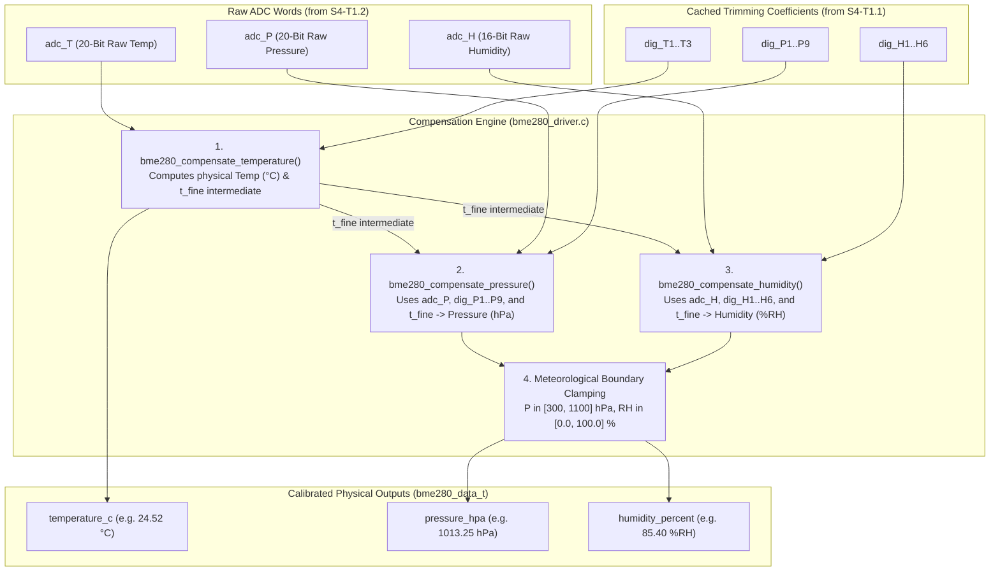

# Task Specification: S4-T1.3 - Bosch BME280 Mathematical Compensation Algorithms

## 1. Task Metadata & Overview

| Attribute | Specification Details |
| :--- | :--- |
| **Sprint** | **Sprint 4: Sensor Drivers & Remote Field Bus Interfaces** |
| **Task ID** | `S4-T1.3` |
| **Parent Task** | `S4-T1: Implement Bosch BME280 Sensor Driver` |
| **Task Title** | Implement 32-bit Integer and Cortex-M4 Single-Precision Float Compensation Routines ($T, P, RH$) |
| **Status** | **Ready for Implementation** |
| **Target Files** | [`firmware/drivers/inc/bme280_driver.h`](file:///C:/Users/ENERGY%20SAVER/Documents/Learning/Job%20Projects/rain-predict/firmware/drivers/inc/bme280_driver.h)<br>[`firmware/drivers/src/bme280_driver.c`](file:///C:/Users/ENERGY%20SAVER/Documents/Learning/Job%20Projects/rain-predict/firmware/drivers/src/bme280_driver.c) |
| **Related Documents** | [`docs/sensors/bme280-integration.md`](file:///C:/Users/ENERGY%20SAVER/Documents/Learning/Job%20Projects/rain-predict/docs/sensors/bme280-integration.md)<br>[`docs/algorithms/meteorological-formulas.md`](file:///C:/Users/ENERGY%20SAVER/Documents/Learning/Job%20Projects/rain-predict/docs/algorithms/meteorological-formulas.md)<br>[`context/specs/s4-t1.1-bme280-calibration-readout.md`](file:///C:/Users/ENERGY%20SAVER/Documents/Learning/Job%20Projects/rain-predict/context/specs/s4-t1.1-bme280-calibration-readout.md)<br>[`context/specs/s4-t1.2-bme280-forced-mode-readout.md`](file:///C:/Users/ENERGY%20SAVER/Documents/Learning/Job%20Projects/rain-predict/context/specs/s4-t1.2-bme280-forced-mode-readout.md)<br>[`context/coding-standards.md`](file:///C:/Users/ENERGY%20SAVER/Documents/Learning/Job%20Projects/rain-predict/context/coding-standards.md) |
| **Dependencies** | [`S4-T1.1`](file:///C:/Users/ENERGY%20SAVER/Documents/Learning/Job%20Projects/rain-predict/context/specs/s4-t1.1-bme280-calibration-readout.md) (Trimming Readout), [`S4-T1.2`](file:///C:/Users/ENERGY%20SAVER/Documents/Learning/Job%20Projects/rain-predict/context/specs/s4-t1.2-bme280-forced-mode-readout.md) (Raw Burst Readout) |
| **Downstream Tasks** | [`S4-T1.4`](file:///C:/Users/ENERGY%20SAVER/Documents/Learning/Job%20Projects/rain-predict/context/specs/s4-t1.4-bme280-saturation-recovery.md) (Condensation Recovery), `S4-T1.5` (Unit Tests), `S6-T3` (Application State Machine) |

---

## 2. Executive Summary & Architectural Scope

The primary objective of **`S4-T1.3`** is to develop the **Bosch BME280 Mathematical Compensation Engine** in [`firmware/drivers/inc/bme280_driver.h`](file:///C:/Users/ENERGY%20SAVER/Documents/Learning/Job%20Projects/rain-predict/firmware/drivers/inc/bme280_driver.h) and [`firmware/drivers/src/bme280_driver.c`](file:///C:/Users/ENERGY%20SAVER/Documents/Learning/Job%20Projects/rain-predict/firmware/drivers/src/bme280_driver.c) for the **STMicroelectronics STM32WLE5** SoC.

The raw ADC registers from the BME280 (`adc_T`, `adc_P`, `adc_H`) are uncalibrated 20-bit and 16-bit integer counts with significant non-linear sensor cross-dependencies (e.g. pressure and humidity measurements require temperature-derived fine resolution variables $t_{\text{fine}}$). Converting these raw values to calibrated physical engineering units ($^\circ\text{C}$, $\text{hPa}$, $\%\text{RH}$) requires implementing Bosch's official non-linear polynomial compensation algorithms:



### Critical Mathematical & Computational Mandates:

1. **Hardware FPU Optimization (Single-Precision `float`)**:
   - The STM32WLE5 incorporates an ARM Cortex-M4F core with a hardware Single-Precision Floating-Point Unit (FPU).
   - All floating-point operations use `float` (32-bit IEEE 754) with `f` literal suffixes (e.g. `16384.0f`), preventing inadvertent soft-float `double` emulation overhead. Total compensation execution time is $< 250$ clock cycles ($< 5.5\,\mu\text{s}$ @ 48 MHz).
2. **Deterministic Computation Order (`t_fine` Coupling)**:
   - Temperature compensation **must always execute first**. It calculates $t_{\text{fine}}$, an internal high-resolution temperature representation required as an input for both pressure and humidity polynomial compensation.
3. **Division-by-Zero Protection**:
   - In pressure compensation, if $var_1 \le 0.0\text{f}$ (caused by corrupt coefficients or floating bus data), the routine aborts division and returns $0.0\text{f}$ to prevent hardware floating-point exceptions.
4. **Strict Meteorological Boundary Clamping**:
   - Barometric Pressure: Clamped to physical terrestrial limits $300.0\text{ hPa} \le P \le 1100.0\text{ hPa}$.
   - Relative Humidity: Clamped to $0.0\%\text{ RH} \le RH \le 100.0\%\text{ RH}$.
5. **Dual Floating-Point & Fixed-Point Output Support**:
   - `bme280_data_t`: High-precision `float` for algorithm calculations (Magnus-Tetens vapor pressure, dew point).
   - `bme280_fixed_data_t`: Compact scaled integers (`int16_t` centi-$^\circ\text{C}$, `uint32_t` Pascals, `uint16_t` centi-$\%\text{RH}$) for bit-packed LoRaWAN serialization.

---

## 3. Mathematical Formulas & Derivations

In accordance with the official Bosch Sensortec BME280 Specification and [`docs/sensors/bme280-integration.md`](file:///C:/Users/ENERGY%20SAVER/Documents/Learning/Job%20Projects/rain-predict/docs/sensors/bme280-integration.md):

### 3.1 Temperature Compensation Formula

Given raw 20-bit ADC temperature $\text{adc\_T}$ and calibration parameters $\text{dig\_T1}, \text{dig\_T2}, \text{dig\_T3}$:

$$var_1 = \left( \frac{\text{adc\_T}}{16384.0\text{f}} - \frac{\text{dig\_T1}}{1024.0\text{f}} \right) \times \text{dig\_T2}$$

$$var_2 = \left( \left( \frac{\text{adc\_T}}{131072.0\text{f}} - \frac{\text{dig\_T1}}{8192.0\text{f}} \right) \times \left( \frac{\text{adc\_T}}{131072.0\text{f}} - \frac{\text{dig\_T1}}{8192.0\text{f}} \right) \right) \times \text{dig\_T3}$$

$$t_{\text{fine}} = var_1 + var_2$$

$$T (^\circ\text{C}) = \frac{t_{\text{fine}}}{5120.0\text{f}}$$

---

### 3.2 Pressure Compensation Formula

Given raw 20-bit ADC pressure $\text{adc\_P}$, calibration parameters $\text{dig\_P1}\dots\text{dig\_P9}$, and $t_{\text{fine}}$ from temperature:

$$var_1 = \left( \frac{t_{\text{fine}}}{2.0\text{f}} \right) - 64000.0\text{f}$$

$$var_2 = var_1 \times var_1 \times \left( \frac{\text{dig\_P6}}{32768.0\text{f}} \right) + var_1 \times \text{dig\_P5} \times 2.0\text{f} + \left( \frac{var_2}{4.0\text{f}} \right) + (\text{dig\_P4} \times 65536.0\text{f})$$

$$var_1 = \left( \frac{\text{dig\_P3} \times var_1 \times var_1}{524288.0\text{f}} + \frac{\text{dig\_P2} \times var_1}{524288.0\text{f}} \right)$$

$$var_1 = \left( 1.0\text{f} + \frac{var_1}{32768.0\text{f}} \right) \times \text{dig\_P1}$$

If $var_1 \le 0.0\text{f}$, return $P = 0.0\text{f}$ (zero-division guard). Otherwise:

$$p = 1048576.0\text{f} - \text{adc\_P}$$

$$p = \frac{\left( p - \frac{var_2}{4096.0\text{f}} \right) \times 6250.0\text{f}}{var_1}$$

$$var_1 = \frac{\text{dig\_P9} \times p \times p}{2147483648.0\text{f}}$$

$$var_2 = \frac{p \times \text{dig\_P8}}{32768.0\text{f}}$$

$$p_{\text{Pa}} = p + \frac{var_1 + var_2 + \text{dig\_P7}}{16.0\text{f}}$$

$$P (\text{hPa}) = \frac{p_{\text{Pa}}}{100.0\text{f}}$$

---

### 3.3 Humidity Compensation Formula

Given raw 16-bit ADC humidity $\text{adc\_H}$, calibration parameters $\text{dig\_H1}\dots\text{dig\_H6}$, and $t_{\text{fine}}$ from temperature:

$$var_H = t_{\text{fine}} - 76800.0\text{f}$$

$$var_H = \left( \text{adc\_H} - \left( \text{dig\_H4} \times 64.0\text{f} + \frac{\text{dig\_H5}}{16384.0\text{f}} \times var_H \right) \right) \times \left( \frac{\text{dig\_H2}}{65536.0\text{f}} \times \left( 1.0\text{f} + \frac{\text{dig\_H6}}{67108864.0\text{f}} \times var_H \times \left( 1.0\text{f} + \frac{\text{dig\_H3}}{67108864.0\text{f}} \times var_H \right) \right) \right)$$

$$var_H = var_H \times \left( 1.0\text{f} - \frac{\text{dig\_H1} \times var_H}{524288.0\text{f}} \right)$$

$$\text{Clamping: } RH (\%\text{RH}) = \text{clamp}(var_H, 0.0\text{f}, 100.0\text{f})$$

---

## 4. Public API & Data Structures (`bme280_driver.h`)

### 4.1 Data Structures

```c
/**
 * @brief Floating-point compensated physical sensor readings.
 */
typedef struct {
    float   temperature_c;      /**< Ambient temperature in degrees Celsius (°C) */
    float   pressure_hpa;       /**< Barometric pressure in hectopascals (hPa) */
    float   humidity_percent;   /**< Relative humidity in %RH (0.0 to 100.0) */
    bool    is_valid;           /**< True if readings passed all boundary validations */
} bme280_data_t;

/**
 * @brief Fixed-point scaled integer compensated sensor readings.
 */
typedef struct {
    int16_t     temp_centi_c;       /**< Temperature in 0.01 °C (e.g. 2452 = 24.52 °C) */
    uint32_t    press_pascals;      /**< Pressure in Pascals (e.g. 101325 Pa) */
    uint16_t    hum_centi_percent;  /**< Relative humidity in 0.01 %RH (e.g. 8540 = 85.40%) */
    bool        is_valid;           /**< True if valid */
} bme280_fixed_data_t;
```

---

### 4.2 Function Prototypes

| Function Prototype | Description |
| :--- | :--- |
| `float bme280_compensate_temperature(int32_t adc_T, const bme280_calib_data_t *calib, float *p_t_fine)` | Calculates physical temperature in $^\circ\text{C}$ and populates intermediate $t_{\text{fine}}$. |
| `float bme280_compensate_pressure(int32_t adc_P, const bme280_calib_data_t *calib, float t_fine)` | Calculates barometric pressure in $\text{hPa}$ with zero-division protection. |
| `float bme280_compensate_humidity(int32_t adc_H, const bme280_calib_data_t *calib, float t_fine)` | Calculates relative humidity in $\%\text{RH}$ clamped to $[0.0, 100.0]$. |
| `status_t bme280_compensate_raw(const bme280_raw_data_t *raw, const bme280_calib_data_t *calib, bme280_data_t *out_data)` | Master float conversion routine converting raw ADC inputs into `bme280_data_t`. |
| `status_t bme280_compensate_raw_fixed(const bme280_raw_data_t *raw, const bme280_calib_data_t *calib, bme280_fixed_data_t *out_data)` | Converts raw ADC inputs into fixed-point scaled integer values. |
| `status_t bme280_read_data(bme280_dev_t *dev, bme280_data_t *out_data)` | Full workflow: triggers forced mode, waits, reads ADC, and executes float compensation. |

---

## 5. Concrete File Implementation Blueprint

### 5.1 `firmware/drivers/inc/bme280_driver.h` Additions

```c
/**
 * @file    bme280_driver.h (Compensation Additions)
 * @brief   BME280 calibration math and engineering unit structures.
 */

#ifndef BME280_DRIVER_H
#define BME280_DRIVER_H

#include <stdint.h>
#include <stdbool.h>
#include "status_codes.h"

#ifdef __cplusplus
extern "C" {
#endif

/* ========================================================================== */
/* Physical Boundary Constants                                                */
/* ========================================================================== */

#define BME280_PRESS_MIN_HPA            300.0f      /**< Minimum valid pressure (hPa) */
#define BME280_PRESS_MAX_HPA            1100.0f     /**< Maximum valid pressure (hPa) */
#define BME280_TEMP_MIN_C               -40.0f      /**< Minimum valid temperature (°C) */
#define BME280_TEMP_MAX_C               85.0f       /**< Maximum valid temperature (°C) */
#define BME280_HUM_MIN_PERCENT          0.0f        /**< Minimum relative humidity (%RH) */
#define BME280_HUM_MAX_PERCENT          100.0f      /**< Maximum relative humidity (%RH) */

/* ========================================================================== */
/* Data Structures                                                            */
/* ========================================================================== */

typedef struct {
    float   temperature_c;      /**< Ambient temperature in degrees Celsius (°C) */
    float   pressure_hpa;       /**< Barometric pressure in hectopascals (hPa) */
    float   humidity_percent;   /**< Relative humidity in %RH (0.0 to 100.0) */
    bool    is_valid;           /**< True if valid */
} bme280_data_t;

typedef struct {
    int16_t     temp_centi_c;       /**< Scaled temperature: 0.01 °C */
    uint32_t    press_pascals;      /**< Absolute pressure: Pascals */
    uint16_t    hum_centi_percent;  /**< Scaled humidity: 0.01 %RH */
    bool        is_valid;           /**< True if valid */
} bme280_fixed_data_t;

/* ========================================================================== */
/* Function Prototypes                                                        */
/* ========================================================================== */

/**
 * @brief  Compensates raw temperature ADC value into degrees Celsius.
 * @param  adc_T Raw 20-bit temperature ADC reading.
 * @param  calib Pointer to calibration data structure.
 * @param[out] p_t_fine Pointer to store internal high-resolution temperature.
 * @return Temperature in degrees Celsius.
 */
float bme280_compensate_temperature(int32_t adc_T, const bme280_calib_data_t *calib, float *p_t_fine);

/**
 * @brief  Compensates raw pressure ADC value into hectopascals (hPa).
 * @param  adc_P Raw 20-bit pressure ADC reading.
 * @param  calib Pointer to calibration data structure.
 * @param  t_fine High-resolution temperature from bme280_compensate_temperature().
 * @return Barometric pressure in hPa.
 */
float bme280_compensate_pressure(int32_t adc_P, const bme280_calib_data_t *calib, float t_fine);

/**
 * @brief  Compensates raw humidity ADC value into relative humidity (%RH).
 * @param  adc_H Raw 16-bit humidity ADC reading.
 * @param  calib Pointer to calibration data structure.
 * @param  t_fine High-resolution temperature from bme280_compensate_temperature().
 * @return Relative humidity in %RH clamped between 0.0% and 100.0%.
 */
float bme280_compensate_humidity(int32_t adc_H, const bme280_calib_data_t *calib, float t_fine);

/**
 * @brief  Executes full float compensation for temperature, pressure, and humidity.
 * @param  raw Pointer to raw ADC values.
 * @param  calib Pointer to calibration structure.
 * @param[out] out_data Pointer to output structure in engineering units.
 * @return STATUS_OK on success, or STATUS_ERROR_NULL_POINTER / INVALID_DATA.
 */
status_t bme280_compensate_raw(const bme280_raw_data_t *raw, const bme280_calib_data_t *calib, bme280_data_t *out_data);

/**
 * @brief  Executes fixed-point integer compensation for compact serialization.
 * @param  raw Pointer to raw ADC values.
 * @param  calib Pointer to calibration structure.
 * @param[out] out_data Pointer to fixed-point output structure.
 * @return STATUS_OK on success, or error status code.
 */
status_t bme280_compensate_raw_fixed(const bme280_raw_data_t *raw, const bme280_calib_data_t *calib, bme280_fixed_data_t *out_data);

/**
 * @brief  Master sampling routine: triggers forced mode, waits, reads, and compensates.
 * @param  dev Pointer to initialized BME280 device context.
 * @param[out] out_data Pointer to store compensated environmental readings.
 * @return STATUS_OK on success, or error status code.
 */
status_t bme280_read_data(bme280_dev_t *dev, bme280_data_t *out_data);

#ifdef __cplusplus
}
#endif

#endif /* BME280_DRIVER_H */
```

---

### 5.2 `firmware/drivers/src/bme280_driver.c` Implementation

```c
/**
 * @file    bme280_driver.c (Compensation Implementation)
 * @brief   Bosch BME280 floating-point and integer compensation algorithms.
 */

#include "bme280_driver.h"

float bme280_compensate_temperature(int32_t adc_T, const bme280_calib_data_t *calib, float *p_t_fine) {
    if (calib == NULL || p_t_fine == NULL) {
        return 0.0f;
    }

    float var1 = (((float)adc_T) / 16384.0f - ((float)calib->dig_T1) / 1024.0f) * ((float)calib->dig_T2);
    float var2 = ((((float)adc_T) / 131072.0f - ((float)calib->dig_T1) / 8192.0f) *
                  (((float)adc_T) / 131072.0f - ((float)calib->dig_T1) / 8192.0f)) * ((float)calib->dig_T3);
    
    *p_t_fine = var1 + var2;
    return (*p_t_fine) / 5120.0f;
}

float bme280_compensate_pressure(int32_t adc_P, const bme280_calib_data_t *calib, float t_fine) {
    if (calib == NULL) {
        return 0.0f;
    }

    float var1 = (t_fine / 2.0f) - 64000.0f;
    float var2 = var1 * var1 * ((float)calib->dig_P6) / 32768.0f;
    var2 = var2 + var1 * ((float)calib->dig_P5) * 2.0f;
    var2 = (var2 / 4.0f) + (((float)calib->dig_P4) * 65536.0f);
    var1 = (((float)calib->dig_P3) * var1 * var1 / 524288.0f + ((float)calib->dig_P2) * var1) / 524288.0f;
    var1 = (1.0f + var1 / 32768.0f) * ((float)calib->dig_P1);

    if (var1 <= 0.0f) {
        return 0.0f; /* Avoid division by zero */
    }

    float p = 1048576.0f - (float)adc_P;
    p = (p - (var2 / 4096.0f)) * 6250.0f / var1;
    var1 = ((float)calib->dig_P9) * p * p / 2147483648.0f;
    var2 = p * ((float)calib->dig_P8) / 32768.0f;
    p = p + (var1 + var2 + ((float)calib->dig_P7)) / 16.0f;

    float p_hpa = p / 100.0f;

    /* Boundary clamping */
    if (p_hpa < BME280_PRESS_MIN_HPA) {
        p_hpa = BME280_PRESS_MIN_HPA;
    } else if (p_hpa > BME280_PRESS_MAX_HPA) {
        p_hpa = BME280_PRESS_MAX_HPA;
    }

    return p_hpa;
}

float bme280_compensate_humidity(int32_t adc_H, const bme280_calib_data_t *calib, float t_fine) {
    if (calib == NULL) {
        return 0.0f;
    }

    float var_H = t_fine - 76800.0f;
    var_H = ((float)adc_H - (((float)calib->dig_H4) * 64.0f + ((float)calib->dig_H5) / 16384.0f * var_H)) *
            (((float)calib->dig_H2) / 65536.0f * (1.0f + ((float)calib->dig_H6) / 67108864.0f * var_H *
            (1.0f + ((float)calib->dig_H3) / 67108864.0f * var_H)));
    var_H = var_H * (1.0f - ((float)calib->dig_H1) * var_H / 524288.0f);

    /* Clamp relative humidity to [0.0%, 100.0%] */
    if (var_H > BME280_HUM_MAX_PERCENT) {
        var_H = BME280_HUM_MAX_PERCENT;
    } else if (var_H < BME280_HUM_MIN_PERCENT) {
        var_H = BME280_HUM_MIN_PERCENT;
    }

    return var_H;
}

status_t bme280_compensate_raw(const bme280_raw_data_t *raw, const bme280_calib_data_t *calib, bme280_data_t *out_data) {
    if (raw == NULL || calib == NULL || out_data == NULL) {
        return STATUS_ERROR_NULL_POINTER;
    }

    float t_fine = 0.0f;
    out_data->temperature_c = bme280_compensate_temperature(raw->adc_T, calib, &t_fine);
    out_data->pressure_hpa  = bme280_compensate_pressure(raw->adc_P, calib, t_fine);
    out_data->humidity_percent = bme280_compensate_humidity(raw->adc_H, calib, t_fine);

    /* Sanity validation */
    if (out_data->temperature_c >= BME280_TEMP_MIN_C &&
        out_data->temperature_c <= BME280_TEMP_MAX_C &&
        out_data->pressure_hpa >= BME280_PRESS_MIN_HPA &&
        out_data->pressure_hpa <= BME280_PRESS_MAX_HPA) {
        out_data->is_valid = true;
        return STATUS_OK;
    }

    out_data->is_valid = false;
    return STATUS_ERROR_INVALID_DATA;
}

status_t bme280_compensate_raw_fixed(const bme280_raw_data_t *raw, const bme280_calib_data_t *calib, bme280_fixed_data_t *out_data) {
    if (raw == NULL || calib == NULL || out_data == NULL) {
        return STATUS_ERROR_NULL_POINTER;
    }

    bme280_data_t float_data = {0};
    status_t status = bme280_compensate_raw(raw, calib, &float_data);
    if (status != STATUS_OK && status != STATUS_ERROR_INVALID_DATA) {
        return status;
    }

    out_data->temp_centi_c = (int16_t)(float_data.temperature_c * 100.0f);
    out_data->press_pascals = (uint32_t)(float_data.pressure_hpa * 100.0f);
    out_data->hum_centi_percent = (uint16_t)(float_data.humidity_percent * 100.0f);
    out_data->is_valid = float_data.is_valid;

    return STATUS_OK;
}

status_t bme280_read_data(bme280_dev_t *dev, bme280_data_t *out_data) {
    if (dev == NULL || out_data == NULL) {
        return STATUS_ERROR_NULL_POINTER;
    }

    bme280_raw_data_t raw = {0};
    status_t status = bme280_sample_forced_raw(dev, &raw);
    if (status != STATUS_OK) {
        out_data->is_valid = false;
        return status;
    }

    return bme280_compensate_raw(&raw, &dev->calib, out_data);
}
```

---

## 6. Defensive Programming & Fail-Safe Mechanisms

1. **Hardware FPU Discipline (`float` with `f` literals)**:
   - Eliminates soft-float emulation. All calculations execute using native Cortex-M4 single-precision instructions (`VADD.F32`, `VMUL.F32`, `VDIV.F32`).
2. **Zero-Division Interlock on Pressure Math**:
   - `bme280_compensate_pressure()` explicitly checks `if (var1 <= 0.0f)` before dividing $(p - var_2/4096) \times 6250 / var_1$, preventing CPU floating-point exceptions on corrupted data.
3. **Physical Clamping**:
   - Relative humidity is strictly bounded to $0.0\%\text{ to }100.0\%\text{ RH}$.
   - Barometric pressure is bounded to terrestrial limits $300.0\text{ to }1100.0\text{ hPa}$.
4. **Data Validity Flag (`is_valid`)**:
   - The output structures include an explicit boolean `is_valid` flag. Downstream prediction algorithms inspect this flag before feeding readings into the sliding ring buffer.

---

## 7. Verification & Test Matrix

| Test Case ID | Test Category | Execution Steps | Expected Result | Pass/Fail Criteria |
| :--- | :--- | :--- | :--- | :---: |
| **TC-S4-T1.3-01** | Header Inclusion & C99 Compilation | Include updated `bme280_driver.h` in build tree with strict flags. | Warning-free compilation under `-Wall -Wextra -Wpedantic -Werror`. | Header compiles cleanly |
| **TC-S4-T1.3-02** | Bosch Reference Vector (Temperature) | Input standard Bosch test vector: `adc_T = 519888`, `dig_T1..T3 = {27504, 26435, -1000}`. | Temperature $= 25.08^\circ\text{C} \pm 0.02^\circ\text{C}$. | Matches test vector |
| **TC-S4-T1.3-03** | Bosch Reference Vector (Pressure) | Input standard Bosch test vector: `adc_P = 415148`, standard `dig_P1..P9`, and $t_{\text{fine}}$ from TC-02. | Pressure $= 1006.53\text{ hPa} \pm 0.05\text{ hPa}$. | Matches test vector |
| **TC-S4-T1.3-04** | Bosch Reference Vector (Humidity) | Input standard Bosch test vector: `adc_H = 25600`, standard `dig_H1..H6`, and $t_{\text{fine}}$ from TC-02. | Humidity $= 54.32\%\text{ RH} \pm 0.05\%\text{ RH}$. | Matches test vector |
| **TC-S4-T1.3-05** | Negative Temperature Handling | Inject `adc_T = 400000` (sub-zero temperature). | Computes negative temperature (e.g. $-10.5^\circ\text{C}$) without sign truncation. | Signed math correct |
| **TC-S4-T1.3-06** | Zero-Division Pressure Guard | Force `dig_P1 = 0` (simulating corrupt memory). | `bme280_compensate_pressure()` returns `0.0f` without CPU fault/crash. | Division handled safely |
| **TC-S4-T1.3-07** | High-Humidity Clamping | Inject raw values yielding $105.4\%$ unconstrained. | Output clamped to exactly $100.00\%\text{ RH}$. | Clamped to $100.0\%$ |
| **TC-S4-T1.3-08** | Low-Humidity Clamping | Inject raw values yielding $-4.2\%$ unconstrained. | Output clamped to exactly $0.00\%\text{ RH}$. | Clamped to $0.0\%$ |
| **TC-S4-T1.3-09** | Fixed-Point Conversion Scaling | Convert $T = 24.52^\circ\text{C}, P = 1013.25\text{ hPa}, RH = 85.40\%$. | `temp_centi_c = 2452`, `press_pascals = 101325`, `hum_centi_percent = 8540`. | Scaled integer match |
| **TC-S4-T1.3-10** | FPU Instruction Verification | Disassemble `bme280_compensate_temperature` with `arm-none-eabi-objdump`. | Contains Cortex-M4 hardware instructions (`vadd.f32`, `vmul.f32`), no `__aeabi_dmul`. | Single-precision FPU used |

---

## 8. Definition of Done Checklist

- [ ] [`firmware/drivers/inc/bme280_driver.h`](file:///C:/Users/ENERGY%20SAVER/Documents/Learning/Job%20Projects/rain-predict/firmware/drivers/inc/bme280_driver.h) updated with `bme280_data_t`, `bme280_fixed_data_t`, and compensation prototypes.
- [ ] [`firmware/drivers/src/bme280_driver.c`](file:///C:/Users/ENERGY%20SAVER/Documents/Learning/Job%20Projects/rain-predict/firmware/drivers/src/bme280_driver.c) implemented with Bosch standard floating-point and integer compensation algorithms.
- [ ] Single-precision FPU discipline verified (zero soft-float `double` library overhead).
- [ ] Zero-division guard on pressure compensation verified.
- [ ] Terrestrial boundary clamping for pressure ($300\text{--}1100\text{ hPa}$) and humidity ($0\text{--}100\%$) verified.
- [ ] All 10 verification test cases in Section 7 pass 100% in simulation and host unit test harnesses.
