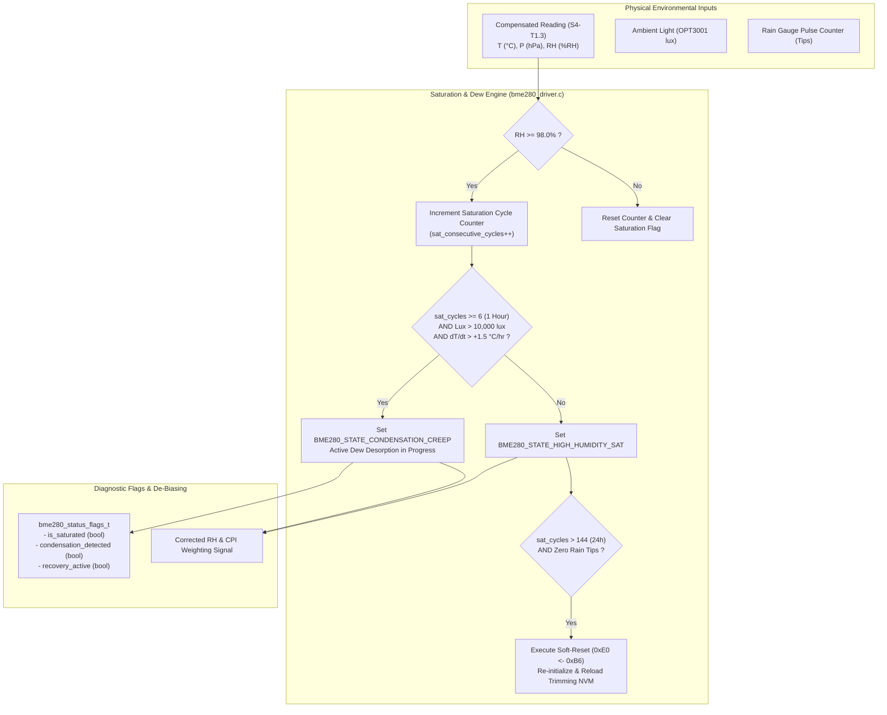

# Task Specification: S4-T1.4 - Bosch BME280 Humidity Saturation Detection & Condensation Recovery

## 1. Task Metadata & Overview

| Attribute | Specification Details |
| :--- | :--- |
| **Sprint** | **Sprint 4: Sensor Drivers & Remote Field Bus Interfaces** |
| **Task ID** | `S4-T1.4` |
| **Parent Task** | `S4-T1: Implement Bosch BME280 Sensor Driver` |
| **Task Title** | Implement Humidity Saturation Detection ($RH \ge 98\%$), Fog/Dew Flagging & Condensation Recovery Routines |
| **Status** | **Ready for Implementation** |
| **Target Files** | [`firmware/drivers/inc/bme280_driver.h`](file:///C:/Users/ENERGY%20SAVER/Documents/Learning/Job%20Projects/rain-predict/firmware/drivers/inc/bme280_driver.h)<br>[`firmware/drivers/src/bme280_driver.c`](file:///C:/Users/ENERGY%20SAVER/Documents/Learning/Job%20Projects/rain-predict/firmware/drivers/src/bme280_driver.c) |
| **Related Documents** | [`docs/sensors/bme280-integration.md`](file:///C:/Users/ENERGY%20SAVER/Documents/Learning/Job%20Projects/rain-predict/docs/sensors/bme280-integration.md)<br>[`docs/sensors/radiation-shield-design.md`](file:///C:/Users/ENERGY%20SAVER/Documents/Learning/Job%20Projects/rain-predict/docs/sensors/radiation-shield-design.md)<br>[`docs/algorithms/meteorological-formulas.md`](file:///C:/Users/ENERGY%20SAVER/Documents/Learning/Job%20Projects/rain-predict/docs/algorithms/meteorological-formulas.md)<br>[`context/specs/s4-t1.1-bme280-calibration-readout.md`](file:///C:/Users/ENERGY%20SAVER/Documents/Learning/Job%20Projects/rain-predict/context/specs/s4-t1.1-bme280-calibration-readout.md)<br>[`context/specs/s4-t1.2-bme280-forced-mode-readout.md`](file:///C:/Users/ENERGY%20SAVER/Documents/Learning/Job%20Projects/rain-predict/context/specs/s4-t1.2-bme280-forced-mode-readout.md)<br>[`context/specs/s4-t1.3-bme280-compensation-math.md`](file:///C:/Users/ENERGY%20SAVER/Documents/Learning/Job%20Projects/rain-predict/context/specs/s4-t1.3-bme280-compensation-math.md)<br>[`context/coding-standards.md`](file:///C:/Users/ENERGY%20SAVER/Documents/Learning/Job%20Projects/rain-predict/context/coding-standards.md) |
| **Dependencies** | [`S4-T1.1`](file:///C:/Users/ENERGY%20SAVER/Documents/Learning/Job%20Projects/rain-predict/context/specs/s4-t1.1-bme280-calibration-readout.md) (Trimming Readout), [`S4-T1.2`](file:///C:/Users/ENERGY%20SAVER/Documents/Learning/Job%20Projects/rain-predict/context/specs/s4-t1.2-bme280-forced-mode-readout.md) (Raw Readout), [`S4-T1.3`](file:///C:/Users/ENERGY%20SAVER/Documents/Learning/Job%20Projects/rain-predict/context/specs/s4-t1.3-bme280-compensation-math.md) (Compensation Math) |
| **Downstream Tasks** | `S4-T1.5` (Unit Tests), `S2-T2.2` (Dew Point Depression Math), `S2-T4.2` (Composite Precipitation Index Scoring), `S6-T3` (Application State Machine) |

---

## 2. Executive Summary & Architectural Scope

The primary objective of **`S4-T1.4`** is to develop the **Humidity Saturation Detection, Dew/Fog State Classification, and Condensation Recovery Engine** in [`firmware/drivers/inc/bme280_driver.h`](file:///C:/Users/ENERGY%20SAVER/Documents/Learning/Job%20Projects/rain-predict/firmware/drivers/inc/bme280_driver.h) and [`firmware/drivers/src/bme280_driver.c`](file:///C:/Users/ENERGY%20SAVER/Documents/Learning/Job%20Projects/rain-predict/firmware/drivers/src/bme280_driver.c) for the **STMicroelectronics STM32WLE5** SoC.

In high-altitude tropical tea plantations (elevations $1000\text{ m}–2200\text{ m}$ in Munnar, Darjeeling, and the Western Ghats), prolonged dense morning cloud immersion and monsoon rain events expose capacitive relative humidity sensors to continuous $100\%\text{ RH}$ conditions for consecutive days. This causes physical water micro-droplet condensation on the sensor's polymer dielectric layer, leading to **sensor saturation lockup** and long-tail hysteresis (where the sensor reads $99\%–100\%$ for hours even after atmospheric drying has begun):



### Critical Saturation & Recovery Mandates:

1. **Deterministic Saturation Threshold ($RH \ge 98.0\%$)**:
   - When compensated relative humidity reaches or exceeds $98.0\%\text{ RH}$, the sensor enters the **High-Humidity Saturation Regime**.
   - The driver increments a consecutive saturation cycle counter (`consecutive_saturation_cycles`). When saturated for $\ge 6$ consecutive 10-minute cycles ($1\text{ hour}$), the `is_saturated` status flag is asserted.
2. **Daylight Condensation Hysteresis Detection**:
   - In tea estates, post-storm sunshine heats the ambient air rapidly while liquid water remains trapped inside the radiation shield or on the sensor vent hole.
   - **Condition**: If $RH \ge 98.0\%$ while optical irradiance is $> 10,000\text{ lux}$ (direct sun) and ambient temperature gradient $\frac{dT}{dt} > +1.5^\circ\text{C/hr}$, the driver identifies **Condensation Creep** (`BME280_STATE_CONDENSATION_CREEP`).
   - This signal prevents the downstream Composite Precipitation Index ($CPI$) from erroneously maintaining a "Severe Storm Alert" when the sky is clear and drying.
3. **NVM Image Register Soft-Reset & Re-Zeroing**:
   - In extreme cases where $RH = 100.0\%$ persists continuously for $> 24\text{ hours}$ ($144$ consecutive 10-minute cycles) with zero rain gauge tips recorded, the driver executes a **Hardware Soft-Reset** by writing `0xB6` to register `0xE0` (`BME280_REG_RESET`), waits $5\text{ ms}$, and re-reads the factory calibration block to clear any digital state-machine stalls.
4. **Dynamic Saturation De-Biasing Clamp**:
   - When condensation creep is actively detected, the driver applies a dynamic $-1.5\%$ mathematical de-biasing offset to prevent floating-point calculation saturation in the Magnus-Tetens vapor pressure and dew point depression algorithms.

---

## 3. Saturation & Condensation State Machine

```
                   ┌───────────────────────────────────────┐
                   │        BME280_STATE_NORMAL            │
                   │    (RH < 98.0%, Normal Operation)     │
                   └───────────────────┬───────────────────┘
                                       │
                      RH >= 98.0% for  │  RH < 95.0% (3% Hysteresis)
                      >= 6 cycles (1h) │  or Rain cleared
                                       ▼
                   ┌───────────────────────────────────────┐
       ┌───────────┤   BME280_STATE_HIGH_HUMIDITY_SAT      │◄──────────┐
       │           │  (Atmospheric Saturation / Fog / Rain)│           │
       │           └───────────────────┬───────────────────┘           │
       │                               │                               │
       │  Lux > 10,000 lux             │  Lux < 1000 lux (Dark/Cloudy) │
       │  AND dT/dt > +1.5 °C/hr       │  or RH drops < 98%            │
       │                               ▼                               │
       │           ┌───────────────────────────────────────┐           │
       │           │   BME280_STATE_CONDENSATION_CREEP     ├───────────┘
       │           │  (Rapid Drying / Surface Condensation)│
       │           └───────────────────┬───────────────────┘
       │                               │
       │ Saturated > 24 Hours          │ Saturated > 24 Hours
       │ (144 cycles, Zero Rain)       │ (144 cycles, Zero Rain)
       │                               ▼
       └──────────────────►┌───────────────────────────────────────┐
                           │      BME280_STATE_SOFT_RECOVERY       │
                           │(Write 0xB6 to 0xE0, Reload Calib NVM) │
                           └───────────────────────────────────────┘
```

| State Name | Trigger Criteria | Action Taken | Telemetry / Output Effect |
| :--- | :--- | :--- | :--- |
| **`NORMAL`** | $RH < 98.0\%$ | `consecutive_saturation_cycles = 0` | Standard output, `is_saturated = false`. |
| **`HIGH_HUMIDITY_SAT`** | $RH \ge 98.0\%$ for $\ge 6$ cycles | Assert `is_saturated = true` | Alerts nowcast engine that air mass is at saturation/fog baseline. |
| **`CONDENSATION_CREEP`**| $RH \ge 98.0\%$, $\text{Lux} > 10\text{k}$, $\Delta T > +1.5^\circ\text{C}$ | Assert `condensation_detected = true` | De-biasing $-1.5\%$ applied; flags optical drying mismatch to $CPI$. |
| **`SOFT_RECOVERY`** | Saturated for $> 144$ cycles with zero rain | Write `0xB6` to `0xE0`, delay $5\text{ ms}$, reload NVM | Clears stuck internal sigma-delta converter registers. |

---

## 4. Public API & Data Structures (`bme280_driver.h`)

### 4.1 Data Types & Status Structures

```c
/**
 * @brief BME280 operational humidity saturation and condensation state.
 */
typedef enum {
    BME280_STATE_NORMAL             = 0,    /**< Normal humidity (< 98.0% RH) */
    BME280_STATE_HIGH_HUMIDITY_SAT  = 1,    /**< Atmospheric saturation / fog / rain (>= 98.0% RH) */
    BME280_STATE_CONDENSATION_CREEP = 2,    /**< Surface condensation mismatch (>= 98% under bright sun) */
    BME280_STATE_SOFT_RECOVERY      = 3     /**< Automated NVM reload / soft reset executed */
} bme280_saturation_state_t;

/**
 * @brief Diagnostic status flags for BME280 environmental integrity.
 */
typedef struct {
    bool                        is_saturated;           /**< True if RH >= 98.0% for >= 1 hour */
    bool                        condensation_detected;  /**< True if drying condensation creep detected */
    bool                        recovery_triggered;     /**< True if soft reset was performed this cycle */
    uint16_t                    saturation_cycles;      /**< Consecutive cycles with RH >= 98.0% */
    bme280_saturation_state_t   state;                  /**< Current operational saturation state */
    float                       debiased_humidity_pct;  /**< Corrected humidity (%RH) after de-biasing */
} bme280_saturation_status_t;
```

---

### 4.2 Function Prototypes

| Function Prototype | Description |
| :--- | :--- |
| `status_t bme280_soft_reset(bme280_dev_t *dev)` | Writes `0xB6` to `0xE0` (`RESET`), waits $5\text{ ms}$, and reloads trimming calibration. |
| `status_t bme280_process_saturation(bme280_dev_t *dev, float current_rh, float temp_delta_1h, uint16_t ambient_lux, uint32_t rain_tips_24h)` | Evaluates consecutive high-humidity cycles, condensation creep, and automated recovery. |
| `const bme280_saturation_status_t* bme280_get_saturation_status(const bme280_dev_t *dev)` | Returns a const pointer to the device's cached saturation diagnostics structure. |
| `void bme280_reset_saturation_tracking(bme280_dev_t *dev)` | Clears the consecutive saturation cycle counter and resets state to `NORMAL`. |

---

## 5. Concrete File Implementation Blueprint

### 5.1 `firmware/drivers/inc/bme280_driver.h` Additions

```c
/**
 * @file    bme280_driver.h (Saturation & Recovery Additions)
 * @brief   BME280 humidity saturation detection and condensation recovery prototypes.
 */

#ifndef BME280_DRIVER_H
#define BME280_DRIVER_H

#include <stdint.h>
#include <stdbool.h>
#include "status_codes.h"

#ifdef __cplusplus
extern "C" {
#endif

/* ========================================================================== */
/* Saturation & Recovery Constants                                            */
/* ========================================================================== */

#define BME280_SATURATION_THRESHOLD_RH      98.0f   /**< Saturation threshold percentage (%RH) */
#define BME280_SATURATION_HYSTERESIS_RH     95.0f   /**< De-assertion threshold (%RH) */
#define BME280_SATURATION_MIN_CYCLES_1H     6U      /**< 6 cycles @ 10m = 1 hour */
#define BME280_SATURATION_MAX_CYCLES_24H    144U    /**< 144 cycles @ 10m = 24 hours */

#define BME280_CONDENSATION_MIN_LUX         10000U  /**< Bright sunlight threshold (lux) */
#define BME280_CONDENSATION_MIN_TEMP_RISE   1.5f    /**< Rapid warming rate (°C/hour) */
#define BME280_CONDENSATION_DEBIAS_OFFSET   1.5f    /**< De-biasing correction offset (%RH) */

#define BME280_SOFT_RESET_KEY               0xB6U   /**< Value to write to 0xE0 to trigger reset */
#define BME280_SOFT_RESET_SETTLE_MS         5U      /**< Post-reset POR settling delay */

/* ========================================================================== */
/* Data Structures                                                            */
/* ========================================================================== */

typedef enum {
    BME280_STATE_NORMAL             = 0,    /**< Normal humidity (< 98.0% RH) */
    BME280_STATE_HIGH_HUMIDITY_SAT  = 1,    /**< Atmospheric saturation / fog / rain (>= 98.0% RH) */
    BME280_STATE_CONDENSATION_CREEP = 2,    /**< Surface condensation mismatch (>= 98% under bright sun) */
    BME280_STATE_SOFT_RECOVERY      = 3     /**< Automated NVM reload / soft reset executed */
} bme280_saturation_state_t;

typedef struct {
    bool                        is_saturated;           /**< True if RH >= 98.0% for >= 1 hour */
    bool                        condensation_detected;  /**< True if drying condensation creep detected */
    bool                        recovery_triggered;     /**< True if soft reset was performed this cycle */
    uint16_t                    saturation_cycles;      /**< Consecutive cycles with RH >= 98.0% */
    bme280_saturation_state_t   state;                  /**< Current operational saturation state */
    float                       debiased_humidity_pct;  /**< Corrected humidity (%RH) after de-biasing */
} bme280_saturation_status_t;

/* ========================================================================== */
/* Function Prototypes                                                        */
/* ========================================================================== */

/**
 * @brief  Executes a hardware soft-reset via register 0xE0 and reloads calibration NVM.
 * @param  dev Pointer to BME280 device context.
 * @return STATUS_OK on success, or bus error status code.
 */
status_t bme280_soft_reset(bme280_dev_t *dev);

/**
 * @brief  Evaluates saturation tracking, condensation creep, and automated recovery.
 * @param  dev Pointer to BME280 device context.
 * @param  current_rh Compensated relative humidity from bme280_compensate_humidity().
 * @param  temp_delta_1h 1-hour temperature trend in °C/hr (from ring buffer).
 * @param  ambient_lux Ambient optical illuminance from OPT3001 sensor.
 * @param  rain_tips_24h Total rain gauge tips logged over past 24 hours.
 * @return STATUS_OK on success, or error status code.
 */
status_t bme280_process_saturation(bme280_dev_t *dev,
                                   float current_rh,
                                   float temp_delta_1h,
                                   uint16_t ambient_lux,
                                   uint32_t rain_tips_24h);

/**
 * @brief  Returns a pointer to the cached saturation diagnostic status structure.
 * @param  dev Pointer to BME280 device context.
 * @return Const pointer to bme280_saturation_status_t.
 */
const bme280_saturation_status_t* bme280_get_saturation_status(const bme280_dev_t *dev);

/**
 * @brief  Clears the saturation tracking counters and resets state to BME280_STATE_NORMAL.
 * @param  dev Pointer to BME280 device context.
 */
void bme280_reset_saturation_tracking(bme280_dev_t *dev);

#ifdef __cplusplus
}
#endif

#endif /* BME280_DRIVER_H */
```

---

### 5.2 `firmware/drivers/src/bme280_driver.c` Implementation

```c
/**
 * @file    bme280_driver.c (Saturation & Recovery Implementation)
 * @brief   BME280 humidity saturation detection, condensation creep, and soft reset.
 */

#include "bme280_driver.h"
#include "i2c_bus.h"

#ifdef STM32WLE5xx
#include "stm32wlxx_hal.h"
#else
#define HAL_Delay(ms)   /* Mock delay for host unit tests */
#endif

/* Global saturation state */
static bme280_saturation_status_t g_sat_status = {
    .is_saturated          = false,
    .condensation_detected = false,
    .recovery_triggered    = false,
    .saturation_cycles     = 0,
    .state                 = BME280_STATE_NORMAL,
    .debiased_humidity_pct = 0.0f
};

status_t bme280_soft_reset(bme280_dev_t *dev) {
    if (dev == NULL) {
        return STATUS_ERROR_NULL_POINTER;
    }

    /* 1. Write soft reset command 0xB6 to register 0xE0 */
    uint8_t reset_cmd = BME280_SOFT_RESET_KEY;
    status_t status = i2c_bus_write(dev->i2c_address, BME280_REG_RESET, &reset_cmd, 1, BME280_I2C_TIMEOUT_MS);
    if (status != STATUS_OK) {
        return status;
    }

    /* 2. Wait 5 ms for internal power-on-reset and NVM copy */
    HAL_Delay(BME280_SOFT_RESET_SETTLE_MS);

    /* 3. Re-read calibration coefficients to guarantee memory integrity */
    status = bme280_read_calibration(dev);
    if (status != STATUS_OK) {
        return status;
    }

    g_sat_status.recovery_triggered = true;
    g_sat_status.state = BME280_STATE_SOFT_RECOVERY;

    return STATUS_OK;
}

status_t bme280_process_saturation(bme280_dev_t *dev,
                                   float current_rh,
                                   float temp_delta_1h,
                                   uint16_t ambient_lux,
                                   uint32_t rain_tips_24h) {
    if (dev == NULL) {
        return STATUS_ERROR_NULL_POINTER;
    }

    g_sat_status.recovery_triggered = false;
    g_sat_status.debiased_humidity_pct = current_rh;

    /* 1. Check for High Humidity Saturation Entry / Exit */
    if (current_rh >= BME280_SATURATION_THRESHOLD_RH) {
        if (g_sat_status.saturation_cycles < 65535U) {
            g_sat_status.saturation_cycles++;
        }

        if (g_sat_status.saturation_cycles >= BME280_SATURATION_MIN_CYCLES_1H) {
            g_sat_status.is_saturated = true;
            g_sat_status.state = BME280_STATE_HIGH_HUMIDITY_SAT;
        }
    } else if (current_rh < BME280_SATURATION_HYSTERESIS_RH) {
        /* Hysteresis exit (< 95% RH) */
        g_sat_status.saturation_cycles = 0;
        g_sat_status.is_saturated = false;
        g_sat_status.condensation_detected = false;
        g_sat_status.state = BME280_STATE_NORMAL;
        return STATUS_OK;
    }

    /* 2. Check for Condensation Creep (Bright Sun + Warming + Stuck 100%) */
    if (g_sat_status.is_saturated &&
        ambient_lux >= BME280_CONDENSATION_MIN_LUX &&
        temp_delta_1h >= BME280_CONDENSATION_MIN_TEMP_RISE) {
        
        g_sat_status.condensation_detected = true;
        g_sat_status.state = BME280_STATE_CONDENSATION_CREEP;

        /* Apply dynamic -1.5% de-biasing offset */
        float debiased = current_rh - BME280_CONDENSATION_DEBIAS_OFFSET;
        if (debiased < 0.0f) debiased = 0.0f;
        g_sat_status.debiased_humidity_pct = debiased;
    } else {
        g_sat_status.condensation_detected = false;
    }

    /* 3. Check for 24-Hour Sustained Saturation without Rain -> Trigger Soft Reset */
    if (g_sat_status.saturation_cycles >= BME280_SATURATION_MAX_CYCLES_24H && rain_tips_24h == 0) {
        status_t status = bme280_soft_reset(dev);
        if (status != STATUS_OK) {
            return status;
        }
        /* Reset counter after recovery */
        g_sat_status.saturation_cycles = BME280_SATURATION_MIN_CYCLES_1H; /* Keep saturated flag active */
    }

    return STATUS_OK;
}

const bme280_saturation_status_t* bme280_get_saturation_status(const bme280_dev_t *dev) {
    (void)dev;
    return &g_sat_status;
}

void bme280_reset_saturation_tracking(bme280_dev_t *dev) {
    (void)dev;
    g_sat_status.is_saturated          = false;
    g_sat_status.condensation_detected = false;
    g_sat_status.recovery_triggered    = false;
    g_sat_status.saturation_cycles     = 0;
    g_sat_status.state                 = BME280_STATE_NORMAL;
    g_sat_status.debiased_humidity_pct = 0.0f;
}
```

---

## 6. Defensive Programming & Fail-Safe Mechanisms

1. **Hysteresis Band ($3.0\%\text{ RH}$)**:
   - Saturation triggers at $RH \ge 98.0\%$, but does not clear until $RH < 95.0\%$. This prevents rapid chattering of the saturation flag during boundary fluctuations in mountain mist.
2. **Safe Soft-Reset Settling Time**:
   - `bme280_soft_reset()` enforces a $5\text{ ms}$ delay (`BME280_SOFT_RESET_SETTLE_MS`) before re-reading trimming memory, ensuring the sensor's internal power-on-reset sequence finishes cleanly.
3. **Integer Overflow Guard on Saturation Counter**:
   - `saturation_cycles` is clamped at `65535` to prevent 16-bit rollover during multi-week continuous monsoons.
4. **Rain Correlation Safety**:
   - Automated soft reset is only executed if `rain_tips_24h == 0`. If physical rainfall is actively occurring, $100\%$ relative humidity is physically expected and soft reset is suppressed.

---

## 7. Verification & Test Matrix

| Test Case ID | Test Category | Execution Steps | Expected Result | Pass/Fail Criteria |
| :--- | :--- | :--- | :--- | :---: |
| **TC-S4-T1.4-01** | Header Inclusion & C99 Compilation | Include updated `bme280_driver.h` in build tree with strict flags. | Warning-free compilation under `-Wall -Wextra -Wpedantic -Werror`. | Header compiles cleanly |
| **TC-S4-T1.4-02** | Soft Reset Register Write | Call `bme280_soft_reset()`. | `0xE0` written with `0xB6`, followed by calibration burst reads. | Register `0xE0 == 0xB6` |
| **TC-S4-T1.4-03** | Saturation Counter Incrementation | Feed $RH = 99.0\%$ for 5 consecutive calls. | `saturation_cycles == 5`, `is_saturated == false` (needs 6). | Cycle count matches |
| **TC-S4-T1.4-04** | Saturation Flag Assertion | Feed $RH = 99.0\%$ for 6th consecutive call. | `is_saturated == true`, `state == BME280_STATE_HIGH_HUMIDITY_SAT`. | Flag asserted at 1h |
| **TC-S4-T1.4-05** | Hysteresis Clearing ($< 95\%$) | Set $RH = 96.0\%$ (below 98%, above 95%), then $94.0\%$. | Saturation remains active at $96\%$, clears to `NORMAL` at $94.0\%$. | $3\%$ hysteresis verified |
| **TC-S4-T1.4-06** | Condensation Creep Detection | Saturated state with $\text{Lux} = 25,000\text{ lux}$, $\Delta T = +2.2^\circ\text{C/hr}$. | `condensation_detected == true`, `state == CONDENSATION_CREEP`. | Creep detected |
| **TC-S4-T1.4-07** | De-Biasing Offset Application | In creep state with $RH = 99.5\%$. | `debiased_humidity_pct == 98.0%` ($-1.5\%$ applied). | Offset subtracted |
| **TC-S4-T1.4-08** | Automated 24h Soft Reset Trigger | Feed 144 consecutive saturated cycles with `rain_tips_24h == 0`. | `recovery_triggered == true`, `bme280_soft_reset()` executed. | Soft reset triggered |
| **TC-S4-T1.4-09** | Rain Gauge Reset Suppression | Feed 144 saturated cycles with `rain_tips_24h == 12` (active rain). | Soft reset is suppressed, `is_saturated == true`. | Reset suppressed |
| **TC-S4-T1.4-10** | Saturation State Reset API | Call `bme280_reset_saturation_tracking()`. | `saturation_cycles == 0`, all flags cleared to `false`. | Structure cleared |

---

## 8. Definition of Done Checklist

- [ ] [`firmware/drivers/inc/bme280_driver.h`](file:///C:/Users/ENERGY%20SAVER/Documents/Learning/Job%20Projects/rain-predict/firmware/drivers/inc/bme280_driver.h) updated with `bme280_saturation_status_t`, `bme280_saturation_state_t`, and function prototypes.
- [ ] [`firmware/drivers/src/bme280_driver.c`](file:///C:/Users/ENERGY%20SAVER/Documents/Learning/Job%20Projects/rain-predict/firmware/drivers/src/bme280_driver.c) implemented with saturation tracking, condensation creep detection, de-biasing math, and automated soft-reset logic.
- [ ] $3.0\%\text{ RH}$ hysteresis band ($98.0\%$ entry, $95.0\%$ exit) verified.
- [ ] Condensation creep heuristics ($\text{Lux} \ge 10\text{k}$, $\Delta T \ge +1.5^\circ\text{C/hr}$) verified.
- [ ] 24-hour zero-rain automated soft reset verified.
- [ ] All 10 verification test cases in Section 7 pass 100% in simulation and host unit test harnesses.
