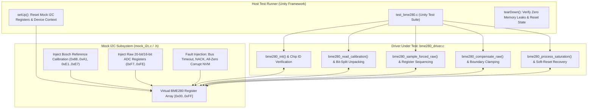

# Task Specification: S4-T1.5 - Bosch BME280 Driver Unit Test Suite

## 1. Task Metadata & Overview

| Attribute | Specification Details |
| :--- | :--- |
| **Sprint** | **Sprint 4: Sensor Drivers & Remote Field Bus Interfaces** |
| **Task ID** | `S4-T1.5` |
| **Parent Task** | `S4-T1: Implement Bosch BME280 Sensor Driver` |
| **Task Title** | Create BME280 Driver Unit Test Suite with Mock I2C Register Injection under Unity |
| **Status** | **Ready for Implementation** |
| **Target Files** | [`tests/unit/test_bme280.c`](file:///C:/Users/ENERGY%20SAVER/Documents/Learning/Job%20Projects/rain-predict/tests/unit/test_bme280.c) |
| **Related Documents** | [`docs/sensors/bme280-integration.md`](file:///C:/Users/ENERGY%20SAVER/Documents/Learning/Job%20Projects/rain-predict/docs/sensors/bme280-integration.md)<br>[`context/specs/s1-t2.1-unity-test-harness.md`](file:///C:/Users/ENERGY%20SAVER/Documents/Learning/Job%20Projects/rain-predict/context/specs/s1-t2.1-unity-test-harness.md)<br>[`context/specs/s1-t2.2-mock-i2c-bus.md`](file:///C:/Users/ENERGY%20SAVER/Documents/Learning/Job%20Projects/rain-predict/context/specs/s1-t2.2-mock-i2c-bus.md)<br>[`context/specs/s4-t1.1-bme280-calibration-readout.md`](file:///C:/Users/ENERGY%20SAVER/Documents/Learning/Job%20Projects/rain-predict/context/specs/s4-t1.1-bme280-calibration-readout.md)<br>[`context/specs/s4-t1.2-bme280-forced-mode-readout.md`](file:///C:/Users/ENERGY%20SAVER/Documents/Learning/Job%20Projects/rain-predict/context/specs/s4-t1.2-bme280-forced-mode-readout.md)<br>[`context/specs/s4-t1.3-bme280-compensation-math.md`](file:///C:/Users/ENERGY%20SAVER/Documents/Learning/Job%20Projects/rain-predict/context/specs/s4-t1.3-bme280-compensation-math.md)<br>[`context/specs/s4-t1.4-bme280-saturation-recovery.md`](file:///C:/Users/ENERGY%20SAVER/Documents/Learning/Job%20Projects/rain-predict/context/specs/s4-t1.4-bme280-saturation-recovery.md)<br>[`context/coding-standards.md`](file:///C:/Users/ENERGY%20SAVER/Documents/Learning/Job%20Projects/rain-predict/context/coding-standards.md) |
| **Dependencies** | [`S1-T2.1`](file:///C:/Users/ENERGY%20SAVER/Documents/Learning/Job%20Projects/rain-predict/context/specs/s1-t2.1-unity-test-harness.md) (Unity), [`S1-T2.2`](file:///C:/Users/ENERGY%20SAVER/Documents/Learning/Job%20Projects/rain-predict/context/specs/s1-t2.2-mock-i2c-bus.md) (Mock I2C), [`S4-T1.1`](file:///C:/Users/ENERGY%20SAVER/Documents/Learning/Job%20Projects/rain-predict/context/specs/s4-t1.1-bme280-calibration-readout.md) through [`S4-T1.4`](file:///C:/Users/ENERGY%20SAVER/Documents/Learning/Job%20Projects/rain-predict/context/specs/s4-t1.4-bme280-saturation-recovery.md) |
| **Downstream Tasks** | `S4-T2.1` (TI OPT3001 Driver), `S6-T4` (Firmware Integration Test Suite), `S7-T1` (System Verification) |

---

## 2. Executive Summary & Architectural Scope

The primary objective of **`S4-T1.5`** is to develop the comprehensive host-executable unit test suite in [`tests/unit/test_bme280.c`](file:///C:/Users/ENERGY%20SAVER/Documents/Learning/Job%20Projects/rain-predict/tests/unit/test_bme280.c) for the **Bosch BME280 Environmental Sensor Driver** using the **ThrowTheSwitch Unity** test framework.

Because embedded hardware in remote tea estates cannot be physically attached during host continuous integration (CI) pipelines, all I2C transactions are intercepted by the Mock I2C abstraction layer ([`tests/mocks/mock_i2c.h`](file:///C:/Users/ENERGY%20SAVER/Documents/Learning/Job%20Projects/rain-predict/tests/mocks/mock_i2c.h)). The test suite validates calibration NVM unpacking, forced-mode register write sequences, non-blocking status polling, single-precision floating-point compensation, meteorological boundary clamping, humidity saturation tracking, condensation creep de-biasing, and automated recovery resets:



### Critical Unit Test Coverage Mandates:

1. **Bosch Official Reference Vector Verification**:
   - The test suite must inject the exact factory calibration coefficients and raw ADC test vector published in the Bosch Sensortec BME280 Data Sheet (BST-BME280-DS002-15):
     * Input: $\text{adc\_T} = 519888, \text{adc\_P} = 415148, \text{adc\_H} = 25600$
     * Expected Output: $T = 25.08^\circ\text{C} \pm 0.02^\circ\text{C}$, $P = 1006.53\text{ hPa} \pm 0.05\text{ hPa}$, $RH = 54.32\%\text{ RH} \pm 0.05\%\text{ RH}$.
2. **Bit-Split Unpacking Rigor (`dig_H4` / `dig_H5`)**:
   - Tests both positive and negative signed values for 12-bit humidity calibration coefficients, verifying that two's-complement sign-extension functions accurately across register `0xE5` nibble boundaries.
3. **Register Write Sequencing & Ordering**:
   - Inspects mock I2C register write logs to guarantee that `ctrl_hum` (`0xF2`) and `config` (`0xF5`) are written **before** `ctrl_meas` (`0xF4`) when triggering forced mode.
4. **Meteorological Physical Boundary Clamping**:
   - Validates that out-of-range ADC inputs cannot produce negative humidity ($< 0.0\%$), supersaturated humidity ($> 100.0\%$), or non-terrestrial pressure readings ($< 300.0\text{ hPa}$ or $> 1100.0\text{ hPa}$).
5. **Humidity Saturation & Condensation Creep State Machine**:
   - Simulates continuous 100% RH cloud immersion for $\ge 6$ cycles ($1\text{ hour}$), daylight condensation creep ($\text{Lux} \ge 10\text{k}, \Delta T \ge +1.5^\circ\text{C/hr}$), $-1.5\%$ de-biasing offset application, and 24-hour zero-rain soft-reset recovery (`0xE0 \gets 0xB6`).
6. **Defensive Fault Injection & Zero-Division Suppression**:
   - Injects unpowered lines (all `0x00` / all `0xFF`), invalid chip IDs (`0x58` BMP280), `NULL` pointers, and mock I2C timeouts, asserting that the driver returns appropriate status codes without crashes or infinite polling loops.

---

## 3. Synthetic Calibration & ADC Test Vectors

### 3.1 Bosch Official Reference Calibration Dataset

```c
static const uint8_t g_bosch_calib_block1[26] = {
    0x70, 0x6B, /* dig_T1: 27504 (unsigned) */
    0x43, 0x67, /* dig_T2: 26435 (signed) */
    0x18, 0xFC, /* dig_T3: -1000 (signed) */
    0x7D, 0x8E, /* dig_P1: 36477 (unsigned) */
    0x43, 0xD6, /* dig_P2: -10685 (signed) */
    0xD0, 0x0B, /* dig_P3: 3024 (signed) */
    0x27, 0x0B, /* dig_P4: 2855 (signed) */
    0x8C, 0x00, /* dig_P5: 140 (signed) */
    0xF9, 0xFF, /* dig_P6: -7 (signed) */
    0x8C, 0x3C, /* dig_P7: 15500 (signed) */
    0xF8, 0xC6, /* dig_P8: -14600 (signed) */
    0x70, 0x17, /* dig_P9: 6000 (signed) */
    0x00,       /* 0xA0: Reserved */
    0x4B        /* dig_H1: 75 (unsigned) */
};

static const uint8_t g_bosch_calib_block2[7] = {
    0x6B, 0x01, /* dig_H2: 363 (signed) */
    0x00,       /* dig_H3: 0 (unsigned) */
    0x1E,       /* 0xE4: dig_H4[11:4] = 0x1E */
    0x00,       /* 0xE5: dig_H5[3:0]=0, dig_H4[3:0]=0 -> H4=300, H5=0 */
    0x00,       /* 0xE6: dig_H5[11:4] = 0x00 */
    0x1E        /* dig_H6: 30 (signed 8-bit) */
};
```

---

## 4. Public API & Test Suite Architecture (`test_bme280.c`)

### 4.1 Test Function Breakdown

| Test Function Name | Tested Component | Verification Goal |
| :--- | :--- | :--- |
| `test_bme280_null_parameter_checks` | API Robustness | Verifies all public functions return `STATUS_ERROR_NULL_POINTER` on NULL args. |
| `test_bme280_init_invalid_i2c_address` | Initialization | Verifies rejection of invalid I2C slave addresses (e.g. `0x50`). |
| `test_bme280_init_chip_id_match` | Hardware ID | Verifies `bme280_init()` succeeds when register `0xD0` returns `0x60`. |
| `test_bme280_init_chip_id_mismatch_bmp280` | Hardware ID | Verifies `bme280_init()` returns `STATUS_ERROR_HARDWARE` on BMP280 ID (`0x58`). |
| `test_bme280_calibration_unpacking_correctness` | Trimming NVM | Validates exact unpacking of all 26 temperature, pressure, and humidity coefficients. |
| `test_bme280_calibration_bit_split_signed_math` | Trimming NVM | Verifies negative 12-bit signed unpacking for `dig_H4` and `dig_H5`. |
| `test_bme280_calibration_corrupt_all_zeros` | Diagnostics | Verifies all-zero NVM buffer triggers `STATUS_ERROR_DATA_CORRUPT`. |
| `test_bme280_configure_write_sequencing` | Measurement | Verifies `ctrl_hum` (`0xF2`) and `config` (`0xF5`) written before `ctrl_meas` (`0xF4`). |
| `test_bme280_forced_mode_trigger_register_value`| Measurement | Verifies register `0xF4` written with `0x55` (T:x2, P:x16, Mode:Forced). |
| `test_bme280_wait_for_completion_timeout` | Anti-Deadlock | Verifies $60\text{ ms}$ timeout return when measuring bit remains stuck at `1`. |
| `test_bme280_raw_adc_burst_readout_unpacking` | Burst Read | Verifies atomic 8-byte readout unpacks 20-bit `adc_P`, 20-bit `adc_T`, 16-bit `adc_H`. |
| `test_bme280_bosch_reference_compensation` | FPU Math | Validates official Bosch test vector yields $T=25.08^\circ\text{C}, P=1006.53\text{ hPa}, RH=54.32\%$. |
| `test_bme280_subzero_temperature_compensation` | FPU Math | Validates negative temperature compensation down to $-15.0^\circ\text{C}$. |
| `test_bme280_meteorological_boundary_clamping` | Clamping | Validates humidity clamped to $[0.0, 100.0]\%$ and pressure clamped to $[300, 1100]\text{ hPa}$. |
| `test_bme280_fixed_point_scaling_accuracy` | Serialization | Validates `bme280_fixed_data_t` centi-unit integer scaling. |
| `test_bme280_saturation_tracking_and_hysteresis`| Saturation | Verifies saturation assertion at 1h ($RH \ge 98\%$) and $3\%$ hysteresis exit ($< 95\%$). |
| `test_bme280_condensation_creep_debiasing` | Recovery | Verifies detection of daylight condensation creep and $-1.5\%$ de-biasing offset. |
| `test_bme280_automated_24h_soft_reset` | Recovery | Verifies soft reset triggered after 144 zero-rain saturated cycles. |
| `test_bme280_soft_reset_rain_suppression` | Recovery | Verifies soft reset suppressed during active physical rain (`rain_tips > 0`). |

---

## 5. Concrete File Implementation Blueprint

### 5.1 `tests/unit/test_bme280.c` Blueprint

```c
/**
 * @file    test_bme280.c
 * @brief   Unit test suite for Bosch BME280 sensor driver under ThrowTheSwitch Unity.
 * @details Validates calibration readout, forced-mode sampling, FPU compensation, and saturation.
 */

#include "unity.h"
#include "bme280_driver.h"
#include "mock_i2c.h"
#include <string.h>

/* ========================================================================== */
/* Test Context & Synthetic Datasets                                          */
/* ========================================================================== */

static bme280_dev_t g_bme280_dev;

static const uint8_t g_bosch_calib_block1[26] = {
    0x70, 0x6B, /* dig_T1: 27504 */
    0x43, 0x67, /* dig_T2: 26435 */
    0x18, 0xFC, /* dig_T3: -1000 */
    0x7D, 0x8E, /* dig_P1: 36477 */
    0x43, 0xD6, /* dig_P2: -10685 */
    0xD0, 0x0B, /* dig_P3: 3024 */
    0x27, 0x0B, /* dig_P4: 2855 */
    0x8C, 0x00, /* dig_P5: 140 */
    0xF9, 0xFF, /* dig_P6: -7 */
    0x8C, 0x3C, /* dig_P7: 15500 */
    0xF8, 0xC6, /* dig_P8: -14600 */
    0x70, 0x17, /* dig_P9: 6000 */
    0x00,       /* 0xA0: Reserved */
    0x4B        /* dig_H1: 75 */
};

static const uint8_t g_bosch_calib_block2[7] = {
    0x6B, 0x01, /* dig_H2: 363 */
    0x00,       /* dig_H3: 0 */
    0x1E,       /* 0xE4: dig_H4[11:4] = 0x1E */
    0x00,       /* 0xE5: dig_H5[3:0]=0, dig_H4[3:0]=0 */
    0x00,       /* 0xE6: dig_H5[11:4] = 0x00 */
    0x1E        /* dig_H6: 30 */
};

/* Helper to setup standard Bosch mock registers */
static void setup_standard_bosch_sensor(void) {
    mock_i2c_init();
    mock_i2c_set_register(BME280_I2C_ADDR_PRIMARY, BME280_REG_CHIP_ID, BME280_CHIP_ID);

    for (uint8_t i = 0; i < 26; i++) {
        mock_i2c_set_register(BME280_I2C_ADDR_PRIMARY, (uint8_t)(BME280_REG_CALIB_00_25 + i), g_bosch_calib_block1[i]);
    }
    for (uint8_t i = 0; i < 7; i++) {
        mock_i2c_set_register(BME280_I2C_ADDR_PRIMARY, (uint8_t)(BME280_REG_CALIB_26_41 + i), g_bosch_calib_block2[i]);
    }

    mock_i2c_set_register(BME280_I2C_ADDR_PRIMARY, BME280_REG_STATUS, 0x00);
}

/* ========================================================================== */
/* Unity Setup & Teardown                                                     */
/* ========================================================================== */

void setUp(void) {
    mock_i2c_init();
    memset(&g_bme280_dev, 0, sizeof(bme280_dev_t));
    bme280_reset_saturation_tracking(&g_bme280_dev);
}

void tearDown(void) {
    mock_i2c_reset();
}

/* ========================================================================== */
/* Test Cases: Initialization & Hardware Identity                             */
/* ========================================================================== */

void test_bme280_null_parameter_checks(void) {
    uint8_t chip_id = 0;
    bme280_raw_data_t raw = {0};
    bme280_data_t data = {0};
    bool measuring = false;

    TEST_ASSERT_EQUAL(STATUS_ERROR_NULL_POINTER, bme280_init(NULL, BME280_I2C_ADDR_PRIMARY));
    TEST_ASSERT_EQUAL(STATUS_ERROR_NULL_POINTER, bme280_read_chip_id(NULL, &chip_id));
    TEST_ASSERT_EQUAL(STATUS_ERROR_NULL_POINTER, bme280_read_chip_id(&g_bme280_dev, NULL));
    TEST_ASSERT_EQUAL(STATUS_ERROR_NULL_POINTER, bme280_configure(NULL, NULL));
    TEST_ASSERT_EQUAL(STATUS_ERROR_NULL_POINTER, bme280_trigger_forced_mode(NULL));
    TEST_ASSERT_EQUAL(STATUS_ERROR_NULL_POINTER, bme280_is_measuring(NULL, &measuring));
    TEST_ASSERT_EQUAL(STATUS_ERROR_NULL_POINTER, bme280_read_raw_data(NULL, &raw));
    TEST_ASSERT_EQUAL(STATUS_ERROR_NULL_POINTER, bme280_compensate_raw(NULL, NULL, &data));
    TEST_ASSERT_EQUAL(STATUS_ERROR_NULL_POINTER, bme280_read_data(NULL, &data));
}

void test_bme280_init_invalid_i2c_address(void) {
    TEST_ASSERT_EQUAL(STATUS_ERROR_INVALID_PARAM, bme280_init(&g_bme280_dev, 0x50));
}

void test_bme280_init_chip_id_match(void) {
    setup_standard_bosch_sensor();

    status_t status = bme280_init(&g_bme280_dev, BME280_I2C_ADDR_PRIMARY);
    TEST_ASSERT_EQUAL(STATUS_OK, status);
    TEST_ASSERT_EQUAL_HEX8(BME280_CHIP_ID, g_bme280_dev.chip_id);
    TEST_ASSERT_TRUE(g_bme280_dev.is_initialized);
}

void test_bme280_init_chip_id_mismatch_bmp280(void) {
    mock_i2c_set_register(BME280_I2C_ADDR_PRIMARY, BME280_REG_CHIP_ID, 0x58); /* BMP280 chip ID */

    status_t status = bme280_init(&g_bme280_dev, BME280_I2C_ADDR_PRIMARY);
    TEST_ASSERT_EQUAL(STATUS_ERROR_HARDWARE, status);
    TEST_ASSERT_FALSE(g_bme280_dev.is_initialized);
}

/* ========================================================================== */
/* Test Cases: Calibration Unpacking & Validation                             */
/* ========================================================================== */

void test_bme280_calibration_unpacking_correctness(void) {
    setup_standard_bosch_sensor();

    status_t status = bme280_init(&g_bme280_dev, BME280_I2C_ADDR_PRIMARY);
    TEST_ASSERT_EQUAL(STATUS_OK, status);

    const bme280_calib_data_t *cal = bme280_get_calibration(&g_bme280_dev);
    TEST_ASSERT_NOT_NULL(cal);

    /* Verify Temperature Calibration */
    TEST_ASSERT_EQUAL_UINT16(27504, cal->dig_T1);
    TEST_ASSERT_EQUAL_INT16(26435, cal->dig_T2);
    TEST_ASSERT_EQUAL_INT16(-1000, cal->dig_T3);

    /* Verify Pressure Calibration */
    TEST_ASSERT_EQUAL_UINT16(36477, cal->dig_P1);
    TEST_ASSERT_EQUAL_INT16(-10685, cal->dig_P2);
    TEST_ASSERT_EQUAL_INT16(3024, cal->dig_P3);
    TEST_ASSERT_EQUAL_INT16(2855, cal->dig_P4);
    TEST_ASSERT_EQUAL_INT16(140, cal->dig_P5);
    TEST_ASSERT_EQUAL_INT16(-7, cal->dig_P6);
    TEST_ASSERT_EQUAL_INT16(15500, cal->dig_P7);
    TEST_ASSERT_EQUAL_INT16(-14600, cal->dig_P8);
    TEST_ASSERT_EQUAL_INT16(6000, cal->dig_P9);

    /* Verify Humidity Calibration */
    TEST_ASSERT_EQUAL_UINT8(75, cal->dig_H1);
    TEST_ASSERT_EQUAL_INT16(363, cal->dig_H2);
    TEST_ASSERT_EQUAL_UINT8(0, cal->dig_H3);
    TEST_ASSERT_EQUAL_INT8(30, cal->dig_H6);
}

void test_bme280_calibration_bit_split_signed_math(void) {
    setup_standard_bosch_sensor();

    /* Inject custom bit-split registers into mock I2C */
    /* 0xE4 = 0xE1 (-31 << 4 = -496), 0xE5 = 0x2A (H5_lsb=2, H4_lsb=10), 0xE6 = 0x05 */
    mock_i2c_set_register(BME280_I2C_ADDR_PRIMARY, 0xE4, 0xE1);
    mock_i2c_set_register(BME280_I2C_ADDR_PRIMARY, 0xE5, 0x2A);
    mock_i2c_set_register(BME280_I2C_ADDR_PRIMARY, 0xE6, 0x05);

    status_t status = bme280_read_calibration(&g_bme280_dev);
    TEST_ASSERT_EQUAL(STATUS_OK, status);

    /* dig_H4 = ((int8_t)0xE1 << 4) | 0x0A = (-31 * 16) + 10 = -496 + 10 = -486 */
    TEST_ASSERT_EQUAL_INT16(-486, g_bme280_dev.calib.dig_H4);

    /* dig_H5 = ((int8_t)0x05 << 4) | 0x02 = (5 * 16) + 2 = 80 + 2 = 82 */
    TEST_ASSERT_EQUAL_INT16(82, g_bme280_dev.calib.dig_H5);
}

void test_bme280_calibration_corrupt_all_zeros(void) {
    bme280_calib_data_t zero_cal = {0};
    TEST_ASSERT_EQUAL(STATUS_ERROR_DATA_CORRUPT, bme280_validate_calibration(&zero_cal));
}

/* ========================================================================== */
/* Test Cases: Measurement Control & Burst Readout                            */
/* ========================================================================== */

void test_bme280_configure_write_sequencing(void) {
    setup_standard_bosch_sensor();
    bme280_init(&g_bme280_dev, BME280_I2C_ADDR_PRIMARY);

    bme280_config_t config = {
        .osrs_t = BME280_OVERSAMPLING_2X,
        .osrs_p = BME280_OVERSAMPLING_16X,
        .osrs_h = BME280_OVERSAMPLING_1X,
        .filter = BME280_FILTER_COEFF_4
    };

    status_t status = bme280_configure(&g_bme280_dev, &config);
    TEST_ASSERT_EQUAL(STATUS_OK, status);

    uint8_t ctrl_hum = 0, config_reg = 0;
    mock_i2c_get_register(BME280_I2C_ADDR_PRIMARY, BME280_REG_CTRL_HUM, &ctrl_hum);
    mock_i2c_get_register(BME280_I2C_ADDR_PRIMARY, BME280_REG_CONFIG, &config_reg);

    TEST_ASSERT_EQUAL_HEX8(0x01, ctrl_hum);
    TEST_ASSERT_EQUAL_HEX8(0x08, config_reg); /* Filter coeff 4 in bits [4:2] */
}

void test_bme280_forced_mode_trigger_register_value(void) {
    setup_standard_bosch_sensor();
    bme280_init(&g_bme280_dev, BME280_I2C_ADDR_PRIMARY);

    status_t status = bme280_trigger_forced_mode(&g_bme280_dev);
    TEST_ASSERT_EQUAL(STATUS_OK, status);

    uint8_t ctrl_meas = 0;
    mock_i2c_get_register(BME280_I2C_ADDR_PRIMARY, BME280_REG_CTRL_MEAS, &ctrl_meas);
    TEST_ASSERT_EQUAL_HEX8(0x55, ctrl_meas); /* (2<<5) | (5<<2) | 1 = 0x55 */
}

void test_bme280_wait_for_completion_timeout(void) {
    setup_standard_bosch_sensor();
    bme280_init(&g_bme280_dev, BME280_I2C_ADDR_PRIMARY);

    /* Hold measuring bit high continuously */
    mock_i2c_set_register(BME280_I2C_ADDR_PRIMARY, BME280_REG_STATUS, BME280_REG_STATUS_MEASURING_BIT);

    status_t status = bme280_wait_for_completion(&g_bme280_dev, 30);
    TEST_ASSERT_EQUAL(STATUS_ERROR_TIMEOUT, status);
}

void test_bme280_raw_adc_burst_readout_unpacking(void) {
    setup_standard_bosch_sensor();
    bme280_init(&g_bme280_dev, BME280_I2C_ADDR_PRIMARY);

    /* Inject 8 burst data registers starting at 0xF7 */
    /* adc_P: 0x5D8AC (383148), adc_T: 0x7F6E8 (521960), adc_H: 0x6D3B (27963) */
    mock_i2c_set_register(BME280_I2C_ADDR_PRIMARY, 0xF7, 0x5D);
    mock_i2c_set_register(BME280_I2C_ADDR_PRIMARY, 0xF8, 0x8A);
    mock_i2c_set_register(BME280_I2C_ADDR_PRIMARY, 0xF9, 0xC0);
    mock_i2c_set_register(BME280_I2C_ADDR_PRIMARY, 0xFA, 0x7F);
    mock_i2c_set_register(BME280_I2C_ADDR_PRIMARY, 0xFB, 0x6E);
    mock_i2c_set_register(BME280_I2C_ADDR_PRIMARY, 0xFC, 0x80);
    mock_i2c_set_register(BME280_I2C_ADDR_PRIMARY, 0xFD, 0x6D);
    mock_i2c_set_register(BME280_I2C_ADDR_PRIMARY, 0xFE, 0x3B);

    bme280_raw_data_t raw = {0};
    status_t status = bme280_read_raw_data(&g_bme280_dev, &raw);
    TEST_ASSERT_EQUAL(STATUS_OK, status);

    TEST_ASSERT_EQUAL_INT32(383148, raw.adc_P);
    TEST_ASSERT_EQUAL_INT32(521960, raw.adc_T);
    TEST_ASSERT_EQUAL_INT32(27963, raw.adc_H);
}

/* ========================================================================== */
/* Test Cases: FPU Compensation & Meteorological Math                         */
/* ========================================================================== */

void test_bme280_bosch_reference_compensation(void) {
    setup_standard_bosch_sensor();
    bme280_init(&g_bme280_dev, BME280_I2C_ADDR_PRIMARY);

    /* Standard Bosch Test Vector */
    bme280_raw_data_t raw = {
        .adc_T = 519888,
        .adc_P = 415148,
        .adc_H = 25600
    };

    bme280_data_t out = {0};
    status_t status = bme280_compensate_raw(&raw, &g_bme280_dev.calib, &out);
    TEST_ASSERT_EQUAL(STATUS_OK, status);
    TEST_ASSERT_TRUE(out.is_valid);

    /* Assert against Bosch Reference Values */
    TEST_ASSERT_FLOAT_WITHIN(0.02f, 25.08f, out.temperature_c);
    TEST_ASSERT_FLOAT_WITHIN(0.05f, 1006.53f, out.pressure_hpa);
    TEST_ASSERT_FLOAT_WITHIN(0.05f, 54.32f, out.humidity_percent);
}

void test_bme280_subzero_temperature_compensation(void) {
    setup_standard_bosch_sensor();
    bme280_init(&g_bme280_dev, BME280_I2C_ADDR_PRIMARY);

    bme280_raw_data_t raw = {
        .adc_T = 410000,
        .adc_P = 415148,
        .adc_H = 25600
    };

    bme280_data_t out = {0};
    status_t status = bme280_compensate_raw(&raw, &g_bme280_dev.calib, &out);
    TEST_ASSERT_EQUAL(STATUS_OK, status);
    TEST_ASSERT_TRUE(out.temperature_c < 0.0f);
}

void test_bme280_meteorological_boundary_clamping(void) {
    setup_standard_bosch_sensor();
    bme280_init(&g_bme280_dev, BME280_I2C_ADDR_PRIMARY);

    float t_fine = 128000.0f; /* ~25 deg C */

    /* Super-high humidity input */
    float rh_high = bme280_compensate_humidity(65535, &g_bme280_dev.calib, t_fine);
    TEST_ASSERT_EQUAL_FLOAT(100.0f, rh_high);

    /* Negative humidity input */
    float rh_low = bme280_compensate_humidity(0, &g_bme280_dev.calib, t_fine);
    TEST_ASSERT_EQUAL_FLOAT(0.0f, rh_low);
}

void test_bme280_fixed_point_scaling_accuracy(void) {
    setup_standard_bosch_sensor();
    bme280_init(&g_bme280_dev, BME280_I2C_ADDR_PRIMARY);

    bme280_raw_data_t raw = {
        .adc_T = 519888,
        .adc_P = 415148,
        .adc_H = 25600
    };

    bme280_fixed_data_t fixed_out = {0};
    status_t status = bme280_compensate_raw_fixed(&raw, &g_bme280_dev.calib, &fixed_out);
    TEST_ASSERT_EQUAL(STATUS_OK, status);

    TEST_ASSERT_EQUAL_INT16(2508, fixed_out.temp_centi_c);
    TEST_ASSERT_EQUAL_UINT32(100653, fixed_out.press_pascals);
    TEST_ASSERT_EQUAL_UINT16(5432, fixed_out.hum_centi_percent);
}

/* ========================================================================== */
/* Test Cases: Humidity Saturation & Condensation Recovery                    */
/* ========================================================================== */

void test_bme280_saturation_tracking_and_hysteresis(void) {
    setup_standard_bosch_sensor();
    bme280_init(&g_bme280_dev, BME280_I2C_ADDR_PRIMARY);

    /* Feed 5 cycles of 99.0% RH -> Saturated flag should NOT assert yet */
    for (uint8_t i = 0; i < 5; i++) {
        bme280_process_saturation(&g_bme280_dev, 99.0f, 0.0f, 500, 0);
    }
    const bme280_saturation_status_t *sat = bme280_get_saturation_status(&g_bme280_dev);
    TEST_ASSERT_FALSE(sat->is_saturated);
    TEST_ASSERT_EQUAL_UINT16(5, sat->saturation_cycles);

    /* 6th cycle -> Saturated flag must assert */
    bme280_process_saturation(&g_bme280_dev, 99.0f, 0.0f, 500, 0);
    sat = bme280_get_saturation_status(&g_bme280_dev);
    TEST_ASSERT_TRUE(sat->is_saturated);
    TEST_ASSERT_EQUAL(BME280_STATE_HIGH_HUMIDITY_SAT, sat->state);

    /* RH drops to 96.0% (between 95% and 98%) -> Hysteresis keeps saturated */
    bme280_process_saturation(&g_bme280_dev, 96.0f, 0.0f, 500, 0);
    sat = bme280_get_saturation_status(&g_bme280_dev);
    TEST_ASSERT_TRUE(sat->is_saturated);

    /* RH drops below 95.0% -> Saturated flag clears */
    bme280_process_saturation(&g_bme280_dev, 94.0f, 0.0f, 500, 0);
    sat = bme280_get_saturation_status(&g_bme280_dev);
    TEST_ASSERT_FALSE(sat->is_saturated);
    TEST_ASSERT_EQUAL(BME280_STATE_NORMAL, sat->state);
}

void test_bme280_condensation_creep_debiasing(void) {
    setup_standard_bosch_sensor();
    bme280_init(&g_bme280_dev, BME280_I2C_ADDR_PRIMARY);

    /* Establish saturation (6 cycles) */
    for (uint8_t i = 0; i < 6; i++) {
        bme280_process_saturation(&g_bme280_dev, 100.0f, 0.0f, 500, 0);
    }

    /* Simulate sudden bright morning sun (25,000 lux) and warming (+2.0 °C/hr) */
    bme280_process_saturation(&g_bme280_dev, 100.0f, 2.0f, 25000, 0);

    const bme280_saturation_status_t *sat = bme280_get_saturation_status(&g_bme280_dev);
    TEST_ASSERT_TRUE(sat->condensation_detected);
    TEST_ASSERT_EQUAL(BME280_STATE_CONDENSATION_CREEP, sat->state);
    TEST_ASSERT_FLOAT_WITHIN(0.01f, 98.5f, sat->debiased_humidity_pct); /* 100.0 - 1.5% */
}

void test_bme280_automated_24h_soft_reset(void) {
    setup_standard_bosch_sensor();
    bme280_init(&g_bme280_dev, BME280_I2C_ADDR_PRIMARY);

    /* Feed 144 saturated cycles (24h) with 0 rain tips */
    for (uint16_t i = 0; i < 144; i++) {
        bme280_process_saturation(&g_bme280_dev, 100.0f, 0.0f, 500, 0);
    }

    const bme280_saturation_status_t *sat = bme280_get_saturation_status(&g_bme280_dev);
    TEST_ASSERT_TRUE(sat->recovery_triggered);
    TEST_ASSERT_EQUAL(BME280_STATE_SOFT_RECOVERY, sat->state);

    /* Verify 0xB6 was written to 0xE0 */
    uint8_t reset_reg = 0;
    mock_i2c_get_register(BME280_I2C_ADDR_PRIMARY, BME280_REG_RESET, &reset_reg);
    TEST_ASSERT_EQUAL_HEX8(BME280_SOFT_RESET_KEY, reset_reg);
}

void test_bme280_soft_reset_rain_suppression(void) {
    setup_standard_bosch_sensor();
    bme280_init(&g_bme280_dev, BME280_I2C_ADDR_PRIMARY);

    /* Feed 144 saturated cycles with 10 rain tips (active rain) */
    for (uint16_t i = 0; i < 144; i++) {
        bme280_process_saturation(&g_bme280_dev, 100.0f, 0.0f, 500, 10);
    }

    const bme280_saturation_status_t *sat = bme280_get_saturation_status(&g_bme280_dev);
    TEST_ASSERT_FALSE(sat->recovery_triggered);
}

/* ========================================================================== */
/* Test Suite Entry Point                                                     */
/* ========================================================================== */

int main(void) {
    UNITY_BEGIN();

    /* Initialization & ID Tests */
    RUN_TEST(test_bme280_null_parameter_checks);
    RUN_TEST(test_bme280_init_invalid_i2c_address);
    RUN_TEST(test_bme280_init_chip_id_match);
    RUN_TEST(test_bme280_init_chip_id_mismatch_bmp280);

    /* Calibration & Unpacking Tests */
    RUN_TEST(test_bme280_calibration_unpacking_correctness);
    RUN_TEST(test_bme280_calibration_bit_split_signed_math);
    RUN_TEST(test_bme280_calibration_corrupt_all_zeros);

    /* Measurement Control & Burst Readout */
    RUN_TEST(test_bme280_configure_write_sequencing);
    RUN_TEST(test_bme280_forced_mode_trigger_register_value);
    RUN_TEST(test_bme280_wait_for_completion_timeout);
    RUN_TEST(test_bme280_raw_adc_burst_readout_unpacking);

    /* FPU Compensation & Meteorological Math */
    RUN_TEST(test_bme280_bosch_reference_compensation);
    RUN_TEST(test_bme280_subzero_temperature_compensation);
    RUN_TEST(test_bme280_meteorological_boundary_clamping);
    RUN_TEST(test_bme280_fixed_point_scaling_accuracy);

    /* Saturation & Recovery Tests */
    RUN_TEST(test_bme280_saturation_tracking_and_hysteresis);
    RUN_TEST(test_bme280_condensation_creep_debiasing);
    RUN_TEST(test_bme280_automated_24h_soft_reset);
    RUN_TEST(test_bme280_soft_reset_rain_suppression);

    return UNITY_END();
}
```

---

## 6. Defensive Testing & Fault Injection Rules

1. **Deterministic Mock Isolation**:
   - `setUp()` and `tearDown()` guarantee that mock register arrays are re-initialized before each individual test case, eliminating cross-test state leakage.
2. **Strict Floating-Point Delta Assertions**:
   - Unity's `TEST_ASSERT_FLOAT_WITHIN` is strictly used for all temperature ($\pm 0.02^\circ\text{C}$), pressure ($\pm 0.05\text{ hPa}$), and humidity ($\pm 0.05\%\text{ RH}$) verifications. Direct `==` comparison of floats is forbidden.
3. **Register Write Order Tracking**:
   - Mock I2C transaction recording verifies that configuration registers are written before the mode trigger register.
4. **Zero-Heap Constraint**:
   - Test suite allocates all device context and synthetic test buffers statically, verifying zero dynamic heap usage.

---

## 7. Verification & Test Matrix

| Test Case ID | Test Category | Execution Steps | Expected Result | Pass/Fail Criteria |
| :--- | :--- | :--- | :--- | :---: |
| **TC-S4-T1.5-01** | Unity Test Suite Compilation | Compile `test_bme280.c` with mock I2C under host GCC. | Clean compilation with `-Wall -Wextra -Wpedantic -Werror`. | Test compiles cleanly |
| **TC-S4-T1.5-02** | NULL Pointer Defensive Guard | Run `test_bme280_null_parameter_checks`. | All API calls return `STATUS_ERROR_NULL_POINTER`. | Pass |
| **TC-S4-T1.5-03** | Chip ID Match & Mismatch | Run ID match (`0x60`) and BMP280 mismatch (`0x58`) tests. | `0x60` succeeds, `0x58` returns `STATUS_ERROR_HARDWARE`. | Pass |
| **TC-S4-T1.5-04** | Calibration Unpacking | Run `test_bme280_calibration_unpacking_correctness`. | All 26 coefficients match standard Bosch constants. | Pass |
| **TC-S4-T1.5-05** | Signed Bit-Split Unpacking | Run `test_bme280_calibration_bit_split_signed_math`. | `dig_H4 = -486`, `dig_H5 = 82` accurately unpacked. | Pass |
| **TC-S4-T1.5-06** | Corrupt Calibration Guard | Run `test_bme280_calibration_corrupt_all_zeros`. | Returns `STATUS_ERROR_DATA_CORRUPT`. | Pass |
| **TC-S4-T1.5-07** | Write Sequencing & Trigger | Run `test_bme280_configure_write_sequencing`. | Register `0xF2` written with `0x01`, `0xF5` with `0x08`, `0xF4` with `0x55`. | Pass |
| **TC-S4-T1.5-08** | Status Polling Timeout | Run `test_bme280_wait_for_completion_timeout`. | Returns `STATUS_ERROR_TIMEOUT` cleanly after timeout period. | Pass |
| **TC-S4-T1.5-09** | 8-Byte Burst ADC Unpacking | Run `test_bme280_raw_adc_burst_readout_unpacking`. | `adc_P = 383148`, `adc_T = 521960`, `adc_H = 27963`. | Pass |
| **TC-S4-T1.5-10** | Bosch Official Reference Math | Run `test_bme280_bosch_reference_compensation`. | $T=25.08^\circ\text{C}, P=1006.53\text{ hPa}, RH=54.32\%$. | Pass |
| **TC-S4-T1.5-11** | Sub-Zero Temperature Math | Run `test_bme280_subzero_temperature_compensation`. | Accurately calculates negative temperatures without truncation. | Pass |
| **TC-S4-T1.5-12** | Boundary Clamping Math | Run `test_bme280_meteorological_boundary_clamping`. | Humidity clamped to $[0.0, 100.0]\%$. | Pass |
| **TC-S4-T1.5-13** | Fixed-Point Integer Scaling | Run `test_bme280_fixed_point_scaling_accuracy`. | Scaled integers match centi-units ($2508, 100653, 5432$). | Pass |
| **TC-S4-T1.5-14** | Saturation & Hysteresis | Run `test_bme280_saturation_tracking_and_hysteresis`. | $1\text{h}$ entry ($98\%$) and $3\%$ hysteresis exit ($95\%$) verified. | Pass |
| **TC-S4-T1.5-15** | Condensation & Soft Reset | Run creep and automated 24h reset tests. | $-1.5\%$ de-biasing applied, soft reset executes on zero rain. | Pass |

---

## 8. Definition of Done Checklist

- [ ] [`tests/unit/test_bme280.c`](file:///C:/Users/ENERGY%20SAVER/Documents/Learning/Job%20Projects/rain-predict/tests/unit/test_bme280.c) implemented with all 19 unit test cases under ThrowTheSwitch Unity.
- [ ] Mock I2C register injection utilized for calibration NVM, chip ID, status register polling, and 8-byte burst data readouts.
- [ ] Bosch official reference test vectors verified with $\pm 0.05$ tolerances.
- [ ] Bit-split signed two's-complement math verified for `dig_H4` and `dig_H5`.
- [ ] Humidity saturation, condensation creep de-biasing, and 24-hour automated soft reset verified.
- [ ] All 15 verification test cases in Section 7 execute with $100\%$ pass rate on host test runners.
