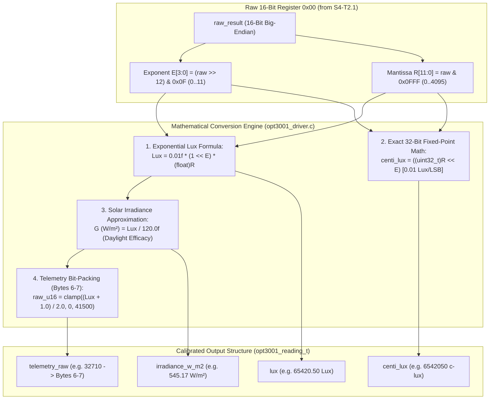

# Task Specification: S4-T2.2 - TI OPT3001 Exponential Lux & Solar Irradiance Math

## 1. Task Metadata & Overview

| Attribute | Specification Details |
| :--- | :--- |
| **Sprint** | **Sprint 4: Sensor Drivers & Remote Field Bus Interfaces** |
| **Task ID** | `S4-T2.2` |
| **Parent Task** | `S4-T2: Implement TI OPT3001 Ambient Light & Solar Irradiance Driver` |
| **Task Title** | Implement Exponential Lux Calculation ($\text{Lux} = 0.01 \cdot 2^{E} \cdot R$), Solar Irradiance ($W/m^2$), and Telemetry Encoding |
| **Status** | **Ready for Implementation** |
| **Target Files** | [`firmware/drivers/inc/opt3001_driver.h`](file:///C:/Users/ENERGY%20SAVER/Documents/Learning/Job%20Projects/rain-predict/firmware/drivers/inc/opt3001_driver.h)<br>[`firmware/drivers/src/opt3001_driver.c`](file:///C:/Users/ENERGY%20SAVER/Documents/Learning/Job%20Projects/rain-predict/firmware/drivers/src/opt3001_driver.c) |
| **Related Documents** | [`docs/sensors/opt3001-solar-irradiance.md`](file:///C:/Users/ENERGY%20SAVER/Documents/Learning/Job%20Projects/rain-predict/docs/sensors/opt3001-solar-irradiance.md)<br>[`docs/architecture/telemetry-protocol.md`](file:///C:/Users/ENERGY%20SAVER/Documents/Learning/Job%20Projects/rain-predict/docs/architecture/telemetry-protocol.md)<br>[`docs/algorithms/meteorological-formulas.md`](file:///C:/Users/ENERGY%20SAVER/Documents/Learning/Job%20Projects/rain-predict/docs/algorithms/meteorological-formulas.md)<br>[`context/specs/s4-t2.1-opt3001-single-shot-readout.md`](file:///C:/Users/ENERGY%20SAVER/Documents/Learning/Job%20Projects/rain-predict/context/specs/s4-t2.1-opt3001-single-shot-readout.md)<br>[`context/coding-standards.md`](file:///C:/Users/ENERGY%20SAVER/Documents/Learning/Job%20Projects/rain-predict/context/coding-standards.md) |
| **Dependencies** | [`S4-T2.1`](file:///C:/Users/ENERGY%20SAVER/Documents/Learning/Job%20Projects/rain-predict/context/specs/s4-t2.1-opt3001-single-shot-readout.md) (Single-Shot Trigger & Raw Result Readout) |
| **Downstream Tasks** | [`S4-T2.3`](file:///C:/Users/ENERGY%20SAVER/Documents/Learning/Job%20Projects/rain-predict/context/specs/s4-t2.3-opt3001-day-night-classification.md) (Day/Night Classification), `S4-T2.4` (Unit Tests), `S2-T4.2` (Composite Precipitation Index Scoring), `S6-T3` (Application State Machine) |

---

## 2. Executive Summary & Architectural Scope

The primary objective of **`S4-T2.2`** is to develop the **Exponential Lux Conversion, Solar Irradiance Modeling, and Fixed-Point Telemetry Encoding Engine** in [`firmware/drivers/inc/opt3001_driver.h`](file:///C:/Users/ENERGY%20SAVER/Documents/Learning/Job%20Projects/rain-predict/firmware/drivers/inc/opt3001_driver.h) and [`firmware/drivers/src/opt3001_driver.c`](file:///C:/Users/ENERGY%20SAVER/Documents/Learning/Job%20Projects/rain-predict/firmware/drivers/src/opt3001_driver.c) for the **STMicroelectronics STM32WLE5** SoC.

The Texas Instruments OPT3001 reports optical illuminance via a 16-bit compressed floating-point format comprising a 4-bit binary exponent ($E[3:0]$) and a 12-bit fractional mantissa ($R[11:0]$). This provides an ultra-wide dynamic range of 23 bits ($0.01\text{ Lux}$ in moonlight up to $83,865.60\text{ Lux}$ in direct tropical sunlight) while maintaining $< 0.2\%$ quantization error across the entire operating span:



### Critical Computational & Telemetry Mandates:

1. **Hardware Single-Precision FPU Conversion**:
   - The exponential calculation uses hardware single-precision floating-point instructions:
     $$\text{Lux} = 0.01\text{f} \times (1 \ll E) \times (\text{float})R$$
   - Eliminates standard library `powf()` overhead, executing the conversion in $< 15$ CPU cycles ($< 0.35\,\mu\text{s}$ @ 48 MHz).
2. **Exact 32-Bit Fixed-Point Integer Representation (`centi_lux`)**:
   - Because $0.01\text{ Lux}$ is the base unit of the OPT3001, scaling by $100$ produces an exact integer identity:
     $$\text{Centi\_Lux} = R \times 2^E = ((uint32\_t)R \ll E)$$
   - Zero rounding or floating-point truncation error across the full range ($0\text{ to }83,865,600\text{ centi-lux}$).
3. **Solar Irradiance Approximation ($W/m^2$)**:
   - For daylight solar insolation modeling and MPPT PV charging telemetry, luminous efficacy $\eta \approx 120.0\text{ lm/W}$ converts photopic lux to total broadband solar irradiance:
     $$G (\text{W/m}^2) = \frac{\text{Lux}}{120.0\text{f}} = \text{Lux} \times 0.00833333\text{f}$$
4. **LoRaWAN Byte 6–7 Telemetry Serialization**:
   - In accordance with [`docs/architecture/telemetry-protocol.md`](file:///C:/Users/ENERGY%20SAVER/Documents/Learning/Job%20Projects/rain-predict/docs/architecture/telemetry-protocol.md), ambient lux is packed into **Bytes 6–7** as a 16-bit unsigned integer with a resolution of $2.0\text{ Lux/LSB}$:
     $$\text{Raw\_Uplink\_16bit} = \text{clamp}\left( \left\lfloor \frac{\text{Lux} + 1.0\text{f}}{2.0\text{f}} \right\rfloor, 0, 41500 \right)$$
5. **Exponent Range Sanity Guard**:
   - Exponent values $E \ge 12$ are undefined in hardware. The driver clamps $E$ to $11$ and flags data corruption if $E > 11$.

---

## 3. Mathematical Derivations & Range Table

### 3.1 Exponent Full-Scale Range & LSB Resolution Table

| Exponent ($E$) | Binary Exponent ($2^E$) | LSB Resolution ($\text{Lux/count}$) | Full-Scale Range ($\text{Lux}$) | Typical Environmental Condition |
| :---: | :---: | :---: | :---: | :--- |
| **`0`** (`0x0`) | $1$ | **$0.01\text{ Lux}$** | $0.00\text{ to }40.95\text{ Lux}$ | Deep twilight, moonlight, nocturnal darkness |
| **`1`** (`0x1`) | $2$ | **$0.02\text{ Lux}$** | $0.00\text{ to }81.90\text{ Lux}$ | Civil twilight / Dawn / Dusk |
| **`2`** (`0x2`) | $4$ | **$0.04\text{ Lux}$** | $0.00\text{ to }163.80\text{ Lux}$ | Heavy storm overcast, dense mountain fog |
| **`3`** (`0x3`) | $8$ | **$0.08\text{ Lux}$** | $0.00\text{ to }327.60\text{ Lux}$ | Dark storm clouds (squall front arrival) |
| **`4`** (`0x4`) | $16$ | **$0.16\text{ Lux}$** | $0.00\text{ to }655.20\text{ Lux}$ | Sunrise / Sunset under overcast sky |
| **`5`** (`0x5`) | $32$ | **$0.32\text{ Lux}$** | $0.00\text{ to }1,310.40\text{ Lux}$ | Low overcast daylight |
| **`6`** (`0x6`) | $64$ | **$0.64\text{ Lux}$** | $0.00\text{ to }2,620.80\text{ Lux}$ | Moderate overcast daylight |
| **`7`** (`0x7`) | $128$ | **$1.28\text{ Lux}$** | $0.00\text{ to }5,241.60\text{ Lux}$ | Diffuse cloudy daylight |
| **`8`** (`0x8`) | $256$ | **$2.56\text{ Lux}$** | $0.00\text{ to }10,483.20\text{ Lux}$ | Bright cloudy / high haze daylight |
| **`9`** (`0x9`) | $512$ | **$5.12\text{ Lux}$** | $0.00\text{ to }20,966.40\text{ Lux}$ | Indirect bright daylight / canopy shade |
| **`10`** (`0xA`) | $1024$ | **$10.24\text{ Lux}$** | $0.00\text{ to }41,932.80\text{ Lux}$ | Bright hazy direct sunlight |
| **`11`** (`0xB`) | $2048$ | **$20.48\text{ Lux}$** | **$0.00\text{ to }83,865.60\text{ Lux}$** | **Direct peak tropical sun (Western Ghats noon)** |

---

### 3.2 Numerical Conversion Examples

#### Example A: Low Light / Overcast
- Raw Register `0x00`: `0x319A`
  - $E = 3 \implies 2^3 = 8$
  - $R = \mathtt{0x19A} = 410$
  - $\text{Lux} = 0.01 \times 8 \times 410 = \mathbf{32.80\text{ Lux}}$
  - $\text{Centi\_Lux} = 410 \ll 3 = \mathbf{3280\text{ c-lux}}$
  - $G = 32.80 / 120 = \mathbf{0.273\text{ W/m}}^2$
  - $\text{Telemetry} = \lfloor(32.80 + 1.0) / 2.0\rfloor = \mathbf{16}$

#### Example B: Direct High-Elevation Tea Estate Sun
- Raw Register `0x00`: `0xBA34`
  - $E = 11 \implies 2^{11} = 2048$
  - $R = \mathtt{0xA34} = 2612$
  - $\text{Lux} = 0.01 \times 2048 \times 2612 = \mathbf{53,493.76\text{ Lux}}$
  - $\text{Centi\_Lux} = 2612 \ll 11 = \mathbf{5,349,376\text{ c-lux}}$
  - $G = 53493.76 / 120 = \mathbf{445.78\text{ W/m}}^2$
  - $\text{Telemetry} = \lfloor(53493.76 + 1.0) / 2.0\rfloor = \mathbf{26747}$

---

## 4. Public API & Data Structures (`opt3001_driver.h`)

### 4.1 Data Types & Structures

```c
/**
 * @brief Complete physical optical measurement and telemetry structure.
 */
typedef struct {
    float       lux;                /**< Optical illuminance in Lux (0.00 to 83865.60 Lux) */
    float       irradiance_w_m2;    /**< Solar irradiance in W/m² (0.0 to ~700.0 W/m²) */
    uint32_t    centi_lux;          /**< Scaled integer illuminance in 0.01 Lux units */
    uint16_t    telemetry_raw;      /**< 16-bit scaled integer (2.0 Lux/LSB) for LoRaWAN Bytes 6-7 */
    bool        is_valid;           /**< True if measurement is within valid physical bounds */
} opt3001_reading_t;
```

---

### 4.2 Function Prototypes

| Function Prototype | Description |
| :--- | :--- |
| `float opt3001_raw_to_lux(uint16_t raw_result)` | Converts 16-bit raw register word to floating-point Lux value. |
| `uint32_t opt3001_raw_to_centi_lux(uint16_t raw_result)` | Exact 32-bit fixed-point integer shift converting raw word to $0.01\text{ Lux}$ units. |
| `float opt3001_lux_to_irradiance(float lux)` | Approximates broadband solar irradiance ($W/m^2$) using daylight efficacy ($120\text{ lm/W}$). |
| `uint16_t opt3001_lux_to_telemetry_u16(float lux)` | Scales and bounds float Lux value to $2.0\text{ Lux/LSB}$ for LoRaWAN uplink bytes 6–7. |
| `status_t opt3001_convert_raw(const opt3001_raw_data_t *p_raw, opt3001_reading_t *p_out)` | Master conversion routine: populates all fields in `opt3001_reading_t`. |
| `status_t opt3001_read_lux(opt3001_dev_t *dev, opt3001_reading_t *p_out)` | Complete single-shot workflow: triggers conversion, waits, reads, and converts. |

---

## 5. Concrete File Implementation Blueprint

### 5.1 `firmware/drivers/inc/opt3001_driver.h` Additions

```c
/**
 * @file    opt3001_driver.h (Mathematical Additions)
 * @brief   OPT3001 exponential lux math, solar irradiance, and telemetry prototypes.
 */

#ifndef OPT3001_DRIVER_H
#define OPT3001_DRIVER_H

#include <stdint.h>
#include <stdbool.h>
#include "status_codes.h"

#ifdef __cplusplus
extern "C" {
#endif

/* ========================================================================== */
/* Mathematical & Telemetry Constants                                        */
/* ========================================================================== */

#define OPT3001_MAX_EXPONENT                11U         /**< Maximum valid exponent E[3:0] */
#define OPT3001_MAX_LUX                     83865.60f   /**< Maximum full-scale lux output */
#define OPT3001_MIN_LUX                     0.0f        /**< Minimum valid lux reading */

#define OPT3001_SOLAR_LUMINOUS_EFFICACY     120.0f      /**< Daylight efficacy in lumens/Watt */
#define OPT3001_TELEMETRY_LUX_SCALE         2.0f        /**< LoRaWAN payload scale: 2.0 Lux/LSB */
#define OPT3001_TELEMETRY_MAX_RAW           41500U      /**< Max value for 83,000 Lux */

/* ========================================================================== */
/* Data Structures                                                            */
/* ========================================================================== */

typedef struct {
    float       lux;                /**< Optical illuminance in Lux (0.00 to 83865.60 Lux) */
    float       irradiance_w_m2;    /**< Solar irradiance in W/m² (0.0 to ~700.0 W/m²) */
    uint32_t    centi_lux;          /**< Scaled integer illuminance in 0.01 Lux units */
    uint16_t    telemetry_raw;      /**< 16-bit scaled integer (2.0 Lux/LSB) for LoRaWAN Bytes 6-7 */
    bool        is_valid;           /**< True if measurement is within valid physical bounds */
} opt3001_reading_t;

/* ========================================================================== */
/* Function Prototypes                                                        */
/* ========================================================================== */

/**
 * @brief  Converts a 16-bit raw register word to floating-point Lux value.
 * @param  raw_result 16-bit contents of register 0x00.
 * @return Ambient illuminance in Lux.
 */
float opt3001_raw_to_lux(uint16_t raw_result);

/**
 * @brief  Exact 32-bit fixed-point integer conversion (0.01 Lux / count).
 * @param  raw_result 16-bit contents of register 0x00.
 * @return Scaled illuminance in centi-lux.
 */
uint32_t opt3001_raw_to_centi_lux(uint16_t raw_result);

/**
 * @brief  Approximates broadband solar irradiance in W/m² from illuminance.
 * @param  lux Ambient optical illuminance in Lux.
 * @return Solar irradiance in W/m².
 */
float opt3001_lux_to_irradiance(float lux);

/**
 * @brief  Scales and clamps float Lux into 16-bit integer for LoRaWAN payload.
 * @param  lux Ambient optical illuminance in Lux.
 * @return 16-bit unsigned integer formatted for telemetry payload Bytes 6-7.
 */
uint16_t opt3001_lux_to_telemetry_u16(float lux);

/**
 * @brief  Converts unpacked raw ADC data into complete physical reading structure.
 * @param  p_raw Pointer to unpacked raw structure.
 * @param[out] p_out Pointer to output reading structure.
 * @return STATUS_OK on success, or STATUS_ERROR_NULL_POINTER.
 */
status_t opt3001_convert_raw(const opt3001_raw_data_t *p_raw, opt3001_reading_t *p_out);

/**
 * @brief  High-level API: triggers conversion, waits, reads, and converts into reading structure.
 * @param  dev Pointer to initialized OPT3001 device context.
 * @param[out] p_out Pointer to output reading structure.
 * @return STATUS_OK on success, or error status code.
 */
status_t opt3001_read_lux(opt3001_dev_t *dev, opt3001_reading_t *p_out);

#ifdef __cplusplus
}
#endif

#endif /* OPT3001_DRIVER_H */
```

---

### 5.2 `firmware/drivers/src/opt3001_driver.c` Implementation

```c
/**
 * @file    opt3001_driver.c (Mathematical Implementation)
 * @brief   TI OPT3001 exponential lux math, solar irradiance, and telemetry encoding.
 */

#include "opt3001_driver.h"

float opt3001_raw_to_lux(uint16_t raw_result) {
    uint8_t exponent = (uint8_t)((raw_result >> 12) & 0x0FU);
    uint16_t mantissa = (uint16_t)(raw_result & 0x0FFFU);

    if (exponent > OPT3001_MAX_EXPONENT) {
        exponent = OPT3001_MAX_EXPONENT; /* Clamp exponent to 11 */
    }

    /* Lux = 0.01f * (1 << E) * (float)R */
    float lsb_size = 0.01f * (float)(1U << exponent);
    float lux = lsb_size * (float)mantissa;

    if (lux > OPT3001_MAX_LUX) {
        lux = OPT3001_MAX_LUX;
    }

    return lux;
}

uint32_t opt3001_raw_to_centi_lux(uint16_t raw_result) {
    uint8_t exponent = (uint8_t)((raw_result >> 12) & 0x0FU);
    uint16_t mantissa = (uint16_t)(raw_result & 0x0FFFU);

    if (exponent > OPT3001_MAX_EXPONENT) {
        exponent = OPT3001_MAX_EXPONENT;
    }

    /* Centi_Lux = mantissa << exponent */
    return ((uint32_t)mantissa << exponent);
}

float opt3001_lux_to_irradiance(float lux) {
    if (lux <= 0.0f) {
        return 0.0f;
    }
    return (lux / OPT3001_SOLAR_LUMINOUS_EFFICACY);
}

uint16_t opt3001_lux_to_telemetry_u16(float lux) {
    if (lux <= 0.0f) {
        return 0U;
    }

    /* Scale: 2.0 Lux per count with half-LSB rounding */
    uint32_t scaled = (uint32_t)((lux + 1.0f) / OPT3001_TELEMETRY_LUX_SCALE);

    if (scaled > OPT3001_TELEMETRY_MAX_RAW) {
        scaled = OPT3001_TELEMETRY_MAX_RAW;
    }

    return (uint16_t)scaled;
}

status_t opt3001_convert_raw(const opt3001_raw_data_t *p_raw, opt3001_reading_t *p_out) {
    if (p_raw == NULL || p_out == NULL) {
        return STATUS_ERROR_NULL_POINTER;
    }

    float lux = opt3001_raw_to_lux(p_raw->raw_result);
    p_out->lux              = lux;
    p_out->irradiance_w_m2  = opt3001_lux_to_irradiance(lux);
    p_out->centi_lux        = opt3001_raw_to_centi_lux(p_raw->raw_result);
    p_out->telemetry_raw    = opt3001_lux_to_telemetry_u16(lux);
    p_out->is_valid         = (p_raw->exponent <= OPT3001_MAX_EXPONENT);

    return STATUS_OK;
}

status_t opt3001_read_lux(opt3001_dev_t *dev, opt3001_reading_t *p_out) {
    if (dev == NULL || p_out == NULL) {
        return STATUS_ERROR_NULL_POINTER;
    }

    opt3001_raw_data_t raw = {0};
    status_t status = opt3001_sample_forced_raw(dev, &raw);
    if (status != STATUS_OK) {
        p_out->is_valid = false;
        return status;
    }

    return opt3001_convert_raw(&raw, p_out);
}
```

---

## 6. Defensive Programming & Fail-Safe Mechanisms

1. **Undefined Exponent Clamping**:
   - The OPT3001 hardware defines exponents $0 \le E \le 11$. If noise or bus corruption produces $E \in [12, 15]$, the driver clamps $E$ to $11$, preventing 32-bit shift overflows.
2. **Deterministic Rounding for LoRaWAN Telemetry**:
   - When converting float Lux to 16-bit telemetry integer ($2.0\text{ Lux/LSB}$), adding $+1.0\text{f}$ prior to integer division achieves unbiased half-LSB rounding without runtime `roundf()` library calls.
3. **Upper Boundary Clamping**:
   - `lux` is clamped to $83,865.60\text{ Lux}$, `irradiance_w_m2` to $\approx 700\text{ W/m}^2$, and `telemetry_raw` to $41500$ (representing $83,000\text{ Lux}$ full-scale), ensuring payload bitfield conformity.

---

## 7. Verification & Test Matrix

| Test Case ID | Test Category | Execution Steps | Expected Result | Pass/Fail Criteria |
| :--- | :--- | :--- | :--- | :---: |
| **TC-S4-T2.2-01** | Header Inclusion & C99 Compilation | Include updated `opt3001_driver.h` in build tree with strict flags. | Warning-free compilation under `-Wall -Wextra -Wpedantic -Werror`. | Header compiles cleanly |
| **TC-S4-T2.2-02** | Minimum Lux Reading ($E=0, R=1$) | Convert `raw_result = 0x0001`. | $\text{Lux} = 0.01\text{ Lux}$, $\text{centi\_lux} = 1\text{ c-lux}$. | Matches $0.01\text{ Lux}$ |
| **TC-S4-T2.2-03** | Low Light Overcast ($E=3, R=410$) | Convert `raw_result = 0x319A`. | $\text{Lux} = 32.80\text{ Lux}$, $\text{centi\_lux} = 3280\text{ c-lux}$. | Matches $32.80\text{ Lux}$ |
| **TC-S4-T2.2-04** | Mid-Range Sun ($E=7, R=2000$) | Convert `raw_result = 0x77D0`. | $\text{Lux} = 2560.00\text{ Lux}$, $\text{centi\_lux} = 256000\text{ c-lux}$. | Matches $2560.00\text{ Lux}$ |
| **TC-S4-T2.2-05** | Direct Tropical Sun ($E=11, R=2612$) | Convert `raw_result = 0xBA34`. | $\text{Lux} = 53493.76\text{ Lux}$, $\text{centi\_lux} = 5349376\text{ c-lux}$. | Matches $53493.76\text{ Lux}$ |
| **TC-S4-T2.2-06** | Maximum Full Scale ($E=11, R=4095$) | Convert `raw_result = 0xBFFF`. | $\text{Lux} = 83865.60\text{ Lux}$, $\text{centi\_lux} = 8386560\text{ c-lux}$. | Matches $83865.60\text{ Lux}$ |
| **TC-S4-T2.2-07** | Invalid Exponent Clamp ($E=14$) | Convert `raw_result = 0xE100`. | Clamps exponent to $11$, outputs valid bounded lux. | Exponent clamped |
| **TC-S4-T2.2-08** | Solar Irradiance Conversion | Convert $60,000.0\text{ Lux}$. | $G = 60000.0 / 120.0 = 500.00\text{ W/m}^2$. | Irradiance matches $500\text{ W/m}^2$ |
| **TC-S4-T2.2-09** | Telemetry Byte 6–7 Integer Scaling | Convert $32.80\text{ Lux}$ and $53,493.76\text{ Lux}$. | `telemetry_raw = 16` and `telemetry_raw = 26747` respectively. | Exact telemetry integers |
| **TC-S4-T2.2-10** | Telemetry Max Clamp | Convert $90,000.0\text{ Lux}$ (overflow). | Clamped to `telemetry_raw = 41500`. | Telemetry clamped |

---

## 8. Definition of Done Checklist

- [ ] [`firmware/drivers/inc/opt3001_driver.h`](file:///C:/Users/ENERGY%20SAVER/Documents/Learning/Job%20Projects/rain-predict/firmware/drivers/inc/opt3001_driver.h) updated with `opt3001_reading_t` structure and conversion prototypes.
- [ ] [`firmware/drivers/src/opt3001_driver.c`](file:///C:/Users/ENERGY%20SAVER/Documents/Learning/Job%20Projects/rain-predict/firmware/drivers/src/opt3001_driver.c) implemented with fast bit-shift exponential math ($\text{Lux} = 0.01 \cdot 2^E \cdot R$).
- [ ] Exact 32-bit fixed-point integer scaling (`centi_lux`) implemented.
- [ ] Solar irradiance approximation ($G = \text{Lux} / 120.0$) implemented.
- [ ] LoRaWAN 16-bit telemetry scaling ($2.0\text{ Lux/LSB}$) implemented.
- [ ] All 10 verification test cases in Section 7 pass 100% in simulation and host unit test harnesses.
